Docker源码分析

[TOC]

基于Docker1.2.0版本

# 第1章 Docker架构


## Docker总结构图


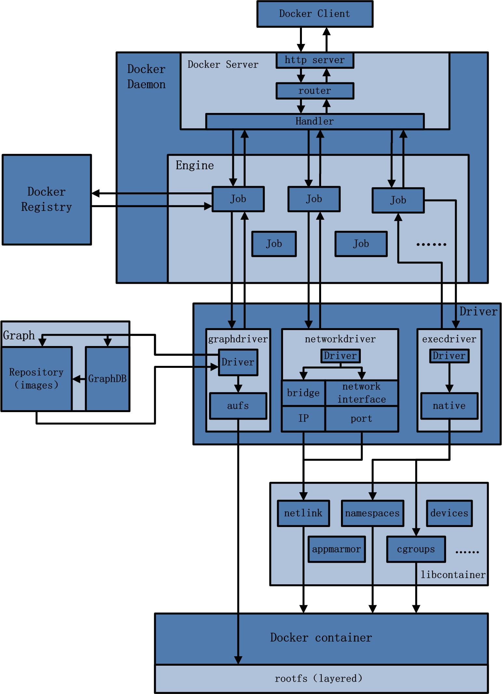


## Docker Daemon架构示意图


## Docker Server架构示意图


## Graph架构示意图


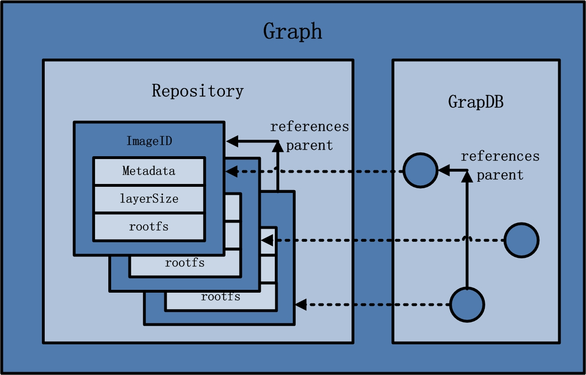


# 第9章 Docker镜像下载

## Docker镜像下载流程

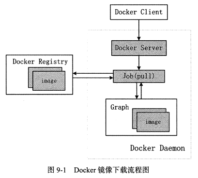

- 命令：`docker pull ubuntu:14.04`
- 步骤：
  - 1.用户通过Docker Client发送pull命令，用于让Docker Daemon下载指定名称的镜像
  - 2.Docker Server接收Docker镜像的pull请求，创建下载镜像任务并触发执行
  - 3.Docker Daemon执行镜像下载任务，从Docker Register中下载指定镜像，并将其存储于本地Graph中

## Docker Client

- 主要函数：DockerCli的`CmdPull()`

- 步骤：

  - (1).解析命令中与Docker相关的参数（tag、remote、v、hostname）
  - (2).配置Docker下载镜像时所需的认证信息（authConfig）
  - (3).发送RESTful请求至Docker Daemon（`job.Run()`、`"POST","/images/create?"+v.Encode()`）

  ```
  源码：docker/api/client/commands.go

  func (cli *DockerCli) CmdPull(args ...string)
  	---> tag := cmd.String()	//(1)
  	---> v      = url.Values{}	//(1)
  	---> remote = cmd.Arg(0)	//(1)
  	---> hostname, _, err := registry.ResolveRepositoryName(remote)	//(1)
  	---> authConfig := cli.configFile.ResolveAuthConfig(hostname)	//(2)
  	---> pull := func(authConfig registry.AuthConfig) error {}	//(3)
  		---> return cli.stream("POST", "/images/create?"+v.Encode()...}
  	---> if err := pull(authConfig);	//(3)
  ```


## Docker Server

- 步骤：
  - (1).解析HTTP请求中包含的请求参数：URL中大查询参数、HTTP Header中的认证信息
  - (2).创建镜像下载Job、并为该Job配置环境变量
  - (3).触发执行镜像下载Job

```
源码：docker/api/server/server.go

总过程：DockerCli.CmdPull() ---> postImagesCreate()

func postImagesCreate(...) error
	---> image、repo、tag、job	//(1)
	---> authConfig :=	//(1)
	---> job = eng.Job("pull", image, tag)	//(2)
	--- >if err := job.Run();	//(3)
	
```
## Docker Daemon

- 主要函数：`job.Run`  --->  Graph的`CmdPull()`

- 步骤

  - (1).解析Job参数（repository、tag、Docker Registry）
  - (2).Docker Daemon与Docker Registry建立会话（session）
  - (3).通过会话下载镜像
  - (4).Docker镜像下载至本地并存储于Graph（`s.pullRepository`）
  - (5).在TagStore中标记该镜像`s.Set()`

- image组成：

  - image json：元数据，比如Dockerfile中的ENV、暴露的端口，用来给容器内部进程配置环境，动态数据
  - image layer：实际内容，静态数据

- (4)Docker镜像下载至本地并存储与Graph、(5)在TagStore中标记该镜像的具体过程：

  - (4)Docker镜像下载至本地并存储与Graph

  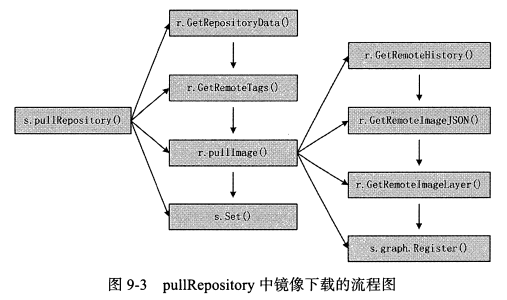

  - (5)在TagStore中标记该镜像的具体过程，即`s.Set()`

  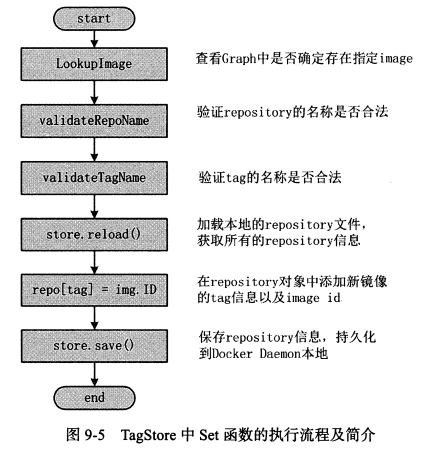


```
源码：docker/graph/pull.go

总流程：DockerCli.CmdPull() ---> postImagesCreate()--->TagStore.CmdPull()

func (s *TagStore) CmdPull() engine.Status
	---> localName、tag、authConfig	//(1)
	---> s.poolAdd	(1)：禁止下载中被的DockerClient发出相同的请求
	---> registry.NewSession()	//(2):创建session对象，与registry建立数据连接，用r进行数据传输
	---> s.pullRepository()	//(3):执行镜像下载
		---> r.GetRepositoryData() //获取指定repository中所有镜像的ID信息，存入RepositoryData的ImgList中
		---> r.GetRemoteTags() //获取指定repository的所有Tag信息
		---> s.pullImage()	//(4):从Docker Register下载Docker镜像
			---> r.GetRemoteHistory()	//获取指定image所有祖先镜像的ID信息
			---> r.GetRemoteImageJSON()	//获取指定image的json信息
			---> r.GetRemoteImageLayer() //获取指定image的layer信息
			---> s.graph.Register()	//将下载的镜像在TagStore的Graph中注册
		---> s.Set()	//(5):配置TagStore
			---> store.LookupImage(imageName) //查看Graph中是否确定存在指定image
			---> validateRepoName() //验证repository的名称是否合法
			---> validateTagName() //验证tag的名称是否合法
			---> store.reload() //加载本地的repository文件
			---> repo[tag] = img.ID //在repository对象中添加新镜像的tag信息以及image id
			---> return store.save() //保存repository信息，持久化到Docker Daemon本地
			
```


# 第10章 Docker镜像存储

先了解一个目录下分别有什么内容：

```
/var/lib/docker/graph/ --> json、镜像大小
/var/lib/docker/aufs/layers ---> 每个镜像的元数据，这些元数据是这个镜像的祖先镜像ID列表
/var/lib/docker/aufs/diff ---> 每个镜像所在的layer，具体包含的文件系统内容，下载的镜像中与文件系统相关的内容，都会存在diff下的某个镜像ID目录下
/var/lib/docker/aufs/mnt ---> mnt：目录下的每个文件都是一个镜像ID，代表该层镜像之上挂载的可读写layer
```


## 镜像注册

- **镜像注册**主要分为4个步骤

  - 验证镜像ID的有效性
  - 创建镜像存储路径
  - 存储镜像内容
  - 在Graph中注册镜像ID

  ​

  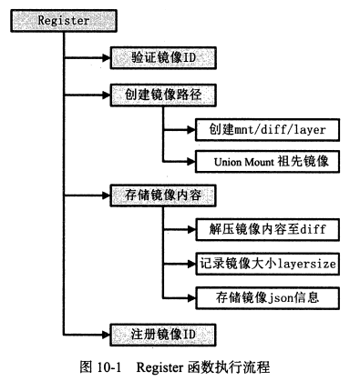


## 验证镜像ID

- 步骤：
  - 验证镜像合法性
  - 验证镜像是否已存在
  - 初始化镜像目录
    - 做法：删除一些冲突目录
    - 目的：使得后续Docker镜像存储时存储路径不会冲突

## 创建镜像路径

- 步骤（以aufs为例）
  - 创建mnt、diff、layers子目录
  - 挂载祖先镜像并返回根目录
- aufs目录地址
  - 镜像存放目录：`/var/lib/docker/aufs/diff`
  - 镜像挂载目录：`/var/lib/docker/aufs/mnt`
- 目录说明：
  - layers：每个镜像的元数据，这些元数据是这个镜像的祖先镜像ID列表
  - diff：每个镜像所在的layer，具体包含的文件系统内容，下载的镜像中与文件系统相关的内容，都会存在diff下的某个镜像ID目录下
  - mnt：目录下的每个文件都是一个镜像ID，代表该层镜像之上挂载的可读写layer


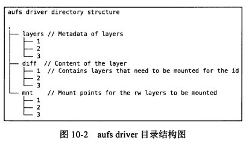

## 挂载祖先镜像并返回根目录

- 步骤：
  - 获取aufs/mnt/image_ID目录（RW层所在路径）
  - 如果不是基础镜像，挂载父类镜像


## 存储镜像内容

- 主要函数`image.StoreImage(img, jsonData, layerData, tmp, rootfs);`
- 参数分析：

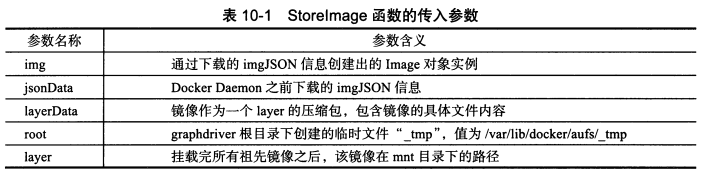

- 步骤：

  - 1.解压镜像内容layerData至diff目录（StoreImage传入的镜像内容layerData是一个压缩包），解压的diff目录如下图所示。
    - 将其解压至aufs/diff/image_ID目录下
    - 开启镜像磁盘空间统计任务

  ​

  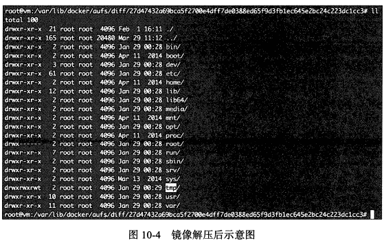

  ​

  - 2.收集镜像所占空间大小，并记录
    - 将镜像大小收集，更新img的Size属性
    - 将镜像大小写入root，由于传入的是`_temp`，因此存入`_temp`。具体的做法为：在临时文件`/var/lib/docker/graph/_temp/layersize`写入`img.Size`
  - 3.将jsonData写入临时文件
    - 将json写入`/var/lib/docker/graph/_temp/json`

## 注册镜像ID

- 知识点：`TruncIndex`：Docker用户指定镜像ID的前缀，只要前缀满足在全局所有的镜像ID中唯一，Docker Daemon就可以通过TruncIndex定位到唯一的镜像ID
- 步骤：
  - 将`/var/lib/docker/graph/_temp`重命名为`/var/lib/docker/graph/`
  - 添加镜像ID至graph.idIndex，即添加到TruncIndex


```
源码：docker/graph/pull.go

其实是接上一章的s.graph.Register()

s.graph.Register(jsonData,layerData,img) 
	---> utils.ValidateID(img.ID) //验证镜像合法性
	---> graph.Exists(img.ID) //验证镜像是否已存在
	---> os.RemoveAll() //初始化镜像目录
	---> graph.driver.Create(img.ID, img.Parent) //调用aufs的Create,在aufs.go
		---> a.createDirsFor(id); //创建mnt、diff,再根据镜像ID创建镜像文件夹，aufs/mnt/image_ID,aufs/diff/image_ID
		---> os.Create(path.Join(a.rootPath(), "layers", id)) //写入层元数据,即写入到aufs/layers/image_ID下，将祖先镜像的镜像ID写入该镜像ID文件中
	---> rootfs, err := graph.driver.Get(img.ID, "") //挂载祖先镜像并返回根目录aufs/mnt/image_ID，调用aufs的Get，在aufs.go
		---> count := a.active[id] //获取镜像的引用数（有可能多个容器在用）
		---> out := path.Join(a.rootPath(), "diff", id) //如果不是基础镜像，挂载父镜像
	---> image.StoreImage() 
		---> differ.ApplyDiff(img.ID, layerData) //将layerData解压至aufs/diff/image_ID
		---> differ.DiffSize(img.ID) //开启镜像磁盘空间统计任务
		---> img.Size = size //更新img的Size属性
		---> img.SaveSize(root) //将镜像大小写入临时目录
		---> ioutil.WriteFile(jsonPath(root), jsonData, 0600) //将json写入临时目录
		---> os.Rename(tmp, graph.ImageRoot(img.ID)) //commit，重命名临时目录
		---> graph.idIndex.Add(img.ID) //将镜像ID添加至TruncIndex
	
```


# 第11章 Docker build实现

- docker build：通过一个Dockerfile文件以及相关内容，从一个基础镜像起步，对Dockerfile中的每一条命令，都在原先的镜像layer之上再额外构建一个新的镜像layer，直至构建出用户所需的镜像

## docker build执行流程

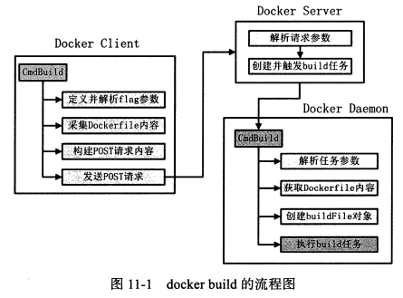

### Docker client与docker build


#### 1.定义并解析flag参数

#### 2.获取Dockerfile相关内容

- 获取Dockerfile的方式
  - 本地
  - STDIN
  - 远程：URL
  - git
- 解析Dockerfile源并构建context信息的流程图


#### 3.构建REST请求参数

#### 4.发送POST请求

```
源码：docker/api/client/command.go

func (cli *DockerCli) CmdBuild(args) error
	---> tag、suppressOutput、noCache、rm、forceRm //定义并解析flag参数
	---> context //根据Dockerfile构造的context信息
	---> body = utils.ProgressReader(context,...) //根据context生成请求体
	---> v.Set("t", *tag) //设置flag参数
	---> cli.stream("POST", fmt.Sprintf("/build?%s", v.Encode()), body,...) //发送POST请求至Docker Server
```

### Docker Server与docker build

```
源码：docker/api/server/server.go

createRouter
	--->"POST":"/build": 
		---> postBuild
			---> 解析请求参数
			---> eng.Job("build") //创建Job
			---> job.Stdin.Add(r.Body) //以job自身标准输入的形式将Dockerfile添加到job内部
			---> job.Run() //执行job.Run
```

### Docker Daemon与docker build

- Docker Daemon获取context的流程图（有三种方式）：


- buildFile：相当于一个生产镜像车间，只要有原料（Dockerfile）输入，它就可以按照要求为用户生产Docker镜像，build结构体相关属性如下：

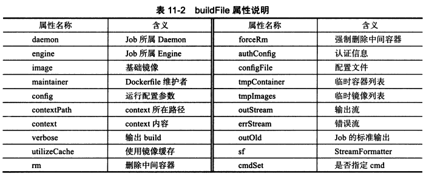

- b.Build之后的事情：
  - Docker Daemon响应Docker Server
  - Docker Server响应Docker Client 

```
源码：docker/daemon/build.go

func (daemon *Daemon) CmdBuild(job *engine.Job)
	---> noCache、rm、authConfig、context //解析job环境变量
	---> context //根据三种方式之一获取context
	---> b := NewBuildFile(daemon,...) //根据noCache等参数创建buildFile对象
	---> id, err := b.Build(context) //buildFile根据context创建镜像并返回镜像ID
	---> daemon.Repositories().Set(repoName, tag, id, false) //将镜像ID注册到Repository中
```


## Docker命令解析流程

- 执行流程如下：

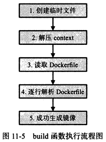

- Dockerfile例子：

```
FROM ubuntu:14.04
MAINTAINER Allen Sun allen.sun@daocloud.com
RUN apt-get update
CMD ["/bin/bsh"]
```


```
源码：docker/daemon/build.go

func (b *buildFile) Build(context io.Reader)
	---> tmpdirPath, err := ioutil.TempDir("", "docker-build") //创建临时文件
	---> decompressedStream, err := archive.DecompressStream(context) //解压context
	---> dockerfile = lineContinuation.ReplaceAllString() //读取Dockerfile
	---> for _, line := range strings.Split(dockerfile, "\n") //逐行解析Dockerfile
		---> line = strings.Trim() //对每一行进行预处理
		---> b.BuildStep(fmt.Sprintf("%d", stepN), line) //从line中解析相应的Dockerfile命令，完成构建一个镜像layer的任务
			---> tmp := strings.SplitN(expression, " ", 2) //如，将"FROM"和 "ubuntu:14.04"分离
			---> instruction := //获得命令类型，如FROM
			---> arguments := //获得命令参数，如ubuntu:14.04
			---> method, exists := reflect.TypeOf(b).MethodByName(instruction...) //利用golang的反射机制获取具体的执行方法
			---> ret := method.Func.Call(reflect.ValueOf(arguments)...) //根据获取的方法，传入参数，完成一条Dockerfile执行的指令
```

## Dockerfile命令分析

- Dockerfile每一条命令（FROM命令除外）都会构建一个新的image
- Dockerfile分为两类
  - 1.修改镜像：
    - RUN：基于上一层image的容器中运行一条命令，可能修改镜像
    - ADD：在Dockerfile所在目录的context中复制内容至上一层image，可能修改镜像
    - COPY
  - 2.修改Config
    - ENV：作为进程的环境变量加载
    - EXPOSE：进程会监听EXPOSE的端口号
    - CMD
    - ENTRYPOINT
    - MAINTAINER

### FROM命令

- 步骤如图：


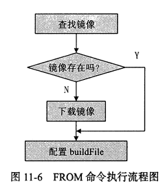

```
源码：docker/daemon/build.go

func (b *buildFile) CmdFrom(name string)
	---> image, err := b.daemon.Repositories().LookupImage(name) //在Repo中查找镜像
	---> if b.daemon.Graph().IsNotExist(err) //如果本地查找不到，则pull
		---> job := b.eng.Job("pull", remote, tag)
		---> job.Run()
	---> b.image = image.ID //获得镜像后，将ID值传给buildFile的image属性，第二条命令可以在此基础镜像上来完成，image会随着build的流程的变化而变化
	---> b.config = image.Config //如果image.Config不为空，也赋给buildFile
	---> b.config.OnBuild = //配置buildFile的OnBuild属性
```

### RUN命令

- 与其他修改镜像config信息的命令的区别：
  - 需要在镜像基础上执行动态的命令，执行命令时存在“容器”的概念
- 步骤如图：

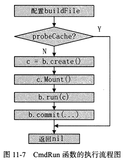

#### 1.镜像cahe机制（probeCache）

- 原理：根据buildFile的属性image（基础镜像的ID或后续覆盖基础镜像的镜像ID）和buildFile的config属性，遍历本地所有镜像，只要存在一个镜像，此镜像的父镜像ID与当前buildFile的image值相等（父类比较，累积比较），且此镜像的config内容与正在构建的RUN命令的buildFile.config相同，则认为正在构建的RUN命令产生的结果与此镜像的结果一致，可以直接使用本地存储的镜像。若不存在，则完整地执行RUN

#### 2.创建Container对象

- 创建Container对象，为运行容器做准备
- 需要的信息：
  - 基础镜像的ID
  - 运行容器所需的runconfig

#### 3.挂载文件系统

- 为何需要挂载？
  - RUN命令需要在容器中运行指定的程序，仅仅创建Container类型实例c还不够，需要为容器的运行挂载文件系统
- 怎么做？
  - 根据Container实例中的镜像ID，获得所有祖先镜像，通过指定的graphdriver完全联合起来，挂载到一个目录下
  - 而后容器运行将用该挂载点作为容器的根目录

#### 4.运行容器

- 效果：利用c中众多的容器配置信息，将Docker容器运行起来
- 需要做的工作：
  - 创建容器的文件系统
  - 创建容器的命名空间进行资源隔离
  - 为容器配置cgroups参数进行资源控制
  - 运行用户指定的程序

#### 5.提交新镜像

- 效果：将更改后的top layer制作成一个新镜像，并有效存储。RUN命令的commit操作是从一个运行完毕的容器中保存文件系统的Read-Write层，以一个镜像的形式存入本地graph中
- `b.daemon.Commit`的工作：
  - 暂停Docker Container的运行（对RUN不起作用，因为RUN命令的容器已经运行完毕并终止）
  - 把容器文件系统的Read-Write层打包tar
  - 创建image对象，并在Graph中注册，需要的信息
    - tar包
    - 众多配置信息
  - 在repositories中注册新创建的镜像，repositories实则为TagStore，TagStore的repositories属性存储了image的信息，方便用户快速查找

```
源码： docker/daemon/build.go

func (b *buildFile) CmdRun(args string)
	---> hit, err := b.probeCache() //查找本地镜像，如果找到了直接返回；没找到才执行下面步骤
	---> c, err := b.create() //创建Container
	---> c.Mount() //挂载文件系统
	---> b.run(c) //运行容器
	---> b.commit(c.ID, cmd, "run") //提交新镜像
		---> image, err := b.daemon.Commit(container,...)
		---> b.image = image.ID //将新构建的镜像的ID作为下一个Dockerfile命令执行的基础镜像
```

```
hit, err := b.probeCache()
	---> cache, err := b.daemon.ImageGetCached(b.image, b.config)
		---> images, err := daemon.Graph().Map() //找到父节点配的镜像
			---> graph.walkAll() //遍历森林中的树
		---> runconfig.Compare() //遍历匹配的父节点的镜像中，是否有config与自己匹配
```


### ENV命令

- 含义：构建镜像时，为镜像添加一个环境变量
- 作用：在buildFile.image的基础上，配置指定buildFile.config中的Env参数，随后执行commit。
- 是否创建镜像
  - 也会创建一个新的镜像，并运行完daemon包中Commit函数
  - 虽然创建镜像过程中不会有新的文件系统变化，但对于镜像而言，镜像的json信息已经发生明显的变化，即镜像的json信息中ENV部分被修改
- 是否创建容器
  - 创建容器，在commit中创建，但不启动，只是在静态时修改它的config，然后commit

```
源码： docker/daemon/build.go

func (b *buildFile) CmdEnv(args string)
	---> b.commit("", b.config.Cmd, fmt.Sprintf("ENV %s", replacedVar)) //创建新镜像
		---> if id == ""
			---> container, warnings, err := b.daemon.Create(b.config, "") //创建容器
			---> image, err := b.daemon.Commit(container,...) //提交镜像
```

# 第12章 Docker容器创建

主要工作分为两部分：

- 1.创建Docker容器对象，并为容器准备所需的rootfs（create请求）
- 2.创建容器的运行环境，如网络环境、资源限制等，最终真正地运行用户指令（start请求）

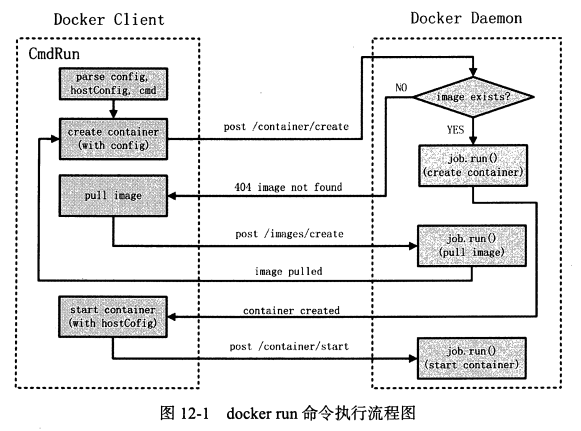

## 12.3 Docker Daemon创建容器对象

主要分为以下几步：

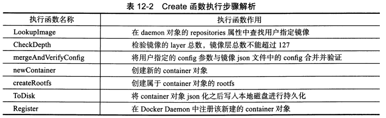

```
源码： docker/daemon/create.go

func (daemon *Daemon) Create(config, name) (*Container)
	---> container *Container
	---> img := daemon.repositories.LookupImage(config.Image)
	---> img.CheckDepth()
	---> daemon.mergeAndVerifyConfig(config, img)
	---> container = daemon.newContainer(name, config, img)
	---> daemon.createRootfs(container, img) //在联合挂载所有镜像layer的基础上，再挂载init layer和read write layer
		---> graph.SetupInitLayer(initPath) //init layer，与容器运行环境相关的目录和文件，如/dev/pts、proc、.dockerinit（二进制文件挂载点，是容器中一个运行的内容）、/etc/hosts、etc/hostname以及/etc/resolv.conf
	---> container.ToDisk() //json、hostConfig持久化到/var/lib/docker/container/containers/<container_id>
	---> daemon.Register(container) //将container注册到daemon的containers属性，让Daemon方便管理
```

### 12.3.1 LookupImage

- 功能：通过用户指定的镜像名称，从daemon的repositpries对象中查找镜像

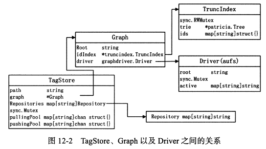

- Daemon每次成功下载含有tag的镜像或构建成功一个镜像，最后的步骤都是将这个镜像在Daemon.Repositories中注册，若为aufs，则镜像会注册写入`/var/lib/docker/repositories-aufs`文件中。repositories的存在使得LookImage变得简单。

```
源码： docker/graph/tags.go

func (store *TagStore) LookupImage(name string) (*image.Image)
	---> repos, tag := parsers.ParseRepositoryTag(name) //如果tag为空，默认为latest
	---> img, err := store.GetImage(repos, tag)
		---> repo, err := store.Get(repoName)
		---> revision, exists := repo[tagOrID]
		---> return store.graph.Get(revision) //获取镜像的diff目录
			---> ids, err := getParentIds(a.rootPath(), id)
			---> out := path.Join(a.rootPath(), "diff", id)
			---> out = path.Join(a.rootPath(), "mnt", id) //挂载父镜像
			---> return out, nil
```

### 12.3.4 NewContainer

```go
container := &Container{
		// FIXME: we should generate the ID here instead of receiving it as an argument
		ID:              id,
		Created:         time.Now().UTC(),
		Path:            entrypoint,
		Args:            args, //FIXME: de-duplicate from config
		Config:          config,
		hostConfig:      &runconfig.HostConfig{},
		Image:           img.ID, // Always use the resolved image id
		NetworkSettings: &NetworkSettings{},
		Name:            name,
		Driver:          daemon.driver.String(),
		ExecDriver:      daemon.execDriver.Name(),
		State:           NewState(),
	}
```

## 12.4 Docker Daemon启动容器

包含11个步骤

- 1.setupContainerDns：配置容器DNS服务（host模式与主机公用，无需配置）
- 2.Mount：获取容器根目录，并赋予container.basefs
- 3.initializeNetworking：处理用户指定网络模式（bridge、host、container、none等），进行相应的网络配置与初始化，最终将初始化信息存入container
- 4.verifyDaemonSetting：
  - 系统内核是否支持cgroup的内存限制
  - 系统内核是否支持cgroup的swap内存限制
  - 系统内核是否支持网络接口间IPv4数据包的转发
- 5.prepareVolumesForContainer：通过用户指定的volume参数以及镜像中的data volume参数，为容器准备更为具体的Volumes信息。将用户在volume接口配置的volume转换为Daemon能识别的Volume类型
- 6.setupLinkedContainers：为启动容器配置link的环境，link允许容器通过环境变量的形式发现另一个容器，并在这两个容器间安全传输信息
- 7.setupWorkingDirectory：根据用户传入的`--workdir`参数设置容器运行时的当前工作目录（如没有，则创建）
- 8.createDaemonEnvironment
  - 通过命名空间（namespace）实现隔离环境
  - 通过控制组（cgroup）实现资源空间环境
  - 用户配置环境变量的运行环境 
- 9.populateCommand：Daemon以Command的形式提供容器的运行入口，并通过populateCommand填充Command的内容，填充完毕后，就可以启动容器
  - initializeNetworking完成的网络配置将修改Command的网络部分
  - prepareVolumesForContainer完成的volume配置会在setupMountsForContainer中配置进Command（volume转换为mount对象）
  - setupWorkingDirectory设置Command的进程工作目录
- 10.setupMountsForContainer：将Daemon所需要从容器外挂载到容器内的目录，转换为exedriver可识别的Mount类型，最终mounts对象将赋予container.command的Mounts属性
- 11.waitForStart：启动容器进程，并根据用户指定的重启策略应对容器启动失败的情况（monitor）
  - container.monitor.Start：通过启动populateCommand函数创建的Command对象，完成容器的创建（从Daemon转移至execdriver，最终进入libcontainer）
    - 进入execdriver(native)，根据container中的Command对象创建libcontainer的Config对象，最终通过libcontainer中的namespace包来实现容器的启动
    - libcontainer两个工作：
      - 为容器初始化具体的物理资源并提供相应的容器能力
      - 启动容器的主进程

```
源码： docker/daemon/container.go
func (container *Container) Start()
	---> container.setupContainerDns()
	---> container.Mount()
	---> container.initializeNetworking()
	---> container.verifyDaemonSettings()
	---> prepareVolumesForContainer(container)
	---> container.setupLinkedContainers()
	---> container.setupWorkingDirectory()
	---> container.createDaemonEnvironment(linkedEnv)
	---> populateCommand(container, env)
	---> setupMountsForContainer(container)
	---> container.waitForStart()
		---> container.monitor.Start
			--->  m.container.daemon.Run(m.container, pipes, m.callback)
				---> return daemon.execDriver.Run(c.command, pipes, startCallback)
					---> return namespaces.Exec(...)
```

# 第13章 dockerinit启动

Daemon启动Docker容器时，运行的第一个进程并不是用户的应用进程，而是一个称为dockerinit的进程

dockerinit是Docker中的init进程，与Linux的init进程相似，负责初始化容器，并且是所有容器进程的祖先进程。

dockerinit的能力：

- 网络资源：bridge模式下，为容器创建命名空间、配置独立的网络栈
- 挂载资源：mount namespace，初始化挂载资源包括设置容器内部的设备、挂载点以及文件系统等
- 用户设置：为容器设置组（group）、组ID（GID）、用户ID（UID）
- 环境变量：容器中的环境变量使得容器内进程拥有更多的运行参数
- 容器Capability：Capability机制确保容器内进程以及文件的Capability得到限制

dockerinit是Docker Daemon的子进程。

Daemon与dockerinit通信方式：

- Docker Daemon通过将Config配置json后存入本地文件系统，dockerinit在初始化Mount空间前，提取这部分信息
- Daemon为dockerinit传递命令参数

**namespace.Exec的工作：**

- 1.创建syncPipe：使用Docker Daemon与dockerinit通过管道形式同步资源（如网络设备的信息），因为dockerinit启动后在一个全新的namespace内
- 2.创建容器命令command，与dockerinit相关，创建了静态的执行入口
- 3.容器命令的启动，启动/var/lib/docker/init/dockerinit-1.2.0，dockerinit触发

下面的四个步骤，是与dockerinit同步执行的

- 4.SetCgroups，设置dockerinit进程的cgroups，完成dockerinit进程的资源限制
  - 通过类型container对象和dockerinit在宿主机上的PID号，为dockerinit设置cgroup参数
- 5.InitializeNetworking，创建dockerinit所在容器的网络栈资源
  - 在init命名空间（主机上的命名空间）上创建dockerinit所在容器需要的网络资源（即跨网络命名空间创建相应的网络栈），通过syncPipe的形式将网络栈资源传递给新建的namespace下dockerinit
- 6.syncPipe.ReadFromChild，与子进程dockerinit同步
- 7.command.Wait() ，等待dockerinit返回

启动dockerinit后，Daemon与init并发执行，两者通过管道的形式同步，同步完成后两者各自运行，除父子关系外，无更多逻辑关系

```
源码： docker/vendor/src/github.com/docker/libcontainer/namespaces/exec.go

func Exec(container,...,rootfs, dataPath string, args []string, createCommand CreateCommand, startCallback func()) 
	---> syncPipe, err := syncpipe.NewSyncPipe() //创建syncPipe
	---> command := createCommand(container, console, rootfs, dataPath, os.Args[0], syncPipe.Child(), args) //创建容器命令（exec.Cmd实例），与dockerinit相关
		---> c.path = d.initpath // /var/lib/docker/init/dockerinit-1.2.0,因此Daemon启动容器时会执行该dockerinit-1.2.0
		---> c.Args = // dockerinit的执行参数
	---> command.Start() //容器命令的启动
		---> c.Start() //run.go,进入dockerinit	
	---> SetupCgroups()   //后面的三步是与dockerinit同步执行的
	---> InitializeNetworking()
	---> syncPipe.ReadFromChild() //Sync with child
	---> command.Wait()
```

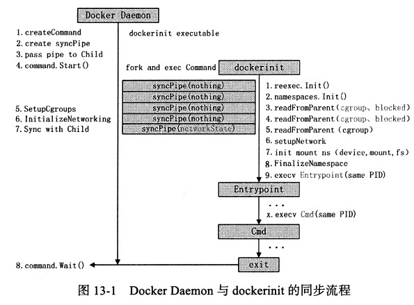

## 13.4 dockerinit运行

```
源码： docker/dockerinit/dockerinit.go

func main() 
	---> reexec.Init() //reexec使得dockerinit二进制文件可以运行多种任务，dockerinit运行的处理方法都通过一个注册的execdriver名称获得，并最终运行此方法
		---> initializer, exists := registeredInitializers[os.Args[0]] //获得注册的initializer
		---> initializer() //执行注册的initializer
```

**initializer的注册**

```
以native的execdriver为例
源码： docker/daemon/execdriver/native/init.go

func init()
	---> reexec.Register(DriverName, initializer) //实现了DriveName的注册，名为“native”，注册的方法为init.go文件下的initializer
```

### 13.4.2 dockerinit的执行流程

即init.go文件下的initializer下的执行流程

initializer完成部分工作，剩下的交给libcontainer的namespace

**initializer完成的工作为：**

- 1.定义flag参数并解析
- 2.声明libcontainer.Config实例，并通过解析container.json文件，获取实例内容。（execdriver中run函数执行namespace.exec函数之前，将libcontainer.Config持久化至本地目录/var/lib/docker/execdriver/native/<c.ID>/container.json）
- 3.获取root的路径
- 4.通过同步管道所在的文件描述符索引值（值为3）获取对应的管道对象
- 5.通过libcontainer中的namespace包的Init函数，最终完成容器初始化工作

```
源码： docker/daemon/execdriver/native/init.go

func initializer()
	---> flag.Parse()
	---> json.NewDecoder(f).Decode(&container)
	---> rootfs, err := os.Getwd()
	---> syncPipe := syncpipe.NewSyncPipeFromFd(0, uintptr(*pipe))
	---> namespaces.Init(container, rootfs, *console, syncPipe, flag.Args())
```

## 13.5 libcontainer的运行

libcontainer是一套容器技术的实现方案，借助于libcontainer的调用，可以完成容器的创建与管理。dockerinit就是通过libcontainer来完成容器的创建与初始化

namespaces.Init完成的工作不仅仅只有与Linux namespace相关的内容，它会完成namespace、mount、容器用户、网络等方面的配置

将父子进程的管道同步作为一个分水岭：

- 前半部分：进程的配置
- 后半部分：初始化容器的资源


**dockerinit在namespace中的工作：**

- 1.ReadFromParent(&networkState)：如上图所示，这里会阻塞，直到daemon将创建的网络栈资源通过管道传给dockerinit，dockerinit最重要的工作就是配置网络栈
- 2.setupNetwork(container, networkState)：利用networkState中的网络配置信息，在容器的网络命名空间下初始化内部借款，将其改名为eth0，并对接口的MTU、IP地址及默认网关进行配置，从而构建容器完成的网络栈
- 3.mount.InitializeMountNamespace()：挂载rootfs、proc、volume
- 4.FinalizeNamespace(container)：完成容器namespace下所需的所有工作
  - 1.关闭标准输入、输出、错误之外的所有打开的文件描述符
  - 2.容器切换用户之前，为容器取消某些Linux Capability
  - 3.容器切换用户之前，为容器保留某些Linux Capability
  - 4.为容器创建新的用户ID、组ID
  - 5.清除所有保留的Linux Capability
  - 6.禁用其他所有的Linux Capability
  - 7.为容器进程切换至工作目录workdir，即在用户态docker run命令指定的参数workdir

完成上面的步骤，容器的隔离、资源工作、权限管理工作都完成了。下面是在容器内运行容器指定的应用程序，即dockerinit将容器主进程的执行权交给用户程序

- .system.Execv(args[0], args[0:], os.Environ())
  - args[0]：从args参数中提取第一个参数作为执行命令
  - args[0:]：第二个参数开始所有的参数作为第一个参数的运行参数
  - os.Environ()：代表整个进程运行时的环境变量
  - Execv只是在原进程的基础上重新执行一段程序，并不会改变原有程序的PID，也不会创建一个新进程

args相关的即是Entrypoint与Cmd（若两者都有，Entrypoint在前面一起作为最终的args，如果只有Cmd则其作为最红的args）

- Entrypoint：偏向容器应用层的初始化工作，它的最后一步会使用exec调用，将主进程的执行权交给Cmd
- Cmd：用户指定运行的应用程序

**注意：**

- dockerinit、Entrypoint、Cmd都基于同一个PID
- Cmd创建的其他子进程都会受到相同namespace和cgroup的作用
- Cmd进程及其所有子进程共同构成一个用户眼中的“容器”

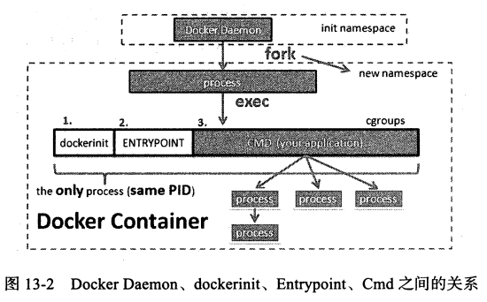

```
源码： docker/vendor/src/github.com/docker/libcontainer/namespace/init.go

func Init()
	---> syncPipe.ReadFromParent(&networkState) 
	---> setupNetwork(container, networkState)
		--->strategy.Initialize() 
	---> mount.InitializeMountNamespace() 
	---> FinalizeNamespace(container) 
	---> return system.Execv(args[0], args[0:], os.Environ())
		---> name, err := exec.LookPath(cmd)
		---> return syscall.Exec(name, args, env)
```

