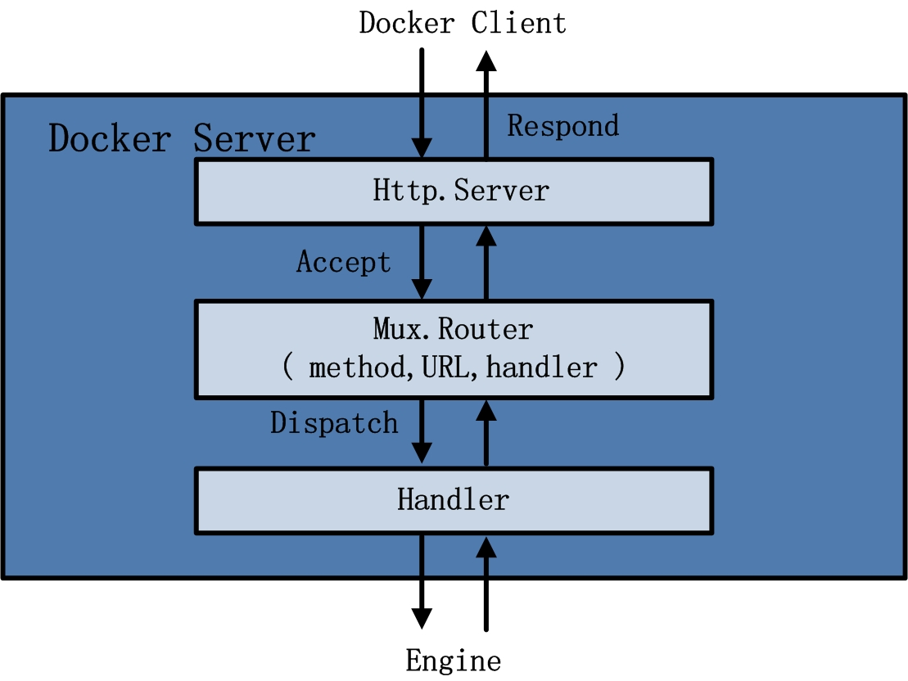
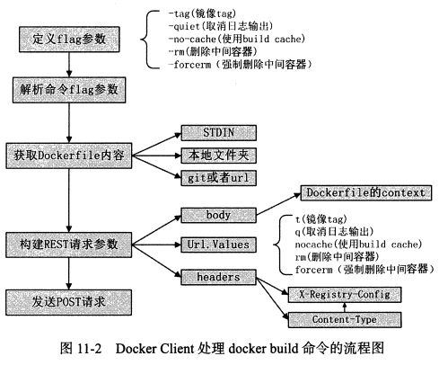
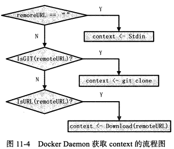

Docker源码分析

[TOC]

基于Docker1.2.0版本

# 第1章 Docker架构


## Docker总结构图


## Docker Daemon架构示意图


## Docker Server架构示意图





## Graph架构示意图


# 第9章 Docker镜像下载

## Docker镜像下载流程


- 命令：`docker pull ubuntu:14.04`
- 步骤：
  - 1.用户通过Docker Client发送pull命令，用于让Docker Daemon下载指定名称的镜像
  - 2.Docker Server接收Docker镜像的pull请求，创建下载镜像任务并触发执行
  - 3.Docker Daemon执行镜像下载任务，从Docker Register中下载指定镜像，并将其存储于本地Graph中

## Docker Client

- 主要函数：DockerCli的`CmdPull()`

- 步骤：

  - (1).解析命令中与Docker相关的参数（tag、remote、v、hostname）
  - (2).配置Docker下载镜像时所需的认证信息（authConfig）
  - (3).发送RESTful请求至Docker Daemon（`job.Run()`、`"POST","/images/create?"+v.Encode()`）

  ```
  源码：docker/api/client/command.go

  func (cli *DockerCli) CmdPull(args ...string)
  	---> tag := cmd.String()	//(1)
  	---> v      = url.Values{}	//(1)
  	---> remote = cmd.Arg(0)	//(1)
  	---> hostname, _, err := registry.ResolveRepositoryName(remote)	//(1)
  	---> authConfig := cli.configFile.ResolveAuthConfig(hostname)	//(2)
  	---> pull := func(authConfig registry.AuthConfig) error {}	//(3)
  		---> return cli.stream("POST", "/images/create?"+v.Encode()...}
  	---> if err := pull(authConfig);	//(3)
  ```


## Docker Server

- 步骤：
  - (1).解析HTTP请求中包含的请求参数：URL中大查询参数、HTTP Header中的认证信息
  - (2).创建镜像下载Job、并为该Job配置环境变量
  - (3).触发执行镜像下载Job

```
源码：docker/api/server/server.go

总过程：DockerCli.CmdPull() ---> postImagesCreate()

func postImagesCreate(...) error
	---> image、repo、tag、job	//(1)
	---> authConfig :=	//(1)
	---> job = eng.Job("pull", image, tag)	//(2)
	--- >if err := job.Run();	//(3)
	
```
## Docker Daemon

- 主要函数：`job.Run`  --->  Graph的`CmdPull()`

- 步骤

  - (1).解析Job参数（repository、tag、Docker Registry）
  - (2).Docker Daemon与Docker Registry建立会话（session）
  - (3).通过会话下载镜像
  - (4).Docker镜像下载至本地并存储与Graph（`s.pullRepository`）
  - (5).在TagStore中标记该镜像`s.Set()`

- image组成：

  - image json：元数据，比如Dockerfile中的ENV、暴露的端口，用来给容器内部进程配置环境，动态数据
  - image layer：实际内容，静态数据

- (4)Docker镜像下载至本地并存储与Graph、(5)在TagStore中标记该镜像的具体过程：

  - (4)Docker镜像下载至本地并存储与Graph

  

  - (5)在TagStore中标记该镜像的具体过程，即`s.Set()`

  


```
源码：docker/graph/pull.go

总流程：DockerCli.CmdPull() ---> postImagesCreate()--->TagStore.CmdPull()

func (s *TagStore) CmdPull() engine.Status
	---> localName、tag、authConfig	//(1)
	---> s.poolAdd	(1)：禁止下载中被的DockerClient发出相同的请求
	---> registry.NewSession()	//(2):创建session对象，与registry建立数据连接，用r进行数据传输
	---> s.pullRepository()	//(3):执行镜像下载
		---> r.GetRepositoryData() //获取指定repository中所有镜像的ID信息，存入RepositoryData的ImgList中
		---> r.GetRemoteTags() //获取指定repository的所有Tag信息
		---> s.pullImage()	//(4):从Docker Register下载Docker镜像
			---> r.GetRemoteHistory()	//获取指定image所有祖先镜像的ID信息
			---> r.GetRemoteImageJSON()	//获取指定image的json信息
			---> r.GetRemoteImageLayer() //获取指定image的layer信息
			---> s.graph.Register()	//将下载的镜像在TagStore的Graph中注册
		---> s.Set()	//(5):配置TagStore
			---> store.LookupImage(imageName) //查看Graph中是否确定存在指定image
			---> validateRepoName() //验证repository的名称是否合法
			---> validateTagName() //验证tag的名称是否合法
			---> store.reload() //加载本地的repository文件
			---> repo[tag] = img.ID //在repository对象中添加新镜像的tag信息以及image id
			---> return store.save() //保存repository信息，持久化到Docker Daemon本地
			
```


# 第10章 Docker镜像存储

## 镜像注册

- **镜像注册**主要分为4个步骤

  - 验证镜像ID的有效性
  - 创建镜像存储路径
  - 存储镜像内容
  - 在Graph中注册镜像ID

  ​

  


## 验证镜像ID

- 步骤：
  - 验证镜像合法性
  - 验证镜像是否已存在
  - 初始化镜像目录
    - 做法：删除一些冲突目录
    - 目的：使得后续Docker镜像存储时存储路径不会冲突

## 创建镜像路径

- 步骤（以aufs为例）
  - 创建mnt、diff、layers子目录
  - 挂载祖先镜像并返回根目录
- aufs目录地址
  - 镜像存放目录：`/var/lib/docker/aufs/diff`
  - 镜像挂载目录：`/var/lib/docker/aufs/mnt`
- 目录说明：
  - layers：每个镜像的元数据，这些元数据是这个镜像的祖先镜像ID列表
  - diff：每个镜像所在的layer，具体包含的文件系统内容，下载的镜像中与文件系统相关的内容，都会存在diff下的某个镜像ID目录下
  - mnt：目录下的每个文件都是一个镜像ID，代表该层镜像之上挂载的可读写layer


## 挂载祖先镜像并返回根目录

- 步骤：
  - 获取aufs/mnt/image_ID目录（RW层所在路径）
  - 如果不是基础镜像，挂载父类镜像


## 存储镜像内容

- 主要函数`image.StoreImage(img, jsonData, layerData, tmp, rootfs);`
- 参数分析：


- 步骤：

  - 1.解压镜像内容layerData至diff目录（StoreImage传入的镜像内容layerData是一个压缩包），解压的diff目录如下图所示。
    - 将其解压至aufs/diff/image_ID目录下
    - 开启镜像磁盘空间统计任务

  ​

  

  ​

  - 2.收集镜像所占空间大小，并记录
    - 将镜像大小收集，更新img的Size属性
    - 将镜像大小写入root，由于传入的是`_temp`，因此存入`_temp`。具体的做法为：在临时文件`/var/lib/docker/graph/_temp/layersize`写入`img.Size`
  - 3.将jsonData写入临时文件
    - 将json写入`/var/lib/docker/graph/_temp/json`

## 注册镜像ID

- 知识点：`TruncIndex`：Docker用户指定镜像ID的前缀，只要前缀满足在全局所有的镜像ID中唯一，Docker Daemon就可以通过TruncIndex定位到唯一的镜像ID
- 步骤：
  - 将`/var/lib/docker/graph/_temp`重命名为`/var/lib/docker/graph/`
  - 添加镜像ID至graph.idIndex，即添加到TruncIndex


```
源码：docker/graph/pull.go

其实是接上一章的s.graph.Register()

s.graph.Register(jsonData,layerData,img) 
	---> utils.ValidateID(img.ID) //验证镜像合法性
	---> graph.Exists(img.ID) //验证镜像是否已存在
	---> os.RemoveAll() //初始化镜像目录
	---> graph.driver.Create(img.ID, img.Parent) //调用aufs的Create,在aufs.go
		---> a.createDirsFor(id); //创建mnt、diff,再根据镜像ID创建镜像文件夹，aufs/mnt/image_ID,aufs/diff/image_ID
		---> os.Create(path.Join(a.rootPath(), "layers", id)) //写入层元数据,即写入到aufs/layers/image_ID下，将祖先镜像的镜像ID写入该镜像ID文件中
	---> rootfs, err := graph.driver.Get(img.ID, "") //挂载祖先镜像并返回根目录aufs/mnt/image_ID，调用aufs的Get，在aufs.go
		---> count := a.active[id] //获取镜像的引用数（有可能多个容器在用）
		---> out := path.Join(a.rootPath(), "diff", id) //如果不是基础镜像，挂载父镜像
	---> image.StoreImage() 
		---> differ.ApplyDiff(img.ID, layerData) //将layerData解压至aufs/diff/image_ID
		---> differ.DiffSize(img.ID) //开启镜像磁盘空间统计任务
		---> img.Size = size //更新img的Size属性
		---> img.SaveSize(root) //将镜像大小写入临时目录
		---> ioutil.WriteFile(jsonPath(root), jsonData, 0600) //将json写入临时目录
		---> os.Rename(tmp, graph.ImageRoot(img.ID)) //commit，重命名临时目录
		---> graph.idIndex.Add(img.ID) //将镜像ID添加至TruncIndex
	
```


# 第11章 Docker build实现

- docker build：通过一个Dockerfile文件以及相关内容，从一个基础镜像起步，对Dockerfile中的每一条命令，都在原先的镜像layer之上再额外构建一个新的镜像layer，直至构建出用户所需的镜像

## docker build执行流程


### Docker client与docker build





#### 1.定义并解析flag参数

#### 2.获取Dockerfile相关内容

- 获取Dockerfile的方式
  - 本地
  - STDIN
  - 远程：URL
  - git
- 解析Dockerfile源并构建context信息的流程图


#### 3.构建REST请求参数

#### 4.发送POST请求

```
源码：docker/api/client/command.go

func (cli *DockerCli) CmdBuild(args) error
	---> tag、suppressOutput、noCache、rm、forceRm //定义并解析flag参数
	---> context //根据Dockerfile构造的context信息
	---> body = utils.ProgressReader(context,...) //根据context生成请求体
	---> v.Set("t", *tag) //设置flag参数
	---> cli.stream("POST", fmt.Sprintf("/build?%s", v.Encode()), body,...) //发送POST请求至Docker Server
```

### Docker Server与docker build

```
源码：docker/api/server/server.go

createRouter
	--->"POST":"/build": 
		---> postBuild
			---> 解析请求参数
			---> eng.Job("build") //创建Job
			---> job.Stdin.Add(r.Body) //以job自身标准输入的形式将Dockerfile添加到job内部
			---> job.Run() //执行job.Run
```

### Docker Daemon与docker build

- Docker Daemon获取context的流程图（有三种方式）：



- buildFile：相当于一个生产镜像车间，只要有原料（Dockerfile）输入，它就可以按照要求为用户生产Docker镜像，build结构体相关属性如下：


- b.Build之后的事情：
  - Docker Daemon响应Docker Server
  - Docker Server响应Docker Client 

```
源码：docker/daemon/build.go

func (daemon *Daemon) CmdBuild(job *engine.Job)
	---> noCache、rm、authConfig、context //解析job环境变量
	---> context //根据三种方式之一获取context
	---> b := NewBuildFile(daemon,...) //根据noCache等参数创建buildFile对象
	---> id, err := b.Build(context) //buildFile根据context创建镜像并返回镜像ID
	---> daemon.Repositories().Set(repoName, tag, id, false) //将镜像ID注册到Repository中
```


## Docker命令解析流程

- 执行流程如下：


- Dockerfile例子：

```
FROM ubuntu:14.04
MAINTAINER Allen Sun allen.sun@daocloud.com
RUN apt-get update
CMD ["/bin/bsh"]
```


```
源码：docker/daemon/build.go

func (b *buildFile) Build(context io.Reader)
	---> tmpdirPath, err := ioutil.TempDir("", "docker-build") //创建临时文件
	---> decompressedStream, err := archive.DecompressStream(context) //解压context
	---> dockerfile = lineContinuation.ReplaceAllString() //读取Dockerfile
	---> for _, line := range strings.Split(dockerfile, "\n") //逐行解析Dockerfile
		---> line = strings.Trim() //对每一行进行预处理
		---> b.BuildStep(fmt.Sprintf("%d", stepN), line) //从line中解析相应的Dockerfile命令，完成构建一个镜像layer的任务
			---> tmp := strings.SplitN(expression, " ", 2) //如，将"FROM"和 "ubuntu:14.04"分离
			---> instruction := //获得命令类型，如FROM
			---> arguments := //获得命令参数，如ubuntu:14.04
			---> method, exists := reflect.TypeOf(b).MethodByName(instruction...) //利用golang的反射机制获取具体的执行方法
			---> ret := method.Func.Call(reflect.ValueOf(arguments)...) //根据获取的方法，传入参数，完成一条Dockerfile执行的指令
```

## Dockerfile命令分析

- Dockerfile每一条命令（FROM命令除外）都会构建一个新的image
- Dockerfile分为两类
  - 1.修改镜像：
    - RUN：基于上一层image的容器中运行一条命令，可能修改镜像
    - ADD：在Dockerfile所在目录的context中复制内容至上亿层image，可能修改镜像
    - COPY
  - 2.修改Config
    - ENV：作为进程的环境变量加载
    - EXPOSE：进程会监听EXPOSE的端口号
    - CMD
    - ENTRYPOINT
    - MAINTAINER

### FROM命令

- 步骤如图：


```
源码：docker/daemon/build.go

func (b *buildFile) CmdFrom(name string)
	---> image, err := b.daemon.Repositories().LookupImage(name) //在Repo中查找镜像
	---> if b.daemon.Graph().IsNotExist(err) //如果本地查找不到，则pull
		---> job := b.eng.Job("pull", remote, tag)
		---> job.Run()
	---> b.image = image.ID //获得镜像后，将ID值传给buildFile的image属性，第二条命令可以在此基础镜像上来完成，image会随着build的流程的变化而变化
	---> b.config = image.Config //如果image.Config不为空，也赋给buildFile
	---> b.config.OnBuild = //配置buildFile的OnBuild属性
```

### RUN命令

- 与其他修改镜像config信息的命令的区别：
  - 需要在镜像基础上执行动态的命令，执行命令时存在“容器”的概念
- 步骤如图：


#### 1.镜像cahe机制（probeCache）

- 原理：根据buildFile的属性image（基础镜像的ID或后续覆盖基础镜像的镜像ID）和buildFile的config属性，遍历本地所有镜像，只要存在一个镜像，此镜像的父镜像ID与当前buildFile的image值相等（父类比较，累积比较），且此镜像的config内容与正在构建的RUN命令的buildFile.config相同，则认为正在构建的RUN命令产生的结果与此镜像的结果一致，可以直接使用本地存储的镜像。若不存在，则完整地执行RUN

#### 2.创建Container对象

- 创建Container对象，为运行容器做准备
- 需要的信息：
  - 基础镜像的ID
  - 运行容器所需的runconfig

#### 3.挂载文件系统

- 为何需要挂载？
  - RUN命令需要在容器中运行指定的程序，仅仅创建Container类型实例c还不够，需要为容器的运行挂载文件系统
- 怎么做？
  - 根据Container实例中的镜像ID，获得所有祖先镜像，通过指定的graphdriver完全联合起来，挂载到一个目录下
  - 而后容器运行将用该挂载点作为容器的根目录

#### 4.运行容器

- 效果：利用c中众多的容器配置信息，将Docker容器运行起来
- 需要做的工作：
  - 创建容器的文件系统
  - 创建容器的命名空间进行资源隔离
  - 为容器配置cgroups参数进行资源控制
  - 运行用户指定的程序

#### 5.提交新镜像

- 效果：将更改后的top layer制作成一个新镜像，并有效存储。RUN命令的commit操作是从一个运行完毕的容器中保存文件系统的Read-Write层，以一个镜像的形式存入本地graph中
- `b.daemon.Commit`的工作：
  - 暂停Docker Container的运行（对RUN不起作用，因为RUN命令的容器已经运行完毕并终止）
  - 把容器文件系统的Read-Write层打包tar
  - 创建image对象，并在Graph中注册，需要的信息
    - tar包
    - 众多配置信息
  - 在repositories中注册新创建的镜像，repositories实则为TagStore，TagStore的repositories属性存储了image的信息，方便用户快速查找

```
源码： docker/daemon/build.go

func (b *buildFile) CmdRun(args string)
	---> hit, err := b.probeCache() //查找本地镜像，如果找到了直接返回；没找到才执行下面步骤
	---> c, err := b.create() //创建Container
	---> c.Mount() //挂载文件系统
	---> b.run(c) //运行容器
	---> b.commit(c.ID, cmd, "run") //提交新镜像
		---> image, err := b.daemon.Commit(container,...)
		---> b.image = image.ID //将新构建的镜像的ID作为下一个Dockerfile命令执行的基础镜像
```

### ENV命令

- 含义：构建镜像时，为镜像添加一个环境变量
- 作用：在buildFile.image的基础上，配置指定buildFile.config中的Env参数，随后执行commit。
- 是否创建镜像
  - 也会创建一个新的镜像，并运行完daemon包中Commit函数
  - 虽然创建镜像过程中不会有新的文件系统变化，但对于镜像而言，镜像的json信息已经发生明显的变化，即镜像的json信息中ENV部分被修改

```
源码： docker/daemon/build.go

func (b *buildFile) CmdEnv(args string)
	---> b.commit("", b.config.Cmd, fmt.Sprintf("ENV %s", replacedVar)) //创建新镜像
```

