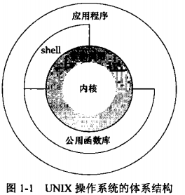

AUPE

#  第1章 UNIX基础知识

## 1.2 Unix体系结构

**系统调用**：内核的接口被称为系统调用，公用函数库构建在系统调用接口之上，应用程序既可使用公用函数库，也可使用系统调用

**shell**：是一个特殊的应用程序，为运行其他应用程序提供了一个接口

## 1.3 登陆

系统在其口令文件，通常是 / e t c / p a s s w d文件中查看登录名    

口令文件中的登录项由 7个以冒号分隔的字段组成：登录名， 加密口令，数字用户 I D ( 2 2 4 )，数字组I D ( 2 0 )，注释字段，起始目录 ( / h o m e / s t e v e n s )，以及s h e l l 程序( / b i n / k s h )    