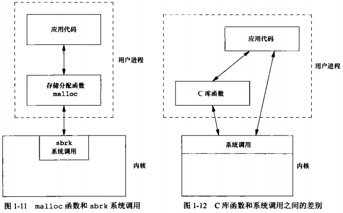

AUPE

#  第1章 UNIX基础知识

## 1.2 Unix体系结构

**系统调用**：内核的接口被称为系统调用，公用函数库构建在系统调用接口之上，应用程序既可使用公用函数库，也可使用系统调用

**shell**：是一个特殊的应用程序，为运行其他应用程序提供了一个接口

## 1.3 登陆

**口令文件**：  /etc/password

系统在口令文件中查看登陆名

口令文件中的登陆项组成：登录名:加密口令:数字用户ID:数字组ID:注释字段:起始目录（home/sar）:shell程序（/bin/ksh）

## 1.4 文件和目录

**目录**：包含目录项的文件

创建新目录时会自动创建两个文件名`.`和`..`。`.`表示当前目录，`..`表示父目录。在最高层次的根目录中，`..`与`.`相同

## 1.5 输入和输出

**文件描述符**：通常是一个小的非负整数，内核用以标识一个特定进程正在访问的文件

**不带缓冲的I/O**：函数open、read、write、lseek、close提供了不带缓冲的I/O

**标准I/O**：标准I/O为那些不带缓冲的I/O函数提供了一个带缓冲的接口。我们最熟悉的标准I/O函数printf。`<stdio.h>`包含了所有标准I/O函数的原型

## 1.6 程序和进程

**程序**：一个存储在磁盘上某个目录中的可执行文件。内核使用exec函数将程序读入内存，并执行程序

**进程**：程序的实例被称为进程

**线程ID**：线程ID只在它所属的进程内起作用，一个进程中的线程ID在另一个进程中没有意义

## 1.7 出错处理

当UNIX系统函数出错时，通常会返回一个负值，而且整型变量errno通常被设置为具有特定信息的值。但有些函数出错则使用另一种特定而不是返回负值，如大多数返回对象指针的函数，在出错时会返回一个null指针

**errno的两个规则**：

- 1.如果没有出错，其值不会被例程清楚，因此仅当函数返回值指出错误时，才检查errno
- 2.任何函数都不会将errno设为0

**打印出错信息的函数**：

- `char* strerror(int errnum);`：将errnum（通常是errno值）映射为一个出错消息字符串，并且返回此字符串的值
- `void perror(const char *msg);`：首先输出msg指向的字符串，然后是一个冒号、空格，接着是对应于errno值的出错消息，最后是一个换行符

**出错分类**：

- 致命性的
- 非致命性的
  - EAGAIN、ENFILE、ENOBUFS、ENOLCK、ENOSPC、EWOULDBLOCK
  - ENOMEM（有时）
  - EBUSY（指明共享资源正在使用时）
  - EINTR（中断一个慢系统调用时）

**非致命性错误的恢复方法**：延迟一段时间，然后重试

## 1.8 用户标识

用户ID为0的用户为**根用户**或**超级用户**

如果一个进程具有超级用户特权，则大多数文件权限检查不再进行

某些操作系统功能只向超级用户提供，超级用户对系统有自由的支配权

调用`getuid`和`getgid`可以获得用户ID和组ID

## 1.9 信号

**3种信号处理方式**：

- 1.忽略信号
- 2.按系统默认方式处理
- 3.捕捉信号：提供一个函数，信号发生时调用该函数

当一个进程发送信号时，我们必须是那个进程的所有者或者超级用户

## 1.10 时间值

**UNIX 系统使用两种时间**：

- 1.日历时间：自 UTC 1970年1月1日 00:00:00 以来经历过的秒数累计值。用`time_t`数据类型来保存这种时间值
- 2.进程时间：也称作CPU时间，用于度量进程使用的CPU资源。进程时间以时间滴答来计算，用`clock_t`数据类型保存这种时间值

当度量一个进程的执行时间时，UNIX系统为一个进程维护了**3个进程时间值**：

- 1.时钟时间： 又称作墙上时钟时间，是进程运行的时间总量，其值与系统中同时运行的进程数有关
- 2.用户CPU时间：执行用户指令所用的时间量
- 3.系统CPU时间：该进程执行内核程序所经历的时间。如进程执行一个`read`系统调用，则内核执行该系统调用的时间计入系统 CPU 时间

**CPU时间**：用户CPU时间和系统CPU时间之和

## 1.11 系统调用和函数库

**系统调用**：进入内核的入口点

UNIX所使用的技术是为每个系统调用在标准C库中设置一个具有相同名字的函数。用户进程用标准C调用序列来调用这些函数，C函数又用系统所要求的技术调用相应的内核服务。从应用角度考虑，可以将系统调用视为C函数

**系统调用与库函数的区别**：

- 1.C函数不一定是调用了系统调用：如printf调用了write系统调用，但strcpy没有调用系统调用
- 2.职责不同，如sbrk（系统调用）和malloc（C库函数），内核中的sbrk系统调用分配一块空间给进程，库函数malloc则在用户层次管理这一空间
- 3.系统调用通常提供一种小杰克，而库函数通常提供比较复杂的功能

## 第2章 UNIX标准及实现

## 2.2 UNIX标准

### 2.2.1 ISO C

### 2.2.2 IEEE POSIX

