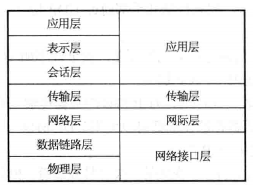
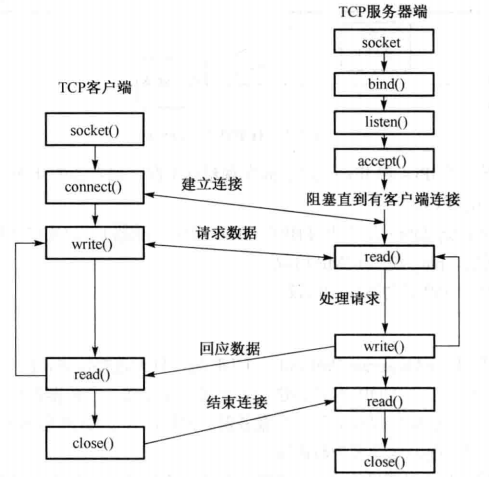
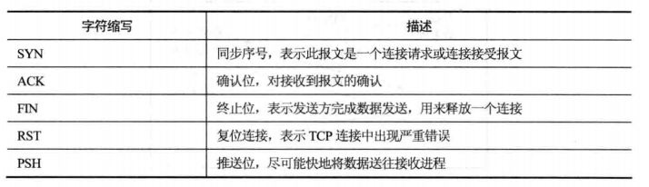
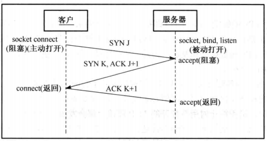
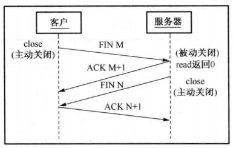
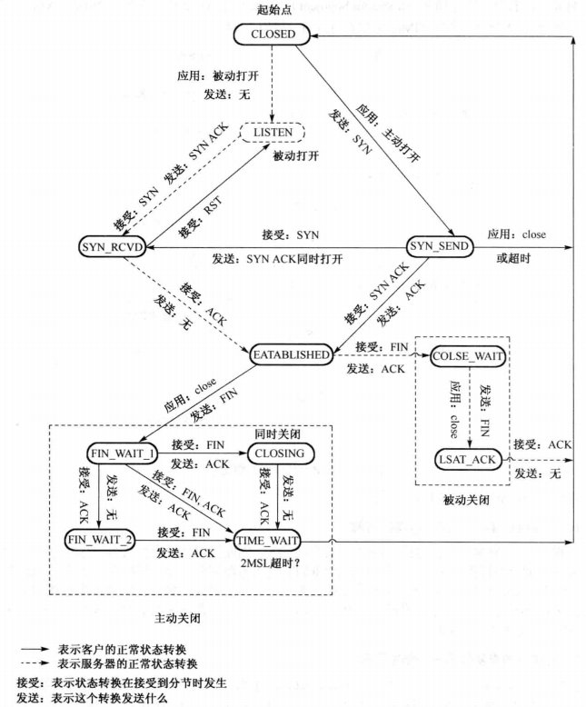

王道程序员求职宝典-第2篇 计算机网络基础

[TOC]

# 1 计算机网络模型

# 2 传输层与Socket基本操作简介

## 2.2 TCP连接的建立和终止

### TCP套接字

### TCP首部字段

### 三次握手建立连接详解

- 客户端的connect在第三次握手的第二次返回，服务器端的accpet在第三次握手的第三次返回

### 四次挥手释放连接详解

- 四次的原因：TCP半关闭。TCP连接是全双工，因此每个方向必须单独地进行关闭
- 一般为四个分组，但：
  - `FIN M`可以随数据一起发生
  - `ACK M+1`和`FIN N`可以一个分组发送
- 主动关闭可能的原因：
  - 进程调用close
  - 进程终止：自愿（调用exit、从main函数返回）、不自愿（进程收到一个终止本进程的信号）

### TCP状态转换图

- 1.主动关闭的一端进入TIME_WAIT状态

- 2.存在TIME_WAIT的两个理由：

  - (1).实现终止TCP全双工连接的可靠性：为了处理第四次挥手中ACK的丢失

    - 如果最后的ACK（第四次挥手）丢失，服务器会重发FIN（第三次挥手），因此客户必须维护状态信息以允许它重发最后的ACK（第四次挥手）

    - 如果客户不维护信息，服务器重发的FIN（第三次挥手）会被客户以RST响应，而服务器将RST解释为错​

  - (2).允许老的重复分组在网络中消失

    - 情景：关闭某个连接后，在相同IP地址和端口新建TCP连接，新建的连接称为前一个连接的化身
    - TIME_WAIT就是防止某个连接的老重复分组在连接终止后再现，从而被误解成属于同一个连接的化身
    - 解决方法：不允许处于TIME_WAIT状态的连接启动新的化身
    - MSL：报文最大生存时间
    - 2MSL：因为有两个方向，每个方向的分组最多存活1MSL，因此2MSL保证两个方向上前一个连接的迷失分组消逝

- 3.TCP为何采用三次握手，二次握手可以吗？

  - 三次握手是为了防止失效的连接请求报文段突然又传送到服务器，从而发生错误。
  - 客户端的第一个SYN丢失后，会重发SYN并正确建立连接，但如果第一个SYN并没有丢失只是被延迟了，如果只是二次握手，那么服务器为在此时又为丢失的SYN创建连接资源，并向客户端发送SYN ACK，但没有三次握手，所以客户端不给与理睬，那么服务器就就一直等待客户端发送数据，导致服务器资源浪费
  - 还有就是防止SYN洪泛

- 4.为何采用四次挥手

  - 当某一段收到FIN时，表示对方已经没有数据发送给自己了，但自己可能还有数据需要发送，因此未必会马上关闭socket，可能会先发送一些数据后，再发送FIN表示没有数据发送给对方了。

  - 而针对每个SYN，需要一个ACK。因此总共需要四次。

- 5.四次挥手并不一定需要四个报文段，有两种情况都是三个报文：

    - 情况1：状态图中由`FIN_WAIT_1`直接到`TIME_WAIT`：第三次挥手与第四次挥手可能会合并发送，此时主动关闭的一端发送最后的ACK，并由`FIN_WAIT_1`直接到`TIME_WAIT`
    - 情况2：状态转换图中，客户端由`FIN_WAIT_1`直接到`CLOSING`：服务器与客户端同时调用close函数关闭连接
