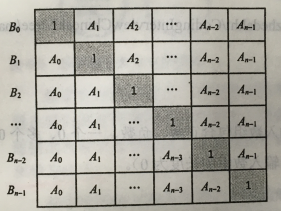

# 66-构建乘积数组

**题目描述**

给定一个数组A[0, 1, …, n-1]，请构建一个数组B[0, 1, …, n-1]，其中B中的元素B[i] =A[0]×A[1]×… ×A[i-1]×A[i+1]×…×A[n-1]。不能使用除法。

**思路分析**



假设B[i]=C[i]*D[i]

C[i] = C[i-1]*A[i-1]，由上往下求

D[i] = D[i+1]*A[i+1]，由下往上求

```c++
void BuildProductionArray(const vector<double>& input, vector<double>& output)
{
    int length1 = input.size();
    int length2 = output.size();
   	if( length1==length2 && length1 > 1 )
    {
        output[0] = 1;
        for( int i = 1; i <= length - 1; i++ )
        {
            output[i] = output[i-1]*input[i-1];
        }
        
        int temp = 1;
        for( int i = length -2; i >=0; i-- )
        {
            temp*=input[i+1];
            output[i] *= temp;
        }
    }
}
```

