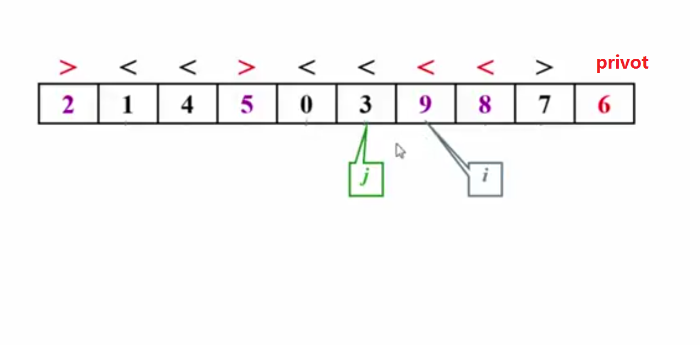

# 快速排序

**思路分析**

Partition函数：

选定一个数（一般为第一个、最后一个或随机位置的数）。以该数作为基准数，比该数小的，放在它的左边，比该数大的放在它的右边，整个函数执行完后，该数被放置到整个数组正确排序完成的位置，最后函数返回该数的排序位置。

quickSort根据Partition分割成子数组，再继续调用Partition，直到子数组不能再分隔（即只有一个元素）。

**我的实现一**

```c++
void Swamp(int& a, int& b)
{
	int temp = a;
	a = b;
	b = temp;
}

int Partition(int* array, int start, int end)
{
	int num = array[end];
	int small = start - 1;
	for( int i = start; i < end; i++ )
	{
		if( array[i] <= num )
		{
			small++;
			if( small != i )
				Swamp( array[i], array[small] );
		}	
	}
	small++;
	Swamp(array[small],array[end]);
	return small;
}

void quickSort( int* array,int start, int end )
{
	if( start < end )
	{
		int index = Partition( array, start, end );
		quickSort( array, start, index - 1 );
		quickSort( array, index + 1, end );	
	}	
}
```

快排特点：

- 平均时间复杂度：O(nlogn)
- 不稳定的排序算法

---

[参考链接](https://www.youtube.com/watch?v=qe4kG-K962g)

最好情况：O(nlogn)，每次分隔时，刚好分成两个大小几乎相等的数组

平均情况：O(nlogn)

最差情况：O(n^2)：每次分隔时，一个数组大小为空，另一个数组大小为剩下的元素

因此枢轴值的选择很重要，最好的方法是选择数组首、尾、中的三个数的中位数作为枢轴值

而且，由于快速排序使用的是递归，因此当数组元素个数太小时，可以使用插入排序，这样反而能得到更好的效果

当所有元素都相同的情况下，也对元素进行交换，因为这样才可以使得每次分隔都能分成几乎相等的两组元素



```c++
const int cutoff = 3;
//获得数组首中尾的三个数，并将这三个数的排序为首<=中<=尾，
//把中的值放置于right-1处，并把中的值返回
//放于right-1处之后，在后续的处理中只需处理[left+1,right-2]的元素即可
int getMedium(vector<int>& nums, int left, int right)
{
    int mid = left + (right-left)/2;
    if(nums[left]>nums[mid])
        swap(nums[left],nums[mid]);
    if(nums[left]>nums[right])
        swap(nums[left],nums[right]);
    if(nums[mid]>nums[right])
        swap(nums[mid],nums[right]);
    int midVal = nums[mid];
    swap(nums[mid],nums[right-1]);
    return midVal;
}

void insertSort(vector<int>& nums, int left, int right) {}

void quickSort(vector<int>& nums, int left, int right)
{
    if(cutoff >= right-left+1)
        return insertSort(nums,left,right);
    
    int privot = getMedium(nums,left,right);
    int i = left;
    int j = right-1;
    while(i<j)
    {
        while(nums[++i] < privot) {} //找到一个大于等于privot的
        while(nums[--j] > privot) {} //找到一个小于等于privot的，注意相等的时候也交换
        if(i<j)
            swap(nums[i],nums[j]);
    }
    //将privot与i交换
    //privot在nums[right-1]，
    //而i指向的是大于等于privot的元素
    swap(nums[right-1],nums[i]);
    quickSort(nums,left,i-1);
    quickSort(nums,i+1,right);
}
```

