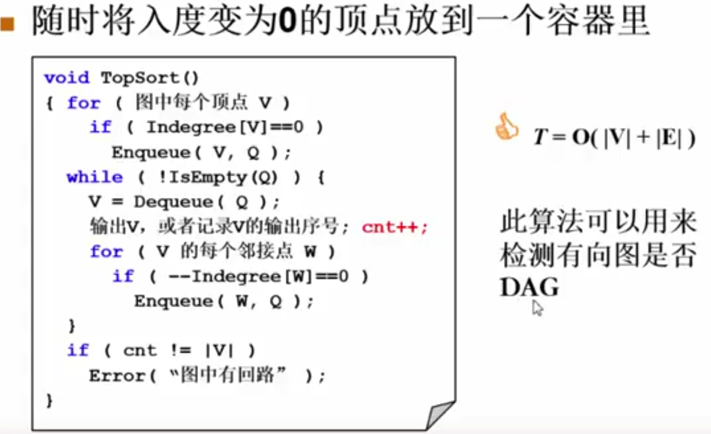
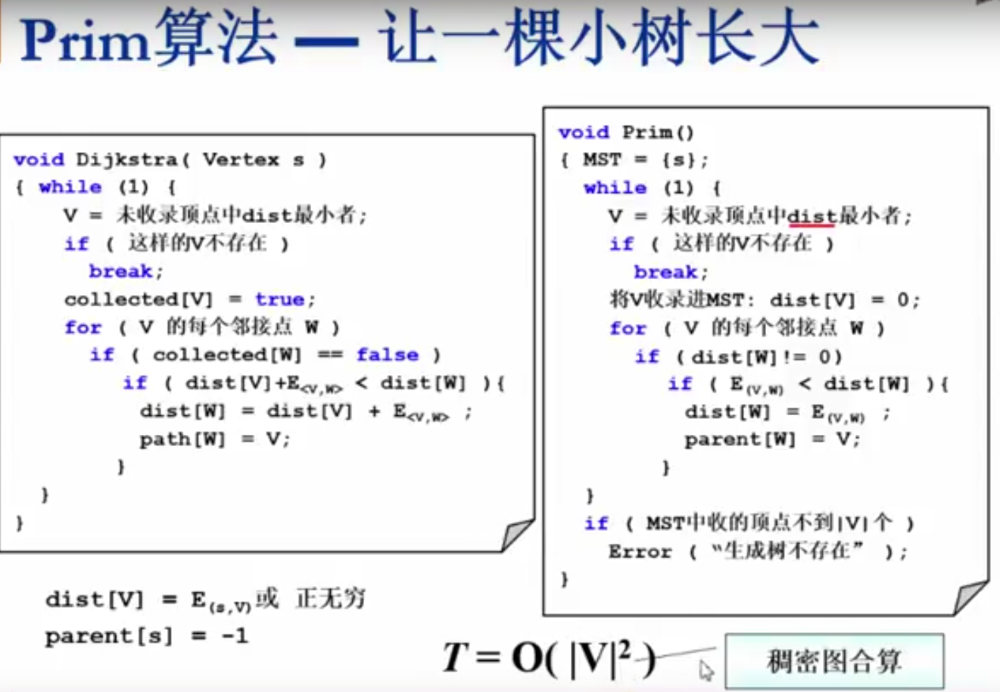
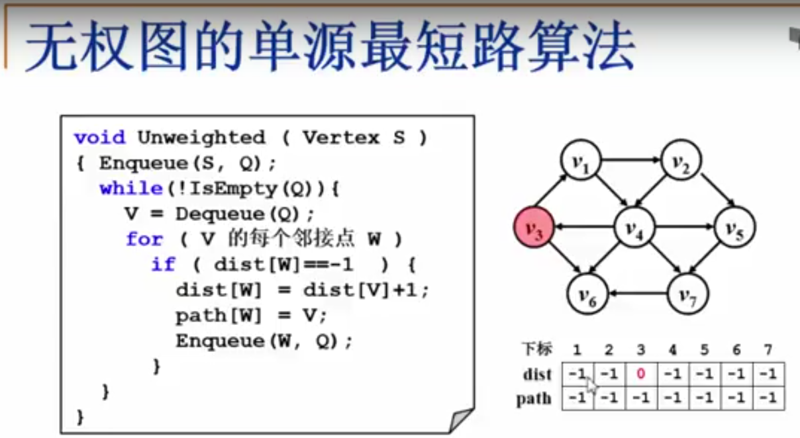
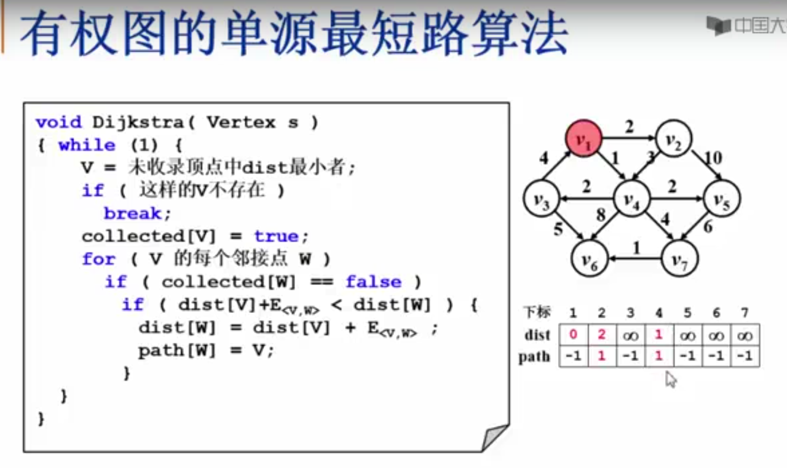

# 图

## 拓扑排序



## 最小生成树

[参考链接](https://www.youtube.com/watch?v=-E42M_yDWzI)

### Prim算法



## 单源最短路径

[参考链接](https://www.youtube.com/watch?v=ypE6a1Kk-6Q)

### BFS

无权图时（权重为1），可以使用BFS算法



### 迪杰斯特拉（Djikstra）



[hihoCoder1081最短路径·一](http://hihocoder.com/problemset/problem/1081)

**测试版**

```c++
int N, M, S, T;

vector<int> dijkstra(vector<vector<int>>& graph)
{
	vector<int> path(N, -1); //记录路径的上一个节点
	vector<int> dist(N, INT_MAX); //记录从S到达i的路径长度
	vector<int> collect(N, 0); //记录是否被收录
	//初始化，将S能到达的顶点的path设为S，dist更新为相应的路径
	for (int i = 0; i < N; ++i)
	{
		if (graph[S][i] != INT_MAX)
		{
			path[i] = S;
			dist[i] = graph[S][i];
		}
	}
	collect[S] = 1; //表示原点被收录
	dist[S] = 0;

	while (true)
	{
		int minLen = INT_MAX;
		int minIndex = -1;
		for (int i = 0; i < N; ++i)
		{
			if (collect[i] == 1) continue;
			if (dist[i] < minLen)
			{
				minLen = dist[i];
				minIndex = i;
			}
		}
		if (minIndex == -1) break; //表示已经收录完或找不到一个最小值（不连通）
		
		collect[minIndex] = 1;

		//对小值进行遍历处理
		for (int i = 0; i < N; ++i)
		{
			if (collect[i] == 1) continue; //表示这个点已经被收录
			if (graph[minIndex][i] == INT_MAX) continue; //表示这两个点不连通
			
			if (dist[minIndex] + graph[minIndex][i] < dist[i])
			{
				dist[i] = dist[minIndex] + graph[minIndex][i];
				path[i] = minIndex;
			}
		}
	}
	return dist;
}

int main()
{
	istringstream in("5 23 5 4 \n 1 2 708 \n 2 3 112 \n 3 4 721 \n 4 5 339 \n 5 4 960 \n 1 5 849 \n 2 5 98 \n 1 4 99 \n 2 4 25 \n 2 1 200 \n 3 1 146 \n 3 2 106 \n 1 4 860 \n 4 1 795 \n 5 4 479 \n 5 4 280 \n 3 4 341 \n 1 4 622 \n 4 2 362 \n 2 3 415 \n 4 1 904 \n 2 1 716 \n 2 5 575");
	
	in >> N >> M >> S >> T;
	--S; //由于输入是从1开始的，而数组是从0开始的，为了统一
	--T;
	vector<vector<int>> graph(N,vector<int>(N,INT_MAX));

	for (int i = 0; i < M; ++i)
	{
		int v1, v2, length;
		in >> v1 >> v2 >> length;
		if(length < graph[v1 - 1][v2 - 1])
			graph[v1 - 1][v2 - 1] = length;
		if (length < graph[v2 - 1][v1 - 1])
			graph[v2 - 1][v1 - 1] = length;
	}

	//顶点到自身的长度为0
	for (int i = 0; i < N; ++i)
		graph[i][i] = 0;

	for (int i = 0; i < N; ++i)
	{
		for (int j = 0; j < N; ++j)
			cout << graph[i][j] << "   ";
		cout << endl;
	}

	auto dist = dijkstra(graph);
	
	cout <<  dist[T];

	system("pause");
	return 0;
}
```


