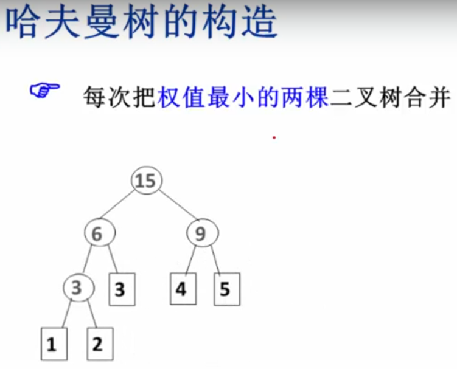
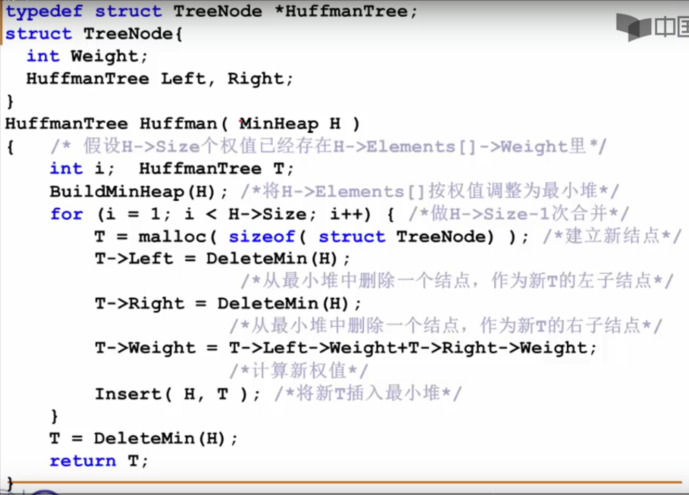
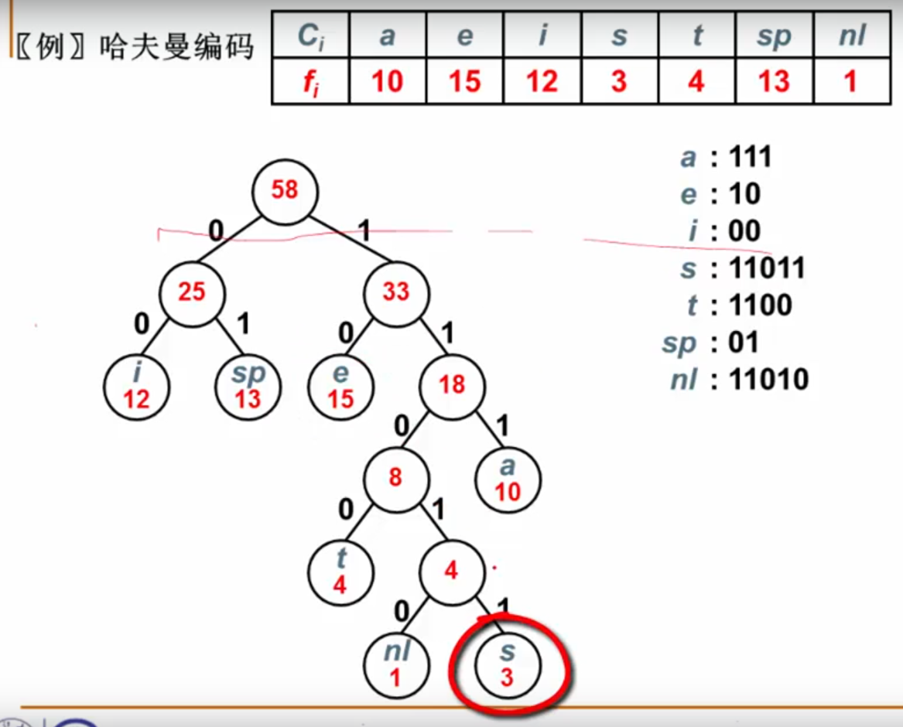

## 树的广度优先遍历

```
         A
        / \
       B   C
      / \ / \
     D  E F  G
```

广度优先遍历（Breadth first traversal）顺序为：ABCDEFG

遍历顺序从根节点沿着树的宽度遍历，可以利用队列实现。子树根节点入队顺序是先左子树，后右子树。

```c
struct ListNode
{
	int m_nValue;
	ListNode* m_pNext;
};

struct BinaryTree
{
	int value;
	BinaryTree *left, *right;
	BinaryTree(int v) : value(v), left(nullptr), right(nullptr) {}
	BinaryTree(int v, BinaryTree* l, BinaryTree* r) : value(v), left(l), right(r) {}
};

void BinaryTreeBFT(BinaryTree* root)
{
	if (root == nullptr)
		return;
	queue<BinaryTree*> qu;
	qu.push(root);
	while (!qu.empty())
	{
		BinaryTree* current = qu.front();
		qu.pop();
		cout << current->value << " ";
		if (current->left != nullptr)
			qu.push(current->left);	
		if (current->right != nullptr)
			qu.push(current->right);
	}
}

void makeTree(BinaryTree *root, BinaryTree *left, BinaryTree *right)
{
	root->left = left;
	root->right = right;
}


int main(int argc, char* argv[])
{
	BinaryTree* one = new BinaryTree(1);
	BinaryTree* two = new BinaryTree(2);
	BinaryTree* three = new BinaryTree(3);
	BinaryTree* four = new BinaryTree(4);
	BinaryTree* five = new BinaryTree(5);
	BinaryTree* six = new BinaryTree(6);
	BinaryTree* seven = new BinaryTree(7);

	makeTree(one, two, three);
	makeTree(two, four, five);
	makeTree(three, six, seven);

	BinaryTreeBFT(one);

	system("pause");
	return 0;
}
```

## 树的深度优先遍历

```
         A
        / \
       B   C
      / \ / \
     D  E F  G
```

深度优先遍历（Depth first traversal）顺序为：ABDECFG

遍历顺序为根节点、左子树、右子树。因此可以利用栈来实现，在遍历某个节点时，其右子树的根入栈，再将左子树的根入栈。

```c
struct ListNode
{
	int m_nValue;
	ListNode* m_pNext;
};

struct BinaryTree
{
	int value;
	BinaryTree *left, *right;
	BinaryTree(int v) : value(v), left(nullptr), right(nullptr) {}
	BinaryTree(int v, BinaryTree* l, BinaryTree* r) : value(v), left(l), right(r) {}
};

void BinaryTreeDFT(BinaryTree* root)
{
	if (root == nullptr)
		return;
	stack<BinaryTree*> st;
	st.push(root);
	while (!st.empty())
	{
		BinaryTree* current = st.top();
		st.pop();
		cout << current->value << " ";
		if (current->right != nullptr)
			st.push(current->right);
		if (current->left != nullptr)
			st.push(current->left);	
	}
}

void makeTree(BinaryTree *root, BinaryTree *left, BinaryTree *right)
{
	root->left = left;
	root->right = right;
}


int main(int argc, char* argv[])
{
	BinaryTree* one = new BinaryTree(1);
	BinaryTree* two = new BinaryTree(2);
	BinaryTree* three = new BinaryTree(3);
	BinaryTree* four = new BinaryTree(4);
	BinaryTree* five = new BinaryTree(5);
	BinaryTree* six = new BinaryTree(6);
	BinaryTree* seven = new BinaryTree(7);

	makeTree(one, two, three);
	makeTree(two, four, five);
	makeTree(three, six, seven);

	BinaryTreeDFT(one);

	system("pause");
	return 0;
}
```

## 哈夫曼树

[参考链接](https://www.youtube.com/watch?v=Q3t2SXt8dHo)

构造：



实现：堆



哈夫曼树编码:

