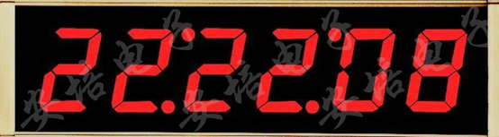
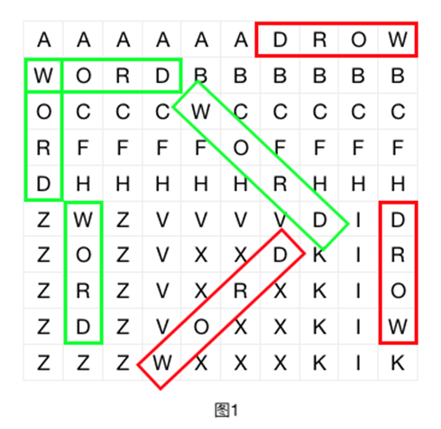

# 网易游戏2018

[链接1](https://www.nowcoder.com/test/11647029/summary)

[链接2](https://www.nowcoder.com/test/question/done?tid=17259655&qid=117506#summary)

# 第一题 时钟

   小W有一个电子时钟用于显示时间，显示的格式为HH:MM:SS，HH，MM，SS分别表示时，分，秒。其中时的范围为[‘00’,‘01’…‘23’]，分的范围为[‘00’,‘01’…‘59’]，秒的范围为[‘00’,‘01’…‘59’]。   

  

   但是有一天小W发现钟表似乎坏了，显示了一个不可能存在的时间“98:23:00”，小W希望改变最少的数字，使得电子时钟显示的时间为一个真实存在的时间，譬如“98:23:00”通过修改第一个’9’为’1’，即可成为一个真实存在的时间“18:23:00”。修改的方法可能有很多，小W想知道，在满足改变最少的数字的前提下，符合条件的字典序最小的时间是多少。其中字典序比较为用“HHMMSS”的6位字符串进行比较。  

##### **输入描述:**

```
每个输入数据包含多个测试点。每个测试点后有一个空行。 第一行为测试点的个数T(T<=100)。 每个测试点包含1行，为一个字符串”HH:MM:SS”，表示钟表显示的时间。
```

##### **输出描述:**

```
对于每个测试点，输出一行。如果钟表显示的时间为真实存在的时间，则不做改动输出该时间，否则输出一个新的”HH:MM:SS”，表示修改最少的数字情况下，字典序最小的真实存在的时间。
```

##### **输入例子1:**

```
2
19:90:23
23:59:59
```

##### **输出例子1:**

```
19:00:23
23:59:59
```

**我的实现**

```c++
#include <iostream>
#include <string>
#include <vector>
using namespace std;
string helper(string& input)
{
    string sHour = input.substr(0,2);
    string sMinus = input.substr(3,2);
    string sSec = input.substr(6);
     
    int hour = stoi(sHour);
    int minus = stoi(sMinus);
    int sec = stoi(sSec);
     
    if(hour>=24) hour = hour % 10;
    if(minus>=60) minus = minus % 10;
    if(sec>=60) sec = sec % 10;
    string output("");
    if(hour<10) output += "0";
    output += to_string(hour) + ":";
    if(minus<10) output += "0";
    output += to_string(minus) + ":";
    if(sec<10) output += "0";
    output += to_string(sec);
    return output;
}
int main(int argc, char** argv)
{
    int T;
    cin >> T;
    vector<string> res;
    for(int i=0; i<T; ++i)
    {
        string input;
        cin >> input;
        res.push_back(helper(input));
    }
    for(auto r : res) cout << r << endl;
}
```

# 第二题 会话列表 

  小云正在参与开发一个即时聊天工具，他负责其中的会话列表部分。 

  会话列表为显示为一个从上到下的多行控件，其中每一行表示一个会话，每一个会话都可以以一个唯一正整数id表示。 

  当用户在一个会话中发送或接收信息时，如果该会话已经在会话列表中，则会从原来的位置移到列表的最上方；如果没有在会话列表中，则在会话列表最上方插入该会话。 

##### **输入描述:**

```
输入的第一行为一个正整数T（T<=10），表示测试数据组数。
接下来有T组数据。每组数据的第一行为一个正整数N（1<=N<=200），表示接收到信息的次数。第二行为N个正整数，按时间从先到后的顺序表示接收到信息的会话id。会话id不大于1000000000。
```

##### **输出描述:**

```
对于每一组数据，输出一行，按会话列表从上到下的顺序，输出会话id。
相邻的会话id以一个空格分隔，行末没有空格。
```

##### **输入例子1:**

```
3
5
1 2 3 4 5
6
1 100 1000 1000 100 1
7
1 6 3 3 1 8 1
```

##### **输出例子1:**

```
5 4 3 2 1
1 100 1000
1 8 3 6
```

**我的实现**

```c++
#include<map>
#include<iostream>
#include<unordered_map>
#include<vector>
using namespace std;
 
int main(int agrc, char** argv)
{
    int T;
    cin >> T;
    for(int i=0; i<T; ++i)
    {
        int N;
        cin >> N;
        unordered_map<int,int> m;
        for(int i=0; i<N; ++i)
        {
            int id;
            cin >> id;
            m[id] = i;
        }
        vector<int> v(N,-1);
        for(auto p : m)
        {
            v[p.second] = p.first;
        }
         
        for(int i=N-1; i>=0; --i)
            if(v[i]!=-1) cout << v[i] << " ";
        cout << endl;
    }
}
```

# 第三题 字符迷阵 

  字符迷阵是一种经典的智力游戏。玩家需要在给定的矩形的字符迷阵中寻找特定的单词。 

  在这题的规则中，单词是如下规定的： 

  \1. 在字符迷阵中选取一个字符作为单词的开头； 

  \2. 选取右方、下方、或右下45度方向作为单词的延伸方向； 

  \3. 以开头的字符，以选定的延伸方向，把连续得到的若干字符拼接在一起，则称为一个单词。  

  

  以图1为例，如果要在其中寻找单词"WORD"，则绿色框所标示的都是合法的方案，而红色框所标示的都是不合法的方案。  

  现在的问题是，给出一个字符迷阵，及一个要寻找的单词，问能在字符迷阵中找到多少个该单词的合法方案。注意合法方案是可以重叠的，如图1所示的字符迷阵，其中单词"WORD"的合法方案有4种。  

##### **输入描述:**

```
输入的第一行为一个正整数T，表示测试数据组数。 接下来有T组数据。每组数据的第一行包括两个整数m和n，表示字符迷阵的行数和列数。接下来有m行，每一行为一个长度为n的字符串，按顺序表示每一行之中的字符。再接下来还有一行包括一个字符串，表示要寻找的单词。  数据范围： 对于所有数据，都满足1<=T<=9，且输入的所有位于字符迷阵和单词中的字符都为大写字母。要寻找的单词最短为2个字符，最长为9个字符。字符迷阵和行列数，最小为1，最多为99。 对于其中50%的数据文件，字符迷阵的行列数更限制为最多为20。
```

##### **输出描述:**

```
对于每一组数据，输出一行，包含一个整数，为在给定的字符迷阵中找到给定的单词的合法方案数。
```

##### **输入例子1:**

```
3
10 10
AAAAAADROW
WORDBBBBBB
OCCCWCCCCC
RFFFFOFFFF
DHHHHHRHHH
ZWZVVVVDID
ZOZVXXDKIR
ZRZVXRXKIO
ZDZVOXXKIW
ZZZWXXXKIK
WORD
3 3
AAA
AAA
AAA
AA
5 8
WORDSWOR
ORDSWORD
RDSWORDS
DSWORDSW
SWORDSWO
SWORD
```

##### **输出例子1:**

```
4
16
5
```