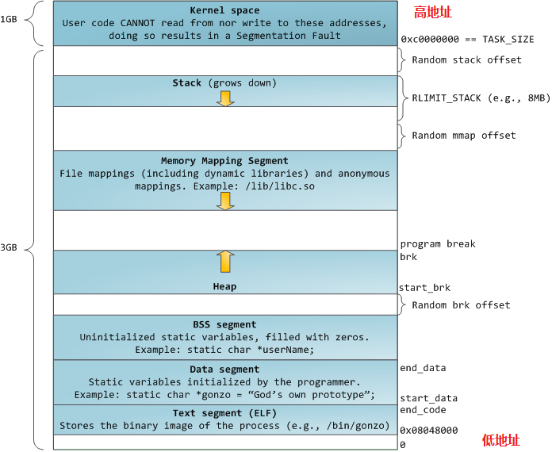

C++

<!-- GFM-TOC -->
* [关键字](#关键字)
    * [1.extern关键字作用](#1extern关键字作用)
    * [2.static关键字作用](#2static关键字作用)
    * [3.volatile关键字作用](#3volatile关键字作用)
    * [4.const关键字的作用](#4const关键字的作用)
* [动态内存](#动态内存)
    * [1.new与malloc区别](#1new与malloc区别)
    * [2.内存对齐的原则](#2内存对齐的原则)
* [类](#类)
    * [1.C++多态性与虚函数](#1c++多态性与虚函数)
    * [2.构造函数和析构函数](#2构造函数和析构函数)
* [指针和引用](#指针和引用)
    * [1.指针和引用的区别](#1指针和引用的区别)
    * [2.指针与数组的关系](#2指针与数组的关系)
    * [3.智能指针 ](#3智能指针-)
* [表达式、变量](#表达式变量)
    * [1.四种类型转换](#1四种类型转换)
<!-- GFM-TOC -->


# 关键字

## 1.extern关键字作用

-	1).extern声明变量在文件外部定义？
-	2).extern修饰函数？
-	3).extern C的作用？用法？

extern可以置于变量或者函数前，以标示变量或者函数的定义在别的文件中，提示编译器遇到此变量和函数时在其他模块中寻找其定义。此外extern也可用来进行链接指定。

extern有两个作用：

-	1.当它与"C"一起连用时，如: `extern "C" void fun(int a, int b);`则告诉编译器在编译fun这个函数名时按着C的规则去翻译相应的函数名而不是C++的
-	2.当extern不与"C"在一起修饰变量或函数时，如在头文件中: `extern int g_Int;`它的作用就是声明函数或全局变量的作用范围的关键字，其声明的函数和变量可以在本模块或其他模块中使用，记住它是一个声明不是定义!也就是说B模块(编译单元)要是引用模块A(编译单元)中定义的全局变量或函数时，它只要包含A模块的头文件即可,在编译阶段，模块B虽然找不到该函数或变量，但它不会报错，它会在连接时从模块A生成的目标代码中找到此函数。

**参考** 

-	[C/C++中extern关键字详解](https://www.cnblogs.com/yc_sunniwell/archive/2010/07/14/1777431.html)

---

## 2.static关键字作用

-	1).static修饰局部变量？
-	2).static全局变量？(限定变量在一个编译单元内，一个编译单元就是指一个cpp和它包含的头文件，这个回答可以结合编译需要经历的几个过程来答)
-	3).static修饰普通函数？
-	4).static修饰成员变量?
-	5).static修饰成员函数？

```
代码区
全局数据区 <---全局变量、静态全局变量、静态局部变量、静态数据成员
堆区 <--- new
栈区 <--- 函数内部的自动变量
```

C++的static有两种用法：面向过程程序设计中的static和面向对象程序设计中的static。前者应用于普通变量和函数，不涉及类；后者主要说明static在类中的作用。

**面向过程设计中的static** 

-	1).静态全局变量：相较于全局变量：不能被其它文件所用，不会与其他文件变量名冲突。
-	2).静态局部变量：相较于局部变量：函数退出时不会自动销毁，自动初始化
-	3).静态函数：静态函数与普通函数不同，它只能在声明它的文件当中可见，不能被其它文件使用

**面向对象的static关键字（类中的static关键字）**  

-	1).静态数据成员：
	-	静态数据成员在程序中也只有一份拷贝，静态数据成员是该类的所有对象所共有的
	-	不能在类声明中定义
	-＜数据类型＞＜类名＞::＜静态数据成员名＞=＜值＞  `int Myclass::Sum=0;`
-	2).静态成员函数
	-	与普通函数相比，静态成员函数由于不是与任何的对象相联系，因此它不具有this指针	
	-	它无法访问属于类对象的非静态数据成员，也无法访问非静态成员函数，它只能调用其余的静态成员函数
	-	出现在类体外的函数定义不能指定关键字static
	-	非静态成员函数可以任意地访问静态成员函数和静态数据成员
	-	静态成员函数不能访问非静态成员函数和非静态数据成员

**参考** 

-	[C++中的static关键字的总结](https://www.cnblogs.com/BeyondAnyTime/archive/2012/06/08/2542315.html)

---

## 3.volatile关键字作用

-	1).访问寄存器要比访问内存要块，因此CPU会优先访问该数据在寄存器中的存储结果，但是内存中的数据可能已经发生了改变，而寄存器中还保留着原来的结果。为了避免这种情况的发生将该变量声明为volatile，告诉CPU每次都从内存去读取数据。
-	2).一个参数可以即是const又是volatile的吗？可以，一个例子是只读状态寄存器，是volatile是因为它可能被意想不到的被改变，是const告诉程序不应该试图去修改他

---

## 4.const关键字的作用

**使用** 

-	1).定义常量
-	2).指针使用CONST：指针常量、指向常量的指针
-	3).函数中使用CONST
	-	const修饰函数参数
	-	const 修饰函数返回值：一般用于重载操作符
-	4).类相关CONST
	-	const修饰成员变量：它只能在初始化列表中赋值
	-	const修饰成员函数：const成员函数不被允许修改它所在对象的任何一个数据成员；const成员函数能够访问对象的const成员，而其他成员函数不可以；对于const类对象/指针/引用，只能调用类的const成员函数，因此，const修饰成员函数的最重要作用就是限制对于const对象的使用。
	-	
	-	/对象指针/对象引用：表示该对象为常量对象，其中的任何成员都不能被修改；任何非const成员函数都不能被调用

**初始化类内部的常量** 

-	1).static与const并用，在外部初始化
-	2).初始化列表

**将Const类型转化为非Const类型的方法** 

`const_cast <type_id>  (expression) `

-	常量指针被转化成非常量指针，并且仍然指向原来的对象
-	常量引用被转换成非常量引用，并且仍然指向原来的对象
-	常量对象被转换成非常量对象

**参考** 

-	[关于C++ const 的全面总结](http://blog.csdn.net/Eric_Jo/article/details/4138548)

---

# 内存和动态内存

## 1.new与malloc区别

-	1).new分配内存按照数据型进行分配，malloc分配内存按照大小分配，以字节为单位；
-	2).new不仅分配一段内存，而且会调用构造函数，但是malloc则不会。new分配的内存要用delete销毁，malloc要用free来销毁；delete销毁的时候会调用对象的析构函数，而free则不会
-	3).new返回的是指定对象的指针，而malloc返回的是void*，因此malloc的返回值一般都需要进行类型转化
-	4).new是一个操作符可以重载，malloc是一个库函数
-	5).malloc分配的内存不够的时候，可以用realloc扩容。扩容原理：如果原先的内存无法改变大小，realloc将分配另一块正确大小的内存，并把原先那块内存的内容复制到新的块上
-	6).new如果分配失败了会抛出bad_malloc的异常（可以用new(nothrow)来不抛出），而malloc失败了会返回NULL。因此对于new，正确的姿势是采用try…catch语法，而malloc则应该判断指针的返回值。为了兼容很多c程序员的习惯，C++也可以采用new nothrow的方法禁止抛出异常而返回NULL；
-	7).new和new[]的区别，new[]一次分配所有内存，多次调用构造函数，分别搭配使用delete和delete[]，同理，delete[]多次调用析构函数，销毁数组中的每个对象。而malloc则只能sizeof(int) * n；

**TODO** 

new和malloc的实现、空闲链表，分配方法(首次适配原则，最佳适配原则，最差适配原则，快速适配原则)。delete和free的实现原理，free为什么直到销毁多大的空间

**参考** 

-	[new与malloc的前世今生](http://blog.csdn.net/shanghairuoxiao/article/details/70337890)

## 2.内存对齐的原则

对其的好处：对齐节省了时间

-	1).数据成员对齐规则：结构(struct)(或联合(union))的数据成员，第一个数据成员放在offset为0的地方，以后每个数据成员存储的起始位置要从该成员大小或者成员的子成员大小（只要该成员有子成员，比如说是数组，结构体等）的整数倍开始(比如int在32位机为4字节,则要从４的整数倍地址开始存储。
-	2).结构体作为成员:如果一个结构里有某些结构体成员,则结构体成员要从其内部最大元素大小的整数倍地址开始存储.(struct a里存有struct b,b里有char,int ,double等元素,那b应该从8的整数倍开始存储.)
-	3).收尾工作:结构体的总大小,也就是sizeof的结果,.必须是其内部最大成员的整数倍.不足的要补齐

```c
typedef struct bb
{
 int id;             //4字节，[0]....[3]
 double weight;      //8字节，[8].....[15]，原则1：从8的整数倍开始
 float height;      //4字节，[16]..[19],总长要为8的整数倍,补齐[20]...[23]，原则3：补齐最大最大成员的整数倍
}BB;

typedef struct aa
{
 char name[2];     //2字节，[0],[1]
 int  id;         //4字节，[4]...[7]，原则１：从4的整数倍开始

 double score;     //8字节，[8]....[15]　　　　
 short grade;    //2字节，[16],[17]　　　　　　　　
 BB b;             //[24]......[47]，原则２：从BB结构体中最大成员，也就是double，8字节，的整数倍开始
}AA;

int main()
{
  AA a;
  cout<<sizeof(a)<<" "<<sizeof(BB)<<endl;
  return 0;
}

//输出结果为48 24
```

-	4).\#pragma pack()

\#pragma pack(1)：告诉编译器,所有的对齐都按照1的整数倍对齐

如果加入pragma pack(n) ，取n和变量自身大小较小的一个进行对齐


**总结：** 

-	1).从0位置开始存储
-	2).变量存储的起始位置是该变量大小的整数倍
-	3).结构体总的大小是其最大元素的整数倍，不足的后面要补齐
-	4).结构体中包含结构体，从结构体中最大元素的整数倍开始存
-	5).如果加入pragma pack(n) ，取n和变量自身大小较小的一个


[5分钟搞定内存字节对齐](https://blog.csdn.net/hairetz/article/details/4084088)


## 3.C++内存管理

> 1).C++内存分为那几块,每块存储哪些变量

内存分成5个区，他们分别是栈、堆、自由存储区、全局/静态存储区、常量存储区。

-	a.栈：在执行函数时，函数内局部变量的存储单元都可以在栈上创建，函数执行结束时这些存储单元自动被释放。栈内存分配运算内置于处理器的指令集中，效率很高，但是分配的内存容量有限。（分为：静态分配：一般局部变量；动态分配：alloc函数）
-	b.堆：就是那些由 new分配的内存块，他们的释放编译器不去管，由我们的应用程序去控制，一般一个new就要对应一个 delete。如果程序员没有释放掉，那么在程序结束后，操作系统会自动回收。
-	c.自由存储区：就是那些由malloc等分配的内存块，他和堆是十分相似的，不过它是用free来结束自己的生命的。
-	d.全局/静态存储区：全局变量和静态变量被分配到同一块内存中，在以前的C语言中，全局变量又分为初始化的和未初始化的，在C++里面没有这个区分了，他们共同占用同一块内存区。
-	f.常量存储区：这是一块比较特殊的存储区，他们里面存放的是常量，不允许修改。

```
//注意，他们不是连在一起的，这样画是为了方便

栈             <--- 函数内部的局部变量，自动释放，容量有限
堆             <--- new分配，delete释放，如果没有delete，在程序结束后操作系统自动回收
自由存储区      <--- malloc分配，free释放，与堆相似
全局/静态存储区  <--- 全局变量、静态变量，现在初始化和未初始化都在一起
常量存储区      <--- 常量，不允许修改
```

> 2).放置堆破碎的方法

一个防止堆破碎的通用方法是从不同固定大小的内存池中分配不同类型的对象。对每个类重载new 和delete就提供了这样的控制。

> 3).内存分块的另一种说法 :(

-	a.栈（stack）:由编译器自动分配释放，存放函数的参数值、局部变量的值等，其操作方式类似于数据结构的栈。
-	b.堆（heap）：一般是由程序员分配释放，若程序员不释放的话，程序结束时由OS回收，值得注意的是它与数据结构的堆是两回事，分配方式倒是类似于数据结构的链表。
-	全局区（static）：也叫静态数据内存空间，存储全局变量和静态变量，全局变量和静态变量被分配到同一块内存中，在以前的C语言中，全局变量又分为初始化的和未初始化的，在C++里面没有这个区分了，他们共同占用同一块内存区。
-	c.文字常量区:常量字符串就是放在这里，程序结束后由系统释放。
-	d.程序代码区（.data）：存放函数体的二进制代码。




[C/C++内存管理详解-与1) 2)相关](https://chenqx.github.io/2014/09/25/Cpp-Memory-Management/)

[C/C++内存管理详解---与3)相关](http://zheming.wang/blog/2012/03/23/36E28580-280D-4708-BEAF-B3A3E5107377/)

---

# 类

## 1.C++多态性与虚函数

> 1).C++多态的实现

多态分为静态多态和动态多态。静态多态（编译时多态）是通过重载和模板技术实现，在编译的时候确定。动态多态（运行时多态）通过虚函数和继承关系来实现，执行动态绑定，在运行的时候确定。

**动态多态实现有几个条件：** 

-	(1).虚函数；
-	(2).一个基类的指针或引用,指向派生类的对象；

**调用过程：** 

基类指针在调用成员函数(虚函数)时，就会去查找该对象的虚函数表。虚函数表的地址在每个对象的首地址。查找该虚函数表中该函数的指针进行调用。

每个对象中保存的只是一个虚函数表的指针，C++内部为每一个类维持一个虚函数表，该类的对象的都指向这同一个虚函数表。

虚函数表中为什么就能准确查找相应的函数指针呢？因为在类设计的时候，虚函数表直接从基类也继承过来，如果覆盖了其中的某个虚函数，那么虚函数表的指针就会被替换，因此可以根据指针准确找到该调用哪个函数。

[浅谈C++多态性](http://blog.csdn.net/hackbuteer1/article/details/7475622)

> 2).纯虚函数

纯虚函数：是在基类中声明的虚函数，它在基类中没有定义，但要求任何派生类都要定义自己的实现方法。在基类中实现纯虚函数的方法是在函数原型后加“=0” 

```c
virtual void funtion()=0 
```

抽象类：包含纯虚函数的类称为抽象类。由于抽象类包含了没有定义的纯虚函数，所以不能定义抽象类的对象

> 3).静态多态与动态多态的区别

静态多态是指通过模板技术或者函数重载技术实现的多态，其在编译期确定行为。动态多态是指通过虚函数技术实现在运行期动态绑定的技术。

[C++ 静态多态和动态多态 浅析](http://blog.csdn.net/u013630349/article/details/48009815)

> 4).虚函数的作用

-	用于实现多态
-	封装和抽象，如抽象工厂模式

> 5).虚函数表

编译器为每一个类维护一个虚函数表，每个对象的首地址保存着该虚函数表的指针，同一个类的不同对象实际上指向同一张虚函数表。

[C++ 虚函数表解析](http://blog.csdn.net/haoel/article/details/1948051/)

---

## 2.构造函数和析构函数

> 1).为什么对于存在虚函数的类中析构函数要定义成虚函数？

-	为了实现多态进行动态绑定，将派生类对象指针绑定到基类指针上，对象销毁时，如果析构函数没有定义为析构函数，则会调用基类的析构函数，显然只能销毁部分数据。如果要调用对象的析构函数，就需要将该对象的析构函数定义为虚函数，销毁时通过虚函数表找到对应的析构函数。

> 2).析构函数能抛出异常吗

不能。

C++标准指明析构函数不能、也不应该抛出异常。C++异常处理模型最大的特点和优势就是对C++中的面向对象提供了最强大的无缝支持。那么如果对象在运行期间出现了异常，C++异常处理模型有责任清除那些由于出现异常所导致的已经失效了的对象(也即对象超出了它原来的作用域)，并释放对象原来所分配的资源， 这就是调用这些对象的析构函数来完成释放资源的任务，所以从这个意义上说，析构函数已经变成了异常处理的一部分。

如果析构函数抛出异常，则异常点之后的程序不会执行，如果析构函数在异常点之后执行了某些必要的动作比如释放某些资源，则这些动作不会执行，会造成诸如资源泄漏的问题。

通常异常发生时，c++的机制会调用已经构造对象的析构函数来释放资源，此时若析构函数本身也抛出异常，则前一个异常尚未处理，又有新的异常，会造成程序崩溃的问题。

> 3).构造函数和析构函数中能调用虚函数吗

可以，但是达不到想要的效果，应该尽可能避免在构造函数和析构函数中调用虚函数。

在基类子对象构造期间，编译器直接调用基类版本的虚函数。在子类对象构造期间，编译器直接调用基类虚函数的版本。
	
-	1.构造函数或者析构函数调用虚函数并不会发挥虚函数动态绑定的特性，跟普通函数没区别（会调用基类的版本）
-	2.即使构造函数或者析构函数如果能成功调用虚函数， 程序的运行结果也是不可控的


[构造函数与析构函数中不调用虚函数](http://blog.csdn.net/linpengbin/article/details/51560276)

[【C++】不要在构造函数或析构函数内调用虚函数](https://www.cnblogs.com/vincently/p/4754206.html)

---

# 指针和引用

## 1.指针和引用的区别

-	1).指针保存的是所指对象的地址，引用是所指对象的别名，指针需要通过解引用间接访问，而引用是直接访问；
-	2).指针可以改变地址，从而改变所指的对象，而引用必须从一而终
-	3).引用在定义的时候必须初始化，而指针则不需要
-	4).指针有指向常量的指针和指针常量，而引用没有常量引用（引用本身就是“常量”的）
-	5).指针更灵活，用的好威力无比，用的不好处处是坑，而引用用起来则安全多了，但是比较死板

## 2.指针与数组的关系

不同之处

-	1).数组一旦声明，我们就不能再给数组名赋值，但是我们可以给指针赋值
-	2).用指针定义字符串时，指针所指的字符串会被理解为常量字符串，不能修改。数组定义的字符串则可以修改
-	3).用sizeof运算符可以计算数组变量的数组大小，但指针指向数组时，只能计算出指针本身大小（单位：字节）

## 3.智能指针 

> 1).实现原理

使用智能指针缘由：

-	a.内存泄漏
-	b.空悬指针(野指针):指向“垃圾”内存
-	c.申请失败时的异常处理：`int *ptr = new(nothrow) int(0);`，异常时返回nullptr

智能指针可以做到：

-	a.智能指针能够帮助我们处理资源泄露问题
-	b.它也能够帮我们处理空悬指针的问题
-	c.它还能够帮我们处理比较隐晦的由异常造成的资源泄露

主要的智能指针类型：`shared_ptr`、`unique_ptr`

**shared_ptr：** 

shared_ptr的目标就是，在其所指向的对象不再被使用之后（而非之前），自动释放与对象相关的资源。

shared_ptr本身提供默认内存释放器，调用delete。当然我们也可以自己定义内存释放器。默认内存释放器并不能释放数组内存空间，而是要我们自己提供内存释放器。

```c
shared_ptr<int> pJutta2(new int[10],
2         // deleter (a lambda function) 
3         [](int *p)
4         { 
5             delete[] p;
6         }
7     );

shared_ptr<int> p(new int[10], default_delete<int[]>());
```

实现中需要注意的是：

-	1.构造函数时，count=1
-	2.拷贝构造函数，count+=1
-	3.析构函数，count--，如果count为0，则释放内存
-	3.复制操作符：右操作数的count先加1，左操作数的count再减1，如果左操作数count为0，则释放左操作数原内存，并指向右操作数的内存空间

**unique_ptr：** 

unique_ptr是一种在异常发生时可帮助避免资源泄露的智能指针。这个智能指针实现了独占式拥有概念，意味着它可确保一个对象和其相应资源同一时间只被一个指针拥有。一旦拥有者被销毁或变成空，或开始拥有另一个对象，先前拥有的那个对象就会被销毁，其任何相应资源也会被释放。

不支持普通的拷贝或赋值操作，但可以通过调用release或reset将指针的所有权从一个（非const）unique_ptr转义给另一个unique_ptr。

不能拷贝unique_ptr的规则有一个例外：我们可以拷贝或赋值一个将要被销毁的unique_ptr，最常见的例子是从函数返回一个unique_ptr。

```c
unique_ptr<int> ptr(new int(0));
```

**weak_ptr** 

-	weak_ptr是一种不控制所指向对象生成期的智能指针
-	weak_ptr指向由一个shared_ptr管理的对象
-	将一个weak_ptr绑定到一个shared_ptr不会改变shared_ptr的引用计数
-	shared_ptr被销毁，即使weak_ptr指向对象，对象也还是会被释放
-	由于对象可能不存在，不能使用weak_ptr直接访问对象，必须调用lock
-	lock检查weak_ptr所指向的对象是否存在，如果存在，lock返回一个指向共享对象的shared_ptr

[C++智能指针及其简单实现](http://www.cnblogs.com/xiehongfeng100/p/4645555.html)

> 2).如何改变引用计数

-	构造函数中计数初始化为1；
-	拷贝构造函数中计数值加1；
-	赋值运算符中，左边的对象引用计数减一，右边的对象引用计数加一；
-	析构函数中引用计数减一；
-	在赋值运算符和析构函数中，如果减一后为0，则调用delete释放对象

> 3).share_ptr循环引用

//TODO

```c
//share_ptr可能出现循环引用，从而导致内存泄露
class A
{
public:
    share_ptr<B> p;
};

class B
{
public:
    share_ptr<A> p;
}

int main()
{
    while(true)
    {
        share_prt<A> pa(new A()); //pa的引用计数初始化为1
        share_prt<B> pb(new B()); //pb的引用计数初始化为1
        pa->p = pb; //pb的引用计数变为2
        pb->p = pa; //pa的引用计数变为2
    }
    //假设pa先离开，引用计数减一变为1，不为0因此不会调用class A的析构函数，因此其成员p也不会被析构，pb的引用计数仍然为2；
    //同理pb离开的时候，引用计数也不能减到0
    return 0;
}

/*
** weak_ptr是一种弱引用指针，其存在不会影响引用计数，从而解决循环引用的问题
*/
```

---

# 表达式、变量

## 1.四种类型转换

C++四种类型转换：static_cast, dynamic_cast, const_cast, reinterpret_cast

`cast-name<type>(expression);`

> 1).static_cast

static_cast能进行基础类型之间的转换，有如下几种用法：

-	a.用于类层次结构中父类和子类之间指针或引用的转换。进行上行转换（把子类的指针或引用转换成父类表示）是安全的
-	b.进行下行转换（把父类指针或引用转换成子类指针或引用）时，由于没有动态类型检查，所以是不安全的
-	c.用于基本数据类型之间的转换，如把int转换成char，把int转换成enum。这种转换的安全性也要开发人员来保证
-	d. 把void指针转换成目标类型的指针（不安全！！）
-	e.把任何类型的表达式转换成void类型

static_cast不能转换掉expression的const、volitale、或者__unaligned属性

> 2).const_cast

-	a.该运算符用来修改类型的const或volatile属性。除了去掉const 或volatile修饰之外， type_id和expression得到的类型是一样的
-	b.const_cast只能改变运算对象的底层const。对于常量对象，使用const_cast会报错

```c
const char *pc;
char *p = const_cast<char *>(pc); //正确
```

> 3).reinterpret_cast

-	a.reinterpret_cast通常为运算对象的位模式提供较低层次上的重新解释
-	b.它可以把一个指针转换成一个整数，也可以把一个整数转换成一个指针（先把一个指针转换成一个整数，在把该整数转换成原类型的指针，还可以得到原先的指针值）

```c
int *ip;
//以上pc所指的对象是一个int而非字符，如果把pc当普通字符指针使用就可能在允许时发生错误
char *pc = reinterpret_cast<char*>(ip);
//可能导致异常的运行时行为
string str(pc);
```

> 4).dynamic_cast

-	a.dynamic_cast 主要用在继承体系中的安全向下转型
-	b.它能安全地将指向基类的指针转型为指向子类的指针或引用，并获知转型动作成功是否。转型失败会返回null（转型对象为指针时）或抛出异常（转型对象为引用时）
-	c.dynamic_cast 会动用运行时信息（RTTI）来进行类型安全检查，因此 dynamic_cast 存在一定的效率损失
-	d.dynamic_cast 只有在基类带有虚函数的情况下才允许将基类转换为子类

> 旧式的强制类型转换

```c
type (expr);  //函数形式的强制类型转换
(type) expr;  //C语言风格的强制类型转换
```

-	a.旧式的强制类型转换分别具有与const_cast、static_cast或reinterpret_cast相似的行为
-	b.当我们在某处执行旧式的强制类型转换时，如果换成const_cast和static_cast也合法，则行为与对应的命名转换一致。如果替换后不合法，则旧式强制类型转换执行与reinterpret_cast类似的功能

[C++四大类型转换](https://blog.csdn.net/Robin__Chou/article/details/51957686)

---

# 函数

## 1.内联函数与宏定义

内联函数的优点，与宏定义的区别

-	1).宏定义在预编译的时候就会进行宏替换
-	2).内联函数在编译阶段，在调用内联函数的地方进行替换，减少了函数的调用过程，但是使得编译文件变大。因此，内联函数适合简单函数，对于复杂函数，即使定义了内联编译器可能也不会按照内联的方式进行编译。
-	3).内联函数相比宏定义更安全，内联函数可以检查参数，而宏定义只是简单的文本替换。因此推荐使用内联函数，而不是宏定义
-	4).使用宏定义函数要特别注意给所有单元都加上括号，`\#define MUL(a, b) a * b`，这很危险，正确写法：`\#define MUL(a, b) ((a) * (b))`


