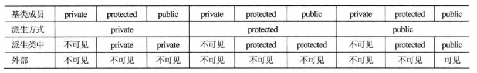
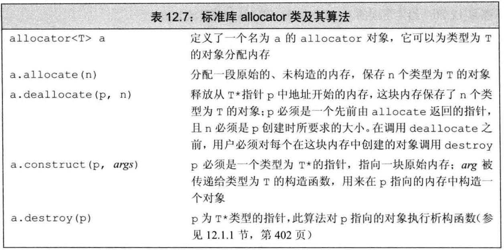
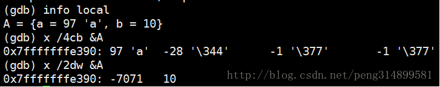
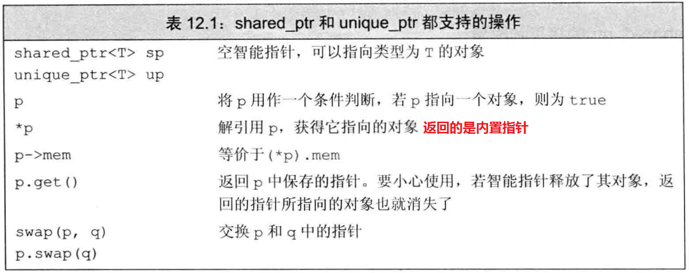
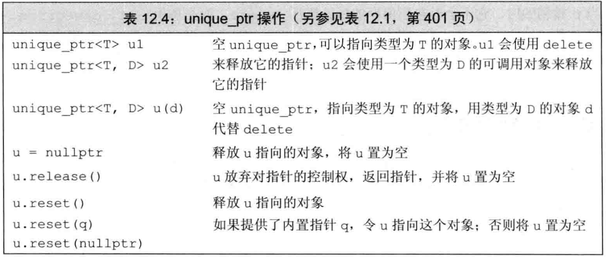
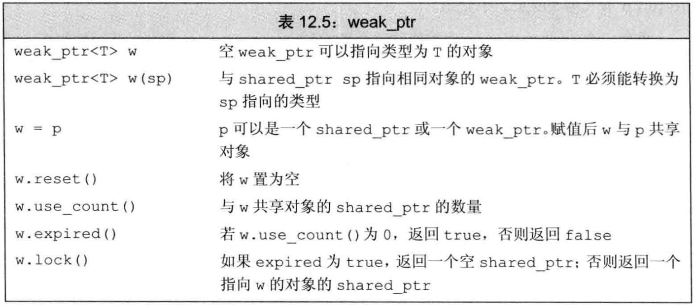

C++

[TOC]

# 关键字

## 1.extern关键字作用

- 1).extern声明变量在文件外部定义？

- 2).extern修饰函数？

- 3).extern C的作用？用法？

extern可以置于变量或者函数前，以标示变量或者函数的定义在别的文件中，提示编译器遇到此变量和函数时在其他模块中寻找其定义。此外extern也可用来进行链接指定。

extern有两个作用：

- 1.当它与"C"一起连用时，如: `extern "C" void fun(int a, int b);`则告诉编译器在编译fun这个函数名时按着C的规则去翻译相应的函数名而不是C++的
- 2.当extern不与"C"在一起修饰变量或函数时，如在头文件中: `extern int g_Int;`它的作用就是声明函数或全局变量的作用范围的关键字，其声明的函数和变量可以在本模块或其他模块中使用，记住它是一个声明不是定义!也就是说B模块(编译单元)要是引用模块A(编译单元)中定义的全局变量或函数时，它只要包含A模块的头文件即可,在编译阶段，模块B虽然找不到该函数或变量，但它不会报错，它会在连接时从模块A生成的目标代码中找到此函数。
- 3.与不使用extern时的区别

```
假如a.h中有 int a=10; t1.cpp和t2.cpp同时include "a.h"则编译不成功，因为a重复定义；
如果 a.h中是 static int a=10;则可以，因为t1和t2中的a只是名字相同，地址空间不同；
如果a.h中是 extern int a; 并且在a.cpp中 int a=10; 则t1和t2中的a指向同一个地址空间。
```

- 4.extern和static不能同时修饰一个变量，链接属性是矛盾的
- 5.extern 和const，没什么特别的，就是他们属性的总和

**参考** 

-	[C/C++中extern关键字详解](https://www.cnblogs.com/yc_sunniwell/archive/2010/07/14/1777431.html)

---

## 2.static关键字作用

- 1).static修饰局部变量？
- 2).static全局变量？(限定变量在一个编译单元内，一个编译单元就是指一个cpp和它包含的头文件，这个回答可以结合编译需要经历的几个过程来答)
- 3).static修饰普通函数？
- 4).static修饰成员变量?
- 5).static修饰成员函数？

```
代码区
全局数据区 <---全局变量、静态全局变量、静态局部变量、静态数据成员
堆区 <--- new
栈区 <--- 函数内部的自动变量
```

C++的static有两种用法：面向过程程序设计中的static和面向对象程序设计中的static。前者应用于普通变量和函数，不涉及类；后者主要说明static在类中的作用。

**面向过程设计中的static**

- 1).静态全局变量：相较于全局变量：不能被其它文件所用，不会与其他文件变量名冲突。
- 2).静态局部变量：相较于局部变量：函数退出时不会自动销毁，自动初始化
- 3).静态函数：静态函数与普通函数不同，它只能在声明它的文件当中可见，不能被其它文件使用


**面向对象的static关键字（类中的static关键字）**  

- 1).静态数据成员：
  - 静态数据成员在程序中也只有一份拷贝，静态数据成员是该类的所有对象所共有的
  - 不能在类声明中定义（int类型的可以，包括char、long一类）
  - ＜数据类型＞＜类名＞::＜静态数据成员名＞=＜值＞  `int Myclass::Sum=0;`
  - 在变量定义时不能指定关键字static

- 2).静态成员函数
  - 与普通函数相比，静态成员函数由于不是与任何的对象相联系，因此它不具有this指针	
  - 它无法访问属于类对象的非静态数据成员，也无法访问非静态成员函数，它只能调用其余的静态成员函数
  - 出现在类体外的函数定义不能指定关键字static
  - 非静态成员函数可以任意地访问静态成员函数和静态数据成员
  - 静态成员函数不能访问非静态成员函数和非静态数据成员（因为没有this指针）
  - 静态函数可以调用所属类的构造函数（因为调用构造函数的时候不需要使用this指针，构造函数只是新生成了一个对象）

**参考** 

-	[C++中的static关键字的总结](https://www.cnblogs.com/BeyondAnyTime/archive/2012/06/08/2542315.html)

---

## 3.volatile关键字作用

[volatile关键字](http://www.cppblog.com/mzty/archive/2006/08/08/10959.html) 

volatile关键字是一种类型修饰符，用它声明的类型变量表示可以被某些编译器未知的因素更改，比如：操作系统、硬件或者其它线程等。遇到这个关键字声明的变量，编译器对访问该变量的代码就不再进行优化，从而可以提供对特殊地址的稳定访问。 

当要求使用volatile 声明的变量的值的时候，系统总是重新从它所在的内存读取数据，即使它前面的指令刚刚从该处读取过数据。而且读取的数据立刻被保存。 

```c++
volatile int i=10;
int a = i;
...
//其他代码，并未明确告诉编译器，对i进行过操作

int b = i;
```

volatile  指出  i是随时可能发生变化的，每次使用它的时候必须从i的地址中读取，因而编译器生成的汇编代码会重新从i的地址读取数据放在b中。而优化做法是，由于编译器发现两次从i读数据的代码之间的代码没有对i进行过操作，它会自动把上次读的数据放在b中。而不是重新从i里面读。这样以来，如果i是一个寄存器变量或者表示一个端口数据就容易出错，所以说volatile可以保证对特殊地址的稳定访问。 

- 1).访问寄存器要比访问内存要块，因此CPU会优先访问该数据在寄存器中的存储结果，但是内存中的数据可能已经发生了改变，而寄存器中还保留着原来的结果。为了避免这种情况的发生将该变量声明为volatile，告诉CPU每次都**从内存去读取数据**。
- 2).一个参数可以即是const又是volatile的吗？可以，一个例子是只读状态寄存器，是volatile是因为它可能被意想不到的被改变，是const告诉程序不应该试图去修改他

---

## 4.const关键字的作用

注意：C中默认const是外部连接的，而C++中默认const是内部连接的 

**使用：** 

- 1).定义常量

- 2).指针使用CONST：指针常量、指向常量的指针

- 3).函数中使用CONST
  - const修饰函数参数
  - const修饰函数返回值：一般用于重载操作符
    - 防止类似`if(a+b==1)`写成`if(a+b=1)`而编译器没发现错误的情况
    - [c/c++: c++函数返回类型什么情况带const](http://www.cnblogs.com/Azhu/p/4352613.html)

- 4).类相关CONST

  - const修饰成员变量：它只能在初始化列表中赋值（与static搭配则在类外初始化）
  - const修饰成员函数（不能同时声明为static）：const成员函数不被允许修改它所在对象的任何一个数据成员，即this指针是const的；

     - const成员函数能够访问对象的const成员，而其他成员函数不可以；
     - 对于const类对象/指针/引用，只能调用类的const成员函数，因此，const修饰成员函数的最重要作用就是限制对于const对象的使用
  - const修饰对象指针/对象引用：
     - 表示该对象为常量对象，其中的任何成员都不能被修改；
     - 任何非const成员函数都不能被调用


**初始化类内部的常量** 

- 1).static与const并用，在外部初始化（const int A::a = 10;）
- 2).初始化列表

**将Const类型转化为非Const类型的方法** 

`const_cast <type_id> (expression) `

- 常量指针被转化成非常量指针，并且仍然指向原来的对象
- 常量引用被转换成非常量引用，并且仍然指向原来的对象

**参考** 

-	[关于C++ const 的全面总结](http://blog.csdn.net/Eric_Jo/article/details/4138548)

> const成员函数修改类

1.将变量声明为mutable

2.修改指针指向对象的内容

```c++
class B {
public:
	B() :i(1) {}
	int i;
};

class A {
public:
	A():p(new B()){}
	void fun() const
	{
		p->i = 2;
		cout << p->i;
	}

private:
	B* p;
};
```

3.const_cast

```c++
class A {
public:
	A():i(1){}
	void fun() const
	{
		const_cast<A*>(this)->i++;
		cout << i << endl;
	}
private:
	 int i;
};
```

**拓展**

[Logic Constness and Bitwise Constness](https://www.cnblogs.com/RookieCoder/p/5088895.html)

Logic Constness指的是function  后的const修饰，我们只知道这个function被const修饰了，但是并没有任何变量被const，Bitwise  Constness指的是变量（指针，或者引用等，基本上任何的二进制储存值）被const修饰 

## 5.final关键字的作用

- 1.禁用继承

```c++
class Super final  
{  
  //......  
}; 
```

- 2.禁用重写，C++中还允许将方法标记为fianal，这意味着无法在子类中重写该方法。这时final关键字至于方法参数列表后面。只能对虚函数使用

```c++
class Super  
{  
public:  
	Supe();  
    virtual void SomeMethod() final;  
};  
```

## 6.typedef与using

[typedef与using、struct与class的区别](https://blog.csdn.net/github_35681219/article/details/52744537)

- 定义一般类型的别名没区别，都是用来简化代码。如`typedef string::size_type str_sz`，将`string::size_type`类型命名为`str_sz`，类型名在前，别名在后；而using的用法为`using str_sz=string::size_type`，别名在前，类型名在后；
- 定义模板的别名，只能使用using。如：`using cell = pair<void*, cell*>`

using的其他用途：

- 1.在当前文件中引入命名空间


- 2.在子类中使用using 声明引入基类成员名称
  - 可用于函数重载：让父类同名函数在子类中以重载方式使用，可以参见下面“函数重载”部分
- 3.继承构造函数

```c++
struct A
{
  A(int i) {}
  A(double d,int i){}
  A(float f,int i,const char* c){}
  //...等等系列的构造函数版本
};
struct B:A
{
  using A::A;
  //类成员的初始化表达式，为派生类成员设定一个默认初始值
  int d{0};
};
```

[C++ using关键字作用总结](http://www.cnblogs.com/ustc11wj/archive/2012/08/11/2637316.html)

[C++11中的继承构造函数](https://blog.csdn.net/u012333003/article/details/32348297)

## 7.class与struct的区别

- 1.默认的数据成员访问权限
  - struct是public的
  - class是private的
- 2.class可用于定义模板参数，就像“typename”。但struct不用于定义模板参数

## 8.访问控制说明符

- [访问权限说明符](https://github.com/arkingc/note/blob/master/C++/访问控制说明符.md)（目的是加强类的封装性）
- 1.**类的成员的访问控制说明符**用于控制**类的使用者**对类中成员的访问权限
- 2.**派生列表中的访问控制说明符**用于控制**派生类的使用者**对**派生类从基类继承的成员**的访问权限



## 9.explict

禁止构造函数的隐式转换

在C++中，explicit关键字用来修饰类的构造函数，被修饰的构造函数的类，不能发生相应的隐式类型转换，只能以显示的方式进行类型转换

注意事项：

- explicit 关键字只能用于类内部的构造函数声明上
- explicit 关键字作用于**单个参数**的构造函数
- explicit关键字用来修饰类的构造函数，被修饰的构造函数的类，不能发生相应的隐式类型转换

[C++  explicit的作用](http://www.cnblogs.com/this-543273659/archive/2011/08/02/2124596.html)

## 10.mutable

[C++关键字mutable](http://www.cnblogs.com/danshui/archive/2012/01/05/2313647.html)

mutable的意思是“可变的，易变的”，跟C++中的const是反义词

用法：

- 1.const成员函数：在C++中，mutable也是为了突破const的限制而设置的。被mutable修饰的变量，将永远处于可变的状态，即使在一个const函数中

```c++
class TestMutable
{
public:
    TestMutable(){i=0;}
    int Output() const
    {
        return i++; //合法
    }
private:
    mutable int i;
};
```

- 2.lambda：mutable指示符：用来说用是否可以修改捕获的变量

```c++
void fcn3()
{
　　size_t v1=42; //局部变量
　　//f可以改变它所捕获的变量的值
　　auto f=[v1] () mutable {return ++v1;};
　　v1=0;
　　auto j=f(); //j为43
}
```

## 11.noexcept

[《C++Primber》笔记 第IV部分](https://guanjunjian.github.io/2017/02/09/study-23-cpp-primer-summary_4/)

- noexcept说明符和noexcept运算符
  - 跟在函数参数列表后是异常说明符
  - 作为noexcept异常说明的bool实参出现时，是一个运算符

> noexcept说明符

noexcept说明指定某个函数不会抛出异常。如果说明noexcept的同时又含有throw语句，一旦一个noexcept函数抛出了异常，程序就会调用terminate以确保遵守不在运行时抛出异常的承诺。

noexcept说明符接受一个可选的实参，该实参必须能转换为bool类型。

- 如果实参是true，则函数不会抛出异常
- 如果实参是false，则函数可能抛出异常

```c++
void recoup(int) noexcept;  // 不会抛出异常
void alloc(int);        // 可能抛出异常
void recoup(int) noexcept(true);    // recoup不会抛出异常
void alloc(int) noexcept(false);    // alloc可能抛出异常
```

> noexcept运算符

一个一元运算符，返回值是一个bool类型的右值常量表达式，用于表示给定的表达式是否会抛出异常，运算符不会求其运算对象的值

```c++
//如果recoup不抛出异常则结果为true；否则结果为false
noexcept(recoup(i));
//当e调用的所有函数都做了不抛出说明且e本身不含有throw语句时，返回true，否则false
noexcept(e)
```

## 12.default、delete

[C++中的默认函数与default和delete用法](https://blog.csdn.net/u012333003/article/details/25299939)

- default显示地指示编译器生成某函数的默认版本（如构造函数、一些操作符）

```c++
class MyClass
{
  public:
    MyClass()=default;  //同时提供默认版本和带参版本，类型是POD的
    MyClass(int i):data(i){}
  private:
    int data;
};
```

- 使用delete关键字显式指示编译器不生成函数的默认版本（如复制构造函数）
  - 可用于阻止拷贝，此时使用了delete
  - 阻止拷贝的外方式：设为private，且只声明不定义

```c++
class MyClass
{
  public:
     MyClass()=default;
     MyClass(const MyClass& )=delete;
  ......
}
```

## 13.final、override

[c++11特性之override和final关键字 ](https://blog.csdn.net/wangshubo1989/article/details/49539251)

**final**

- 1.阻止类的进一步派生
- 2.阻止虚函数的进一步重写

```c++
class TaskManager final {/*..*/} ; 
class  B: A
{
pulic:
  void func() const override final; //OK
};
```

**override**

- 1.确保在派生类中声明的重写函数跟基类的虚函数有相同的签名

```c++
virtual void func(double) override;
```

## 14.auto

[auto的使用](https://blog.csdn.net/huang_xw/article/details/8760403)

- 1.自动类型推断
- 2.返回值占位

```c++
template <typename T1, typename T2>  
auto compose(T1 t1, T2 t2) -> decltype(t1 + t2)  
{  
   return t1+t2;  
}  
```

- 注意事项：
  - 可以使用valatile，pointer（*），reference（&），rvalue reference（&&） 来修饰auto
  - 用auto声明的变量必须初始化
  - auto不能与其他类型组合连用
  - 函数和模板参数不能被声明为auto
  - 定义在堆上的变量，使用了auto的表达式必须被初始化
  - 不能用于类型转换或其他一些操作，如sizeof和typeid
    - 即不能使用`auto x2 = (auto)value`
  - 定义在一个auto序列的变量必须始终推导成同一类型
  - auto不能自动推导成CV-qualifiers（constant & volatile qualifiers），除非被声明为引用类型
  - auto会退化成指向数组的指针，除非被声明为引用

```c++
//堆的问题
auto* y = new auto(9); // Fine. Here y is a int*

const int i = 99;  
auto j = i; 
j = 100; //正确，因为j为int
    
auto& k = i;
k = 100; //错误，因为k位const int&

//关于数组的指针退化的例子
int a[9];
auto j = a;
cout<<typeid(j).name()<<endl; // This will print int*
auto& k = a;
cout<<typeid(k).name()<<endl; // This will print int [9]
```

## 15.decltype

[auto 和 decltype 区别和联系](https://blog.csdn.net/y1196645376/article/details/51441503)

decltype，它的作用是选择并返回操作数（变量或表达式）的数据类型，编译器只是分析表达式并得到它的类型，却不进行实际的计算表达式的值

```c++
decltype(f()) sum = x;// sum的类型就是函数f的返回值类型。 
```

**decltype与auto的区别**

- decltype在处理顶层const和引用的方式与auto有些许不同，如果decltype使用的表达式是一个变量，则decltype返回该变量的类型(包括顶层const和引用在内)。
  - 但指针的底层const的处理是一样的，就是都会把底层const拿过来
  - 引用的底层const，auto不会拿过来

```c++
    const int ci = 42, &cj = ci;  
      
    decltype(ci) x = 0;   // x 类型为const int  
    auto z = ci;          // z 类型为int  
      
    decltype(cj) y = x;   // y 类型为const int&  
    auto h = cj;          // h 类型为int  
```

- decltype的结果类型与表达形式密切相关，对于decltype 所用表达式来说，如果变量名加上一对括号，则得到的类型与不加上括号的时候可能不同。
  - 不加括号的变量，那么得到的结果就是这个变量的类型
  - 这个变量加上一个或多层括号，那么编译器会把这个变量当作一个表达式看待，变量是一个可以作为左值的特殊表达式，所以这样的decltype就会返回引用类型

```c++
int i = 42;

//decltype(i)   int  类型
//decltype((i)) int& 类型
```

## 16.typeid

如果表达式的类型是类类型，且类至少包含有一个虚函数，则typeid操作符返回表达式的动态类型，需要在运行时计算；否则，typeid操作符返回表达式的静态类型，在编译时就可以计算

```c++
class A {
public:
	virtual void fun() {};
};
class B :public A{};

int main()
{
	A* pa = new B();
    //输出class B
	cout << typeid(*pa).name();
	system("pause");
	return 0;
}

----------------------------------------

class A {
public:
	//virtual void fun() {};
};
class B :public A{};

int main()
{
	A* pa = new B();
    //输出class A
	cout << typeid(*pa).name();
	system("pause");
	return 0;
}
```

## 17.如何修改const变量、const与volatile、常量折叠

[C++中如何修改const变量](https://blog.csdn.net/heyabo/article/details/8745942)

[const变量通过指针修改 详解](https://blog.csdn.net/hyqsong/article/details/50867456)

const只是编译时期的一种强类型安全检查机制的一种手段，他只是帮组我们发现无意中修改的常量，无法在二进制层面进行保护 

- const**全局变量**存储在全局存储空间，其值只有可读属性，**不能修改** 
- const**局部变量**存储在堆栈中，可通过**指针修改其值**； 
- const堆的变量，也可以通过指针修改
- 但const变量在预处理时处理，编译器只对其值读取一次，因此如果想要真正能const变量的值改变，需要使用volatile关键字

```c++
#include <stdio.h>
int main()
{
    const volatile int i = 10;
    int* pi = (int*)(&i);
    *pi = 100;
    printf("*pi: %d\n",*pi);
    printf("i: %d\n",i);
    printf("pi: %p\n",pi);
    printf("&i: %p\n", &i);
    return 0;
}
```

const如果不使用volatile即使使用指针方式修改后，也不能打印出改后值的原因：**常量折叠** 

- 常量折叠的概念：在编译器里进行语法分析的时候，将常量表达式计算求值，并用求得的值来替换表达式，放入常量表，可以算作一种编译优化 

- 可折叠的常量像宏一样，在编译阶段对常量的引用一律被替换为常量所对应的值 
- 常量折叠说的是，在编译阶段，对该变量进行值替换，同时，该常量拥有自己的内存空间，并非像宏定义一样不分配空间[C++常量折叠](https://blog.csdn.net/yby4769250/article/details/7359278)

## 18.宏定义define与const常量有什么区别

[define宏常量和const常量的区别](https://www.cnblogs.com/hello-Huashan/p/5015902.html)

[宏定义（#define）和常量（const）的区别](https://www.cnblogs.com/scut-linmaojiang/p/4722338.html)

1.define是宏定义，程序在预处理阶段将用define定义的内容进行了替换。因此程序运行时，常量表中并没有用define定义的常量，系统不为它分配内存。const定义的常量，在程序运行时在常量表中，系统为它分配内存。 

2.define定义的常量，预处理时只是直接进行了替换。所以编译时不能进行数据类型检验。const定义的常量，在编译时进行严格的类型检验，可以避免出错。 

3.定义域不同，宏定义不受定义域限制，而const常量受到限制

4.宏定义在定义后可以通过`undef`取消

# 内存和动态内存

## 1.new与malloc区别

- 1).分配单位：new分配内存按照数据型进行分配，malloc分配内存按照大小分配，以字节为单位；
- 2).构造、析构：new不仅分配一段内存，而且会调用构造函数，但是malloc则不会。new分配的内存要用delete销毁，malloc要用free来销毁；delete销毁的时候会调用对象的析构函数，而free则不会
- 3).返回值：new返回的是指定对象的指针，而malloc返回的是void*，因此malloc的返回值一般都需要进行类型转化
- 4).库和操作符：new是一个操作符可以重载，malloc是一个库函数
- 5).扩容：malloc分配的内存不够的时候，可以用realloc扩容。扩容原理：如果原先的内存无法改变大小，realloc将分配另一块正确大小的内存，并把原先那块内存的内容复制到新的块上

```
realloc原型是extern void *realloc(void *mem_address, unsigned int newsize);
指针名=（数据类型*）realloc（要改变内存大小的指针名，新的大小）
```

- 6).异常：new如果分配失败了会抛出bad_malloc的异常（可以用new(nothrow)来不抛出），而malloc失败了会返回NULL。因此对于new，正确的姿势是采用try…catch语法，而malloc则应该判断指针的返回值。为了兼容很多c程序员的习惯，C++也可以采用new nothrow的方法禁止抛出异常而返回NULL；
- 7).动态数组：new和new[]的区别，new[]一次分配所有内存，多次调用构造函数，分别搭配使用delete和delete[]，同理，delete[]多次调用析构函数，销毁数组中的每个对象。而malloc则只能sizeof(int) * n；

**TODO** 

new和malloc的实现、空闲链表，分配方法(首次适配原则，最佳适配原则，最差适配原则，快速适配原则)。delete和free的实现原理，free为什么直到销毁多大的空间

**参考** 

-	[new与malloc的前世今生](http://blog.csdn.net/shanghairuoxiao/article/details/70337890)

## 2.内存对齐的原则

- 1).数据成员对齐规则：结构(struct)(或联合(union))的数据成员，第一个数据成员放在offset为0的地方，以后每个数据成员存储的起始位置要从该成员大小或者成员的子成员大小（只要该成员有子成员，比如说是数组，结构体等）的整数倍开始(比如int在32位机为4字节,则要从４的整数倍地址开始存储。）
- 2).结构体作为成员:如果一个结构里有某些结构体成员,则结构体成员要从其内部最大元素大小的整数倍地址开始存储.(struct a里存有struct b,b里有char,int ,double等元素,那b应该从8的整数倍开始存储.)
- 3).收尾工作:结构体的总大小,也就是sizeof的结果,.必须是其内部最大成员的整数倍.不足的要补齐

```c
typedef struct bb
{
 int id;             //4字节，[0]....[3]
 double weight;      //8字节，[8].....[15]，原则1：从8的整数倍开始
 float height;      //4字节，[16]..[19],总长要为8的整数倍,补齐[20]...[23]，原则3：补齐最大最大成员的整数倍
}BB;

typedef struct aa
{
 char name[2];     //2字节，[0],[1]
 int  id;         //4字节，[4]...[7]，原则１：从4的整数倍开始

 double score;     //8字节，[8]....[15]　　　　
 short grade;    //2字节，[16],[17]　　　　　　　　
 BB b;             //[24]......[47]，原则２：从BB结构体中最大成员，也就是double，8字节，的整数倍开始
}AA;

int main()
{
  AA a;
  cout<<sizeof(a)<<" "<<sizeof(BB)<<endl;
  return 0;
}

//输出结果为48 24
```

- 4).\#pragma pack()
  - \#pragma pack(1)：告诉编译器,所有的对齐都按照1的整数倍对齐

如果加入pragma pack(n) ，取n和变量自身大小较小的一个进行对齐

**总结：** 

- 1).从0位置开始存储
- 2).变量存储的起始位置是该变量大小的整数倍
- 3).结构体总的大小是其最大元素的整数倍，不足的后面要补齐
- 4).结构体中包含结构体，从结构体中最大元素的整数倍开始存
- 5).如果加入pragma pack(n) ，取n和变量自身大小较小的一个

[5分钟搞定内存字节对齐](https://blog.csdn.net/hairetz/article/details/4084088)

> 为什么要内存对齐

[参考链接](https://github.com/arkingc/note/blob/master/interview/temp/C++.md/#1%E4%B8%BA%E4%BB%80%E4%B9%88%E8%A6%81%E5%86%85%E5%AD%98%E5%AF%B9%E9%BD%90)

- **性能原因**：内存对齐可以提高存取效率（例如，有些平台每次读都是从偶地址开始，如果一个int型存放在偶地址开始的地方，那么一个读周期就可以读出这32bit，而如果存放在奇地址开始的地方，就需要2个读周期，并且要对两次读出的结果的高低字节进行拼凑才能得到这32bit的数据）
  - 比如对于int x;（这里假设sizeof(int)==4），**因为cpu对内存的读取操作是对齐的**，如果x的地址不是4的倍数，那么读取这个x，需要读取两次共8个字节，然后还要将其拼接成一个int，这比存取对齐过的x要麻烦很多
- **平台原因**：各个硬件平台对存储空间的处理有很大的不同，一些平台对某些特定类型的数据只能从某些特定地址开始存取，例如，有些架构的CPU在访问一个没有对齐的变量时会发生错误，那么这时候编程必须保证字节对齐
  - 不是所有的硬件平台都能任意访问任意地址上的数据，有些硬件平台只能在某些特定地址处读取特定的数据，否则会抛出硬件异常； 

> **在继承的子对象之间要保证对齐的目的：**


Concrete1为8bytes（4+1+对齐的3）

Concrete2为12bytes（Concrete1的8+1+对齐的3）

Concrete3为16bytes（Concrete2的12+1+对齐的3）

基类与派生类相互赋值的行为将会出错，如图所示，如果没有子对象之间的对齐，Concrete1对象赋值给Concrete2对象时，将会出错


## 3.C++内存管理

[C/C++内存管理详解-与1) 2)5)相关](https://chenqx.github.io/2014/09/25/Cpp-Memory-Management/)

[C/C++内存管理详解---与3)相关](http://zheming.wang/blog/2012/03/23/36E28580-280D-4708-BEAF-B3A3E5107377/)

> 1).C++内存分为那几块,每块存储哪些变量

- a.栈（stack）:由编译器自动分配释放，存放函数的参数值、局部变量的值等，其操作方式类似于数据结构的栈。（分为：静态分配：一般局部变量；动态分配：alloc函数），一般最大为8M
- b.堆（heap）：一般是由程序员分配释放，若程序员不释放的话，程序结束时由OS回收，值得注意的是它与数据结构的堆是两回事，分配方式倒是类似于数据结构的链表。用new、malloc， calloc， realloc等内存分配函数分配的内存就是在堆上
- c.全局/静态区（static）：存储全局变量和静态变量，全局变量和静态变量被分配到同一块内存中，在以前的C语言中，全局变量又分为初始化的和未初始化的，在C++里面没有这个区分了，他们共同占用同一块内存区。
- d.文字常量区:常量字符串就是放在这里，程序结束后由系统释放。关于文字常量区存放位置，视编译器
  - 专用的字符串池内存块
  - 静态数据区
  - 代码区
- e.程序代码区（.data）：存放函数体的二进制代码。


> 2).防止堆破碎的方法

一个防止堆破碎的通用方法是从不同固定大小的内存池中分配不同类型的对象（类似slab），对每个类重载operator new 和operator delete。

> 3).堆和栈区别

- (1). 管理方式不同：栈，由编译器自动管理；堆，程序员控制，容易产生内存泄露
- (2). 空间大小不同：32位，堆，不超过3G；栈，内存由限制，VC6大约1M，可设置
- (3). 能否产生碎片不同：堆，频繁的`new/delete`，造成大量的碎片；栈，不会产生碎片
- (4). 生长方向不同：堆：内存地址增加的方向；栈，内存地址减小的方向
- (5). 分配方式不同：堆，动态分配（malloc、new）；栈，动态分配（alloca），静态分配（局部变量）
- (6). 分配效率不同：堆，机制复杂，效率低；栈，效率高

## 4.定位内存泄露

[valgrind](https://github.com/arkingc/note/blob/master/interview/temp/C++.md/#2valgrind)

Linux下通过工具valgrind检测

 

Memcheck 能够检测出内存问题，关键在于其建立了两个全局表：

- **Valid-Value 表**：对于进程的整个地址空间中的每一个字节(byte)，都有与之对应的 8 个 bits；对于 CPU 的每个寄存器，也有一个与之对应的 bit 向量。这些 bits 负责记录该字节或者寄存器值是否具有有效的、已初始化的值
- **Valid-Address 表**：对于进程整个地址空间中的每一个字节(byte)，还有与之对应的 1 个 bit，负责记录该地址是否能够被读写

**检测原理**：

- 当要读写内存中某个字节时，首先检查这个字节对应的 A bit。如果该A bit显示该位置是无效位置，memcheck 则报告读写错误
- 内核（core）类似于一个虚拟的 CPU 环境，这样当内存中的某个字节被加载到真实的 CPU 中时，该字节对应的 V bit  也被加载到虚拟的 CPU 环境中。一旦寄存器中的值，被用来产生内存地址，或者该值能够影响程序输出，则 memcheck 会检查对应的V  bits，如果该值尚未初始化，则会报告使用未初始化内存错误

可以检测的情况如下：

- 1.使用未初始化内存
- 2.内存越界访问
- 3.内存覆盖
- 4.动态内存管理错误
  - 申请与释放不匹配，如malloc申请，delete释放
  - 读写释放后的内存
- 5.内存泄露
  - 确定的内存泄露
    - 直接的内存泄露（definitely lost）：直接是没有任何指针指向该内存
    - 间接的内存泄露（indirectly lost）：间接是指向该内存的指针都位于内存泄露处，即由直接内存泄露引起的内存泄露
  - 可能的内存泄露（possibly lost）：指仍然存在某个指针能够访问某块内存，但该指针指向的已经不是该内存首地址

## 5.allocator类

> 1).为什么需要allocator类

- new存在灵活上的局限性：将内存分配和对象构造组合在一起
- delete存在灵活上的局限性：将对象析构和内存释放组合在一起
- 将内存分配和对象构造组合在一起可能导致不必要的浪费

> 2).使用方法



[《C++Primber》笔记 第Ⅱ部分](https://guanjunjian.github.io/2017/01/26/study-21-cpp-primer-summary_2/)

## 6.全局数组和局部数组的初始化

- 全局数组存储在全局/静态数据区；局部数组存在栈
- 全局不显示初始化，则全初始化为0；局部数组如果不显示初始化，它的值不确定 

```c++
int a[10];

int* b = new int[10];

int size = 5;
int (*c)[10] = new int[size][10];

int** d = new int*[10];
for (int i = 0; i < 10; ++i)
	d[i] = new int[5];
```

## 7.new Book和new Book()的区别

[new对象时，类名后加括号与不加括号的区别](https://blog.csdn.net/zhuyunfei123456/article/details/43818437)

[new带括号与不带括号的区别](http://blog.sina.com.cn/s/blog_6170d88d0101300e.html)

> 自定义类型

带括号表示调用指定的构造函数（带无参括号表示调用默认构造函数），不带括号表示调用默认构造函数，因此有

- 1.如果该类没有定义构造函数，但编译器合成默认构造函数，则使用无参数括号和不使用括号，都会调用默认构造函数
  - 但这里面还有些小区别：如果类内有内置类型，如int
    - 使用无参数括号时，int相等于new int()，int被初始化为0
    - 不使用括号时，int相等于new int，int不初始化
- 2.如果该类没有定义构造函数，但编译器不合成默认构造函数，则使用无参括号时，会要求编译器合成默认构造函数，因此调用默认构造函数，但不使用括号时，则只分配内存，不调用默认构造函数
- 3.如果该类定义了无参构造函数，则使用无参括号和不使用括号都调用用户定义的无参构造函数
- 4.如果该类定义了构造函数（但没有无参构造函数），不使用括号时报错

**某个类拥有以下四个条件之一，就会合成默认构造函数**

- 1.包含了一个类的对象，这个对象有一个构造函数(包括编译器合成的默认构造函数) 
- 2.如果继承自一些基类，其中某些基类有一个构造函数(包括编译器合成的默认构造函数) 
- 3.有一个虚函数，或者继承到了虚函数 
- 4.有虚基类 

> 内置类型

int *a = new int;不会将申请到的int空间初始化，而int *a = new int();则会将申请到的int空间初始化为0。 

## 8.new时内存不足

《effective C++》条款49

如果operator new无法满足某一内存需求时，它会

- 1.抛出异常
- 2.（旧式）返回一个null，如果现在还想返回null，则可以使用`new (std::nothrow) Widget`（Widget为类名），但这只能保证调用operator new阶段不抛出异常，而不能保证整个语句不抛出异常，因为Widget的构造函数也有可能new，此时可能抛出异常
  - 调用`new (std::nothrow) Widget`分为operator new和Widget构造函数两个阶段

在抛出异常或返回null之前，会先调用一个客户指定的错误处理函数，new-handler，可以通过调用`std::set_new_handler()`来设置，`std::set_new_handler()`定义在`<new>`中：

```
namespace std{
    typedef void (*new_handler)();
    new_handler set_new_handler(new_handler p) throw(); 
    //以上，throw()是一个异常声明，括号内无任何内容，表示不抛任何异常
}
```

当operator new无法满足内存申请时，它会不断调用new-handler函数，直到找到足够内存。一个设计良好的new-handler函数必须做以下事情；

- **让更多内存可被使用**：一个做法是程序一开始执行就分配一大块内存，而后当new-handler第一次被调用，将它们还给程序使用。这便造成operator new内的下一次内存分配动作可能成功
- **安装另一个new-handler**：如果当前new-handler无法取得更多可用内存，可用安装另一个，下次operator new时会调用新的new-handler
- **卸除new-handler**：将null指针传给set_new_handler
- **抛出bad_alloc(或派生自bad_alloc)的异常**：这样的异常不会被operator new捕获，因此会被传播到内存索求处
- **不返回**：通常调用abort或exit（abort会设置程序非正常退出，exit会设置程序正常退出，当存在未处理异常时C++会调用terminate， 它会回调由std::set_terminate设置的处理函数，默认会调用abort）

## 9.malloc、calloc、realloc、alloca的使用和实现

**malloc、calloc、realloc（堆操作）**

- [《UNIX环境高级编程---Arking》5.进程堆空间的管理](https://github.com/arkingc/note/blob/master/操作系统/UNIX环境高级编程.md)
- malloc扫描方法：
  - 首次适配算法：第一次找到第一个大于需要的地址空间的块，每次都从表头开始找 
  - 第二次首次适配：第一次找到第一个大于需要的地址空间的块，从上次找到的位置开始找 
  - 最佳适配算法：找一个和需要大小最接近，并且比需要的大的 
  - 最差适配算法：每次找一个和需求大小差别最大的 

调用malloc函数之后，OS会马上分配内存空间吗？ 

- 不会，只会返回一个虚拟地址，待用户要使用内存时，OS会发出一个缺页中断，此时，内存管理模块才会为程序分配真正内存 

**alloca（栈操作）**

[alloca 函数的实现](https://blog.codingnow.com/2008/08/_alloca.html)

C 语言里有一个 alloca 函数，可以在堆栈上分配一块内存，当前函数退出时，由于系统堆栈指针的调整，这块内存会被自动回收。 

alloca 的函数原型是 

```c++
void * alloca(size_t size);
```

## 10.栈溢出

- 1.局部数组过大。当函数内部的数组过大时，有可能导致堆栈溢出 
- 2.递归调用层次太多。递归函数在运行时会执行压栈操作，当压栈次数太多时，也会导致堆栈溢出 
- 3.指针或数组越界。这种情况最常见，例如进行字符串拷贝，或处理用户输入等等 
- 4.死循环
- 5.alloc

## 11.memcmp比较两个struct是否相等

> 解释1：

主要考擦内容：内存对齐 

```c++
struct MyStruct
{
    char a; //[0]，其中[1]...[3] 3个字节用于对于，其内容是不确定的
    int b; //[4]..[7]
};
MyStruct A, B;
memcmp(&A, &B, sizeof(MyStruct)); //不能进行正确的比较
```

如下：

```c++
MyStruct A;
A.a = 'a';
A.b = 10;
```

使用gdb可以看到'a'字符后分别是’\344’ ‘\377’ ‘\377’，后面补齐的内容不确定，那么就造成了memcmp不能判断是否相等 



> 解释2：

[参考链接](https://blog.csdn.net/qq_16097611/article/details/74539663)

结构体

```
typedef struct A {
    short short_num;
    int int_num;
} A;
```

而多余的2个字节,不会自动置为0

如: 

```c++
#include <stdio.h>
typedef struct A {
    short short_num;
    int int_num;
} A;
 
int main() {
    A a;
    a.short_num = 3;
    a.int_num = 3;
    printf("%d,%d\n", a.short_num, a.int_num);
    return 0;
}
```

另通过gdb查看 

```shell
(gdb) x/8xb &a
0x7fffffffdbc0:	0x03	0x00	0xff	0xff	0x03	0x00	0x00	0x00
```

系统环境为小端:因此这里的short_num对应的为 0x03 0x00 0xff 0xff, 可见补齐的两个字节并没有置0，还有可能是其他的数值 

因此对于有补齐类型的结构体，其是不能通过判断内存存储的值是否相等而判断两个结构体是否相等的。 

在实现map的key时可能更需要注意到这点。 

## 12.kmalloc和vmalloc

[解释1](https://www.cnblogs.com/sky-heaven/p/7390370.html)

[解释2](https://www.cnblogs.com/sky-heaven/p/7390370.html)

 

> void *kmalloc(size_t size, gfp_t flags)；

kmalloc() 申请的内存位于物理内存映射区域，而且在物理上也是连续的，它们与真实的物理地址只有一个固定的偏移，因为存在较简单的转换关系，所以对申请的内存大小有限制，不能超过128KB。  

对应的内存释放函数为：

```
void kfree(const void *objp);
```

> kzalloc()

kzalloc() 函数与 kmalloc() 非常相似，参数及返回值是一样的，可以说是前者是后者的一个变种，因为 kzalloc() 实际上只是额外附加了 **__GFP_ZERO** 标志。所以它除了申请内核内存外，还会对申请到的内存内容清零。 

> void *vmalloc(unsigned long size);

vmalloc() 函数则会在虚拟内存空间给出一块连续的内存区，但这片连续的虚拟内存在物理内存中并不一定连续。由于 vmalloc() 没有保证申请到的是连续的物理内存，因此对申请的内存大小没有限制，如果需要申请较大的内存空间就需要用此函数了。

对应的内存释放函数为：

```
void vfree(const void *addr);
```

注意：vmalloc() 和 vfree() 可以睡眠，因此不能从中断上下文调用。 

> 区别1

1，vmalloc分配的一般为高端内存，只有当内存不够的时候才分配低端内存；kmallco从低端内存分配。

2，vmalloc分配的物理地址一般不连续，而kmalloc分配的地址连续，两者分配的虚拟地址都是连续的；

3，vmalloc分配的一般为大块内存，而kmaooc一般分配的为小块内存，（一般不超过128k);

> 共同点与区别2

kmalloc()、kzalloc()、vmalloc() 的共同特点是：

1. 用于申请内核空间的内存；
2. 内存以字节为单位进行分配；
3. 所分配的内存虚拟地址上连续；

kmalloc()、kzalloc()、vmalloc() 的区别是：

1. kzalloc 是强制清零的 kmalloc 操作；（以下描述不区分 kmalloc 和 kzalloc）
2. kmalloc 分配的内存大小有限制（128KB），而 vmalloc 没有限制；
3. kmalloc 可以保证分配的内存物理地址是连续的，但是 vmalloc 不能保证；
4. kmalloc 分配内存的过程可以是原子过程（使用 GFP_ATOMIC），而 vmalloc 分配内存时则可能产生阻塞；
5. kmalloc 分配内存的开销小，因此 kmalloc 比 vmalloc 要快；

## 13. malloc的实现

[如何实现一个malloc]http://blog.codinglabs.org/articles/a-malloc-tutorial.html

## 14. 实现对齐的malloc

[malloc函数字节对齐很经典的问题](https://blog.csdn.net/typhoonzb/article/details/4732520)

[用malloc分配内存的字节对齐，指针对齐](https://www.douban.com/note/643194488/)

```c++
void* alignMalloc(int size, int align)
{
    char* mallocMemory = (char*)malloc(size+2*align);
    char* alignMemory = (char*)((int)(mallocMemory+2*align) & ~(align-1));
    ((int*)alignMemory)[-1] = mallocMemory;
    return (void*)alignMemory;
}
```

例如，要申请16大小，并且16对齐的，则

```c++
void* alignMalloc(int 16, int 16)
{
    char* mallocMemory = (char*)malloc(16+32);
    char* alignMemory = (char*)((int)(mallocMemory+32) & ~(15));
    ((int*)alignMemory)[-1] = mallocMemory;
    return (void*)alignMemory;
}
```

如果malloc返回的地址是14，那么alignMemory为32，前面的14~31中，28~31用来存mallocMemory，前面剩余的14~27被废弃

# 类

## 1.C++多态性与虚函数

> 1).C++多态的实现

多态分为静态多态和动态多态。静态多态（编译时多态）是通过重载和模板技术实现，在编译的时候确定。动态多态（运行时多态）通过虚函数和继承关系来实现，执行动态绑定，在运行的时候确定。

**动态多态实现有几个条件：** 

- (1).虚函数；
- (2).一个基类的指针或引用,指向派生类的对象；

**调用过程：** 

基类指针在调用成员函数(虚函数)时，就会去查找该对象的虚函数表指针。虚函数表指针的地址在每个对象的首地址。查找该虚函数表中该函数的指针进行调用。

每个对象中保存的只是一个虚函数表的指针，C++内部为每一个类维护一个虚函数表（编译时确定），该类的对象的虚函数表指针都指向这同一个虚函数表。

虚函数表中为什么就能准确查找相应的函数指针呢？因为在类设计的时候，虚函数表直接从基类也继承过来，如果覆盖（重写）了其中的某个虚函数，那么虚函数表的指针就会被替换，因此可以根据指针准确找到该调用哪个函数。

[浅谈C++多态性](http://blog.csdn.net/hackbuteer1/article/details/7475622)

> 2).纯虚函数

纯虚函数：是在基类中声明的虚函数，它在基类中没有定义，但要求任何派生类都要定义自己的实现方法。在基类中实现纯虚函数的方法是在函数原型后加“=0” 

```c
virtual void funtion()=0 
```

抽象类：

- 包含纯虚函数的类称为抽象类。由于抽象类包含了没有定义的纯虚函数，所以不能定义抽象类的对象
- 默认构造函数声明为protected、private的类

> 3).静态多态与动态多态的区别

静态多态是指通过模板技术或者函数重载技术实现的多态，其在编译期确定行为。动态多态是指通过虚函数技术实现在运行期动态绑定的技术。

[C++ 静态多态和动态多态 浅析](http://blog.csdn.net/u013630349/article/details/48009815)

> 4).虚函数的作用

- 用于实现多态
- 封装和抽象，如抽象工厂模式

> 5).虚函数表

编译器为每一个类维护一个虚函数表，每个对象的首地址保存着该虚函数表的指针，同一个类的不同对象实际上指向同一张虚函数表。

[C++ 虚函数表解析](http://blog.csdn.net/haoel/article/details/1948051/)

---

## 2.构造函数和析构函数

> 1).为什么对于存在虚函数的类中析构函数要定义成虚函数？

为了实现多态进行动态绑定，将派生类对象指针绑定到基类指针上，指针销毁时，如果析构函数没有定义为析构函数，则只会调用基类的析构函数，显然只能销毁基类的数据。如果要调用派生类的析构函数，就需要将派生类的析构函数定义为虚函数，销毁时通过虚函数表找到对应的析构函数。此时，调用顺序为派生类析构函数、基类析构函数

> 2).析构函数能抛出异常吗

[《Effective C++:条款8》](https://github.com/arkingc/note/blob/master/C++/EffectiveC++.md#%E6%9D%A1%E6%AC%BE08%E5%88%AB%E8%AE%A9%E5%BC%82%E5%B8%B8%E9%80%83%E7%A6%BB%E6%9E%90%E6%9E%84%E5%87%BD%E6%95%B0) 

不能。	

C++标准指明析构函数不能、也不应该抛出异常。C++异常处理模型最大的特点和优势就是对C++中的面向对象提供了最强大的无缝支持。那么如果对象在运行期间出现了异常，C++异常处理模型有责任清除那些由于出现异常所导致的已经失效了的对象(也即对象超出了它原来的作用域)，并释放对象原来所分配的资源， 这就是调用这些对象的析构函数来完成释放资源的任务，所以从这个意义上说，析构函数已经变成了异常处理的一部分。

如果析构函数抛出异常，则异常点之后的程序不会执行，如果析构函数在异常点之后执行了某些必要的动作比如释放某些资源，则这些动作不会执行，会造成诸如资源泄漏的问题。

通常异常发生时，c++的机制会调用已经构造对象的析构函数来释放资源，此时若析构函数本身也抛出异常，则前一个异常尚未处理，又有新的异常，会造成程序崩溃的问题。

> 3).构造函数和析构函数中能调用虚函数吗

[《Effective C++:条款9》](https://github.com/arkingc/note/blob/master/C++/EffectiveC++.md#%E6%9D%A1%E6%AC%BE09%E7%BB%9D%E4%B8%8D%E5%9C%A8%E6%9E%84%E9%80%A0%E5%92%8C%E6%9E%90%E6%9E%84%E8%BF%87%E7%A8%8B%E4%B8%AD%E8%B0%83%E7%94%A8virtual%E5%87%BD%E6%95%B0) 

《C++对象模型》5.2.2 虚函数表指针初始化语意

[构造函数与析构函数中不调用虚函数](http://blog.csdn.net/linpengbin/article/details/51560276)

[【C++】不要在构造函数或析构函数内调用虚函数](https://www.cnblogs.com/vincently/p/4754206.html)

**在子类构造期间，virtual函数绝不会下降到派生类阶层。取而代之的是，对象的作为就像隶属基类类型一样。即派生类对象的基类构造期间，对象的类型是基类而不是派生类；除此之外，若使用运行期类型信息**（如dynamic_cast和typeid），也会把对象视为基类类型（这样对待是合理的：因为子类部分尚未初始化，如果调用的是子类的虚函数，通常会访问子类部分的数据，会引发安全问题） 

**同样的道理也适用于析构函数。一旦派生类析构函数开始执行，对象内的派生类成员变量便呈现未定义值，所以C++视它们仿佛不再存在。进入基类析构函数后对象就成为一个基类对象** 

在构造函数中，虚函数指针**初始化的时机为**： 

- 在基类构造函数调用之后，在初始化列表和用户代码之前 
- 这样可以保证在构造函数和析构函数中调用虚函数的正确性 

```c++
PVertex::PVertex( float x, float y, float z )
    :_next(0), Vertex3d( x,y,z ), Point( x,y )
{
    if( spyOn )
        cerr << "Within PVertex::PVertex()"
        	<< "size: " << size() << endl; //size()为虚函数
}

//编译器的行为
PVertex* PVertex::PVertex( PVertex* this, bool __most_derived, float x, float y, float z )
{
    //如果是最底层的派生类，调用虚基类构造函数
    if(__most_derived!=false)
        this->Point::Point( x,y );
    //无条件地调用直接基类的构造函数
    this->Vertext3d::Vertex3d( x, y, z );
    
    //初始化自身的虚函数表指针，指向正在构建的对象（子对象）的类的虚函数表
    this->__vptr_PVertex = __vtbl_PVertex;
    //初始化虚基类的虚函数表指针
    this->__vptr_Point__PVertex = __vtbl_Point_PVertex;
    
    //用户代码
    if( spyOn )
        cerr << "Within PVertex::PVertex()"
        << "size: "
        //根据正在构建的对象（子对象）的类的虚函数表进行虚函数调用
        << (*this->__vptr__PVertex[ 3 ].faddr)(this)
        << endl;
    return this;
}
```

> 4).必须在构造函数初始化列表里进行初始化的数据成员有哪些

- a.常量成员，因为常量只能初始化不能赋值，所以必须放在初始化列表里面（也可以与static结合，在类外初始化）
- b.引用类型，引用必须在定义的时候初始化，并且不能重新赋值，所以也要写在初始化列表里面
	 c.没有默认构造函数的类类型，因为使用初始化列表可以不必调用默认构造函数来初始化，而是直接调用拷贝构造函数初始化（或其他构造函数）。如果在初始化列表没有调用，则初始化列表阶段会自动调用类类型变量的默认构造函数，因为该变量没有默认构造函数，则会报错	

> 5).构造函数的初始化列表

构造函数分为两个阶段执行：

- 初始化阶段（初始化列表）：如果初始化列表为空，类类型调用默认构造函数（如果没有则报错），内置类型和复合类型在构建的对象是全局时默认初始化，局部时没有初始化。
- 普通计算阶段（函数体）。

必须在初始化列表中进行初始化的成员：

- 没有默认构造函数的类类型成员
- const类型（与static一起使用时，可以在类外初始化）
- 引用

## 3.复制构造函数

- 1.复制构造函数、复制操作符、析构函数称为复制控制。
- 2.三法则：如果需要析构函数，则需要复制控制的所有成员（三个），因为：
  - 若存在自定义（且正确）的析构函数，说明一般有指针成员，但使用合成的拷贝构造函数，那么拷贝过去的也只是指针，此时两个对象的指针变量同时指向同一块内存，指向同一块内存的后果很有可能是在两个对象中的析构函数中先后被释放两次。所以需要额外的拷贝控制函数去控制相应资源的拷贝。
- 3.一定需要自己定义复制控制的情况：
  - 对于凡是包含动态分配成员或包含指针成员的类都应该提供拷贝构造函数
  - 在提供拷贝构造函数的同时，还应该考虑重载`=`赋值操作符号
- 4.复制构造函数的形式：const+引用：`MyClass(const MyClass &other)`，否则出现循环
- 5.类的两种初始化方式
  - 直接初始化（圆括号）：在对象初始化时，通过括号给对象提供一定的参数，并且要求编译器使用普通的函数匹配来选择与我们提供的参数最匹配的构造函数
    - 直接初始化不一定要调用复制构造函数
  - 复制初始化（=号）：将一个已有的对象拷贝到正在创建的对象，如果需要的话还需要进行类型转换
    - 复制初始化一定要调用复制构造函数
    - 复制初始化发生在下列情况：
      - 使用赋值运算符定义变量（先隐式调用构造函数，再调用复制构造函数）
      - 将对象作为实参传递给一个非引用类型的形参
      - 将一个返回类型为非引用类型的函数返回一个对象
      - 用花括号列表初始化一个数组中的元素或一个聚合类中的成员
- 6.复制初始化和直接初始化的区别：
  - 直接初始化直接调用与**实参匹配**的构造函数，复制初始化总是调用复制构造函数。复制初始化首先使用指定构造函数创建一个临时对象，然后用复制构造函数将那个临时对象复制到正在创建的对象。所以当复制构造函数被声明为私有时（或delete），所有的复制初始化都不能使用。
  - 复制初始化`ClassTest ct3 = ct1`，调用复制构造函数
  - 直接初始化`ClassTest ct4(ct1)`，调用复制构造函数，这个是按照实参匹配调用的
  - 需要注意编译器优化而省略掉的步骤
- 7.复制构造函数的使用场景：
  - 类类型作为实参传给非引用类型形参
  - 类类型作为非引用类型的返回值
  - 初始化顺序容器：先调用默认构造函数，再调用复制构造函数
  - 数组：
    - 如果没有初始化式，调用默认构造函数
    - 有初始化式：`MyClass test[] = { MyClass(1) }`，先调用构造函数，再调用复制构造函数，但有的编译器会优化掉后来那步（编译器的思想是能不用临时对象就不用临时对象）
- 8.浅复制、深复制：引用（怎么实现？）、指针变量有区别
- 9.默认复制构造函数（合成复制构造函数）的行为：
  - 对所有成员变量进行一次赋值操作
  -  因此如果成员的缺省的赋值操作不能满足需求（如是一个链表或含有指针），就必须要对成员类定义重载赋值操作符，才能够让合成拷贝构造函数起作用
- 10.合成复制构造函数的情况：
  - 类成员有：如果一个类没有拷贝构造函数，但是含有一个类类型的成员变量，该类型含有拷贝构造函数，此时编译器会为该类合成一个拷贝构造函数
  - 基类有：如果一个类没有拷贝构造函数，但是该类继承自含有拷贝构造函数的基类，此时编译器会为该类合成一个拷贝构造函数
  - 有虚函数：如果一个类没有拷贝构造函数，但是该类声明或继承了虚函数，此时编译器会为该类合成一个拷贝构造函数
  - 有虚基类：如果一个类没有拷贝构造函数，但是该类含有虚基类，此时编译器会为该类合成一个拷贝构造函数

[C++学习笔记之三五法则](https://blog.csdn.net/u013613341/article/details/50551513)

[入解释直接初始化与复制初始化的区别](https://blog.csdn.net/ljianhui/article/details/9245661)

## 4.拷贝赋值运算符

//TODO

（合成版的行为？、与delete？、自定义时要注意自赋值，参数与返回类型、大部分组合了拷贝构造函数与析构函数的工作）

- 1.赋值操作符的自赋值：返回（*this）
  - 如果是自赋值，则不作任何处理，直接返回 *this；如果不是自赋值，首先释放实例自身已有内存，然后再分配新的内存

```c++
//方法1
Widget& Widget::operator=(cosnt Widget& rhs)
{
    if (this == &rhs) return *this; // identity test: if a self-assignment, do nothing
    
    delete pb;
    pb = new Bitmap(*rhs.pb);
    return *this;
}

//方法2
Widget& Widget::operator=(const Widget& rhs){
    Bitmap *pOrig = pb;               // remember original pb
    pb = new Bitmap(*rhs.pb);         // make pb point to a copy of *pb
    delete pOrig;                     // delete the original pb
    return *this;
}

//方法3
//参数为pass by reference
Widget& Widget::operator=(const Widget &rhs){
    Widget temp(rhs);
    swap(temp);               // swap *this's data with
    return *this;             // the copy's
}
```

## 5.sizeof类

```c++
class A{
    //sizeof(A)输出1
    //空类的大小为1，当类不包含虚函数和非静态数据成员时，其对象大小也为1
    //为了空类实例的identity
    //它有一个隐晦的1字节，是编译器安插的，使用class A的对象得以在内存中配置独一无二的地址
};
//函数
class B{
    int fun1(int);
    int fun2(int);
    //sizeof(B)输出1
};
class C{
    static int fun1(int);
    static int fun2(int);
    //sizeof(C)输出1
};
class D
{
    virtual int fun1(int);
    virtual int fun2(int);
    //sizeof(D)输出4，虚函数表指针
}
class E
{
    friend int fun1(int);
    friend int fun2(int);
    //sizeof(E)输出1
}

//变量
class F{
    int a;
    int b;
     //sizeof(F)输出8
};
class G{
    static int a;
    static int b;
    //sizeof(G)输出1
};

int main()
{
    cout << sizeof(A) <<endl;
    cout << sizeof(B) <<endl;
    cout << sizeof(C) <<endl;
    cout << sizeof(D) <<endl;
    cout << sizeof(E) <<endl;
    cout << sizeof(F) <<endl;
    cout << sizeof(G) <<endl;
    return 0;
}
```

**总结**

- 1.为类的非静态成员数据的类型大小之和．
- 2.由编译器额外加入的成员变量的大小，用来支持语言的某些特性（如：指向虚函数的指针、虚基指针，在VS中，虚函数表指针和虚基类指针是不同的两个指针，但继承多个虚基类时，派生类使用的是同一个虚基类指针）．
- 3.为了优化存取效率，进行的边缘调整（对齐）
- 4.与类中的构造函数，析构函数以及其他的成员函数无关．
- [sizeof() 类大小，空类大小](https://blog.csdn.net/liu_qiqi/article/details/9344627)

```c++
class Base1
{
public:
	virtual void fun1() {}
};

class Base2
{
public:
	virtual void fun2() {}
};

class Derived :public virtual Base1, public virtual Base2
{
public:
	void fun1() override {}
	void fun2() override {}
	void virtual fun3() {}
};

/*
1>class Derived	size(16):
1>	+---
1> 0	| {vfptr}   //由fun3导致的
1> 4	| {vbptr}   //由Base1和Base2的虚继承导致的
1>	+---
1>	+--- (virtual base Base1)
1> 8	| {vfptr}  //由fun1导致的
1>	+---
1>	+--- (virtual base Base2)
1>12	| {vfptr}  //由fun2导致的
1>	+---
1>
1>Derived::$vftable@Derived@:
1>	| &Derived_meta
1>	|  0
1> 0	| &Derived::fun3
1>
1>Derived::$vbtable@:
1> 0	| -4
1> 1	| 4 (Derivedd(Derived+4)Base1)
1> 2	| 8 (Derivedd(Derived+4)Base2)
1>
1>Derived::$vftable@Base1@:
1>	| -8
1> 0	| &Derived::fun1
1>
1>Derived::$vftable@Base2@:
1>	| -12
1> 0	| &Derived::fun2
1>
*/
```

## 6. sizeof派生类 //TODO

## 7.如何防止类被继承

- 1.对类声明final

```c++
    class Super final  
    {  
      //......  
    };  
```

- 2.该类的构造函数声明为私有方法
  - 存在的问题：该类本身不能生成对象了
  - 解决方法：
    - 静态函数
    - 友元函数

```c++
class A  {
public:
	static A makeA() {
		A a;
		return a;
	}
private:
	A() { 
		i = 10;
		cout << i; 
	};
	int i;
};
```

- 3.使用 虚继承 + 私有基类构造函数 + 友元类
  - 这里可以注意到虚继承和一般继承时，超级基类的构造方法
    - 虚基类，由最终的派生类直接调用超级基类的构造函数
    - 一般继承：由直接基类构造超级基类，派生类中有两份超级基类对象

```c++
template<typename T>
class SealedT
{
	// 注意：不是 friend class T;
	friend T;

private:
	SealedT() {}
};

// 注意：是虚继承
class Demo2 :public virtual SealedT<Demo2>
{
};

class Test2 : public Demo2 
{
};

int main()
{
	Demo2*      pd2 = new Demo2;
	//  Test2*      pt2 = new Test2;        // 错误：不能间接构造虚基类SealedT
}
```

- 4.使用 虚继承 + 受保护的基类构造函数（这个不行）

```c++
#include <iostream>
using namespace std;

template <class T>
class Assistant
{
 private:
    friend  T;  //注意这里的友元，注意：不是 friend class T
    Assistant(){};
    ~Assistant(){};
};

class A : public virtual Assistant <A>
{
 public:
    A(){};
    ~A(){};
};

class B : public A
{
 public:
    B(){}; //B的构造函数需要直接调用A的构造函数，但其不是A的友元
    ~B(){};
};

int main(int argc, char* argv[])
{
    A a;       // 可以构造
    B b;       // 不能构造
    return 0;
}
```

[阻止类被继承（继承类被实例化）的几种常用办法](https://blog.twofei.com/672/)

[C++中如何防止类被继承](http://www.cnblogs.com/kingstarspe/archive/2013/06/06/virtualpublic.html)

## 8.声明为protected的基类构造函数

可以调用的地方：

- 派生类构造函数默认调用
- 派生类构造函数初始化列表（此时可以调用基类的非默认构造函数）
- 派生类默认构造函数函数体（此时只能调用基类的默认构造函数）
- 除此之外，还有以下情况：

```c++
class A {
protected:
	A()
	{
		cout << "A";
	}
	A(int)
	{
		cout << "A(int)";
	}
};

class B : public A {
public:
	B(){
		A a1(); //正确
		A a2(2); //错误
	}
	B(int){
		A a1(); //正确
		A a2(2); //错误
	}
};
```

## 9.面向对象的三大特征

封装、继承、多态

## 10.移动构造函数

//TODO

[移动构造-C++11](https://blog.csdn.net/zyq11223/article/details/48766515)

## 11.移动赋值运算符

//TODO

（与noexcept？何时合成）

## 12.阻止拷贝

- 1.新方案：可以通过将拷贝构造函数和拷贝赋值运算符定义为删除的函数（deleted function）来阻止拷贝。虽然声明了他们，但是不能以任何形式使用他们
  - 注意：析构函数不能定义为删除

```c++
struct NoCopy
{
    NoCopy() = default;    //使用合成的默认构造函数
    NoCopy(const NoCopy&) = delete;  //阻止拷贝
    NoCopy & operator = (const NoCopy&) = delete; //阻止赋值
    ~NoCopy() = default; //使用合成的析构函数
    //其他成员
};
```

- 2.在private区域声明但不实现
  - 好处：禁止友元函数和类成员函数也禁止了复制

```c++
class CPeople  
{  
private:  
    // 将复制相关的操作定义为私有  
    CPeople(CPeople&); // 只声明不实现  
	const CPeople& operator=(const CPeople& rhis); // 只声明不实现  
}; 
```

## 13.对象或对象的引用（指针）调用构造函数和析构函数

- 构造函数：不能通过对象或引用调用构造函数
- 析构函数：可以通过对象或引用调用析构函数

```c++
class A {
public:
	A() { cout << "A()"; }
	A(int) { cout << "A(int)"; }
	~A() { cout << "~A()"; }
};
int main(int argc, char* argv[])
{
	//正确
	A* a1 = new A();
	a1->~A();
	//正确
	A a2;
	a2.~A();
	//错误
	A a3;
	a3.A();
	//错误
	A* a4 = new A();
	a4->A();
	return 0;
}
```

## 14.删除的合成函数

//TODO

[删除的合成函数](https://github.com/arkingc/llc/blob/master/cpp/class/delete/README.md)（一般函数而言不想调用的话不定义就好）

## 15.派生类中的复制控制

[C++派生类的构造函数和复制控制](https://blog.csdn.net/zhy_cheng/article/details/8201250)

- 1.复制构造函数
  - 先调用基类的复制构造函数，初始化基类的成员，然后初始化本类的成员

```c++
Son::Son(const Son& ss):Father(ss)
{
	this->pcname=ss.pcname;
	this->phonename=ss.phonename;
}
```

- 2.赋值操作符

```c++
Son& Son::operator =(Son& ss)
{
    if(this==&ss) return *this;
	Father::operator=(ss);
	this->pcname=ss.pcname;
	this->phonename=ss.phonename;
	return *this;
}
```

- 需要显式调用基类的赋值操作符
- 如果是自赋值，则不作任何处理，直接返回 *this；如果不是自赋值，首先释放实例自身已有内存，然后再分配新的内存

## 16.类内定义常量

[在类中定义常量的几个做法](http://www.cnblogs.com/huhu0013/archive/2010/09/13/1824989.html)

- 1.const：注意，必须在构造函数的初始化列表中初始化，否则，构造函数会被删除

- 2.enum：`enum { size = 100} a;`
  - 使用enum不会占用对象中的存储空间的，枚举常量在编译的时候被全部求值
    - [C++ 中的 enum 结构在内存中是怎么存储的？](http://www.cnblogs.com/ysdu/p/4690090.html)
    - 关于占用内存的大小，enum类型本身是不占内存的，编译器直接替换。但是enum类型的变量肯定是占内存的

  ```
  enum EnumTest{a =-2,b = 5};
  绝对值最大的是5，需要3bits能够容纳下，但是因为有负值，需要增加一个符号位，于是需要4bits，取值范围是[-8,7]。
  C++规定枚举的大小只要能够容纳下3bits或者4bits（上面的例子）就行，至于分配1byte还是4bytes，是编译器决定的，但是C++标准有个限制:1<=sizeof(enum)<=sizeof(int)
  //使用
  class D {
  public:
  	enum { t = 1,h=2 } a;
  	enum { l = 1, j = 2 } b;
  };

  int main(int argc, char* argv[])
  {
  	D d;
  	d.a = d.h;
  	cout << d.a;
  	system("pause");
  	return 0;
  }
  ```

  - 缺点：假如定义一个非整型的常量该如何？enum无法完成此项操作,同时丧失了枚举本来的作用

- 3.static const，在类外初始化

## 17.struct和class的区别

[C/C++的class和struct的区别](https://blog.csdn.net/u010575592/article/details/52176662)

C的struct与C++的class的区别：

- struct只是作为一种复杂数据类型定义，不能用于面向对象编程。
- C++中的struct和class的区别：对于成员访问权限以及继承方式，class中默认的是private的，而struct中则是public的。class还可以用于表示模板类型，struct则不行。 
- 默认继承方式，class是public，struct是private

## 18.成员函数体内、成员函数的参数列表的名字解析时机

参考《C++对象模型》3.1 数据成员的绑定

**类成员的inline成员函数的数据成员绑定：** 

- 1.函数体中的变量值的解析工作，在类声明完成之后才会进行
- 2.函数的参数列表中名称的解析工作，在出现参数列表代码的时候就开始进行

```c++
typedef int length;
int _val = 10;

class Point3d
{
public:
    //length为int，被解析为global，即::length
    // _val被解析为Point3d::_val;
    void mumble( length val ) { _val = val; }

private:
    typedef float length;
    //length被解析为float，即Point3d::length
    length _val;
};
```

为了避免2.中的情况，可以使用“防御性程序风格”

- a.把所有数据成员放在class声明起头处，以确保正确的绑定

除了a.之外，还有别的“防御性程序风格”，但这对解决上面2.的问题没有帮助

- b.把所有的inline functions，不管大小，都放在class声明之外

## 19.virtual函数动态绑定，缺省参数值静态绑定

[《Effective C++:条款37》](https://github.com/arkingc/note/blob/master/C++/EffectiveC++.md#%E6%9D%A1%E6%AC%BE37%E7%BB%9D%E4%B8%8D%E9%87%8D%E6%96%B0%E5%AE%9A%E4%B9%89%E7%BB%A7%E6%89%BF%E8%80%8C%E6%9D%A5%E7%9A%84%E7%BC%BA%E7%9C%81%E5%8F%82%E6%95%B0%E5%80%BC) 

绝不重新定义继承而来的缺省参数值。原因就在于，virtual函数是动态绑定，而缺省参数值却是静态绑定。所以你可能调用了一个派生类的virtual函数，但是使用到的缺省参数，却是基类的
但注意：对象调用时，是静态调用，使用的是派生类的缺省值

总的来说，就是根据调用者的静态类型来确认缺省值

```c++
class Shape{
public:
    enum ShapeColor {Red,Green,Blue};
    virtual void draw(ShapeColor color = Red) const = 0;
    ...
};

class Rectangle : public Shape {
public:
    virtual void draw(ShapeColor color = Green) const;
    ...
};

class Circle : public Shape {
public:
    virtual void draw(ShapeColor color) const;
    ...
};

Rectangle r;
Circle c;

r.draw();           //调用Rectangle::draw，静态类型为Rectangle，所以缺省参数为Shape::Green
//c.draw();         //调用Circle::draw，静态类型为Circle，没有缺省参数，因此错误，必须显示指定！

Shape *pr = &r;
Shape *pc = &c;

//以下为容易引起困惑的地方，函数与参数不一致
pr->draw();         //调用Rectangle::draw，但是静态类型为Shape，所以缺省参数Shape::Red
pc->draw();         //调用Circle::draw，但是静态类型为Shape，所以缺省参数Shape::Red
```

## 20.定义类内常量的方法

 [《Effective C++:条款2》](https://github.com/arkingc/note/blob/master/C++/EffectiveC++.md#%E6%9D%A1%E6%AC%BE02%E5%B0%BD%E9%87%8F%E4%BB%A5constenuminline%E6%9B%BF%E6%8D%A2define) 

- 1.static const：一般来说需要类外定义，除类整型的值。但有一些编译器不支持类内初始化
- 2.enum：类内定义
  - 对于enum的内存占用：
    - enum对象占用4字节
    - 声明不占用空间

```c++
class GamePlayer{
    enum {NumTurns = 5};
    int scores[NumTurns];   //这就没问题了
};
```

## 21.继承与组合(复合)之间如何选择？

《effective C++》条款32 

《effective C++》条款38 

public继承表示：“是一个”

- 每个派生类对象同时也是一个基类对象(反之不成立)，只不过基类比派生类表现出更一般化的概念，派生类比基类表现出更特殊化的概念 

组合表示：“有一个”或“根据某物实现出”

## 22.私有继承

《effective C++》条款39

- private表现出的是“根据某物实现出”的语意，与组合相似
- 父类成员（即使是public、protected）都变成了private

私有继承的优势：

- 对象组合后只能访问被组合的public成员，而private继承后可以访问其基类的protected成员
- private继承可以重写基类的虚函数，而组合无法做到

组合的优势：

- 可以减小Widget和Timer的编译依赖。如果是private继承（Widget继承Timer），在定义Widget的文件中势必需要引入#include"timer.h"。 但如果采用复合的方式，可以把WidgetTimer放到另一个文件中，在Widget中使用WidgetTimer*并声明WidgetTimer即可

## 23. 数据成员的布局

**非静态数据成员**：在每个类对象中的排序顺序与被声明的相对顺序一致，但不一定是连续的，介于两个数据成员之间的有可能是：

- 1.因对齐产生的字节
- 2.因虚功能产生的指针（虚函数指针、虚基类指针）
  - 虚指针的位置：
    - 传统：所有显示声明的成员的最后
    - 现在：每个对象的最前端

**静态数据成员**：存放在程序的静态/全局变量区，与类对象无关

**访问控制区域（acesss section）：**

- 1.指的是由public、private、protected声明的区域
- 2.区域内部的变量是按声明顺序进行存放的
- 3.区域之间并不保证与声明顺序一致，但区域之间，一般来说是连在一起，并按顺序存放的
- 4.区域个数的多少，不会影响类对象所占的空间

## 24. 数据成员的存取

> 静态数据成员

静态成员（数据成员、成员函数）的存取效率：使用对象和使用指针来访问静态成员，实际上都是通过`::`来访问

静态成员（数据成员、成员函数）的继承：静态成员可以被继承

- 1.继承的静态成员函数，派生类调用该函数时，是基类的实现版本
- 2.继承的静态数据成员，派生类与基类指向的是同一块数据，作为引用计数时要小心

> 非静态数据成员

```c++
//origin是类Point3d的一个对象
origin._y = 0.0;

//编译器的行为，&origin._y实际上等于
&origin + (&Point3d::y - 1);
//(&Point3d::y - 1)   为y的偏移位置
```

注意这里的-1，指向数据成员的指针，它的offset总是被加上1，目的是，用于区分：

- 1.一个指向数据成员的指针，用以指出类的第一个成员
- 2.一个指向数据成员的指针，没有指向任何成员（3.6节详细讲）

每个非静态成员的偏移位置在编译时期就可获知，即使该成员是基类的子对象的成员

**存取效率的比较：**

- 1.非虚继承，存取基类数据成员和派生类定义的数据成员的效率是一样的
- 2.虚继承，效率会比非虚继承慢，因为需要经过虚基指针寻址

> **通过对象和指针访问数据成员的区别** 

- 1.访问静态数据成员：没区别，都是通过`::`来访问，都是编译时确
- 2.访问非静态数据成员
  - 无继承：没区别，都是编译时确定 
  - 非虚继承：没区别，都是编译时确定 
  - 虚继承：有区别 
    - 指针访问：运行时访问，因为编译期间无法确定虚基指针，需要在运行时根据虚基指针间接导引获得 
    - 对象访问：编译时确定 

## 25. 继承与数据成员

[《深度探索C++对象模型》3.4 继承与数据成员](https://github.com/guanjunjian/Interview-Summary/blob/master/notes/language/Inside_the_C++_Object_Mode.md)

- 1.单一继承且不含虚函数（只要继承不要多态）
- 2.单一继承并含虚函数（加上多态）
- 3.多重继承
- 4.虚继承

> 1.单一继承且不含虚函数（只要继承不要多态）

在继承的子对象之间要保证对齐，因此继承比组合会导致更多的空间浪费

> 2.单一继承并含虚函数（加上多态）

- 为每个类维护一个虚函数表，该表的slot个数一般为虚函数个数+一或两（用于存放runtime type identification，如type_info）
- 为每个该类的对象导入一个虚函数表指针vptr，提供运行时的链接
- 加强构造函数，使构造函数在构造对象时能为vptr设定初值，让对应类的虚函数表
- 加强析构函数，需要析构虚函数表指针
- 虚函数表指针的位置：类对象的头部 

> 3.多重继承

多重继承时，如果将派生类对象地址（指针）赋值给基类指针时，有可能需要修改偏移的操作 

> 4.虚继承

## 26. 指向数据成员的指针

[《深度探索C++对象模型》3.6 指向数据成员的指针](https://github.com/guanjunjian/Interview-Summary/blob/master/notes/language/Inside_the_C++_Object_Mode.md)

[《C++Primber》笔记 第IV部分---19.4类成员指针](https://guanjunjian.github.io/2017/02/09/study-cpp-primer-summary_4/) 

取一个类的非静态数据成员的地址，将会得到它在类中的偏移值。这种方法存取数据成员，效率更低

- `&Point3d::z`
- `float Point3d::*p1 = &Point3d::z;`
- 使用`obj.*p1`（obj是个对象），`pobj->*p1`（pobj是个指针）

取一个真正绑定于类对象上的数据成员的地址，将会得到该成员在内存中的真正地址

- `&ob.z`，其中ob为Point3d的一个对象
- `int *p2 = &ob.z;`

类的静态成员不属于任何对象，因此无须特殊的指向静态成员的指针，指向**静态成员**的指针与普通指针没有什么区别 

## 27.指向成员函数的指针

取一个**静态成员函数的地址**与取**非静态成员函数的地址**得到的指针类型不一样

- 取静态成员函数的地址与普通函数的地址是一样的

背景知识，成员函数指针：

```
class Screen {
    char get_cursor() const { return contents[cursor]; }
    inline char get(pos ht, pos wd) const;
}
char (Screen::*pm2)(Screen::pos,Screen::pos) const;
pmf2 = &Screen::get;

Screen myScreen, *pScreen = &myScreen;
char c1 = (pScreen->*pmf2)(0,0); //传入&pScreen作为this
char c2 = (myScreen.*pmf2)(0,0);
```

但取一个**静态成员函数的地址**与取**非静态成员函数的地址**得到的指针类型不一样

```
unsigned int (*f1)();
//正确，&Point3d::object()返回的类型为unsigned int (*)();
f1 = &Point3d::object();

unsigned int (Point3d::*f2)();
//错误，&Point3d::object()的返回类型不为unsigned int (Point3d::*)();
f2 = &Point3d::object();
```

---

**指向类数据成员的指针**：取一个非静态数据成员的地址，得到的结果是该成员在类布局中的bytes位置（加1）。它是一个不完整的值，它需要被绑定于某个类对象的地址上，才能被存取

**指向类非静态成员函数的指针**：取一个非静态成员函数的地址，如果该函数是非虚函数，得到的结果是它在内存中真正的地址，它也是一个不完整的值，需要绑定于某个类成员的地址上，才能给通过它调用函数。所有非静态成员函数都需要对象的地址（即this指针）

**指向类静态函数的指针**：与一般的函数指针没区别，结果是它在内存中真正的地址，它不需要绑定与某个类成员（因为不需要this）

---

> “指向虚成员函数”的指针

对一个虚函数，其地址在编译期是未知的，所能知道的仅是虚函数在其虚函数表中的索引值（第几个slot）

**指向虚函数的指针**：取一个虚函数的地址，得到的结果是一个索引值（即在虚函数表中的第几个slot）

```c++
class Point {
public:
    virtual ~Point(); // &Point::~Point()结果为1
    float x(); // &Point::x()结果为x()在内存中的地址
    float y(); // &Point::y()结果为y()在内存中的地址
    virtual z(); // &Point::z()结果为2
};

float (Point::*pmf)() = &Point::z;
Point *ptr = new Point();
//通过“指向虚成员函数”的指针调用Point::z()
(ptr->*pmf)();
//编译器的行为
(* ptr->vptr[(int)pmf])( ptr );
```

> 多重继承下，指向成员函数的指针

为了让指向成员函数的指针能够同时支持

- 1.单一继承
- 2.多重继承
- 3.虚继承

Stroustrup（C++之父）设计了下面一个结构体

```
//用以支持在多重继承下指向成员函数的指针
struct __mptr {
	int delta; //用于多重继承，表示this指针的偏移量
    int index; //虚函数表索引，当不指向虚函数时，设为-1
    union {
    	ptrtofunc faddr; //非虚成员函数的地址
        int v_offset; //用于多重继承，表示虚基类（或多重继承中的第二个或后续的基类）的vptr位置，如果vptr放在类对象的起始位置，这个字段就不需要了。但放在起始位置会降低对C对象的兼容性
    }
}

//调用的翻译过程
( ptr->*pmf )();
//编译器的行为
( pmf.index < 0 ) //是否非虚成员函数，虚函数时index==-1
? 
( *pmf.faddr)(ptr) //如果是非虚函数，返回非虚成员函数的地址
:
( * ptr->vptr[pmf.index](ptr) ); //如果是虚函数，根据虚函数表检索虚函数的地址
```

__mptr只有在多重继承或虚继承的情况下才有必要性。许多编译器就在自身内部根据不同的类特性提供多种指向成员函数的指针，如微软就提供以下三种：

- 1.一个单一继承类对象（其中持有vcall thunk地址（支持虚函数，在4.2.2中有介绍）或函数地址（支持非虚函数））
- 2.一个多重继承类对象（其中持有__mptr中的faddr和delta两个变量）
- 3.一个虚继承类对象（其中持有__mptr中的所有变量）

## 28. 成员函数的各种调用方式

[《深度探索C++对象模型》4.1 成员的各种调用方式](https://github.com/guanjunjian/Interview-Summary/blob/master/notes/language/Inside_the_C++_Object_Mode.md)

函数分类

- 1.非静态成员函数
- 2.虚成员函数
- 3.静态成员函数

> 1.非静态成员函数

**成员函数**会内化为**非成员函数**的形式：

- 改写函数原型，安插一个额外的参数this指针到成员函数中，用以提供一个存取管道，使类对象得以将此函数调用 
- 对每一个非静态成员的存取操作改为经由this指针来存取 

> 2.虚成员函数

- 1.指针调用虚函数与对象调用虚函数
  - 指针调用虚函数：动态调用
  - 对象调用虚函数：与对象调用**非静态成员函数**一样，静态调用
- 2.虚函数A内调用同类虚函数B
  - A与B使用相同的this，如果A是动态调用，则B也是动态调用

> 3.静态成员函数

静态成员函数的**主要特性**：没有this指针

静态成员函数的**次要特性**（根源于其主要特性）：

- 1.不能直接存取类的非静态成员（数据成员、成员函数）
- 2.不能被声明为const（const成员函数）、volatile或virtual
- 3.不需要经过类对象调用

## 29.虚函数的调用 

[《深入探索C++对象模型 4.2虚成员函数》](https://github.com/guanjunjian/Interview-Summary/blob/master/notes/language/Inside_the_C++_Object_Mode.md)

对于一个由虚函数的类以及类成员，在编译期和执行期分别有不同的工作要做

**编译期工作：**

- 1.为类生成一个虚函数表，在虚函数表中为每个虚函数生成一个表格索引值（虚函数地址）
- 2.为类对象安插一个虚函数表指针，指向虚函数表

**执行期工作**：在特定的虚函数表slot（记录着虚函数的地址）中激活虚函数

**虚函数表中包括：** 

- 1.该类定义的虚函数实例。即该类重写了基类的虚函数或该类自定义了新的虚函数
- 2.继承自基类的虚函数实例。即该类没有重写基类的对应虚函数时，才会有
- 3.一个`pure_virtual_called()`函数实例。它的作用： 
  - 纯虚函数的空间保卫者
  - 作为执行期异常处理函数

相关布局图可参考《王道》或直接进入上述链接

## 30.C++（空类）默默合成了哪些函数

[《effective c++》条款5](https://github.com/arkingc/note/blob/master/C++/EffectiveC++.md#%E6%9D%A1%E6%AC%BE05%E4%BA%86%E8%A7%A3c%E9%BB%98%E9%BB%98%E7%BC%96%E5%86%99%E5%B9%B6%E8%B0%83%E7%94%A8%E5%93%AA%E4%BA%9B%E5%87%BD%E6%95%B0)

一般情况下，编译器会为类合成下列函数（空类也是）：

- **default构造函数**
- **copy构造函数**：编译器生成的版本只是单纯地将来源对象的每一个non-static成员变量拷贝到目标对象
- **copy assignment操作符**：编译器生成的版本只是单纯地将来源对象的每一个non-static成员变量拷贝到目标对象
- **析构函数**：编译器生成的版本是**non-virtual**的

但只有这些函数只有在被需要的时候，他们才会被编译器创建出来。 

应该是按C++标准是如果没有声明那么就会声明4个函数，然后具体会不会合成，取决于是trivial还是nontrivial

nonrivial的定义为：虚函数、虚基类、某个成员显示定义了、父类显示定义了

[更深层次的理解](https://github.com/arkingc/note/blob/master/C%2B%2B/C++%E5%AF%B9%E8%B1%A1%E6%A8%A1%E5%9E%8B.md#%E7%AC%AC2%E7%AB%A0-%E6%9E%84%E9%80%A0%E5%87%BD%E6%95%B0%E8%AF%AD%E6%84%8F%E5%AD%A6)（对象模型第2章、第5章）

以下情况编译器不会合成**copy assignment操作符**：

- **含有引用成员**：原因在于这种情况下，赋值的目的不明确。是修改引用还是修改引用的对象？如果是修改引用，这是被禁止的。因此编译器干脆拒绝这样的赋值行为
- **含有const成员**：const对象不应该修改
- **父类的copy assignment操作符被声明为private**：无法处理基类子对象，因此也就无法合成

# 指针和引用

## 1.指针和引用的区别

- 1).指针保存的是所指对象的地址，引用是所指对象的别名，指针需要通过解引用间接访问，而引用是直接访问；
- 2).指针可以改变地址，从而改变所指的对象，而引用必须从一而终
- 3).引用在定义的时候必须初始化，而指针则不需要
- 4).指针有指向常量的指针和指针常量，而引用没有常量引用（引用本身就是“常量”的）
- 5).指针可以指向动态分配的内存，引用不可以
- 6).指针更灵活，用的好威力无比，用的不好处处是坑，而引用用起来则安全多了，但是比较死板

## 2.指针与数组的关系

不同之处

- 1).数组一旦声明，我们就不能再给数组名赋值，但是我们可以给指针赋值
- 2).用指针定义字符串时，指针所指的字符串会被理解为常量字符串，不能修改。数组定义的字符串则可以修改

	char str1[10] = "hello";
	const char* str2 = "hello";
- 3).用sizeof数组名可以计算数组变量的数组大小（函数形参除外），但指针指向数组时，只能计算出指针本身大小（单位：字节）

## 3.智能指针 

> 1).实现原理

使用智能指针缘由：

- a.内存泄漏
- b.空悬指针(野指针):指向“垃圾”内存
- c.申请失败时的异常处理：int *ptr = new(nothrow) int(0);，异常时返回nullptr

智能指针可以做到：

- a.智能指针能够帮助我们处理资源泄露问题
- b.它也能够帮我们处理空悬指针的问题
- c.它还能够帮我们处理比较隐晦的由异常造成的资源泄露

主要的智能指针类型：`shared_ptr`、`unique_ptr`、`weak_ptr`

**shared_ptr：** 

shared_ptr的目标就是，在其所指向的对象不再使用之后，自动释放与对象相关的资源（引用计数为0时）。

shared_ptr本身提供默认内存释放器，调用delete。当然我们也可以自己定义内存释放器。默认内存释放器并不能释放数组内存空间，而是要我们自己提供内存释放器。

```c++
shared_ptr<int> pJutta2(new int[10],
2         // deleter (a lambda function) 
3         [](int *p)
4         { 
5             delete[] p;
6         }
7     );

shared_ptr<int> p(new int[10], default_delete<int[]>());
```

实现中需要注意的是：

- 1.构造函数时，count=1
- 2.拷贝构造函数，count+=1
- 3.析构函数，count--，如果count为0，则释放内存
- 4.赋值操作符：右操作数的count先加1，左操作数的count再减1（这样的顺序是为了防止自赋值时出错），如果左操作数count为0，则释放左操作数原内存，并指向右操作数的内存空间



**unique_ptr：** 

unique_ptr是一种在异常发生时可帮助避免资源泄露的智能指针。这个智能指针实现了独占式拥有概念，意味着它可确保一个对象和其相应资源同一时间只被一个指针拥有。一旦拥有者被销毁或变成空，或开始拥有另一个对象，先前拥有的那个对象就会被销毁，其任何相应资源也会被释放。

不支持普通的拷贝或赋值操作，但可以通过调用release或reset将指针的所有权从一个（非const）unique_ptr转义给另一个unique_ptr。

不能拷贝unique_ptr的规则有一个例外：我们可以拷贝或赋值一个将要被销毁的unique_ptr，最常见的例子是从函数返回一个unique_ptr。

```c
unique_ptr<int> ptr(new int(0));

//将所有权从p3转移给p2
p2.reset(p3.release());  //reset释放了p2原来指向的内存
```



**weak_ptr** 

- weak_ptr是一种不控制所指向对象生成期的智能指针
- weak_ptr指向由一个shared_ptr管理的对象
- 将一个weak_ptr绑定到一个shared_ptr不会改变shared_ptr的引用计数
- shared_ptr被销毁，即使weak_ptr指向对象，对象也还是会被释放
- 由于对象可能不存在，不能使用weak_ptr直接访问对象，必须调用lock
- lock检查weak_ptr所指向的对象是否存在，如果存在，lock返回一个指向共享对象的shared_ptr
- 好处：避免循环引用

[C++智能指针及其简单实现](http://www.cnblogs.com/xiehongfeng100/p/4645555.html)



> 2).如何改变引用计数

- 构造函数中计数初始化为1；
- 拷贝构造函数中计数值加1；
- 赋值运算符中，右边的对象引用计数加1，左边的对象引用计数减1；
  - 如果左边对象减1后为0，则调用delete释放左边对象
- 析构函数中引用计数减1；

> 3).share_ptr循环引用

```c
//share_ptr可能出现循环引用，从而导致内存泄露
class A
{
public:
    share_ptr<B> p;
};

class B
{
public:
    share_ptr<A> p;
}

int main()
{
    while(true)
    {
        share_prt<A> pa(new A()); //pa的引用计数初始化为1
        share_prt<B> pb(new B()); //pb的引用计数初始化为1
        pa->p = pb; //pb的引用计数变为2
        pb->p = pa; //pa的引用计数变为2
    }
    //假设pa先离开，引用计数减1变为1，不为0因此不会调用class A的析构函数，因此其成员p也不会被析构，pb的引用计数仍然为2；
    //同理pb离开的时候，引用计数也不能减到0
    return 0;
}

/*
** weak_ptr是一种弱引用指针，其存在不会影响引用计数，从而解决循环引用的问题
*/
```

## 4.智能指针如何管理数组

**shared_ptr**

shared_ptr本身提供默认内存释放器，调用delete。当然我们也可以自己定义内存释放器。默认内存释放器并不能释放数组内存空间，而是要我们自己提供内存释放器

```c++
//C++11的<memory>中有一整套智能指针，
//完全可以避免写手动的delete代码，
//但是它默认使用delete删除对象，
//如果是数组对象，需要指定自定义的删除方法，支持delete[]
std::shared_ptr<int> p(new int[10],
    [](int* p){
        delete[] p;
    });
//或者使用helper
std::shared_ptr<int> p(new int[10],std::default_delete<int[]>()); 
```

**unique_ptr**

unique_ptr直接支持数组操作，但注意传入的释放器的函数指针的类型需要在模板中指出

```c++
//方案1：
unique_ptr<int[]> ptr3(new int[10]);
//方案2：
unique_ptr<int, void(*)(int*)> ptr4(new int[10], [](int *p) {delete[] p; });
//方案3：
unique_ptr<int[]> ptr5(new int[10], default_delete<int[]>());
```


# 表达式、变量

## 1.四种类型转换

C++四种类型转换：static_cast, dynamic_cast, const_cast, reinterpret_cast

使用类型转换，得到的是被转换对象的副本（Effective C++ P119）

`cast-name<type>(expression);`

> 1).static_cast

static_cast能进行基础类型之间的转换（用来强迫隐式转换），有如下几种用法：

- a.能隐式转换，包括：
  - 基本内置数据类型之间的转换：如把int转换成char，把int转换成enum。这种转换的安全性也要开发人员来保证
  - 派生类向基类（指针/对象）：进行上行转换（把子类的指针或引用转换成父类表示）是安全的
  - 把任何类型的指针转换成void类型指针
- b.基类向派生类的转换（指针/对象）
  - 基类需要实现虚函数（typeid），非虚继承
  - 由于没有动态类型检查，所以是不安全的
  - 是对象时需要隐式转换，如果不支持隐式转换，是无法进行的
- c.把void指针转换成目标类型的指针
  - 不安全

static_cast不能转换掉expression的const、volitale、或者__unaligned属性

> 2).const_cast

- a.该运算符用来修改类型的const或volatile属性。除了去掉const 或volatile修饰之外， type_id和expression得到的类型是一样的
- b.const_cast只能改变运算对象的底层const，即const_cast中的参数只能是指针或引用

```c
const char *pc;
char *p = const_cast<char *>(pc); //正确，但是通过p写值是未定义的行为
```

> 3).reinterpret_cast

- a.reinterpret_cast通常为运算对象的位模式提供较低层次上的重新解释
- b.它可以把一个指针转换成一个整数，也可以把一个整数转换成一个指针（先把一个指针转换成一个整数，在把该整数转换成原类型的指针，还可以得到原先的指针值）

```c
int *ip;
//以上pc所指的对象是一个int而非字符，如果把pc当普通字符指针使用就可能在允许时发生错误
char *pc = reinterpret_cast<char*>(ip);
//可能导致异常的运行时行为
string str(pc);
```

> 4).dynamic_cast

- a.只能用于继承体系中指针引用之间的转换
- b.可以是虚继承
- c.dynamic_cast 主要用在继承体系中的安全向下转型（基类指针转向派生类指针）
- d.它能安全地将指向基类的指针转型为指向派生类的指针或引用，并获知转型动作成功是否。转型失败会返回null（转型对象为指针时）或抛出异常（转型对象为引用时）
- e.dynamic_cast 会动用运行时信息（RTTI）来进行类型安全检查，因此 dynamic_cast 存在一定的效率损失
	 d.dynamic_cast 只有在基类带有虚函数的情况下才允许将基类转换为子类（因为要检查typeid，而动态类型的typeid是在虚函数表中的）	

> 旧式的强制类型转换

```c
type (expr);  //函数形式的强制类型转换
(type) expr;  //C语言风格的强制类型转换
```

- a.旧式的强制类型转换分别具有与const_cast、static_cast或reinterpret_cast相似的行为
- b.当我们在某处执行旧式的强制类型转换时，如果换成const_cast和static_cast也合法，则行为与对应的命名转换一致。如果替换后不合法，则旧式强制类型转换执行与reinterpret_cast类似的功能

[C++四大类型转换](https://blog.csdn.net/Robin__Chou/article/details/51957686)

## 2.前置++和后置++的区别

```c++
// 前置++，返回自增后的值，且返回的是一个左值
int& operator++(){
    *this += 1;
    return *this;
} 

// 后置++，返回自增前的值，且返回的是一个右值
const int operator++(int){
    int temp(*this);
    *this += 1;
    return temp;
}
```

## 3.如何比较浮点数大小？

两个浮点数比较只能通过相减并与预先设定的精度比较，记得要取绝对值！ 

相关函数：

- `extern float fabs(float x); `
- abs函数是针对整数的

```c++
if( fabs(f1-f2) < 预先指定的精度）
{
      ...
}
```

# 函数

## 1.内联函数与宏定义

内联函数的优点，与宏定义的区别

- 1).宏定义在预编译的时候就会进行宏替换
- 2).内联函数在编译阶段，在调用内联函数的地方进行替换，减少了函数的调用过程，但是使得编译文件变大。因此，内联函数适合简单函数，对于复杂函数，即使定义了内联编译器可能也不会按照内联的方式进行编译 
- 3).内联函数相比宏定义更安全，内联函数可以检查参数，而宏定义只是简单的文本替换。因此推荐使用内联函数，而不是宏定义
- 4).使用宏定义函数要特别注意给所有单元都加上括号，\#define MUL(a, b) a * b，这很危险，正确写法：\#define MUL(a, b) ((a) * (b))

## 2.函数重载

**普通函数重载**

如果函数名相同，在相同的作用域内，其参数类型、参数个数，参数顺序不同等能构成函数重载。

仅仅返回值类型不同，是不能构成函数重载的

**成员函数重载**

需要注意：重写、隐藏等问题

**继承中的重载**

[C++继承中重载、重写、重定义的区别](http://www.cnblogs.com/weizhixiang/articles/5760286.html)

**前提：**

- 重载overload：是函数名相同，参数列表不同，重载只是在类的内部存在（相同的作用域）。但是不能靠返回类型来判断。
- 重写override：也叫做覆盖。**子类重新定义父类中有相同名称和参数的虚函数。**函数特征相同。但是具体实现不同，主要是在继承关系中出现的 。（只能是虚函数）
- 重定义 (redefining)也叫做隐藏:子类重新定义父类中有相同名称的**函数** ( 参数列表可以不同 ) 

**重写需要注意：**

- 被重写的函数不能是static的。必须是virtual的
- 重写函数必须有相同的类型，名称和参数列表
- 重写函数的访问修饰符可以不同。尽管virtual是private的，派生类中重写改写为public,protected也是可以的
- 返回值为指针或引用是，派生类返回的指针和引用类型可以是基类的返回的类型的派生类

**有以下总结：**

- 成员函数重载特征：
  - 相同的范围（在同一个类中），有例外：使用using时，下面详细分析
  - 函数名字相同
  - 参数不同
  - virtual关键字可有可无，但不能作为重载的依据（就是有virtual和无virtual不算重载的一种）
- 重写（覆盖)是指派生类函数覆盖基类函数，特征是：
  - 范围：分别位于基类和派生类中
  - 函数的名字相同
  - 参数相同
  - 基类函数必须有virtual关键字
- 重定义(隐藏)是指派生类的函数屏蔽了与其同名的基类函数，规则如下：
  - 范围：基类和派生类之间
  - 参数不相同，可虚可不虚：如果派生类的函数和基类的函数同名，但是参数不同，此时，不管有无virtual，基类的函数被隐藏（如果是虚函数，实际上是重载后隐藏了基类函数，如下面代码所示）
  - 参数相同，且非虚：如果派生类的函数与基类的函数同名，并且参数也相同，但是基类函数没有vitual关键字，此时，基类的函数被隐藏 

```c++
class A {
public:
	virtual int fun() {}
};
class B :public A {
public:
	int fun(int a) {}  //这是重载而不是重写,此时A::fun()被隐藏
};

int main(int argc, char* argv[])
{
	
	B b;
	b.fun(); //错误
	b.A::fun(); //正确
	system("pause");
	return 0;
}
```

**重载与using**

```c++
class A {
public:
	virtual int fun() {}
};
class B :public A {
public:
	using A::fun; //使用了using
	int fun(int a) {}  //这是重载而不是重写,此时A::fun()不会被隐藏，因为使用了using，且fun()为虚函数，fun(int)为非虚函数
};

int main(int argc, char* argv[])
{
	B b;
	b.fun();
	system("pause");
	return 0;
}
```

**重载与const**

情况一：

如果同时在类中，对于函数名相同的const函数和非const函数能够构成重载，它们被调用的时机为：如果定义的对象是常对象，则调用的是const成员函数，如果定义的对象是非常对象，则调用重载的非const成员函数

```c++
class A
{
	int func( void );
	int func( void ) const;
}
```

情况二：

参数是const。

- 1.顶层const，即指针是常指针时，不算重载

```c++
//不算重载
void fun(int* const i) {
	cout << "fun1";
}
void fun( int* i) {
	cout << "fun2";
}
```

- 2.底层const算重载

```c++
void fun( const int*  i) {
	cout << "fun1";
}
void fun( int* i) {
	cout << "fun2";
}
int main(int argc, char* argv[])
{
    const int * i1 = 0;
    fun(i1); //输出fun1
	int* i2 = 0;
	fun(i2); //输出fun2
	return 0;
}
```

## 3.非静态成员函数的调用

- 1.对于没有使用非静态成员的非静态成员函数，该类的空指针也可以调用
- 2.不能使用作用域运算符（`::`）调用，只能使用`->`（指针时），或`.`（对象时）

## 4.lambda

[C++ 11 Lambda表达式](http://www.cnblogs.com/DswCnblog/p/5629165.html)

好处：可以方便的定义和创建匿名函数

```c++
[capture list] (params list) mutable exception-> return type { function body }

省略版本：
//这种类型的表达式不能修改捕获列表中的值
[capture list] (params list) -> return type {function body}
//省略了返回值类型，1).有return语句，根据语句判断；2).没有return,返回类型void
[capture list] (params list) {function body}
//省略了参数列表
[capture list] {function body}

1. capture list：捕获外部变量列表
2. params list：形参列表
3. mutable指示符：用来说用是否可以修改捕获的变量
4. exception：异常设定
5. return type：返回类型
6. function body：函数体

[c,&d](int a, int b) mutable -> bool 
{ 
	c++;
	d++;
	return a < b; 
}
```

---

## 5.static函数与普通函数的区别

[c语言中static 函数和普通函数的区别](https://blog.csdn.net/junboyboy/article/details/17921763)

>  静态函数 

在函数的返回类型前加上关键字static，函数就被定义成为静态函数。

函数的定义和声明默认情况下是extern的，但静态函数只是在声明他的文件当中可见，不能被其他文件所用

定义静态函数的好处： 

- 其他文件中可以定义相同名字的函数，不会发生冲突 
- 静态函数不能被其他文件所用 

# 模板

## 1.模板特例化

模板特化分为全特化和偏特化，模板特化的目的就是对于某一种变量类型具有不同的实现，因此需要特化版本。例如，在STL里迭代器为了适应原生指针就将原生指针进行特化。

模板有：函数模板、类模板

> 1).全特化

通过全特化一个模板，可以对一个特定参数集合自定义当前模板，类模板和函数模板都可以全特化。 全特化的模板参数列表应当是空的，并且应当给出”模板实参”列表：

```c++
// 全特化类模板
template <>
class A<int, double>{
    int data1;
    double data2;
};

// 函数模板
template <>
int max(const int lhs, const int rhs){   
    return lhs > rhs ? lhs : rhs;
}
```

注意:类模板的全特化时在类名后给出了“模板实参”，但函数模板的函数名后没有给出”模板实参”。 这是因为编译器根据int max(const int, const int)的函数签名可以推导出来它是T max(const T, const T)的特化。

函数模板在函数形参为空时,且返回值不是模板时，不能省略“模板实参”，否则会产生歧义。

```c++
template <class T>
int max() {
	T i;
}
template <>
int max<int>() {
	int i;
}

//如果返回值使用模板
template <class T>
T max() {
	T i;
}
template <>
int max() {
	int i;
}
```

> 2).偏特化

偏特化也是为了给自定义一个参数集合的模板，但偏特化后的模板需要进一步的实例化才能形成确定的签名。 值得注意的是函数模板不允许偏特化。

```c
//类模板
template <class T1, class T2>
class A{
    T1 data1;
    T2 data2;
};

//偏特化
template <class T2>
class A<int, T2>{
    ...
};
```

如果函数模板想要偏特化，可以用重载函数实现

```c
//重载函数1
template <class T1, class T2>
void f(T1 t1, T2 t2){}

//重载函数2
template <class T2>
void f(int t1, T2 t2){}
```

[C++模板的偏特化与全特化](http://harttle.land/2015/10/03/cpp-template.html)

## 2.宏定义与内联函数的区别

- 1).处理时间不一样：宏定义在预处理阶段进行代码替换，内联函数在编译阶段插入代码
- 2).安全性不一样：宏没有类型检查，内联函数有类型检查

## 3.非类型模板参数

[C++基础——非类型模板参数](https://blog.csdn.net/lanchunhui/article/details/49634077#非类型类模板参数)

它可以是常整数（包括enum枚举类型）或者指向外部链接对象的指针

```c++
//非类型类模板参数，例如array<int,10>
template<typename T, int MAXSIZE>
class Stack
{
}
//非类型函数模板参数
template<typename T, int VAL>
T addValue(const T& x)
{
    return x + VAL;
}
```

## 4.模板的定义和实现要放在同一编译单元中

[C++将模板的声明和定义放置在同一个头文件里](https://blog.csdn.net/caoshangpa/article/details/53389234)

# 容器 STL

## 1.array与内置数组的区别

- array是C++11中新提出来的容器类型，几乎等于（内置数组+容器特性）

- 内置数组相比

  - 更容易使用
  - 更加安全
  - 继承了数组最基本的特性
  - 也融入了很多容器操作


  - 拷贝和复制：内置数组只能遍历的形式拷贝，array可以使用拷贝和赋值的形式进行初始化
    - `array<int,10> copy=ial1;//只要保证两者的类型一致就可以（包括元素类型和大小）`

- array特点：

  - 固定大小的容器类型
  - 定义的时候就要声明大小和类型
  - 可以迭代器访问
  - 可以使用swap()来交换两个array

## 2.map和unordered_map的优劣

> 实现原理

map： map内部实现了一个红黑树（红黑树是非严格平衡二叉搜索树，而AVL是严格平衡二叉搜索树），红黑树具有自动排序的功能，因此map内部的所有元素都是有序的，红黑树的每一个节点都代表着map的一个元素。因此，对于map进行的查找，删除，添加等一系列的操作都相当于是对红黑树进行的操作。map中的元素是按照二叉搜索树（又名二叉查找树、二叉排序树，特点就是左子树上所有节点的键值都小于根节点的键值，右子树所有节点的键值都大于根节点的键值）存储的，使用中序遍历可将键值按照从小到大遍历出来。
unordered_map: unordered_map内部实现了一个哈希表（也叫散列表，通过把关键码值映射到Hash表中一个位置来访问记录，查找的时间复杂度可达到O(1)，其在海量数据处理中有着广泛应用）。因此，其元素的排列顺序是无序的

> 优缺点以及适用处

**map:**

[map和unordered_map的差别和使用](https://blog.csdn.net/BillCYJ/article/details/78985895)

- 优点：
  - 有序性，这是map结构最大的优点，其元素的有序性在很多应用中都会简化很多的操作 
  - 红黑树，内部实现一个红黑书使得map的很多操作在`lgn`的时间复杂度下就可以实现，因此效率非常的高 
- 缺点：空间占用率高，因为map内部实现了红黑树，虽然提高了运行效率，但是因为每一个节点都需要额外保存父节点、孩子节点和红/黑性质，使得每一个节点都占用大量的空间 
- 适用处：对于那些有顺序要求的问题，用map会更高效一些 

**unordered_map：** 

- 优点： 因为内部实现了哈希表，因此其查找速度非常的快 
- 缺点： 哈希表的建立比较耗费时间 
- 适用处：对于查找问题，`unordered_map`会更加高效一些，因此遇到查找问题，常会考虑一下用`unordered_map` 

> 对于自定义类型实现时的要求

[unordered_map 与 map 的对比](https://www.cnblogs.com/NeilZhang/p/5724996.html)

unordered_map和map类似，都是存储的key-value的值，可以通过key快速索引到value。不同的是unordered_map不会根据key的大小进行排序，

存储时是根据key的hash值判断元素是否相同，即unordered_map内部元素是无序的，而map中的元素是按照二叉搜索树存储，进行中序遍历会得到有序遍历。

所以**使用时map的key需要定义operator<。**而unordered_map需要定义**hash_value函数并且重载operator==。**但是很多系统内置的数据类型都自带这些，

那么如果是自定义类型，那么就需要自己重载operator<或者hash_value()了。

结论：如果需要内部元素自动排序，使用map，不需要排序使用unordered_map

> 总结

1. 内存占有率的问题就转化成红黑树 VS hash表 , 还是unorder_map占用的内存要高。
2. 但是unordered_map执行效率要比map高很多
3. 对于unordered_map或unordered_set容器，其遍历顺序与创建该容器时输入的顺序不一定相同，因为遍历是按照哈希表从前往后依次遍历的

## 3.顺序容器与关联容器的比较？有哪些顺序容器与关联容器？

[顺序容器和关联容器的比较](https://blog.csdn.net/JIEJINQUANIL/article/details/51175858)

**区别简要总结如下：**

- 1.关联容器(Associative Container)与顺序容器(Sequential Container)的本质区别在于：关联容器是通过键(key)存储和读取元素的，而顺序容器则通过元素在容器中的位置顺序存储和访问元素 
- 2.在STL中，这里的“顺序”和“关联”指的是上层接口表现出来的访问方式，并非底层存储方式。为什么这样划分呢？因为对STL的用户来说，他们并不需要知道容器的底层实现机制，只要知道如何通过上层接口访问容器元素就可以了，否则违背了泛型容器设计的初衷 
- 3.STL主要采用向量、链表、二叉树及他们的组合作为底层存储结构来实现容器。顺序容器主要采用向量和链表及其组合作为基本存储结构，如堆栈和各种队列，而关联式容器采用平衡二叉搜索树作为底层存储结构 

顺序容器：array、vector、heap、priority_queue（缺省情况用vector）、list、deque、stack（缺省情况用deque）、queue（缺省情况用deque）

关联容器：RB-tree、set、map、multiset、multimap、hashtable、unordered_set（hash_set）、unordered_map（hash_map）、unordered_multiset（hash_multiset）、unordered_multimap（hash_multimap）

## 4.vector底层的实现？insert具体做了哪些事？resize()调用的是什么？

> 迭代器类型

迭代器类型为随机迭代器

> 底层实现

vector底层是一块连续的内存空间

 

> vector的数据成员

```
class vector {
  //表示目前使用空间的头
  iterator start;
  //表示目前使用空间的尾
  iterator finish;
  //表示目前可用空间的尾
  iterator end_of_storage;
};
```

> insert做的事情：

```
前提：当n不等于0时，才进行以下所有操作（n为新增元素个数）

- (1)：如果备用空间大于等于“新增元素个数”，计算插入点之后的现有元素个数
  - (1-1)：如果“插入点之后的现有元素个数”大于“新增元素个数”
    - 1.先将“插入点之后的现有元素”的后n个移动到finish之后
    - 2.更新finish
    - 3.再将“插入点之后的现有元素”剩下的前几个元素向后移动
    - 4.将新加入的元素从“插入点”填入
  - (1-2)：“插入点后的现有元素个数”小于等于“新增元素个数”
    - 1.在“现有元素”之后先添加“新增元素个数”比“插入点后的现有元素个数”多的数 
    - 2.更新finish
    - 3.将“插入点后的现有元素”全部拷贝到新finish之后
    - 4.更新finish
    - 5.填入剩余“新增元素个数”
- (2)：备用空间小于“新增元素个数”（那就必须配置额外的内存），首先决定新长度：旧长度的两倍，或旧长度+新增元素个数
  - 1.配置新的vector空间
  - 2.首先将旧vector的插入点之前的元素复制到新空间
  - 3.再将新增元素（初值皆为n）填入新空间
  - 4.最后将旧vector的插入点之后的元素赋值到新空间
    - 如果有异常发生，实现“commit or rollback”语意
    - 若新空间分配成功，清除并释放旧vector空间
      - 更新start、finish
```

**(1-1)**

 

**(1-2)**

 

**(2)**

 

> C.resize(n)

resize成员函数只改变容器中元素的数目，而不是容器的容量 

我们同样不能用resize来减少容器预留的内存空间

```c++
      void 
      resize(size_type __new_size, value_type __x = value_type())
      {  
         //如果新的size比旧的size大，则将vector size变大，并填充x
		if (__new_size > size())
		  insert(end(), __new_size - size(), __x);
         //否则，将尾部数据丢弃
		else if (__new_size < size())
		  _M_erase_at_end(this->_M_impl._M_start + __new_size);
      }
```

> push_back()

- 1.若size<capacity，则直接将数加入
- 2.否则，分配新内存，通常是将capacity增加一倍（capacity为0时，增加为1）
- 3.重新分配一块大小等于新capacity的内存
- 4.复制旧元素至新内存
- 5.释放旧内存，并追加新数

> C.reserve(n):

- 作用：至少分配容纳n个元素的内存空间
- 详细说明：
  - reserve并不改变容器中元素的数量，它仅影响vector预先分配多大的内存空间
  - 只有当内存空间超过当前容量时，reserve调用才会改变vector的容量，如果需求大小大于当前容量，reserve至少分配与需求一样大的内存空间（可能更大）
  - 如果需求大小小于或等于当前容量，reserve什么也不做。特别是，当需求大小小于当前容量时，容器不会退回内存空间
  - 在调用reserve之后，capacity将会大于或等于传递给reserve的参数

> vector的resize()与reserve()

- 容器的size是指它已经保存的元素的数目；而capacity则是在不分配新的内存空间的前提下它最多可以保存多少元素（包括已经保存的元素）
- 只要没有操作需求超出vector的容量，vector就不能重新分配内存空间
- 每个vector实现都可以选择自己的内存分配策略，但必须遵守的一条原则是：只有迫不得已时才可以分配新的内存空间。只有在指向insert操作时size与capacity相等，或者调用resize或reserve时给定的大小超过当前capacity，vector才可能重新分配内存空间。分配多少超过给定容量的额外空间，取决于具体实现
- reserve可能会导致扩容操作，resize也会因内部的insert导致扩容操作

## 5.STL内存池的实现

STL内存分配分为一级分配器和二级分配器，一级分配器就是采用malloc分配内存，二级分配器采用内存池。

二级分配器设计的非常巧妙，分别给8k，16k,…, 128k等比较小的内存片都维持一个空闲链表，每个链表的头节点由一个数组来维护。需要分配内存时从合适大小的链表中取一块下来。假设需要分配一块10K的内存，那么就找到最小的大于等于10k的块，也就是16K，从16K的空闲链表里取出一个用于分配。释放该块内存时，将内存节点归还给链表。

如果要分配的内存大于128K则直接调用一级分配器。 

> 内存不足时

**一级配置器**：

当内存不足时，调用一个类似C++ new handler的机制，即调用由客户指定的处理例程，该处理例程通常即被称为new-handler。如果new-handler也无法分配空间，则丢出std::bad_alloc异常状态 

**二级配置器**：

allocate()发现free list中没有可用块区了时，就调用refill()，准备为free list重新填充空间。新的空间将取自内存池（由chunk_alloc()完成）。缺省取得20个新节点（新区块），内存池空间不足时获得的节点数可能小于20。接下来是chunk_alloc的工作

chunk_alloc()函数从内存池申请空间，根据`end_free-start_free`判断内存池中剩余的空间 

- 如果剩余空间充足
  - 直接调出20个区块返回给free-list 
- 如果剩余空间不足以提供20个区块，但足够供应至少1个区块 
  - 拨出这不足20个区块的空间（能分配多少区块，就分配多少区块） 
- 如果剩余空间连一个区块都无法供应 
  - 利用malloc()从heap中分配内存（大小为需求量的2倍，加上一个随着分配次数增加而越来越大的附加量），为内存池注入新的可用空间 
    - 如果malloc()获取失败，chunk_alloc()就四处寻找有无”尚有未用且区块足够大“的free-list（大小为[size,128]的free-list）。找到了就挖出一块交出。递归调用自身 
    - 如果上一步仍为失败，那么就调用第一级分配器，第一级分配器有out-of-memory处理机制，或许有机会释放其它的内存拿来此处使用。如果可以，就成功，否则抛出bad_alloc异常 

> 例子

- 1.一开始，客端调用chunk_alloc(32,20)，于是malloc()分配40个32bytes区块，其中第1个交出，另19个交给free-list[3]维护，余20个留给内存池
- 2.接下来客户调用chunk_alloc(64,20)，此时free_list[7]空空如也，必须向内存池申请。内存池只能供应(32*20)/64=10个64bytes区块（步骤1中剩余的），就把这10个区块返回，第1个交给客户，余9个由free_list[7]维护
- 3.此时内存池全空。接下来再调用chunk_alloc(96,20)，此时free-list[11]空空如也，必须向内存池申请。而内存池此时也为空，于是以malloc()分配40+n(附加量)个96bytes区块，其中第1个交出，另19个交给free-list[11]维护，余20+n(附加量)个区块留给内存池...

 

## 6.set和map的实现

> 1).STL里set和map是基于什么实现的

- set和map都是基于红黑树实现的。

> 2).红黑树的特点？

- 红黑树是一种平衡二叉查找树，与AVL树（自平衡二叉查找树）的区别是：AVL树是完全平衡的，红黑树基本上是平衡的，它不是严格控制左、右子树高度或节点数之差小于等于1。

> 3).为什么选用红黑数？

- 因为红黑数是平衡二叉树，其查找、插入、删除的效率都是O(logn)。与AVL相比红黑数插入和删除最多只需要3次旋转，而AVL树为了维持其完全平衡性，在坏的情况下要旋转的次数太多。

> 4).红黑树的定义

- 二叉平衡搜索树

- 节点是红色或者是黑色
- 根节点是黑色
- 每个叶节点（NIL或空节点）是黑色
- 每个红色节点的两个子节点都是黑色的（也就是说不存在两个连续的红色节点）
- 从根节点到每个叶子节点路径上黑色节点的数量相同

> 5).时间复杂度

- 查找、插入、删除的效率都是O(logn)

> 6).set和map的区别

- 对于set来说key和value合一，value就是key，map的元素是一个pair，包括key和value
- set不支持[]，map(不包括multimap)支持[]

> 7).set(map)和multiset(multimap)的区别

- set不允许key重复,其insert操作调用rb_tree的insert_unique函数
- multiset允许key重复,其insert操作调用rb_tree的insert_equal函数

> 8).set(multiset)和map(multimap)的迭代器

- 由于set(multiset)key和value合一，迭代器不允许修改key
- map(multimap)除了key有data，迭代器允许修改data不允许修改key

> 9).map与unordered_map的区别？

[unordered_map 与 map 的对比](https://www.cnblogs.com/NeilZhang/p/5724996.html)

unordered_map和map类似，都是存储的key-value的值，可以通过key快速索引到value。不同的是unordered_map不会根据key的大小进行排序，

存储时是根据key的hash值判断元素是否相同，即unordered_map内部元素是无序的，而map中的元素是按照二叉搜索树存储，进行中序遍历会得到有序遍历。

所以使用时map的key需要定义operator<。而unordered_map需要定义hash_value函数并且重载operator==。但是很多系统内置的数据类型都自带这些，

那么如果是自定义类型，那么就需要自己重载operator<或者hash_value()了

## 7.list的底层实现

>  迭代器类型

迭代器类型为双向迭代器 

> 底层实现

 

> list的数据成员

```c++
template <class T>
struct __list_node {
  typedef void* void_pointer;
  void_pointer next;
  void_pointer prev;
  T data;
};

template <class T, class Alloc = alloc>
class list {
  typedef __list_node<T> list_node;
  typedef list_node* link_type;
protected:
  link_type node;
}
```


## 8.deque的底层实现

> 迭代器类型

迭代器类型为随机迭代器 

 

> 底层实现

deque是一种双向开口的连续线性空间，可以在头尾两端分别做元素的插入和删除操作 

deque系由一段一段的定量连续空间构成，一旦有必要在deque的前端或尾端增加新空间，便配置一段定量连续空间，串接在整个deque的头端或尾端。

- **好处**：避开了“重新配置、复制、释放”的轮回（但map满了，仍然有这个过程）
- **坏处**：复杂的迭代器架构

deque采用一块所谓的map（注意，不是STL的map容器）作为主控，这里所谓的map是一小块连续空间，其中每个元素（此处称为一个节点，node）都是指针，指向另一端（较大的）连续线性空间，称为**缓冲区**。缓冲区才是deque的存储空间本身。SGI STL允许指定缓冲区大小，默认为0表示将使用512字节缓冲区

 

## 9.deque与vector的差异

- 1.deque允许于常数时间内对起头端进行元素的插入或移除操作
- 2.deque没有所谓容量观念，因为它是动态地以分段连续空间组合而成，随时可以增加一段新的空间并链接起来（deque没有必要提供所谓的空间保留功能）
- 3.vector的迭代器是普通指针，但deque的迭代器不是，因此deque迭代器效率较低

**对deque进行排序的建议**：为了最高效率，可将deque先完整复制到一个vector，将vector排序后（利用STL sort算法），再复制回deque

## 10.Traits编程技法

> Traits的实现

```
//声明内嵌类型
template <class Iterator>
struct iterator_traits {
  typedef typename Iterator::iterator_category iterator_category;
  typedef typename Iterator::value_type        value_type;
  typedef typename Iterator::difference_type   difference_type;
  typedef typename Iterator::pointer           pointer;
  typedef typename Iterator::reference         reference;
};

//偏特化：原生指针
template <class T>
struct iterator_traits<T*> {
  typedef random_access_iterator_tag iterator_category;
  typedef T                          value_type;
  typedef ptrdiff_t                  difference_type;
  typedef T*                         pointer;
  typedef T&                         reference;
};

//偏特化：指向常数对象的指针
template <class T>
struct iterator_traits<const T*> {
  typedef random_access_iterator_tag iterator_category;
  typedef T                          value_type;
  typedef ptrdiff_t                  difference_type;
  typedef const T*                   pointer;
  typedef const T&                   reference;
};
```

> Traits的使用

```
template<class I>
typename iterator_traits<I>::value_type  //函数的返回类型
func(I ite)
{
    return *ite;
}
```

## 11.平衡二叉树的定义

二叉平衡数（AVL树）：1.根的左右子树高度之差的绝对值不超过1；2.其根的左、右子树都是二叉平衡树

AVL二叉搜索树：既是二叉搜索树又是AVL树

## 12.vector释放空间的过程

> 方法一：swap

[vector的内存释放](https://www.cnblogs.com/summerRQ/articles/2407974.html)

由于vector的内存占用空间只增不减，比如你首先分配了10,000个字节，然后erase掉后面9,999个，留下一个有效元素，但是内存占用仍为10,000个。所有内存空间是在vector析构时候才能被系统回收。empty()用来检测容器是否为空的，clear()可以清空所有元素。但是即使clear()，vector所占用的内存空间依然如故，无法保证内存的回收。

如果需要空间动态缩小，可以考虑使用deque。如果非vector不可，可以用swap()来帮助你释放内存。具体方法如下：

```c++
vector<int> nums; 
nums.push_back(1);
nums.push_back(1);
nums.push_back(2);
nums.push_back(2); 
vector<int>().swap(nums); //或者nums.swap(vector<int> ())
```

注意1：如果nums是一个类的成员，不能把vector<int>.swap(nums)写进类的析构函数中，否则会导致double free or corruption (fasttop)的错误，原因可能是重复释放内存。标准解决方法如下：

```c++
template < class T >
void ClearVector( vector< T >& vt ) 
{
    vector< T > vtTemp; 
    veTemp.swap( vt );
}
```

注意2：

如果vector中存放的是指针，那么当vector销毁时，这些指针指向的对象不会被销毁，那么内存就不会被释放。如下面这种情况，vector中的元素时由new操作动态申请出来的对象指针：

```
#include <vector> 
using namespace std; 

vector<void *> v;
```

每次new之后调用v.push_back()该指针，在程序退出或者根据需要，用以下代码进行内存的释放： 

```
for (vector<void *>::iterator it = v.begin(); it != v.end(); it ++) 
    if (NULL != *it) 
    {
        delete *it; 
        *it = NULL;
    }
v.clear();
```

[vector的clear()和swap()比较](https://blog.csdn.net/u011450537/article/details/42367447)

如果因为size与capacibility相差太大，可以这样做

```c++
vector<int>(v).swap(v);
```

如果想彻底释放，可以这样做

```c++
vector<int>().swap(v);
```

> 方法2：{}代码块

[参考链接](https://blog.csdn.net/mfcing/article/details/8746256)

```c++
	//方法二、
	{
		vector<int> temp;//临时对象未初始化，其缓冲区大小为0，没有数据
		arr.swap(temp);//与我们的对象交换数据，arr的缓冲区就没了。
	}//临时变量会被析构，temp调用vector析构函数释放空间
```

## 13.STL vector swap相比自己实现的swap有什么优势

迭代器类型、特化

**__type_traits萃取的类型特性有**：

- 1.是否具备“有用的默认构造函数”（non-trivial default constructor）
- 2.是否具备“有用的拷贝构造函数”（non-trivial copy constructor）
- 3.是否具备“有用的赋值操作运算符”（non-trivial assignment operator）
- 4.是否具备“有用的析构函数”（non-trivial destructor）
- 5.是否为POD

如果被萃取的类型，前4种特性都是“无用的”，在对这个类别进行构造、拷贝、赋值、析构时，就可以采用最有效的措施（如根本不调用那些“无用的”相关函数），而采用内存直接处理操作如malloc()、memcopy()等等，以获得最高效率

POD意指Plain Old Data，也就是标量类型(scalar types)或传统的C struct类型。POD类型必然拥有trivial ctor/dtor/copy/assignment函数。因此，可以对POD类型采用最有效的初值填写手法，而对non-POD类型采取最保险的做法 

 

 

vector的实现版本：

```c++
//__STD为std，就是调用的std的swap交换了vector三个迭代器指向的内容 
void swap(vector<T, Alloc>& x) {
    __STD::swap(start, x.start);
    __STD::swap(finish, x.finish);
    __STD::swap(end_of_storage, x.end_of_storage);
}
```

## 14.STL sort的内部实现

**可用容器**：vector、deque

**sort的大致思想**：

- 1.数据量大时，Quick Sort，分段递归排序
- 2.在`1.`的分段递归排序中，如果**数据量**小于某个阈值，改用Insertion Sort
- 3.在`1.`的分段递归排序中，如果**递归层次**过深，改用Heap Sort

## 15.stable_sort

稳定排序，保证相等元素的原本相对次序在排序后保持不变。 

内部实现：

当元素少于15个时，使用插入排序

当元素大于15个时，使用归并排序

## 16.lower_bound和upper_bound

应用于有序区间	

二分查找的一种版本

lower_bound：查找等于value的第一个元素的位置，不存在则返回第一个插入点 

upper_bound：查找value的最后一个插入点，即如果存在元素等于value，那么插入最后一个等于value的元素之后 

 

## 17.迭代器失效的几种情况总结

[迭代器失效的几种情况总结](https://blog.csdn.net/lujiandong1/article/details/49872763)

总结：迭代器失效分三种情况考虑，也是非三种数据结构考虑，分别为数组型，链表型，树型数据结构。

数组型数据结构：该数据结构的元素是分配在连续的内存中，insert和erase操作，都会使得删除点和插入点之后的元素挪位置，所以，插入点和删除掉之后的迭代器全部失效，也就是说`insert(*iter)(或erase(*iter))`，然后在iter++，是没有意义的。解决方法：erase(*iter)的返回值是下一个有效迭代器的值。 `iter  =cont.erase(iter);`

链表型数据结构：对于list型的数据结构，使用了不连续分配的内存，删除运算使指向删除位置的迭代器失效，但是不会失效其他迭代器.解决办法两种，erase(*iter)会返回下一个有效迭代器的值，或者erase(iter++).

树形数据结构： 使用红黑树来存储数据，插入不会使得任何迭代器失效；删除运算使指向删除位置的迭代器失效，但是不会失效其他迭代器.erase迭代器只是被删元素的迭代器失效，但是返回值为void，所以要采用erase(iter++)的方式删除迭代器。

注意：经过erase(iter)之后的迭代器完全失效，该迭代器iter不能参与任何运算，包括iter++,*iter

## 18.红黑树系列之一：红黑树的概述

[红黑树系列之一：红黑树的概述](https://blog.csdn.net/lpp0900320123/article/details/39524947)

从根到叶子的最长的可能路径不多于最短的可能路径的两倍长

# 其他

## 1.C++与JAVA的对比

> 1).C/C++与JAVA的区别

[java与C++的区别](https://www.cnblogs.com/Allen-rg/p/6692043.html)

1.指针：JAVA语言让编程者无法找到指针来直接访问内存，并且增添了自动的内存管理功能，从而有效地防止了c/c++语言中指针操作失误，如野指针所造成的系统崩溃。但也不是说JAVA没有指针，虚拟机内部还是使用了指针，只是外人不得使用而已。这有利于Java程序的安全。 

2.多重继承：c++支持多重继承，Java不支持多重继承，但允许一个类继承多个接口，实现了c++多重继承的功能

3.数据类型及类：Java是完全面向对象的语言，所有函数和变量都必须是类的一部分。除了基本数据类型之外，其余的都作为类对象，包括数组。对象将数据和方法结合起来，把它们封装在类中，这样每个对象都可实现自己的特点和行为。而c++允许将函数和变量定义为全局的。此外，Java中取消了c/c++中的结构和联合，消除了不必要的麻烦。 

4.自动内存管理：Java程序中所有的对象都是用new操作符建立在内存堆栈上，这个操作符类似于c++的new操作符。下面的语句由一个建立了一个类Read的对象，然后调用该对象的work方法：

```java
Read r＝new Read()；
r.work()；
```

语句Read r＝new Read()；在堆栈结构上建立了一个Read的实例。Java自动进行无用内存回收操作，不需要程序员进行删除。而c++中必须由程序贝释放内存资源， 增加了程序设计者的负扔。Java中当一个对象不被再用到时，无用内存回收器将给它加上标签以示删除。JAVA里无用内存回收程序是以线程方式在后台运行的，利用空闲时间工作。

> 2).C/C++较Java有性能优势，为什么

[C/C++为什么比JAVA快](https://blog.csdn.net/tszy208/article/details/74625937)

其实是java虚拟机的JIT编译器（JVM即时编译）与C++静态编译器的对比

1.JIT编译器运行占用的是用户程序运行时间，具有很大的时间压力，它能提供的优化手段也严重受制于编译成本。 用户将在启动程序或程序的某部分察觉到重大延迟。而编译的时间成本在静态优化编译器中并不是主要的关注点。 

2.类型安全：Java语言是动态的类型安全语言，这意味着需要由虚拟机来确保程序不会违反语言语义或访问非结构化内存。虚拟机必须频繁进行动态检查，如对象实例访问时检查空指针、数组元素访问时检查上下界范围、类型转换时检查继承关系等等。 

3.多态：Java语言中虽然没有virutal关键字，但是使用虚方法的频率却远远大于C/C++语言，这意味着运行时对方法接收者进行多态选择的频率要远远大于C/C++语言，也意味着JIT编译器在进行一些优化，如方法内联时难度要远大于C/C++的静态优化编译器。

3.可动态扩展：Java语言是可以动态扩展的语言，运行时加载新的类可能改变程序类型继承关系，这使得很多全局的优化都难以进行 

4.对象都在堆上：Java语言中的对象内存分配都是堆上进行，只有方法中的局部变量才在栈上分配。而C/C++的对象则有多种内存分配方式，既可能在堆上分配，也可能在栈上分配

5.垃圾回收：C/C++中主要由用户程序代码来回收分配的内存，这就不存在无用对象筛选的过程，因此效率上（仅指运行效率，排除了开发效率）也垃圾收集机制要高。 

> 3).java的优势

动态安全、动态扩展、垃圾回收

## 2.C++函数调用的压栈过程

[「十九」《C和指针》笔记](https://guanjunjian.github.io/2017/01/09/study-pointers-on-c-summary/#第18章-运行时环境)

入栈顺序：

- 参数3
- 参数2
- 参数1
- 返回值地址

被调用函数使用**帧指针**（a6，也叫ebp，基址指针寄存器(extended base pointer)  ）加一个偏移量来访问参数 

esp即图中的sp,称为**栈指针**，栈指针寄存器(extended stack pointer)

参数从右到左压入的原因：当参数以反序压入到堆栈时，参数列表的第1个参数便位于堆栈中这堆参数的顶部，它距离帧指针的偏移量是一个常数。任何一个参数距离帧指针的偏移量都是一个常数，这和堆栈中压入多少个参数并无关系 

 

 


也可参考[C函数调用机制及栈帧指针](https://blog.csdn.net/jjiss318/article/details/7185802)

>CALL和RET 

指令CALL和RET用于处理函数调用和返回操作。调用指令CALL的作用是把返回地址压入栈中并且跳转到被调用函数开始处执行。返回地址是程序中紧随调用指令CALL后面一条指令的地址。因此当被调函数返回时就会从该位置继续执行。返回指令RET用于弹出栈顶处的地址并跳转到该地址处。在使用该指令之前，应该先正确处理栈中内容，使得当前栈指针所指位置内容正是先前CALL指令保存的返回地址。另外，若返回值是一个整数或一个指针，那么寄存器eax将被默认用来传递返回值。 

> 返回地址

返回地址是程序中紧随调用指令CALL后面一条指令的地址。因此当被调函数返回时就会从该位置继续执行。

> 32位压栈和64位压栈有什么区别

[参考链接](https://blog.csdn.net/lqt641/article/details/73002566)

64位前6个参数放寄存器，32位是直接压栈 

另：寄存器中的值是无法取址的

## 3.sizeof和strlen的区别？（运算符与函数、计算的对象、编译时运行时）

[C++中sizeof与strlen的区别](https://blog.csdn.net/u012441543/article/details/45848913)

[C++ sizeof不完全总结](https://blog.csdn.net/u012441543/article/details/45830575)

- 1.strlen是函数,strlen(char*)函数求的是字符串的实际长度，直到遇到第一个'\0'，然后就返回计数值，且不包括'\0'，函数的返回值值在***运行时**确定，即要进行一次函数调用。参数是指针或字符数组，当数组名作为参数传入时，实际上数组就退化成指针了
- 2.sizeof是操作符，不是函数，返回的是变量声明后所占的内存数，不是实际长度。其值在**编译时**即计算好了，参数可以是数组、指针、类型、对象、函数等。当计算数组的size时，数组不会退化成指针（数组是形参时，会退化为指针）

```c++
int main()  
{  
    char arr[20]="hello world!";   
    cout<<"strlen(arr) : "<<strlen(arr)<<endl;  //返回12，一共有12个字符，不包括'\0'  
    cout<<"sizeof(arr) : "<<sizeof(arr)<<endl;  //返回20，因为系统给数组分配了20个字节  
  
  
    cout<<"strlen(\"hello\") : "<<strlen("hello")<<endl;  //返回字符串长度5  
    cout<<"sizeof(\"hello\") : "<<sizeof("hello")<<endl;  //返回6,实际的存储空间还包含最后面的'\0'  
  
    const char *p="hello";  
    cout<<"strlen(p) : "<<strlen(p)<<endl;  //返回字符串长度5  
    cout<<"sizeof(p) : "<<sizeof(p)<<endl;  //返回指针p的内存空间大小4个字节，即sizeof(char*)
    cout<<"sizeof(*p) : "<<sizeof(*p)<<endl; //返回长度1，即第一个字符的长度，即sizeof(char)
}  
```

## 4.C++是不是类型安全的？

类型安全：类型安全很大程度上可以等价于内存安全，类型安全的代码不会试图访问自己没被授权的内存区域

C++不是类型安全的：

- 两个不同类型指针可以强制转换
- 以把0当成bool类型的false，也可以当做int中的数字0

## 5.gcc和g++的区别？

[知乎](https://www.zhihu.com/question/20940822)

gcc 最开始的时候是 GNU C Compiler, 如你所知，就是一个c编译器。但是后来因为这个项目里边集成了更多其他不同语言的编译器，GCC就代表 the GNU Compiler Collection，所以表示一堆编译器的合集。 g++则是GCC的c++编译器。现在你在编译代码时调用的gcc，已经不是当初那个c语言编译器了，更确切的说他是一个驱动程序，根据代码的后缀名来判断调用c编译器还是c++编译器 (g++)。比如你的代码后缀是*.c，他会调用c编译器还有linker去链接c的library。如果你的代码后缀是cpp, 他会调用g++编译器，当然library call也是c++版本的。当然我说了这么多你可能感到有些混乱，没关系，你就把gcc当成c语言编译器，g++当成c++语言编译器用就是了。

> 误区一：gcc只能编译c代码，g++只能编译c++代码

    两者都可以，但是请注意：
    
    1.后缀为.c的，gcc把它当作是C程序，而g++当作是c++程序；后缀为.cpp的，两者都会认为是c++程序，注意，虽然c++是c的超集，但是两者对语法的要求是有区别的。C++的语法规则更加严谨一些。
    
    2.编译阶段，g++会调用gcc，对于c++代码，两者是等价的，但是因为gcc命令不能自动和C＋＋程序使用的库联接，所以通常用g++来完成链接，为了统一起见，干脆编译/链接统统用g++了，这就给人一种错觉，好像cpp程序只能用g++似的。
## 6.C和C++的区别

[C和C++的特点与区别](https://blog.csdn.net/youwotianya/article/details/80714910)

>C语言特点

1.作为一种面向过程的结构化语言，易于调试和维护；

2.表现能力和处理能力极强，可以直接访问内存的物理地址；

3.C语言实现了对硬件的编程操作，也适合于应用软件的开发；

4.C语言还具有效率高，可移植性强等特点

> C++语言特点

1.在C语言的基础上进行扩充和完善，使C++兼容了C语言的面向过程特点，又成为了一种面向对象的程序设计语言；

2.可以使用抽象数据类型进行基于对象的编程；（封装）

3.可以使用多继承、多态进行面向对象的编程；（继承、多态）

4.可以担负起以模版为特征的泛型化编程。（多态）

> 总结

C++与C语言的本质差别：在于C++是面向对象的，而C语言是面向过程的。或者说C++是在C语言的基础上增加了面向对象程序设计的新内容，是对C语言的一次更重要的改革，使得C++成为软件开发的重要工具。

## 7.动态链接和静态链接

[静态链接库和动态链接库的区别及优缺点](https://www.cnblogs.com/gaoyihan/p/4723332.html)

[UNIX环境编程 4.共享库](https://github.com/arkingc/note/blob/master/操作系统/UNIX环境高级编程.md)

[静态链接库与动态链接库](https://blog.csdn.net/freestyle4568world/article/details/49817799)

静态连接库就是把(lib)文件中用到的函数代码直接链接进目标程序，程序运行的时候不再需要其它的库文件；动态链接就是把调用的函数所在文件模块（DLL）和调用函数在文件中的位置等信息链接进目标程序，程序运行的时候再从DLL中寻找相应函数代码，因此需要相应DLL文件的支持。

静态链接库与动态链接库都是共享代码的方式

> 区别

- 如果采用静态链接库，则无论你愿不愿意，lib 中的指令都全部被直接包含在最终生成的 EXE  文件中了。但是若使用 DLL，该 DLL 不必被包含在最终 EXE 文件中，EXE 文件执行时可以“动态”地引用和卸载这个与 EXE 独立的  DLL  文件
- 静态链接库中不能再包含其他的动态链接库或者静态库，而在动态链接库中还可以再包含其他的动态或静态链接库
- 静态链接库和动态链接库的另外一个区别在于。动态库就是在需要调用其中的函数时，根据函数映射表找到该函数然后调入堆栈执行。如果在当前工程中有多处对dll文件中同一个函数的调用，那么执行时，这个函数只会留下一份拷贝。但是如果有多处对lib文件中同一个函数的调用，那么执行时，该函数将在当前程序的执行空间里留下多份拷贝，而且是一处调用就产生一份拷贝

> 使用

**静态链接**

有：lib头文件和lib文件

```c++
 //文件：lib.h

    #ifndef LIB_H

    #define LIB_H

    extern "C" int add(int x,int y);　　　//声明为C编译、连接方式的外部函数

    #endif


    //文件：lib.cpp

    #include "lib.h"

    int add(int x,int y)

    { return x + y; }
```

使用

```c++
 #include <stdio.h>

    #include "../lib.h"//不可丢失

    #pragma comment( lib, "..//debug//libTest.lib" ) 　//指定与静态库一起连接

    int main(int argc, char* argv[])

   { printf( "2 + 3 = %d", add( 2, 3 ) ); }
```

**动态链接**

有：

- lib头文件（导入库）
- dll（动态库实际内容）

使用方法：

- 采用静态链接的方式 
  - 包含DLL中导出的头文件[具体过程](https://blog.csdn.net/dearkundy/article/details/73331514)
  - 采用#pragma comment(lib,"..//debug//libTest.lib")导入动态库生成的*.lib头文件 
  -  将动态库生成的*.dll文件放到EXE或DLL的同一目录下 
- 采用动态加载的方式调用 

```c++
Another.dll有一个int Add(int x,int y) 函数。则完整的调用过程如下：

typedef int (* FunPtr)(int,int);          //定义函数指针

FunPtr funPtr;

Handle handle =LoadLibrary("Another.dll");

funPtr =（FunPtr）GetProcAddress(handle ,"Add");

funPtr(2,3);                         // 2+3;

FreeLibrary(handle);         // 释放载入的动态库
```

> 优缺点

**静态链接库的优点**  

- 代码装载速度快，执行速度略比动态链接库快 
- 只需保证在开发者的计算机中有正确的.LIB文件，在以二进制形式发布程序时不需考虑在用户的计算机上.LIB文件是否存在及版本问题，可避免DLL地狱等问题 

**静态链接库的缺点**

-  使用静态链接生成的可执行文件体积较大，包含相同的公共代码，造成浪费 

**动态链接库的优点** 

- 更加节省内存并减少页面交换 
- DLL文件与EXE文件独立，只要输出接口不变（即名称、参数、返回值类型和调用约定不变），更换DLL文件不会对EXE文件造成任何影响，因而极大地提高了可维护性和可扩展性 
- 不同编程语言编写的程序只要按照函数调用约定就可以调用同一个DLL函数 
- 适用于大规模的软件开发，使开发过程独立、耦合度小，便于不同开发者和开发组织之间进行开发和测试 

**动态链接库的缺点**

- 使用动态链接库的应用程序不是自完备的，它依赖的DLL模块也要存在，如果使用载入时动态链接，程序启动时发现DLL不存在，系统将终止程序并给出错误信息。而使用运行时动态链接，系统不会终止，但由于DLL中的导出函数不可用，程序会加载失败；速度比静态链接慢。当某个模块更新后，如果新模块与旧的模块不兼容，那么那些需要该模块才能运行的软件，统统撕掉。这在早期Windows中很常见 

## 8.调试程序的方法

[gdb](https://github.com/arkingc/note/blob/master/Linux/Linux%E5%B8%B8%E7%94%A8%E5%91%BD%E4%BB%A4.md#3%E8%B0%83%E8%AF%95%E5%B7%A5%E5%85%B7gdb)

[黄浩杰](https://www.youtube.com/watch?v=4PEhlXEdQcs)

遇到coredump要怎么调试？ 

> 步骤

1.编译：`gcc -g test.c -o test.exe`

2.gdb运行：`gdb test.exe`

3.相关命令：

- b：添加断点，b main，在main函数断点
- r：开始调试：到达断点，但还未运行断点行
- s：执行一行代码，如果此行代码有函数调用则进入函数
- n：执行一行代码，如果此行代码有函数调用，不进入函数，直接执行函数
- p：显示变量的值p+变量名，p a查看a的值
- q：退出调试
- c：继续执行，直到下一个断点

## 9. union

## 10.运行时类型识别实现对象比较函数

[参考链接](https://github.com/arkingc/llc/blob/master/cpp/RTTI/RTTI.cpp#L9)

## 11.C++11新特性

auto、decltype、explicit、[lambda](https://mubu.com/doc/1ckW18B1Ak)、final 

## 12.一个C语言程序到执行完文件的全过程

[一个C语言程序到执行完文件的全过程](https://blog.csdn.net/hello_world6/article/details/51842247)

[gcc/g++等编译器 编译原理](https://blog.csdn.net/elfprincexu/article/details/45043971)

[C语言编译过程详解](https://www.cnblogs.com/CarpenterLee/p/5994681.html)

> （1）预处理（Pre-Processing）

预处理阶段主要处理#include和#define，它把#include包含进来的.h 文件插入到#include所在的位置，把源程序中使用到的用#define定义的宏用实际的字符串代替，我们可以用-E选项要求gcc只进行预处理而不进行后面的三个阶段

```shell
[root@localhost Gcc]# Gcc –E hello.c –o hello.i
```

> （2）编译（Compiling）

在这个阶段中，Gcc首先要检查代码的规范性、是否有语法错误等，以确定代码的实际要做的工作，在检查无误后，Gcc把代码翻译成汇编语言。用户可以使用”-S”选项来进行查看，该选项只进行编译而不进行汇编，生成汇编代码。  

编译阶段是最重要的阶段，在这个阶段GCC首先检查语法然后把由上步生成的`*.i`编译成`*.s`文件。 

```shell
[root@localhost Gcc]# Gcc –S hello.i –o hello.s
```

> （3）汇编（Assembling）

汇编阶段把`*.s`文件翻译成二进制机器指令文件`*.o`，如命令gcc -c hello.s -o hello.o，其中-c告诉gcc进行汇编处理。这步生成的文件是**二进制文件**，直接用文本工具打开看到的将是乱码.

汇编阶段是把编译阶段生成的”.s”文件转成目标文件，读者在此可使用选项”-c”就可看到汇编代码已转化为”.o”的二进制目标代码了。如下所示：  

```shell
[root@localhost Gcc]# Gcc –c hello.s –o hello.o
```

> （4）链接（Linking）

将所有的二进制文件以及函数库链接成可执行文件

这里涉及到一个重要的概念：函数库。

读者可以重新查看这个小程序，在这个程序中并没有定义”printf”的函数实现，且在预编译中包含进的”stdio.h”中也只有该函数的声明，而没有定义函数的实现，那么，是在哪里实现”printf”函数的呢？最后的答案是：系统把这些函数实现都被做到名为libc.so.6的库文件中去了，在没有特别指定时，Gcc会到系统默认的搜索路径”/usr/lib”下进行查找，也就是链接到libc.so.6库函数中去，这样就能实现函数”printf”了，而这也就是链接的作用。

 **函数库一般分为静态库和动态库两种。**

- 静态库是指编译链接时，把库文件的代码全部加入到可执行文件中，因此生成的文件比较大，但在运行时也就不再需要库文件了。其后缀名一般为”.a”。
- 动态库与之相反，在编译链接时并没有把库文件的代码加入到可执行文件中，而是在程序执行时由运行时链接文件加载库，这样可以节省系统的开销。动态库一般后缀名为”.so”，如前面所述的libc.so.6就是动态库。Gcc在编译时默认使用动态库。

## 13.vs中debug和release的区别

Debug 通常称为调试版本，它包含调试信息，并且不作任何优化，便于程序员调试程序。Release 称为发布版本，它往往是进行了各种优化，使得程序在代码大小和运行速度上都是最优的，以便用户很好地使用。   

## 14.main函数的返回值

[细谈C语言中的main返回值](https://blog.csdn.net/piaojun_pj/article/details/5986516)

> 关于 void main

在 C 和 C++ 中，不接收任何参数也不返回任何信息的函数原型为“void  foo(void);”。可能正是因为这个，所以很多人都误认为如果不需要程序返回值时可以把main函数定义成void main(void)  。然而这是错误的！main 函数的返回值应该定义为 int 类型，C 和 C++ 标准中都是这样规定的。虽然在一些编译器中，void main  可以通过编译（如 vc6），但并非所有编译器都支持 void main ，因为标准中从来没有定义过 void main  

总而言之： void main 主函数没有返回值 main 默认为int 型，即 int main()， 返回整数。  注意，新标准不允许使用默认返回值，即int不能省，而且对应main函数不再支持void型返回值，因此为了使程序有很好的移植性，强烈建议使用：  int main() { return 0; /* 新标准主函数的返回值这条语句可以省略 */ } 

> main函数返回值的作用

main函数的返回值用于说明程序的退出状态。如果返回0，则代表程序正常退出。返回其它数字的含义则由系统决定。通常，返回非零代表程序异常退出

> main函数返回值的获取

**命令行获取**

下面我们在winxp环境下做一个小实验。首先编译下面的程序： 

```c++
int main( void )
{
    return 0;
}
```

然后打开附件里的“命令提示符”，在命令行里运行刚才编译好的可执行文件，然后输入“echo  %ERRORLEVEL%”，回车，就可以看到程序的返回值为0。假设刚才编译好的文件是a.exe，如果输入“a &&  dir”，则会列出当前目录下的文件夹和文件。但是如果改成 "return -1”，或者别的非0值，重新编译后输入“a &&  dir”，则dir不会执行。因为&&的含义是：如果&&前面的程序正常退出，则继续执行&&后面的程序，否则不执行。也就是说，利用程序的返回值，我们可以控制要不要执行下一个程序。这就是int main的好处。也可以把main函数的返回值类型改成非int类型（如float），重新编译后执行“a &&  dir”，则程序异常退出，dir不会执行。顺便提一下，如果输入a || dir的话，则表示如果a异常退出，则执行dir。 

如果是在linux下，在shell终端下输入echo $? 

**进程**

wait、waitpid

**线程**

pthread_join（性质不一样）

## 15.C++写的动态链接库能不能直接给C用

[关于C和C++动态链接库的几个问题](https://blog.csdn.net/lxw907304340/article/detail)

[C和C++之间库的互相调用](http://www.cppblog.com/wolf/articles/77828.html)

Name Mangling会带了一个很常见的负面效应，就是C语言的程序调用C++的程序时，会比较棘手。因为C语言中的Name Mangling很简单，不如C++中这么复杂。

> extern "C"的作用 

不同的语言链接性是不同的，那么也决定了它们编译后的链接符号的不同，比如一个函数void fun(double  d)，C语言会把它编译成类似`_fun`这样的符号，C链接器只要找到该函数符号就可以链接成功，它假设参数类型信息是正确的。而C++会把这个函数编译成类似`_fun_double`或`_xxx_funDxxx`这样的符号，在符号上增加了类型信息，这也是C++可以实现重载的原因。 那么，对于用C编译器编译成的库，用C++直接链接势必会出现不能识别符号的问题，是的，需要extern "C"的时刻来了，它就是干这个用的。extern "C" 的作用就是让编译器知道要以C语言的方式编译和连接封装函数。 

> C++调用C动态库

**C库实现**

```c++
// hello.c:
#include <stdio.h>
void hello()
{
  printf("hello\n");
}
```

**C++程序调用C库**

```c++
// test.cpp
#include <iostream>
extern "C" {               // 告诉编译器下列代码要以C链接约定的模式进行链接
void hello();
}
int main()
{
  hello();
  return 0;
}
```

> C调用C++动态库

需要二次封装

**C++库实现**

```c++
// world.cpp
#include <iostream>
void world()
{
  std::cout << "world" << std::endl;
}
```

**用cpp进行二次封装**

```c++
// mid.cpp
#include <iostream>
void world();
extern "C" {  // 即使这是一个C++程序，下列这个函数的实现也要以C约定的风格来搞！
  void m_world()
  {
    world();
  }
}
```

**C程序调用二次接口去调用C++库**

```c++
//tect.c
#include <stdio.h>
int main()
{
  m_world();
  return 0;
}
```

## 16.宏的使用和预编译

[C++宏定义详解](http://blog.chinaunix.net/uid-21372424-id-119797.html)

该命令有两种格式：一种是简单的宏定义，另一种是带参数的宏定义

**(1)简单的宏定义：** 

```
#define <宏名>　　<字符串>
例： #define PI 3.1415926
```

**(2) 带参数的宏定义** 

```
#define <宏名> (<参数表>) <宏体>
例： #define area(x) x*x
```

一个标识符被宏定义后，该标识符便是一个宏名。这时，在程序中出现的是宏名，在该程序被编译前（预编译），先将宏名用被定义的字符串替换，这称为宏替换，替换后才进行编译，宏替换是简单的替换。

> 宏替换发生的时机：预编译

当我们在一个集成的开发环境如Turbo C中将编写好的源程序进行编译时，实际经过了预处理、编译、汇编和连接几个过程。其中预处理器产生编译器的输出，它实现以下的功能：

- 文件包含：可以把源程序中的#include 扩展为文件正文，即把包含的.h文件找到并展开到#include 所在处。
- 条件编译：预处理器根据#if和#ifdef等编译命令及其后的条件，将源程序中的某部分包含进来或排除在外，通常把排除在外的语句转换成空行。
- 宏展开：预处理器将源程序文件中出现的对宏的引用展开成相应的宏定义，即本文所说的#define的功能，由预处理器来完成。在这个阶段所进行的工作只是纯粹的替换与展开，没有任何计算功能

> 使用宏要注意的

如果是自己编程使用宏替换，则在使用简单宏定义时，当字符串中不只一个符号时，加上括号表现出优先级，如果是带参数的宏定义，则要给宏体中的每个参数加上括号，并在整个宏体上再加一个括号。 

> 宏的三个特殊符号

`x##y`：x与y连接

`#@x`：给x加单引号

`#x`：给x加双引号

> 常用的宏定义

**1.防止一个头文件被重复包含**

```c++
#ifndef BODYDEF_H
#define BODYDEF_H
     //头文件内容
#endif
```

**2.得到一个field在结构体(struct)中的偏移量** 

[得到一个field在结构体（struct type）中的偏移量](http://blog.chinaunix.net/uid-21372424-id-120086.html)

```c++
#define OFFSETOF(type, field) ((size_t)&(((type *)0)->field))
```

解释

```
(type *)0：把0地址当成type类型的指针。

((type *)0)->field：对应域的变量。

&((type *)0)->field:取该变量的地址，其实就等于该域相对于0地址的偏移量。

(size_t)&(((type *)0)->field)：将该地址（偏移量）转化为size_t型数据。
```

## 17.C 语言的可变参数表函数的设计（printf可变参数的实现原理 ）

[C 语言的可变参数表函数的设计](https://blog.csdn.net/hackbuteer1/article/details/7558979)

> 一、printf函数的实现原理

在C/C++中，对函数参数的扫描是从后向前的。C/C++的函数参数是通过压入堆栈的方式来给函数传参数的（堆栈是一种先进后出的数据结构），最先压入的参数最后出来，在计算机的内存中，数据有2块，一块是堆，一块是栈（函数参数及局部变量在这里），而栈是从内存的高地址向低地址生长的，控制生长的就是堆栈指针了，最先压入的参数是在最上面，就是说在所有参数的最后面，最后压入的参数在最下面，结构上看起来是第一个，所以最后压入的参数总是能够被函数找到，因为它就在堆栈指针的上方。**printf的第一个被找到的参数就是那个字符指针，就是被双引号括起来的那一部分，函数通过判断字符串里控制参数的个数来判断参数个数及数据类型，通过这些就可算出数据需要的堆栈指针的偏移量了**`printf("%d,%d",a,b);`

## 18.float为什么不能直接用==作比较

[float为什么不能直接用==作比较](https://www.jianshu.com/p/9f5a494d24cf)

[浮点数的大小比较为什么不能用等号？](https://www.cnblogs.com/xiehongfeng100/p/4851201.html)

- 二进制无法精确的表达十进制小数 
- 浮点数精度不同（float和double）。对于同一个小数，当用不同精度表示时，结果是不一样的，不能直接用等号比较大小。
- 寄存器与内存表示浮点数精度不同。即使在精度相同的情况下，比较也可能会出问题。因为在运算过程中会将内存（或高速缓存）中的值加载到CPU浮点寄存器（80 bit扩展精度）中，然后再进入CPU浮点计算单元进行计算，计算结果写回浮点寄存器，然后写回内存（或高速缓存）。从内存到浮点寄存器，浮点数的精度会扩展，从浮点寄存器到内存，浮点数的精度会降低(精度扩展通常没问题，但如果精度降低了，很可能值会发生变化，出现截断)，而浮点运算的结果由于下面还要使用所以暂时保存在浮点寄存器中留待下次使用（没有及时写回内存，这是一种优化策略），从而导致数据并不是内存中和内存中的数据比较而是浮点寄存器中的值和内存中的值进行比较，而无论内存中是float类型还是double类型，其精度和浮点寄存器精度都不相同，从而导致比较结果是不相等。  

## 19.main函数的参数及启动之前做了什么

> 参数

```c++
int main(int argc,char *argv[])
{
    return 0;
}
```

argc 是 argument count的缩写，表示传入main函数的参数个数；

argv 是 argument vector的缩写，表示传入main函数的参数序列或指针，并且第一个参数argv[0]一定是程序的名称，并且包含了程序所在的完整路径（绝对路径），所以确切的说需要我们输入的main函数的参数个数应该是argc-1个；

> 启动之前

main之前有启动例程，启动例程从内存获取命令行参数和环境变量值，传递给main

当内核执行c程序时，使用一个exec函数，在调用main函数之前先调用了一个特殊的启动例程。这个例程为程序的起始地址。启动例程从内核中取得命令行参数和环境变量值。 

## 20.main参数有空格、回车

> 空格

[命令行中的参数如果包含空格该怎么处理](https://blog.csdn.net/zengcccc/article/details/7063483)：使用双引号

如题:加入一个文件的位置是在  

C:\Documents and Settings\Administrator\桌面\1.txt 时.

如果通过编程来索引到这个1.txt文件,并相应的对该文件做出相应, 那么程序会把该路径C:\Documents           and                  Settings\Administrator\桌面\1.txt      解析成3个参数,

这样就会导致程序不能正确的执行,  该如何处理呢, 这个问题我也思考很久, 在读了一本叫做`<<C Primer Plus>>`的书籍后,最后终于找到了答案.

这句话是这么说的:

"顺便提一下,很多环境(包括UNIX和DOS)允许使用引号把多个单词集中在一个参数里.例如:

repeat    "I am hungry"    now   

" 这个命令会把字符串"I am hungry"分配给argv[1],把字符串"now"分配给argv[2].

> 回车

转义字符+双引号？

## 21.32位系统int能表示的最大值和最小值

最大值：0x7fffffff

- 二进制：‭01111111111111111111111111111111‬（31个1）

最小值：0x8000000、

- 二进制：‭10000000000000000000000000000000‬（31个0）

## 22.单例模式

[ C++的单例模式与线程安全单例模式（懒汉/饿汉）](https://www.cnblogs.com/qiaoconglovelife/p/5851163.html)

## 23.printf遇到没有/0的字符串

[没有'\0'标记的字符串输出会是怎样的呢？](https://blog.csdn.net/zhongxiaoming1991/article/details/9903943)

由于局部变量是压栈的，printf局部变量时，会把之前的变量也输出，直到遇到\0

## 24.printf和scanf的使用

## 25.fun()无参数修改x

```c++
int x；
fun(){} //实现fun修改x的值，不能传参


//方案如下
void fun()
{
	int *p;
	p = (int *)*(&p + 1); //获取main的ebp
     p -= 1; //main的ebp-1就是x的地址
	*p = 100;
}

int main()
{
	int x = 0;
	fun();
	cout << x << endl;
	getchar();
	return 0;
}
```

修改x.jpg)

## 26. 二维数组为什么要按行访问

[二维数组按行和按列遍历效率](https://blog.csdn.net/lbwo001/article/details/78817439)

[按行与按列遍历二维数组的速度差异](https://blog.csdn.net/weixin_40497678/article/details/80733915)

前提：二维数组的内存地址是连续的，当前行的尾与下一行的头相邻 

1、CPU高速缓存：维基百科中有以下的内容：CPU高速缓存（英语：CPU  Cache，在本文中简称缓存）是用于减少处理器访问内存所需平均时间的部件。在金字塔式存储体系中它位于自顶向下的第二层，仅次于CPU寄存  器。其容量远小于内存，但速度却可以接近处理器的频率。当处理器发出内存访问请求时，会先查看缓存内是否有请求数据。如果存在（命中），则不经访问内存直接返回该数据；如果不存在（失效），则要先把内存中的相应数据载入缓存，再将其返回处理器。 

```
缓存从内存中抓取一般都是整个数据块，所以它的物理内存是连续的，几乎都是同行不同列的，而如果内循环以列的方式进行遍历的话，将会使整个缓存块无法被利用，而不得不从内存中读取数据，而从内存读取速度是远远小于从缓存中读取数据的。
```

2.分页调度：物理内存是以页的方式进行划分的，当一个二维数组很大是如  `int[128][1024]`,假设一页的内存为4096个字节，而每一行正好占据内存的一页，如果以列的形式进行遍历，就会发生128*1024次的页面调度，而如果以行遍历则只有128次页面调度，而页面调度是有时间消耗的，因而调度次数越多，遍历的时间就越长。 

## 27.C++获取数组元素个数的问题

[C++获取数组元素个数的问题](https://blog.csdn.net/m0_37409332/article/details/55100575)

C++中数组可分为堆区的数组和栈区的数组，对于两种数组C++都没有函数可以直接获取数组的元素的个数。

一、堆区的数组

堆区的数组是自己申请的，比如用new申请空间：

int* arr = new int[10];

堆区的数组不能计算出包含元素个数。

二、栈区的数组

栈区的数组是系统自动分配的，如：

```
	int arr[10] = { 1,2,3,4,5,6,7,8,9,0 };
```

栈区的数组可以通过以下两种方法得出元素的个数：

（1）

```
	int arr[10] = { 1,2,3,4,5,6,7,8,9,0 };
	auto diff = sizeof(arr)/sizeof(int);
```

（2）这种方法需要所用编译器支持C++11,14

```
	int arr[10] = { 1,2,3,4,5,6,7,8,9,0 };
	int *pbeg = begin(arr);
	int *pend = end(arr);
	auto length = pend - pbeg;//数组元素个数
```

## 28.include 双引号和尖括号的区别

[#include<> 和 #include""的区别](https://blog.csdn.net/jason5084/article/details/77182686)

在使用过程中，经常头文件的调用中会涉及到：

`#include< file >`编译程序会先到标准函数库中找文件 

`#include”file”` 编译程序会先从当前目录中找文件

具体的实现方式为：

 在C程序中包含文件有以下两种方法： 

-  (1)用符号“<”和“>”将要包含的文件的文件名括起来。这种方法指示预处理程序到预定义的缺省路径下寻找文件。预定义的缺省路径通常是在INCLUDE环境变量中指定的，请看下例： 

 INCLUDE=C:\COMPILER\INCLUDE；S:\SOURCE\HEADERS； 
 对于上述INCLUDE环境变量，如果用#include语句包含文件，编译程序将首先到C:\COMPILER\INCLUDE目录下寻找文件；如果未找到，则到S:\SOURCE\HEADERS目录下继续寻找；如果还未找到，则到当前目录下继续寻找。

- (2)用双引号将要包含的文件的文件名括起来。这种方法指示预处理程序先到当前目录下寻找文件，再到预定义的缺省路径下寻找文件。

对于上例中的INCLUDE环境变量，如果用`#include“file”`语句包含文件，编译程序将首先到当前目录下寻找文件；如果未找到，则到C:\COMPILER\INCLUDE目录下继续寻找；如果还未找到，则到S:\SOURCE\HEADERS目录下继续寻找。

`#include`语句一般用来包含标准头文件(例如stdio.h或stdlib.h)，因为这些头文件极少被修改，并且它们总是存放在编译程序的标准包含文件目录下。`#include“file”`语句一般用来包含非标准头文件，因为这些头文件一般存放在当前目录下，你可以经常修改它们，并且要求编译程序总是使用这些头文件的最新版本。