Unix网络编程

[TOC]

## 1.网络I/0模型

参考：

1. [select/poll/epoll区别](https://segmentfault.com/a/1190000003063859)
2. [几种网络服务器模型的介绍与比较](https://www.ibm.com/developerworks/cn/linux/l-cn-edntwk/index.html?ca=drs-)
3. [epoll为什么这么快](http://www.jianshu.com/p/b5bc204da984)(搞懂这篇文章，关于IO复用的问题就信手拈来了)
4. [网络通信 --> IO多路复用之select、poll、epoll详解](http://www.cnblogs.com/jeakeven/p/5435916.html)

> 1).IO模型

- **五种IO模型：**阻塞IO，非阻塞IO，IO复用，信号驱动式IO，异步IO
- 对于一次IO访问（以read举例），数据会先被拷贝到操作系统内核的缓冲区中，然后才会从操作系统内核的缓冲区拷贝到应用程序的地址空间。所以说，当一个read操作发生时，它会经历两个阶段：
  - 等待数据准备 (Waiting for the data to be ready)：数据拷贝到操作系统内核的缓冲区中
  - 将数据从内核拷贝到进程中 (Copying the data from the kernel to the process)

**1.阻塞式I/O模型**

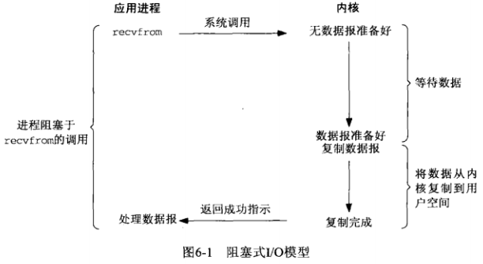

**2.非阻塞I/O模型**

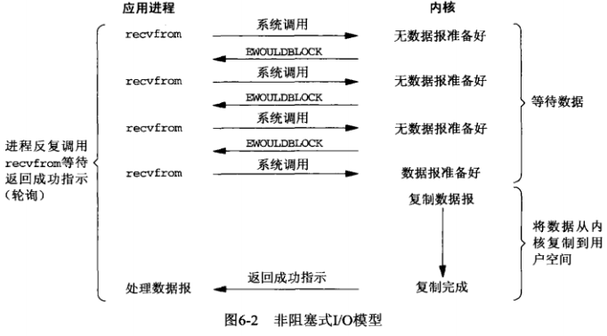

**3.I/O复用模型**

- select或poll使用的模型

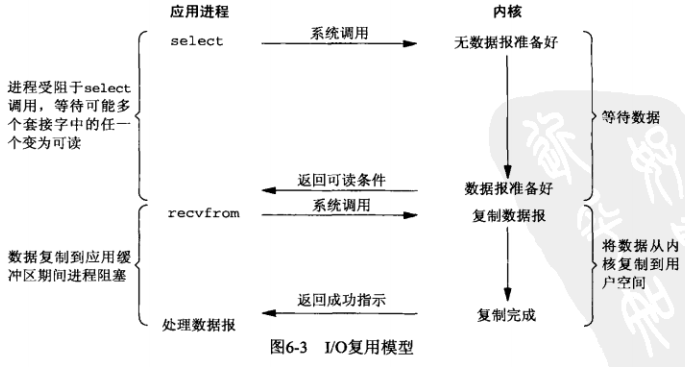

**4.信号驱动式I/O模型**

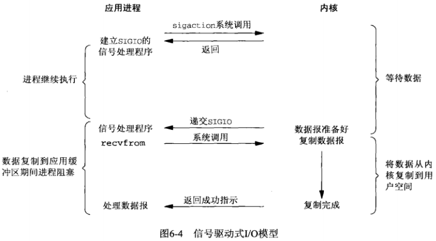

**5.异步I/O模型**

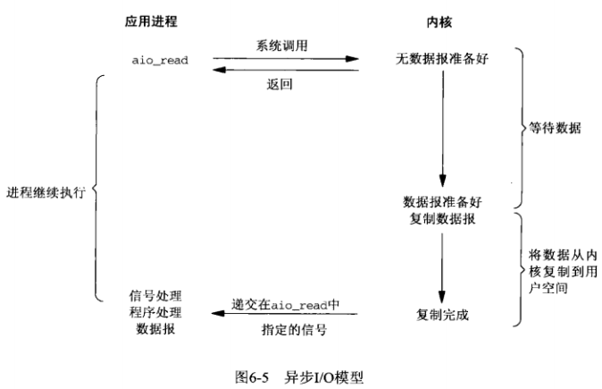

**各种模型的区别**

- 前4种之间的区别：第一阶段是否阻塞；他们的第二阶段都是一样的（阻塞）
- 同步（前4种）与异步（第5种）的区别：第二阶段是否阻塞（真正的I/O操作：recvfrom阶段是否阻塞）

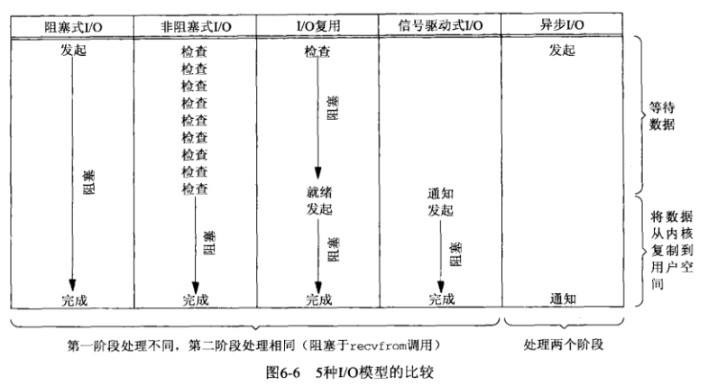


> 2).I/O 多路复用之select、poll、epoll详解

- I/O多路复用：一种机制，一个进程可以监视多个描述符，一旦某个描述符就绪（一般是读就绪或者写就绪），能够通知程序进行相应的读写操作
- I/O多路复用与多进程和多线程相比：最大优势是系统开销小，系统不必创建进程/线程，也不必维护这些进程/线程，从而大大减小了系统的开销

**select**

[select函数及fd_set介绍](https://blog.csdn.net/liitlefrogyyh/article/details/52101999)

[select、poll、epoll之间的区别总结[整理\]](http://www.cnblogs.com/Anker/p/3265058.html)

```c
/*
** @n:需要检查的文件描述字个数
** @readfds:用来检查可读性的一组文件描述字
** @writefds:用来检查可写性的一组文件描述字
** @exceptset:用来检查是否有异常条件出现的文件描述字。(注：错误不包括在异常条件之内)
** @timeout:超时，填NULL为阻塞，填0为非阻塞，其他值表示为一段超时时间。可设置超时时间，超时时间到了就跳过代码继续往下执行,用于决定select等待I/o的最长时间。如果为空将一直等待
 fd_set其实这是一个数组的宏定义，实际上是一long类型的数组，每一个数组元素都能与一打开的文件句柄(socket、文件、管道、设备等)建立联系，建立联系的工作由程序员完成，当调用select()时，由内核根据IO状态修改fd_set的内容，由此来通知执行了select()的进程哪个句柄可读
*/
int select (int n, fd_set *readfds, fd_set *writefds, fd_set *exceptfds, struct timeval *timeout);
```

- 基本原理：select 函数监视的文件描述符分3类，分别是writefds、readfds、和exceptfds。调用后select函数会阻塞，直到有描述符就绪（有数据可读、可写、或者有except），或者超时（timeout指定等待时间，如果立即返回设为null即可），函数返回。当select函数返回后，可以通过遍历fdset，来找到就绪的描述符。
- 优点：
  - 几乎在所有的平台上支持，良好跨平台支持
- 缺点：
  - 单个进程能够监视的文件描述符（fd）的数量存在最大限制，由FD_SETSIZE设置，默认值是1024。可以通过修改宏定义甚至重新编译内核的方式提升这一限制，但是这样也会造成效率的降低
  - 对socket进行扫描时是线性扫描，即采用轮询的方法，效率较低
  - 需要维护一个用来存放大量fd的数据结构，这样会使得用户空间和内核空间在传递该结构时复制开销大

**poll**

```c
/*
这个结构中fd表示文件描述符，events表示请求检测的事件，revents表示检测之后返回的事件，如果当某个文件描述符有状态变化时，revents的值就不为空
*/
struct pollfd {
	int fd;
	short events;
	short revents;
};
/*
** @fds:是一个struct pollfd结构类型的数组，用于存放需要检测其状态的Socket描述符；每当调用这个函数之后，系统不会清空这个数组，操作起来比较方便；特别是对于socket连接比较多的情况下，在一定程度上可以提高处理的效率；这一点与select()函数不同，调用select()函数之后，select()函数会清空它所检测的socket描述符集合，导致每次调用select()之前都必须把socket描述符重新加入到待检测的集合中；因此，select()函数适合于只检测一个socket描述符的情况，而poll()函数适合于大量socket描述符的情况。
** @nfds:nfds_t类型的参数，用于标记数组fds中的结构体元素的总数量
** @timeout:是poll函数调用阻塞的时间，单位：毫秒
*/
int poll (struct pollfd *fds, unsigned int nfds, int timeout);
```

- 基本原理：poll本质上和select没有区别，它将用户传入的链表拷贝到内核空间，然后查询每个fd对应的设备状态，如果设备就绪则在设备等待队列中加入一项并继续遍历，如果遍历完所有fd后没有发现就绪设备，则挂起当前进程，直到设备就绪或者主动超时，被唤醒后它又要再次遍历fd。这个过程经历了多次无谓的遍历
- 优点：
  - 它没有最大连接数的限制，原因是它是用户定义的动态数组
- 缺点：
  - 大量的fd的链表被整体复制于用户态和内核地址空间之间，而不管这样的复制是不是有意义
  - poll还有一个特点是“水平触发”，如果报告了fd后，没有被处理，那么下次poll时会再次报告该fd
- poll与select的共同点：
  - 都需要在返回后，通过遍历文件描述符来获取已经就绪的socket。事实上，同时连接的大量客户端在一时刻可能只有很少的处于就绪状态，因此随着监视的描述符数量的增长，其效率也会线性下降
- poll与select的不同点
  - fd文件描述符集合的大小限制
  - 调用函数时是否清空fd文件描述符集合

**epoll**

[IO多路复用之epoll总结](https://www.cnblogs.com/Anker/archive/2013/08/17/3263780.html)

[arking](https://github.com/arkingc/note/blob/master/计算机网络/UNIX网络编程卷1.md#4epoll)

```c
int epoll_create(int size)；//创建一个epoll的句柄，size用来告诉内核这个监听的数目一共有多大
int epoll_ctl(int epfd, int op, int fd, struct epoll_event *event)；
int epoll_wait(int epfd, struct epoll_event * events, int maxevents, int timeout);
```

- 基本原理：epoll支持水平触发和边缘触发，最大的特点在于边缘触发，它只告诉进程哪些fd刚刚变为就绪态，并且只会通知一次。还有一个特点是，epoll使用“事件”的就绪通知方式，通过epoll_ctl注册fd，一旦该fd就绪，内核就会采用类似callback的回调机制来激活该fd，epoll_wait便可以收到通知
- 优点：
  - 没有最大并发连接的限制，能打开的FD的上限远大于1024（1G的内存上能监听约10万个端口）
  - 效率提升，不是轮询的方式，不会随着FD数目的增加效率下降。只有活跃可用的FD才会调用callback函数；即Epoll最大的优点就在于它只管你“活跃”的连接，而跟连接总数无关，因此在实际的网络环境中，Epoll的效率就会远远高于select和poll
  - 内存拷贝，利用mmap()文件映射内存加速与内核空间的消息传递；即epoll使用mmap减少复制开销
- 工作模式：
  - 水平触发（LT（level trigger））：当epoll_wait检测到描述符事件发生并将此事件通知应用程序，应用程序可以不立即处理该事件。下次调用epoll_wait时，会再次响应应用程序并通知此事件
    - 缺省模式
    - 支持block和no-block socket
  - 边缘触发（ET（edge trigger））：当epoll_wait检测到描述符事件发生并将此事件通知应用程序，应用程序必须立即处理该事件。如果不处理，下次调用epoll_wait时，不会再次响应应用程序并通知此事件
    - 高速工作方式，效率要比LT模式高
    - 只支持no-block socket
- epoll与select/poll的区别：
  - 在select/poll中，进程只有在调用一定的方法后，内核才对所有监视的文件描述符进行扫描
  - epoll事先通过`epoll_ctl()`来注册一个文件描述符，一旦基于某个文件描述符就绪时，内核会采用类似callback的回调机制，迅速激活这个文件描述符，当进程调用`epoll_wait()`时便得到通知（此处去掉了遍历文件描述符，而是通过监听回调的的机制。这正是epoll的魅力所在）
- 注意：如果没有大量的idle-connection或者dead-connection，epoll的效率并不会比select/poll高很多，但是当遇到大量的idle-connection，就会发现epoll的效率大大高于select/poll

**总结：select、poll、epoll区别**

- 1.支持一个进程所能打开的最大连接数
  - select使用的是指针指向的long数组，位图
  - poll使用的是pollfd动态数组

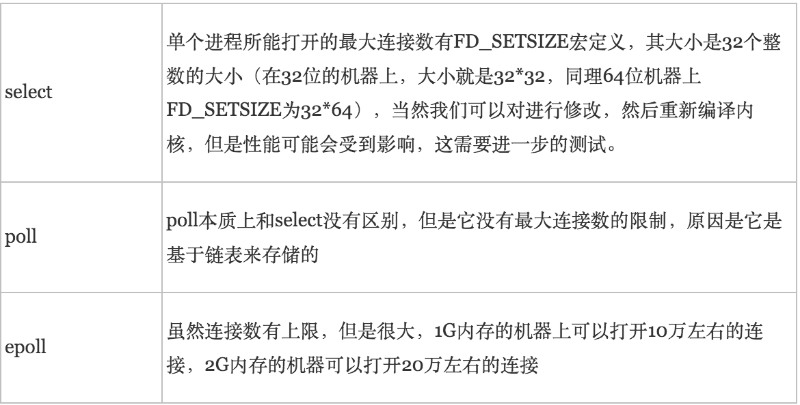

- 2.FD剧增后带来的IO效率问题

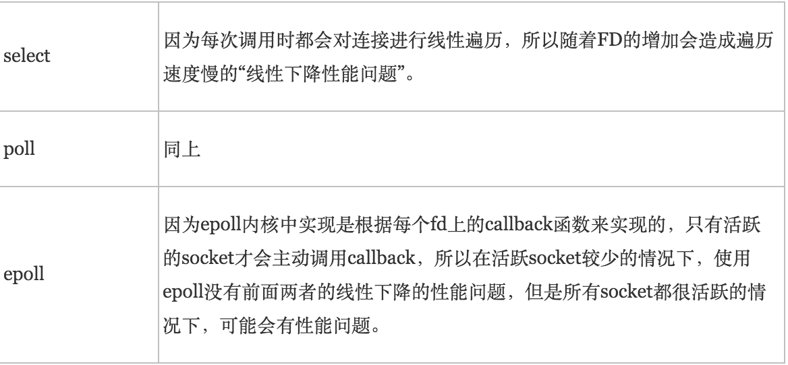

- 3.消息传递方式
  - select每次调用时清空文件描述符集合，但poll不清空


**如何选择，需要结合场景和自身特点**

- 在连接数少并且连接都十分活跃的情况下：select和poll的性能可能比epoll好，因为epoll的通知机制需要很多函数回调

**另一版本：select、poll、epoll区别**

**select：**是最初解决IO阻塞问题的方法。用结构体fd_set来告诉内核监听多个文件描述符，该结构体被称为描述符集。由数组来维持哪些描述符被置位了。对结构体的操作封装在三个宏定义中。通过轮寻来查找是否有描述符要被处理，如果没有返回
存在的问题： 

- 1.内置数组的形式使得select的最大文件数受限与FD_SIZE
- 每次调用select前都要重新初始化描述符集，将fd从用户态拷贝到内核态，每次调用select后，都需要将fd从内核态拷贝到用户态
- 3.轮寻排查当文件描述符个数很多时，效率很低

**poll：**通过一个可变长度的数组解决了select文件描述符受限的问题。数组中元素是结构体，该结构体保存描述符的信息，每增加一个文件描述符就向数组中加入一个结构体，结构体只需要拷贝一次到内核态。poll解决了select重复初始化的问题。轮寻排查的问题未解决。

**epoll：**轮寻排查所有文件描述符的效率不高，使服务器并发能力受限。因此，epoll采用只返回状态发生变化的文件描述符，便解决了轮寻的瓶颈。 

>  3).为什么使用IO多路复用，最主要的原因是什么？ 

可达到在同一个线程内同时处理多个IO请求的目的。而在同步阻塞模型中，必须通过多线程的方式才能达到这个目的

>  4).epoll有两种触发模式？这两种触发模式有什么区别？编程的时候有什么区别？ 

epoll有EPOLLLT和EPOLLET两种触发模式，LT是默认的模式，ET是“高速”模式。LT模式下，只要这个fd还有数据可读，每次 epoll_wait都会返回它的事件，提醒用户程序去操作，而在ET（边缘触发）模式中，它只会提示一次，直到下次再有数据流入之前都不会再提示了，无论fd中是否还有数据可读。所以在ET模式下，read一个fd的时候一定要把它的buffer读光，也就是说一直读到read的返回值小于请求值，或者遇到EAGAIN错误

## 2.bcopy和memcpy的区别？

[UNIX网络编程](https://github.com/arkingc/note/blob/master/计算机网络/UNIX网络编程卷1.md#22-字节操纵函数)

操纵多字节字段的函数有2组：

```
/***********************************************************************
 *  第一组：起源于4.2BSD，几乎所有现今支持套接字函数的系统仍然提供
 **********************************************************************/
#include <strings.h>
void bzero(void *dest,size_t nbytes);
void bcopy(const void *src,void *dest,size_t nbytes);
int bcmp(const void *ptr1,const void *ptr2,size_t nbytes);

/***********************************************************************
 *  第二组：起源于ANSI C，支持ANSI C函数库的所有系统都提供
 **********************************************************************/
#include <string.h>
void* memset(void *dest,int c,size_t len);
void* memcpy(void *dest,const void *src,size_t nbytes);
int memcmp(const void *ptr1,const void *ptr2,size_t nbytes);
```

- bzero相比于memset只有2个参数
- bcopy能够正确处理源“字节串”与目标“字节串”重叠，memcpy不行（可以用memmove）

> bzero和memset可用于**套接字地址结构**的初始化

## 3.字节序

**小端字节序**：将低序字节存储在起始地址

**大端字节序**：将高序字节存储在起始地址

”大端“、”小端“表示多个字节值的哪一端（小端或大端）存储在该值的起始地址

**MSB**：most significant bit，最高有效位

**LSB**：least significant bit，最低有效位

**主机字节序**：某个给定系统所用的字节序称为主机字节序（不同系统有不同）


```c
union {
	  short  s;
      char   c[sizeof(short)];
    } un;
un.s = 0x0102; //两位一个字节
if(un.c[0] == 1 && un.c[1] == 2); //大端
if (un.c[0] == 2 && un.c[1] == 1); //小端
```

**网络字节序**：网络协议使用**大端字节序**来传递这些字节整数

主机字节序与网络字节序之间的转换函数：

```c
#include <netinet/in.h>
//h表示host, n表示network，s代表short，l代表long
//均返回：网络字节序的值
uint16_t htons(uint16_t host16bitvalue);    //主机to网络 short
uint32_t htonl(uint32_t host32bitvalue);    //主机to网络 long

//均返回：主机字节序的值
uint16_t ntohs(uint16_t net16bitvalue);     //网络to主机 short
uint32_t ntohl(uint32_t net32bitvalue);     //网络to主机 long
```

## 4.Linux服务器最大TCP连接数

[单机最大tcp连接数](http://wanshi.iteye.com/blog/1256282)

> 背景知识---如何标识一个TCP连接

系统用一个4四元组来唯一标识一个TCP连接：{local ip, local port,remote ip,remote port} 

> client的理论最大值

理论值取决于端口号数量：65535

client每次发起tcp连接请求时，除非绑定端口，通常会让系统选取一个空闲的本地端口（local port），该端口是独占的，不能和其他tcp连接共享，因此client端的tcp连接数取决于/受限于端口数量。tcp端口的数据类型是unsigned short，因此本地端口个数最大只有65536，端口0有特殊含义，不能使用，这样可用端口最多只有65535，所以在全部作为client端的情况下，一个client最大tcp连接数为65535，这些连接可以连到不同的server ip 

> server的理论最大值

理论最大值等于 `客户ip数*客户port数`，即 `2^32(ip个数) * 2^16(port个数)` 。如果是多宿主机的话，还要考虑网卡个数；如果服务器监听多个端口的话，也要考虑多端口情况。

server通常固定在某个本地端口上监听，等待client的连接请求。不考虑地址重用（unix的SO_REUSEADDR选项）的情况下，即使server端有多个ip，本地监听端口也是独占的，因此server端tcp连接4元组中只有remote ip（也就是client ip）和remote  port（客户端port）是可变的，因此最大tcp连接为客户端ip数×客户端port数，对IPV4，不考虑ip地址分类等因素，最大tcp连接数约为2的32次方（ip数）×2的16次方（port数），也就是server端单机最大tcp连接数约为2的48次方。 

> 实际值

受限情况：

- 1.内存 
- 2.允许的文件描述符个数 
- 3.1024以下的端口通常为保留端口 

上面给出的是理论上的单机最大连接数，在实际环境中，受到机器资源、操作系统等的限制，特别是sever端，其最大并发tcp连接数远不能达到理论上限。在unix/linux下限制连接数的主要因素是内存和允许的文件描述符个数（每个tcp连接都要占用一定内存，每个socket就是一个文件描述符），另外1024以下的端口通常为保留端口。 

对server端，通过增加内存、修改最大文件描述符个数等参数，单机最大并发TCP连接数**超过10万,甚至上百万** 是没问题的 

> 相关题目

[链接](https://www.nowcoder.com/questionTerminal/997f45dddc9b4c8ea7da76288aa439d1?orderByHotValue=1&pos=1)

Linux中，一个端口能够接受tcp链接数量的理论上限是？ （答案：无上限）

## 5.非阻塞connect

> 阻塞与非阻塞的区别

可能阻塞的**套接字调用**可分为以下4类： 

- **1.输入操作**：包括read、readv、recv、recvfrom和recvmsg 
  - **阻塞**：如果套接字的接收缓冲区中没有数据可读，进程将被投入睡眠，直到一些数据到达
    - TCP：只要有数据到达（单个字节或万兆的TCP分节），就唤醒进程。如果想要等到某个固定数目的数据为止，使用readn函数或指定MSG_WAITALL标志
    - UDP：只要有UDP数据报到达，就唤醒进程
  - **非阻塞**：如果输入操作不能被满足（TCP至少一个字节，UDP至少一个数据报），相应调用将立即返回一个EWOULDBLOCK错误 
- **2.输出操作**：包括write、writev、send、sendto和sendmsg 
  - **阻塞**： 如果套接字的发送缓冲区中没有空间，进程将被投入睡眠 （**仅对于TCP**）
    - **UDP**：输出函数调用将不会因**空间问题**阻塞，不过有可能因其他原因阻塞
  - **非阻塞**：如果发送缓存区中根本没空间，返回一个EWOULDBLOCK错误；如果有一些空间，返回值是内核能够复制到该缓冲区中的字节数，也称为”不足计数“ （**仅对于TCP**）
- **3.接受连接**：即accept函数
  - **阻塞**：如果尚无新的连接到达，调用进程将被投入睡眠 
  - **非阻塞**：如果尚无新的连接到达，调用将立即返回一个EWOULDBLOCK错误
- **4.发起连接**：用于TCP的connect函数（UDP的connect不是真正的连接） 
  - **阻塞**：connect将阻塞到3路握手的前2路完成（即至少阻塞1个RTT） 
  - **非阻塞**：如果对于一个非阻塞的TCP套接字调用connect，并且连接不能立即建立，那么照样会发起连接（发出3路握手的第1个分组），但会返回一个EINPROGRESS错误
    - 可以立即建立的连接：服务器和客户处于同一个主机 

> 非阻塞connect

如果对于一个非阻塞的TCP套接字调用connect，并且连接不能立即建立，那么照样会发起连接，但会返回一个EINPROGRESS错误。接着使用select检查这个连接或成功或失败的已建立条件

非阻塞的connect有**3个用途**：

- 1.**可以把3路握手叠加在其他处理上**（完成一个connect要花一个RTT，而RTT波动范围很大，这段时间内也许有想要执行的其他处理工作可执行） 
- 2.**同时建立多个连接**
- 3.既然使用select等待连接建立，**可以给select指定一个时间限制，缩短connect的超时**（许多实现有着75s到数分钟的connect超时时间） 

使用非阻塞式connect时，**必须处理下列细节**：

- 1.尽管套接字非阻塞，如果连接到的服务器在同一个主机上，那么当我们调用connect时，连接通常立刻建立。因此，必须处理这种情况
- 2.源自Berkeley的实现对于select和非阻塞connect有以下两个规则：
  - 当连接成功建立时，描述符变为可写
  - 当连接建立遇到错误时，描述符变为既可读又可写

> 被中断的connect

被中断的connect：对于一个正常的阻塞式套接字，如果其上的connect调用在TCP三路握手完成前被中断（譬如捕获了某个信号）：如果connect调用不由内核自动重启，那么它将返回EINTR。不能再次调用connect等待未完成的连接继续完成，否则会返回EADDRINUSE错误。只能调用select像处理非阻塞式connect那样处理（关闭，重新调用connect）

## 6.连接建立过程中每个SYN可以包含哪些TCP选项？

连接建立的前2次握手中，每一个SYN可以包含多个TCP选项：

- [MSS选项](https://github.com/arkingc/note/blob/master/%E8%AE%A1%E7%AE%97%E6%9C%BA%E7%BD%91%E7%BB%9C/UNIX%E7%BD%91%E7%BB%9C%E7%BC%96%E7%A8%8B%E5%8D%B71.md#1tcp_maxseg)：向对端通告**最大分节大小**，即MSS，也就是愿意接收的最大数据量。发送端TCP使用接收端的MSS值作为所发送分节的最大大小（可以通过TCP_MAXSEG套接字选项提取和设置）
- [窗口规模选项](https://github.com/arkingc/note/blob/master/%E8%AE%A1%E7%AE%97%E6%9C%BA%E7%BD%91%E7%BB%9C/UNIX%E7%BD%91%E7%BB%9C%E7%BC%96%E7%A8%8B%E5%8D%B71.md#4so_rcvbuf%E5%92%8Cso_sndbuf)：TCP首部中接收窗口首部为16位，意味着能通告对端的最大窗口大小是65535。然而这个值现今已不够用，窗口规模选项用于指定TCP首部中接收窗口必须扩大(即左移)的位数(0~14)，因此所提供的最大窗口接近1GB(65535x2^14)（**使用前提是两个端系统都支持该选项**）

**TCP的窗口规模选项是在建立连接时用SYN分节与对端互换得到的**：

- 对于客户，这意味着SO_RCVBUF选项必须在调用connect之前设置
- 对于服务器，这意味着该选项必须在调用listen之前给监听套接字设置

给已连接套接字设置该选项对于可能存在的窗口规模选项没有任何影响，因为accept直到TCP的三路握手完成才会创建并返回已连接套接字。这就是必须给监听套接字设置该选项的原因。（套接字缓冲区的大小总是由新创建的已连接套接字从监听套接字继承而来）

## 7.TCP连接建立过程中的超时

[参考链接](http://www.chengweiyang.cn/2017/02/18/linux-connect-timeout/)

即TCP connect的超时时间。Linux 系统默认的建立 TCP 连接的超时时间为 127 秒（2^7-1）

如果 TCP 握手的 SYN 包超时重试按照 2 的幂来 backoff， 那么：

1. 第 1 次发送 SYN 报文后等待 1s（2 的 0 次幂），如果超时，则重试
2. 第 2 次发送后等待 2s（2 的 1 次幂），如果超时，则重试
3. 第 3 次发送后等待 4s（2 的 2 次幂），如果超时，则重试
4. 第 4 次发送后等待 8s（2 的 3 次幂），如果超时，则重试
5. 第 5 次发送后等待 16s（2 的 4 次幂），如果超时，则重试
6. 第 6 次发送后等待 32s（2 的 5 次幂），如果超时，则重试
7. 第 7 次发送后等待 64s（2 的 6 次幂），如果超时，则超时失败

上面的结果刚好是 127 秒。也就是说 Linux 内核在尝试建立 TCP 连接时，最多会尝试 7 次

> 修改超时实参的办法

修改重试次数

```shell
# sysctl -a | grep tcp_syn_retries
net.ipv4.tcp_syn_retries = 6   #重试6次
    
# sysctl net.ipv4.tcp_syn_retries=1  #重试1次
```

## 8.地址复用和端口复用 SO_REUSEADDR和SO_REUSEPOPT套接字

[参考链接 7.5.11 SO_REUSEADDR和SO_REUSEPOPT套接字](https://github.com/guanjunjian/Interview-Summary/blob/master/notes/network/unp笔记.md)

## 9.已连接UDP套接字

《unp 8.11》

**给UDP套接字调用connect**：不给对端主机发送任何信息，没有三次握手过程，它完全是一个本地操作，内核只是检查是否存在立即可知的错误（如一个显然不可达的目的地），记录对端的IP地址和端口号（取自传递给connect的套接字地址结构），然后connect立即返回到调用进程。如果在一个未绑定到端口号的UDP套接字上调用connect同时也给该套接字指派一个临时端口

**未连接UDP套接字**：新创建UDP套接字默认状态

**已连接UDP套接字**：对UDP套接字调用connect的结果

已连接套接字与未连接套接字相比，有**三个变化**：

- 1.不再给输出操作指定目的IP地址和端口号，不使用sendto（也可以使用，但不能指定目的地址，即to、addrlen参数必须为空和0），而**改用write或send**。写到已连接UDP套接字上的任何内容都自动发送到由connect指定的协议地址
- 2.不使用recvfrom获取数据报的发送者，而**改用read、recv或recvmsg**。在一个已连接UDP套接字上，由内核为输入操作返回的数据报只有那些来自connect所指定协议地址的数据报。目的地位这个已连接套接字的本地协议地址，发源地不是该套接字早先conncect到的协议地址的数据报，不会投递到给套接字。已连接套接字仅能与一个对端交换数据报
- 3.由已连接UDP套接字引发的异步错误会返回给它们所在的进程，而未连接UDP套接字不接收任何异步错误


**不对应的数据报如何处理**：来自任何其他IP地址或端口的数据报，不投递给不与其对应的已连接UDP套接字，可能投递给同一个主机上的其他某个UDP套接字，如果没有匹配的其他套接字，UDP将丢弃它们，并生成相应的ICMP端口不可达错误

## 10.Linux高性能服务器编程——进程池和线程池

[Linux高性能服务器编程——进程池和线程池](https://blog.csdn.net/walkerkalr/article/details/37729323)

- 半同步/半异步模式（同步线程用于处理客户逻辑，异步线程用于处理I/O时间（accept））
- 半同步/半反应堆模式
- 领导者/追随者模式

在并发模式中，同步指的是程序完全按照代码序列的顺序执行；异步指的是程序的执行需要由系统事件来驱动。常见的系统事件包括中断、信号等。如下描述了同步的读操作和异步的读操作。 

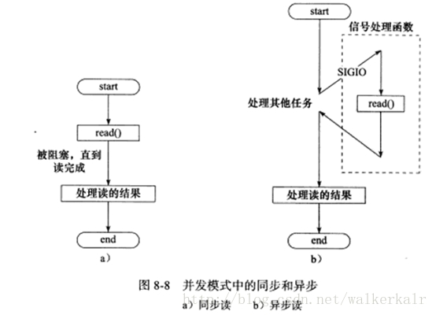

---

[第30章 服务/服务器程序设计范式](https://github.com/guanjunjian/Interview-Summary/blob/master/notes/network/unp笔记.md)

- 多进程，子进程accept
  - accept不使用锁，进程阻塞于accept，有些系统不支持
  - accept使用文件锁，进程阻塞于锁
  - accept使用线程锁（互斥量，需要将锁至于共享内存区，如使用mmap函数和/dev/zero设备），进程阻塞于锁
- 多进程，父进程使用管道将fd传给子进程（子进程存于数组中），子进程需保存一个状态（是否空闲），进程阻塞于管道
- 多线程，非主线程accept，使用线程锁保护accept，线程阻塞于锁
- 多线程，主线程accept，使用数组存储fd，使用互斥量和条件变量保护数组，线程阻塞于互斥量或条件变量

## 11.100万并发连接服务器性能调优

[100万并发连接服务器笔记](http://www.blogjava.net/yongboy/archive/2013/04.html)

[100万并发连接服务器笔记之1M并发连接目标达成](http://www.blogjava.net/yongboy/archive/2013/04/11/397677.html)

[关于高负载服务器Kernel的TCP参数优化](https://www.cnblogs.com/94cool/p/5631905.html)

遇到的问题：

- 文件描述符数量受限：一般每个进程最多允许同时打开1024个文件 
- 端口数量受限：单机端口上限为65535
- 增加IP地址：由于65535个端口还是不够用，因此需要添加虚拟ip地址
- tcp_mem

> 文件描述符数量受限 解决方法

root用户编辑/etc/security/limits.conf文件添加： 

```
* soft nofile 1048576
* hard nofile 1048576
```

- soft是一个警告值，而hard则是一个真正意义的阀值，超过就会报错。
- soft 指的是当前系统生效的设置值。hard 表明系统中所能设定的最大值
- nofile - 打开文件的最大数目
- 星号表示针对所有用户，若仅针对某个用户登录ID，请替换星号

> 端口数量受限 解决方法

端口为16进制，那么2的16次方值为65536，在linux系统里面，1024以下端口都是超级管理员用户（如root）才可以使用，普通用户只能使用大于1024的端口值。
系统提供了默认的端口范围：

    cat /proc/sys/net/ipv4/ip_local_port_range
    32768 61000

大概也就是共61000-32768=28232个端口可以使用，单个IP对外只能发送28232个TCP请求。
以管理员身份，把端口的范围区间增到最大：

    echo "1024 65535"> /proc/sys/net/ipv4/ip_local_port_range

> 添加IP地址

一般假设本机网卡名称为 eth0，那么手动再添加几个虚拟的IP：

    ifconfig eth0:1 192.168.190.151
    ifconfig eth0:2 192.168.190.152 ......
> 修改tcp_mem

需要调整的内核参数

- tcp_mem：内核分配给TCP连接的内存，单位是Page，1 Page = 4096 Bytes
- tcp_rmem：为每个TCP连接分配的读缓冲区大小，单位是Byte
- tcp_wmem：为每个TCP连接分配的写缓冲区大小，单位是Byte

```
echo "net.ipv4.tcp_mem = 786432 2097152 3145728">> /etc/sysctl.conf
echo "net.ipv4.tcp_rmem = 4096 4096 16777216">> /etc/sysctl.conf
echo "net.ipv4.tcp_wmem = 4096 4096 16777216">> /etc/sysctl.conf
```

## 12.TIME_WAIT和CLOSE_WAIT状态详解及性能调优

[你所不知道的TIME_WAIT和CLOSE_WAIT](http://blog.oldboyedu.com/tcp-wait/)

> 如何避免time_wati

/etc/sysctl.conf是一个允许改变正在运行中的Linux系统的接口，它包含一些TCP/IP堆栈和虚拟内存系统的高级选项，修改内核参数永久生效。也就是说/proc/sys下内核文件与配置文件sysctl.conf中变量存在着对应关系。 

打开 sysctl.conf 文件，修改以下几个参数：

- net.ipv4.tcp_tw_recycle = 1
  - 内核会快速的回收处于TIME_WAIT状态的socket连接。多快？一个RTO（retransmission timeout，数据包重传的timeout时间）的时间，这个时间根据RTT动态计算出来，但是远小于2MSL。
- net.ipv4.tcp_tw_reuse = 1
  - 可以复用TIME_WAIT状态的连接。  
- net.ipv4.tcp_timestamps = 1
  - 两个4字节的时间戳字段，其中第一个4字节字段用来保存发送该数据包的时间，第二个4字节字段用来保存最近一次接收对方发送到数据的时间。 

## 13.accept与epoll惊群

[accept与epoll惊群](https://pureage.info/2015/12/22/thundering-herd.html)

惊群现象（thundering herd）就是当多个进程和线程在同时阻塞等待同一个事件时，如果这个事件发生，会唤醒所有的进程，但最终只可能有一个进程/线程对该事件进行处理，其他进程/线程会在失败后重新休眠，这种性能浪费就是惊群

> accept

accept惊群：主进程创建socket, bind,  listen之后，fork出多个子进程，每个子进程都开始循环处理（accept）这个socket。每个进程都阻塞在accpet上，当一个新的连接到来时，所有的进程都会被唤醒，但其中只有一个进程会accept成功，其余皆失败，重新休眠。这就是accept惊群 

事实上，历史上，Linux 的 accpet 确实存在惊群问题，但现在的内核都解决该问题了。即，当多个进程/线程都阻塞在对同一个 socket 的 accept 调用上时，当有一个新的连接到来，内核只会唤醒一个进程，其他进程保持休眠，压根就不会被唤醒。 

> epoll

如果多个进程/线程阻塞在监听同一个 listening socket fd 的 epoll_wait 上，当有一个新的连接到来时，所有的进程都会被唤醒（没有被解决）

内核不处理epoll惊群的原因：accept 确实应该只能被一个进程调用成功，内核很清楚这一点。但 epoll 不一样，他监听的文件描述符，除了可能后续被 accept  调用外，还有可能是其他网络 IO 事件的，而其他 IO  事件是否只能由一个进程处理，是不一定的，内核不能保证这一点，这是一个由用户决定的事情，例如可能一个文件会由多个进程来读写。所以，对 epoll  的惊群，内核则不予处理。 

## 14.Reactor模式和Preactor模式

[IO复用（Reactor模式和Preactor模式）——用epoll来提高服务器并发能力](https://www.cnblogs.com/binchen-china/p/5487795.html)

[reactor和proactor模式（epoll和iocp）](https://blog.csdn.net/zccracker/article/details/38686339)

[高性能IO设计的Reactor和Proactor模式](http://xmuzyq.iteye.com/blog/783218)

在高性能的I/O设计中，有两个比较著名的模式Reactor和Proactor模式，其中Reactor模式用于同步I/O，而Proactor运用于异步I/O操作。

​       在比较这两个模式之前，我们首先的搞明白几个概念，什么是阻塞和非阻塞，什么是同步和异步,同步和异步是针对应用程序和内核的交互而言的，同步指的是用户进程触发IO操作并等待或者轮询的去查看IO操作是否就绪，而异步是指用户进程触发IO操作以后便开始做自己的事情，而当IO操作已经完成的时候会得到IO完成的通知。而阻塞和非阻塞是针对于进程在访问数据的时候，根据IO操作的就绪状态来采取的不同方式，说白了是一种读取或者写入操作函数的实现方式，阻塞方式下读取或者写入函数将一直等待，而非阻塞方式下，读取或者写入函数会立即返回一个状态值。

  一般来说I/O模型可以分为：同步阻塞，同步非阻塞，异步阻塞，异步非阻塞IO

   同步阻塞IO：

   在此种方式下，用户进程在发起一个IO操作以后，必须等待IO操作的完成，只有当真正完成了IO操作以后，用户进程才能运行。JAVA传统的IO模型属于此种方式！

   同步非阻塞IO:

在此种方式下，用户进程发起一个IO操作以后边可返回做其它事情，但是用户进程需要时不时的询问IO操作是否就绪，这就要求用户进程不停的去询问，从而引入不必要的CPU资源浪费。其中目前JAVA的NIO就属于同步非阻塞IO。

   异步阻塞IO：

   此种方式下是指应用发起一个IO操作以后，不等待内核IO操作的完成，等内核完成IO操作以后会通知应用程序，这其实就是同步和异步最关键的区别，同步必须等待或者主动的去询问IO是否完成，那么为什么说是阻塞的呢？因为此时是通过select系统调用来完成的，而select函数本身的实现方式是阻塞的，而采用select函数有个好处就是它可以同时监听多个文件句柄，从而提高系统的并发性！

   异步非阻塞IO:

   在此种模式下，用户进程只需要发起一个IO操作然后立即返回，等IO操作真正的完成以后，应用程序会得到IO操作完成的通知，此时用户进程只需要对数据进行处理就好了，不需要进行实际的IO读写操作，因为真正的IO读取或者写入操作已经由内核完成了。目前Java中还没有支持此种IO模型。   

​         搞清楚了以上概念以后，我们再回过头来看看，Reactor模式和Proactor模式。

首先来看看Reactor模式，Reactor模式应用于同步I/O的场景。我们分别以读操作和写操作为例来看看Reactor中的具体步骤：

读取操作：

1. 应用程序注册读就需事件和相关联的事件处理器

2. 事件分离器等待事件的发生

3. 当发生读就需事件的时候，事件分离器调用第一步注册的事件处理器

4. 事件处理器首先执行实际的读取操作，然后根据读取到的内容进行进一步的处理

写入操作类似于读取操作，只不过第一步注册的是写就绪事件。

下面我们来看看Proactor模式中读取操作和写入操作的过程：

读取操作：

1. 应用程序初始化一个异步读取操作，然后注册相应的事件处理器，此时事件处理器不关注读取就绪事件，而是关注读取完成事件，这是区别于Reactor的关键。

2. 事件分离器等待读取操作完成事件

3. 在事件分离器等待读取操作完成的时候，操作系统调用内核线程完成读取操作，并将读取的内容放入用户传递过来的缓存区中。这也是区别于Reactor的一点，Proactor中，应用程序需要传递缓存区。

4. 事件分离器捕获到读取完成事件后，激活应用程序注册的事件处理器，事件处理器直接从缓存区读取数据，而不需要进行实际的读取操作。

Proactor中写入操作和读取操作，只不过感兴趣的事件是写入完成事件。

从上面可以看出，Reactor和Proactor模式的主要区别就是真正的读取和写入操作是有谁来完成的，Reactor中需要应用程序自己读取或者写入数据，而Proactor模式中，应用程序不需要进行实际的读写过程，它只需要从缓存区读取或者写入即可，操作系统会读取缓存区或者写入缓存区到真正的IO设备.

​          综上所述，同步和异步是相对于应用和内核的交互方式而言的，同步 需要主动去询问，而异步的时候内核在IO事件发生的时候通知应用程序，而阻塞和非阻塞仅仅是系统在调用系统调用的时候函数的实现方式而已。

> **reactor**


Reactor模式实现非常简单，使用同步IO模型，即业务线程处理数据需要主动等待或询问，主要特点是利用epoll监听listen描述符是否有相应，及时将客户连接信息放于一个队列，epoll和队列都是在主进程/线程中，由子进程/线程来接管各个描述符，对描述符进行下一步操作，包括connect和数据读写。主程读写就绪事件

大致流程图如下： 

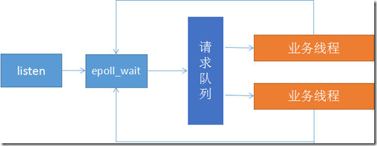

> **proactor** 


Preactor模式完全将IO处理和业务分离，使用异步IO模型，即内核完成数据处理后主动通知给应用处理，主进程/线程不仅要完成listen任务，还需要完成内核数据缓冲区的映射，直接将数据buff传递给业务线程，业务线程只需要处理业务逻辑即可。

大致流程如下：

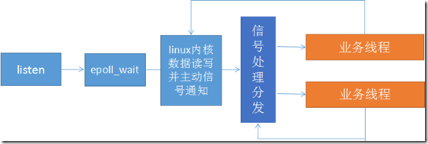

## 15.使用同步IO模型实现的Reactor模式的工作流程

[参考链接](https://github.com/arkingc/note/blob/master/interview/temp/IO.md)

> 以epoll_wait为例

- 主线程往epoll内核事件表中注册socket上的读就绪事件
- 主线程调用epoll_wait等待socket上有数据可读
- 当socket上有数据可读时，epoll_wait通知主线程。主线程将socket可读事件放入请求队列
- 睡眠在请求队列上的某个工作线程被唤醒，它从socket读取数据，并处理客户请求，然后往epoll内核事件表中注册该socket上的写就绪事件
- 主线程调用epoll_wait通知主线程。主线程将socket可写事件放入请求队列
- 睡眠在请求队列上的某个工作线程被唤醒，它往socket上写入服务器处理客户请求的结果

## 16.linux信号调用机制

[linux信号调用机制](https://www.cnblogs.com/3me-linux/p/3927221.html)

信号的处理：

- 1.忽略此信号
- 2.捕捉信号（信号处理函数，如在信号处理函数里waitpid）
- 3.执行系统默认动作，大多数信号的系统默认动作是终止该进程