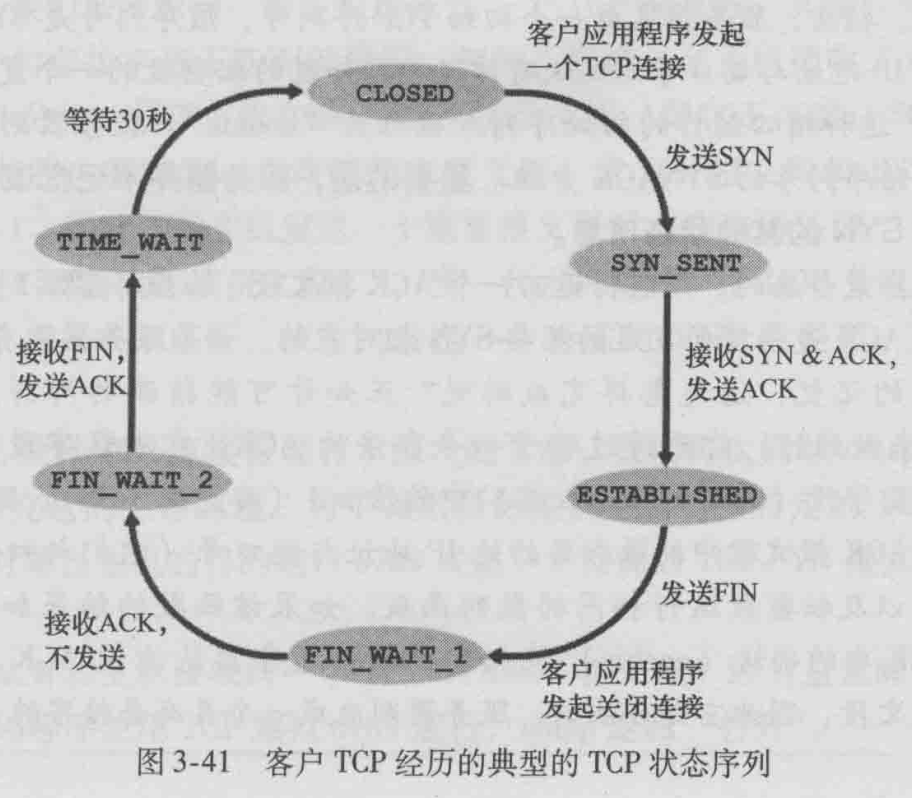
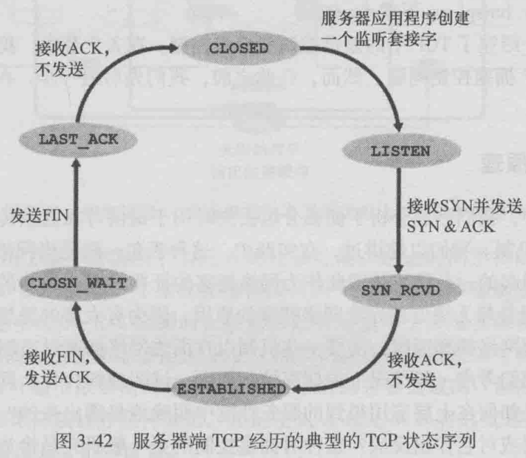
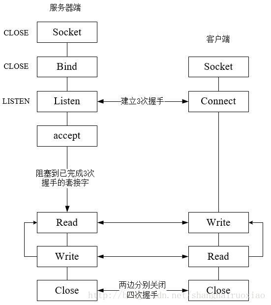
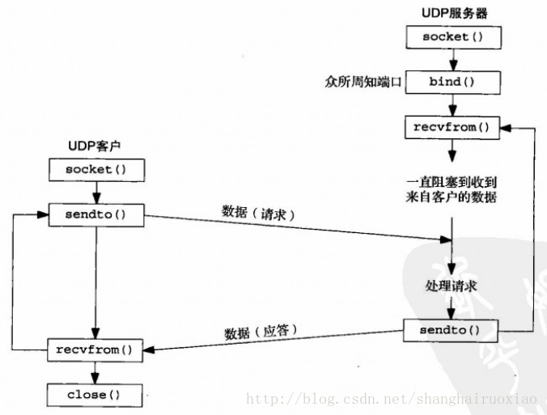
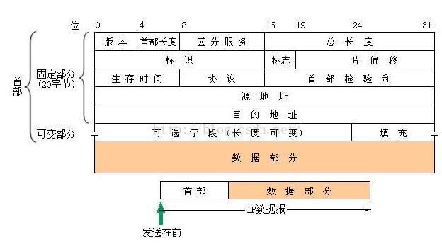
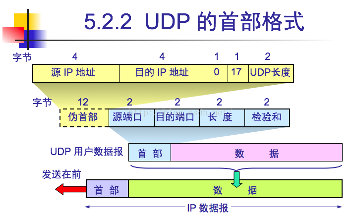
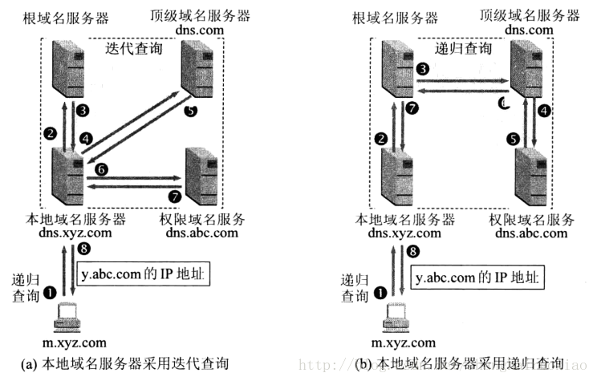
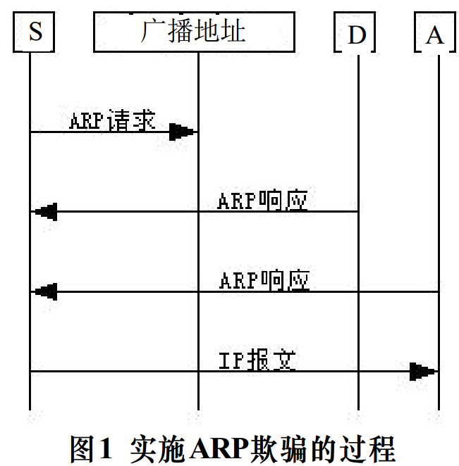

计算机网络

[TOC]

# 一、应用层

## 1.http/https 1.0、1.1、2.0

[HTTP1.0 HTTP 1.1 HTTP 2.0主要区别](https://blog.csdn.net/linsongbin1/article/details/54980801)

**(1).http的主要特点:** 

- 简单快速：只需要请求路径和请求方法
- 灵活：任意格式的数据对象
- 无连接：无连接的含义是限制每次连接只处理一个请求。服务器处理完客户的请求，并收到客户的应答后，即断开连接，采用这种方式可以节省传输时间。(当今多数服务器支持Keep-Alive功能，使用服务器支持长连接，解决无连接的问题)
- 无状态：没有记忆功能。（使用 cookie 机制可以保持 session，解决无状态的问题）

**(2).http1.1与http1.0的区别**

- 长连接：HTTP 1.0需要使用keep-alive参数来告知服务器端要建立一个长连接，而HTTP1.1默认支持长连接
- 节约带宽：
  - HTTP 1.1支持只发送**header信息**(不带任何body信息)，如果服务器认为客户端有权限请求服务器，则返回100，否则返回401。客户端如果接受到100，才开始把请求body发送到服务器
  - 支持文件**断点续传**
- HOST域：设置虚拟站点

**(3).http2.0与http1.1的区别**

- 多路复用：同一个连接并发处理多个请求
- 数据压缩：HTTP1.1不支持header数据的压缩，HTTP2.0使用HPACK算法对header的数据进行压缩
- 服务器推送：当我们对支持HTTP2.0的web server请求数据的时候，服务器会顺便把一些客户端需要的资源一起推送到客户端，免得客户端再次创建连接发送请求到服务器端获取

## 2.get/post区别

一：用途

get重点在从服务器上获取资源，post重点在向服务器发送数据。

二：数据存放方式

get传输数据是通过URL请求，以`field（字段）= value`的形式，置于URL后，并用"?"连接，多个请求数据间用"&"连接，如`http://127.0.0.1/Test/login.action?name=admin&password=admin`，这个过程用户是可见的；

post传输数据通过Http的post机制，将字段与对应值封存在请求实体中（表单）发送给服务器，这个过程对用户是不可见的。

三：数据量和效率

Get传输的数据量小，因为受URL长度限制，但效率较高；

Post可以传输大量数据，所以上传文件时只能用Post方式。

四：安全

get是不安全的，因为URL是可见的，可能会泄露私密信息，如密码等；

post较get安全性较高。

## 3.返回状态码

一：2XX 成功

```
200 OK：请求成功，信息包含在返回的响应报文中
```

二：3XX 重定向

```
301 Moved Permanently：请求的对象已经被永久转移了，新的URL定义在响应报文的Location首部中。客户机软件自动用新的URL获取对象
```

四：4XX 客户端错误

```
400 Bad Request：请求不能被服务器理解
403 Forbidden：服务器收到请求，但是拒绝提供服务。服务器通常会在响应报文中给出不提供服务的原因
404 Not Found：被请求的文档不在服务器上
```

五：5XX 服务器错误

```
505 HTTP Version Not Supported：服务器不支持请求报文使用的HTTP协议版本
```

## 4.http协议头相关

[《计算机网络---arking》](https://github.com/arkingc/note/blob/master/%E8%AE%A1%E7%AE%97%E6%9C%BA%E7%BD%91%E7%BB%9C/%E8%AE%A1%E7%AE%97%E6%9C%BA%E7%BD%91%E7%BB%9C.md#1http%E6%8A%A5%E6%96%87%E6%A0%BC%E5%BC%8F%E8%AF%B7%E6%B1%82%E6%8A%A5%E6%96%87)

> HTTP报文格式(请求报文)


“Host”：请求的目标主机
 “Connection:close”：浏览器告诉服务器不希望麻烦地使用持久连接，而是要求服务器在发送完请求后关闭连接
 “User-agent”：用户代理，即向服务器发送请求的浏览器的类型（服务器可以正确地为不同类型的用户代理发送相同对象的不同版本）
 “Accept-language”：用户想得到该对象的语法版本

[](https://github.com/arkingc/note/blob/master/pic/net-2-4.png)

**方法字段：**

- **GET**：绝大部分HTTP请求报文使用GET方法
- **POST**：用户提交表单时（如向搜索引擎提供关键字），但提交表单不一定要用POST方法
- **HEAD**：类似于GET，区别在于服务器返回的响应报文中不包含请求对象（常用于故障跟踪）
- **PUT**：用于向服务器上传对象
- **DELETE**：用于删除服务器上的对象

> HTTP报文格式(响应报文)


“Connection:close”：告诉客户机在报文发送完后关闭了TCP连接
 “Date”：报文生成、发送时的日期
 “Last-Modified”：web对象最后修改的日期


**状态信息：**

- **200 OK**：请求成功，信息包含在返回的响应报文中
- **301 Moved Permanently**：请求的对象已经被永久转移了，新的URL定义在响应报文的Location首部中。客户机软件自动用新的URL获取对象
- **304 Not Modified**：条件GET的响应报文中的状态码，web服务器告诉web缓存相应对象未被修改
- **400 Bad Request**：请求不能被服务器理解
- **403 Forbidden**：服务器收到请求，但是拒绝提供服务。服务器通常会在响应报文中给出不提供服务的原因
- **404 Not Found**：被请求的文档不在服务器上
- **505 HTTP Version Not Supported**：服务器不支持请求报文使用的HTTP协议版本

## 5.https与http的区别？如何实现加密传输？

- HTTP协议传输的数据都是未加密的，也就是明文的，不安全，HTTPS协议是由SSL+HTTP协议构建的可进行加密传输、身份认证的网络协议，要比http协议安全。（SSL：Secure Sockets Layer）
- 具体区别：
  - 费用不同：https协议需要到ca申请证书，一般免费证书较少，因而需要一定费用
  - 传输加密：http是超文本传输协议，信息是明文传输，https则是具有安全性的ssl加密传输协议
  - 连接方式和端口：http和https使用的是完全不同的连接方式，用的端口也不一样，前者是80，后者是443
  - 协议复杂度：http的连接很简单，是无状态的；HTTPS协议是由SSL+HTTP协议构建的可进行加密传输、身份认证的网络协议，比http协议安全

[HTTP与HTTPS的区别](http://www.cnblogs.com/wqhwe/p/5407468.html)

[HTTP.md](https://github.com/CyC2018/Interview-Notebook/blob/master/notes/HTTP.md#六https)

HTTPs 并不是新协议，而是让 HTTP 先和 SSL（Secure Sockets Layer）通信，再由 SSL 和 TCP 通信。也就是说 HTTPs 使用了隧道进行通信。

通过使用 SSL，HTTPs 具有了加密（防窃听）、认证（防伪装）和完整性保护（防篡改）

> 加密

1.对称加密：加密和解密使用同一密钥 

- 优点：运算速度快；
- 缺点：无法安全地将密钥传输给通信方。

2.非对称密钥加密（公开密钥加密 ）：加密和解密使用不同的密钥。公开密钥所有人都可以获得，通信发送方获得接收方的公开密钥之后，就可以使用公开密钥进行加密，接收方收到通信内容后使用私有密钥解密。 

- 优点：可以更安全地将公开密钥传输给通信发送方；
- 缺点：运算速度慢。

HTTPs 采用混合的加密机制，使用非对称密钥加密用于传输对称密钥来保证安全性，之后使用对称密钥加密进行通信来保证效率。 

> 认证

通过使用  **证书**  来对通信方进行认证。

数字证书认证机构（CA，Certificate Authority）是客户端与服务器双方都可信赖的第三方机构。

服务器的运营人员向 CA 提出公开密钥的申请，CA 在判明提出申请者的身份之后，会对已申请的公开密钥做数字签名，然后分配这个已签名的公开密钥，并将该公开密钥放入公开密钥证书后绑定在一起。

进行 HTTPs 通信时，服务器会把证书发送给客户端。客户端取得其中的公开密钥之后，先使用数字签名进行验证，如果验证通过，就可以开始通信了。

通信开始时，客户端需要使用服务器的公开密钥将自己的私有密钥传输给服务器，之后再进行对称密钥加密。

## 6.浏览器中输入一个URL发生什么，用到哪些协议？

[详细过程](https://github.com/guanjunjian/Interview-Summary/blob/master/notes/network/Computer-Networking-Top-Down.md#57-%E5%9B%9E%E9%A1%BE-web-%E9%A1%B5%E9%9D%A2%E8%AF%B7%E6%B1%82%E7%9A%84%E5%8E%86%E7%A8%8B)

DHCP（基于UDP，获取本机IP、网关IP、DNS IP、子网掩码）、ARP（不使用UDP，ARP请求报文，网络层，解析网关路由器MAC地址）、DNS（使用UDP，解析域名）、TCP连接、HTTP请求响应 

- 浏览器中输入URL
- 浏览器将URL解析为IP地址，使用DNS（基于UDP），得到IP地址
  - 查询DNS缓存
  - 如果没有，给本地DNS发送查询请求
  - 本地DNS服务器使用：递归查询或迭代查询
- 与服务器建立一个http连接
  - 生成一个get请求报文（如果采用https还会先对http数据进行加密）
  - 将该报文传给TCP层
  - 将HTTP数据包分片，分片依据路径MTU和MSS
  - 发送给IP层
  - IP层通过路由选路，一跳一跳发送到目的地址
     网段内的寻址、IP地址的物理地址（ARP）	 	

## 7.除了post、get外，还有什么？

[HTTP请求方法](http://www.runoob.com/http/http-methods.html)

根据HTTP标准，HTTP请求可以使用多种请求方法。

HTTP1.0定义了三种请求方法： GET, POST 和 HEAD方法。

HTTP1.1新增了五种请求方法：OPTIONS, PUT, DELETE, TRACE 和 CONNECT 方法。

| 序号 | 方法    | 描述                                                         |
| ---- | ------- | ------------------------------------------------------------ |
| 1    | GET     | 请求指定的页面信息，并返回实体主体。                         |
| 2    | HEAD    | 类似于get请求，只不过返回的响应中没有具体的内容，用于获取报头 |
| 3    | POST    | 向指定资源提交数据进行处理请求（例如提交表单或者上传文件）。数据被包含在请求体中。POST请求可能会导致新的资源的建立和/或已有资源的修改。 |
| 4    | PUT     | 从客户端向服务器传送的数据取代指定的文档的内容。             |
| 5    | DELETE  | 请求服务器删除指定的页面。                                   |
| 6    | CONNECT | HTTP/1.1协议中预留给能够将连接改为管道方式的代理服务器。     |
| 7    | OPTIONS | 允许客户端查看服务器的性能。                                 |
| 8    | TRACE   | 回显服务器收到的请求，主要用于测试或诊断。                   |

## 8.cookie

[Http协议中Cookie详细介绍](https://www.cnblogs.com/bq-med/p/8603664.html)

HTTP协议作为无状态协议，对于HTTP协议而言，无状态同样指每次request请求之前是相互独立的，当前请求并不会记录它的上一次请求信息。那么问题来了，既然无状态，那完成一套完整的业务逻辑，发送多次请求的情况数不胜数，使用http如何将上下文请求进行关联呢？机智的人类通过优化，找到了一种简单的方式记录http协议的请求信息 

 

- 浏览器发送request请求到服务器，服务器除了返回请求的response之外，还给请求分配一个唯一标识ID，协同response一并返回给浏览器。

- 同时服务器在本地创建一个MAP结构，专门以key-value（请求ID-会话内容）形式将每个request进行存储
- 此时浏览器的request已经被赋予了一个ID，第二次访问时，服务器先从request中查找该ID，根据ID查找维护会话的content内容，该内容中记录了上一次request的信息状态。
- 根据查找出的request信息生成基于这些信息的response内容，再次返回给浏览器。如果有需要会再次更新会话内容，为下一次请求提供准备。

所以根据这个会话ID，以建立多次请求-响应模式的关联数据传递。说到这里可能已经唤起了大家许多共鸣。这就是cookie和session对无状态的http协议的强大作用。服务端生成这个全局的唯一标识，传递给客户端用于唯一标记这次请求，也就是cookie；而服务器创建的那个map结构就是session。所以，cookies由服务端生成，用于标记客户端的唯一标识，无特定含义，在每次网络请求中，都会被传送。session服务端自己维护的一个map数据结构，记录key-content上下文内容状态。

即服务器根据cookie中的sessionid在map中查找会话的相关信息

**Cookie的缺陷**

- cookie会被附加在每个HTTP请求中，所以无形中增加了流量。
- 由于在HTTP请求中的cookie是明文传递的，所以安全性成问题。（除非用HTTPS)
- Cookie的大小限制在4KB左右。对于复杂的存储需求来说是不够用的。

## 9.URL包括哪些部分

URL（Uniform Resource Locator，统一资源定位符） 

 

- protocol 协议，常用的协议是http
- hostname 主机地址，可以是域名，也可以是IP地址
- port 端口 http协议默认端口是：80端口，如果不写默认就是:80端口
- path 路径 网络资源在服务器中的指定路径
- parameter 参数 如果要向服务器传入参数，在这部分输入
- query 查询字符串 如果需要从服务器那里查询内容，在这里编辑
- fragment 片段 网页中可能会分为不同的片段，如果想访问网页后直接到达指定位置，可以在这部分设置

## 10.http长连接与短连接的区别

[HTTP长连接、短连接究竟是什么？](https://www.cnblogs.com/gotodsp/p/6366163.html)

HTTP的长连接和短连接本质上是TCP长连接和短连接。 

> 理解HTTP协议是无状态的

HTTP协议是无状态的，指的是协议对于事务处理没有记忆能力，服务器不知道客户端是什么状态。也就是说，打开一个服务器上的网页和上一次打开这个服务器上的网页之间没有任何联系。HTTP是一个无状态的面向连接的协议，无状态不代表HTTP不能保持TCP连接，更不能代表HTTP使用的是UDP协议（无连接）。 

> 长连接与短连接的区别

在HTTP/1.0中默认使用短连接。也就是说，客户端和服务器每进行一次HTTP操作，就建立一次连接，任务结束就中断连接。当客户端浏览器访问的某个HTML或其他类型的Web页中包含有其他的Web资源（如JavaScript文件、图像文件、CSS文件等），每遇到这样一个Web资源，浏览器就会重新建立一个HTTP会话。

而从HTTP/1.1起，默认使用长连接，用以保持连接特性。使用长连接的HTTP协议，会在响应头加入这行代码：

```http
Connection:keep-alive
```

在使用长连接的情况下，当一个网页打开完成后，客户端和服务器之间用于传输HTTP数据的TCP连接不会关闭（数据传输完成了保持TCP连接不断开，不发RST包、不四次握手，等待在同域名下继续用这个通道传输数据 ），客户端再次访问这个服务器时，会继续使用这一条已经建立的连接。Keep-Alive不会永久保持连接，它有一个保持时间，可以在不同的服务器软件（如Apache）中设定这个时间。实现长连接需要客户端和服务端都支持长连接。 

HTTP协议的长连接和短连接，实质上是TCP协议的长连接和短连接。 

> TCP长连接与短连接

**TCP短连接**：

模拟一下TCP短连接的情况：client向server发起连接请求，server接到请求，然后双方建立连接。client向server发送消息，server回应client，然后一次请求就完成了。这时候双方任意都可以发起close操作，不过一般都是client先发起close操作。上述可知，短连接一般只会在  client/server间传递一次请求操作。

优点：管理起来比较简单，存在的连接都是有用的连接，不需要额外的控制手段

缺点：需要频繁连接、断开连接的操作

**TCP长连接**：

模拟一下长连接的情况：client向server发起连接，server接受client连接，双方建立连接，client与server完成一次请求后，它们之间的连接并不会主动关闭，后续的读写操作会继续使用这个连接。

TCP的保活功能主要为服务器应用提供。如果客户端已经消失而连接未断开，则会使得服务器上保留一个半开放的连接，而服务器又在等待来自客户端的数据，此时服务器将永远等待客户端的数据。保活功能就是试图在服务端器端检测到这种半开放的连接。

优点：省去较多的TCP建立和关闭的操作，减少浪费，节约时间 

缺点：随着客户端连接越来越多，server会保持过多连接。这时候server端需要采取一些策略，如关闭一些长时间没有请求发生的连接 

# 二、运输层

## 1.为什么还要有传输层

- IP协议提供的是不可靠的传输协议
- IP协议只是将数据发送到了目标主机，没有实现由哪个应用程序来读取数据

## 2.TCP与UDP的区别

[TCP/IP(5)--TCP与UDP](https://blog.csdn.net/shanghairuoxiao/article/details/68927070)

> 1).特征区别

- a.连接：TCP基于有连接，UDP基于无连接
- b.可靠：TCP能保证可靠传输，UDP不能保证可靠传输
- c.消耗：TCP结构复杂，消耗资源多，建立过程较慢较复杂。UDP结构简单，消耗资源少，建立过程较快
- d.传输模式：TCP基于流模式，UDP是数据报模式
- e.多播：TCP连接只能是点到点（因为要建立连接），而UDP可以一对一，一对多或者多对多，因此广播和多播只能采用UDP数据报的方式
- f.相关机制：TCP有确认，重传，拥塞控制机制，UDP在没有建立连接或者对方已经退出的情况下任然会继续发送数据，导致通信流量的浪费

> 2).场景区别

- tcp场景：用于实现可靠传输的情况，文件非常重要，对网络拥堵有较高要求的情况。如：电子邮件（SMTP）、远程终端访问(Telnet)、Web（HTTP）、文件传输（FTP）
- udp场景：
  - a.用于高速传输和实时性较高的场合：即时通信
  - b.包总量较少的通信：域名系统（DNS）
  - c.广播通信，例如：路由选择协议（RIP）、域名服务器（DNS）
- TCP、UDP都可以的场景：
  - 流式多媒体或因特网络电话可能使用TCP或UDP

> 3).首部区别

[TCP/IP(5)--TCP与UDP](https://blog.csdn.net/shanghairuoxiao/article/details/68927070)

[IP、TCP、UDP首部详解](https://blog.csdn.net/zhangliangzi/article/details/52554439)

- UDP首部长度：8字节，长度字段16位
- TCP首都长度：20字节，没有长度字段，但可以隐含地计算出
  - TCP报文长度 = IP报文长度 - IP Header长度- IP Option/Padding长度
- IP首部长度：20字节，长度字段16位

## 3.如何实现可靠的UDP

[可靠UDP](https://www.cnblogs.com/adinosaur/p/5983233.html)

实现一个最基础的可靠udp通讯协议，我们只需要提供一个重传机制即可。这个协议为每一个发送出去的udp数据包分配一个包id，每次接收方收到一个数据包时，都要回应发送方一个ack对应这个包id。协议通过这种确认机制来保证接收方能收到发送方发出的udp数据包，在发出的时候，发送方应该设置一个计时器，超时的话会重传数据包。 

还可以做的事：

- 1.保证包的有序性 
- 2.做流量控制 
- 3.对数据包大小做控制 

---

由上层应用实现消息重传以实现UDP的可靠性。

采用消息重传的时候有两种方式，一种是发送者发起，另一种是接收者发起。

对于发送者发起的方式，一般情况下接收者会发送一个消息包的**确认**。发送者维护一个**计时器**并重传那些在某个确定的时间段里没有收到确认的消息包。这一类型的协议容易引起发送者溢出，因为要确认每一个发送的消息包。这种溢出现象被称为发送者（或者ACK）内爆。

对于接收者发起的方式，通信双方的**接收者**负责**错误检测**。在这个方式里，序列号被用于检测消息包丢失。当检测到消息包丢失，接收者**请求发送者**重传消息包。采用这种方法，如果消息包没有到达任何一个接收者，发送者容易因NACK溢出。这会引起发送者的负载过高和过多的重传。这种现像被称为NACK内爆。

## 4.TCP三次握手与四次挥手

[TCP/IP(6)--TCP协议详解](https://blog.csdn.net/shanghairuoxiao/article/details/68927100)

[《计算机网络——自顶向下方法 5.3》---arking](https://github.com/arkingc/note/blob/master/计算机网络/计算机网络.md)






> 1).握手的目的

- 获取通信双方的原点序列号，建立连接。

> 2).握手为什么不是2次：

[知乎车小胖](https://www.zhihu.com/question/24853633/answer/115173386)

- a.丢失无法确认:采用三次握手是为了防止失效的连接请求报文段突然又传送到主机B，因而产生错误。失效的连接请求报文段是指：主机A发出的连接请求没有收到主机B的确认，于是经过一段时间后，主机A又重新向主机B发送连接请求，且建立成功，顺序完成数据传输。考虑这样一种特殊情况，主机A第一次发送的连接请求并没有丢失，而是因为网络节点导致延迟达到主机B，主机B以为是主机A又发起的新连接，于是主机B同意连接，并向主机A发回确认，但是此时主机A根本不会理会，主机B就一直在等待主机A发送数据，导致主机B的资源浪费。 
- b.防止SYN洪泛攻击

> 3).握手为什么不是4次？

如果是4次，那么会是：

- (1).A发送SYN，SYN + A's Initial sequence number 
- (2).命名 B's ACK sequence number,B发送ACK
- (3).B发送SYN，SYN + B's Initial sequence number 
- (4).命名 A's ACK sequence number，A发送ACK

而这里(2)、(3)可以合并

> 4).2MSL是什么状态？作用是什么？

[TIME_WAIT状态原理](http://elf8848.iteye.com/blog/1739571)

TIME_WAIT状态，也叫2MSL状态

MSL：Maximum Segment Lifetime，报文最大生存时间。

作用：

主动关闭端：A；被动关闭端：B

- (1).可靠地实现TCP全双工连接的终止:如果最后的ACK丢失，B重发FIN，因此A必须TIME_WAIT，在此期间可以重发ACK
- (2).允许老的重复分节在网络中消逝:如果第二个FIN发生重发，B也接收到了重发的ACK，则B关闭B的连接。但如果A没有TIME_WAIT，A与B立即又使用相同的端口重建了连接，“新连接”就有可能会收到“旧连接”中B发送的迷失的FIN。而2MSL的TIME_WAIT就是为了让迷失的FIN消逝。

> 三次握手的最后一个ACK丢失

[三次握手的第三个ACK包丢了，TCP的处理方式](https://www.cnblogs.com/diegodu/p/3997890.html)

 

当Client端收到Server的SYN+ACK应答后，其状态变为ESTABLISHED，并发送ACK包给Server；

如果此时ACK在网络中丢失，那么Server端该TCP连接的状态为SYN_RECV，并且依次等待3秒、6秒、12秒后重新发送SYN+ACK包，以便Client重新发送ACK包。

Server重发SYN+ACK包的次数，可以通过设置/proc/sys/net/ipv4/tcp_synack_retries修改，默认值为5。

如果重发指定次数后，仍然未收到ACK应答，那么一段时间后，Server自动关闭这个连接。

但是Client认为这个连接已经建立，如果Client端向Server写数据，Server端将以RST包响应，方能感知到Server的错误

## 5.经受时延的确认应答和Nagle算法

[unp笔记 7.9.2](https://github.com/guanjunjian/Interview-Summary/blob/master/notes/network/unp笔记.md)

**经受时延的确认应答**：为了降低确认应答包的数量，TCP提出了经受时延的确认应答。接受端在收到数据后并不立即发送一个应答数据包，而是等待一段时间，如果有新的数据被接受就更新应答号，如果有其他数据要发送就坐上该数据包的顺风车。在系统的内核中维持了一个定时器，一般是200ms如果定时器溢出，即使没有其他数据到达，也发送该应答数据包。

接收端根据收到的报文段序号，确定是否延迟确认应答：

- (1).期望报文段，且期望段之前的数据都已确认--->延迟ACK
- (2).期望报文段,且已经有一个延迟ACK--->立即发送单个累积ACK
- (3).比期望报文段大的失序报文段--->发送冗余ACK，即期待报文段ACK
- (4).能部分或填充接收间隔的报文段--->立即发送ACK

**Nagle算法**：TCP是基于流的传输协议，在Rlogin、Telnet、SSH传输中会出现只有一个字节数据的TCP数据包。而一个TCP数据包的首部加上IP首部就有40个字节，很显然发这样的数据包划不来。为了减少这样的数据包发送次数，有人提出了Nagle算法。

Nagle算法的基本定义是**任意时刻，最多只能有一个未被确认的小段**。 所谓“小段”，指的是小于MSS尺寸的数据块，所谓“未被确认”，是指一个数据块发送出去后，没有收到对方发送的ACK确认该数据已收到。 

发送条件：

- （1）如果包长度达到MSS，则允许发送； 
- （2）如果该包含有FIN，则允许发送；
- （3）设置了TCP_NODELAY选项（意在禁止nagle），则允许发送；
- （4）未设置TCP_CORK选项时，若所有发出去的小数据包（包长度小于MSS）均被确认，则允许发送； 
- （5）上述条件都未满足，但发生了超时（一般设置延迟ACK，一般为200ms），则立即发送。

**经受时延的确认应答和Nagle算法的好处：**

都是减少数据包的个数：

- Nagle算法是从**发送端**角度考虑减少了数据包的个数
- 时延应答从**接收端**角度考虑减少了数据包的个数

## 6.TCP可靠传输 

《计算机网络 自顶向下》 3.5.4 P163

- 通过超时重传，应答保证数据不会丢失
- 通过校验和保证数据可靠
- 通过序号，ACK，滑动窗口保证数据顺序性和有效性
- 通过拥塞控制缓解网络压力，通过流量控制同步收发速率 

> 1).超时间隔

发生超时时，超时间隔翻倍，如果收到“上层应用的数据”（计时器未启动的情况下）和“收到ACK”中的任意一个计时器重新启动时，超时间隔由估计值（EstimatedRTT）和估计误差值（DevRtt）计算。

> 2).接收端发送ACK有几种情况

- (1).期望报文段，且期望段之前的数据都已确认--->延迟ACK
- (2).期望报文段,且已经有一个延迟ACK--->立即发送单个累积ACK
- (3).比期望报文段大的失序报文段--->发送冗余ACK，即期待报文段ACK
- (4).能部分或填充接收间隔的报文段--->立即发送ACK

> 3).TCP可靠传输的机制

```
int NextSeqNum = InitialSeqNum
int SendBase = InitialSequNum

while(true)
{
	switch(event)
	{
		case:"收到上层应用的数据"

			使用NextSeqNum创建TCP报文段；	
			if(计时器未启动)
				启动计时器;（由估计值和误差值计算）
			将报文段传给网络层;
			NextSeqNum = NextSeqNum + 报文段长度;
			break;

		case:"超时"
			重传未确定的最小序号报文段;
			重启计时器;（超时间隔是原来的2倍）
			break;

		case:"收到ACK报文段，该ACK序号为y"

			if( y > SendBase )
			{
				//累积确认
				SendBase = y;
				if(还有未确认的报文段)
					重启计时器;（超时间隔根据超时间隔由估计值和估计误差值计算）
			}else
			{
				//收到已经确认过的报文段y的冗余ACK，即一共收到了4次时（1次确认收到，3次冗余）就发生快速重传
				冗余ACK数[y]++;
				if( 冗余ACK数[y]==3)
					重传y报文段;
			}
			break;
	}	
}
```

> 4).是GBN还是选择重传

-   发送端：
    -   只有一个定时器
    -   仅维护已发送但未被确认的字节的最小序号（SendBase）和下一个要发送的字节的最小序号（NextSeqNum）
    -   有累积确认
-   接收端：
    -   缓存乱序分组，维护一个接收窗口，rcv_base 和窗口长度 N
    -   乱序分组到达时，若分组序号在接收窗口内，返回期待报文序号的ACK（冗余ACK）
-   重传时：
    -   发生条件：超时或 3 个冗余 ACK（即总 4 个 ACK）
    -   因为有累积确认，若 1，2，……，N 中只有 n（n<N）未确认，发生超时时，只重传 n
    -   超时加倍，但一旦收到一个 SampleRTT，就将超时设为`TimeoutInterval=EstimatedRTT+4*DevRTT`

TCP 可靠数据传输是 GBN 和选择重传的结合

## 7.TCP拥塞控制

[TCP/IP(6)--TCP协议详解](https://blog.csdn.net/shanghairuoxiao/article/details/68927100)

> 1).拥塞控制基本概念

(1).判定拥塞出现的条件：出现分组丢失（发生超时或收到重复确认）

- 3次冗余ACK(第1次冗余是第2次收到相同ACK时，所以一共4次)
- 超时

(2).拥塞避免算法中用到了:慢启动、快速重传、快速恢复

(3).拥塞避免算法需要维持两个变量：拥塞窗口和慢启动阀值

(4).LastByteSent - LastByteAcked <= min{CongWin,RcvWindow}

- 拥塞窗口是发送端维护的
- 接收窗口是由接收端发送给发送端的

> 3).慢启动

Maxitum Segment Size 

慢启动的增长模式：

- 条件：新的 ACK 到达
- { cwnd = cwnd + MSS, dupACKcount = 0, 如果条件允许，传送新报文段 }

> 4).拥塞避免

拥塞避免的增长模式：

- 条件：新的 ACK 到达
- { cwnd = cwnd + MSS * ( MSS / cwnd ), dupACKcount = 0, 如果条件允许，传送新报文段 }

> 5).拥塞控制算法：

先采用慢启动算法，到达慢启动阀值后采用拥塞避免算法。

**慢启动阶段1**：

- 1).通信开始时，发送方的拥塞窗口大小为1MSS。每收到1个ACK确认后，拥塞窗口大小加1MSS
- 2).出现确认包超时，发生拥塞
- 3).设置“慢启动阈值”，值为前拥塞窗口大小的一半
- 4).拥塞窗口大小设置为1MSS,重新进入慢启动过程

**慢启动阶段2**：

- 5).由于现在“慢启动阈值”已经存在，当拥塞窗口大小达到阈值后，停止使用慢启动算法，开始采用拥塞避免算法。

**拥塞避免阶段**：

有可能出现两种情况:

情况一：收到三次重复确认应答--->先快速重传冗余ACK的包，再进入“快速恢复”阶段 :

- 将“慢启动阈值”设置为当前拥塞窗口大小的一半
- 拥塞窗口大小设置成阈值大小
- 采用拥塞避免算法增加窗口大小，即cwnd = cwnd + MSS * ( MSS / cwnd )

情况二：发生超时

- “慢启动阈值”设置为当前拥塞窗口的一半
- 拥塞窗口设置为1MSS
- 进入慢启动，即cwnd = cwdn + MSS
- 如果拥塞窗口达到“慢启动阈值”，转为拥塞避免


> 快速恢复与快速重传

[计算机网络---arking](https://github.com/CyC2018/Interview-Notebook/blob/master/notes/计算机网络.md#2-快重传与快恢复)

快速重传是指，当收到冗余ack y时，进行数据包y的重传

快速恢复是指：将拥塞窗口设置为阈值的一半

## 8.TCP客户与服务器模型，用到哪些函数

[TCP/IP(7)-TCP Server与TCP Client(linux套接字)](https://blog.csdn.net/shanghairuoxiao/article/details/69803044)

> 1).TCP服务器端

```c
//1.创建套接字
// @domain：协议域，AF_INET、AF_INET6等
// @type:套接字类型，SOCK_STREAM、SOCK_SOCK_DGRAM、SOCK_RAW
// @protocal:指定协议，IPPROTP_TCP、IPPTOTO_UDP、IPPTOTO_SCTP
// @返回值：新socket的描述字或错误，错误时为-1
int socket(int domain,int type,int protocol);
//2.绑定套接字
// @server：一个指向特定于协议的地址结构的指针
// @返回值：无错误发生，则bind()返回0。否则的话，将返回-1
int bind(int sockfd, const struct sockaddr * server, socklen_t addrlen);
//3.监听，调用listen后socket创建的“主动套接字”变成“监听套接字”，TCP状态由CLOSE跃迁到LISTEN状态
//有两个队列：未完成队列--->收到第1个SYN包，发送SYN&ACK（SYN_RCVD）；已完成队列--->已经完成了3次握手后（ESTABLISHED），等待程序取走
// @sockfd:由“主动套接字”变成“监听套接字”
// @backlog：最大连接个数（两个队列连接数之和）
// @返回值：无错误发生，listen()返回0。否则的话，返回-1
int listen(int sockfd, int backlog);
//4.accept函数,从已完成连接的队列中取走一个套接字,返回值称为“已连接套接字”，第三次握手时返回
// @listenfd：服务器“监听套接字”
// @client:客户端地址
// @返回值：成功时，返回非负整数，该整数是接收到套接字的描述符（与客户端的“已连接套接字”）；出错时，返回－1，相应地设定全局变量errno，errno 是记录系统的最后一次错误代码。代码是一个int型的值，在errno.h中定义
int accept(int listenfd, struct sockaddr *client, socklen_t * addrlen); 
```

> 2). TCP客户端

```c
//1.创建套接字
int socket(int family,int type,int protocol);
//2连接服务器，开始三次握手，第二次握手时返回
// @sockfd:客户端套接字
// @sockaddr：指向套接字地址的结构的指针，服务器地址
// @返回值：若无错误发生，则connect()返回0，否则的话，返回SOCKET_ERROR错误
int connect(int sockfd, const struct sockaddr * addr, socklen_t addrlen);
```


> 3).数据传输（服务端、客户端）

```c
//如果顺利write()会返回实际写入的字节数。当有错误发生时则返回-1，错误代码存入errno中
int write(int sockfd, char *buf, int len);
//成功返回读取的字节数，出错返回-1并设置errno，如果在调read之前已到达文件末尾，则这次read返回0
int read(int sockfd, char *buf, int len); 　

//TCP专用
//成功则返回实际传送出去的字符数，失败返回－1，错误原因存于errno 中
ssize_t send(int sockfd, const void *buf, size_t len, int flags); 
//若无错误发生，recv()返回读入的字节数。如果连接已中止，返回0。否则的话，返回SOCKET_ERROR(-1)错误
ssize_t recv(int sockfd, void *buf, size_t len, int flags); 
```

> 4).关闭（服务端、客户端）

```c++
// @返回值：成功返回0，出错返回-1并设置errno
// 只是将套接字的引用计数减1，当计数为0时才触发TCP客户端向服务器发送终止连接请求
int close(int fd);

// @sockfd:要关闭的套接字
//允许选择以下几种方式关闭
//SHUT_RD:关闭连接的读端，接收缓冲区的数据将被丢弃，不发送FIN
//SHUT_WR:关闭连接的写端，又称为“半关闭”，接收缓冲区的数据将被发送，发送FIN
//SHUT_RDWR：相当于先调用SHUT_RD，再调用SHUT_WR
//成功则返回0，错误返回-1，错误码errno
int shutdown(int sockfd, int howto);
```

> 5).流程图



## 9.UDP客户与服务器模型，用到哪些函数

[TCP/IP(8)-UDP Server与UDP Client(linux套接字)](https://blog.csdn.net/shanghairuoxiao/article/details/69951345)

> 1.套接字创建（服务器、客户端）

```c
//1.创建套接字，与TCP相同
sockfd = socket(AF_INET, SOCK_DGRAM, 0);
```

> 2.UDP服务器

```c
//1.绑定服务器地址到套接字上
int bind(int sockfd, const struct sockaddr *addr, socklen_t addrlen);
```

> 3.数据传输（服务器、客户端）

```c
//1.发送数据给指定地址
// @sockfd:一个标识套接口的描述字
// @buf:包含待发送数据的缓冲区
// @len：buf缓冲区中数据的长度
// @flags：调用方式标志位
// @dest_addr:指向目的套接口的地址
// @addrlen:所指地址的长度
ssize_t sendto(int sockfd, const void *buf, size_t len, int flags, const struct sockaddr *dest_addr, socklen_t addrlen);
//2.接收数据
// @sockfd:标识一个已连接套接口的描述字
// @buf：接收数据缓冲区
// @len：缓冲区长度
// @flags：调用操作方式
// @src_addr:指向装有源地址的缓冲区
// @addrlen:指向src_addr缓冲区长度值
ssize_t recvfrom(int sockfd, void *buf, size_t len, int flags, struct sockaddr *src_addr, socklen_t *addrlen);
```

> 4).流程图



> 5).例子

1. [TCP回射程序——服务器](https://github.com/arkingc/unpv13e/blob/master/tcpcliserv/tcpserv01.c)

```c
/*
 * 程序结构:
 *
 *             fgets --------- writen       read -----------
 * 标准输入-------->|         |---------------->|           |
 *                  | TCP客户 |                 | TCP服务器 |
 * 标准输出<--------|         |<----------------|           |
 *             fputs --------- readline   writen -----------
 */
#include	"unp.h"

int
main(int argc, char **argv)
{
	int					listenfd, connfd;
	pid_t				childpid;
	socklen_t			clilen;
	struct sockaddr_in	cliaddr, servaddr;

	//1.创建套接字
	listenfd = Socket(AF_INET, SOCK_STREAM, 0);

	//2.设置地址结构（捆绑通配地址是在告知系统：要是系统是多宿主机，我们将接受目的地址为任何本地接口的连接）
	bzero(&servaddr, sizeof(servaddr));
	servaddr.sin_family      = AF_INET;
	servaddr.sin_addr.s_addr = htonl(INADDR_ANY);//通配地址INADDR_ANY
	servaddr.sin_port        = htons(SERV_PORT);//端口号SERV_PORT(9877)

	//3.将监听套接字绑定到地址
	Bind(listenfd, (SA *) &servaddr, sizeof(servaddr));

	//4.将套接字转换为监听套接字
	Listen(listenfd, LISTENQ);

	for ( ; ; ) {
		clilen = sizeof(cliaddr);
		//5.阻塞在Accept，等待来自客户端的连接
		connfd = Accept(listenfd, (SA *) &cliaddr, &clilen);

		//6.为每个客户派生一个处理它们的子进程
		//  子进程会关闭监听套接字，父进程关闭已连接套接字继续监听
		if ( (childpid = Fork()) == 0) {	/* child process */
			Close(listenfd);	/* close listening socket */
			//7.子进程调用str_echo接收并回显客户端发来的消息
			str_echo(connfd);	/* process the request */
			exit(0);
		}
		Close(connfd);			/* parent closes connected socket */
	}
}
```


```c
#include	"unp.h"

void
str_echo(int sockfd)
{
	ssize_t		n;
	char		buf[MAXLINE];

again:
	while ( (n = read(sockfd, buf, MAXLINE)) > 0)
		Writen(sockfd, buf, n);

	if (n < 0 && errno == EINTR)
		goto again;
	else if (n < 0)
		err_sys("str_echo: read error");
}
```

- 2.TCP回射程序---客户端

```c
#include	"unp.h"

int
main(int argc, char **argv)
{
	int					sockfd;
	struct sockaddr_in	servaddr;

	if (argc != 2)
		err_quit("usage: tcpcli <IPaddress>");

	sockfd = Socket(AF_INET, SOCK_STREAM, 0);

	bzero(&servaddr, sizeof(servaddr));
	servaddr.sin_family = AF_INET;
	servaddr.sin_port = htons(7);
	Inet_pton(AF_INET, argv[1], &servaddr.sin_addr);

	Connect_timeo(sockfd, (SA *) &servaddr, sizeof(servaddr), 10);

	str_cli(stdin, sockfd);		/* do it all */

	exit(0);
}
```

```c
#include	"unp.h"

void
str_cli(FILE *fp, int sockfd)
{
	char	sendline[MAXLINE], recvline[MAXLINE];

	while (Fgets(sendline, MAXLINE, fp) != NULL) {

		Writen(sockfd, sendline, strlen(sendline));

		if (Readline(sockfd, recvline, MAXLINE) == 0)
			err_quit("str_cli: server terminated prematurely");

		Fputs(recvline, stdout);
	}
}
```

## 10.TCP数据校验的意义

[TCP新手误区--数据校验的意义](https://blog.csdn.net/bjrxyz/article/category/6895078)

- 相关问题
  - TCP已经提供了数据校验了，为什么网上下载一些文件还需要md5之类的来检测数据 
- TCP如何保证数据的正确性：首部校验
  - 原理：对报文段中的所有16比特字的和相加（如有溢出会回卷，应该不包括校验和字段本身）的结果取反就是校验和。在接收方，会将所有16比特字的和相加，如果分组无差错，这个和会是“1111-1111-1111-1111”（为了方便阅读，使用'-'分隔）
  - 缺点：TCP自带的校验算法并不靠谱，例如传输的过程中有前后两个16比特位的数据前后颠倒了，即`A+B=B+A`的情况，相加的几个数相互交换值，这种情况是有可能发生的，但TCP校验和无法检测错误
- TCP校验和不靠谱的解决方案：在应用层自己建立一套新的数据校验机制
  - MD5校验：在发送数据前将数据使用MD5加密，并将MD5摘要一起发送，接收端接收数据后将数据再次用MD5加密，如果得到的摘要和收到的摘要一致说明数据正确

## 11.TCP粘包的处理

[TCP新手误区--粘包的处理](https://blog.csdn.net/bjrxyz/article/category/6895078)

- 相关问题

  - 使用TCP，循环调用3次write，每次write一个字节，在接收方要读几次（可以考虑Nagle算法）；UDP接收方是几次
  - 当TCP两端A、B建立了连接后，A端先发送100个字节，再发送100个字节。那么B端会分别收到两次100字节吗？ （答案是不一定会，可考虑缓存快满的情况）
  - 对于这种情况应该怎样处理才能正确的按照发送端发送的长度收到数据

- 粘包的原因：

  - TCP是一种流式连接，并不区分不同数据包之间的界限
  - **缓存发送**：TCP协议允许发送端将几次发送的数据包缓存起来合成一个数据包发送到网络上去，因为这样可以获得更高的效率，通常是在操作系统提供的SOCKET中实现，所以在应用层对此毫无所觉
  - **分包发送**：如果要发送超过MTU的数据包，就需要分包发送。当调用SOCKET的send发送超过MTU的数据包时，操作系统提供的SOCKET实现会自动将这个数据包分割成几个不超过MTU的数据包发送

- 粘包的好处坏处：

  - 文件类型：流式的传输非常适合

  - 指令类型：无法知道指令的结束

**粘包的解决：**

- **1.短连接**
  - 作法：需要发送数据的时候建立TCP连接，发送完一个数据包后就断开TCP连接，这样接收端自然就知道数据结束了
  - 缺点：多次建立TCP连接，性能低下
- **2.长连接**
  - 定长结构：接收端必须每次都严格判断接收到的数据的长度，当收到的数据长度不足时，需要再次接收数据，直到满足长度，当收到的数据多于固定长度时，需要截断数据，并将多余的数据缓存起来，视为长度不足需要再次接收处理
  - 不定长结构：
    - 结束字符：只适合字符数据，不适合二进制数据
    - 每次发送的数据的固定偏移位置写入数据包的长度，提前获取到数据包的长度

## 12.TCP心跳的意义

[TCP新手误区--心跳的意义](https://blog.csdn.net/bjrxyz/article/category/6895078)

- 相关问题
  - 当TCP两端A、B建立了连接后，如果一端拔掉网线或者拔掉电源，那么另一端能够收到通知吗
    - 答案：不会
    - 原因：TCP不是真的有一条实际的电路，发送者和接收者只是保存了该连接的一种状态。如果不发送数据（FIN）那么是无法断开连接的，被拔掉网线或者断掉电源，总结起来就是没有机会发出断开的FIN数据报文。所以A端拔掉网线或者断掉电源后B端是没办法收到断开连接的通知的

**相关问题的解决方案**

- **1.KEEP_ALIVE**
  - TCP协议有一个KEEP_LIVE开关，只要打开这个开关就会定时发送一些数据**长度为零**的探测心跳包，发送的频率和次数都可以设置
- **2.应用层心跳**
  - 缺点：应用层的心跳数据包长度则必然会大于0，会耗费更多的带宽
  - 优点：应用层的心跳数据包可以带一些应用所需要的数据，随应用自己控制，而TCP协议的保活机制则是对于应用层透明的，无法利用心跳携带数据

注意点：双向心跳，因为两端都有可能发生异常断开的情况，所以TCP连接的两端必须都向对端发送心跳

## 13. TCP分段与IP分片

[TCP分段与IP分片](https://blog.csdn.net/ns_code/article/details/30109789)

- 1.MTU
  - 分片的原因：一个链路层帧能承载的最大数据量叫做最大传输单元(MTU)，因为每个IP数据报封装在链路层帧中，再从一台路由器运输到下一台路由器，故链路层协议MTU严格地限制着IP数据报的长度。发送方与目的地路径上的每段链路可能使用不同的链路层协议，每种协议可能具有不同的MTU，如果转发表查找决定的出链路的MTU比该IP数据报的长度小，则需要对IP数据报进行分片。
  - 是链路层中的网络对数据帧的一个限制
  - 以太网MTU：1500字节（包含IP首部）
  - IP数据报的分片与重组是在网络层完成的
  - IP数据报分片后，只有第一片带有UDP首部或ICMP首部，其余的分片只有IP头部，到了端点后根据IP头部中的信息在网络层进行重组
  - 对IP分片的数据报来说，即使只丢失一片数据也要重新传整个数据报
  - MTU的例子《计算机网络》P224
  - 分片的弊端
    - 使得路由器和端系统更为复杂
    - 分别能够被用于生成致命的Dos攻击（发送一系列古怪的、无法预期的片），例如：
      - Jolt2攻击：攻击者向目标主机发送了小片的流，这些流中没有一个片的偏移量为0。当目标试图从这些不良分组中重建数据报时，可能会崩溃
      - 另一类：发送交迭的IP片，这些片的偏移量被设置得不能适当地排列起来。被攻击的系统对于交迭的偏移量不知道该如何应对而崩溃
- 2.MSS
  - 是TCP里的一个概念（首部的选项字段中），是TCP数据包每次能够传输的最大数据分段，TCP报文段的长度大于MSS时，要进行分段传输（在三次握手的前两次中相互确定，因此设置套接字选项时应该设置的是监听套接字的）
  - MSS的值为MTU减去IP首部（20字节）和TCP首部（20字节），以太网：1460，尽量为512的倍数
  - TCP报文段的分段与重组是在运输层完成的
  - TCP报文段的每个分段中都有TCP首部，到了端点后根据TCP首部的信息在传输层进行重组
- 3.TCP分片与UDP分片
  - TCP：一般分段（根据MSS）
  - UDP：没有分段，进行IP分片（根据MTU）

## 14.TCP、UDP、IP首部

[IP、TCP、UDP首部详解](https://blog.csdn.net/zhangliangzi/article/details/52554439)

**IP首部** 



**TCP首部**


**UDP首部**



## 15.close_wait状态的意义

## 16.端口号上限

> 端口号范围

端口号字段为16位，因此，最大端口号为2^16-1，65535

- 1.众所周知的端口：0~1023
  - 也是“保留端口”，需要超级用户特权启动
- 2.已经登记的端口：1024~49151
- 3.动态或私用端口：49152~65535
  - 也叫“临时端口”
  - 49152为65535的四分之三
- 4.套接字对：一个定义该连接的两个端点的四元组（其实是5元组，包括协议类型TCP或UDP）
  - 本地IP地址、本地TCP端口号
  - 外地IP地址、外地TCP端口号

> 修改端口号

proc/sys/net/ipv4/ip_local_port_range定义了本地tcp/udp的端口范围。可以理解为系统中的程序会选择这个范围内的端口来连接到目的端口（目的端口当然是用户指定的）。

```shell
[root@localhost ~]# cat /proc/sys/net/ipv4/ip_local_port_range 
32768   61000
```

可以看到，现在定义的范围是32768-61000.

如果想修改这个范围，可以使用sysctl工具，sysctl的配置文件位于/etc/sysctl.conf 。 

```shell
[root@localhost ~]# vim /etc/sysctl.conf

# 修改文件内容
net.ipv4.ip_local_port_range = 32768 59000

# 重新加载
sysctl -p /etc/sysctl.conf

#再次查看端口范围
[root@localhost ~]# cat /proc/sys/net/ipv4/ip_local_port_range
32768   59000
```

## 17.TCP和UDP相关的协议与端口号

通常在一台主机上能够运行许多网络应用程序。IP地址可以标识一台主机，端口号则是用来标识这台主机上的特定进程

端口号是一个16bit的数字，大小在`0~65535`之间，`0~1023`范围的端口号称为周知端口号，保留给周知的应用层协议

| 应用层协议 | 端口号                     | 运输层协议 |
| ---------- | -------------------------- | ---------- |
| DNS        | 53                         | UDP        |
| FTP        | 21(控制连接)，20(数据连接) | TCP        |
| TELNET     | 23                         | TCP        |
| DHCP       | 67(服务器)，68(客户端)     | UDP        |
| HTTP       | 80                         | TCP        |
| HTTPS      | 443                        | TCP        |
| SMTP       | 25                         | TCP        |
| POP3       | 110                        | TCP        |
| IMAP       | 143                        | TCP        |

## 18.流量控制的介绍，采用滑动窗口会有什么问题

> 介绍

[计算机网络--arking 5.2](https://github.com/arkingc/note/blob/master/%E8%AE%A1%E7%AE%97%E6%9C%BA%E7%BD%91%E7%BB%9C/%E8%AE%A1%E7%AE%97%E6%9C%BA%E7%BD%91%E7%BB%9C.md#52-%E6%B5%81%E9%87%8F%E6%8E%A7%E5%88%B6)

如果应用程序读取数据相当慢，而发送方发送数据太多、太快，会很容易使接收方的接收缓存溢出，流量控制就是用来进行发送速度和接收速度的匹配。发送方维护一个“接收窗口”变量，这个变量表示接收方当前可用的缓存空间

- LastByteRead:接收方应用程序从接收缓存中读取的最后一个字节
- LastByteRcvd:接收方接收到的最后一个字节

要防止缓存溢出，则应该满足如下条件：

LastByteRecv - LastByteRead <= RcvBuffer

接收方可通过下列公式计算RcvWindow:

RcvWindow = RcvBuffer - [LastByteRecv - LastByteRead]


然后将RcvWindow的值记录在TCP报文段中，发送给发送方。发送方轮流跟踪两个变量LastByteSent和LastByteAcked，这两个变量之差就是发送到连接中但未被确认的数据量。通过将其控制在RcvWindow内，就能实现流量控制:

LastByteSent - LastByteAcked <= RcvWindow

> 存在的问题：

- 1.死锁的可能
- 2.糊涂窗口综合征

> 死锁的可能

**问题描述**

这个方案存在一个问题，当接收方缓存已满时，将RcvWindow=0通告给发送方，并且接收方没有任何数据要发送给发送方，随着接收方应用进程清空缓存，TCP并不向发送方发送带有RcvWindow新值的新报文段；TCP仅在它有数据或确认要发送时才会发送报文段。这样，发送方不会知道接收方缓存已经有新的空间，发送方因此被阻塞而不能再发送数据。

**解决方法**

为解决这个问题，TCP规约中要求：当接收方的接收窗口为0时，发送方继续发送只有1个字节数据的报文段。这些报文段将会被接收方确认。最终缓存将开始清空，并且确认报文里将包含一个非0的RcvWindow值 

>  糊涂窗口综合症

[糊涂窗口综合症和Nagle算法](https://www.cnblogs.com/zhaoyl/archive/2012/09/20/2695799.html)

当发送端应用进程产生数据很慢、或接收端应用进程处理接收缓冲区数据很慢，或二者兼而有之；就会使应用进程间传送的报文段很小，特别是有效载荷很小。  极端情况下，有效载荷可能只有1个字节；而传输开销有40字节(20字节的IP头+20字节的TCP头) 这种现象就叫糊涂窗口综合症。 

发送方解决：Nagle 

接收方解决：

- Clark： 只要有数据到达就发送确认，但宣布的窗口大小为零，直到或者缓存空间已能放入具有最大长度的报文段，或者缓存空间的一半已经空了
- 延迟确认ACK ：当一个报文段到达时并不立即发送确认。接收端在确认收到的报文段之前一直等待，直到入缓存有足够的空间为止 

## 19.滑动窗口

[计算机网络---arking TCP 滑动窗口](https://github.com/CyC2018/Interview-Notebook/blob/master/notes/计算机网络.md)

 

窗口是缓存的一部分，用来暂时存放字节流。发送方和接收方各有一个窗口，接收方通过 TCP 报文段中的窗口字段告诉发送方自己的窗口大小，发送方根据这个值和其它信息设置自己的窗口大小。

发送窗口内的字节都允许被发送，接收窗口内的字节都允许被接收。如果发送窗口左部的字节已经发送并且收到了确认，那么就将发送窗口向右滑动一定距离，直到左部第一个字节不是已发送并且已确认的状态；接收窗口的滑动类似，接收窗口左部字节已经发送确认并交付主机，就向右滑动接收窗口。

接收窗口只会对窗口内最后一个按序到达的字节进行确认，例如接收窗口已经收到的字节为 {31, 34, 35}，其中 {31} 按序到达，而  {32, 33} 就不是，因此只对字节 31 进行确认。发送方得到一个字节的确认之后，就知道这个字节之前的所有字节都已经被接收。

> 发送窗口组成部分

第一部分：已经被对方成功接收的数据；

第二部分：已经发送还没有收到ack的数据；

第三部分：可以发送但是尚未发送的数据；

第四部分：暂时不能发送的数据。

> 滑动窗口的作用

[参考链接](http://baijiahao.baidu.com/s?id=1581610570141881026&wfr=spider&for=pc)

- 1.流量控制，防止拥塞 
- 2.报文丢失，超时重传 

> 滑动窗口长度与序号长度

《计算机网络》 P154

窗口长度必须小于或等于序号空间大小的一半，否则会出现发送端与接收端序号不匹配的情况。例如，在发送端还在发送上一批[012]345时，接收端已经完成01[230]12。此时发送端重传0，接收端误以为是新的0

## 20.TCP中为什么第一个起始序列号是随机的 

> [参考链接1](https://blog.csdn.net/uleone/article/details/5703398)

在TCP的三次握手中，后采用随机产生的初始化序列号进行请求，这样做主要是出于网络安全的因素着想。

如果不是随机产生初始序列号，黑客将会以很容易的方式获取到你与其他主机之间通信的初始化序列号，并且伪造序列号进行攻击，这已经成为一种很常见的网络攻击手段。

> [参考链接2](https://blog.csdn.net/zhangqi_gsts/article/details/50617291)

 TCP初始化序列号不能设置为一个固定值，因为这样容易被攻击者猜出后续序列号，从而遭到攻击。

 RFC1948中提出了一个较好的初始化序列号ISN随机生成算法。

 **ISN = M + F(localhost, localport, remotehost, remoteport).**

 **M**是一个计时器，这个计时器每隔4毫秒加1。

 **F**是一个Hash算法，根据源IP、目的IP、源端口、目的端口生成一个随机数值。要保证hash算法不能被外部轻易推算得出，用**MD5**算法是一个比较好的选择。

# 三、网络层

## 1.DNS

DNS(Domain Name System，域名系统)，基于UDP，应用层协议

> 1).域名的层次


- **根DNS服务器**：因特网上有13个根DNS服务器(标号A到M)，大部分位于北美洲
- **顶级域(TLD)DNS服务器**
- **权威DNS服务器**

> 2).域名服务器与本地域名服务器

域名系统由域名服务器来维护。**本地域名服务器**与域名服务器不是一类东西。本地域名服务器是提供给一个网络或几个网络的主机来查询域名用的，他并没有维护域名与IP地址的对应关系。本地域名服务器分布在各个地方，离主机一般不超过几个路由。本地域名服务器中保存了根域名服务器的地址，如果需要查询的域名不在高速缓存中，就向根域名发送DNS查询数据报。

> 3).查询方式

递归查询和迭代查询

> 4).查询过程



**DNS缓存**：在查询链中，当一个DNS服务器接收到一个DNS回答时，DNS服务器能将回答中的信息缓存在本地存储，以便加速后序可能的相同查询。由于主机IP和主机名之间的映射不是永久的，DNS服务器会在一段时间后丢弃缓存（本地DNS服务器可以缓存TLD服务器的IP地址，因而允许直接绕过查询链中的根DNS服务器） 

> 5).记录类型

所有DNS服务器共同存储着**资源记录**，资源记录格式如下：

**(Name,Value,Type,TTL)**

- **Type=A**：此时Name是主机名，Value是对应IP地址
- **Type=NS**：Name是域(如foo.com)，Value是知道如何获取该域中主机IP地址的权威DNS服务器的主机名
- **Type=CNAME**：Value是别名为Name的主机对应的规范主机名
- **Type=MX**：Value是别名为Name的邮件服务器的规范主机名

## 2.DHCP

DHCP（Dynamic Host Configuration Protocol，动态主机配置协议）是一个局域网的网络协议（应用层协议），使用UDP协议工作

每个子网拥有一台DHCP服务器或用于该网络的一台DHCP服务器地址的DHCP中继代理（通常是一台路由器）

> 1).提供的服务

- IP：为主机分配IP地址
- 掩码：获取子网掩码
- 网关：获取第一跳路由器地址（常称为默认网关）
- DNS：提供本地DNS服务器的地址（记录在/etc/resolv.conf文件中）

> 2).过程

1. **DHCP服务器发现**：新到的客户端在67号端口使用UDP广播(255.255.255.255)**DHCP发现报文**，源地址为0.0.0.0
2. **DHCP服务器提供**：子网中收到DHCP请求报文的DHCP服务器使用**DHCP提供报文**作出响应，提供IP地址、网络掩码、IP地址租用期(通常设置为几个小时或几天)
3. **DHCP请求**：客户端从多个服务器的响应中选择一个，并用一个**DHCP请求报文**对选中的服务器进行响应，回显配置参数
4. **DHCP ACK**：服务器用**DHCP ACK报文**对DHCP请求报文进行响应，证实所要求的参数


## 3.ICMP

> 1).用途

用于主机和路由器彼此交互网络层信息

- 差错报告（主要用途）
- 源抑制
- 拥塞控制

> 2).与IP的关系

ICMP通常被认为是IP的一部分，但从体系结构上讲，它是位于IP之上，因为ICMP报文承载在IP分组中，作为IP有效载荷。

> 3).Traceroute

用途：获得到达目的主机的路由路径

过程：允许用户跟踪从一台主机到世界上任意一台其他主机之间的路由，使用ICMP报文实现。发送一系列不可达UDP端口号的UDP报文段，每个报文段封装后的数据报TTL字段逐1递增，TTL为n的数据报到达第n跳路由器时，由于TTL过期，路由器会生成ICMP报文响应，由此可以获得第n跳路由器的IP和名字，当一个数据报最终到达目的主机时，由于UDP端口不可达，目的主机生成一个ICMP报文，指示此错误信息，从而Traceroute知道不需要再发送探测分组了，因此获得了到达目的主机的所有路由数量、标识以及往返时延（RTT）

中间路由器ICMP回复原因：TTL过期

目的主机ICMP回复原因：UDP端口不可达

## 4.路由协议所使用的算法

[《计算机网络》---arking 3.1 全局选路算法(LS算法)](https://github.com/arkingc/note/blob/master/计算机网络/计算机网络.md#31-全局选路算法ls算法)

内部网关协议IGP包括RIP，OSPF，和外部网关协议EGP和BGP

## 5.ping的过程，使用到的协议

- 1.作用：检查网络是否畅通或者网络连接速度
- 2.原理：利用网络上机器IP地址的唯一性，给目标IP发送一个数据包，要求对方返回一个同样大小的数据包以确定是否连通、延时是多少
- 3.用法：`ping www.baidu.com`
- 4.涉及协议：直接使用ICMP（和IP是一层的，但装载IP里），没有TCP、UDP

[ping 过程中发生了什么？](https://blog.csdn.net/fd8559350/article/details/52135571)

首先介绍一下ping 指令的基本过程：

我们以下面一个网络为例：有A、B、C、D四台机子，一台路由RA，子网掩码均为255.255.255.0，默认路由为192.168.0.1

> 同一子网

涉及协议：ICMP、IP、ARP

在主机A上运行“Ping 192.168.0.5”后，都发生了些什么呢？ 

- 1.A主机构建一个**ICMP**格式的数据包；
- 2.ICMP协议+B主机的IP地址 交给IP协议；
- 3.IP层构建一个数据包（A主机的IP地址+控制信息+B主机的IP地址），获得B主机的MAC地址，以便构建一个数据帧；（IP协议会根据B主机的IP地址和自己的子网掩码判断是不是属于同一层网络。如果是属于同一层网络的话,就会获得B主机的MAC地址）
- 4.主机B接受到主机A的发过来的数据帧以后，先检查该帧中包含的B的IP地址，并和本地的物理地址进行比对，如果符合的话，就接受，否则，就抛弃。同样，需要将该数据帧交由自己的IP层协议，IP层检查以后，再交由ICMP协议，构建一个ICMP的应答包，发送给主机A。

> 不同子网

注意ping域名和ping ip的区别，前者还涉及DNS

在主机A上运行“Ping  192.168.1.4”后，开始跟上面一样，到了怎样得到MAC地址时，IP协议通过计算发现D机与自己不在同一网段内，就直接将交由路由处理，也就是将路由的MAC取过来，至于怎样得到路由的MAC，跟上面一样，先在ARP缓存表找，找不到就广播吧。路由得到这个数据帧后，再跟主机D进行联系，如果找不到，就向主机A返回一个超时的信息。 

## 6. TraceRoute实现原理

- 1.作用：
  - 确定IP数据包访问目标所采取的路径
  - 检测网络哪个部分出错
- 2.原理：
  - UDP包，端口不可达，TTL（指定IP包被路由器丢弃之前允许通过的最大网段数量）逐个加1
  - 在中间路由时：因TTL过期而发回ICMP
  - 到达目的主机时：因端口不可达发回ICMP
- 3.用法：
  - `tracetr www.baidu.com`
  - 输出：打印从当前主机到目的主机所经过的路由地址

用途：获得到达目的主机的路由路径

过程：允许用户跟踪从一台主机到世界上任意一台其他主机之间的路由，使用ICMP报文实现。发送一系列不可达UDP端口号的UDP报文段，每个报文段封装后的数据报TTL字段逐1递增，TTL为n的数据报到达第n跳路由器时，由于TTL过期，路由器会生成ICMP报文响应，由此可以获得第n跳路由器的IP和名字，当一个数据报最终到达目的主机时，由于UDP端口不可达，目的主机生成一个ICMP报文，指示此错误信息，从而Traceroute知道不需要再发送探测分组了，因此获得了到达目的主机的所有路由数量、标识以及往返时延（RTT）

中间路由器ICMP回复原因：TTL过期

目的主机ICMP回复原因：UDP端口不可达

## 7.NAT

- 1.网络地址转换（NAT）：将专业网络地址（如企业内部网）转换为公用地址（如互联网），从而对外隐藏了内部管理的IP地址
- 2.NAT的好处：
  - 减少了IP地址注册的费用
  - 节省IPv4地址空间
  - 划出了部分IP地址为私有地址
- 3.私有IP地址
  - 私有IP地址不能直接用于Internet，必须通过网关利用NAT把私有地址转换为Internet中合法的全球IP
  - 好处：解决了IP地址不足的问题
  - 私有IP地址网段：
    - `10.0.0.0 ~ 10.255.255.255`
    - `172.16.0.0 ~ 172.31.255.255`
    - `192.168.0.0 ~ 192.168.255.255`
  - 互联网中所有路由器对于私有地址的数据一律不进行转发
- 4.如何使用NAT
  - 在专用网连接到因特网的路由器上安装NAT软件，且该NAT路由器至少有一个有效的外部全球地址
- 5.NAT路由器与普通路由器的区别
  - 普通路由器：
    - 转发数据报时不改变其源IP地址和目的IP地址
    - 工作在网络层
  - NAT路由器：转发IP数据报时，
    - 更换其IP地址（发出时，转换源地址，接收时转换目的地址）（网络层）
    - 查看和转换传输层的端口（传输层）
    - 工作在网络层和传输层
- 6.争议：
  - 端口号是用于编址进程的方法，不是用于编址主机的
  - 路由器应该处理最多达第三层的分组
  - NAT违反了所谓的“端到端原则”
  - 解决IP地址短缺的方法应该是IPv6，而不是像NAT这样一种权宜之计；但是不管喜欢与否，NAT已成为因特网一个重要的组件


## 8.ARP

> 1).ARP

作用：通过ARP（Address Resolution Protocol，地址解析协议）请求包就可以获得目的IP地址的mac地址。

网络层协议，由以太网帧进行封装传输的。没有封装进IP包 

[TCP/IP OSI各层协议，ARP属于哪一层的协议](https://blog.csdn.net/cuiweitju/article/details/38761381)


请求过程：

- (1).源主机以广播的形式，发送一个ARP请求包
- (2).所有与源主机在直连的主机都会收到一个请求包
- (3).目的IP地址的主机收到这个请求后，发送一个ARP应答，告诉源主机自己的mac地址


优化：为了减少ARP的请求次数，在主机（自身）和路由（自身）中存在一个ARP的缓存表，这张表中保存了最近用到的IP地址与mac地址的对应关系。

**具体例子**：

主机A的IP地址为192.168.1.1，MAC地址为0A-11-22-33-44-01；

主机B的IP地址为192.168.1.2，MAC地址为0A-11-22-33-44-02；

当主机A要与主机B通信时，地址解析协议可以将主机B的IP地址（192.168.1.2）解析成主机B的MAC地址，以下为工作流程：

- 第1步：根据主机A上的路由表内容，IP确定用于访问主机B的转发IP地址是192.168.1.2。然后A主机在自己的本地ARP缓存中检查主机B的匹配MAC地址。
- 第2步：如果主机A在ARP缓存中没有找到映射，它将询问192.168.1.2的硬件地址，从而将ARP请求帧广播到本地网络上的所有主机。源主机A的IP地址和MAC地址都包括在ARP请求中。本地网络上的每台主机都接收到ARP请求并且检查是否与自己的IP地址匹配。如果主机发现请求的IP地址与自己的IP地址不匹配，它将丢弃ARP请求。
- 第3步：主机B确定ARP请求中的IP地址与自己的IP地址匹配，则将主机A的IP地址和MAC地址映射添加到本地ARP缓存中。
- 第4步：主机B将包含其MAC地址的ARP回复消息直接发送回主机A。
- 第5步：当主机A收到从主机B发来的ARP回复消息时，会用主机B的IP和MAC地址映射更新ARP缓存。本机缓存是有生存期的，生存期结束后，将再次重复上面的过程。主机B的MAC地址一旦确定，主机A就能向主机B发送IP通信了。

> 2).RARP

RARP（Reverse ARP，反向地址转换协议）用于无盘服务器，开机后通过发送RARP包给RARP服务器，通过mac地址得到IP地址

# 四、链路层

## 1.多路访问协议

[多路访问协议](https://github.com/arkingc/note/blob/master/%E8%AE%A1%E7%AE%97%E6%9C%BA%E7%BD%91%E7%BB%9C/%E8%AE%A1%E7%AE%97%E6%9C%BA%E7%BD%91%E7%BB%9C.md#22-%E5%A4%9A%E8%B7%AF%E8%AE%BF%E9%97%AE%E5%8D%8F%E8%AE%AE) 

## 2.MAC地址

[《计算机网络》---arking MAC地址](https://github.com/arkingc/note/blob/master/%E8%AE%A1%E7%AE%97%E6%9C%BA%E7%BD%91%E7%BB%9C/%E8%AE%A1%E7%AE%97%E6%9C%BA%E7%BD%91%E7%BB%9C.md#31-mac%E5%9C%B0%E5%9D%80)

长度为**6字节，共48比特**，通常用**十六进制表示法**，地址的每个字节被表示为一对十六进制数


- **每个适配器（网卡）具有一个唯一的MAC地址，不随位置发生变化**（就像人的身份证，而IP则像人的邮政地址）
- **一台路由器的每个接口都有一个ARP模块和一个适配器**

**MAC地址分配**：当一个公司要生产适配器时，它支付象征性的费用购买一块MAC地址空间，IEEE分配这块地址时，固定前24比特，让公司自己为每个适配器生成后24比特的唯一组合

# 五、安全相关

至少了解攻击的原理和基本的防御方法，常见的攻击方法有一下几种：

## 1.SQL注入

[从零基础认识SQL注入](https://blog.csdn.net/qq_30258957/article/details/78145885)

sql注入就是本来我只有我能操作数据库，本来只是让你输入内容就走，而你却输入命令，从而在我不知情下操作数据库

- 会产生上门面的情况是因为上面的sql是使用动态拼接的方式，所以sql传入的方式可能改变sql的语义

`动态拼接就是在java中java变量和sql语句混合使用:select * from user where userName=’”+userName+”’ and password = ‘”+password”’`

- 所以要使用preparedStatement的参数化sql，通过先确定语义，再传入参数，就不会因为传入的参数改变sql的语义。（通过setInt，setString，setBoolean传入参数）    

## 2.SYN洪水攻击

[SYN洪水攻击 原理](https://blog.csdn.net/u010168297/article/details/50109247)

C=client(客户器)   S=Server(服务器)   FW=Firewall(防火墙)  

> 什么是SYN洪水攻击

在S返回一个确认的SYN-ACK包的时候有个潜在的弊端，他可能不会接到C回应的ACK包。这个也就是所谓的半开放连接，S需要耗费一定的数量的系统内存来等待这个未决的连接，虽然这个数量是受限的，但是恶意者可以通过创建很多的半开放式连接来发动SYN洪水攻击 。

通过ip欺骗可以很容易的实现半开放连接。攻击者发送SYN包给受害者系统，这个看起来是合法的，但事实上所谓的C根本不会回应这个 。  SYN-ACK报文，这意味着受害者将永远不会接到ACK报文。   而此时，半开放连接将最终耗用受害者所有的系统资源，受害者将不能再接收任何其他的请求。通常等待ACK返回包有超时限制，所以半开放 。连接将最终超时，而受害者系统也会自动修复。虽然这样，但是在受害者系统修复之前，攻击者可以很容易的一直发送虚假的SYN请求包来持续攻击。

> 什么是SYN cookie

SYN cookie就是用一个cookie来响应TCP SYN请求的TCP实现，根据上面的描述，在正常的TCP实现中，当S接收到一个SYN数据包，他返回一个SYN-ACK包来应答，然后进入TCP-SYN-RECV（半开放连接）状态来等待最后返回的ACK包。S用一个数据空间来描述所有未决的连接，然而这个数据空间的大小是有限的，所以攻击者将塞满这个空间。

在TCP SYN COOKIE的执行过程中，当S接收到一个SYN包的时候，他返回一个SYN-ACK包，这个数据包的ACK序列号是经过加密的，也就是说，它由源地址，端口源次序，目标地址，目标端口和一个加密种子计算得出。然后S释放所有的状态。如果一个ACK包从C返回，S将重新计算它来判断它是不是上个SYN-ACK的返回包。如果这样，S就可以直接进入TCP连接状态并打开连接。这样，S就可以避免守侯半开放连接了。 

> 什么是SYN COOKIE 防火墙 

SYN COOKIE 防火墙是SYN cookie的一个扩展，SYN cookie是建立在TCP堆栈上的，他为linux操作系统提供保护。SYN cookie防火墙是linux的一大特色，你可以使用一个防火墙来保护你的网络以避免遭受SYN洪水攻击。 

1:一个SYN包从C发送到S
2：防火墙在这里扮演了S的角色来回应一个带SYN cookie的SYN-ACK包给C
3：C发送ACK包，接着防火墙和C的连接就建立了。
4：防火墙这个时候扮演C的角色发送一个SYN给S
5：S返回一个SYN给C
6：防火墙扮演C发送一个ACK确认包给S，这个时候防火墙和S的连接也就建立了
7：防火墙转发C和S间的数据 

如果系统遭受SYN Flood，那么第三步就不会有，而且无论在防火墙还是S都不会收到相应在第一步的SYN包，所以我们就击退了这次SYN洪水攻 击。

## 3.APR欺骗

[ARP工作过程、ARP欺骗的原理和现象、如何防范ARP欺骗](https://www.cnblogs.com/d0main/p/6914998.html)

> 原理

ARP欺骗的核心思想就是向目标主机发送伪造的 应  ARP答，并使目标主机接收应答中伪造的IP地址与MAC地址之间的映射对，以此更新目标主机ARP缓存。下面就在理论上说明实施ARP欺骗的过程(见图 ： 1) S代表源主机，也就是将要被欺骗的目标主机； D代表目的主机，源主机本来是向它发送数据； A代表攻击者，进行ARP欺骗。

当S想要向D发送数据时，假设目前他的ARP缓存中没有关于D的记录，那么他首先在局域网中广播包含D的IP地址的ARP请求。但此时A具有与D相同的IP地址，于是分别来自A与D的ARP响应报文将相继到达S。如果A控制自己的ARP响应晚于D的ARP响应到达S， S就会将如下伪造映射：`D的IP地址 → A的MAC地址 `

保存在自己的ARP缓存中。在这个记录过期之前，凡是S 发送给D的数据实际上都将发送给A。  而S却毫不察觉。或者A在上述过程中，利用其它方法直接抑制来自D的ARP应答将是一个更有效的方法而不用依赖于不同操作系统的处理机制。进一步，  A可不依赖于上述过程，直接在底层伪造ARP响应报文来达到同样的目的。 



>分类

ARP欺骗分为二种，一种是对路由器ARP表的欺骗；另一种是对内网PC的网关欺骗 

> 后果

- 造成大面积掉线 
- 如果是被中间人攻击，截取Internet与这个目标主机的之间的全部通信，则会导致信息泄露 
- 在主机看来访问外部服务的响应变慢；或者对于服务器而言，上层应用忙于处理这种异常而无法响应外来请求 

> 防范

**1.主机级被动检测**

当系统接收到来自局域网上的ARP请求时，系统检查该请求发送端的IP地址是否与自己的IP地址相同。如果相同，则说明该网络上另有一台机器与自己具有相同的IP地址。

**2.主机级主动检测**

主机定期向所在局域网发送查询自己IP地址的ARP请求报文。如果能够收到另一ARP响应报文，则说明该网络上另有一台机器与自己具有相同的IP地址。

**3.服务器级检测**

当服务器收到ARP响应时，为了证实它的真实性，根据反向地址解析协议(RARP)就用从响应报文中给出的 地 MAC址再生成一个RARP请求，它询问这样一个问题：“如果你是这个MAC地址的拥有者，请回答你的IP地址”。这样就会查询到这个MAC地址对应的IP地址，比较这两个IP地址，如果不同，则说明对方伪造了ARP响应报文。

**4.网络级检测**

配置主机定期向中心管理主机报告其ARP缓存的内容。这样中心管理主机上的程序就会查找出两台主机报告信息的不一致，以及同一台主机前后报告内容的变化。这些情况反映了潜在的安全问题。或者利用网络嗅探工具连续监测网络内主机硬件地址与IP地址对应关系的变化。

## 4.拒绝服务攻击（Dos和DDos）

[拒绝服务攻击](https://blog.csdn.net/william234/article/details/73930063)

拒绝服务攻击（denial-of-service attack，DoS），亦称洪水攻击，其目的在于使目标电脑的网络或系统资源耗尽，使服务暂时中断或停止，导致其正常用户无法访问。

分布式拒绝服务攻击（distributed denial-of-service attack，DDoS），指攻击者使用网络上两个或以上被攻陷的电脑作为“僵尸”向特定的目标发动“拒绝服务”式攻击。

- 带宽消耗型攻击
- 资源消耗型攻击

> 带宽消耗型攻击

洪泛攻击：利用僵尸程序发送大量流量至受损的受害者系统，目的在于堵塞其带宽

放大攻击：通过恶意放大流量限制受害者系统的带宽；其特点是利用僵尸程序通过伪造的源IP(即攻击目标IP)向某些存在漏洞的服务器发送请求，服务器在处理请求后向伪造的源IP发送应答，由于这些服务的特殊性导致应答包比请求包更长，因此使用少量的带宽就能使服务器发送大量的应答到目标主机上

- UDP洪水攻击：UDP不需要握手，当大量UDP数据包发送给受害系统时，可能会导致带宽饱和从而使得合法服务无法请求访问受害系统。遭受DDoS UDP洪泛攻击时，UDP数据包的目的端口可能是随机或指定的端口，受害系统将尝试处理接收到的数据包以确定本地运行的服务。如果没有应用程序在目标端口运行，受害系统将对源IP发出ICMP数据包，表明“目标端口不可达”。某些情况下，攻击者会伪造源IP地址以隐藏自己，这样从受害系统返回的数据包不会直接回到僵尸主机，而是被发送到被伪造地址的主机。
- ICMP洪水攻击：通过向未良好设置的路由器发送广播信息占用系统资源的做法
- 死亡之Ping：是产生超过IP协议能容忍的数据包数，若系统没有检查机制，就会死机
- 泪滴攻击：每个数据要发送前，该数据包都会经过切割，每个小切割都会记录位移的信息，以便重组，但此攻击模式就是捏造位移信息，造成重组时发生问题，造成错误

> 资源消耗型攻击

- 协议分析攻击：SYN洪泛
- LAND攻击：这种攻击方式与SYN floods类似，不过在LAND攻击包中的原地址和目标地址都是攻击对象的IP。这种攻击会导致被攻击的机器死循环，最终耗尽资源而死机。

> 防范

- 防火墙：防火墙可以设置规则，例如允许或拒绝特定通讯协议，端口或IP地址。当攻击从少数不正常的IP地址发出时，可以简单的使用拒绝规则阻止一切从攻击源IP发出的通信。
- 交换机：大多数交换机有一定的速度限制和访问控制能力。有些交换机提供自动速度限制、流量整形、后期连接、深度包检测和假IP过滤功能，可以检测并过滤拒绝服务攻击。例如SYN洪水攻击可以通过后期连接加以预防。基于内容的攻击可以利用深度包检测阻止。
- 路由器：和交换机类似，路由器也有一定的速度限制和访问控制能力，而大多数路由器很容易受到攻击影响。

# 六、其他

## 1.单条记录高并发访问的优化


## 2.网卡工作在哪一层

看一个设备工作在哪一层，需要看它的主要实现功能使用的是哪一层协议头信息。

- 物理层： 
  - 中继器，集线器，双绞线 
- 数据链路层：
  - 网桥，以太网交换机，网卡（一半物理层，一半数据链路层）
- 网络层：
  - 路由器，三层交换机 
- 传输层： 
  - 四层交换机（常用作负载均衡），网桥：对高层协议（包括传输层及更高层次）进行转换的网间连接器、NAT路由器


 

  

 

 


