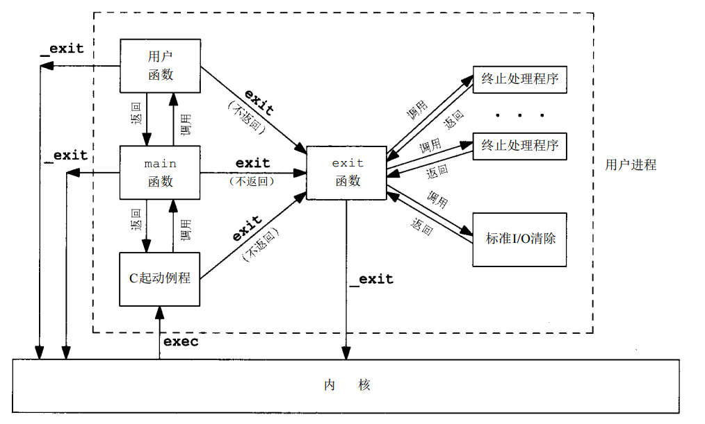

Unix编程

[TOC]

## 1.fork、vfork

[fork()、vfork()、clone()的区别](https://blog.csdn.net/gogokongyin/article/details/51178257)

[unix环境高级编程](https://github.com/arkingc/note/blob/master/%E6%93%8D%E4%BD%9C%E7%B3%BB%E7%BB%9F/UNIX%E7%8E%AF%E5%A2%83%E9%AB%98%E7%BA%A7%E7%BC%96%E7%A8%8B.md#21-fork)

这三个函数分别调用了sys_fork、sys_vfork、sys_clone，最终都调用了do_fork函数。

进程的四要素

- 程序代码（不一定是一个进程所专有的）
- 专用系统堆栈空间
- 进程控制块
- 专用的用户空间（地址空间）

> 1).fork()

fork()函数调用成功：返回两个值； 父进程：返回子进程的PID；子进程：返回0；失败：返回-1；

fork 创造的子进程复制了父亲进程的资源（写时复制技术），包括进程四要素。

开始时，两者的虚拟空间不同，但其对应的物理空间是同一个。有需要时才写时复制。

一般子进程先调度，但子父线程自由执行。

> 2).vfork

vfork也是创建一个子进程，但是子进程共享父进程的空间。在vfork创建子进程之后，父进程阻塞，直到子进程执行了exec()或者exit()。 vfork是一个过时的应用,vfork最初是因为fork没有实现COW机制，而很多情况下fork之后会紧接着exec，而exec的执行相当于之前fork复制的空间全部变成了无用功，所以设计了vfork。现在fork使用了COW机制，唯一的代价仅仅是复制父进程页表的代价，所以vfork不应该出现在新的代码之中。

虚地址也是相同的

进程阻塞，直到子进程执行了exec()或者exit()

缺少**“专用的用户空间”**

## 2.exit()与_exit()区别

exit()清理后进入内核，_exit()直接陷入内核。



## 3.Linux中创建共享内存的方式

> 创建方式

**方式一**：

 

`key`：创建IPC结构时需要指定一个键，作为IPC对象的外部名。键由内核转变成标识符

`size`：共享存储段的长度，单位是字节。实现通常将其向上取为系统页长的整倍数。但是，如果指定的值不是系统页长的整倍数，那么最后一页的余下部分是不可使用的

- 如果正在创建一个新段，则必须指定`size`（段内的内容初始化为0） 
- 如果正在引用一个现存的段，则将`size`指定为0 

**方式二**：`mmap`+`/dev/zero`

使用`/dev/zero`的优点为：调用mmap创建映射区之前，无需存在一个实际文件

使用`/dev/zero`的缺点为：只在两个相关进程之间起作用

> 共享内存的存储位置

 

> 共享内存中起始地址是不是按照页的大小对齐 

长度一般是按页的：共享存储段的长度，单位是字节。实现通常将其向上取为系统页长的整倍数。但是，如果指定的值不是系统页长的整倍数，那么最后一页的余下部分是不可使用的

获取的地址一般可选：

 

`shmid`：共享存储段的标识符

`addr`：共享存储段连接到进程的该地址 

- `0`：由内核选择（推荐的方式）
- `非0`
  - `flag`指定了`SHM_RND`，则连接到`addr`所指的地址上 
  - `flag`没指定`SHM_RND`，则此段连接到 `addr-(addr mod SHMLAB)` 所表示的地址上（`SHM_RND`意思是”取整“，`SHMLBA`的意思是”低边界地址倍数“） 

> 创建共享内存的时候物理页一定分配吗 

内存映射文件并不是调用mmap的时候就将该文件拷贝到内存中，而是建立逻辑地址到文件地址之间的映射关系，但访问这段内存的数据时还是引发缺页中断，然后将该页的数据换到物理地址上

惰性分配：至到真正需要的时候再分配空间，减少响应时间，如果从来没有用到这个对象的情况下可以减少分配。 

## 3.子进程的生成、子进程的结束

> fork的使用方法 

 

返回值： 

- **父进程返回子进程ID**：原因是，一个进程的子进程可以有多个，并且没有一个函数使一个进程可以获得其所有子进程的进程ID 
- **子进程返回0**：原因是，子进程总是可以调用`getppid`获得父进程的ID（0号进程总是由内核交换进程使用，所以一个子进程的进程ID不可能为0） 

> 子进程结束以后父进程如何知道 

SIGCHLD信号：子进程终止时给父进程发送的信号，如果父进程没有捕获代码，则这个信号被忽略 

> 父进程在子进程结束以后要做什么事情 

父进程能通过`wait`、`waitpid`获取子进程的终止状态，并回收其进程号	

 

## 4.wait和waitpid的区别

```c++
#include <sys/wait.h>

/*
** 作用：处理已终止的子进程，如果调用wait时没有已终止的子进程，但有仍然在运行的子进程，则wait会阻塞到现有子进程第一个终止为止
** @statloc：子进程终止状态，可以调用三个宏来检查终止状态，并分辨子进程是正常终止、由某个信号杀死还是作业控制停止
** @返回值：已终止子进程的进程ID号
*/
pid_t wait (int *statloc);

/*
** 相比wait，waipid可以选择等待哪个进程，以及是否阻塞等
** @pid：指定想等待的进程ID，-1表示等待第一个终止的子进程
** @statloc：子进程终止状态
** @options：指定附加选项，如WNOHANG表示告知内核再没有已终止子进程时不要阻塞
** @返回值：已终止子进程的进程ID号
*/
pid_t waitpid (pid_t pid, int *statloc, int options);
```

- 可选择等待结束的子进程
- 可选择无可等待子进程时，不阻塞

## 5.互斥锁和条件变量

[再谈互斥锁与条件变量！（终于搞清楚了啊！！！！！）](http://blog.chinaunix.net/uid-27164517-id-3282242.html)

> pthread_cond_boardcase和pthread_cond_signal的区别

激发条件有两种形式，pthread_cond_signal()激活一个等待该条件的线程，存在多个等待线程时按入队顺序激活其中一个；而pthread_cond_broadcast()则激活所有等待线程。 

## 6.互斥锁的唤醒顺序

[使用互斥锁](https://docs.oracle.com/cd/E19253-01/819-7051/6n919hpag/index.html)

缺省调度策略 `SCHED_OTHER` 不指定线程可以获取锁的顺序。如果多个线程正在等待一个互斥锁，则获取顺序是不确定的。出现争用时，缺省行为是按优先级顺序解除线程的阻塞。

## 7.标准I/O的三种缓冲类型 

标准I/O库提供了三种类型的缓冲： 

- **全缓冲**：此时在标准I/O缓冲区被填满后，标准I/O库才进行实际的I/O操作 
- **行缓冲**：此时当输入和输出中遇到换行符时，标准I/O库执行实际的I/O操作。但是注意： 
  - 只要填满了缓冲区，即使还没有写一个换行符，也立即进行I/O操作 
  - 任何时候只要通过标准I/O库，从一个不带缓冲的流或者一个行缓冲的流得到输入数据，则会冲洗所有行缓冲输出流。(即要缓冲输入，先冲洗输出缓冲) 
- **不带缓冲**：标准I/O库不进行缓冲。此时任何I/O都立即执行实际的I/O操作 

**在一个流上执行第一次I/O操作时，相关标准的I/O函数通常调用 malloc 获取使用的缓冲区** 

## 8.内核编译过程

[参考链接1](https://www.linuxidc.com/Linux/2016-12/137794.htm)

[参考链接2](https://www.cnblogs.com/swyft/p/5578978.html)

1.下载源码文件及解压

2.`make mrproper `删除源代码目录中残留的.o文件和其它从属文件

- 与make clean的区别：clean保留内核的配置文件.config。make mrproper删除的范围比make clean大，实际上，make mrproper在具体执行时第一步就是调用make clean[参考](https://blog.csdn.net/gchww/article/details/7407790)

3.配置内核，有三种方法：

- 命令行:  make  config 
- 单模式的配置界面:  make menuconfig 
- X window:make xconfig 

4.编译内核 

- `make dep `：建立编译时所需的从属文件 
- `make clean`：清除内核编译的目标文件  
- `make bzImage`：编译内核，生成一个名叫bzImage的内核映像文件（路径：/usr/src/kernels/linux-4.10/arch/x86/boot/bzImage）
- `make modules`：编译可加载模块 
- `make modelus_install`：安装可加载模块，会在/lib/modules目录下生成一个4.10子目录，里面存放着新内核的所有可加载模块 
- 将bzImage拷贝到/boot目录下，命名为vmlinuz-4.10.0

5.编辑grub配置文件，使用新内核启动

## 9.fork返回值

- **父进程返回子进程ID**：原因是，一个进程的子进程可以有多个，并且没有一个函数使一个进程可以获得其所有子进程的进程ID
- **子进程返回0**：原因是，子进程总是可以调用`getppid`获得父进程的ID（0号进程总是由内核交换进程使用，所以一个子进程的进程ID不可能为0）

## 10.线程栈的大小

[线程堆栈大小的使用介绍](https://blog.csdn.net/u011784994/article/details/55669961)

1.可由pthread_create创建线程的时候设置

2.默认大小为8M（线程的栈空间的最大值在线程创建的时候就已经定下来了，如果栈的大小超过个了个值，系统将访问未授权的内存块，毫无疑问，再来的肯定是一个段错误）

## 11.用户态、内核态

[参考链接](https://www.cnblogs.com/yuyang0920/p/7278446.html)

> 用户态、内核态

内核态和用户态是操作系统的两种运行级别，用于区分不同程序的不同权利。**内核态就是拥有资源多的状态，或者说访问资源多的状态，也称为特权态**。相对来说，**用户态就是非特权态，访问的而资源将受到限制**。如果一个程序运行在特权态，该程序就可以访问计算机的任何资源，它的资源访问权限不受限制。如果一个程序运行在用户态，其资源需求将受到各种限制。如：要访问操作系统的内核数据结构，如进程表，则需要在特选态下才能办到。如果要访问用户程序里的数据，在用户态即可。 

> 用户栈、内核栈

内核在创建进程的时候，在创建task_struct的同时，会为进程创建相应的堆栈。每一个进程都有两个栈，一个用户栈，存在于用户空间；一个内核栈，存在于内核空间。**当进程在用户空间运行时，CPU堆栈指针寄存器里面的内容都是用户栈地址，使用用户栈**；**当进程在内核空间时，CPU堆栈指针寄存器里面的内容是内核栈空间地址，使用内核栈。**

​    当进程因为中断或者系统调用陷入到内核态时，进程所使用的堆栈也要从用户栈转到内核栈。**进程陷入到内核态后，先把用户态堆栈的地址保存在内核栈之中，然后设置堆栈指针寄存器的内容为内核栈的地址**，这样就完成了用户栈向内核栈的转换；**当进程从内核态恢复到用户态之后时，在内核态之后的最后将保存在内核栈里面的用户栈的地址恢复到堆栈指针寄存器即可**。这样就实现了用户栈和内核栈的互转。

​    那么，知道从内核转到用户态时，**用户栈的地址是在陷入内核的时候保存在内核栈里面的**，但是在陷入内核的时候，如何知道内核栈的地址？关键在进程从用户态转到内核态的时候，进程的内核栈总是空的。这是因为当进程在用户态运行时，使用的用户栈，当进程陷入到内核态时，内核保存进程在内核态运行的相关信息，但是一旦进程返回到用户态后，内核栈中保存的信息无效，会全部恢复，因此每次进程从用户态陷入内核的时候得到的内核栈都是空的。**所以在进程陷入内核的时候，直接把内核栈的栈顶地址给堆栈指针寄存器就可以了。**

## 12.陷入内核的方式

 1、发生系统调用时

​       这是处于用户态的进程主动请求切换到内核态的一种方式。用户态的进程通过系统调用申请使用操作系统提供的系统调用服务例程来处理任务。而系统调用的机制，其核心仍是使用了操作系统为用户特别开发的一个中断机制来实现的，即软中断。

 2、产生异常时

​       当CPU执行运行在用户态下的程序时，发生了某些事先不可知的异常，这时会触发由当前运行的进程切换到处理此异常的内核相关的程序中，也就是转到了内核态，如缺页异常。

 3、外设产生中断时

​       当外围设备完成用户请求的操作后，会向CPU发出相应的中断信号，这时CPU会暂停执行下一条即将要执行的指令转而去执行与中断信号对应的处理程序，如果先前执行的指令是用户态下的程序，那么这个转换的过程自然也就发生了由用户态到内核态的切换。比如硬盘读写操作的完成，系统会切换到硬盘读写的中断处理程序中执行后续操作等。     
       可以看到上述三种由用户态切换到内核态的情况中，只有系统调用是进程主动请求发生切换的，中断和异常都是被动的。