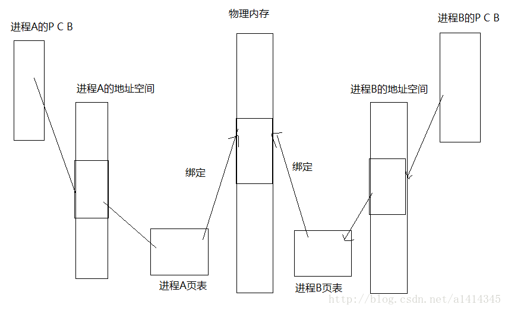
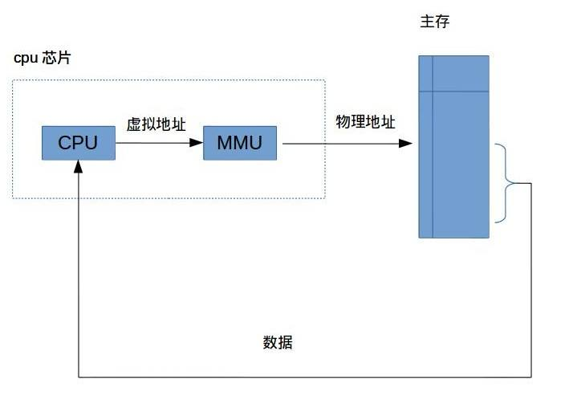
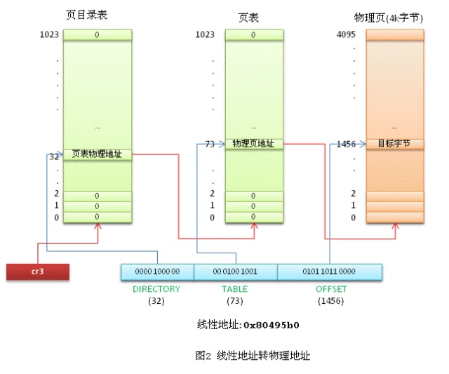
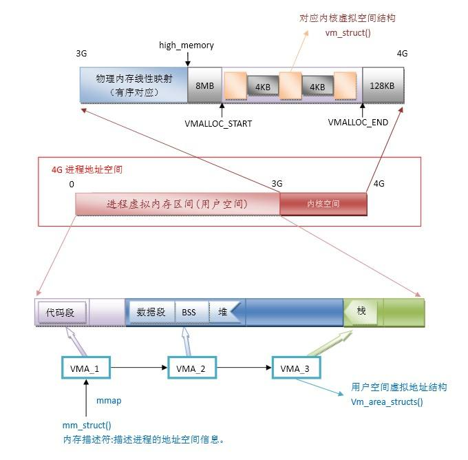
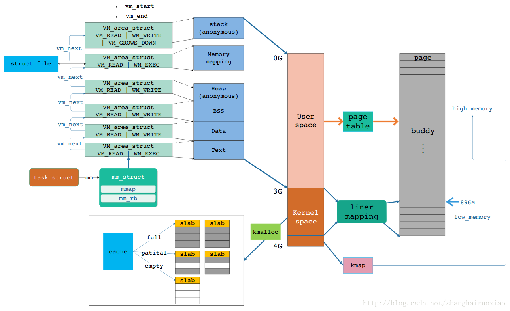
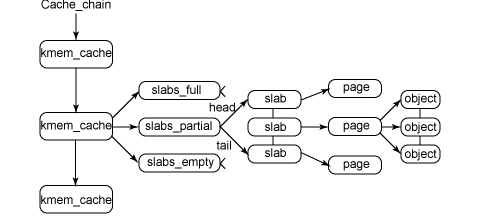
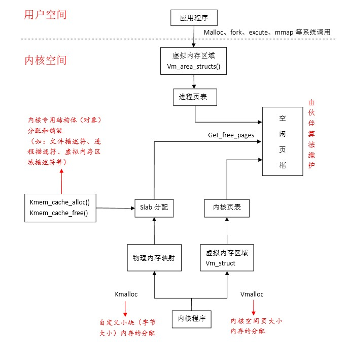
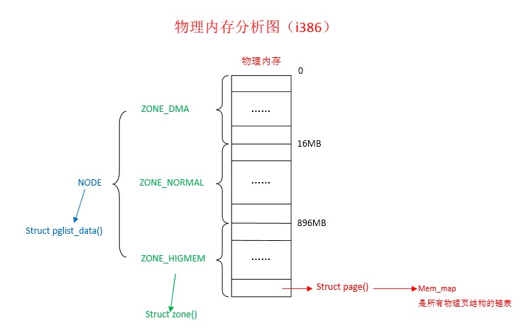

操作系统

[TOC]

# 进程与线程

参考：[进程与线程](http://blog.csdn.net/shanghairuoxiao/article/details/74012512)

## 1.进程与线程区别？

- 进程是资源分配的基本单位，线程是CPU调度的最小单位
- 进程有独立的地址空间，而同一进程中的线程共享该进程的地址空间

  - 进程拥有：代码段、堆栈段和数据段 
  - 线程拥有：寄存器和堆栈（线程栈）

|    线程共享资源    | 线程独享资源  |
| :----------------: | :-----------: |
|      地址空间      | 程序计数器 PC |
|      全局变量      |    寄存器     |
|     打开的文件     |  状态字 PSW   |
|       子进程       |      栈       |
|        闹钟        |               |
| 信号及信号服务程序 |               |
|      记账信息      |               |

- 线程之间的通信比较方便：

  - 进程通信：进程通信的方式

  - 线程通信：使用同一进程下的共享数据通信。在一个线程中分配的堆在各个线程中均可以使用，在一个线程中打开的文件各个线程均可用，当然指同一进程中的线程
- 多进程比多线程程序要健壮：一个线程死掉整个进程就死掉了，但是在保护模式下，一个进程死掉对另一个进程没有直接影响。
- 线程的执行与进程是有区别的：每个独立的进程有有自己的一个程序入口，顺序执行序列和程序的出口，但是线程不能独立执行，必须依附与程序之中，由应用程序提供多个线程的并发控制
- linux中进程具有父子关系，形成进程树，但是线程是平等的没有父子关系


进程的四要素

- 程序代码（不一定是一个进程所专有的）
- 进程控制块
- 专用系统堆栈空间
- 专用的用户空间（地址空间）

只具备前三条的称为线程。

如果完全没有用户空间称为内核线程。

共享用户空间的称为用户线程。


线程分类：

- 用户线程：用户态切换，不能使用系统调用
  - 缺点：
    - 一个线程阻塞，一个进程的所有线程都阻塞
    - 一个进程只有一个CPU，因此进程中仅有一个线程能执行
- 内核控制线程（LWP）：用户线程可以绑定到LWP上，进行系统调用，拥有内核线程的属性
- 内核线程（内核支持线程）：内核态切换（从用户态转到内核态，再切换），可以系统调用


进程控制块：


## 2.多进程程序与多线程程序区别，优缺点，使用场合？

**区别：**

- 崩溃情况：
  - 多进程：一个进程崩溃不会影响其他进程
  - 多线程：一个线程崩溃会导致整个进程死掉，其他线程也不能正常工作
- 切换和通信代价：
  - 多进程：切换和通信代价大
  - 多线程：切换和通信代价小，线程之前数据共享和通信更加方便
- 资源：
  - 多进程：需要开辟独立的地址空间，多进程对资源的消耗很大
  - 多线程：线程则是“轻量级进程”，对资源的消耗更小，对于大并发的情况，只有线程加上IO复用技术才能适应

 **场景：**
- 频繁交互数据的、频繁的对同一个对象进行不同的处理--->多线程
- 并发编程、不需要很多数据交互--->多进程

## 3.进程之间的通信

[**进程间通讯方式**](http://www.cnblogs.com/CheeseZH/p/5264465.html)

[**进程通信**](https://github.com/CyC2018/Interview-Notebook/blob/master/notes/计算机操作系统.md#进程同步)

1).通信需要解决的问题：数据传递、关键部位不会交叉、顺序。

2).进程间通信适用于线程，但是有一个不同的地方，进程间交换数据是在不同的地址空间进行，但是线程是在同一个地址空间进行，只要知道数据的地址，都可以很方便的访问。

3).七种进程间通信方式：

- **信号量**：信号量用于实现进程间的互斥与同步，而不是用于存储进程间通信数据
- **管道( pipe )**：管道是一种半双工的通信方式，数据只能单向流动，而且只能在具有亲缘关系的进程间使用。进程的亲缘关系通常是指父子进程关系
- **命名管道 (named pipe，FIFO)** ： 有名管道也是半双工的通信方式，但是它允许无亲缘关系进程间的通信
- **消息队列( message queue )** ： 消息队列是由消息的链表，存放在内核中并由消息队列标识符标识。消息队列克服了信号传递信息少、管道只能承载无格式字节流以及缓冲区大小受限等缺点
- **信号 ( sinal )** ： 信号是一种比较复杂的通信方式，用于通知接收进程某个事件已经发生
- **共享内存( shared memory )** ：共享内存就是映射一段能被其他进程所访问的内存，这段共享内存由一个进程创建，但多个进程都可以访问。共享内存是最快的 **IPC** 方式，它是针对其他进程间通信方式运行效率低而专门设计的。它往往与其他通信机制，如信号量，配合使用，来实现进程间的同步和通信。
- **套接字( socket )** ： 套接字也是一种进程间通信机制，与其他通信机制不同的是，它可用于不同主机间的进程通信

4).管道（匿名管道）与命名管道的区别：匿名管道只能在具有公共祖先的两个进程间使用

5).**共享文件映射mmap**  

[Linux的mmap内存映射机制解析](https://blog.csdn.net/zqixiao_09/article/details/51088478)

Linux提供了内存映射函数mmap,它把文件内容映射到一段内存上(准确说是虚拟内存上),通过对这段内存的读取和修改,实现对文件的读取和修改 。普通文件被映射到进程地址空间后，进程可以向访问普通内存一样对文件进行访问，不必再调用read()，write（）等操作

即：将文件映射到进程空间中，进程可以像访问普通内存一样访问文件，无需调用read和write函数

6).**常见的信号**

- SIGINT：终止进程，中断进程
- SIGKILL：终止进程，杀死进程，不能被捕获
- SIGTERM：终止进程，软件终止信号，可以被捕获
- SIGSEGV：建立CORE文件，段非法错误
- SIGCHLD：在一个进程终止或者停止时，将SIGCHLD信号发送给其父进程，按系统默认将忽略此信号，如果父进程希望被告知其子系统的这种状态，则应捕捉此信号

## 4.进程和线程(POSIX)的系统调用

| 进程原语 | 线程原语       | 描述                       |
| -------- | -------------- | -------------------------- |
| fork     | pthread_create | 创建线程或进程             |
| waitpid  | pthread_join   | 获取线程进程或线程退出状态 |
| getpid   | pthread_self   | 获取进程ID或线程ID         |
| exit     | pthread_exit   | 退出进程或线程             |

## 5.进程状态转换


挂起：内存--->外存

激活：外存--->内存

## 6.进程调度算法

[优先级调度](https://github.com/arkingc/note/blob/master/操作系统/操作系统.md#2调度算法)

- 先来先服务（FCFS）
- 轮转法（时间片）
- 最短进程优先(SPF，Shortest Process First)
- 最短剩余时间(SRT，Shortest Remaining Time)
- 最高响应比(HRRN)
  - 优先权 == （等待时间 + 要求服务时间） / 要求服务时间 == 响应时间 / 要求服务时间
- 反馈法


## 7.互斥和同步

- 同步：多个进程按一定顺序执行；
- 互斥：多个进程在同一时刻只有一个进程能进入临界区。

> 1).互斥的软件支持

**(1).信号量**

信号量（Semaphore）是一个整型变量，可以对其执行 down 和 up 操作，也就是常见的 P 和 V 操作

- **down(P)**  : 如果信号量大于 0 ，执行 -1 操作；如果信号量小于 0，进程睡眠，等待信号量大于等于 0；
- **up(V)** ：对信号量执行 +1 操作；如果为信号量小于等于0，唤醒睡眠的进程让其完成 down 操作。

**(2).互斥量**

如果信号量的取值只能为 0 或者 1，那么就成为了  **互斥量（Mutex）** ，0 表示临界区已经加锁，1 表示临界区解锁。

**(3).自旋锁**

自旋锁（Spin lock）是Linux中包含临界区最常见的技术。同一时刻，只有一个线程能获得自旋锁。其它任何企图获得自旋锁的进程将一直进行尝试（忙等），直到获得了该锁

- 普通自旋锁
- 读者-写者自旋锁：允许多个线程同时以只读方式访问同一数据结构，只有当一个线程想要更新时，才会互斥访问

**(4).屏障**

屏障用于保证指令执行的顺序。如，rmb()操作保证了之前和之后的代码都没有任何读操作会穿过屏障.。

对于屏障操作，需要注意2点：

- 1. 屏障和机器指令相关，也就是装载和存储指令（高级语言a=b会产生2个指令）
- 2. 编译方面，屏障操作指示编译器在编译期间不要重新排序指令；处理器方面，屏障操作指示流水线上任何屏障前的指令必须在屏障后的指令开始执行之前提交


> 2).互斥锁（互斥量）与自旋锁的区别

[自旋锁和互斥锁区别](https://blog.csdn.net/sunmenggmail/article/details/8105279)

**(1).互斥锁**

Mutex属于sleep-waiting类型的锁。

例如:

在一个双核的机器上有两个线程(线程A和线程B)，它们分别运行在Core0和 Core1上。假设线程A想要通过pthread_mutex_lock操作去得到一个临界区的锁，而此时这个锁正被线程B所持有，那么线程A就会被阻塞(blocking)，Core0 会在此时进行上下文切换(Context Switch)将线程A置于等待队列中，此时Core0就可以运行其他的任务(例如另一个线程C)而不必进行忙等待。

**(2).自旋锁**

Spin lock属于busy-waiting类型的锁。

例如：

如果线程A是使用pthread_spin_lock操作去请求锁，那么线程A就会一直在Core0上进行忙等待并不停的进行锁请求，直到得到这个锁为止。因此，自旋锁一般用用多核的服务器，自旋锁只有在内核可抢占式或SMP（对称多处理）的情况下才真正需要。

**(3)优势劣势互比**

自旋锁的优势：因为自旋锁不会引起调用者睡眠，所以自旋锁的效率远高于互斥锁。

自旋锁的劣势：

- 自旋锁一直占用CPU，他在未获得锁的情况下，一直运行---自旋，所以占用着CPU，如果不能在很短的时间内获得锁，这无疑会使CPU效率降低
- 在用自旋锁时有可能造成死锁，当递归调用时有可能造成死锁，调用有些其他函数也可能造成死锁

> 3). 信号量与互斥量的区别

- 互斥量（Mutex）用于线程的互斥，信号量（Semaphore）用于线程的同步（以生产者消费者问题为例）
- 互斥量值只能为0/1，信号量值可以为非负整数
- 互斥量的加锁和解锁必须由同一线程分别对应使用，信号量可以由一个线程释放，另一个线程得到

[信号量和互斥量（锁）的区别](https://blog.csdn.net/zhangkunrun/article/details/38337201)

> 4).信号量和条件变量的区别

- 条件变量都只用于同一个进程的各线程间，而信号量（有名信号量）可用于不同进程间的同步。当信号量用于进程间同步时，要求信号量建立在共享内存区 
- 信号量有计数值，每次信号量post操作都会被记录，而条件变量在发送信号时，如果没有线程在等待该条件变量，那么信号将丢失。 

[信号量、互斥锁，读写锁和条件变量的区别](http://blog.chinaunix.net/uid-20671208-id-4935154.html) 

## 8.生产者消费者问题

- 注意：先获取信号量，再获取互斥量

```c
#define N 100
typedef int semaphore;
semaphore mutex = 1;
semaphore empty = N;
semaphore full = 0;

void producer() {
    while(TRUE){
        int item = produce_item();
        down(&empty);
        down(&mutex);
        insert_item(item);
        up(&mutex);
        up(&full);
    }
}

void consumer() {
    while(TRUE){
        down(&full);
        down(&mutex);
        int item = remove_item();
        up(&mutex);
        up(&empty);
        consume_item(item);
    }
}
```


## 9.哲学家问题

解决方法：

- 1.至多只允许有四位哲学家同时去拿左边的筷子
- 2.仅当哲学家的左右筷子均可用时，才允许他拿起筷子进餐
- 3.规定奇数号哲学家先拿左边，然后再拿右边；偶数号相反。
  - 1、2号争1号筷子，3、4号争3号筷子，即所有哲学家先争取奇数号筷子，获得后再去争取偶数号筷子，最后总有一位哲学家能获得两只筷子并进餐

## 10.读者-写者问题

基本原则：允许多个进程同时对数据进行读操作，但是不允许读和写以及写和写操作同时发生。

需要：

- 互斥量wmutex：读写互斥
- 整型变量readcount：正在读的进程数
- 互斥量rmutext：对readcount的互斥

读时：

- 读进入：
  - 1.down(rmutex)
  - 2.如果readcount == 0：down(wmutex); readcount++
  - 3.如果readcount != 0：ReadCount++
  - 4.up(rmutex)
- 读离开时：
  - 1.down(rmutex)
  - 2.readcount--
  - 3.如果readcount == 0： up(wmutex)
  - 4.up(rmutex)

写时：

- down(wmutex)
- up(wmutex)

## 11.死锁

[死锁](https://github.com/arkingc/note/blob/master/操作系统/操作系统.md#2死锁)

>1).死锁的条件

- **(1).互斥**：一次只有一个进程可以使用一个资源
- **(2).占有且等待**：当一个进程等待其他进程时，继续占有已经分配的资源
- **(3).不可抢占**：不能强行抢占进程已占有的资源
- **(4).环路等待**：存在一个封闭的进程链，使得每个进程至少占有此链中下一个进程所需的一个资源

> 2).处理死锁的方法

- 预防死锁：

  - 间接的死锁预防：防止死锁条件1-3
  - 直接的死锁预防：防止死锁条件4

- 避免死锁

  - 系统安全状态（操作系统 P107）：指系统能按某种进程顺序（P1,P2...Pn），来为每个进程Pi分配其所需资源，直到满足每个进程对资源的最大需求，使每个进程可以顺利完成。
  - 银行家算法（操作系统P108）：试探地把资源分给请求进程，检查资源分配后系统是否处于安全状态 

- 检测死锁

  - 资源分配图（操作系统P112）：死锁：图不能完全简化

- 解除死锁

  - 剥夺资源
  - 撤销进程

  > 3).哲学家进餐问题

  解决方法：

  - 至多只允许有四位哲学家同时去拿左边筷子
  - 仅当哲学家左右筷子都可用时，才允许拿起筷子进餐
  - 奇数哲学家先拿左筷子，偶数哲学家先拿右筷子

##  12.孤儿进程与僵死进程

  [Linux-孤儿进程与僵尸进程[总结]](https://www.cnblogs.com/JohnABC/p/5734571.html)

   当一个进程完成它的工作终止之后，它的父进程需要调用wait()或者waitpid()系统调用取得子进程的终止状态。

  > 1).孤儿进程怎么产生的

  一个父进程退出，而它的一个或多个子进程还在运行，那么那些子进程将成为孤儿进程。孤儿进程将被init进程(进程号为1)所收养，并由init进程对它们完成状态收集工作。

  > 2).僵尸进程怎么产生的

  一个进程使用fork创建子进程，如果子进程退出，而父进程并没有调用wait或waitpid获取子进程的状态信息，那么子进程的**进程描述符**仍然保存在系统中。这种进程称之为僵尸进程。任何一个子进程(init除外)在exit()之后，并非马上就消失掉，而是留下一个称为僵尸进程(Zombie)的数据结构，等待父进程处理。

  > 3).孤儿进程的危害

  孤儿进程是没有父进程的进程，孤儿进程这个重任就落到了init进程身上，因此孤儿进程并不会有什么危害。

  > 4).僵尸进程的问题及危害

  如果进程不调用wait /waitpid的话， 那么保留的那段信息（进程号、退出状态、运行时间等）就不会释放，其进程号就会一直被占用，但是系统所能使用的进程号是有限的，如果大量的产生僵死进程，将因为没有可用的进程号而导致系统不能产生新的进程. 此即为僵尸进程的危害，应当避免。

 解决方法：通过kill发送SIGTERM或者SIGKILL信号到这个父进程，它产生的僵尸进程就变成了孤儿进程，这些孤儿进程会被init进程接管，init进程会wait()这些孤儿进程，释放它们占用的系统进程表中的资源。

## 13.自旋锁的实现

自旋锁是一个**互斥**设备，它只有两个值：“锁定”和“解锁”。它通常实现为某个整数值中的某个位。希望获得某个特定锁得代码测试相关的位。如果锁可用，则“锁定”被设置，而代码继续进入**临界区**；相反，如果锁被其他人获得，则代码进入**忙循环**（而不是休眠，这也是自旋锁和一般锁的区别）并重复检查这个锁，直到该锁可用为止，这就是自旋的过程。

自旋锁的特点：

- 用于临界区互斥
- 在任何时刻最多只能有一个执行单元获得锁
- 要求持有锁的处理器所占用的时间尽可能短
- 等待锁的线程进入忙循环
- 自旋锁对于SMP（对称多处理结构）和单处理器可抢占内核都适用，自旋锁对于单处理器不可抢占内核没有意义

## 14.利用多线程对数组进行归并排序

[利用多线程对数组进行归并排序](http://www.cnblogs.com/duyue6002/p/6814611.html)

原理：创建待排序数组成功后，需要配合多线程（假设有n个线程）分别排序，需要将数组尽量等分成n个分数组（保存到列表中），由n个线程分别归并排序，并将各个有序数组（再次保存到列表中），最后整合（不归并整合）并覆盖原数组，等待最后归并。

## 15.上下文切换（进程切换）

[arking-note](https://github.com/arkingc/note/blob/master/操作系统/操作系统.md#42-进程切换)

- 1.保存处理器上下文环境（包括程序计数器和其它寄存器）
- 2.更新当前处于运行态进程的进程控制块（状态和其它信息）
- 3.将进程控制块移到相应队列（就绪队列）
- 4.选择另一个进程执行
- 5.更新所选择进程的进程控制块（包括将状态变为运行态）
- 6.更新内存管理的数据结构
- 7.恢复处理器在被选择的进程最近一次切换出运行状态时的上下文环境

注意：进程切换一定有模式切换；模式切换不一定有进程切换（中断会发生模式切换，但是在大多数操作系统中，中断的发生并不是必须伴随着进程的切换的。可能是中断处理器执行之后，当前正在运行的程序继续执行）

# 16.IPC-共享内存

[参考链接](https://blog.csdn.net/a1414345/article/details/69389647)

最快的IPC



# 内存管理

[**操作系统对内存管理**](https://blog.csdn.net/shanghairuoxiao/article/details/70256247)

## 1.虚拟内存基本概念

> 1).虚拟内存的作用

虚拟内存是计算机系统内存管理的一种技术。它使得应用程序认为它拥有连续的可用的内存（一个连续完整的地址空间），而实际上，它通常是被分隔成多个物理内存碎片，还有部分暂时存储在外部磁盘存储器上，在需要时进行数据交换。

> 2).虚拟内存的实现

- 操作系统为了管理内存，给每个进程都分配独立的地址空间，对32位的系统而言，这个空间的大小是4GB。这4GB并不是实际的物理内存，实际上并不存在。

- 虚拟地址空间的地址称为逻辑地址，实际物理内存的地址空间称为物理地址。

- 虚拟地址空间被分割成多个大小相同的页面(比如4k为一个页面)，物理地址空间被分割成同样大小的页框。

- 虚拟地址的页面通过一个页表映射到物理内存的页框，页表中保存着两者的对应关系。

- 逻辑地址是CPU使用的地址，当进程要访问该进程地址空间里的某个地址时时候，将该地址的值传递给CPU，CPU访问该地址时，会经过MMU（Memory Management Unit，内存管理单元）将逻辑地址转换为物理地址。

- 页表就保存在MMU中，操作系统为每个进程都维护一个页表。

- 程序运行的时候只需要部分数据存在内存中就可以了,只有部分页面和页框有对应值,其余的页表的数据保存在硬盘一块固定的地方（在Linux里叫swap分区）

- 当访问到某个页面在物理内存中没有对应的页框时就会发生**缺页中断**，这时候操作系统就将该页面保存在硬盘中的数据拷贝到物理内存中，并更新页表建立该页面和对应页框之间的映射关系。

  

  


- 更详细的关于linux内存管理，可以到[**操作系统对内存管理**](https://blog.csdn.net/shanghairuoxiao/article/details/70256247)看。





> 3).Linux的slab层，VAM

> 4).伙伴算法

> 5).高端内存

## 2.页面置换

>  1).最佳（Optimal）

选择最长时间内不再被访问的页面

>  2).先进先出（FIFO）

选择最先进入的页面，如果该页再次访问，也不会改变其顺序，只根据第一次进入的时间计算

> 3).最近最久未使用（LRU，Least Rencently Used）

选择上次访问到现在时间最长的页面

实现：寄存器或栈

基于寄存器的实现：

为每个在内存中的页面配置一个**位移寄存器**R=Rn-1,Rn-2,Rn-3,……R2,R1,R0。当进程访问某个页时，该页的寄存器的最高位置位1，所有页的寄存器每隔一段时间向右移动一位。要置换页面时，寄存器值最小的页面就是最近最久未使用的页面。

基于栈的实现：

所有在内存中的页面都在栈中，其中栈顶是刚刚使用的页面，栈底是最近最久未使用的页面

> 4).时钟（Clock）或最近未使用（NRU, Not Rcently Used）

有两种：简单的和改进的。

简单的实现：内存中的页连成链表，有一个访问位，初始化为1。遍历链表，访问位1则置为0，访问位为0则换出。

改进的实现：有A访问位和M修改位。

淘汰次序（A=0,M=0）、（A=0,M=1）、（A=1,M=0）、（A=1,M=1）

> 5).最少使用（LFU:Least Frequently Used）

选择最近时期最少使用的页面。主要在于这段时间内的使用次数。

## 3.避免内存碎片

> 1).伙伴算法

实现：[Linux 伙伴算法简介](http://www.cnblogs.com/cherishui/p/4246133.html)

基本概念：操作系统 P126 

用于管理物理内存，避免内存碎片--->外部碎片（页框浪费）

伙伴系统：

- 内存分区大小：2的k次幂，2^1是最小的分区，2^m是最大的分区
- 初始化时：假设内存只有2^m，那么初始化时只有一个2^m的空闲分区
- 运行中：不断地对2^m进行划分，形成若干不连续的空闲分区，将这些空闲分区按大小分类，具有相同大小的作为一类，形成一个双向链表。从而每类大小都是一个链表
- 分配原则：需要n的内存，则2^(i-1) < n <= 2^i
  - 若2^i有，则分配
  - 否则，若2^(i+1)有，分成两个2^i，一个放到2^i的链表，一个用于分配
  - 否则，若2^(i+2)有，分成两个2^(i+1)，一个放到2^(i+1)的链表，一个用于分配，分为两个2^i，一个放到2^i的链表，一个用于分配
- 回收原则：一次回收可能进行多次合并
  - 回收2^i时，若已存在2^i，则合并为2^(i+1)
  - 若2^(i+1)也存在，合并为2^(i+2)

> 2).高速缓存Slab

[slab机制](http://www.cnblogs.com/wangzahngjun/p/4977425.html)

[Linux内存管理原理](http://www.cnblogs.com/zhaoyl/p/3695517.html)

用于管理内核分配内存，避免碎片--->内部碎片（页内浪费）

slab分配机制：

slab分配器是基于对象进行管理的，所谓的对象就是**内核中**的数据结构（例如：task_struct,file_struct 
等）。相同类型的对象归为一类，每当要申请这样一个对象时，slab分配器就从一个slab列表中分配一个这样大小的单元出去，而当要释放时，将其重新保存在该列表中，而不是直接返回给伙伴系统，从而避免内部碎片。slab分配器并不丢弃已经分配的对象，而是释放并把它们保存在内存中。slab分配对象时，会使用最近释放的对象的内存块，因此其驻留在cpu高速缓存中的概率会大大提高。

内核中slab的主要数据结构：



每个数据结构一个`kmem_cache`

对上图的分析：

kmem_cache是一个cache_chain的链表，描述了一个高速缓存，每个高速缓存包含了一个slabs的列表，这通常是一段连续的内存块。存在3种slab：slabs_full(完全分配的slab),slabs_partial(部分分配的slab),slabs_empty(空slab,或者没有对象被分配)。slab是slab分配器的最小单位，在实现上一个slab有一个货多个连续的物理页组成（通常只有一页）。单个slab可以在slab链表之间移动，例如如果一个半满slab被分配了对象后变满了，就要从slabs_partial中被删除，同时插入到slabs_full中去。

举例说明：

```
如果有一个名叫inode_cache的struct kmem_cache节点，它存放了一些inode对象。当内核请求分配一个新的inode对象时，slab分配器就开始工作了：
首先要查看inode_cachep的slabs_partial链表，如果slabs_partial非空，就从中选中一个slab，返回一个指向已分配但未使用的inode结构的指针。完事之后，如果这个slab满了，就把它从slabs_partial中删除，插入到slabs_full中去，结束；
如果slabs_partial为空，也就是没有半满的slab，就会到slabs_empty中寻找。如果slabs_empty非空，就选中一个slab，返回一个指向已分配但未使用的inode结构的指针，然后将这个slab从slabs_empty中删除，插入到slabs_partial（或者slab_full）中去，结束；
如果slabs_empty也为空，那么没办法，cache内存已经不足，只能新创建一个slab了。
```


## 4.逻辑地址、线性地址（虚拟地址）、物理地址

逻辑地址 --->（段表）---> 线性地址 ---> （页表）---> 物理地址

因为Linux没有分段机制，因此Linux中逻辑地址等于线性地址

## 5.分页与分段对比

[分段管理和分页管理的区别](https://blog.csdn.net/cout_sev/article/details/25049037)

**相同点：**

- 1.都采用离散分配方式
- 2.都要通过地址映射机构来实现地址变换

**区别：**

- 1.
  - 页是信息的物理单位，用户透明，长度固定。分页是为实现离散分配方式，以消减内存的外零头，提高内存的利用率。可以说分页仅仅是由于系统管理的需要而不是用户的需要。
  - 段是信息的逻辑单位，用户可见，长度可变。它含有一组其意义相对完整的信息。分段的目的是为了能更好地满足用户的需要。
- 2.
  - 页的大小固定且由系统确定，把逻辑地址划分为页号和页内地址两部分，是由机器硬件实现的，因而一个系统只能有一种大小的页面。
  - 段的长度却不固定，决定于用户所编写的程序，通常由编译程序根据信息的性质来划分。
- 3.
  - 分页的作业地址空间是一维的，即单一的线性地址空间，程序员只需利用一个记忆符，即可表示一个地址
  - 分段的作业地址空间则是二维的，程序员在标识一个地址时，既需给出段名，又需给出段内地址
  - 例如：50KB的程序，页式分配，不妨设每页4KB，各页的地址分别为0-4,4-8，……，44-48。而段式分配是0-20，0-30，……最终原因是段的长度不同
  - [为什么分页机制中逻辑地址空间是一维的](https://blog.csdn.net/yangkuiwu/article/details/53493458)

## 6.Linux内存管理 内核空间 用户空间

[linux内存管理--用户空间和内核空间](https://www.cnblogs.com/wuchanming/p/4465188.html)

**关于虚拟内存有三点需要注意：**

- **4G的进程地址空间被人为的分为两个部分--用户空间与内核空间。用户空间从0到3G（0xc0000000）,内核空间占据3G到4G。用户进程通常情况下只能访问用户空间的虚拟地址，不能访问内核空间的虚拟地址。例外情况只有用户进程进行系统调用（代表用户进程在内核态执行）等时刻可以访问到内核空间。**
- **用户空间对应进程，所以每当进程切换，用户空间就会跟着变化；而内核空间是由内核负责映射，它并不会跟着进程变化，是固定的。内核空间地址有自己对应的页表，用户进程各自有不同的页表。**
- **每个进程的用户空间都是完全独立、互不相干的。**


> 虚拟地址空间分配及其与物理内存对应图

**其中kmalloc和vmalloc函数申请的空间对应着不同的区域，同时又不同的含义。** 



> 物理内存分配图



 **这张图中页解释了三者的不同关系，和上篇文章中的内容有相似之处。**

**伙伴算法：**

​     **一种物理内存分配和回收的方法，物理内存所有空闲页都记录在BUDDY链表中。首选，系统建立一个链表，链表中的每个元素代表一类大小的物理内存，分别为2的0次方、1次方、2次方，个页大小，对应4K、8K、16K的内存，没一类大小的内存又有一个链表，表示目前可以分配的物理内存。例如现在仅存需要分配8K的物理内存，系统首先从8K那个链表中查询有无可分配的内存，若有直接分配；否则查找16K大小的链表，若有，首先将16K一分为二，将其中一个分配给进程，另一个插入8K的链表中，若无，继续查找32K，若有，首先把32K一分为二，其中一个16K大小的内存插入16K链表中，然后另一个16K继续一分为二，将其中一个插入8K的链表中，另一个分配给进程........以此类推。当内存释放时，查看相邻内存有无空闲，若存在两个联系的8K的空闲内存，直接合并成一个16K的内存，插入16K链表中。（伙伴算法用于物理内存分配方案）**

**SLAB算法：**

​     **是一种对伙伴算的一种补充，对于用户进程的内存分配，伙伴算法已经够好了，但对于内核进程，还需要存在一类很小的数据（字节大小，比如进程描述符、虚拟内存描述符等），若每次给几个字节的数据分配一个4KB的页，实在太浪费，于是就有了SLBA算法，SLAB算法其实就是把一个页用力劈成一小块一小块，然后再分配。**