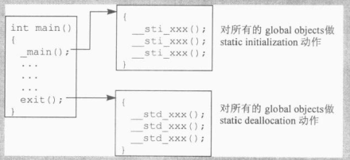

# 第6章 执行期语意学

## 6.1 对象的构造和析构

### 6.1.1 全局对象

```c++
//这是一个全局对象
Matrix identity;

main()
{
    //identity必须在此处被初始化
    Matrix m1 = identity;
    ...
    return 0;
}
```

C++保证，一定会在main()函数中第一次用到identity之前，把identity构造出来，而在main()函数结束之前吧identity摧毁掉

像identity这样的全局变量如果有构造函数和析构函数的话，我们说它需要**静态的初始化操作和内存释放操作**


**munch策略：**

一个可移植但成本颇高的**全局变量静态初始化和内存释放**方法（一个比较过时的方法）

策略的具体描述为：

- 1.为每一个需要静态初始化的文件产生一个_sti()函数，内含必要的构造函数调用操作或构造函数的内联扩展
  - 例如前面的identity对象会在matrix.c中产生出下面的__sti()函数：

```c++
//编译器的行为
__sti__matrix_c__identity()
{
    identity.Matrix::Matrix();  //静态初始化
}
```

- 2.在每一个需要静态的内存内存释放操作的文件中，产生一个__std()函数，内含必要的析构函数调用操作，或是析构函数的内联扩展
- 3.提供一组runtime library "munch"函数：个`_main()`函数（用以调用可执行文件中的所有`__sti()`函数）,以及一个exit()函数（以类似方式调用所有的_`_std()`函数）



**注意**：C语言不为静态变量自动设定初值

**被静态初始化的对象的缺点**：

- 1.如果支持异常处理，被静态初始化的对象不能放在try代码块内（//TODO:原因？）
- 2.为了控制”需要跨越模块做静态初始化“的objects的相依顺序，而扯出来的复杂度

**作者建议**：

- 不使用需要自动静态初始化的全局对象

### 6.1.2 局部静态对象

```c++
const Matrix& identity()
{
    static Matrix mat_identity;
    //...
    return mat_identity;
}
```

- mat_identity的constructor必须只能执行一次，虽然上述函数可能被调用多次
- mat_identity的destructor必须只能执行一次，虽然上述函数可能会被调用多次

编译器的做法：

- 1.无条件地在程序起始时构造出对象来。（缺点：导致所有的局部静态对象都在程序起始时被初始化，即使它们所在的那个函数从不被调用）
- 2.identity()被调用时才把mat_identity构造起来

cfront实现的方法是

- 1.**构造**：导入一个临时性对象以保护mat_identity的初始化操作。第一次调用identity()时，这个临时对象为false，于是构造函数会被调用，然后临时对象被改为true，再次调用identity()，由于临时对象为true，因此不会再次构造
- 2.**析构**：析构函数也需要有条件地实施于mat_identity，只有在mat_identity已经被构造起来才调用，可以通过临时对象是否为true来判断mat_identity是否已经构造

### 6.1.3 对象数组

```c++
Point knots[10];
```

如果Point没有定义一个构造函数和析构函数，那么上述代码执行的工作与建立一个“内建类型所组成的数组”一样多，只会分配足够内存以存储10个连续的Point元素，但不会构造Point对象

如果Point**定义了默认构造函数**，在cfront编译器中，使用一个命名为vec_new()的函数，产生出以类对象构造而成的数组。（比较新的编译器，则是提供两个函数，一个用来处理”没有虚基类“的类，另一个用来处理”内含虚基类“的类，后一个函数通常被称为vec_vnew()）

函数vec_new()类型通常如下：

```c++
void* vec_new(
    void *array,                        //数组起始地址
    size_t elem_size,                   //每一个class object的大小
    int elem_count,                     //数组中的元素个数
    void (*constructor)(void*),
    void (*destructor)(void*,char)
    )
```

- constructor是类的默认构造函数的函数指针
- destructor是类的默认析构函数的函数指针
- array的值：
  - 具体的数组地址，表示静态数组，即knots这样的
  - 0，表示动态数组，即使用new操作符生成于heap中的对象数组

vec_new的具体使用：

```c++
Point knots[10];
//编译器的行为
vec_new(&knots,sizeof(Point),10,&Point::Point,0);
```

对于提供了一个或兑个显示初值的类对象数组：

```c++
Point knots[ 10 ] = { Point(), Point( 1.0, 1.0, 0.5 ), -1.0 };
//编译器的行为
//显示初始化前3个元素
Point::Point( &knots[0] );
Point::Point( &knots[1], 1.0, 1.0, 0.5 );
Point::Point( &knots[2], -1.0, 0.0, 0.0 );
//以vec_new初始化后面7个元素
vec_new( &knots+3, sizeof( Point ), 7, &Point::Point, 0 );
```

如果Point也定义了**析构函数**，当knots的生命结束时，该析构函数也必须实施于10个Point元素身上，经由一个类似的vec_delete()的runtime library函数完成：

```c++
void* vec_delete(
    void *array,                        //数组起始地址
    size_t elem_size,                   //每一个class object的大小
    int elem_count,                     //数组中的元素个数
    void (*destructor)(void*,char)
    )
```

## 6.2 new和delete运算符

### 6.2.1 new

```c++
int *pi = new int(5);
```

实际上是由两个步骤完成的：

```c++
//通过适当的new运算符函数实例，配置所需内存
//这里的new就是下文提到的operator new
int *pi = __new(sizeof(int));
//将配置得来的对象设置初值
*pi = 5;
```

更进一步，初始化操作应该在内存配置成功后才执行：

```c
int *pi;
if(pi = __new(sizeof(int))) 
    *pi = 5;
```

对类对象的情况：

```c++
Point3d *origin = new Point3d;

//编译器的行为，无异常处理的情况
Point3d *origin;
if( origin = __new( sizeof( Point3d ) ) )
    origin = Point3d::Point3d( origin );

//编译器的行为，有异常处理的情况
Point3d *origin;
if( origin = __new( sizeof( Point3d ) ) )
{
	try{
        origin = Point3d::Point3d( origin );
    }catch(...)
    {
       //如果出现异常
        //调用__delete以释放new分配的内容
        __delete( origin );
    	//将异常上上层传递
        throw;
    }
}
   
```

### 6.2.2 delete

```c++
delete pi;
```

delete pi时，如果pi是0，C++要求delete运算符不要有操作。因此”编译器“必须为此调用构造一层保护

```c++
//保护
if(pi != 0)
    //释放内存，但是pi并不会设为为0
    //__delete就是下文提到的operator delete
    __delete(pi);   
```

对类对象的情况：

```c++
delete origin;

//编译器的行为，无异常处理的情况
if( origin != 0 )
{
    Point3d::~Point3d( origin );
    __delete( origin );
}

//编译器的行为，有异常处理的情况
if( origin != 0 )
{
    try{
        oint3d::~Point3d( origin );
    }catch(...)
    {
        __delete( origin );
        //将异常上上层传递
        throw;
    }
}
```

### 6.2.3 operator new

以下版本并未考虑异常处理

```c++
extern void* operator new(size_t size)
{
    if(size == 0)
        size = 1;

    void *last_alloc;
    while(!(last_alloc = malloc(size))){
        //出错处理
        //允许使用者提供一个属于自己的_new_handler()函数
        if(_new_handler)
            (*_new_handler)();
        else
            return 0;
    }
    return last_alloc;
}
```

```c++
//是合法的
//但语言要求每一次对new的调用都必须传回一个独一无二的指针。解决此问题的传统方法是传回一个指针，指向一个默认为1 byte的内存区块（上述代码中将size设为1的原因）
new T[0];
```

operator new实际上总是以标准的C malloc完成，但不一定得这么做

### 6.2.4 operator delete

以下版本并未考虑异常处理

operator delete也总是以标准的C free()完成

```c++
extern void operator delete(void *ptr)
{
    if(ptr)
        free((char*)ptr);
}
```

### 6.2.5 针对数组的new语意

