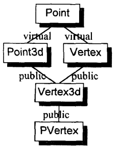

[TOC]

# 第5章 构造、析构、拷贝语意学

 **纯虚函数的存在**

- 可以定义和调用一个纯虚函数，但调用只能静态调用
- 当基类的析构函数定义为纯虚函数时，派生类的析构函数会被编译器扩张，以静态的方式调用其基类的虚析构函数
- 最好不要把析构函数定义为虚函数

**虚函数的使用和改进**

```c++
//修改前
class Abstract_base {
public:
    virtual ~Abstract_base() = 0;
    virtual void interface() const = 0;
    virtual const char* mumble() const { return _mumble; }
protected:
    char* _mumble;
};

//修改后
class Abstract_base {
public:
    //析构函数不要声明为虚函数
    virtual ~Abstract_base();
    //虚函数尽量不要声明为const
    virtual void interface() = 0;
    //对于几乎不会被派生了重写的函数，不要声明为虚函数
    const char* mumble() const { return _mumble; }
protected:
    //对于有数据成员的抽象类，需要在protected声明并定义一个初始化数据成员的构造函数，以便在派生类中调用，初始化基类数据成员
    Abstract_base ( char *pc = 0 );
    char* _mumble;
};
```

## 5.1 “无继承”情况下的对象构造

对于C风格的struct结构定义的数据结构（Plain Old Data），编译器只会为该结构生成无用的（trivival）默认构造函数、无用的析构函数、无用的拷贝构造函数、无用的拷贝赋值操作符

```c++
typedef struct
{
    float x, y, z;
} Point;
```

```c++
//要么无用的构造函数没被定义，要么无用的构造函数不被调用，与C中表现一样
Point global; 
Point foobar()
{
    //既没有构造，也没有析构，如果不初始化，可能会出错
    Point local; 
    //编译器行为：Point *heap = __new( sizeof(Point) )
    //但new开辟内存空间之后，没有调用默认构造函数，与C的malloc相似
    Point *heap = new Point;
    //像C一样的位搬移操作，如果local初始化过，则没有问题，如果没初始化过，则产生编译警告
    * heap = local;
    //编译器行为：__delete( heap );但不会调用析构函数，与C的free相似
    delete heap;
    //只是简单的位拷贝，不会调用无用的拷贝构造函数
    return local;
}
```

### 5.1.1 抽象数据类型

```c++
class Point {
public:
    Point( float x = 0.0, float y = 0.0, float z = 0.0 ): _x(x),_y(y),_z(z) {}
private:
    float _x,_y,_z;
}
```

```c++
//实施Point::Point( 0.0, 0.0, 0.0 );，初始化操作延迟到程序启动时
Point global; 
Point foobar()
{
    //默认构造函数的内联扩展
    //编译器的行为：local._x=0.0; local._y=0.0; local._z=0.0;
    Point local; 
    /*
    ** 编译器的行为：
    ** Point *heap = __new( sizeof(Point) );
    ** if( heap!=0 ) heap->Point::Point();
    **/
    Point *heap = new Point;
	//位拷贝操作，因为拷贝赋值构造是无用的，所以编译器没有合成（不满足合成条件）
    *heap = local;
	//删除heap指定的对象，但由于Point没有显示提供一个析构函数，因此不会调用
    //因为析构函数是无用的，所以编译器没有合成（不满足合成条件）
    delete heap;
    //位拷贝操作返回local的值，拷贝构造函数是无用的，所以编译器没有合成（不满足合成条件）
    return local;
}
```


**显示初始化列表**与**构造函数内联扩展**（constructor的inline expansion）

显示初始化列表优点：效率更高

显示初始化列表缺点：

- 1.只有当类成员都是public才有效
- 2.只能指定常量，因为它们在编译期就可以被求值
- 3.由于编译器没有自动施行“显示初始化列表”，所以初始化行为的失败可能性更高

对于构造函数内联扩展，编译器会有优化机制，对待它们就像是初始化列表所供应的一样

```c++
void mumble()
{
    //显示初始化列表
    Point local1 = { 1.0, 1.0, 1.0 };
    
    Point local2;  //构造函数内联扩展（只是这一行是）
    //对数据成员进行初始化
    local2._x = 1.0;
    local2._y = 1.0;
}
```

### 5.1.2 为继承做准备(虚函数的引入)

```c++
class Point {
public:
    Point( float x = 0.0, float y = 0.0 ): _x(x), _y(y) {}
    virtual float z();
protected:
    float _x, _y;
};
```

虚函数引入的**坏处**：

- 1.使每一个对象拥有一个虚函数表指针
- 2.引发编译器对类的扩展
  - 如果无构造函数，必须合成默认构造函数，并在构造函数中对虚函数表指针的初始化
  - 如果无拷贝构造函数和拷贝赋值运算符，必须合成它们，并对虚函数表指针进行设定

**构造函数的扩展**

```c++
//扩展前
Point( float x = 0.0, float y = 0.0 ): _x(x), _y(y) {}

//扩展后，编译器的行为
Point* Point::Point( Point *this, float x, float y ): _x(x), _y(y)
{
    //编译器行为：设定对象的初始化表指针
	this->__vptr_Point = __vtbl_Point;
    
    //初始化列表扩展，即使没有虚函数，也会进行的
    this->_x = x;
    this->_y = y;
    
    //传回this对象，即使没有虚函数，也会进行的
    return this;
}
```

**合成并扩展拷贝成员**

虚函数的引用导致编译器合成拷贝构造函数和拷贝赋值运算符，并在其中扩展对虚函数表的设定

```c++
//编译器行为
inline Point* Point::Point( Point *this, const Point &rhs )
{
    //仍然指向自己类型的虚函数表，而按位逐次拷贝而来的rhs的虚函数表
    this->__vptr_Point = __vtbl_Point;
    //将rhs中的_x、_y按位逐次拷贝（连续位拷贝）到*this的_x、_y
    //编译器在优化状态下可能回把对象的连续内容拷贝到另一个对象身上，而不会实现精确地以“以成员为基础”的赋值操作
    //但没优化时，是经由“数据成员赋值”将rhs的值赋值到*this中
    return this;
}
```

C++标准要求编译器尽量延迟成员的合成操作，直到正在遇到其使用场合才合成

引入虚函数后，再分析之前的例子：

```c++
Point global; 
Point foobar()
{
    Point local; 
    Point *heap = new Point;
    * heap = local;
    delete heap;
    return local;
}

//编译器的行为
Point::Point( 0.0, 0.0, 0.0 );
//以__result为返回值
Point foobar( Point &__result )
{
    
    //编译器的行为：
    //调用默认构造函数
    local.Point::Point(0.0, 0.0);
    
    //Point *heap = new Point;
    //编译器的行为
    Point *heap = __new( sizeof(Point) );
    if( heap!=0 ) heap->Point::Point();
	
    //拷贝赋值操作符合成并调用
    *heap = local;
    
	//删除heap指定的对象，调用析构函数
    delete heap;
    
    //拷贝构造函数的应用
     __result.Point::Point( local );
    //调用local的析构函数
    local.Point::~Point();
    
    return;
}
```

## 5.2 继承体系下的对象构造

```c
T  object;
```

以上代码会发生的事：

- 1.首先调用虚基类构造函数，所有虚基类先于非虚基类调用，从左到右，从深到浅
  - 如果虚基类的构造函数在派生类的初始化列表中，那么调用指定构造函数，否则调用默认构造函数
  - 派生类的每一个虚基类的偏移量在执行期间被保存
  - 虚基类的构造函数由继承体系中最底层派生类构造函数调用，用以支持这一行为的机制必须被放进来（5.2.1节介绍）

```c++
class A {
public:
	A() { cout << "A()"<< endl; }
};

class B
{
public:
	B() { cout << "B()" << endl; }
};

class C :virtual public B {
public:
	C() { cout << "C()" << endl; }
};

class D : public A, public C {
public:
	D() { cout << "D()" << endl; }
};
D d;

/*
输出为：
B()
A()
C()
D()
*/
```

- 2.直接基类的构造函数被调用，按继承顺序进行
  - 如果直接基类的某个构造函数在初始化列表中调用，则调用指定构造函数，否则调用默认构造函数
  - 如果直接基类时多重继承下的第二或后续的基类，那么this指针必须有所调整
- 3.如果类对象有虚函数指针，初始化虚函数指针，指向合适的虚函数表
- 4.执行初始化列表中的初始化操作
- 5.如果某个数据成员是类类型，并且没有初始化列表中显示初始化，则调用其默认构造函数

### 5.2.1 虚继承

```c++
class Point {
public:
    Point( float x = 0.0, float y = 0.0 );
    Point( const Point& );
    Point& operator=( const Point& );
    virtual ~Point();
    virtual float z() { return 0.0; }
protected:
    float _x,_y;
};

class Point3d : public virtual Point {
public:
    Point3d( float x = 0.0, float y = 0.0, float z = 0.0 ) 
        : Point( x, y ), _z(z) {}
     Poin3d( const Point3d& rhs )
         :Point( rhs ), _z(z) {}
     Point3d& operator=( const Point3d& );
    ~Point();
    virtual float z() { return _z; }
    
protected:
    float _z;
}
```

虚基类的构造函数由继承体系的最底层派生类构造函数调用

例如，下图中Point的构造函数由最底层派生类PVertex调用



因此在每个有虚基类的构造函数中，需要加入判断是否为应该调用虚基类的构造函数

```c++
//在虚基类情况下的构造函数扩充
Point3d* Point3d::Point3d( Point3d *this, bool __most_derived, float x, float y, float z)
{
    //如果是最底层的派生类了，调用虚基类的构造函数
    if(__most_derived != false )
        this->Point::Point( x, y );
    //初始化派生类自己的虚函数表指针
    this->__vptr_Point3d = __vtbl_Point3d;
    //初始化虚基类的虚函数表指针
    this->__vptr_Point3d_Point = __vtbl_Point3d_Point;
    this->_z = rhs._z;
    return this;
}

Vertex3d* Vertex3d::Vertex3d( Vertex3d *this, bool __most_derived, float x, float y, float z )
{
    //如果是最底层的派生类了，调用虚基类的构造函数
    if(__most_derived != false )
        this->Point::Point( x, y );
    
    //调用直接基类的构造函数，向它们的构造函数中设__most_derived为false
    this->Point3d::Point3d( false, x, y, z );
    this->Vertex::Vertex( false, x, y );
    
    //设定虚函数表指针
    //安插用户代码
    return this;
}
```

更有效的做法：

将构造函数分为两种：

- 如果构造完整对象时：无条件地调用虚基类构造函数，并设定虚函数表指针
- 如果自身是派生类的子对象，被派生类调用自身的构造函数时：不调用虚基类构造函数，不设置虚函数表指针（关于虚基类的部分）

### 5.2.2 虚函数表指针初始化语意

**在构造函数或析构函数中调用虚函数（直接调用、间接调用（非虚函数调用虚函数）、虚函数调用虚函数），调用的是正在进行构建或析构的类实现的版本**

在构造函数中，虚函数指针**初始化的时机为**：

- 在基类构造函数调用之后，在初始化列表和用户代码之前
- 这样可以保证在构造函数和析构函数中调用虚函数的正确性

```c++
PVertex::PVertex( float x, float y, float z )
    :_next(0), Vertex3d( x,y,z ), Point( x,y )
{
    if( spyOn )
        cerr << "Within PVertex::PVertex()"
        	<< "size: " << size() << endl; //size()为虚函数
}

//编译器的行为
PVertex* PVertex::PVertex( PVertex* this, bool __most_derived, float x, float y, float z )
{
    //如果是最底层的派生类，调用虚基类构造函数
    if(__most_derived!=false)
        this->Point::Point( x,y );
    //无条件地调用直接基类的构造函数
    this->Vertext3d::Vertex3d( x, y, z );
    
    //初始化自身的虚函数表指针，指向正在构建的对象（子对象）的类的虚函数表
    this->__vptr_PVertex = __vtbl_PVertex;
    //初始化虚基类的虚函数表指针
    this->__vptr_Point__PVertex = __vtbl_Point_PVertex;
    
    //用户代码
    if( spyOn )
        cerr << "Within PVertex::PVertex()"
        << "size: "
        //根据正在构建的对象（子对象）的类的虚函数表进行虚函数调用
        << (*this->__vptr__PVertex[ 3 ].faddr)(this)
        << endl;
    return this;
}
```

**优化方法**

使用对**完整对象的构造函数**和对**子对象的构造函数**，可以避免在基类中对虚函数表指针的多次初始化，只有在**完整对象的构造函数**时，才进行虚函数表的初始化操作

但，有一种情况，即使是**子对象的构造函数**也必须设定虚函数表的：当一个子对象的构造函数中调用了虚函数（无论是直接调用还是间接调用（通过一个非虚函数调用虚函数）），都必须设定虚函数表指针