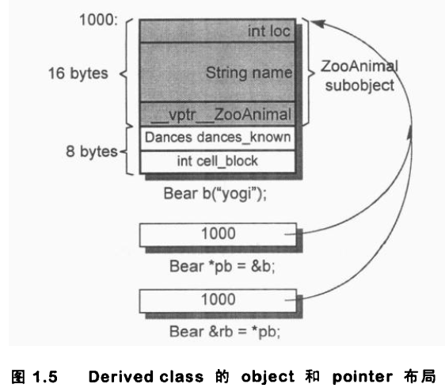

深度探索C++对象模型 笔记

[TOC]

# 第1章 关于对象

## 1.1 C++对象模型

成员分类：

数据成员：static、non-static

成员函数：static、non-static、virtual

```c++
class Point {
public:
    Point( float xval );
    virtual ~Point();
    
    float x() const;
    static int PointCount();

protected:
	virtual ostream& print( ostream &os ) const;  
    
    float _x;
    static int _point_count;
};
```


每个类有一堆指向虚函数的指针，存放在表格中，这个表格称为**虚函数表**（vtbl），虚函数表的第一个slot中存放的是type_info，用于动态绑定时的类型识别。

该模型的优点：空间和存取时间的效率高

该模型的缺点：；类对象的非静态数据成员改变，需要重新编译

成员、函数放置的位置：

- 在类对象中的：
  - 1.non-static数据成员在每个类对象中
  - 2.虚基指针（vtbl）：如果有虚继承的话，在3.4节深入讨论
  - 2.虚函数指针（vptr）：指向类的虚函数表，设定和重置由类的构造函数、析构函数和拷贝赋值运算符自动完成
- 在对象之外的
  - 非虚函数：包括static、non-static
  - 静态数据成员

## 1.3 对象的差异

C++的多态只存在于一个个的public class继承体系中

**C++以以下方法支持多态：**

- 1.经由一组隐式的转化操作：把一个派生类的指针转化为一个指向public继承的基类指针
  - `shape *ps = new circle();`
- 2.经由虚函数机制
  - `ps->rotate();`
- 3.经由dynamic_cast和typeid运算符
  - `if( circle *pc = dynamic_cast<circle*>( ps ) )...`

多态的主要用途：经由一个共同的接口来影响类的封装

**sizeof一个类对象时需要考虑的部分：**

- 1.其non-static数据成员的总和
- 2.对齐导致填补的空间
- 3.支持虚函数和虚基类的指针

**类对象的布局：**

```c++
class ZooAnimal{
public:
    ZooAnimal();
    virtual ~ZooAnimal();
    virtual void rotate();
    
protected:
    int loc;
    string name;
};

ZooAnimal za( "Zoey" );
ZooAnimal *pza = &za;
```

za和pza的可能布局（注意string类型，string所存字符串长度与sizeof(对象)无关）：


如果string的布局是按图所示，则sizeof(za)==sizeof(ZooAnimal)==16字节（4+8+4）

- 但自己VS上测试的结果不一致
  - sizeof(stirng)==28
  - sizeof(za)==sizeof(ZooAnimal)==28+4+4==36

### 指针的类型

“指针类型”作用：告诉编译器如何解释某个特定地址中的内存内容及其大小

### 加上多态之后

```c++
class bear : public ZoonAnimal {
public:
    Bear();
    ~Bear();
    void rotate();
    virtual void dance();
protected:
    enum Dance {...};
    
    Dance dances_know;
    int cell_block;
};

Bear b("Yogi");
Bear *pd = &b;
Bear &rb = *pb;
```

- 注意enum类型的布局




```c++
Bear b;
ZooAnimal *pz = &b;
Bear *pb = &b;
```

**pz与pb的区别是：**

- pb所涵盖的地址包含整个Bear对象
- pz所涵盖的地址只包含Bear对象中的ZooAnimal子对象
- 不能通过pz来处理Bear的任何members，例外：虚函数


# 第2章 构造函数语意学

## 2.1 默认构造函数的构造操作

会自动合成默认构造函数的情况

### 1.该类中有类成员，且该类成员有默认构造函数

因为：该类需要调用类成员的默认构造函数来初始化类成员，因此必须生成一个该类的默认构造函数，但该类的默认构造函数不会初始化该类的其他没有默认构造函数的类成员或内置类型成员

**其他相关知识点：**

- 1). 如果一个类A内含一个或一个以上的类成员对象，那么由程序员显示定义的构造函数即使没有显示调用类成员对象的构造函数，A的显示声明的构造函数也会隐式地调用类成员的默认构造函数（这些隐式调用在初始化列表执行之前发生）
- 2). 如1).中的情况，如果有多个类成员，那么调用它们默认构造函数的顺序与声明顺序一致。

```c++
//1) 2)例子
class Dopey { public: Dopey(); ... };
class Sneezy { public: Sneezy( int ); Sneezy(); ... };
class Bashful { public: Bashful(); ... };

class Snow_White {
public:
    Dopey dopey;
    Sneezy sneezy;
    Bashful bashful;
private:
    int mumble;
};

//Snow_White的显示构造函数
Snow_White::Snow_White : sneezy(1024)
{
    mumble = 1024;
}

//Snow_White的显示构造函数实际上会发生
Snow_White::Snow_White : sneezy(1024)
{
    dopey.Dopey::Dopey();
    sneezy.Sneezy::Sneezy(1024);
    bashful.Bashful::Bashful();
    
    mumble = 1024;
}
```

### 2.该类继承于有默认构造函数的基类

原因：该类需要调用基类的默认构造函数，因此会编译器会为其合成一个默认构造函数。如果有多个基类，调用顺序与基类顺序一致

相关知识点：

- 1). 如果该类声明了别的构造函数，但没有默认构造函数，别的构造函数会隐式地调用基类的默认构造函数。此时不会合成默认构造函数
- 2). 如果同时存在有默认构造函数的基类和有默认构造函数的类成员对象，那么先调用基类的默认构造函数，再调用类成员对象的默认构造函数

### 3.该类有虚功能（虚函数或虚基类）

有虚功能的情况：

- 1). 类声明（或基层）了一个虚函数
- 2). 类派生自一个继承串链，其中有一个或多个虚基类

原因：该类需要默认构造函数为每个对象初始化虚函数表指针和虚基类指针

相关知识点：

- 1). 如果该类有程序员定义的显示构造函数，这些构造函数会隐式完成虚函数指针和虚基类指针的初始化工作

### 总结

- 1.除了以上提出的3种情况（实际上是4种），编译器不会为一个类合成默认构造函数
- 2.在合成的默认构造函数中，只有有默认构造函数的基类的子对象和有默认构造函数的类成员对象会被初始化，其他非静态成员都不会被初始化（包括整数、整数指针、整数数组等）
- 3.常见误解：
  - 任何class如果没有定义默认构造函数，都会被合成一个（错误！）
  - 合成的默认构造函数会显示设定类内每一个数据成员的默认值（错误！）

## 2.2 拷贝构造函数的操作


