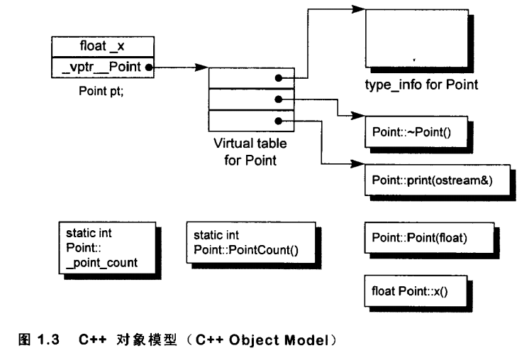
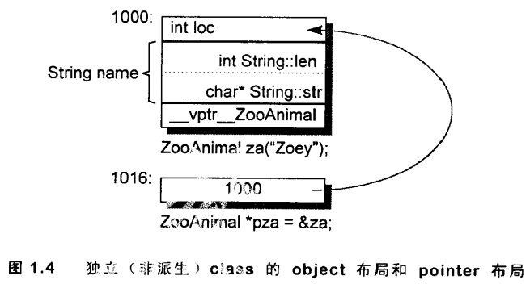
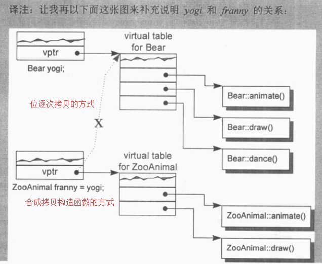

深度探索C++对象模型 笔记

[TOC]

# 第1章 关于对象

## 1.1 C++对象模型

成员分类：

数据成员：static、non-static

成员函数：static、non-static、virtual

```c++
class Point {
public:
    Point( float xval );
    virtual ~Point();
    
    float x() const;
    static int PointCount();

protected:
	virtual ostream& print( ostream &os ) const;  
    
    float _x;
    static int _point_count;
};
```



每个类有一堆指向虚函数的指针，存放在表格中，这个表格称为**虚函数表**（vtbl），虚函数表的第一个slot中存放的是type_info，用于动态绑定时的类型识别。

该模型的优点：空间和存取时间的效率高

该模型的缺点：；类对象的非静态数据成员改变，需要重新编译

成员、函数放置的位置：

- 在类对象中的：
  - 1.non-static数据成员在每个类对象中
  - 2.虚基指针（vtbl）：如果有虚继承的话，在3.4节深入讨论
  - 2.虚函数指针（vptr）：指向类的虚函数表，设定和重置由类的构造函数、析构函数和拷贝赋值运算符自动完成
- 在对象之外的
  - 非虚函数：包括static、non-static
  - 静态数据成员

## 1.3 对象的差异

C++的多态只存在于一个个的public class继承体系中

**C++以以下方法支持多态：**

- 1.经由一组隐式的转化操作：把一个派生类的指针转化为一个指向public继承的基类指针
  - `shape *ps = new circle();`
- 2.经由虚函数机制
  - `ps->rotate();`
- 3.经由dynamic_cast和typeid运算符
  - `if( circle *pc = dynamic_cast<circle*>( ps ) )...`

多态的主要用途：经由一个共同的接口来影响类的封装

**sizeof一个类对象时需要考虑的部分：**

- 1.其non-static数据成员的总和
- 2.对齐导致填补的空间
- 3.支持虚函数和虚基类的指针

**类对象的布局：**

```c++
class ZooAnimal{
public:
    ZooAnimal();
    virtual ~ZooAnimal();
    virtual void rotate();
    
protected:
    int loc;
    string name;
};

ZooAnimal za( "Zoey" );
ZooAnimal *pza = &za;
```

za和pza的可能布局（注意string类型，string所存字符串长度与sizeof(对象)无关）：



如果string的布局是按图所示，则sizeof(za)==sizeof(ZooAnimal)==16字节（4+8+4）

- 但自己VS上测试的结果不一致
  - sizeof(stirng)==28
  - sizeof(za)==sizeof(ZooAnimal)==28+4+4==36

### 指针的类型

“指针类型”作用：告诉编译器如何解释某个特定地址中的内存内容及其大小

### 加上多态之后

```c++
class bear : public ZoonAnimal {
public:
    Bear();
    ~Bear();
    void rotate();
    virtual void dance();
protected:
    enum Dance {...};
    
    Dance dances_know;
    int cell_block;
};

Bear b("Yogi");
Bear *pd = &b;
Bear &rb = *pb;
```

- 注意enum类型的布局


```c++
Bear b;
ZooAnimal *pz = &b;
Bear *pb = &b;
```

**pz与pb的区别是：**

- pb所涵盖的地址包含整个Bear对象
- pz所涵盖的地址只包含Bear对象中的ZooAnimal子对象
- 不能通过pz来处理Bear的任何members，例外：虚函数


# 第2章 构造函数语意学

## 2.1 默认构造函数的构造操作

会自动合成默认构造函数的情况

### 1.该类中有类成员，且该类成员有默认构造函数

因为：该类需要调用类成员的默认构造函数来初始化类成员，因此必须生成一个该类的默认构造函数，但该类的默认构造函数不会初始化该类的其他没有默认构造函数的类成员或内置类型成员

**其他相关知识点：**

- 1). 如果一个类A内含一个或一个以上的类成员对象，那么由程序员显示定义的构造函数即使没有显示调用类成员对象的构造函数，A的显示声明的构造函数也会隐式地调用类成员的默认构造函数（这些隐式调用在初始化列表执行之前发生）
- 2). 如1).中的情况，如果有多个类成员，那么调用它们默认构造函数的顺序与声明顺序一致。

```c++
//1) 2)例子
class Dopey { public: Dopey(); ... };
class Sneezy { public: Sneezy( int ); Sneezy(); ... };
class Bashful { public: Bashful(); ... };

class Snow_White {
public:
    Dopey dopey;
    Sneezy sneezy;
    Bashful bashful;
private:
    int mumble;
};

//Snow_White的显示构造函数
Snow_White::Snow_White : sneezy(1024)
{
    mumble = 1024;
}

//Snow_White的显示构造函数实际上会发生
Snow_White::Snow_White : sneezy(1024)
{
    dopey.Dopey::Dopey();
    sneezy.Sneezy::Sneezy(1024);
    bashful.Bashful::Bashful();
    
    mumble = 1024;
}
```

### 2.该类继承于有默认构造函数的基类

原因：该类需要调用基类的默认构造函数，因此会编译器会为其合成一个默认构造函数。如果有多个基类，调用顺序与基类顺序一致

相关知识点：

- 1). 如果该类声明了别的构造函数，但没有默认构造函数，别的构造函数会隐式地调用基类的默认构造函数。此时不会合成默认构造函数
- 2). 如果同时存在有默认构造函数的基类和有默认构造函数的类成员对象，那么先调用基类的默认构造函数，再调用类成员对象的默认构造函数

### 3.该类有虚功能（虚函数或虚基类）

有虚功能的情况：

- 1). 类声明（或基层）了一个虚函数
- 2). 类派生自一个继承串链，其中有一个或多个虚基类

原因：该类需要默认构造函数为每个对象初始化虚函数表指针和虚基类指针

相关知识点：

- 1). 如果该类有程序员定义的显示构造函数，这些构造函数会隐式完成虚函数指针和虚基类指针的初始化工作

### 总结

- 1.除了以上提出的3种情况（实际上是4种），编译器不会为一个类合成默认构造函数
- 2.在合成的默认构造函数中，只有有默认构造函数的基类的子对象和有默认构造函数的类成员对象会被初始化，其他非静态成员都不会被初始化（包括整数、整数指针、整数数组等）
- 3.常见误解：
  - 任何class如果没有定义默认构造函数，都会被合成一个（错误！）
  - 合成的默认构造函数会显示设定类内每一个数据成员的默认值（错误！）

## 2.2 拷贝构造函数的操作

以一个类对象作为另一个对象的初值的情况有三种：

- 1.对一个对象显示的初始化操作：`X xx = x;`
- 2.对象被当做参数交给某个函数：`foo(xx);`
- 3.函数传回一个类对象：`X foo(){ X xx; return xx; }`

上述三种情况，会导致构造函数的调用，有可能发生以下三种情况：

- 一个临时类对象的产生
- 导致程序代码的脱变
- 或以上两种都有

**bitwise copy semantics**：位逐次拷贝语意

**bitwise copy**：将源对象中的成员变量中的每一位赋值到目标对象中。例如指针类型，只将源对象的指针中所存放的地址复制到目标指针的地址中，它们指向的其实是同一块内存地址空间。这会出现重复释放同一内存空间等问题

如果类中出现了**位逐次拷贝语意**，默认构造函数和默认拷贝构造函数就不会被合成，此时类的产生由**位逐次拷贝**完成

不展现**位逐次拷贝语意**的情况（与默认构造函数的情况是一样的）：

- 1.当类包含一个成员对象，该成员对象拥有一个拷贝构造函数（显示声明的拷贝构造函数或编译器合成的拷贝构造函数都可以）
  - 当前类合成的拷贝构造函数会自动调用该成员对象的拷贝构造函数
- 2.当class继承自一个基类，而该基类拥有一个拷贝构造函数（显示或合成）
  - 当前类合成的拷贝构造函数会自动调用该基类的拷贝构造函数
- 3.拥有虚功能时
  - 该类声明了一个或多个虚函数
    - 需要重新设定虚函数表的指针
  - 该类派生自一个继承串链，其中有一个或多个虚基类
    - 需要处理虚基类子对象


**重新设定虚函数表的指针**

当一个类声明了一个或多个虚函数，编译器会有如下操作：

- 1.为这个类增加一个虚函数表，表中含有每一个有作用的虚函数的地址
- 2.生成一个该类对象时，每个对象都有一个指向1.中虚函数表的指针

因为当一个类有虚函数、类对象有虚函数表指针时，编译器需要为其初始化，因此这样的类不再有“位逐次拷贝语意”，因此编译器需要合成一个拷贝构造函数

如果在有虚函数的情况下

- 当一个类对象以其派生类的某个对象作为初值时，使用“位逐次拷贝”，会出错
- 当一个类对象用另一个该类对象作为初值时，使用“位逐次拷贝”，不会出错
- 因此，问题只存在于“当一个类对象以其派生类的某个对象作为初值时”

有虚函数的情况下，使用“位逐次拷贝”和合成拷贝构造函数的区别：

- 位逐次拷贝方式：franny的虚函数表指针指向yogi所属类Bear的虚函数表
- 合成拷贝构造函数方式：franny虚函数表指针指向franny所属类ZooAnimal的虚函数表

```c++
//Bear继承自ZooAnimal
Bear yogi;
ZooAnimal franny = yogi; //这里会发生切割行为
```



**处理虚基类子对象**

有虚基类的情况下，当一个类对象以其派生类的某个对象作为初值时，使用“位逐次拷贝”，会出错。

例如：


```c++
RedPanda little_red;
Raccon little_critter = litter_red;
```

在这种情况下，为了完成正确的little_critter初值设定，编译器必须合成一个拷贝构造函数

合成构造函数需要做的：

- 1.设定虚基类指针/偏移量
- 2.对每一个成员指向不要的成员初始化操作
- 3.其他内存相关工作（3.4章节有关于虚基类有更详细的讨论）

当使用基类指针所指向的对象给基类对象赋值时，编译器无法知道“位逐次拷贝语意”是否还保持着，因为它无法知道基类指针是指向一个派生类对象还是基类对象，这种情况下，位逐次拷贝可能够用，可能不够**用**

```c++
//位逐次拷贝可能够用，可能不够用
Raccoon *ptr;
Raccoon little_critle = *ptr;
```

## 2.3 程序转化语意学

### 显示的初始化操作

显示初始化时，必要的程序转化有两个阶段：

- 1.定义（是指“占用内存”的行为）
- 2.调用拷贝构造函数

例如：

```c++
X x0;

void foo_bar() {
	X x1( x0 );
    X x2 = x0;
    X x3 = X( x0 );
}

//编译器的行为
void foo_bar() {
    //定义阶段
    X x1;
    X x2;
    X x3;

	//调用拷贝构造函数阶段
    x1.X::X( x0 );
    x2.X::X( x0 );
    x3.X::X( x0 );
}
```

### 参数的初始化

实现方式有两种：

- 方式一：
  - 1.以拷贝构造函数生成一个临时变量
  - 2.函数以引用的方式使用临时变量
  - 3.函数完成时，析构临时变量
- 方式二（拷贝建构）：
  - 1.实际参数直接建构在其应该的位置上，此位置视函数活动范围的不同，记录于程序堆栈中
  - 2.在函数返回之前，析构该参数

第一种方式的具体表现如下：

```c++
void foo( X x0 );
X xx = arg;
foo( xx );

//编译器的行为
X __temp0;
__temp0.X::X( xx );
void foo( X& x0 );
foo( __temp0 );
```

### 返回值的初始化

函数的返回值处理分为两个阶段：

- 1.加上一个额外参数，类型是类对象的引用，这个参数用来放置被“拷贝建构”而得的返回值
- 2.在return指令之前插入拷贝构造函数调用，拷贝生成上述引用的值

```c++
X bar()
{
    X xx;
    return xx;
}

//编译器的行为
void bar( X& __result )
{
    X xx;
    xx.X::X();
    
    //调用拷贝构造函数
    __result.X::XX( xx );
    
    return ;
}
```

因此，下面的行为都会变为：

```c++
//例子1：
X xx = bar();
//编译器的行为
X xx;
bar( xx );

//例子2
bar().memfunc();
//编译器的行为
X __temp0;
( bar(__temp0), __temp0 ).memfunc();

//例子3
X (*pf)(); //函数指针
pf = bar;
//编译器的行为
void (*pf)( X& );
pf = bar;
```

### 在使用者层面做优化

```c++
X bar( const T &y, const T &z )
{
    X xx; //调用X的默认构造函数
    //...以y和z来处理xx
    return xx； //这里会调用X的构造函数
}
//编译器的行为
void bar( X &__result )
{
    X xx;
    xx.X::X(); //调用默认构造函数
    //...以y和z来处理xx
    __result.X::X( xx ); //调用拷贝构造函数
    return;
}


//使用者优化后，只调用一次构造函数，效率更高
X bar( const T &y, const T &z )
{
    return X( y, z )； //这里调用X的两个参数的构造函数，而省略了调用构造函数的步骤
}
//编译器的行为
void bar( X &__result )
{
    __result.X::X( y, z );
    return;
}
```

### 在编译器层面做优化

NRV优化，即Named Return Value，具体优化过程如下：

```c++
X bar()
{
    X xx;
    //...处理xx
    return xx;
}
//优化前
void bar( X &__result )
{
    X xx;
    xx.X::X(); //调用默认构造函数
    //...处理xx
    __result.X::X( xx ); //调用拷贝构造函数
    return;
}
//NRV优化后
void bar( X &__result )
{
    //以__result直接调用默认构造函数
    __result.X::X();
    //...直接处理__result
    
    return;
}
```

NRV优化的必备条件：类有拷贝构造函数

NRV优化的受争议的点：

- 1.优化由编译器默默完成，它是否真的被完成，不清楚
- 2.一旦函数变得复杂，优化就变得难以施行（cfront会只有top level时才进行NRV优化，如果有嵌套的局部块返回语句，则不进行NRV优化）
- 3.某些程序员不喜欢应用程序被优化

会出现的问题：拷贝静态/全局变量时应如何处理

```c++
Thing outer; //全局变量
//代码块，局部区域
{
    //inner应该从outer拷贝过来，还是直接只用outer而忽略inner
    Thing inner( outer ); 
}
```

### 拷贝构造函数：要还是不要

如果有大量的数据成员初始化操作，而你又想编译器为你做NRV优化，则可以显示声明一个inline的拷贝构造函数，以激活编译器的NRV优化

另一个需要注意的问题：在拷贝构造函数中使用memcpy和memset时，不能有该类不能有虚功能，否则会出错

```c++
Point3d::Point3d( const Point3d &rhs )
{
    memcpy( this, &rhs, sizeof(Point3d) );
}

//如果Point3d有虚功能，例如虚函数，则编译器的行为是
Point3d::Point3d()
{
    //vptr必须在使用者的代码之前先设定妥当
    vptr_Point3d = vtbl_Point3d;
    //vptr可能被设置为其他不合适的值，例如实际传入的是一个Point3d的派生类的对象
    memcpy( this, &rhs, sizeof(Point3d) );
}
```

## 2.4 成员们的初始化队列（初始化列表）

必须在初始化列表进行初始化的数据成员：

- 1.初始化一个引用成员时
- 2.初始化一个const成员时（但static const只能在类初始化，不能在初始化列表初始化）
- 3.调用一个基类的构造函数，而它拥有一组参数时（即调用基类的非默认构造函数）
  - 因为如果不在初始化列表调用想要调用的基类非默认构造函数，初始化列表会自动调用基类的默认构造函数
- 4.调用一个类成员对象的构造函数，而它拥有一组参数时（即调用类成员对象的非默认构造函数）
  - 因为如果不在初始化列表调用想要调用的类成员对象非默认构造函数，初始化列表会自动调用类成员对象的默认构造函数


**注意：**

- 1.对于类成员对象，最好在初始化列表初始化。
  - 初始化列表初始化，只有一步：
    - 调用对应的构造函数初始化类对象
  - 在函数体中初始化，效率不高，会执行以下几步：
    - 调用类成员的默认构造函数（初始化列表阶段时调用）
    - 创建临时变量
    - 使用类对象的赋值拷贝运算符，将临时变量赋值给类对象
    - 析构临时变量
- 2.初始化列表阶段，类成员的初始化顺序由声明顺序决定

```c++
//错误
class X{
    int i;
    int j;
public:
    X ( int val ): j(val),i(j){}
}
//正确
class X{
    int i;
    int j;
public:
    //在初始化列表阶段，若类对象在局部变量，i会初始化为0，否则，i不初始化
    //在这里，先执行初始化列表阶段，对i的行为是不确定的，但j会初始化为val
    //接着，执行i=j
    X ( int val ): j(val){
    	i = j;
    }
}
```

- 3.是否可以在构造函数中调用某个成员函数对数据成员进行初始化
  - 答案：可以，但最好是在函数体初始化是调用，而不要在初始化列表中调用，因为此时this还没初始化完全
- 4.在派生类的初始化列表中，调用基类的构造函数，使用派生类的成员函数返回值作为参数。
  - 最好不要这样做，因为this完成初始化


# 第3章 Data语意学

```c++
//书上的说法
class X { }; //sizeof(X)==1
class Y : public virtual X { }; //sizeof(Y)==8，因为虚指针+Y的空1byte+3bytes对齐
class Z : public virtual X { }; //sizeof(Z)==8，因为虚指针+Y的空1byte+3bytes对齐
class A : public Y, public Z { }; //sizeof(A)==12，因为虚指针*2+X的空1byte+3bytes对齐

//但在我自己的VS上测试的sizeof有所不同
class X { }; //sizeof(X)==1
class Y : public virtual X { }; //sizeof(Y)==4
class Z : public virtual X { }; //sizeof(Z)==4
class Test : public Y, public Z { }; //sizeof(A)==8

//VS中A的布局
1>class Test	size(8):
1>	    +---
1> 0	| +--- (base class Y)
1> 0	| | {vbptr}
1>	    | +---
1> 4	| +--- (base class Z)
1> 4	| | {vbptr}
1>	    | +---
1>	    +---
1>	    +--- (virtual base X)
1>	    +---
1>
1>       Test::$vbtable@Y@:
1> 0	| 0
1> 1	| 8 (Testd(Y+0)X)
1>
1>       Test::$vbtable@Z@:
1> 0	| 0
1> 1	| 4 (Testd(Z+0)X)
1>vbi:	   class  offset o.vbptr  o.vbte fVtorDisp
1>               X       8       0       4 0
```

sizeof(X)为1，因为它有一个隐藏的1byte大小，那是被编译器安插进去的一个char，这使得该类的两个对象得以在内存中配置独一无二的地址

**一个类的大小（sizeof一个类或该类的对象），与一下几个因素相关**

- 1.语言本身造成的负担，如由虚函数、虚基类造成的虚函数指针和虚基指针
  - 虚基类的实现：
    - 虚基指针指向在该派生类中虚基类的子对象的起始位置
    - 虚基指针指向一个相关表格，表格中存放的是虚基类子对象的地址，或在该派生类对象上的偏移量（一般来说，在派生类对象的尾部）
- 2.编译器对于特殊情况提供的优化处理，例如：
  - 派生类本身也是空类，此时又虚继承于一个空类，由于派生类已经有一个4字节的指针，因此因自身空类产生的1字节就有能被优化掉（因为既然有成员了（虚基指针），就不需要安插一个char了）

**优化前**


**优化后**


**在我的VS测试的结果**

```c++
class A {};
class Test : virtual public A {};

int main()
{
    cout<<sizeof(Test)<<endl; //输出为4
    return 0;
}

//内存分布输出为：
1>class Test	size(4):
1>	    +---
1> 0	| {vbptr}
1>	    +---
1>	    +--- (virtual base A)
1>	    +---
1>
1>       Test::$vbtable@:
1> 0	| 0
1> 1	| 4 (Testd(Test+0)A)
1>vbi:	   class  offset o.vbptr  o.vbte fVtorDisp
1>               A       4       0       4 0
```

- 3.对齐
- 4.其他非静态数据成员的大小

## 3.1 数据成员的绑定

**类成员的inline成员函数的数据成员绑定：**

- 1.函数体中的变量值的解析工作，在类声明完成之后才会进行
- 2.函数的参数列表中名称的解析工作，在出现参数列表代码的时候就开始进行

```c++
typedef int length;
int _val = 10;

class Point3d
{
public:
    //length为int，被解析为global，即::length
    // _val被解析为Point3d::_val;
    void mumble( length val ) { _val = val; }

private:
    typedef float length;
    //length被解析为float，即Point3d::length
    length _val;
};
```

为了避免2.中的情况，可以使用“防御性程序风格”

- a.把所有数据成员放在class声明起头处，以确保正确的绑定

除了a.之外，还有别的“防御性程序风格”，但这对解决上面2.的问题没有帮助

- b.把所有的inline functions，不管大小，都放在class声明之外

## 3.2 数据成员的布局

**非静态数据成员：**在每个类对象中的排序顺序与被声明的相对顺序一致，但不一定是连续的，介于两个数据成员之间的有可能是：

- 1.因对齐产生的字节
- 2.因虚功能产生的指针（虚函数指针、虚基类指针）
  - 虚指针的位置：
    - 传统：所有显示声明的成员的最好
    - 现在：每个对象的最前端

**静态数据成员：**存放在程序的静态/全局变量区，与类对象无关

**访问控制区域（acesss section）：**

- 1.指的是由public、private、protected声明的区域
- 2.区域内部的变量是按声明顺序进行存放的
- 3.区域之间并不保证与声明顺序一致，但区域之间，一般来说是连在一起，并按顺序存放的
- 4.区域个数的多少，不会影响类对象所占的空间

## 3.3数据成员的存取

### 静态数据成员

静态成员（数据成员、成员函数）的存取效率：使用对象和使用指针来访问静态成员，实际上都是通过`::`来访问

静态成员（数据成员、成员函数）的继承：静态成员可以被继承

- 1.继承的静态成员函数，派生类调用该函数时，是基类的实现版本
- 2.继承的静态数据成员，派生类与基类指向的是同一块数据，作为引用计数时要小心

### 非静态数据成员

```c++
//origin是类Point3d的一个对象
origin._y = 0.0;

//编译器的行为，&origin._y实际上等于
&origin + (&Point3d::y - 1);
//(&Point3d::y - 1)   为y的偏移位置
```

注意这里的-1，指向数据成员的指针，它的offset总是被加上1，目的是，用于区分：

- 1.一个指向数据成员的指针，用以指出类的第一个成员
- 2.一个指向数据成员的指针，没有指向任何成员（3.6节详细讲）

每个非静态成员的偏移位置在编译时期就可获知，即使该成员是基类的子对象的成员

**存取效率的比较：**

- 1.非虚继承，存取基类数据成员和派生类定义的数据成员的效率是一样的
- 2.虚继承，效率会比非虚继承慢，因为需要经过虚基指针寻址

**通过对象和指针访问数据成员的区别**

- 1.访问静态数据成员：没区别，都是通过`::`来访问，都是编译时确定
- 2.访问非静态数据成员
  - 1.无继承：没区别，都是编译时确定
  - 2.非虚继承：没区别，都是编译时确定
  - 3.虚继承：有区别
    - 指针访问：运行时访问，因为编译期间无法确定虚基指针，需要在运行时根据虚基指针间接导引获得
    - 对象访问：编译时确定

## 3.4 继承与数据成员

下面分四个部分讨论

- 1.单一继承且不含虚函数（只要继承不要多态）
- 2.单一继承并含虚函数（加上多态）
- 3.多重继承
- 4.虚继承

所有的讨论基于这样的一个例子：


### 单一继承且不含虚函数

非虚继承不会增加空间和存取效率上的额外负担


但因为“对齐”，使用非虚继承还是会导致空间上的负担：

**不使用继承时：**


对象的大小为8bytes（4+1+1+1+对齐的1）

**使用非虚继承后**


Concrete1为8bytes（4+1+对齐的3）

Concrete2为12bytes（Concrete1的8+1+对齐的3）

Concrete3为16bytes（Concrete2的12+1+对齐的3）

**在继承的子对象直接要保证对齐的目的：**

基类与派生类相互赋值的行为将会出错，如图所示，如果没有子对象之间的对齐，Concrete1对象赋值给Concrete2对象时，将会出错


### 单一继承并含虚函数

 单一继承并含虚函数带来的额外负担有：

- 1.为每个类维护一个虚函数表，该表的slot个数一般为虚函数个数+一或两（用于存放runtime type identification，如type_info）
- 2.为每个该类的对象导入一个虚函数表指针vptr，提供运行时的链接
- 3.加强构造函数，使构造函数在构造对象时能为vptr设定初值，让对应类的虚函数表
- 4.加强析构函数，需要析构虚函数表指针

**虚函数表指针的位置：**

- 1.类对象的尾端（例如cfron编译器）
  - 好处：可以保留基类C struct的对象布局，因而允许在C程序代码中也能使用（基类C struct中没有虚函数）


- 2.类对象的头部
  - 好处：在多重继承下，通过指向类成员的指针调用虚函数更方便
  - 坏处：
    - 不能保留基类C struct的对象布局（基类C struct中没有虚函数）
    - 由派生类对象取址赋值给基类的指针时，需要编译器调整地址


```c++
//上面例子的代码
struct no_virts {
	int d1;
	int d2;
};

class has_vrts : public no_virts {
public:
	virtual void foo();
private:
	int d3;
};

//使用VS打印的结果如下，因此VS采用的是将虚指针放置与类对象前端的方式
1>class has_vrts	size(16):
1>	    +---
1> 0	| {vfptr}
1> 4	| +--- (base class no_virts)
1> 4	| | d1
1> 8	| | d2
1>	    | +---
1>12	| d3
1>	    +---
1>
1>      has_vrts::$vftable@:
1>	    | &has_vrts_meta
1>	    |  0
1> 0	| &has_vrts::foo
1>
1>has_vrts::foo this adjustor: 0
```

### 多重继承

多重继承时，如果将派生类对象地址（指针）赋值给基类指针时，有可能需要修改偏移的操作


```c++
//派生类对象地址赋值给基类指针的例子
Vertex3d v3d;
Vertex *pv;
Point2d *p2d;
Point3d *p3d;

//需要修改偏移
pv = &v3d;
//编译器的行为
pv = (Vertex*)( ((char*)&v3d) + sizeof( Point3d ) );

//不需要修改偏移
p2d = &v3d;
p3d = &v3d;

//派生类指针赋值给基类指针的例子
Vertex3d *pv3d;
//需要修改偏移值
pv = pv3d;
//编译器的行为
//如果pv3d为0，表示为nullptr，则此时pv也应该设为空
//如果pv3d不为0，则修改偏移
pv = pv3d ? (Vertex*)( ((char*)&v3d) + sizeof( Point3d ) ) : 0;
```

### 虚继承


