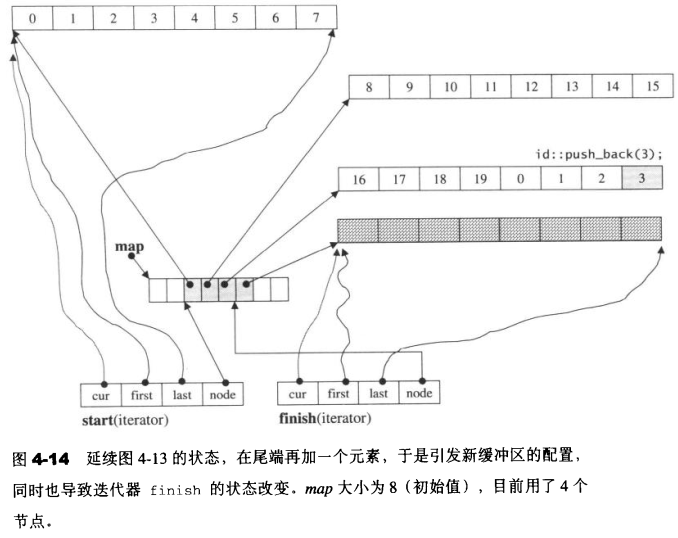
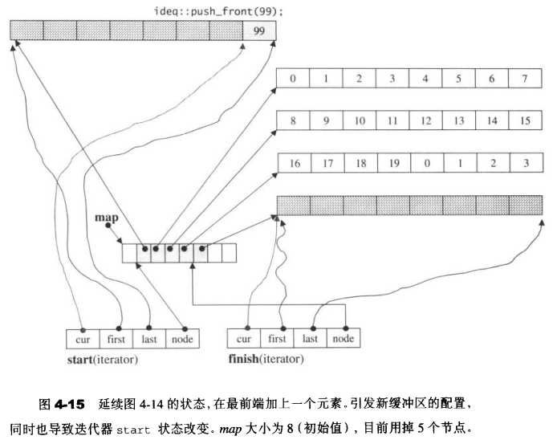
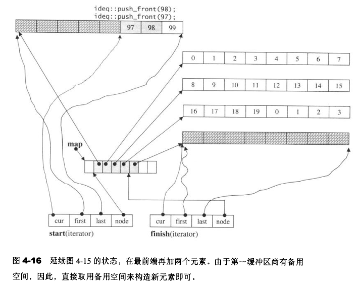

> **1.push_back()**

**push_back()**：

```c++
  void push_back(const value_type& t) {
    //最后缓冲区尚有两个（含）以上的元素的备用空间
    if (finish.cur != finish.last - 1) {
      //直接在备用空间上构造元素
      construct(finish.cur, t);
      ++finish.cur;
    }
    else
      //最后缓冲区只剩一个元素备用空间
      push_back_aux(t);
  }
```

**push_back_aux()**：

```c++
//只有当finish.cur == finish.last - 1才会被调用
//即，只有当最后一个缓冲区只剩一个备用元素空间时才会被调用
template <class T, class Alloc, size_t BufSize>
void deque<T, Alloc, BufSize>::push_back_aux(const value_type& t) {
  value_type t_copy = t;
  //若符合某种条件则必须重换一个map
  reserve_map_at_back();
  //配置一个新节点（缓冲区）
  *(finish.node + 1) = allocate_node();
  __STL_TRY {
    //构造新值到之前剩下的那个元素空间中
    construct(finish.cur, t_copy);
    //改变finish，指向新节点
    finish.set_node(finish.node + 1);
    //设定finish的状态
    finish.cur = finish.first;
  }
  __STL_UNWIND(deallocate_node(*(finish.node + 1)));
}
```



**reserve_map_at_back()**：

```c++
  void reserve_map_at_back (size_type nodes_to_add = 1) {
    //如果map尾端的节点备用空间不足
    //必须重换一个map（配置更大的，拷贝原来的，释放原来的）
    if (nodes_to_add + 1 > map_size - (finish.node - map))
      //该函数支持前端和后端拓展，false表示后端，true表示前端
      reallocate_map(nodes_to_add, false);
  }
```

**reallocate_map()**：

```c++
template <class T, class Alloc, size_t BufSize>
void deque<T, Alloc, BufSize>::reallocate_map(size_type nodes_to_add,
                                              bool add_at_front) {
  size_type old_num_nodes = finish.node - start.node + 1;
  size_type new_num_nodes = old_num_nodes + nodes_to_add;

  map_pointer new_nstart;
  if (map_size > 2 * new_num_nodes) {
    new_nstart = map + (map_size - new_num_nodes) / 2 
                     + (add_at_front ? nodes_to_add : 0);
    if (new_nstart < start.node)
      copy(start.node, finish.node + 1, new_nstart);
    else
      copy_backward(start.node, finish.node + 1, new_nstart + old_num_nodes);
  }
  else { 
    size_type new_map_size = map_size + max(map_size, nodes_to_add) + 2;
    //配置一块空间，准备给新map使用
    map_pointer new_map = map_allocator::allocate(new_map_size);
    //这里需要判断是在前，还是后增加map，如果是前，则需要添加增量nodes_to_add
    new_nstart = new_map + (new_map_size - new_num_nodes) / 2
                         + (add_at_front ? nodes_to_add : 0);
    //把原map内容拷贝过来
    copy(start.node, finish.node + 1, new_nstart);
    //释放原map
    map_allocator::deallocate(map, map_size);
    
    map = new_map;
    map_size = new_map_size;
  }
  //重新设定迭代器start和finish
  start.set_node(new_nstart);
  finish.set_node(new_nstart + old_num_nodes - 1);
}
```

> **2.push_front()**

**push_front()**：

```c++
  void push_front(const value_type& t) {
    //第一缓冲区尚有备用空间
    if (start.cur != start.first) {
      //直接在备用空间上构造元素
      construct(start.cur - 1, t);
      //调整第一缓冲区的使用状态
      --start.cur;
    }
    else //第一缓冲区已无备用空间
      push_front_aux(t);
  }
```

**push_front_aux()**：

```c++
// 只有当start.cur == start.first时才会调用
//即，只有当第一个缓冲区没有任何备用元素时，才会被调用
template <class T, class Alloc, size_t BufSize>
void deque<T, Alloc, BufSize>::push_front_aux(const value_type& t) {
  value_type t_copy = t;
  //若符合某种条件则必须重换一个map
  reserve_map_at_front();
  //配置一个新节点（缓冲区）
  *(start.node - 1) = allocate_node();
  __STL_TRY {
    //改变start，令其指向新节点
    start.set_node(start.node - 1);
    //设定start的状态
    start.cur = start.last - 1;
    //构造新元素到新节点的元素空间中
    construct(start.cur, t_copy);
  }
  catch(...) {
  }
} 
```





**reserve_map_at_front()**

```c++
  void reserve_map_at_front (size_type nodes_to_add = 1) {
    //如果map前端的节点备用空间不足
    //必须重换一个map（配置更大的，拷贝原来的，释放原来的）
    if (nodes_to_add > start.node - map)
      //该函数在上面已经分析
      //该函数支持前端和后端拓展，false表示后端，true表示前端
      reallocate_map(nodes_to_add, true);
  }
```

> **3.pop_back()**

**pop_back()**：

```c++
  void pop_back() {
    //最后缓冲区至少有一个元素
    if (finish.cur != finish.first) {
      //调整指针，相当于排除了最后元素
      --finish.cur;
      //将最后元素析构
      destroy(finish.cur);
    }
    else //最后缓冲区没有任何元素
      //这里将进行缓冲区的释放工作
      pop_back_aux();
  }
```

**pop_back_aux()**：

```c++
// 只有当finish.cur == finish.first时才会被调用
template <class T, class Alloc, size_t BufSize>
void deque<T, Alloc, BufSize>:: pop_back_aux() {
  //释放最后一个缓冲区
  deallocate_node(finish.first);
  //调整finish的状态，指向上一个缓冲区
  finish.set_node(finish.node - 1);
  //并使finish的cur指向上一个缓冲区的最后一个元素
  finish.cur = finish.last - 1;
  //将该元素析构
  destroy(finish.cur);
}
```

> **4.pop_front()**

**pop_front()**：

```c++
  void pop_front() {
    //第一个缓冲区至少有两个元素
    if (start.cur != start.last - 1) {
      //将第1个元素析构
      destroy(start.cur);
      //调整指针，相当于排除了第一个元素
      ++start.cur;
    }
    else 
      //第一个缓冲区仅有一个元素
      //这里将进行缓冲区的释放工作
      pop_front_aux();
  }
```

**pop_front_aux()**：

```c++
// 只有当start.cur == start.last - 1时才会被调用
template <class T, class Alloc, size_t BufSize>
void deque<T, Alloc, BufSize>::pop_front_aux() {
  //将第一个缓冲区的第一个（也是最后一个、唯一一个）元素析构
  destroy(start.cur);
  //释放第一个缓冲区
  deallocate_node(start.first);
  //调整start的状态，指向下一个缓冲区
  start.set_node(start.node + 1);
  //start的cur指向下一个缓冲区的第1个元素
  start.cur = start.first;
}      
```

> **5.clear()**

```c++
//注意，要始终保留一个缓冲区，这是deque的策略，也是deque的初始状态
template <class T, class Alloc, size_t BufSize>
void deque<T, Alloc, BufSize>::clear() {
  //针对头尾以外的每一个缓冲区（它们一定是饱满的）
  for (map_pointer node = start.node + 1; node < finish.node; ++node) {
    //将缓冲区内的所有元素析构
    destroy(*node, *node + buffer_size());
    //释放缓冲区内存
    data_allocator::deallocate(*node, buffer_size());
  }
  
  //至少有头尾两个缓冲区
  if (start.node != finish.node) {
    //将头缓冲区的目前所有元素析构
    destroy(start.cur, start.last);
    //将尾缓冲区的目前所有元素析构
    destroy(finish.first, finish.cur);
    //析构尾缓冲区，注意，头缓冲区保留
    data_allocator::deallocate(finish.first, buffer_size());
  }
  else //只有一个缓冲区
    //将唯一缓冲区内的所有元素析构
    //注意，只析构，不释放，这唯一的缓存区将保留
    destroy(start.cur, finish.cur);
  //调整状态
  finish = start;
}
```

> **6.erase()**

**重载函数1：erase(pos)**：

```c++
  //清除pos所指向的元素。pos为清除点
  iterator erase(iterator pos) {
    iterator next = pos;
    ++next;
    //清除点之前的元素个数
    difference_type index = pos - start;
    //如果清除点之前的元素较少（少于一半）
    if (index < (size() >> 1)) {
      //移动清除点之前的元素
      copy_backward(start, pos, next);
      //移动完毕，最前一个元素冗余，去除之
      pop_front();
    }
    else { //清除点之前的元素较多，则说明清除点之后的元素较少
      //移动清除点之后的元素
      copy(next, finish, pos);
      //移动完毕，最后一个元素冗余，去除之
      pop_back();
    }
    //返回原pos之后的元素的迭代器
    return start + index;
  }
```

**重载函数2：erase(first,last)**：

```c++
//清除[first,last)区间内的所有元素
template <class T, class Alloc, size_t BufSize>
deque<T, Alloc, BufSize>::iterator 
deque<T, Alloc, BufSize>::erase(iterator first, iterator last) {
  //如果清除区间就是整个deque，直接调用clear()
  if (first == start && last == finish) {
    clear();
    return finish;
  }
  else {
    //清除区间的长度
    difference_type n = last - first;
    //清除区间前方的元素个数
    difference_type elems_before = first - start;
    //如果前方的元素较少（少于一半）
    if (elems_before < (size() - n) / 2) {
      //向后移动前方元素（覆盖清除区间）
      copy_backward(start, first, last);
      //标记deque的新起点
      iterator new_start = start + n;
      //移动完毕，将冗余的元素析构
      destroy(start, new_start);
      //将冗余的缓冲区析构
      for (map_pointer cur = start.node; cur < new_start.node; ++cur)
        data_allocator::deallocate(*cur, buffer_size());
      //设定deque的新起点
      start = new_start;
    }
    else {  //如果缓冲区后方的元素较少
      //向前移动后方元素（覆盖缓冲区）
      copy(last, finish, first);
      //标记deque的新尾点
      iterator new_finish = finish - n;
      //移动完毕，将冗余的元素析构
      destroy(new_finish, finish);
      //将冗余的缓冲区释放
      for (map_pointer cur = new_finish.node + 1; cur <= finish.node; ++cur)
        data_allocator::deallocate(*cur, buffer_size());
      //设定deque的新尾点
      finish = new_finish;
    }
    //返回原last指向的元素的迭代器
    return start + elems_before;
  }
}
```

> **7.insert()**

**insert()**：

```c++
  //在position之前插入x
  iterator insert(iterator position, const value_type& x) {
    //如果插入点是deque的最前端，交给push_front()去做
    if (position.cur == start.cur) {
      push_front(x);
      //返回新插入元素的迭代器
      return start;
    }
    //如果插入点是deque的最尾端，交给push_back()去做
    else if (position.cur == finish.cur) {
      push_back(x);
      iterator tmp = finish;
      --tmp;
      //返回新插入元素的迭代器
      return tmp;
    }
    else {
      //其他情况，交给insert_aux()去做
      return insert_aux(position, x);
    }
  }
```

**insert_aux()**：

```c++
template <class T, class Alloc, size_t BufSize>
typename deque<T, Alloc, BufSize>::iterator
deque<T, Alloc, BufSize>::insert_aux(iterator pos, const value_type& x) {
  //插入点之前的元素个数
  difference_type index = pos - start;
  value_type x_copy = x;
  //如果插入点之前的元素个数较少（小于一半）
  if (index < size() / 2) {
    //在最前端加入与第一个元素同值的元素
    push_front(front());
    //标记记号，然后向前移动元素
    iterator front1 = start;
    ++front1;
    iterator front2 = front1;
    ++front2;
    pos = start + index;
    iterator pos1 = pos;
    ++pos1;
    //元素移动
    copy(front2, pos1, front1);
  }
  else { //插入点之后的元素个数较少
    //在最尾端加入与最后元素同值的元素
    push_back(back());
    //标记记号，然后进行元素移动
    iterator back1 = finish;
    --back1;
    iterator back2 = back1;
    --back2;
    pos = start + index;
    //元素移动
    copy_backward(pos, back2, back1);
  }
  //在插入点上设定新值
  *pos = x_copy;
  return pos;
}
```

