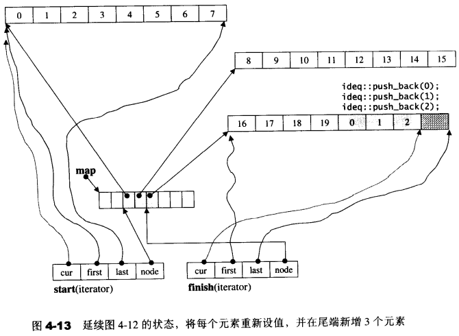

# deque-构造函数

**调用流程**：

```
deque()
	---> fill_initialize() //负责生产并安排好deque的结构，并将初值设定妥当
		---> create_map_and_nodes() //负责产生并安排好deque的结构
```

**deque构造函数**：

```c++
  //构造函数deque()
  deque(int n, const value_type& value)
    : start(), finish(), map(0), map_size(0)
  {
    //负责生产并安排好deque的结构，并将初值设定妥当
    fill_initialize(n, value);
  }


```

**fill_initialize()**：

```c++
//fill_initialize()，负责生产并安排好deque的结构，并将初值设定妥当
template <class T, class Alloc, size_t BufSize>
void deque<T, Alloc, BufSize>::fill_initialize(size_type n,
                                               const value_type& value) {
  //把deque的结构都产生并安排好
  create_map_and_nodes(n);
  map_pointer cur;
  __STL_TRY {
    //为每个节点的缓冲区设定初值
    for (cur = start.node; cur < finish.node; ++cur)
      uninitialized_fill(*cur, *cur + buffer_size(), value);
    //最后一个节点的设置稍有不同（因为尾端可能有备用空间，不必设初值）
    uninitialized_fill(finish.first, finish.cur, value);
  }
  catch(...) {
  }
}

```

**create_map_and_nodes()**：

```c++
//create_map_and_nodes()，负责生产并安排好deque的结构
template <class T, class Alloc, size_t BufSize>
void deque<T, Alloc, BufSize>::create_map_and_nodes(size_type num_elements) {
  //需要节点数=（元素个数/每个缓冲区可容纳的元素个数）+1
  //如果刚好整除，会多配1个节点
  size_type num_nodes = num_elements / buffer_size() + 1;
  
  //一个map要管理几个节点。至少8个，最多是“所需节点数+2”
  //（前后各预留一个，扩充时使用）
  map_size = max(initial_map_size(), num_nodes + 2);
  //配置一个由max_size个节点的map
  map = map_allocator::allocate(map_size);
  
  //以下令nstart和nfinish指向map所拥有的全部节点的最中央区段
  //保持在最中央，可使头尾两端的扩充能量一样大。每个节点可对应一个缓冲区
  map_pointer nstart = map + (map_size - num_nodes) / 2;
  map_pointer nfinish = nstart + num_nodes - 1;
    
  map_pointer cur;
  __STL_TRY {
    //为map内的每个现用节点配置缓冲区，
    //所有缓冲区加起来就是deque的可用空间（最后一个缓冲区可能留有一些余裕）
    for (cur = nstart; cur <= nfinish; ++cur)
      *cur = allocate_node();
  }
  catch(...) {
	//commit or rollback语意
  }

  //为deque内的两个迭代器start和end设定正确内容
  start.set_node(nstart);
  finish.set_node(nfinish);
  start.cur = start.first;
  finish.cur = finish.first + num_elements % buffer_size();
}
```

