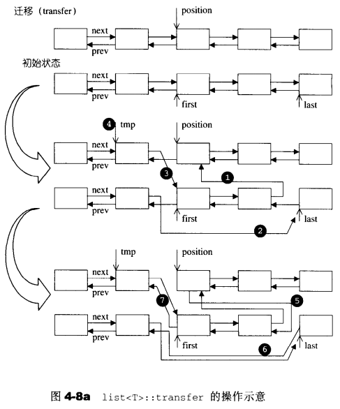

## list-transfer()

```c++
//将[first,last)内的所有元素移动到position之前
protected:
  void transfer(iterator position, iterator first, iterator last) {
    if (position != last) {
      //1.last的next设为的prev的next设为position
      (*(link_type((*last.node).prev))).next = position.node;
      //2.first的prve的next指向last
      (*(link_type((*first.node).prev))).next = last.node;
      //3.positon的prev的next指向first
      (*(link_type((*position.node).prev))).next = first.node;
      //4.获取position的prev
      link_type tmp = link_type((*position.node).prev);
      //5.position的prev设为last的prev
      (*position.node).prev = (*last.node).prev;
      //6.last的prev设为first的prev
      (*last.node).prev = (*first.node).prev; 
      //7.first的prev设为position的prev
      (*first.node).prev = tmp;
    }
  }
```

