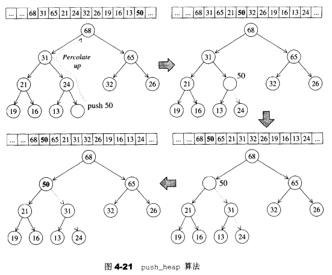
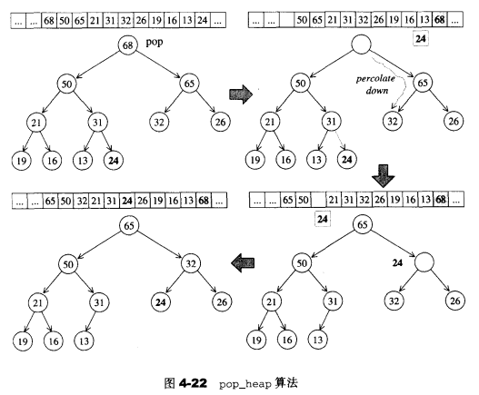

## 4.5 stack

### 4.5.1 stack概述

- 先进后出

- stack不允许有遍历行为

### 4.5.2 stack定义完整列表

- SGI STL以deque作为缺省情况下的stack底部结构 
- stack系以底部容器完成其所有工作，而具有这种“修改某物接口，形成另一种风格”的性质者，称为adapter（适配器）。其不归为container，而归为conatiner adapter
- 相关函数：
  - empty()
  - size()
  - top()
  - push()
  - pop()

stack的定义如下：

```c++
template <class T, class Sequence = deque<T> >
class stack {
  //以下__STL_NULL_TMPL_ARGS会展开为 <>
  friend bool operator== __STL_NULL_TMPL_ARGS (const stack&, const stack&);
  friend bool operator< __STL_NULL_TMPL_ARGS (const stack&, const stack&);
public:
  typedef typename Sequence::value_type value_type;
  typedef typename Sequence::size_type size_type;
  typedef typename Sequence::reference reference;
  typedef typename Sequence::const_reference const_reference;
protected:
  Sequence c;   //底层容器
public:
  //以下完全利用Sequence c的操作，完成stack的操作
  bool empty() const { return c.empty(); }
  size_type size() const { return c.size(); }
  reference top() { return c.back(); }
  const_reference top() const { return c.back(); }
  //deque是两头可进出，stack是后进后出
  void push(const value_type& x) { c.push_back(x); }
  void pop() { c.pop_back(); }
};

template <class T, class Sequence>
bool operator==(const stack<T, Sequence>& x, const stack<T, Sequence>& y) {
  return x.c == y.c;
}

template <class T, class Sequence>
bool operator<(const stack<T, Sequence>& x, const stack<T, Sequence>& y) {
  return x.c < y.c;
}
```

### 4.5.3 stack没有迭代器

stack不提供走访功能，因此不提供迭代器

### 4.5.4 以list作为stack的底层容器

只要底层容器实现了empty、size、back、push_back、pop_back函数，都可以作为stack的底层容器。如list

```c++
stack<int,list<int>> istack; 
```

## 4.6 queue

### 4.6.1 queue概述

- 先进先出
- queue不允许有遍历行为

### 4.6.2 queue定义完整列表

- SGI STL以deque作为缺省情况下的queue底部结构
-  queue称为adapter（适配器）。其不归为container，而归为conatiner adapter
- 相关函数
  - empty()
  - size()
  - front()
  - back()
  - push()
  - pop()

```c++
template <class T, class Sequence = deque<T> >
class queue {
  //以下__STL_NULL_TMPL_ARGS会展开为 <>
  friend bool operator== __STL_NULL_TMPL_ARGS (const queue& x, const queue& y);
  friend bool operator< __STL_NULL_TMPL_ARGS (const queue& x, const queue& y);
public:
  typedef typename Sequence::value_type value_type;
  typedef typename Sequence::size_type size_type;
  typedef typename Sequence::reference reference;
  typedef typename Sequence::const_reference const_reference;
protected:
  Sequence c;   //底层容器
public:
  //以下完全利用Sequence c的操作，完成stack的操作
  bool empty() const { return c.empty(); }
  size_type size() const { return c.size(); }
  reference front() { return c.front(); }
  const_reference front() const { return c.front(); }
  reference back() { return c.back(); }
  const_reference back() const { return c.back(); }
  deque是两头可进出，queue是尾端紧、首部出
  void push(const value_type& x) { c.push_back(x); }
  void pop() { c.pop_front(); }
};

template <class T, class Sequence>
bool operator==(const queue<T, Sequence>& x, const queue<T, Sequence>& y) {
  return x.c == y.c;
}

template <class T, class Sequence>
bool operator<(const queue<T, Sequence>& x, const queue<T, Sequence>& y) {
  return x.c < y.c;
}
```

### 4.6.3 queue没有迭代器

queue不提供遍历功能，因此不提供迭代器

### 4.6.4 以list作为queue的底层容器

只要底层容器实现了empty、size、front、back、push_back、pop_front函数，都可以作为stack的底层容器。如list

```c++
queue<int,list<int> > iqueue;
```

## 4.7 heap

### 4.7.1 heap概述

heap并不归属与STL容器组件，它是个幕后英雄，扮演priority queue的助手 

heap是一颗完全二叉树（整颗二叉树除了底层的叶节点外，是填满的；最底层的叶节点由左至右不得有空隙），完全二叉树使用数组实现，因此使用一个vector作为heap的结构，然后通过一组xxx_heap算法，使其符合heap的性质 

**隐式表述法**：将数组的第0个元素保留（设为无限大值或无限小值），当完全二叉树中的某个节点位于数组的i处时：

- 左子节点：2i
- 右子节点：2i+1
- 父节点：i/2（取整）

heap可分为max-heap和min-heap，默认情况下，STL提供max-heap。下面也按照max-heap来讨论

### 4.7.2 heap算法

- 1.push_heap()
- 2.pop_heap()
- 3.sort_heap()
- 4.make_heap()

> **1.[push_heap()](STL/heap-push_heap().md)**

为满足max-heap的条件（每个节点的键值都大于等于其子节点键值），我们执行一段**上溯程序**：将新节点拿来与其父节点比较，如果其键值比父节点大，就父子对换位置。如此一一直上溯，直到不需要对换或到根节点为止

**函数执行条件**：

- 1.该函数接受两个迭代器，用来表现一个heap底部容器（vector）的头尾
- 2.新元素插入到底部容器的最尾部（调用push_back()）



> **2.[pop_heap()](STL/pop_heap().md)**

操作分为

- 1.pop取走根节点，放入vector的尾端节点，尾端节点原值放入临时变量
- 2.临时变量从根开始，进行下述的**下溯程序**

为满足max-heap的条件（每个节点的键值都大于等于其子节点键值），我们执行一段所谓的**下溯程序**：将空间节点和其较大子节点“对调”，并持续下放，直至叶节点为止。然后将上面说到的**被割舍元素**（原heap中，vector最后一个元素）的值设定给这个“已经到达叶层的空洞节点”，再对它指向一次**上溯程序**

**函数执行条件**：该函数接受两个迭代器，用来表现一个heap底层容器（vector）的头尾

注意：pop_heap之后需要push_back取走所求元素



