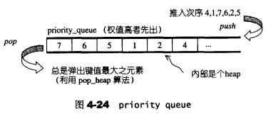
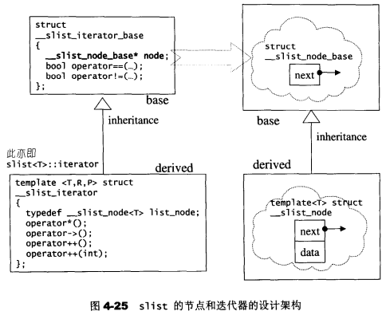
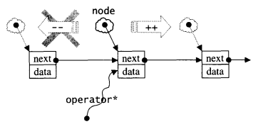
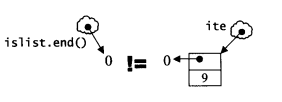

## 4.8 priority_queue

### 4.8.1 priority_queue概述

priority_queue是一个拥有权值观念的queue，它允许加入新元素、移除旧元素、审视元素值等功能。只允许在底端加入元素，并从顶端取出元素

**排序次序**：priority_queue带有权值观念，其内的元素并非依照被推入的次序排序，而是自动按照元素的权值排列（通常权值以实值表示）。

**缺省情况**：缺省时priority_queue使用max-heap



### 4.8.2 priority_queue定义完整列表

缺省时，以vector为底部容器，以heap为处理规则

STL priority_queue归类为container adapter

相关函数：

- priority_queue()：构造函数，利用make_heap()建堆
- empty()
- size()
- top()：利用vector的front()
- push()：先push_back()、再push_heap()
- pop()：先pop_heap()，再pop_back()

```c++
template <class T, class Sequence = vector<T>, 
          class Compare = less<typename Sequence::value_type> >
class  priority_queue {
public:
  typedef typename Sequence::value_type value_type;
  typedef typename Sequence::size_type size_type;
  typedef typename Sequence::reference reference;
  typedef typename Sequence::const_reference const_reference;
protected:
  Sequence c;       //底层容器
  Compare comp;     //元素大小比较标准
public:
  priority_queue() : c() {}
  explicit priority_queue(const Compare& x) :  c(), comp(x) {}

  //以下用到的make_heap()、push_heap()、pop_heap()都是泛型算法
  //构造一个priority queue，首先根据传入的迭代器区间初始化底层容器c，然后调用
  //make_heap()使用底层容器建堆
  template <class InputIterator>
  priority_queue(InputIterator first, InputIterator last, const Compare& x)
    : c(first, last), comp(x) { make_heap(c.begin(), c.end(), comp); }
  template <class InputIterator>
  priority_queue(InputIterator first, InputIterator last) 
    : c(first, last) { make_heap(c.begin(), c.end(), comp); }

  bool empty() const { return c.empty(); }
  size_type size() const { return c.size(); }
  const_reference top() const { return c.front(); }
  void push(const value_type& x) {
    //先利用底层容器的push_back()将新元素推入末端，再重排heap
    __STL_TRY {
      c.push_back(x); 
      push_heap(c.begin(), c.end(), comp);
    }
    __STL_UNWIND(c.clear());
  }
  void pop() {
    //从heap内取出一个元素。但不是真正弹出，而是重排heap，然后以底层容器的pop_back()
    //取得被弹出的元素
    __STL_TRY {
      pop_heap(c.begin(), c.end(), comp);
      c.pop_back();
    }
    __STL_UNWIND(c.clear());
  }
};
```

### 4.8.3 priority_queue没有迭代器

priority_queue不提供遍历功能，因此不提供迭代器

## 4.9 slist

### 4.9.1 slist概述

**STL list与slist的差别**：

- 1.list在标准规定之内，slist不在标准规定之内

- 2.list是双向链表，slist是单向链表。因此list的迭代器为Bidirectional Iterator，slist为单向的Forward Iterator

**STL list与slist相同点**：它们insert、erase、slice函数等操作不会造成原有的迭代器失效（指向被erase的那个迭代器是会失效的）

**slist的优点**：消耗空间更小，某些操作更快

**slist的缺点**：

- 1.功能受到许多限制
- 2.插入操作（insert）会将新元素插入于指定位置之前，但slist没有任何方便的办法可以回头定位出前一个位置，因此必须从头找起。除了slist起点附近的区域外，在其他位置采用insert或erase操作函数，效率很低
  - 解决方法：slist提供了insert_after()和erase_after()，即在指定迭代器之后执行相应操作

**接口特色**：（基于效率考虑）

- 1.提供了insert_after()和erase_after()，即在指定迭代器之后执行相应操作
- 2.只提供push_front()，不提供push_back()

### 4.9.2 slist的节点



**节点相关的结构**：

```c++
//单向链表的节点基本结构
struct __slist_node_base
{
    __slist_node_base *next;
};

//单向链表的节点结构
template <class T>
struct __slist_node : public __slist_node_base
{
    T data;
}
```

**节点相关的全局函数**：

```c++
//已知某一节点prev_node，将新节点new_node插入其后
inline __slist_node_base* __slist_make_link(
    __slist_node_base *prev_node,
    __slist_node_base *new_node)
{
    //令new节点的下一节点为prev节点的下一节点
    new_node->next = prev_node->next;
    prev_node->next = new_node; //令prev节点的下一节点指向new节点
    return new_node;
}

//单向链表的大小（元素个数）
inline size_t __slist_size(__slist_node_base *node)
{
    size_t result = 0;
    for(;node != 0;node = node->next)
        ++result;   //一个个累计
    return result;
}
```

### 4.9.3 slist的迭代器



**迭代器的定义如下**： 

```c++
//单向链表的迭代器基本结构
struct __slist_iterator_base
{
  typedef size_t size_type;
  typedef ptrdiff_t difference_type;
  typedef forward_iterator_tag iterator_category;   //单向

  __slist_node_base* node;  //指向节点基本结构

  __slist_iterator_base(__slist_node_base* x) : node(x) {}

  void incr() { node = node->next; }    //前进一个节点

  bool operator==(const __slist_iterator_base& x) const {
    return node == x.node;
  }
  bool operator!=(const __slist_iterator_base& x) const {
    return node != x.node;
  }
};

//单向链表的迭代器结构
template <class T, class Ref, class Ptr>
struct __slist_iterator : public __slist_iterator_base
{
  typedef __slist_iterator<T, T&, T*>             iterator;
  typedef __slist_iterator<T, const T&, const T*> const_iterator;
  typedef __slist_iterator<T, Ref, Ptr>           self;

  typedef T value_type;
  typedef Ptr pointer;
  typedef Ref reference;
  typedef __slist_node<T> list_node;

  __slist_iterator(list_node* x) : __slist_iterator_base(x) {}
  __slist_iterator() : __slist_iterator_base(0) {}
  __slist_iterator(const iterator& x) : __slist_iterator_base(x.node) {}

  reference operator*() const { return ((list_node*) node)->data; }
  pointer operator->() const { return &(operator*()); }

  self& operator++()
  {
    incr(); //前进一个节点
    return *this;
  }
  self operator++(int)
  {
    self tmp = *this;
    incr(); //前进一个节点
    return tmp;
  }
};
```

**注意**:比较两个slist迭代器是否相同时，由于`__slist_iterator`并未对`operator==`实施重写，所以会调用`__slist_iterator_base::operator==`。根据其中定义，两个slist迭代器是否相等，视其`__slist_node_base* node`是否相等

### 4.9.4 slist的数据结构

```c++
emplate <class T, class Alloc = alloc>
class slist
{
public:
  typedef T value_type;
  typedef value_type* pointer;
  typedef const value_type* const_pointer;
  typedef value_type& reference;
  typedef const value_type& const_reference;
  typedef size_t size_type;
  typedef ptrdiff_t difference_type;
  
  //定义迭代器类型
  typedef __slist_iterator<T, T&, T*>             iterator;
  typedef __slist_iterator<T, const T&, const T*> const_iterator;

private:
  typedef __slist_node<T> list_node;
  typedef __slist_node_base list_node_base;
  typedef __slist_iterator_base iterator_base;
  //定义空间配置器
  typedef simple_alloc<list_node, Alloc> list_node_allocator;
    
private:
  //头部，注意，它不是指针，是实物
  list_node_base head;
```

### 4.9.5 slist的元素操作

- 1.slist()：构造函数
- 2.~slist()：析构函数
- 3.begin()
- 4.end()
- 5.size()
- 6.empty()
- 7.swap()
- 8.front()
- 9.push_front()
- 10.pop_front()

[slist的元素操作](STL/slist的元素操作.md)

**注意**：end()的画法



