# 第5章 关联式容器


以**RB-tree**作为底层机制（自身也是关联容器，但不对外开放）

- 1.set
- 2.multiset
- 3.map
- 4.multimap

以**hash table**作为底层机制（自身也是容器，由SGI STL提供，不在标准规范之列，下面几个容器也不在）

- 1.hash_set
- 2.hash_multiset
- 3.hash_map
- 4.hash_multimap

**定义**：每个元素都有一个键值（key）和一个实值（value）。当元素被插入到关联式容器中时，容器内部结构（可能是RB-tree，也可能是hash-table）便依照其键值大小，以某种特定规则将这个元素放置于适当的位置。

**特性**：关联容器没有所谓头尾（只有最大元素和最小元素），所以不会有以下操作：

- 1.push_back()
- 2.push_frornt()
- 3.pop_back()
- 4.pop_front()
- 5.begin()
- 6.end()

**实现**：关联式容器的内部结构是一个平衡二叉树，被广泛运用于STL的是RB-tree（红黑树）

## 5.1 树的导览

**术语**：

- 1.路径长度：根节点至任何节点之间有唯一路径，路径所经过的边数
- 2.深度：根节点至任一节点的路径长度，即该节点的深度。根节点的深度为0
- 3.高度：某节点至其最深子节点（叶节点）的路径长度。树的高度即是根节点的高度
- 4.大小：任何节点的大小时指其所有子代（包括自己）的节点总数


> 二叉搜索树

**插入**：

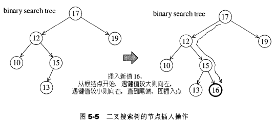

**删除1：只有一个子节点**：

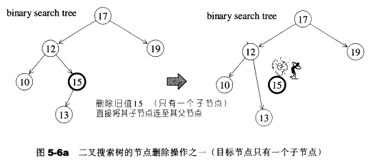

**删除2：有两个子节点**：

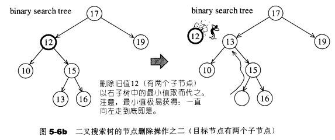

> 平衡二叉搜索树

“平衡”的大致意思是：没有任何一个节点深度过大

AVL-tree、RB-tree、AA-tree均可实现平衡二叉搜索树

> AVL tree

**AVL tree要求**：任何节点的左右子树高度相差最多维1

**插入后不平衡的情况**：

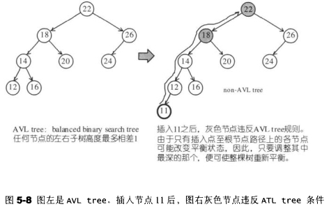

**调整**：只要调整“插入点至根节点”路径上，平衡状态被破坏的各个节点中最深的那一个，便可使整棵树重新获得平衡

**“平衡被破坏”的四种分类**：（假设最深节点为X，“平衡被破坏”意味着X的左右两颗子树的高度相差2）

- 1.插入点位于X的左子节点的左子树---左左（与4对称，**外侧插入**）
- 2.插入点位于X的左子节点的右子树---左右（与3对称，**内侧插入**）
- 3.插入点位于X的右子节点的左子树---右左（与2对称，**内侧插入**）
- 4.插入点位于X的右子节点的右子树---右右（与1对称，**外侧插入**）

外侧插入解决办法：单旋转操作

内侧插入解决办法：双旋转操作

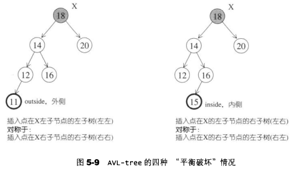

**单旋转**：

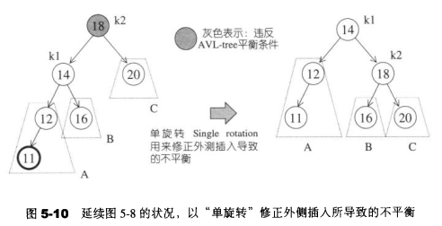

**双旋转**：

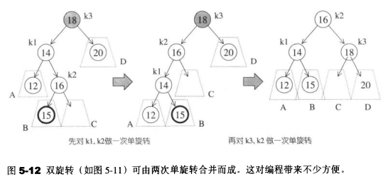

## 5.2 RB-tree

RB-tree（红黑树）是一个二叉搜索树，并且满足下图的4个条件：

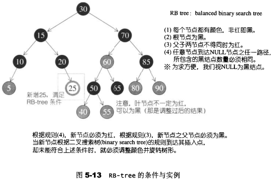

**另**：新增节点必须为红色

### 5.2.1 插入节点

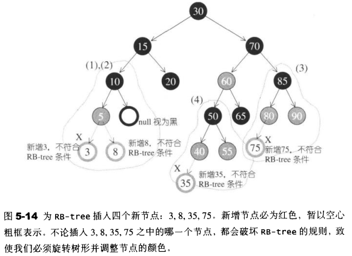

为了方便讨论，为某些特殊节点定义一些代名词

```
X:新节点
P：父节点
G：祖父节点
S：伯父节点，父节点的兄弟节点
GG：曾祖父节点

   GG
   /
   G
  / \
  P  S
 /
X
```

根据X的插入位置及外围节点（S和GG）的颜色，有四种考虑：

- 情况1：S为黑色，X为外侧插入
- 情况2：S为黑色，X为内侧插入
- 情况3：S为红色，X为外侧插入，GG为黑色
- 情况4：S为红色，X为外侧插入，GG为红色

> 情况1：S为黑色，X为外侧插入

**解决方法**：

- a：P，G做单旋转
- b：更改P，G的颜色

此时可能产生不平衡状态（高度相差1以上），这是可以的，因为RB-tree没有这么严格

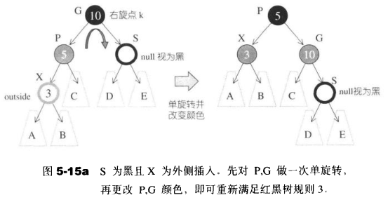

> 情况2：S为黑色，X为内侧插入

**解决方法**：

- a：P，X做单旋转
- b：更改G，X颜色
- c：G左单旋转

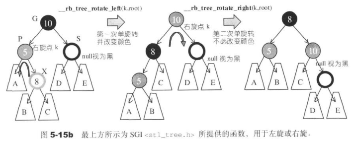

> 情况3：S为红色，X为外侧插入，GG为黑色

**解决方法**：

- a：P，G做单旋转，
- b：改变X的颜色

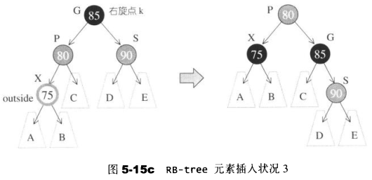

> 情况4：S为红色，X为外侧插入，GG为红色

**解决方法**：

- a：P，G做单旋转
- b：改变X的颜色
- c：持续往上做，直到不再有父子连续为红的情况

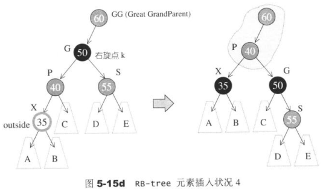

### 5.2.2 一个由上而下的程序

**目的**：为了避免**情况4**”父子节点皆为红色“的情况持续向RB-tree的上层结构发展，形成处理时效上的瓶颈，可以施行一个**由上而下的程序**

**由上而下的程序**：假设新增节点A，那么沿着A的路径向上，只要看到有某个节点X的两个子节点皆为红色，就把X改为红色，并把两个子节点改为黑色

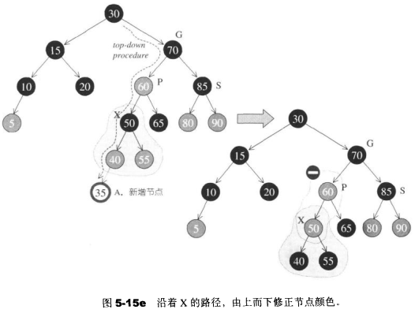

**插入的操作**：

- 1.如果插入节点A的父节点P仍然为红色（此时S不可能为红），则根据情况1或情况2处理
  - 情况1：S为黑色，A为外侧插入
  - 情况2：S为黑色，A为内侧插入
- 2.如果插入节点A的父节点P不为红色
  - 要么，直接插入
  - 要么，插入，再做一次单旋转（如下图）

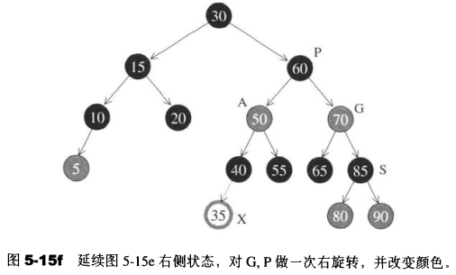

### 5.2.3 RB-tree的节点设计

为了有更大的弹性，节点分为两层：`__rb_tree_node`继承于`__rb_tree_node_base`

minimum()和maximum()函数可以让RB-tree搜索极值变得很容易

RB-tree的各种操作时常需要上溯其父节点,因此有parent指针

```c++
typedef bool __rb_tree_color_type;
const __rb_tree_color_type __rb_tree_red = false;   //红色为0
const __rb_tree_color_type __rb_tree_black = true;  //黑色为1

//RB-tree节点的基类
struct __rb_tree_node_base
{
  typedef __rb_tree_color_type color_type;
  typedef __rb_tree_node_base* base_ptr;

  color_type color; //颜色
  base_ptr parent;  //指向父节点的指针
  base_ptr left;    //指向左子节点的指针
  base_ptr right;   //指向右子节点的指针

  //静态函数，获取以x为根节点的RB-tree最小节点的指针
  static base_ptr minimum(base_ptr x)
  {
    while (x->left != 0) x = x->left;
    return x;
  }

  //静态函数，获取以x为根节点的RB-tree最大节点的指针
  static base_ptr maximum(base_ptr x)
  {
    while (x->right != 0) x = x->right;
    return x;
  }
};

//RB-tree节点类
template <class Value>
struct __rb_tree_node : public __rb_tree_node_base
{
  typedef __rb_tree_node<Value>* link_type;
  Value value_field;    //RB-tree节点的value
};
```

**键和值都包含在value_field中** 

下面是RB-tree的节点图表，其中`__rb_tree_node::value_field`填为10

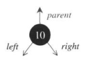

### 5.2.4 RB-tree的迭代器

RB-tree迭代器实现为两层：`__rb_tree_iterator`继承于`__rb_tree_base_iterator`

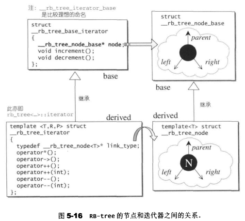

RB-tree迭代器属于双向迭代器，但不具备随机定位能力 

前进操作operator++()调用了基类迭代器的increment()，后退操作operator--()调用了基类迭代器的decrement()。前进或后退的举止行为完全依据二叉搜索树的节点排列法则 

**__rb_tree_base_iterator**：

```c++
//迭代器基类
struct __rb_tree_base_iterator
{
  typedef __rb_tree_node_base::base_ptr base_ptr;
  typedef bidirectional_iterator_tag iterator_category;
  typedef ptrdiff_t difference_type;

  base_ptr node;    //节点基类类型的指针，将迭代器连接到RB-tree的节点

  //实际上就是中序遍历的“下一个节点”问题，
  //但需要考虑RB-tree头节点的特殊情况，参考状况（4）
  void increment()
  {
    //状况（1）：如果node右子树不为空，则找到右子树的最左子节点
    if (node->right != 0) {
      node = node->right;
      while (node->left != 0)
        node = node->left;
    }
    else {
      //状况（2）：如果node右子树为空，
      //需要找到某个节点，该节点是其父节点的左孩子
      base_ptr y = node->parent;
      while (node == y->right) {
        node = y;
        y = y->parent;
      }
      //状况（3）：找到了某个节点node，该节点是其父节点y的左孩子，
      //如果node的右孩子不是其父节点y，
      //则increment的结果为找到节点node的父节点y
      if (node->right != y)
        node = y;
      //状况（4）：找到了某个节点node，该节点是其父节点y的左孩子，
      //如果node的右孩子是其父节点y，
      //则increment的结果为找到节点node，
      //当迭代器指向根节点，而根节点无右子节点时，对迭代器进行increment，
      //会进入状况（4），结果为end()，详情看下图
    }
  }
  
  //实际上就是中序遍历的“上一个节点”问题，
  //但需要考虑RB-tree头节点的特殊情况，参考状况（1）
  void decrement()
  {
    //状况（1）：这种情况发生于node为header时（亦即node为end()时）
    //header右子节点即mostright，指向max节点
    //当迭代器为end()时，若对它进行decrement，会进入状态（1），结果为max
    if (node->color == __rb_tree_red &&
        node->parent->parent == node)
      node = node->right;            //
    else if (node->left != 0) {
     //状况（2）：如果左子树不为空，则找到左子树的最右子节点
      base_ptr y = node->left;
      while (y->right != 0)
        y = y->right;
      node = y;
    }
    else {
      //状况（3）：如果左子树为空，则到某个节点node，该节点node是其父节点y的右孩子，
      //则decrement的结果为该节点的父节点y
      base_ptr y = node->parent;
      while (node == y->left) {
        node = y;
        y = y->parent;
      }
      node = y;
    }
  }
};
```

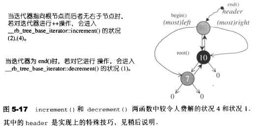

**__rb_tree_iterator**：

```c++
//迭代器类
template <class Value, class Ref, class Ptr>
struct __rb_tree_iterator : public __rb_tree_base_iterator
{
  typedef Value value_type;
  typedef Ref reference;
  typedef Ptr pointer;
  typedef __rb_tree_iterator<Value, Value&, Value*>             iterator;
  typedef __rb_tree_iterator<Value, const Value&, const Value*> const_iterator;
  typedef __rb_tree_iterator<Value, Ref, Ptr>                   self;
  typedef __rb_tree_node<Value>* link_type; //指向RB-tree节点的指针类型

  __rb_tree_iterator() {}
  __rb_tree_iterator(link_type x) { node = x; }
  __rb_tree_iterator(const iterator& it) { node = it.node; }

  //解引用操作为获取所指RB-tree节点的value
  reference operator*() const { return link_type(node)->value_field; }
#ifndef __SGI_STL_NO_ARROW_OPERATOR
  pointer operator->() const { return &(operator*()); }
#endif /* __SGI_STL_NO_ARROW_OPERATOR */

  //调用父类的increment()，函数会修改node成员，使其指向后一个RB-tree节点
  self& operator++() { increment(); return *this; }
  self operator++(int) {
    self tmp = *this;
    increment();
    return tmp;
  }
    
  //调用父类的decrement()，函数会修改node成员，使其指向前一个RB-tree节点
  self& operator--() { decrement(); return *this; }
  self operator--(int) {
    self tmp = *this;
    decrement();
    return tmp;
  }
};
```

### 5.2.5 RB-tree的数据结构

```c++
template <class Key, class Value, class KeyOfValue, class Compare,
          class Alloc = alloc>
class rb_tree {
protected:
  typedef void* void_pointer;
  typedef __rb_tree_node_base* base_ptr;
  typedef __rb_tree_node<Value> rb_tree_node;
  typedef simple_alloc<rb_tree_node, Alloc> rb_tree_node_allocator;
  typedef __rb_tree_color_type color_type;
public:
  typedef Key key_type;
  typedef Value value_type;
  typedef value_type* pointer;
  typedef const value_type* const_pointer;
  typedef value_type& reference;
  typedef const value_type& const_reference;
  typedef rb_tree_node* link_type;
  typedef size_t size_type;
  typedef ptrdiff_t difference_type;
  //...
protected:
  size_type node_count; // keeps track of size of tree
  link_type header;  
  Compare key_compare;
  //...
public:
  typedef __rb_tree_iterator<value_type, reference, pointer> iterator;
  //...
};
```

### 5.2.6 RB-tree的构造

> RB-tree的空间配置器

```c++
class rb_tree {
protected:
  //...
  typedef __rb_tree_node<Value> rb_tree_node;
  typedef simple_alloc<rb_tree_node, Alloc> rb_tree_node_allocator;
  //...
};
```

> RB-tree的构造

RB-tree的构造方式有两种：

- 1.现有的RB-tree复制一个新的RB-tree
- 2.产生一颗空树

**产生空树**：

```c++
/*
template <class Key, class Value, class KeyOfValue, class Compare,
          class Alloc = alloc>

Key、Value、KeyOfValue、Compare、Alloc(这里使用默认alloc）
*/
rb_tree<int,int,identity<int>,less<int>> itree;
```

**rb_tree()**：

```c++
class rb_tree {
  //...
  void init() {
    //产生一个节点空间，令header指向它
    header = get_node(); 
    //令header为红色，用于区分header与root（root为黑色）
    color(header) = __rb_tree_red; 
                                   
    root() = 0;
    //令header的左子节点为自己
    leftmost() = header;
    //令header的右子节点为自己
    rightmost() = header;
  }
public:
  
  rb_tree(const Compare& comp = Compare())
    : node_count(0), key_compare(comp) { init(); }
  //...
};
```


### 5.2.7 RB-tree的元素操作

- **节点操作**
  - [涉及内存管理的操作](STL/RB-tree-涉及内存管理的操作.md)
    - 分配节点：get_node()
    - 释放节点：put_node()
    - 创建节点：create_node()
    - 拷贝节点：clone_node()
    - 销毁节点：destroy_node()
  - [获取节点成员的操作](STL/RB-tree-获取节点成员的操作.md)
    - left()
    - right()
    - parent()
    - value()
    - key()
    - color()
- **[RB-tree元素操作](STL/RB-tree-元素操作.md)**
  - 获取root节点：root()
  - 获取最左子节点：leftmost()
  - 获取最右子节点：rightmost()
  - 获取起始节点：begin()
  - 获取末尾节点：end()
  - 是否为空：empty()
  - 大小：size()
  - 可容纳的最大值：max_size()
  - **[插入节点](STL/RB-tree-插入节点.md)**：
    - 节点值独一无二：insert_unique()
    - 允许节点值重复：insert_equal()
  - **[元素搜索](STL/RB-tree-元素搜索.md)**： 
    - find()

## 5.3 set

**特性**：

- 1.所有元素都会根据元素的键值自动被排序
- 2.不同时拥有实值和键值，键值就是实值，实值就是键值
- 3.set不允许两个元素有相同的键值（multiset允许）
- 4.迭代器不能改变set的元素值（因为需要根据元素值排序），因此set的迭代器是一种constant iterators
- 5.当客户端对它进行元素新增操作或删除操作时，操作之前的所有迭代器，在操作完之后都依然有效（被删除的那个元素的迭代器除外）

**底层机制**：标准STL set以RB-tree为底层机制，几乎所有的set操作行为，都只是转调用RB-tree的操作行为而已

**set定义:**

```c++
template <class Key, class Compare = less<Key>, class Alloc = alloc>
class set {
public:
    ...
    //键值和实值类型相同，比较函数也是同一个
    typedef Key key_type;
    typedef Key value_type;
    typedef Compare key_compare;
    typedef Compare value_compare;
private:
    /*以下的identity为RB-tree中使用的KeyofValue，用以获取key
    identity定义于<stl_function.h>
    
    template <class T>
    struct identity : public unary_function<T, T> {
       const T& operator()(const T& x) const { return x; }
     };
    */
    typedef rb_tree<key_type, value_type, 
                  identity<value_type>, key_compare, Alloc> rep_type;
    rep_type t;  // 内含一棵RB-tree，使用RB-tree来表现set
public:
    //...
    //iterator定义为RB-tree的const_iterator，表示set的迭代器无法执行写操作
    typedef typename rep_type::const_iterator iterator;
    //...
};
```

**[set相关操作](STL/set-相关操作.md)**

- 所有的set的操作行为，RB-tree都已提供，set只是转调用
- 插入操作调用的是RB-tree的insert_unique()

## 5.4 map

**特性**：

- 1.所有元素都会根据元素的键值自动排序
- 2.map的所有元素都是pair，同时拥有实值和键值
- 3.map不允许两个元素拥有相同的键值
- 4.不可以改变元素的键值（因为根据键值进行排序），可以改变元素的实值，因此map的迭代器既不是constant iterators，也不是mutable iterators
- 5.当客户端对它进行元素新增操作或删除操作时，操作之前的所有迭代器，在操作完之后都依然有效（被删除的那个元素的迭代器除外）

**底层机制**：标准STL map以RB-tree为底层机制，几乎所有的map操作行为，都只是转调用RB-tree的操作行为而已

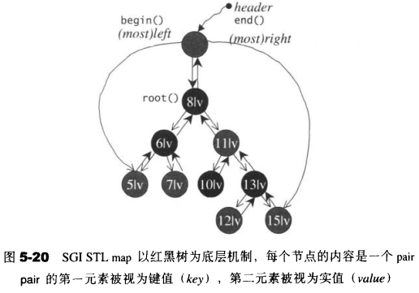

**pair的定义**：

```c++
//<stl_pair.h>
template <class T1, class T2>
struct pair {
  typedef T1 first_type;
  typedef T2 second_type;

  T1 first; //注意，它是public
  T2 second; //注意，它是public
  pair() : first(T1()), second(T2()) {}
  pair(const T1& a, const T2& b) : first(a), second(b) {}
};
```

**map定义**：

```c++
template <class Key, class T, class Compare = less<Key>, class Alloc = alloc>
class map {
public:
  typedef Key key_type;     //键值类型
  typedef T data_type;      //实值类型
  typedef T mapped_type;    
  typedef pair<const Key, T> value_type;    //键值对，RB-tree节点中的value类型
  typedef Compare key_compare;  //键值比较函数

  //...

private:
  /*
  select1st<value_type>是RB-tree中使用的KeyofValue
  */
  typedef rb_tree<key_type, value_type, 
                  select1st<value_type>, key_compare, Alloc> rep_type;
  rep_type t;  // 内含一棵RB-tree，使用RB-tree来表现map
public:
  //...
  //迭代器和set不同，允许修改实值
  typedef typename rep_type::iterator iterator;
  ...

  //下标操作
  T& operator[](const key_type& k) {
    return (*((insert(value_type(k, T()))).first)).second;
  }

  //插入操作，使用的是RB-tree的insert_unique()
  pair<iterator,bool> insert(const value_type& x) { return t.insert_unique(x); }

  //...
};
```

**[map相关操作](STL/map-相关操作.md)**

- 所有的map的操作行为，RB-tree都已提供，map只是转调用
- 插入操作调用的是RB-tree的insert_unique()

**insert()**：

- 返回值是一个pair，由一个迭代器和一个bool值组成，后者表示插入成功与否，成功的话前者即指向被插入的那个元素

```c++
  pair<iterator,bool> insert(const value_type& x) { return t.insert_unique(x); }
```

**operator[]**：

用法有两种：

- 左值：`simap[string("jjhou")] = 1;`
- 右值：`int number = simap[string("jjhou")];`

```c++
  T& operator[](const key_type& k) {
    return (*((insert(value_type(k, T()))).first)).second;
  }

//分解为：
//1.根据键值和实值做出一个元素，
//由于实值未知，所以T()产生一个与实值类型相同的临时对象代替，
value_type(k, T())
//2.把这个元素插入到map里面去，
//返回一个pair，第一个元素指向插入妥当的新元素，
//或指向插入失败点（键值重复）的旧元素
//如果作为左值，以此“实值待填”的元素将位置卡好
//如果作为右值，此时的插入操作返回的pair的第一个元素（迭代器）指向键值符合的旧元素
insert(value_type(k, T()))
//3.取出pair的第一个元素，这是一个迭代器，指向被插入的元素
(insert(value_type(k, T()))).first
//4.解引用迭代器，获得一个map元素，是一个由键值和实值组成的pair
*(insert(value_type(k, T()))).first
//5.取map元素pair的第二个元素
(*(insert(value_type(k, T()))).first).second
//6.最后以T& 引用传递方式传回
```

## 5.5 multiset

multiset的特性及用法和set完全相同，唯一的差别在于它允许键值重复，插入操作采用的是底层机制RB-tree的insert_equal()而非insert_unique() 

## 5.6 multimap

multimap的特性及用法和map完全相同，唯一的差别在于它允许键值重复，插入操作采用的是底层机制RB-tree的insert_equal()而非insert_unique() 

## 5.7 hashtable


