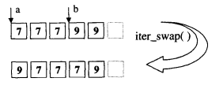
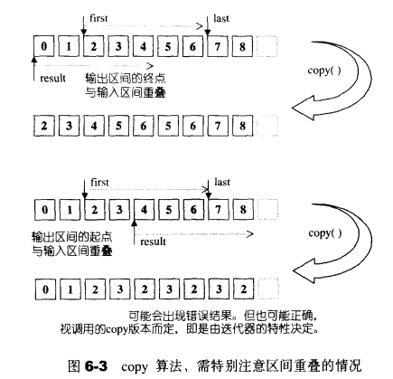
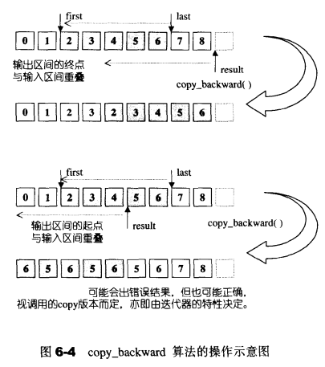
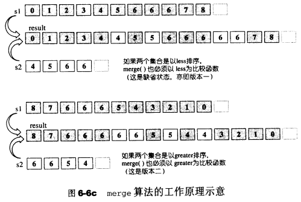
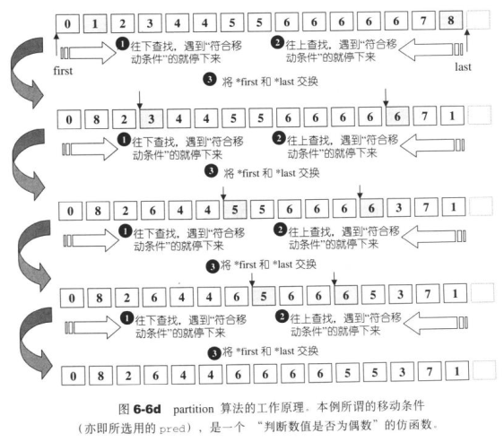
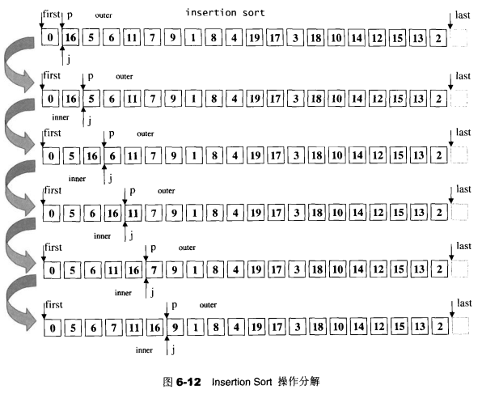
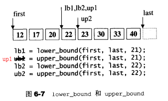

# 第6章 算法

所有的STL算法都作用在由迭代器[first,last)所标出来的区间上

**质变算法**（mutating algorithms）：运算过程中会更改区间内（迭代器所指）的元素的内容

**非质变算法**（nomutating algorithms）：运算过程中不会改变区间内（迭代器所指）的元素内容

表格中凡是不在STL标准规格之列的SGI专属算法，都以*加以标示


### 6.1.5 STL算法的一般形式

**函数缺省行为**：

许多STL算法不只支持一个版本：这一类算法的某个版本采用缺省运算行为，另一个版本提供额外参数，接受外界传入一个仿函数，以便采用其他策略。有两种形式：

- 重载函数：例如unique()
- 不同名称的函数：使用非缺省行为的版本一般以`_if`结尾，如`find_if()`

**质变算法的原地算法**：

- in-place（就地进行）版：就地改变操作对象
- copy（另地进行）版：将操作对象的内容复制一份副本，然后再副本上进行修改并返回该副本。copy版总是以`_copy`结尾，如`replace()_copy()`

但并不是所有质变算法都有copy版本，例如sort()就没有，如果希望“无copy版本”的算法实施于某一段区间元素的副本身上，调用函数前需自行制作副本，并以副本调用函数

**算法位置**

- 数值算法：实现于SGI的`<stl_numeric.h>`，是内部文件。STL规定用户必须包含的是上层的`<numeric>`
- 其他算法：实现于SGI的`<stl_algobase.h>`（基本算法）和`<stl_algo.h>`（其他算法），是内部文件。STL规定用户必须包含的是上层的`<algorithm>`

## 6.3 数值算法 <stl_numeric.h>

### 6.3.2 accumulate

accumulate用来计算init和[first,last)内所有元素的和

**例子**：

```c++
int ia[5] = { 1, 2, 3, 4, 5 };
vector<int> iv(ia, ia+5);

//结果为15，即0+1+2+3+4+5=15
accumulate(iv.begin(), iv.end(), 0);

//结果为-15，即0-1-2-3-4-5=-15
accumulate(iv.begin(), iv.end(), 0, minus<int>());
```

**源码分析**：

```c++
template <class InputIterator, class T>
T accumulate(InputIterator first, InputIterator last, T init) {
  for ( ; first != last; ++first)
    init = init + *first;
  return init;
}

template <class InputIterator, class T, class BinaryOperation>
T accumulate(InputIterator first, InputIterator last, T init,
             BinaryOperation binary_op) {
  for ( ; first != last; ++first)
    init = binary_op(init, *first);
  return init;
}
```

## 6.4 基本算法 

定义于`<stl_algobase.h>`

### 6.4.1 equal() 

如果两个序列在[first,last)区间内相等，equal返回true

前提：两个序列个数相等

```c++
template <class InputIterator1, class InputIterator2>
inline bool equal(InputIterator1 first1, InputIterator1 last1,
		  InputIterator2 first2) {
  for ( ; first1 != last1; ++first1, ++first2)
    if (*first1 != *first2)
      return false;
  return true;
}

template <class InputIterator1, class InputIterator2, class BinaryPredicate>
inline bool equal(InputIterator1 first1, InputIterator1 last1,
		  InputIterator2 first2, BinaryPredicate binary_pred) {
  for ( ; first1 != last1; ++first1, ++first2)
    if (!binary_pred(*first1, *first2))
      return false;
  return true;
}
```

### 6.4.2 fill()

将[first,last)内的所有元素改填新值

```c++
template <class ForwardIterator, class T>
void fill(ForwardIterator first, ForwardIterator last, const T& value) {
  for ( ; first != last; ++first)
    *first = value;
}
```

### 6.4.3 fill_n()

将[first,last)内的前n个元素改填新值，返回的迭代器指向被填入的最后一个元素的下一个位置

```c++
template <class OutputIterator, class Size, class T>
OutputIterator fill_n(OutputIterator first, Size n, const T& value) {
  for ( ; n > 0; --n, ++first)
    *first = value;
  return first;
}
```

### 6.4.4 iter_swap()

将两个ForwardIterator所指向的对象对调



```c++
template <class ForwardIterator1, class ForwardIterator2>
inline void iter_swap(ForwardIterator1 a, ForwardIterator2 b) {
  __iter_swap(a, b, value_type(a));
}

template <class ForwardIterator1, class ForwardIterator2, class T>
inline void __iter_swap(ForwardIterator1 a, ForwardIterator2 b, T*) {
  T tmp = *a;
  *a = *b;
  *b = tmp;
}

template <class Iterator>
inline typename iterator_traits<Iterator>::value_type*
value_type(const Iterator&) {
  return static_cast<typename iterator_traits<Iterator>::value_type*>(0);
}
```

### 6.4.5 max()

取两个对象中的较大值

```c++
template <class T>
inline const T& max(const T& a, const T& b) {
  return  a < b ? b : a;
}

template <class T, class Compare>
inline const T& max(const T& a, const T& b, Compare comp) {
  return comp(a, b) ? b : a;
}
```

### 6.4.6min()

取两个对象中的较小值

```c++
template <class T>
inline const T& min(const T& a, const T& b) {
  return b < a ? b : a;
}

template <class T, class Compare>
inline const T& min(const T& a, const T& b, Compare comp) {
  return comp(b, a) ? b : a;
}
```

### 6.4.7 swap()

交换两个对象的内容

```c++
template <class T>
inline void swap(T& a, T& b) {
  T tmp = a;
  a = b;
  b = tmp;
}
```

### 6.4.8 copy()

SGI STL的copy算法用尽各种办法，包括函数重载、类型特性、偏特化等编程技巧来尽可能地加强效率


copy将输入区间`[first,last)`内的元素复制到输出区间`[result,result+(last-first))`内，也就是说，它会执行赋值操作`*result = *first,*(result+1) = *(first+1),...`依次类推。返回一个迭代器：`result+(last-first)`。copy对其template参数所要求的条件非常宽松。其输入区间只需由inputIterators构成即可，输出区间只需要由OutputIterator构成即可。这**意味着可以使用copy算法，将任何容器的任何一段区间的内容，复制到任何容器的任何一段区间上** 



**重叠问题**：如果输出区间的起点位于输入区间内，copy算法便**可能**会在输入区间的（某些）元素尚未被复制之前，就覆盖其值，导致错误。如果copy算法的迭代器决定调用memmove()来执行任务，就不会造成上述错误。因为memmove()会将整个输入区间的内容复制下来，没有被覆盖的危险

**空容器copy问题**：copy会为输出区间内的元素赋予新值，而不是产生新的元素。它不能改变输出区间的迭代器个数。换句话说，copy不能直接用来将元素插入空容器中。如果想将元素插入序列之内，要么使用序列容器的insert成员函数，要么使用copy算法并搭配insert_iterator 

> **copy()函数**

有三个版本：

- 1.完全泛化版本
  - **__copy_dispatch()**
- 2.针对原生指针const char*的特化版本
  - **memmove()**
- 3.针对原生指针const wchar_t*的特化版本
  - **memmove()**

```c++
//1.完全泛化版本
template <class InputIterator, class OutputIterator>
inline OutputIterator copy(InputIterator first, InputIterator last,
                           OutputIterator result)
{
  return __copy_dispatch<InputIterator,OutputIterator>()(first, last, result);
}

//针对原生指针const char*的特化版本（memmove）
inline char* copy(const char* first, const char* last, char* result) {
  memmove(result, first, last - first);
  return result + (last - first);
}

//3.针对原生指针const wchar_t*的特化版本（memmove）
inline wchar_t* copy(const wchar_t* first, const wchar_t* last,
                     wchar_t* result) {
  memmove(result, first, sizeof(wchar_t) * (last - first));
  return result + (last - first);
}
```

> **__copy_dispatch()**

有三个版本：

- 1.完全泛化版本
  - __copy(）（InputIterator版本）：以迭代器等同于否，决定循环是否继续，效率低
  - __copy(）（RandomAccessIterator版本）
    - __copy_d()：以n决定循环的次数，效率快
- 2.指针对两个参数都是`T*`指针形式的偏特化版本
  - __copy_t()(无用赋值操作符版)
    - memmove()
  - __copy_t()(有用赋值操作符版)
    - __copy_d()
- 3.针对第一个参数为`const T*`指针形式，第二个参数为`T*`指针形式的偏特化版本
  - __copy_t()(无用赋值操作符版)
    - memmove()
  - __copy_t()(有用赋值操作符版)
    - __copy_d()

```c++
//1.完全泛化版本
template <class InputIterator, class OutputIterator>
struct __copy_dispatch
{
  OutputIterator operator()(InputIterator first, InputIterator last,
                            OutputIterator result) {
    return __copy(first, last, result, iterator_category(first));
  }
};

//2.指针对两个参数都是T*指针形式的偏特化版本
template <class T>
struct __copy_dispatch<T*, T*>
{
  T* operator()(T* first, T* last, T* result) {
    typedef typename __type_traits<T>::has_trivial_assignment_operator t; 
    return __copy_t(first, last, result, t());
  }
};

//3.针对第一个参数为const T*指针形式，第二个参数为T*指针形式的偏特化版本
template <class T>
struct __copy_dispatch<const T*, T*>
{
  T* operator()(const T* first, const T* last, T* result) {
    typedef typename __type_traits<T>::has_trivial_assignment_operator t; 
    return __copy_t(first, last, result, t());
  }
};
```

> **__copy(）函数**

```c++
//InputIterator版本
template <class InputIterator, class OutputIterator>
inline OutputIterator __copy(InputIterator first, InputIterator last,
                             OutputIterator result, input_iterator_tag)
{
  //以迭代器等同于否，决定循环是否继续，效率低
  for ( ; first != last; ++result, ++first)
    *result = *first;
  return result;
}

//RandomAccessIterator版本
template <class RandomAccessIterator, class OutputIterator>
inline OutputIterator 
__copy(RandomAccessIterator first, RandomAccessIterator last,
       OutputIterator result, random_access_iterator_tag)
{
  return __copy_d(first, last, result, distance_type(first));
}
```

> **__copy_t()函数**：

```c++
//无用赋值操作符版
template <class T>
inline T* __copy_t(const T* first, const T* last, T* result, __true_type) {
  memmove(result, first, sizeof(T) * (last - first));
  return result + (last - first);
}

//有用赋值操作符版
template <class T>
inline T* __copy_t(const T* first, const T* last, T* result, __false_type) {
  return __copy_d(first, last, result, (ptrdiff_t*) 0);
}
```

> **__copy_d()函数**

```c++
template <class RandomAccessIterator, class OutputIterator, class Distance>
inline OutputIterator
__copy_d(RandomAccessIterator first, RandomAccessIterator last,
         OutputIterator result, Distance*)
{
  for (Distance n = last - first; n > 0; --n, ++result, ++first) 
    *result = *first;
  return result;
}
```

### 6.4.9 copy_backward() 

copy_backward将`[first,last)`区间的每一个元素，以逆行的方向复制到以result-1为起点，方向亦为逆行的区间上。换句话说，copy_backward算法会执行赋值操作`*(result-1) = *(last - 1),*(result-2) = *(last - 2),...`以此类推，返回一个迭代器：`result-(last-first)` 



## 6.5 Set相关算法

STL提供了四种与set相关的算法：并集、交集、差集、对称差集

**要求**：排序区间。因此以hashtable为底层地址的hash_set无法使用这四个算法

> **set_union()**

set_union()可构造S1、S2的并集，即`S1 ∪ S2`，此集合内含S1或S2的每一个元素

S1、S2及并集都是以排序区间表示

返回值为迭代器，指向输出区间的尾端

每个元素都不需要唯一，如果某个值在S1中出现n次，在S2中出现m次，那么该值在输出区间中会出现`max(m,n)`次

> **set_intersection()**

set_intersection()可构造S1、S2的交集，即`S1 ∩ S2`，此集合内含同时出现于S1和S2的每一个元素

S1、S2及并集都是以排序区间表示

返回值为迭代器，指向输出区间的尾端

每个元素都不需要唯一，如果某个值在S1中出现n次，在S2中出现m次，那么该值在输出区间中会出现`min(m,n)`次

> **set_difference()**

set_difference()可构造S1、S2的交集，即`S1 - S2`，此集合内含出现于S1但不出现于S2的每一个元素

S1、S2及并集都是以排序区间表示

返回值为迭代器，指向输出区间的尾端

每个元素都不需要唯一，如果某个值在S1中出现n次，在S2中出现m次，那么该值在输出区间中会出现`max(n-m,0)`次

> **set_symmetirc_difference()**

set_symmetirc_difference()可构造S1、S2的交集，即`(S1 - S2) ∪ (S2 - S1)`，此集合内含"出现于S1但不出现于S2"以及“出现于S2但不出现于S1”的每一个元素

S1、S2及并集都是以排序区间表示

返回值为迭代器，指向输出区间的尾端

每个元素都不需要唯一，如果某个值在S1中出现n次，在S2中出现m次，那么该值在输出区间中会出现`|n-m|`次

## 6.7 其他算法

定义于`<stl_algo.h>`

### 6.7.1 merge()

应用于有序区间

**作用**：将两个经过排序的集合S1和S2合并起来置于另一段空间。所得结果也是一个有序序列

**返回值**：返回一个迭代器，指向最后结果序列的最后一个元素的下一个位置

```c++
//版本1
template <class InputIterator1, class InputIterator2, class OutputIterator>
OutputIterator merge(InputIterator1 first1, InputIterator1 last1,
                     InputIterator2 first2, InputIterator2 last2,
                     OutputIterator result) {
  while (first1 != last1 && first2 != last2) {
    if (*first2 < *first1) {
      *result = *first2;
      ++first2;
    }
    else {
      *result = *first1;
      ++first1;
    }
    ++result;
  }
  //最后剩余元素以copy复制到目的端，以下两个序列一定至少有一个为空
  return copy(first2, last2, copy(first1, last1, result));
}

//版本2，使用comp进行比较
template <class InputIterator1, class InputIterator2, class OutputIterator,
          class Compare>
OutputIterator merge(InputIterator1 first1, InputIterator1 last1,
                     InputIterator2 first2, InputIterator2 last2,
                     OutputIterator result, Compare comp) {
  while (first1 != last1 && first2 != last2) {
    if (comp(*first2, *first1)) {
      *result = *first2;
      ++first2;
    }
    else {
      *result = *first1;
      ++first1;
    }
    ++result;
  }
  return copy(first2, last2, copy(first1, last1, result));
}
```



### 6.7.2 partition

partition会将区间[first,last)中的元素重新排序。所有被一元条件运算pred判定为true的元素，都会被放在区间的前段，被判定为false的元素都会被放在区间的后段。该算法不保证元素的原始相对位置。如果需要保持相对位置，调用stable_partition

```c++
template <class BidirectionalIterator, class Predicate>
BidirectionalIterator partition(BidirectionalIterator first,
                                BidirectionalIterator last, Predicate pred) {
  while (true) {
    while (true)
      if (first == last)
        return first;
      else if (pred(*first))
        ++first;
      else
        break;
    --last;
    while (true)
      if (first == last)
        return first;
      else if (!pred(*last))
        --last;
      else
        break;
    iter_swap(first, last);
    ++first;
  }
}
```



### 6.7.3 remove()

**作用**：移除[first,last)之中所有与value相等的元素，并不真正从容器中删除那些元素（容器大小并不改变），而是将每一个不与value相等的元素轮番赋值给first之后的空间

**返回值**：ForwardIterator标示出重新整理后的最后元素的下一个位置

**例子**：{0,1,0,2,0,3,0,4}-->remove(0)--->{1,2,3,4,0,3,0,4}，返回值ForwardIterator指向第5个位置

对于array不适合remove()，而应使用remove_copy()

```c++
template <class ForwardIterator, class T>
ForwardIterator remove(ForwardIterator first, ForwardIterator last,
                       const T& value) {
  first = find(first, last, value); //找到第1个相等元素
  ForwardIterator next = first;
  //原地利用remove_copy()
  return first == last ? first : remove_copy(++next, last, first, value);
}
```

### 6.7.4 remove_copy()

**作用**：移除[first,last)区间内所有与value相等的元素。不真正从容器中删除那些元素（原容器大小没有改变），而是将结果赋值到一个以result标示其实位置的容器身上（新容器与原容器可以重叠）

**返回值**：OutputIterator指出被复制的最后元素的下一个位置

```c++
template <class InputIterator, class OutputIterator, class T>
OutputIterator remove_copy(InputIterator first, InputIterator last,
                           OutputIterator result, const T& value) {
  for ( ; first != last; ++first)
    if (*first != value) {
      *result = *first;
      ++result;
    }
  return result;
}
```

### 6.7.5 replace()

**作用**：将[first,last)区间内的所有old_value都以new_value取代

```c++
template <class ForwardIterator, class T>
void replace(ForwardIterator first, ForwardIterator last, const T& old_value,
             const T& new_value) {
  for ( ; first != last; ++first)
    if (*first == old_value) *first = new_value;
}
```

### 6.7.6 reverse()

**作用**：将序列[first,last)的元素在原容器中颠倒重排

为双向迭代器和随机迭代器设计了不同版本

```c++
//分派函数
template <class BidirectionalIterator>
inline void reverse(BidirectionalIterator first, BidirectionalIterator last) {
  __reverse(first, last, iterator_category(first));
}

//双向迭代器版本
template <class BidirectionalIterator>
void __reverse(BidirectionalIterator first, BidirectionalIterator last, 
               bidirectional_iterator_tag) {
  while (true)
    if (first == last || first == --last)
      return;
    else
      iter_swap(first++, last);
}

//随机迭代器版本
template <class RandomAccessIterator>
void __reverse(RandomAccessIterator first, RandomAccessIterator last,
               random_access_iterator_tag) {
  //只有随机迭代器才能做到 first < last 判断
  while (first < last) iter_swap(first++, --last);
}
```

### 6.7.7 search()

**作用**：在序列一[first1,last1)中查找序列二[first2,last2)的首次出现点

**返回值**：如果序列一内部存在于序列二完全匹配的子序列，返回迭代器last1

```c++
template <class ForwardIterator1, class ForwardIterator2>
inline ForwardIterator1 search(ForwardIterator1 first1, ForwardIterator1 last1,
                               ForwardIterator2 first2, ForwardIterator2 last2)
{
  return __search(first1, last1, first2, last2, distance_type(first1),
                  distance_type(first2));
}

template <class ForwardIterator1, class ForwardIterator2,
          class BinaryPredicate, class Distance1, class Distance2>
ForwardIterator1 __search(ForwardIterator1 first1, ForwardIterator1 last1,
                          ForwardIterator2 first2, ForwardIterator2 last2,
                          BinaryPredicate binary_pred, Distance1*, Distance2*) {
  Distance1 d1 = 0;
  distance(first1, last1, d1);
  Distance2 d2 = 0;
  distance(first2, last2, d2);

  if (d1 < d2) return last1;

  ForwardIterator1 current1 = first1;
  ForwardIterator2 current2 = first2;

  while (current2 != last2)
    if (binary_pred(*current1, *current2)) {
      ++current1;
      ++current2;
    }
    else {
      if (d1 == d2)
        return last1;
      else {
        current1 = ++first1;
        current2 = first2;
        --d1;
      }
    }
  return first1;
}
```

### 6.7.8 sort()

**要求**：算法接受两个RandomAccessIterators

**不可用容器**

- 1.所有以RB-tree为底层结构的关系型容器（有自动排序功能，不需要）
- 2.stack、queue、priority-queue有特别的出口，不允许对元素排序
- 3.list的迭代器为BidirectionalIterators，对其排序使用其类成员函数sort
- 4.slist的迭代器为ForwordIterators，对其排序使用其类成员函数sort

**可用容器**：vector、deque

**sort的大致思想**：

- 1.数据量大时，Quick Sort，分段递归排序
- 2.在`1.`的分段递归排序中，如果**数据量**小于某个阈值，改用Insertion Sort
- 3.在`1.`的分段递归排序中，如果**递归层次**过深，改用Heap Sort

> **Insert Sort**

时间复杂度：O(N^2)

数据量很少时，效果较好（避免Quick Sort的递归调用带来过大的额外负担）



> **Quick Sort**

Quick Sort是目前已知最快的排序算法，平均复杂度为O(NlogN)，最坏情况O(N^2)

**Quick Sort算法的思想**：（假设S代表被处理的序列）

- 1.如果S的元素个数为0或1，结束
- 2.取S中的任何一个元素，当作枢轴（pivot）v
- 3.将S分隔为L、R两段，使L内的每一个元素都小于或等于v，R内的每一个元素都大于或等于v
- 4.对L、R递归使用Quick Sort

**Quck Sort的精神**：将大区间分隔为小区间，分段排序。因此最坏情况发生在分割时产生出一个空的子空间，那就完全没有达到分割的预期效果

**Median-of-Three（三点中值）**：枢轴值最理想文档的方式是取整个序列的头、尾、中央三个位置的 元素，以其中值作为枢轴，这种做法称为“Median-of-Three Partition”或"Median-of-Three-QuicSort"。为了能够快速取得中央位置的元素，迭代器必须为RandomAccessIterators

**Partitioning（分割）**最有成效的方法：

- 1.令头端迭代器first向尾部移动，尾部迭代器向头部移动
- 2.当*first大于或等于枢轴时就停下来
- 3.当*last小于或等于枢轴时就停下来
- 4.检查两个迭代器是否交错
  - 不交错，将两者元素互换，然后各自调整一个位置（向中央逼近），继续相同的行为
  - 交错，表示整个序列已经调整完毕，以first为轴，分为左右两段

> **threshold（阈值）**

究竟多小的序列才应该改用Insertion Sort，并无定论，5~20可能导致差不多的结果，实际的最佳值因设备而异

> **final Insertion sort**

令某个大小以下的序列滞留在“几近排序但尚未完成”的状态，最后再以一次Insertion Sort将所有这些“几近排序但尚未竟全功”的子序列做一次完整的排序，其效率一般认为会比“将所有子序列彻底排序”更好

> **introsort**

Introspective Sorting（内省式排序），简称**introsort**

**思想**：

- 1.大部分情况与"Median-of-Three-QuicSort"完全相同
- 2.当分割行为有恶化为二次行为的倾向时，能够自我检测，转而改用Heap Sort

**效率**：效率维持在Heap Sort的O(NlogN)，又比一开始就使用Heap Sort来得好

### 6.7.9 for_each()

```c++
template <class InputIterator, class Function>
Function for_each(InputIterator first, InputIterator last, Function f) {
  for ( ; first != last; ++first)
    f(*first);
  return f;
}
```

### 6.7.10 lower_bound() 和 upper_bound()

应用于有序区间

二分查找的一种版本

**lower_bound 作用**：试图在已排序的[first,last)中寻找元素value。如果[first,last)具有与value相等的元素，便返回一个迭代器，指向其中第一个元素。如果没有这样的元素，返回“假设这样的元素存在时应该出现的位置”，即一个“不小于value”的元素

**upper_bound 作用**：试图在已经排序的[first,last)中寻找元素value。它返回“在不破坏顺序的情况下，可插入value的最后一个合适位置”




