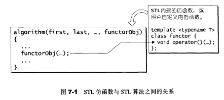

# 第7章 仿函数 函数对象 

## 7.1 仿函数概观

**仿函数**：又称函数对象，是指一种具有函数特质的对象。仿函数可以被调用者像函数一样地调用。在仿函数中以仿函数对象中所定义的`operator()`扮演函数的实质角色

**用途**：将整组操作当做算法的参数

函数指针也可以达到“将整组操作当做算法的参数”的效果，为什么还要仿函数？原因在于函数指针不能满足STL对抽象性的要求，也不能满足软件积木的要求---函数指针无法和STL其他组件（如配接器adapter）搭配，产生更灵活的变化

**使用例子**

```c++
//产生一个名为ig的对象
greater<int> ig;
//调用ig的operator()，并传入参数4和6
cout << ig(4,6);
//产生一个临时（无名）对象，并传入参数6和4
cout << greater<int>(6,4);
```

**STL仿函数与STL算法之间的关系**：



任何应用程序欲使用STL的内建仿函数，都必须含入`<functional>`头文件，SGI将它们实际定义于`<stl_function.h>`

## 7.2 可配接的关键

仿函数的相应类型主要用来表现函数**参数类型**和**传回值类型**。为了方便起见，`<stl_function.h>`定义了两个类，分别代表一元仿函数和二元仿函数（STL不支持三元仿函数），其中没有任何数据成员或成员函数，只有一些类型定义。任何仿函数按照需求继承其中一个类，便自动拥有相应类型，也就拥有了配接能力

- unary_function（一元）
- binary_function（二元）

> unary_function

```c++
template <class Arg, class Result>
struct unary_function {
    typedef Arg argument_type;
    typedef Result result_type;
};
```

一旦某个仿函数继承了unary_function，其用户便可以这样取得仿函数的各种相应类型

```c++
//该仿函数继承了unary_function
template <class T>
struct negate : public unary_function<T, T> {
    T operator()(const T& x) const { return -x; }
};

//该配接器使用了某个仿函数的参数类型
template <class Predicate>
class unary_negate
  : public unary_function<typename Predicate::argument_type, bool> {
protected:
  Predicate pred;
public:
  explicit unary_negate(const Predicate& x) : pred(x) {}
  bool operator()(const typename Predicate::argument_type& x) const {
    return !pred(x);
  }
};
```

> binary_function

```c++
template <class Arg1, class Arg2, class Result>
struct binary_function {
    typedef Arg1 first_argument_type;
    typedef Arg2 second_argument_type;
    typedef Result result_type;
};    
```

一旦某个仿函数继承了binary_function，其用户便可以这样取得仿函数的各种相应类型

```c++
//该仿函数继承了binary_function
template <class T>
struct plus : public binary_function<T, T, T> {
    T operator()(const T& x, const T& y) const { return x + y; }
};

//该配接器使用了某个仿函数的参数类型和返回值类型
template <class Operation> 
class binder1st
  : public unary_function<typename Operation::second_argument_type,
                          typename Operation::result_type> {
protected:
  Operation op;
  typename Operation::first_argument_type value;
public:
  binder1st(const Operation& x,
            const typename Operation::first_argument_type& y)
      : op(x), value(y) {}
  typename Operation::result_type
  operator()(const typename Operation::second_argument_type& x) const {
    return op(value, x); 
  }
};
```

## 7.6 证同、选择、投射

> 证同元素（identity element)

**运算op的证同元素**：数值A若与该元素做op运算，会得到自己。例如：加法的证同元素位0（因为任何元素加上0仍为自己），乘法的证同元素为1（因为任何元素乘以1仍为自己）

该函数并非STL标准规格的一员

```c++
template <class T> inline T identity_element(plus<T>) { return T(0); }

template <class T> inline T identity_element(multiplies<T>) { return T(1); }
```

>证同函数（identity function)

**证同函数**：任何数值通过该函数后，不会有任何改变

**使用例子**：`<stl_set.h>`中，用来指定RB-tree所需的KeyOfValue op，因为set元素的键值即实值

```c++
template <class T>
struct identity : public unary_function<T, T> {
  const T& operator()(const T& x) const { return x; }
};

```

> 选择函数（selection function)

选择函数有两个：

- **select1st()**：接受一个pair，传回其第一元素
  - 使用例子：运用于`<stl_map.h>`，用来指定RB-tree所需的KeyOfValue op
- **select2nd()**：接受一个pair，传回其第二个元素

```c++
template <class Pair>
struct select1st : public unary_function<Pair, typename Pair::first_type> {
  const typename Pair::first_type& operator()(const Pair& x) const
  {
    return x.first;
  }
};

template <class Pair>
struct select2nd : public unary_function<Pair, typename Pair::second_type> {
  const typename Pair::second_type& operator()(const Pair& x) const
  {
    return x.second;
  }
};
```

> 投射函数

投射函数有两个

```c++
//投射函数1：传回第一参数，忽略第二参数
template <class Arg1, class Arg2>
struct project1st : public binary_function<Arg1, Arg2, Arg1> {
  Arg1 operator()(const Arg1& x, const Arg2&) const { return x; }
};

//投射函数2：忽略第一参数，传回第二参数
template <class Arg1, class Arg2>
struct project2nd : public binary_function<Arg1, Arg2, Arg2> {
  Arg2 operator()(const Arg1&, const Arg2& y) const { return y; }
};
```

