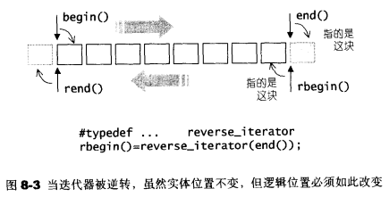
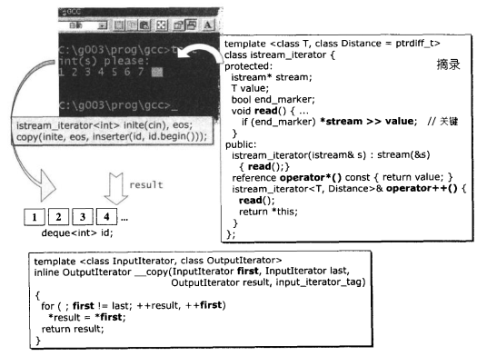
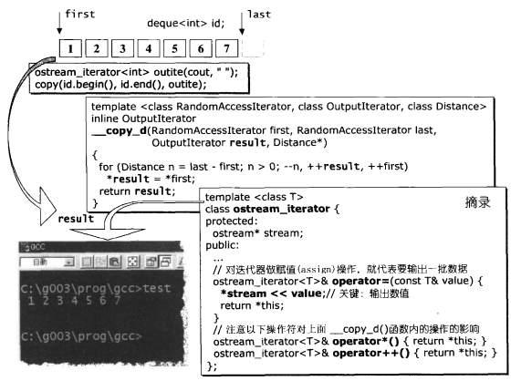
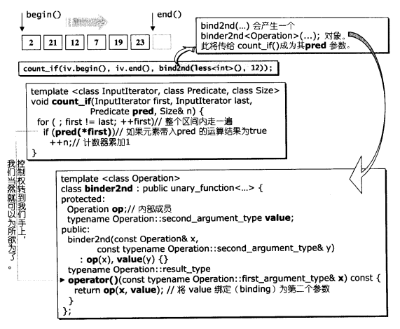
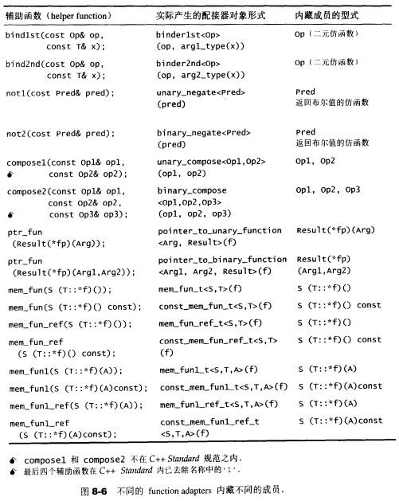
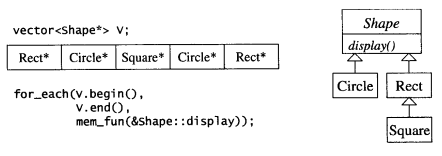

# 第8章 配接器

对adapter样式的定义：将一个class的接口转换为另一个class的接口，使其因接口不兼容而不能合作的classes,可以一起运作 

## 8.1 配接器的分类

- 函数配接器：改变仿函数接口
- 容器配接器：改变容器接口
  - queue和stack
- 迭代器配接器：改变迭代器接口

### 8.1.2 迭代器配接器

由`<iterator>`获取，SGI STL将它们实际定义与`<stl_iterator.h>`

迭代器配接器很少以迭代器为直接参数，其修饰功能只是一种观念上的改变（赋值操作变为插入操作、前进变后退、绑定到特殊装置等）

**分类**：

- insert iterator
- reverse iterator
- iostream iterator

>Insert Iterator

**Insert Iterator**：将一般迭代器的赋值操作转变为插入操作

**包括**：

- back_insert_iterator：尾端插入操作
- front_insert_iterator：头端插入操作
- insert_iterator：任意位置执行插入操作

由于三个iterator adapter接口不直观，STL提供了三个相应函数


> Reverse Iterator

**Reverse Iterator**：将一般迭代器的行进方向逆转，使原本应该前进的operator++变成后退操作，operator--变为前进操作

> IOStream Iterator

**IOStream Iterator**：将迭代器绑定到某个iostream对象上

**分类**：

- istream_iterator：绑定到istream对象（例如std::cin）身上的，拥有输入功能
- ostream_iterator：绑定到ostream对象（例如std::cout）身上的，拥有输出功能

> 例子


### 8.1.3 函数配接器

函数配接器操作包括bind、negate、compose、以及对一般函数或成员函数的修饰（使其成为一个仿函数）

函数配接器的接口由`<functional>`获得，SGI STL将其实际定义于`<stl_function.h>`

所有期望获得配接能力的组件，本身都必须是**可配接的**：

- 1.一元仿函数必须继承自unary_function
- 2.二元仿函数必须继承自binary_function
- 3.成员函数必须以mem_fun处理过
- 4.一般函数必须以ptr_fun处理过


## 8.3 迭代器配接器

### 8.3.1 insert iterators

**主要观念**：每个insert iterators内部维护一个容器（由用户传入）；当客户对insert iterators做赋值操作时，就在insert iterators中被转为对该容器的插入操作，即insert iterators的operator=操作中调用底层容器的push_front()、push_back()、insert()。而加加、减减、解引用和间接引用操作的功能都被关闭。因此类型被定义为**output_iterator_tag**

> **back_insert_iterator**

```c++
template <class Container>
class back_insert_iterator {
protected:
  Container* container;
public:
  typedef output_iterator_tag iterator_category;
  typedef void                value_type;
  typedef void                difference_type;
  typedef void                pointer;
  typedef void                reference;

  explicit back_insert_iterator(Container& x) : container(&x) {}
  back_insert_iterator<Container>&
  operator=(const typename Container::value_type& value) { 
    container->push_back(value);
    return *this;
  }
  back_insert_iterator<Container>& operator*() { return *this; }
  back_insert_iterator<Container>& operator++() { return *this; }
  back_insert_iterator<Container>& operator++(int) { return *this; }
};

//辅助函数
template <class Container>
inline back_insert_iterator<Container> back_inserter(Container& x) {
  return back_insert_iterator<Container>(x);
}
```

> **front_insert_iterator**

```c++
template <class Container>
class front_insert_iterator {
protected:
  Container* container;
public:
  typedef output_iterator_tag iterator_category;
  typedef void                value_type;
  typedef void                difference_type;
  typedef void                pointer;
  typedef void                reference;

  explicit front_insert_iterator(Container& x) : container(&x) {}
  front_insert_iterator<Container>&
  operator=(const typename Container::value_type& value) { 
    container->push_front(value);
    return *this;
  }
  front_insert_iterator<Container>& operator*() { return *this; }
  front_insert_iterator<Container>& operator++() { return *this; }
  front_insert_iterator<Container>& operator++(int) { return *this; }
};

//辅助函数
template <class Container>
inline front_insert_iterator<Container> front_inserter(Container& x) {
  return front_insert_iterator<Container>(x);
}
```

> **insert_iterator**

```c++
template <class Container>
class insert_iterator {
protected:
  Container* container;
  typename Container::iterator iter;
public:
  typedef output_iterator_tag iterator_category;
  typedef void                value_type;
  typedef void                difference_type;
  typedef void                pointer;
  typedef void                reference;

  insert_iterator(Container& x, typename Container::iterator i) 
    : container(&x), iter(i) {}
  insert_iterator<Container>&
  operator=(const typename Container::value_type& value) { 
    iter = container->insert(iter, value);
    ++iter;
    return *this;
  }
  insert_iterator<Container>& operator*() { return *this; }
  insert_iterator<Container>& operator++() { return *this; }
  insert_iterator<Container>& operator++(int) { return *this; }
};

//辅助函数
template <class Container, class Iterator>
inline insert_iterator<Container> inserter(Container& x, Iterator i) {
  typedef typename Container::iterator iter;
  return insert_iterator<Container>(x, iter(i));
}
```

### 8.3.2 reverse iterators

实现了rbegin()和rend()函数的容器，实际上这两个函数都是使用的reverse iterators

```c++
template <class T, class Alloc = alloc>
class vector {
  reverse_iterator rbegin() { return reverse_iterator(end()); }
  const_reverse_iterator rbegin() const { 
    return const_reverse_iterator(end()); 
  }
};
```

"正向迭代器“与”与其相应的逆向迭代器“取出的元素不同，主要是为了配合迭代器区间的”前闭后开“习惯



```c++
template <class Iterator>
class reverse_iterator 
{
protected:
  Iterator current;  //记录对应的正向迭代器
public:
  typedef typename iterator_traits<Iterator>::iterator_category
          iterator_category;
  typedef typename iterator_traits<Iterator>::value_type
          value_type;
  typedef typename iterator_traits<Iterator>::difference_type
          difference_type;
  typedef typename iterator_traits<Iterator>::pointer
          pointer;
  typedef typename iterator_traits<Iterator>::reference
          reference;

  typedef Iterator iterator_type;  //代表正向迭代器
  typedef reverse_iterator<Iterator> self;  //代表逆向迭代器

public:
  reverse_iterator() {}
  //以下两个构造函数将reverse iterator与某个迭代器x系起来
  explicit reverse_iterator(iterator_type x) : current(x) {}
  reverse_iterator(const self& x) : current(x.current) {}
  
  //取出对应的正向迭代器
  iterator_type base() const { return current; }
  //对逆向迭代器取址，就是将“对应的正向迭代器”后退一格而取值
  reference operator*() const {
    Iterator tmp = current;
    return *--tmp;
  }

  pointer operator->() const { return &(operator*()); }

  self& operator++() {
    --current;
    return *this;
  }
  self operator++(int) {
    self tmp = *this;
    --current;
    return tmp;
  }
  self& operator--() {
    ++current;
    return *this;
  }
  self operator--(int) {
    self tmp = *this;
    ++current;
    return tmp;
  }

  self operator+(difference_type n) const {
    return self(current - n);
  }
  self& operator+=(difference_type n) {
    current -= n;
    return *this;
  }
  self operator-(difference_type n) const {
    return self(current + n);
  }
  self& operator-=(difference_type n) {
    current += n;
    return *this;
  }
  //第一个*和唯一一个+都调用本类的operator*和operator+
  //第二个*根据处理的类型而定
  reference operator[](difference_type n) const { return *(*this + n); }  
}; 
```

### 8.3.3 stream iterators

> **istream iterators**

绑定一个istream object，其实就是在istream iterators内部维护一个istream member，客户对这个迭代器所做的operator++操作，会被导引调用迭代器内部内含的那个istream member的输入操作（operator >>）

该迭代器是Input Iterators，不具备operator--

**注意**：只要客户定义一个istream iterator并**绑定到某个istream object**，程序便立刻停止在`istream_iterator<T>::read()`函数，等待输入

```c++
template <class T, class Distance = ptrdiff_t> 
class istream_iterator {
  friend bool
  //__STL_NULL_TMPL_ARGS被定义为<>
  operator== __STL_NULL_TMPL_ARGS (const istream_iterator<T, Distance>& x,
                                   const istream_iterator<T, Distance>& y);
protected:
  //istream成员
  istream* stream;
  T value;
  bool end_marker;
  void read() {
    //stream是否读到eof,true表示没有，false表示读到eof
    end_marker = (*stream) ? true : false;
    if (end_marker) *stream >> value;
    end_marker = (*stream) ? true : false;
  }
public:
  typedef input_iterator_tag iterator_category;
  typedef T                  value_type;
  typedef Distance           difference_type;
  typedef const T*           pointer;
  typedef const T&           reference;

  //该构造函数可用于生产尾迭代器，istream_iterator<int> eos;
  istream_iterator() : stream(&cin), end_marker(false) {}
  //引发read(),程序停留在此
  //istream_iterator<int> initer(cin);
  istream_iterator(istream& s) : stream(&s) { read(); }
  reference operator*() const { return value; }
  pointer operator->() const { return &(operator*()); }
  
  //迭代器前进一个位置，代表要读一次
  istream_iterator<T, Distance>& operator++() { 
    read(); 
    return *this;
  }
  istream_iterator<T, Distance> operator++(int)  {
    istream_iterator<T, Distance> tmp = *this;
    read();
    return tmp;
  }
};
```



> **ostream iterators**

绑定一个ostream object，其实就是在ostream iterators内部维护一个ostream member，客户对这个迭代器所做的operator=操作，会被导引调用迭代器内部内含的那个istream member的输出操作（operator <<）

该迭代器是Output Iterators

```c++
template <class T>
class ostream_iterator {
protected:
  ostream* stream;  //ostream成员
  const char* string;  //每次输出后的间隔符
public:
  typedef output_iterator_tag iterator_category;
  typedef void                value_type;
  typedef void                difference_type;
  typedef void                pointer;
  typedef void                reference;

  ostream_iterator(ostream& s) : stream(&s), string(0) {}
  //用法：ostream_iterator<int> outiter(cout, ' '); 
  //输出至cout，每次间隔一空格
  ostream_iterator(ostream& s, const char* c) : stream(&s), string(c)  {}
  //对迭代器做赋值操作，就代表要输出一次
  ostream_iterator<T>& operator=(const T& value) { 
    *stream << value;  //先输出被赋予的数值
    if (string) *stream << string;  //如果间隔符号不为空，输出间隔符号
    return *this;
  }
  //注意以下三个操作
  ostream_iterator<T>& operator*() { return *this; }
  ostream_iterator<T>& operator++() { return *this; } 
  ostream_iterator<T>& operator++(int) { return *this; } 
};
```



## 8.4 function adapters

每个function adapters内藏了一个数据成员，其类型等同于它所要配接的对象（一个“可配接的仿函数”）

**例子**：



**function adpaters汇总**：



### 8.4.1 对返回值进行逻辑否定 not1 not2

- **not1**：对一个参数的仿函数的结果进行否定
- **not2**：对两个参数的仿函数的结果进行否定

> **not1**

```c++
//unary_negate配接器用来表示某个Adapter Predicate的逻辑负值
template <class Predicate>
class unary_negate
  : public unary_function<typename Predicate::argument_type, bool> {
protected:
  Predicate pred; //内部成员
public:
  explicit unary_negate(const Predicate& x) : pred(x) {}
  bool operator()(const typename Predicate::argument_type& x) const {
    return !pred(x);
  }
};

//辅助函数，利用模板函数的自动推断，使得我们得以方便使用unary_negate<Pred>
template <class Predicate>
inline unary_negate<Predicate> not1(const Predicate& pred) {
  return unary_negate<Predicate>(pred);
}
```

> **not2**

```c++
//binary_negate配接器用来表示某个Adapter Predicate的逻辑负值
template <class Predicate> 
class binary_negate 
  : public binary_function<typename Predicate::first_argument_type,
                           typename Predicate::second_argument_type,
                           bool> {
protected:
  Predicate pred; //内部成员
public:
  explicit binary_negate(const Predicate& x) : pred(x) {}
  bool operator()(const typename Predicate::first_argument_type& x, 
                  const typename Predicate::second_argument_type& y) const {
    return !pred(x, y); 
  }
};

//辅助函数，利用模板函数的自动推断，使得我们得以方便使用binary_negate<Pred>
template <class Predicate>
inline binary_negate<Predicate> not2(const Predicate& pred) {
  return binary_negate<Predicate>(pred);
}
```

### 8.4.2 对参数进行绑定 bind1st bind2nd

- **bind1st**：`bind1st(less<int>,12)`将12绑定为`less<int>`的第1个参数，即变成`less<int>(12,x)`，使用`bind1st(less<int>,12)`时只需传入第2个参数即可
- **bind2nd**：`bind2nd(less<int>,12)`将12绑定为`less<int>`的第2个参数，即变成`less<int>(x,12)`，使用`bind2nd(less<int>,12)`时只需传入第1个参数即可

> **bind1st** 

```c++
template <class Operation> 
class binder1st
  : public unary_function<typename Operation::second_argument_type,
                          typename Operation::result_type> {
protected:
  Operation op;
  typename Operation::first_argument_type value;
public:
  binder1st(const Operation& x,
            const typename Operation::first_argument_type& y)
      : op(x), value(y) {}
  typename Operation::result_type
  operator()(const typename Operation::second_argument_type& x) const {
    return op(value, x);  //将value绑定为参数1
  }
};

//辅助函数
template <class Operation, class T>
inline binder1st<Operation> bind1st(const Operation& op, const T& x) {
  typedef typename Operation::first_argument_type arg1_type;
  return binder1st<Operation>(op, arg1_type(x));
}
```

> **bind2nd**

```c++
template <class Operation> 
class binder2nd
  : public unary_function<typename Operation::first_argument_type,
                          typename Operation::result_type> {
protected:
  Operation op;
  typename Operation::second_argument_type value;
public:
  binder2nd(const Operation& x,
            const typename Operation::second_argument_type& y) 
      : op(x), value(y) {}
  typename Operation::result_type
  operator()(const typename Operation::first_argument_type& x) const {
    return op(x, value); //将value绑定为参数2
  }
};

//辅助函数
template <class Operation, class T>
inline binder2nd<Operation> bind2nd(const Operation& op, const T& x) {
  typedef typename Operation::second_argument_type arg2_type;
  return binder2nd<Operation>(op, arg2_type(x));
}
```

### 8.4.3 用于函数合成 compose1 compose2

本节的两个配接器并未纳入STL标准，是SGI STL的私产品

- **compose1**：已知两个可配接的单参数仿函数f()，g()，compose1用来产生一个h(),使`h(x) = f(g(x))`
- **compose2**：已知一个可匹配的双参数仿函数f和两个可配接的单参数仿函数g1，g2，compose2用来产生一个h(),使`h(x) = f(g1(x),g2(x))`

> **compose1**

```c++
template <class Operation1, class Operation2>
class unary_compose : public unary_function<typename Operation2::argument_type,
                                            typename Operation1::result_type> {
protected:
  Operation1 op1;  //内部成员
  Operation2 op2;  //内部成员
public:
  unary_compose(const Operation1& x, const Operation2& y) : op1(x), op2(y) {}
  typename Operation1::result_type
  //注意这里是op2的参数类型
  operator()(const typename Operation2::argument_type& x) const {
    return op1(op2(x)); 
  }
};

//辅助函数
template <class Operation1, class Operation2>
inline unary_compose<Operation1, Operation2> compose1(const Operation1& op1, 
                                                      const Operation2& op2) {
  return unary_compose<Operation1, Operation2>(op1, op2);
}
```

> **compose2**

```c++
template <class Operation1, class Operation2, class Operation3>
class binary_compose
  : public unary_function<typename Operation2::argument_type,
                          typename Operation1::result_type> {
protected:
  Operation1 op1;
  Operation2 op2;
  Operation3 op3;
public:
  binary_compose(const Operation1& x, const Operation2& y, 
                 const Operation3& z) : op1(x), op2(y), op3(z) { }
  typename Operation1::result_type
  //从这里可知op2和op3的参数类型必须相同
  operator()(const typename Operation2::argument_type& x) const {
    return op1(op2(x), op3(x));
  }
};

//辅助函数
template <class Operation1, class Operation2, class Operation3>
inline binary_compose<Operation1, Operation2, Operation3> 
compose2(const Operation1& op1, const Operation2& op2, const Operation3& op3) {
  return binary_compose<Operation1, Operation2, Operation3>(op1, op2, op3);
}
```

### 8.4.4 用于函数指针 ptr_fun

ptr_fun配接器使我们能够将一般函数当做仿函数使用

- `ptr_fun(Result (*x)(Arg))`将一元函数转换成一元仿函数
- `ptr_fun(Result (*x)(Arg1, Arg2))`将二元函数转换成二元仿函数

> **ptr_fun(Result (*x)(Arg))**

```c++
//以下配接器其实就是把一个一元函数指针包起来
//当仿函数被使用时，就调用该函数指针
template <class Arg, class Result>
class pointer_to_unary_function : public unary_function<Arg, Result> {
protected:
  Result (*ptr)(Arg);  //函数指针
public:
  pointer_to_unary_function() {}
  explicit pointer_to_unary_function(Result (*x)(Arg)) : ptr(x) {}
  //通过函数指针执行函数
  Result operator()(Arg x) const { return ptr(x); }
};

//辅助函数
template <class Arg, class Result>
inline pointer_to_unary_function<Arg, Result> ptr_fun(Result (*x)(Arg)) {
  //返回一个仿函数对象
  return pointer_to_unary_function<Arg, Result>(x);
}
```

> **ptr_fun(Result (*x)(Arg1, Arg2))**

```c++
//以下配接器其实就是把一个二元函数指针包起来
//当仿函数被使用时，就调用该函数指针
template <class Arg1, class Arg2, class Result>
class pointer_to_binary_function : public binary_function<Arg1, Arg2, Result> {
protected:
    Result (*ptr)(Arg1, Arg2);  //函数指针
public:
    pointer_to_binary_function() {}
    explicit pointer_to_binary_function(Result (*x)(Arg1, Arg2)) : ptr(x) {}
    //通过函数指针执行函数
    Result operator()(Arg1 x, Arg2 y) const { return ptr(x, y); }
};

template <class Arg1, class Arg2, class Result>
inline pointer_to_binary_function<Arg1, Arg2, Result> 
ptr_fun(Result (*x)(Arg1, Arg2)) {
  //返回一个仿函数对象
  return pointer_to_binary_function<Arg1, Arg2, Result>(x);
}
```

### 8.4.5 用于成员函数指针 mem_fun mem_fun_ref

这两种配接器使我们能够将成员函数当做仿函数使用

当容器元素的类型是X&或X*时，可以实现多态



该族群一个有8个仿函数

- 1.无任何参数 vs 有一个参数
- 2.通过指针调用 vs 通过引用调用
- 3.const成员函数 vs 非const成员函数

```c++
//1. 无任何参数 通过指针调用 非const成员函数
template <class S, class T>
class mem_fun_t : public unary_function<T*, S> {
public:
  explicit mem_fun_t(S (T::*pf)()) : f(pf) {}
  //通过指针调用
  S operator()(T* p) const { return (p->*f)(); }
private:
  S (T::*f)(); //无任何参数 非const成员函数
};

//2. 无任何参数 通过指针调用 const成员函数
template <class S, class T>
class const_mem_fun_t : public unary_function<const T*, S> {
public:
  explicit const_mem_fun_t(S (T::*pf)() const) : f(pf) {}
  //通过指针调用
  S operator()(const T* p) const { return (p->*f)(); }
private:
  S (T::*f)() const; //无任何参数 const成员函数
};

//3. 无任何参数 通过引用调用 非const成员函数
template <class S, class T>
class mem_fun_ref_t : public unary_function<T, S> {
public:
  explicit mem_fun_ref_t(S (T::*pf)()) : f(pf) {}
  //通过引用调用
  S operator()(T& r) const { return (r.*f)(); }
private:
  S (T::*f)(); //无任何参数 非const成员函数
};

//4. 无任何参数 通过引用调用 const成员函数
template <class S, class T>
class const_mem_fun_ref_t : public unary_function<T, S> {
public:
  explicit const_mem_fun_ref_t(S (T::*pf)() const) : f(pf) {}
  //通过引用调用
  S operator()(const T& r) const { return (r.*f)(); }
private:
  S (T::*f)() const; //无任何参数 const成员函数
};

//5. 有一个参数 通过指针调用 非const成员函数
template <class S, class T, class A>
class mem_fun1_t : public binary_function<T*, A, S> {
public:
  explicit mem_fun1_t(S (T::*pf)(A)) : f(pf) {}
  //通过指针调用
  S operator()(T* p, A x) const { return (p->*f)(x); }
private:
  S (T::*f)(A); //有一个参数 非const成员函数
};

//6. 有一个参数 通过指针调用 const成员函数
template <class S, class T, class A>
class const_mem_fun1_t : public binary_function<const T*, A, S> {
public:
  explicit const_mem_fun1_t(S (T::*pf)(A) const) : f(pf) {}
  //通过指针调用
  S operator()(const T* p, A x) const { return (p->*f)(x); }
private:
  S (T::*f)(A) const; //有一个参数 const成员函数
};

//7. 有一个参数 通过引用调用 非const成员函数
template <class S, class T, class A>
class mem_fun1_ref_t : public binary_function<T, A, S> {
public:
  explicit mem_fun1_ref_t(S (T::*pf)(A)) : f(pf) {}
  //通过引用调用
  S operator()(T& r, A x) const { return (r.*f)(x); }
private:
  S (T::*f)(A); //有一个参数 非const成员函数
};

//8. 有一个参数 通过引用调用 const成员函数
template <class S, class T, class A>
class const_mem_fun1_ref_t : public binary_function<T, A, S> {
public:
  explicit const_mem_fun1_ref_t(S (T::*pf)(A) const) : f(pf) {}
  //通过引用调用
  S operator()(const T& r, A x) const { return (r.*f)(x); }
private:
  S (T::*f)(A) const; //有一个参数 const成员函数
};
```

所有的复杂都只存在于仿函数内部，我们可以忽略它们，直接使用更上层的辅助函数mem_fun和mem_fun_ref

辅助函数：

```c++
template <class S, class T>
inline mem_fun_t<S,T> mem_fun(S (T::*f)()) { 
  return mem_fun_t<S,T>(f);
}

template <class S, class T>
inline const_mem_fun_t<S,T> mem_fun(S (T::*f)() const) {
  return const_mem_fun_t<S,T>(f);
}

template <class S, class T>
inline mem_fun_ref_t<S,T> mem_fun_ref(S (T::*f)()) { 
  return mem_fun_ref_t<S,T>(f);
}

template <class S, class T>
inline const_mem_fun_ref_t<S,T> mem_fun_ref(S (T::*f)() const) {
  return const_mem_fun_ref_t<S,T>(f);
}

template <class S, class T, class A>
inline mem_fun1_t<S,T,A> mem_fun1(S (T::*f)(A)) { 
  return mem_fun1_t<S,T,A>(f);
}

template <class S, class T, class A>
inline const_mem_fun1_t<S,T,A> mem_fun1(S (T::*f)(A) const) {
  return const_mem_fun1_t<S,T,A>(f);
}

template <class S, class T, class A>
inline mem_fun1_ref_t<S,T,A> mem_fun1_ref(S (T::*f)(A)) { 
  return mem_fun1_ref_t<S,T,A>(f);
}

template <class S, class T, class A>
inline const_mem_fun1_ref_t<S,T,A> mem_fun1_ref(S (T::*f)(A) const) {
  return const_mem_fun1_ref_t<S,T,A>(f);
}
```


