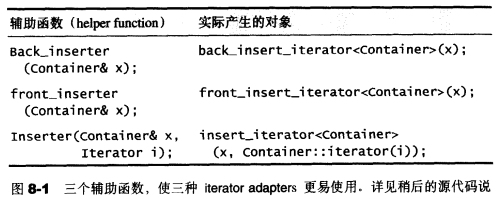
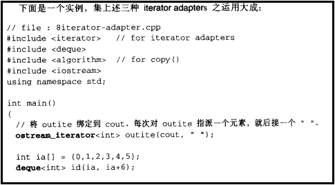
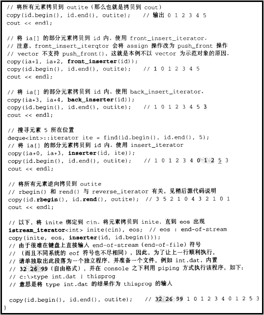
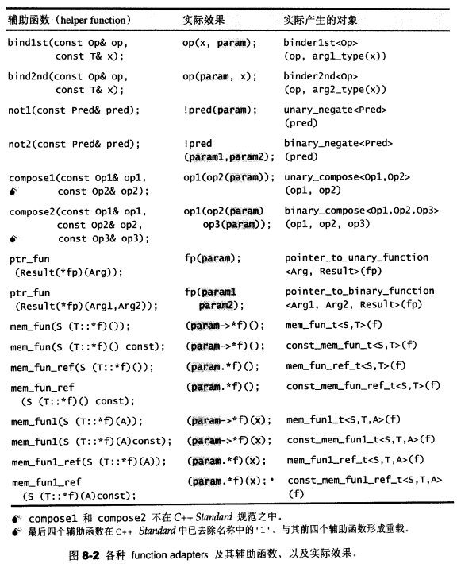

# 第8章 配接器

对adapter样式的定义：将一个class的接口转换为另一个class的接口，使其因接口不兼容而不能合作的classes,可以一起运作 

## 8.1 配接器的分类

- 函数配接器：改变仿函数接口
- 容器配接器：改变容器接口
  - queue和stack
- 迭代器配接器：改变迭代器接口

### 8.1.2 迭代器配接器

由`<iterator>`获取，SGI STL将它们实际定义与`<stl_iterator.h>`

迭代器配接器很少以迭代器为直接参数，其修饰功能只是一种观念上的改变（赋值操作变为插入操作、前进变后退、绑定到特殊装置等）

**分类**：

- insert iterator
- reverse iterator
- iostream iterator

>Insert Iterator

**Insert Iterator**：将一般迭代器的赋值操作转变为插入操作

**包括**：

- back_insert_iterator：尾端插入操作
- front_insert_iterator：头端插入操作
- insert_iterator：任意位置执行插入操作

由于三个iterator adapter接口不直观，STL提供了三个相应函数

> Reverse Iterator

**Reverse Iterator**：将一般迭代器的行进方向逆转，使原本应该前进的operator++变成后退操作，operator--变为前进操作

> IOStream Iterator

**IOStream Iterator**：将迭代器绑定到某个iostream对象上

**分类**：

- istream_iterator：绑定到istream对象（例如std::cin）身上的，拥有输入功能
- ostream_iterator：绑定到ostream对象（例如std::cout）身上的，拥有输出功能

> 例子

### 8.1.3 函数配接器

函数配接器操作包括bind、negate、compose、以及对一般函数或成员函数的修饰（使其成为一个仿函数）

函数配接器的接口由`<functional>`获得，SGI STL将其实际定义于`<stl_function.h>`

所有期望获得配接能力的组件，本身都必须是**可配接的**：

- 1.一元仿函数必须继承自unary_function
- 2.二元仿函数必须继承自binary_function
- 3.成员函数必须以mem_fun处理过
- 4.一般函数必须以ptr_fun处理过

## 8.3 迭代器配接器

