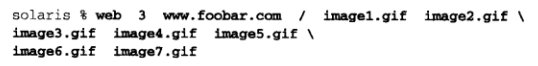

# 第16章 非阻塞式I/O

套接字的默认状态是**阻塞**的，当发出一个不能立即完成的套接字调用时，其进程被投入睡觉，等待相应操作完成

**非阻塞式IO**：


可能阻塞的**套接字调用**可分为以下4类： 

- **1.输入操作**：包括read、readv、recv、recvfrom和recvmsg 
  - **阻塞**：如果套接字的接收缓冲区中没有数据可读，进程将被投入睡眠，直到一些数据到达
    - TCP：只要有数据到达（单个字节或万兆的TCP分节），就唤醒进程。如果想要等到某个固定数目的数据为止，使用readn函数或指定MSG_WAITALL标志
    - UDP：只要有UDP数据报到达，就唤醒进程
  - **非阻塞**：如果输入操作不能被满足（TCP至少一个字节，UDP至少一个数据报），相应调用将立即返回一个EWOULDBLOCK错误 
- **2.输出操作**：包括write、writev、send、sendto和sendmsg 
  - **阻塞**： 如果套接字的发送缓冲区中没有空间，进程将被投入睡眠 （**仅对于TCP**）
    - **UDP**：输出函数调用将不会因**空间问题**阻塞，不过有可能因其他原因阻塞
  - **非阻塞**：如果发送缓存区中根本没空间，返回一个EWOULDBLOCK错误；如果有一些空间，返回值是内核能够复制到该缓冲区中的字节数，也称为”不足计数“ （**仅对于TCP**）
- **3.接受连接**：即accept函数
  - **阻塞**：如果尚无新的连接到达，调用进程将被投入睡眠 
  - **非阻塞**：如果尚无新的连接到达，调用将立即返回一个EWOULDBLOCK错误
- **4.发起连接**：用于TCP的connect函数（UDP的connect不是真正的连接） 
  - **阻塞**：connect将阻塞到3路握手的前2路完成（即至少阻塞1个RTT） 
  - **非阻塞**：如果对于一个非阻塞的TCP套接字调用connect，并且连接不能立即建立，那么照样会发起连接（发出3路握手的第1个分组），但会返回一个EINPROGRESS错误
    - 可以立即建立的连接：服务器和客户处于同一个主机 

## 16.2 非阻塞读和写：str_cli函数（非阻塞式I/O select）

非阻塞式I/O的加入让本函数的缓冲区管理显著地复杂化了

本例中需要维护两个缓冲区：

**缓冲区1 to缓冲区**：容纳从标准输入到套接字的数据的缓冲区

- **to**：缓冲区1的起始地址
- **tooptr**：指向下一个必须写到套接字的字节
- **toiptr**：指向从标准输入读入的数据可以存放的下一个字节
- **&to[MAXLINE]**：缓冲区1的终止地址


**缓冲区2 fr缓冲区**：容纳从套接字到标准输出的数据的缓冲区

- **fr**：缓冲区2的起始地址
- **froptr**：指向下一个写到标准输出的数据
- **friptr**：指向从套接字读入的数据可以存放的下一个字节
- **&fr[MAXLINE]**：缓冲区2的终止地址


**str_cli函数**：

```c
// 源码： nonblock/strclinonb.c

/* include nonb1 */
#include	"unp.h"

void
str_cli(FILE *fp, int sockfd)
{
	int			maxfdp1, val, stdineof;
	ssize_t		n, nwritten;
	fd_set		rset, wset;
	char		to[MAXLINE], fr[MAXLINE];
	char		*toiptr, *tooptr, *friptr, *froptr;

	//把套接字设为非阻塞
	val = Fcntl(sockfd, F_GETFL, 0);
	Fcntl(sockfd, F_SETFL, val | O_NONBLOCK);

	//把标准输入设为非阻塞
	val = Fcntl(STDIN_FILENO, F_GETFL, 0);
	Fcntl(STDIN_FILENO, F_SETFL, val | O_NONBLOCK);

	//把标准输出设为非阻塞
	val = Fcntl(STDOUT_FILENO, F_GETFL, 0);
	Fcntl(STDOUT_FILENO, F_SETFL, val | O_NONBLOCK);

	//初始化缓冲区指针
	toiptr = tooptr = to;	/* initialize buffer pointers */
	friptr = froptr = fr;
	stdineof = 0;

	maxfdp1 = max(max(STDIN_FILENO, STDOUT_FILENO), sockfd) + 1;
	for ( ; ; ) {
		//初始化读描述符集
		FD_ZERO(&rset);
		//初始化写描述符集
		FD_ZERO(&wset);
		//stdineof == 0 表示标准输入尚未读到EOF
		//toiptr < &to[MAXLINE] 表示还有容纳从标准输入读入的缓冲空间
		//打开读描述符集中对应标准输入的位
		if (stdineof == 0 && toiptr < &to[MAXLINE])
			FD_SET(STDIN_FILENO, &rset);	/* read from stdin */
		//如果还有容纳从套接字读入的缓冲空间
		//打开读描述符集中对应套接字的位
		if (friptr < &fr[MAXLINE])
			FD_SET(sockfd, &rset);			/* read from socket */
		//如果还有要写到套接字的数据
		//打开写描述符集中套接字对应的位
		if (tooptr != toiptr)
			FD_SET(sockfd, &wset);			/* data to write to socket */
		//如果还有要写入到标准输出的数据
		//打开写描述符集中标准输出对应的位
		if (froptr != friptr)
			FD_SET(STDOUT_FILENO, &wset);	/* data to write to stdout */

		Select(maxfdp1, &rset, &wset, NULL, NULL);
/* end nonb1 */
/* include nonb2 */
		if (FD_ISSET(STDIN_FILENO, &rset)) {
			//如果标准输入读就绪，将数据写入to缓冲区中
			if ( (n = read(STDIN_FILENO, toiptr, &to[MAXLINE] - toiptr)) < 0) {
				//如果发生EWOULDBLOCK错误，则忽略它（这里没有处理该错误的代码）
				//通常情况下这种条件“不应该发生”，因为这意味着，select告知我们
				//相应描述符可读，然而read该描述符却返回EWOULDBLOCK错误

				//如果错误不是EWOULDBLOCK错误，则输出该错误
				if (errno != EWOULDBLOCK)
					err_sys("read error on stdin");

			} else if (n == 0) {
#ifdef	VOL2
				fprintf(stderr, "%s: EOF on stdin\n", gf_time());
#endif			//如果read返回0，那么标准输入处理就此结束，设置stdineof标志位1
				stdineof = 1;			/* all done with stdin */
				//如果在to缓冲区中不再有数据要发送，就调用shutdown发送FIN到服务器
				//如果还有数据要发送，FIN的发送就得推迟到缓冲区中数据已写到套接字之后
				if (tooptr == toiptr)
					Shutdown(sockfd, SHUT_WR);/* send FIN */

			} else {
#ifdef	VOL2
				fprintf(stderr, "%s: read %d bytes from stdin\n", gf_time(), n);
#endif			//正常情况
				//当read返回数据时，我们增加toiptr
				//打开写描述符集中与套接字对应的位
				//当套接字写就绪时，可以将数据写到套接字中
				toiptr += n;			/* # just read */
				FD_SET(sockfd, &wset);	/* try and write to socket below */
			}
		}

		if (FD_ISSET(sockfd, &rset)) {
			//如果套接字读就绪，则将输入写入到fr缓冲区中
			if ( (n = read(sockfd, friptr, &fr[MAXLINE] - friptr)) < 0) {
				//如果发生EWOULDBLOCK错误，则忽略它（这里没有处理该错误的代码）
				//通常情况下这种条件“不应该发生”，因为这意味着，select告知我们
				//相应描述符可读，然而read该描述符却返回EWOULDBLOCK错误

				//如果错误不是EWOULDBLOCK错误，则输出该错误
				if (errno != EWOULDBLOCK)
					err_sys("read error on socket");

			} else if (n == 0) {
#ifdef	VOL2
				fprintf(stderr, "%s: EOF on socket\n", gf_time());
#endif			//如果read返回0，表示服务器发送来了FIN（EOF）
				//如果标准输入上已经遇到EOF，则表示没问题，
				//如果标准输入上没有遇到EOF，表示服务器的EOF并非预期，则输出错误
				if (stdineof)
					return;		/* normal termination */
				else
					err_quit("str_cli: server terminated prematurely");

			} else {
#ifdef	VOL2
				fprintf(stderr, "%s: read %d bytes from socket\n",
								gf_time(), n);
#endif			//正常情况
				//从套接字读入一些数据，相应低增加friptr
				//打开写描述符集中与标准输出对应的位
				//如果标准输出写就绪，可以将数据写到标准输出
				friptr += n;		/* # just read */
				FD_SET(STDOUT_FILENO, &wset);	/* try and write below */
			}
		}
/* end nonb2 */
/* include nonb3 */
		//如果标准输出可写，且要写的字节数大于0，则调用write
		if (FD_ISSET(STDOUT_FILENO, &wset) && ( (n = friptr - froptr) > 0)) {
			if ( (nwritten = write(STDOUT_FILENO, froptr, n)) < 0) {
				//如果发生EWOULDBLOCK错误，则忽略它（这里没有处理该错误的代码）
				//在该条件下，完全有可能发生，因为上述代码“处理套接字可读”时，
				//在不清楚write是否会成功的前提下就打开了写描述符集中与标准输出对应的位

				//如果错误不是EWOULDBLOCK错误，则输出该错误
				if (errno != EWOULDBLOCK)
					err_sys("write error to stdout");

			} else {
#ifdef	VOL2
				fprintf(stderr, "%s: wrote %d bytes to stdout\n",
								gf_time(), nwritten);
#endif			
				//写成功，froptr增加已写出的字节数，
				//如果froptr追上friptr，就同时恢复为指向缓冲区开始处
				froptr += nwritten;		/* # just written */
				if (froptr == friptr)
					froptr = friptr = fr;	/* back to beginning of buffer */
			}
		}

		//如果套接字可写，且要写的字节数大于0，则调用write
		if (FD_ISSET(sockfd, &wset) && ( (n = toiptr - tooptr) > 0)) {
			if ( (nwritten = write(sockfd, tooptr, n)) < 0) {
				//如果发生EWOULDBLOCK错误，则忽略它（这里没有处理该错误的代码）
				//在该条件下，完全有可能发生，因为上述代码“处理标准输入可读”时，
				//在不清楚write是否会成功的前提下就打开了写描述符集中与套接字对应的位

				//如果错误不是EWOULDBLOCK错误，则输出该错误
				if (errno != EWOULDBLOCK)
					err_sys("write error to socket");

			} else {
#ifdef	VOL2
				fprintf(stderr, "%s: wrote %d bytes to socket\n",
								gf_time(), nwritten);
#endif			
				//写成功，tooptr增加已写出的字节数
				//如果tooptr追上toiptr，就同时恢复为指向缓冲区开始处
				//且如果标准输入已经EOF，此时需要写到套接字的数据已经写完，
				//则向服务器发送FIN
				tooptr += nwritten;	/* # just written */
				if (tooptr == toiptr) {
					toiptr = tooptr = to;	/* back to beginning of buffer */
					if (stdineof)
						Shutdown(sockfd, SHUT_WR);	/* send FIN */
				}
			}
		}
	}
}
/* end nonb3 */
```

### 16.2.1 str_cli的较简单版本（阻塞式I/O多进程）

每当我们发现需要使用**非阻塞式I/O**时，更简单的方法通常是把应用程序任务划分到多个进程或线程，即使**阻塞式I/O多进程（多线程）**实现

子进程把来自服务器的文本行复制到标准输出，父进程来自标准输入的文本行复制到服务器


父子进程共享一个套接字：父进程往套接字中写，子进程从套接字中毒。尽管套接字只有一个，其接收缓冲区和发送缓冲区分别只有一个，然而这个套接字却有两个描述符在引用它：一个在父进程中，另一个在子进程中

```c
// 源码： nonblock/strclifork.c

#include	"unp.h"

void
str_cli(FILE *fp, int sockfd)
{
	pid_t	pid;
	char	sendline[MAXLINE], recvline[MAXLINE];

	if ( (pid = Fork()) == 0) {		/* child: server -> stdout */
		while (Readline(sockfd, recvline, MAXLINE) > 0)
			Fputs(recvline, stdout);

		//子进程在套接字上遇到EOF（适时的或过早的）
		//如果过早遇到EOF，子进程向服务器发送一个SIGTERM，
		//告诉父进程停止从标准输入到套接字复制数据
		kill(getppid(), SIGTERM);	/* in case parent still running */
		exit(0);
	}

		/* parent: stdin -> server */
	while (Fgets(sendline, MAXLINE, fp) != NULL)
		Writen(sockfd, sendline, strlen(sendline));

	//标准输入遇到EOF
	//父进程往服务器发送FIN（不能调用close）
	//由于子进程需要继续从服务器到标准输出执行数据复制，
	//直到套接字上遇到EOF
	//因此服务器调用pause让自己进入睡眠状态，等到子进程
	//直到捕获一个信号（子进程来的SIGTERM），尽管父进程不主动捕获，
	//但SIGTERM信号的默认行为是终止进程
	Shutdown(sockfd, SHUT_WR);	/* EOF on stdin, send FIN */
	pause();
	return;
}
```

### 16.2.2 str_cli执行时间（所有版本对比）

- 354.0秒，停等版本（第5章）
- 12.3秒，select 阻塞式I/O版本（第6章）
- 6.9秒，非阻塞式I/O版本（第16章）
- 8.7秒，阻塞式I/O多进程版（第16.2.1节）
- 8.5秒，阻塞式I/O多线程版本（第26章）

**总结**：非阻塞式版本最快。阻塞式I/O多进程版稍慢，但比非阻塞式I/O版本代码简单很多，因此更推荐阻塞式I/O多进程版本

## 16.3 非阻塞connect

如果对于一个非阻塞的TCP套接字调用connect，并且连接不能立即建立，那么照样会发起连接，但会返回一个EINPROGRESS错误。接着使用select检查这个连接或成功或失败的已建立条件

非阻塞的connect有**3个用途**：

- 1.**可以把3路握手叠加在其他处理上**（完成一个connect要花一个RTT，而RTT波动范围很大，这段时间内也许有想要执行的其他处理工作可执行） 
- 2.**同时建立多个连接**
- 3.既然使用select等待连接建立，**可以给select指定一个时间限制，缩短connect的超时**（许多实现有着75s到数分钟的connect超时时间） 

使用非阻塞式connect时，**必须处理下列细节**：

- 1.尽管套接字非阻塞，如果连接到的服务器在同一个主机上，那么当我们调用connect时，连接通常立刻建立。因此，必须处理这种情况
- 2.源自Berkeley的实现对于select和非阻塞connect有以下两个规则：
  - 当连接成功建立时，描述符变为可写
  - 当连接建立遇到错误时，描述符变为既可读又可写

## 16.4 非阻塞connect：时间获取客户程序

**main函数**：

```c
// 源码： nonblock/daytimetcpcli.c

#include	"unp.h"

int
main(int argc, char **argv)
{
	int					sockfd, n;
	struct sockaddr_in	servaddr;
	char				recvline[MAXLINE + 1];

	if ( (sockfd = socket(PF_INET, SOCK_STREAM, 0)) < 0)
		err_sys("socket error");

	bzero(&servaddr, sizeof(servaddr));
	servaddr.sin_family      = AF_INET;
	servaddr.sin_addr.s_addr = inet_addr(argv[1]);
	servaddr.sin_port        = htons(13);	/* daytime server */

	//调用非阻塞式connect
	if (connect_nonb(sockfd, (SA *) &servaddr, sizeof(servaddr), 0) < 0)
		err_sys("connect error");

	for ( ; ; ) {
		if ( (n = read(sockfd, recvline, MAXLINE)) <= 0) {
			if (n == 0)
				break;		/* server closed connection */
			else
				err_sys("read error");
		}
		recvline[n] = 0;	/* null terminate */
		Fputs(recvline, stdout);
	}
	exit(0);
}
```

**connect_nonb函数**：

前3个参数与connect相同，第4个参数是等待连接完成的秒数。值为0暗指不给select设置超时；因此内核将使用通常的TCP连接建立超时

```c
// 源码： lib/connect_nonb.c

#include	"unp.h"

int
connect_nonb(int sockfd, const SA *saptr, socklen_t salen, int nsec)
{
	int				flags, n, error;
	socklen_t		len;
	fd_set			rset, wset;
	struct timeval	tval;

	flags = Fcntl(sockfd, F_GETFL, 0);
	Fcntl(sockfd, F_SETFL, flags | O_NONBLOCK);

	error = 0;
	//期待的错误是EINPROGRESS
	//connect返回的任何其他错误返回给函数的调用者
	if ( (n = connect(sockfd, saptr, salen)) < 0)
		if (errno != EINPROGRESS)
			return(-1);

	/* Do whatever we want while the connect is taking place. */

	//如果非阻塞返回0，那么连接已经建立
	//即服务器处于客户所在主机时可能发生这种情况
	if (n == 0)
		goto done;	/* connect completed immediately */

	FD_ZERO(&rset);
	FD_SET(sockfd, &rset);
	wset = rset;
	tval.tv_sec = nsec;
	tval.tv_usec = 0;

	//如果调用者将nsec设为0，则需要将select的最后一个参数设为NULL
	//表示使用默认超时时间
	if ( (n = Select(sockfd+1, &rset, &wset, NULL,
					 nsec ? &tval : NULL)) == 0) {
		close(sockfd);		/* timeout */
		errno = ETIMEDOUT;
		return(-1);
	}

	//如果描述符变为可读或可写
	if (FD_ISSET(sockfd, &rset) || FD_ISSET(sockfd, &wset)) {
		len = sizeof(error);
		//调用getsockopt获取待处理错误
		//如果连接建立成功，该值为0，则不做处理
		//如果连接建立发生错误，该值就是对应连接错误的errno
		if (getsockopt(sockfd, SOL_SOCKET, SO_ERROR, &error, &len) < 0)
			return(-1);			/* Solaris pending error */
	} else
		err_quit("select error: sockfd not set");

done:
	//恢复套接字的文件状态标志
	Fcntl(sockfd, F_SETFL, flags);	/* restore file status flags */
	
	//如果自getsockopt返回的errno变量为非0值，
	//把该值存入errno，函数本身返回-1
	if (error) {
		close(sockfd);		/* just in case */
		errno = error;
		return(-1);
	}
	return(0);
}
```

**移植性问题**：

套接字的各种实现以及非阻塞connect会带来移植性问题。非阻塞connect是网络编程中最不易移植的部分（比如，一个移植性问题是如何判断连接成功建立，具体参考P353）

非阻塞connect不可移植，不同的实现有不同的手段指示连接已经成功建立或已经碰到错误

**被中断的connect**：

被中断的connect：对于一个正常的阻塞式套接字，如果其上的connect调用在TCP三路握手完成前被中断（譬如捕获了某个信号）：如果connect调用不由内核自动重启，那么它将返回EINTR。不能再次调用connect等待未完成的连接继续完成，否则会返回EADDRINUSE错误。只能调用select像处理非阻塞式connect那样处理

## 16.5 非阻塞connect：Web客户程序

客户先建立一个与某个Web服务器的HTTP连接，再获取一个主页。该主页往往含有多个对于其他网页的引用。客户可以使用非阻塞connect同时获取多个网页。以此取代每次只获取一个网页的串行获取手段

在处理Web客户时，第一个连接独立执行，来自该连接的数据含有多个引用，随后用于访问这些引用的多个连接则并行执行

执行本程序的一个典型例子如下：



**解释**：

- `3`：执行最多3个连接

- `/`：服务器的根网页
- `image*.gif`：一个GIF图像文件

**web.h头文件**：

```c
// 源码： nonblock/web.h

#include	"unp.h"

//本程序最多度MAXFILES个来自Web服务器的文件
#define	MAXFILES	20
#define	SERV		"80"	/* port number or service name */

struct file {
  char	*f_name;			/* 文件名（复制自命令行参数） */
  char	*f_host;			/* 文件所在服务器主机名或IP名 */
  int    f_fd;				/* 用于读取文件的套接字描述符 */
  int	 f_flags;			/* 用于指定准备对文件执行什么操作（连接、读取或完成）的一组标志*/
} file[MAXFILES];

#define	F_CONNECTING	1	/* connect() in progress */
#define	F_READING		2	/* connect() complete; now reading */
#define	F_DONE			4	/* all done */

#define	GET_CMD		"GET %s HTTP/1.0\r\n\r\n"

			/* globals */
int		nconn, nfiles, nlefttoconn, nlefttoread, maxfd;
fd_set	rset, wset;

			/* function prototypes */
void	home_page(const char *, const char *);
void	start_connect(struct file *);
void	write_get_cmd(struct file *);
```

**web main函数**：

```c
// 源码： nonblock/web.c

/* include web1 */
#include	"web.h"

int
main(int argc, char **argv)
{
	int		i, fd, n, maxnconn, flags, error;
	char	buf[MAXLINE];
	fd_set	rs, ws;

	if (argc < 5)
		err_quit("usage: web <#conns> <hostname> <homepage> <file1> ...");
	//获取最多执行连接数
	maxnconn = atoi(argv[1]);

	//根据命令行参数的相关信息填写file结构数组
	nfiles = min(argc - 4, MAXFILES);
	for (i = 0; i < nfiles; i++) {
		file[i].f_name = argv[i + 4];
		file[i].f_host = argv[2];
		file[i].f_flags = 0;
	}
	printf("nfiles = %d\n", nfiles);

	//创建一个TCP连接，发出一个命令到服务器，读取主页
	//第一个连接，需要在我们开始并行建立多个连接之前独自完成
	home_page(argv[2], argv[3]);

	FD_ZERO(&rset);
	FD_ZERO(&wset);
	maxfd = -1;
	//nlefttoread是待读取的文件数（当它达到0时程序任务完成）
	//nlefttoconn是尚无TCP连接的文件数
	//nconn是当前打开着的连接数（它不能超过命令行参数[1]）
	nlefttoread = nlefttoconn = nfiles;
	nconn = 0;
/* end web1 */
/* include web2 */
	//主循环：
	//只要还有文件要处理（nlefttoread大于0）
	while (nlefttoread > 0) {
		//如果没有达到最大并行连接数且另有连接需要建立
		//那就找到一个尚未处理的文件（由值为0的f_flags指示）
		//然后调用start_connect发起另一连接
		while (nconn < maxnconn && nlefttoconn > 0) {
				/* 4find a file to read */
			for (i = 0 ; i < nfiles; i++)
				if (file[i].f_flags == 0)
					break;
			if (i == nfiles)
				err_quit("nlefttoconn = %d but nothing found", nlefttoconn);
			//发起非阻塞connect
			start_connect(&file[i]);
			nconn++;
			nlefttoconn--;
		}

		rs = rset;
		ws = wset;
		//在所有活跃的描述符上使用select，
		//以便处理非阻塞连接的建立，又处理来自服务器的数据
		//一个非阻塞connect正在进展的描述符可能会同时开启读写
		//连接建立完毕并正在等待来自服务器的数据的描述符只会开启读
		n = Select(maxfd+1, &rs, &ws, NULL, NULL);

		//遍历files结构数组中的元素，确定哪些描述符需要处理
		for (i = 0; i < nfiles; i++) {
			flags = file[i].f_flags;
			//flags为0表示尚未开始处理
			//flags为F_DONE表示处理完成
			//对于这两种flags直接跳过
			if (flags == 0 || flags & F_DONE)
				continue;
			fd = file[i].f_fd;
			//对于设置了F_CONNECTING标志的一个描述符
			//如果它在读描述符集或写描述符集中对应的位已经打开
			//那么非阻塞connect已经完成
			//调用getsockopt获取该套接字的待处理错误，如果为0，那么连接成功
			if (flags & F_CONNECTING &&
				(FD_ISSET(fd, &rs) || FD_ISSET(fd, &ws))) {
				n = sizeof(error);
				if (getsockopt(fd, SOL_SOCKET, SO_ERROR, &error, &n) < 0 ||
					error != 0) {
					err_ret("nonblocking connect failed for %s",
							file[i].f_name);
				}
					/* 4connection established */
				printf("connection established for %s\n", file[i].f_name);
				//connect成功的话，关闭该描述符在写描述符集中对应的位
				//并向服务器发送HTTP请求到服务器
				FD_CLR(fd, &wset);		/* no more writeability test */
				write_get_cmd(&file[i]);/* write() the GET command */

			} else if (flags & F_READING && FD_ISSET(fd, &rs)) {
				//对于设置了F_READING的描述符，且它读就绪
				//调用read获取数据
				if ( (n = Read(fd, buf, sizeof(buf))) == 0) {
					//如果read返回0，表示收到服务器的FIN
					//关闭套接字，并设置F_DONE标志
					//关闭该套接字在读描述符集中对应的位
					printf("end-of-file on %s\n", file[i].f_name);
					Close(fd);
					file[i].f_flags = F_DONE;	/* clears F_READING */
					FD_CLR(fd, &rset);
					nconn--;
					nlefttoread--;
				} else {
					printf("read %d bytes from %s\n", n, file[i].f_name);
				}
			}
		}
	}
	exit(0);
}
/* end web2 */
```

**home_page函数**：

```c
#include	"web.h"

void
home_page(const char *host, const char *fname)
{
	int		fd, n;
	char	line[MAXLINE];

	//建立一个与服务器的连接
	//阻塞式connect
	fd = Tcp_connect(host, SERV);	/* blocking connect() */

	//发出一个HTTP GET命令以获取主页（文件名经常是/）
	n = snprintf(line, sizeof(line), GET_CMD, fname);
	Writen(fd, line, n);

	for ( ; ; ) {
		//读取应答（不对应答做任何操作）
		if ( (n = Read(fd, line, MAXLINE)) == 0)
			break;		/* server closed connection */

		printf("read %d bytes of home page\n", n);
		/* do whatever with data */
	}
	printf("end-of-file on home page\n");
	//关闭连接
	Close(fd);
}

```

**start_connect函数**：

```c
#include	"web.h"

void
start_connect(struct file *fptr)
{
	int				fd, flags, n;
	struct addrinfo	*ai;

	//Host_serv查找并转换主机名和服务名
	//它返回指向某个addrinfo结构数组的一个指针
	//只使用其中第一个结构
	ai = Host_serv(fptr->f_host, SERV, 0, SOCK_STREAM);

	//创建一个TCP套接字
	fd = Socket(ai->ai_family, ai->ai_socktype, ai->ai_protocol);
	fptr->f_fd = fd;
	printf("start_connect for %s, fd %d\n", fptr->f_name, fd);

		/* 4Set socket nonblocking */
	//把该套接字设置为非阻塞
	flags = Fcntl(fd, F_GETFL, 0);
	Fcntl(fd, F_SETFL, flags | O_NONBLOCK);

		/* 4Initiate nonblocking connect to the server. */
	//发起非阻塞connect
	if ( (n = connect(fd, ai->ai_addr, ai->ai_addrlen)) < 0) {
		if (errno != EINPROGRESS)
			err_sys("nonblocking connect error");
		//如果没有立马连接成功
		//把相应文件的标志设为“正在连接”F_CONNECTING
		fptr->f_flags = F_CONNECTING;
		//设置该套接字在读描述符集合写描述符集中对应的位
		//因为select将等待其中任何一个条件变为真，作为连接已建立完毕的指示
		FD_SET(fd, &rset);			/* select for reading and writing */
		FD_SET(fd, &wset);
		if (fd > maxfd)
			maxfd = fd;

	} else if (n >= 0)				/* connect is already done */
		//如果connect立即成功返回
		//表示连接已经建立
		//调用write_get_cmd函数发送一个命令到服务器
		write_get_cmd(fptr);	/* write() the GET command */

	//connet把套接字设为非阻塞后，不再把它重置为默认的阻塞模式
	//这么做没有问题，因为我们只往套接字中写入少量的数据，
	//写入的数据比发送缓冲区小很多，因此可是说是不会阻塞的
}
```

**write_get_cmd函数**：

```c
// 源码： nonblock/write_get_cmd.c

#include	"web.h"

void
write_get_cmd(struct file *fptr)
{
	int		n;
	char	line[MAXLINE];

	//构造命令
	n = snprintf(line, sizeof(line), GET_CMD, fptr->f_name);
	//将命令写到套接字中
	Writen(fptr->f_fd, line, n);
	printf("wrote %d bytes for %s\n", n, fptr->f_name);

	//设置F_READING，它同时清除F_CONNECTING标志
	//该命令向main函数主循环指出：本描述符已准备好提供输入
	fptr->f_flags = F_READING;			/* clears F_CONNECTING */

	//在读描述符集中打开与本描述符对应的位
	FD_SET(fptr->f_fd, &rset);			/* will read server's reply */
	if (fptr->f_fd > maxfd)
		maxfd = fptr->f_fd;
}
```

**优化**：

- 1.当select告知已经就绪的那么多描述符被处理完之后，可以终止main函数中select之后的for循环
- 2.如果可能的话，可以减小maxfd的值，省得select检查那些不再设置的描述符位

**同时连接的性能**：如果网络中存在拥塞，这个技术就会有缺陷。当一个客户到一个服务器建立多个连接时，这些连接之间在TCP层并无通信。即使其中一个连接遇到分组丢失（隐式指示网络已经拥塞），IP地址对相同的其他连接也不会得到通知

## 16.6 非阻塞accpet

**背景**：一个繁忙的服务器，它无法在select返回监听套接字的可读条件后马上调用accept。当客户在服务器调用select后，accept之前中止某个连接时（客户向服务器发送RST），源自Berkeley的实现不把这个中止的连接返回给服务器，而其他实现本应该返回ECONNABORTED错误，却返回的是EPROTO错误

**问题**：在服务器从select返回到调用accept期间，服务器TCP收到来自客户的RST。这个已完成的连接被服务器TCP驱逐出队列（假设其中没有其他已完成的连接），服务器调用accept，但是由于没有任何已经完成的连接，服务器于是阻塞。从而服务器单纯地阻塞在accept调用上，无法处理任何其他就绪的描述符

**解决方法**：

- 1.当使用select获悉某个监听套接字上何时有已完成连接准备好被accept时，总是把监听套接字设为**非阻塞**
- 2.在后续的accpet调用中忽略以下错误：
  - EWOULDBLOCK（Berkeley的实现，客户中止连接时）
  - ECONNABORTED（POSIX实现，客户中止连接时）
  - EPROTO（SVR4实现，客户中止连接时）
  - EINTR（如果有信号被捕获）


