unp笔记

[TOC]

# 第2章 传输层：TCP、UDP和SCTP

## 2.6 TCP连接的建立和终止

### 2.6.1 三路握手

- 1.主动打开（通常为客户端）：发送第一个SYN的一端
- 2.被动打开（通常为服务器）：接收第一个SYN的一端
- 3.每一个SYN的ACK的确认号都是该SYN的初始序列号+1，因为SYN占据一个字节的序列号空间。FIN同理

### 2.6.2 TCP选项


这里的内容都是选项字段中的。

- 1.MSS选项：每一端都有
  - 表示：该端在本次连接的每个TCP分节中愿意接受的最大数据量
  - TCP_MAXSEG设置和提取
- 2.窗口规模选项：每一端都有
  - 表示：接收窗口
  - 旧时：因为窗口字段只有16位，因此窗口大小最大为2^16，即65535
  - 新时：在选项字段中，添加14位偏移，因此最大为65535*（2^14），需要两端都支持
  - SO_RCVBUF将影响这个选项
- 3.时间戳选择：
  - 表示：防止由失而复现的分组可能造成的数据损坏
  - 失而复得的分组：不是超时重传的分组。是暂时的路由原因造成的迷途分组，路由稳定后又正常到达目的地

### 2.6.3 TCP连接终止

- 1.主动关闭，首先发送FIN的一端
- 2.被动关闭，首先收到FIN的一端
- 3.被动关闭收到FIN后，将FIN作为文件结束符（EOF）传递给应用程序，放在所有数据之后。表示本端应用程序不会再收到对端的数据
- 4.不一定是4次个分组进行4次挥手：
  - 第一个FIN可能与最后的数据一起发送
  - 第一个FIN的ACK可能与第二个FIN一起发送
- 5.FIN的每个ACK确认号是这个FIN的序列号+1
- 6.半关闭：
  - 表示：被动关闭的一端还可以向主动关闭的一端发送数据
  - 实现：shutdown函数，参数为SHUT_WR（关闭写）
- 7.发送FIN的原因：
  - 1).调用close，并且该套接字的引用计数为0
  - 2).调用shutdown，参数为SHUT_RDWR或SHUT_WR（半关闭）
  - 3).自愿：进程调用exit或main函数退出
  - 4).非自愿：收到一个终止本进程的信号
- 8.任何一端都可以执行主动关闭
  - 通常：客户端
  - 例外：HTTP/1.0，服务器执行主动关闭

### 2.6.5 观察分组

- 第二次握手中的ACK和SYN也是有可能分开发送的
  - 如果服务器产生应答（SYN）的时间少于200ms，则SYN&ACK一起发送
  - 如果服务器产生应答的时间大于1s，则先发送ACK，再发送SYN

## 2.7 TIME_WAIT状态

- 1.MSL可能的时间为30秒~2分钟
- 2.TIME_WAIT可能的时间为1分钟~4分钟
- 3.存在TIME_WAIT的原因
  - 1).可靠地实现TCP全双工连接的终止
    - 如果没有WAIT_TIME。如果最后一个ACK丢失，被动关闭端回重新发送FIN，此时主动关闭端没有WAIT_TIME状态，将这个FIN以RST回应，被动关闭端会将RST解释成一个错误
  - 2).允许老的重复分节在网络中小时
    - 不允许在TIME_WAIT状态，再以同样的IP和端口创建连接
    - 否则，1).中提到的丢失的ACK其实没有丢失，有可能只是迷途了，那么TIME_WAIT的对端就回收到这个ACK而发生错误
- 4.TIME_WAIT是2MSL的原因
  - 每个方向上的分组都需要一个MSL来确保消逝

## 2.9 端口号

- 1.众所周知的端口：0~1023
  - 也是“保留端口”，需要超级用户特权启动
- 2.已经登记的端口：1024~49151
- 3.动态或私用端口：49152~65535
  - 也叫“临时端口”
  - 49152为65535的四分之三
- 4.套接字对：一个定义该连接的两个端点的四元组
  - 本地IP地址、本地TCP端口号
  - 外地IP地址、外地TCP端口号

## 2.10 TCP端口号与并发服务器


- 1.多宿主机：多个网卡、多个IP
- 2.服务器可选择一个IP或任意IP作为接受连接的IP地址（不能是指定的多个）
  - 任意IP：使用通配地址，在设置套接字地址结构时，将IP地址字段设为INADDR_ANY
- 3.已连接套接字和监听套接字都使用服务器的21端口
- 4.TCP无法通过查看目的端口号来区分外来节点到不同的端点（进程），因为本地端口21有3个套接字，必须查看4元素才能确定到达哪个端点接收某个到达的分节。例如：
  - 如果分节来自206.168.112.219:1500，则到达子进程1（连接套接字）
  - 如果分节来自206.168.112.219:1501，则到达子进程2（连接套接字）
  - 所有的目的端口为21的其他TCP分节到达父进程（监听套接字）

## 2.11 缓冲区大小及限制

**IPv4**

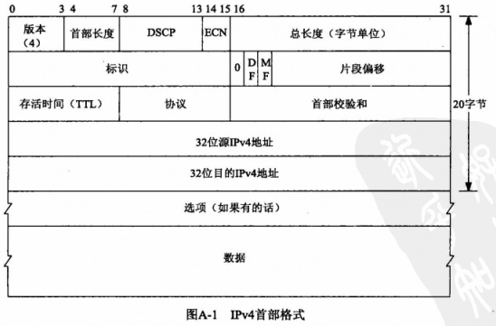

- 1.IPv4最大大小是2^16（65535，包括IPv4首部，实际载荷为65535-20）


- 2.IPV4最小链路MTU为68，因为IPv4首部=20字节+40多字节的选项部分
- 3.路径MTU：两个主机之间的路径中最小的MTU
- 4.分片：这些分片在到达最终目的之前通常不重组
  - IPv4与IPv6的区别：
    - IPv4：主机对其产生和路由对其转发的数据报进行分片
    - IPv6：主机对其产生的数据报分片，路由不对其转发的数据报进行分片（路由对其产生的还是会分片的）
  - DF位：置位表示，不允许分片
    - IPv4：当路由器收到一个超出其外出链路MTU大小且设置了DF位的IPv4数据报时，将产生一个ICMPv4（目的不可达，需分片但DF已置位）
    - IPv6：隐含一个DF位（IPv6本来就不允许路由转发时分片），将产生一个ICMPv6（分组太大）
- 5.DF位的作用：发现路径MTU
- 7.最小重组缓冲区大小，表示IP的任何实现版本都必须保证的最小数据报大小（即双方还没开始交换MSS大小）
  - IPv4：576字节
  - IPv6：1500字节
- 8.MSS：用于向对端TCP通告对端在每个分节中能发送的最大TCP数据量，目的是告诉对端其重组缓冲区大小的实际值，从而避免分片
  - 通常值：MTU-IP首部固定长度-TCP首部固定长度（以太网为：1500-20-20=1460）
  - 实现：通过SYN分节（第一次和第二次握手）上的MSS选项设置
  - 最大值：2^16（65535）字节

### 2.11.1 TCP输出


这里描述的是应用进程写数据到一个TCP套接字中时发生的步骤。

这里涉及以下知识点：

- 1.每一个TCP套接字都有一个发送缓冲区，由SO_SNDBUF更改大小
- 2.write调用发生的事情：
  - 内核从应用进程的缓冲区中复制所有数据写到套接字的发送缓冲区
  - 如果套接字缓冲区无法容下，可能原因：
    - 应用进程的缓冲区大于套接字的发送缓冲区
    - 套接字的发送缓冲区已有其他数据
  - 如果无法容下，进程被睡眠
  - 内核不从write返回（假设是阻塞的套接字） ，直到应用进程的缓冲区所有的数据都复制到套接字缓冲区中
  - 如果write返回，表示当前进程数据已经复制到套接字缓冲区，进程缓冲区可继续使用。但不表示对端已经收到
- 3.TCP套接字缓冲区需要保留已经发送的数据，直到收到该数据的ACK

### 2.11.2 UDP输出


这里描述的是应用进程写数据到一个UDP套接字中时发生的步骤。

这里涉及以下知识点：

- 1.UDP有发送缓冲区（通过SO_SNDBUF设置）,实际上不存在（因此上图用虚线），它表示的只是该UDP套接字的数据报上限。
- 2.应用程序写一个大于套接字发送缓冲区大小的数据报，内核返回进程EMSGSIZE错误
- 3.因UDP不可靠，不必保留应用进程的数据副本，因此无需一个真正的发送缓冲区
- 4.数据保存的过程：应用进程的数据在沿协议向下传递时，通常被复制到某种格式的一个内核缓冲区中，当数据发送后，副本被链路层丢弃
- 5.UDP的write成功返回表示所写的数据报或其所有分段已经被加入数据链路层的输出队列
- 6.如果链路层输出队列没有足够的空间存放数据报或分段，返回ENOBUFS错误到进程


# 第3章 套接字编程简介

[UNPv1第三章：套接字编程简介](https://blog.csdn.net/lxj1137800599/article/details/51244629)

## 3.2 套接字地址结构

### 3.2.1 IPv4套接字地址结构

IPv4套接字地址结构通常也称为“网际套接字地址结构”

```c
//<netinet/in.h>
struct in_addr {
    in_addr_t s_addr; //32位IPv4地址网络字节序
    				
};

struct sockaddr_in{
 　　uint8_t             sin_len;          //带符号8位整数地址结构长度，用于简化套接字地址结构的处理
 　　sa_family_t         sin_family;       //协议族，IPv4为AF_INET
 　　in_port_t           sin_port;         //TCP或UDP端口号，16字节，网络字节序
 　　struct in_addr       sin_addr;         //32位IPv4，网络字节序地址
 　　char                sin_zero[8];      //填充对齐位，未使用，通常为0
};
//必须的字段：sin_family、sin_port、sin_addr
//sockaddr_in至少16字节
//总是在填写该结构前将整个结构置为0
//该结构仅在给定主机上使用，不在主机之间传递
```

从进程到内核传递套接字地址结构的函数有4个，它们都要调用sockargs函数

- 1.bind
- 2.connect
- 3.sendto
- 4.sendmsg

从内核到进程传递套接字地址结构的函数有5个

- 1.accept
- 2.recvfrom
- 3.recvmsg
- 4.getpeername
- 5.getsockname

### 3.2.2 通用套接字地址结构

用处：兼容所有协议的套接字地址结构，对指向特定于协议的套接字地址结构的指针执行类型强制转换

ANSI C后，可以使用void*解决

```c
//<sys/socket.h>
struct sockaddr {
  uint8_t            sa_len;
  sa_family_t        sa_family;       /* address family: AF_xxx value */
  char               sa_data[14];     /* protocol-specific address */
};

//例子：
struct sockaddr_in  serv;      /* IPv4 socket address structure */
bind(sockfd, (struct sockaddr *) &serv, sizeof(serv));
```

### 3.2.3 IPv6套接字地址结构

```c
//<netinet/in.h>
struct in6_addr{
 　　uint8_t            s6_addr[16];            //128位IPv6网络字节序地址
};

#define SIN6_LEN                                //编译时测试所需
struct sockaddr_in6{
 　 uint8_t             sin6_len;               //这个结构的长度
 　 sa_family_t         sin6_family;            //协议族，AF_INET6
 　 in_port_t           sin6_port;              //端口号，网络字节序

　　uint32_t            sin6_flowinfo;          //流信息，未定义
 　 struct in6_addr     sin6_addr;              //IPv6地址，网络字节序

　　uint32_t            sin6_scope_id;          //一定范围的接口
 };
```

### 3.2.4 新的通用套接字地址结构

```c
//<netinet/in.h>
struct sockaddr_storage {
  uint8_t      ss_len;       /* length of this struct (implementation dependent) */
  sa_family_t  ss_family;    /* address family: AF_xxx value */
  /*其他字段对用户来说的透明的 故没有列出*/  
};
//优势：足以容纳系统所支持的任何套接字地址结构
```

与sockaddr的对比：

- 1.sockaddr_storage通用套接字地址结构满足对齐要求
- 2.sockaddr_storage通用套接字地址结构足够大，能够容纳系统支持的任何套接字地址结构

### 3.2.5 套接字地址结构的比较


## 3.3 值-结果参数

**1.从进程到内核传递套接字结构函数**


- bind
- connect
- sendto

这些函数的一个参数是指向某个套接字地址结构的指针，另一个参数是该结构体的整数大小 

```c
struct sockaddr_in serv;
connect (sockfd, (SA *) &serv, sizeof(serv));
```

**2.从内核到进程传递套接字地址结构的函数**


- accept
- recvfrom
- getsockname
- getpeername

两个参数指向某个套接字结构体的指针和指向表示该结构体大小的整数变量的指针

```c
struct sockaddr_un cli; /* Unix domain */
socklen_t len;
len = sizeof(cli); /* len is a value */
getpeername(unixfd, (SA *) &cli, &len);	
/* len may have changed */
```

长度为指针的原因（什么是值-结果参数 Value-result）：

- 函数调用时：结构大小len是一个值（value）, 它告诉内核cli结构的大小，使内核在写cli结构时不至于越界
- 函数返回时：结构大小len是一个结果（result），它告诉进程内核在cli结构中确切存储了多少信息

## 3.4 字节排序函数

**小端字节序**：将低序字节存储在起始地址

**大端字节序**：将高序字节存储在起始地址

”大端“、”小端“表示多个字节值的哪一端（小端或大端）存储在该值的起始地址

**MSB**：most significant bit，最高有效位

**LSB**：least significant bit，最低有效位

**主机字节序**：某个给定系统所用的字节序称为主机字节序（不同系统有不同）


```c
union {
	  short  s;
      char   c[sizeof(short)];
    } un;
un.s = 0x0102;
if(un.c[0] == 1 && un.c[1] == 2); //大端
if (un.c[0] == 2 && un.c[1] == 1); //小端
```

**网络字节序**：网络协议使用**大端字节序**来传递这些字节整数

主机字节序与网络字节序之间的转换函数：

```c
#include <netinet/in.h>
//h表示host, n表示network，s代表short，l代表long
//均返回：网络字节序的值
uint16_t htons(uint16_t host16bitvalue);    //主机to网络 short
uint32_t htonl(uint32_t host32bitvalue);    //主机to网络 long

//均返回：主机字节序的值
uint16_t ntohs(uint16_t net16bitvalue);     //网络to主机 short
uint32_t ntohl(uint32_t net32bitvalue);     //网络to主机 long

```

**字节==八位组==8位的量**

**位序**：按照在线缆上出现的顺序排列的4个字节（32个位）


## 3.5 字节操作函数

**Berkely**

```c
#include <strings.h>
void bzero(void *dest,size_t nbytes);               //将目标字符串制定数目的字节置0
void bcopy(const void *src,void *dest,size_t nbytes);         //拷贝指定字节
int bcmp(const void*ptrl,const void *ptr2,size_t nbytes);     //若相等返回0
```

**ANSI C**

```c
#include<string.h>
void *memset(void *dest,const void *c,size_t len);
void *memcpy(void *dest,const void *src,size_t nbytes);
int memcmp(const void *ptrl,const void *ptr2,size_t nbytes);
//返回：若相等则为0，否则为<0或者>0
```

**注意：**

- 1.memcpy类似bcopy
- 2.bcopy能正确处理源字符串与目的字符串重叠情况
- 3.memcpy不能正确处理源字符串与目的字符串重叠情况，可以使用memmove替代
- 4.memcmp需要将比较的字节转换为无符号字符（unsigned char）

## 3.6 inet_aton、inet_addr、和inet_ntoa函数

地址转换函数

inet_aton、inet_addr和inet_ntoa在点分十进制数串（eg：“206.168.112.96”）与它的32位网络字节序二进制值间转换IPv4地址。

```c
#include<arpa/inet.h>

//作用：将strptr所指的C字符串转换成32位的网络字节序二进制值，并通过指针addrptr来存储
//返回：1--字符串有效， 0--字符串有错
//如果strptr为空，仍然对输入函数进行有效性检查，但addrptr不存储任何结果
int inet_aton(const char *strptr, struct in_addr *addrptr);　

//返回：若成功，返回32位二进制的网络字节序地址；若有错，返回INADDR_NONE
//作用与inet_aton一样，但是返回的是二进制值
//不能处理255.255.255.255,因为它的错误返回值INADDR_NONE也是这个值
//该函数已被废弃，使用inet_aton代替
in_addr_t inet_addr(const char *strptr);

//作用：将一个32位的网络字节序二进制IPv4地址转换成相应的点分十进制数串
//返回：指向点分十进制数串的指针
//该函数不可重入,即不能被中断，因为函数返回值所指的串驻留在静态内存中
//注意：以结构为参数，而不是指向结构的指针
char *inet ntoa(struct in_addr inaddr);
　　　　　　　　　　　             
```

## 3.7 inet_pton和inet_ntop函数

IPv4地址和IPv6地址都可用

函数名中p和n分别代表表达(presentation)和数值(numeric)地址的表达式通常是ASCII字符串

表达式即ASCII字符串

数值即存放在套接字地址结构中的二进制值

```c
#include <arpa/inet.h>

//family可以是AF_INET和AF_INET6

//作用：ASCII字符串--->套接字地址结构中的二进制值
//返回：若成功为1，若输入不是有效的表达式为0，若出错为-1
int inet_pton(int family, const char *strptr, void *addrptr);

//作用：套接字地址结构中的二进制值--->ASCII字符串
//注意：strptr不能为空，调用者必须为目标存储单元分配内存并制定其大小
//返回：若成功则为指向结果的指针，若出错则为null
const char *inet_ntop(int family, const void *addrptr, char *strptr, size_t len);

//len的定义
//<netinet/in.h>
#define INET_ADDRSTRLEN 16
#define INET6_ADDRSTRLEN 46
```


## 3.8 sock_ntop和相关函数（本书自定义函数）

本书自定义函数

```c
#include "unp.h"
#define	SA	struct sockaddr

//将统配地址和一个临时端口绑定到一个套接字
int		 sock_bind_wild(int sockfd, int family);
//比较两个套接字地址结构的地址部分
int		 sock_cmp_addr(const SA *sockaddr1, const SA *sockaddr2, socklen_t addrlen);
//比较两个套接字地址结构的端口号部分
int		 sock_cmp_port(const SA *sockaddr1, const SA *sockaddr2, socklen_t addrlen);
//只返回端口号
int		 sock_get_port(const SA *sockaddr, socklen_t addrlen);
//把一个套接字地址结构中的主机部分转换为表达格式（不包括端口号）
char	*sock_ntop_host(const SA *sockaddr, socklen_t addrlen);
//把一个套接字地址结构中的地址部分设为ptr所指的值
void	 sock_set_addr(SA *sockaddr, socklen_t addrlen, const void *ptr);
//只设置一个套接字地址结构的端口号部分
void	 sock_set_port(SA *sockaddr, socklen_t addrlen, int port);
//把一个套接字地址结构中的地址部分置为通配地址
void	 sock_set_wild(SA *sockaddr, socklen_t addrlen);
```

## 3.9 readn、writen和readline函数（本书自定义函数）

字节流套接字上调用read或write输入或输出的字节数可能比请求的数量少

- 原因：套接字的缓冲区可能已经达到了极限
- 解决方法：
  - 1.再次调用read或write函数，以输入或输出剩余的字节
  - 2.实现自定义函数

自定义的目的：实现一个输入或输出的字节数与请求数量一样的函数

```c
#include "unp.h"
//实际上就是read、write函数增强版
ssize_t readn(int filedes, void *buff, size_t nbytes);
ssize_t writen(int filedes, const void *buff, size_t nbytes);
ssize_t readline(int filedes, void *buff, size_t maxlen);
//均返回：读或写的字节数，若出错则为-1，连接已经关闭为0
```

readline原本的实现版本较慢，原因是每次调用read只读取一个字符。可以通过自己实现一个my_read，维护一个自己的缓冲区，readline调用自己实现的my_read从而得到一个较快的版本

# 第4章 基本TCP套接字编程

[UNPv1第四章：基本TCP套接口编程](https://blog.csdn.net/lxj1137800599/article/details/51247813)

连接过程图：

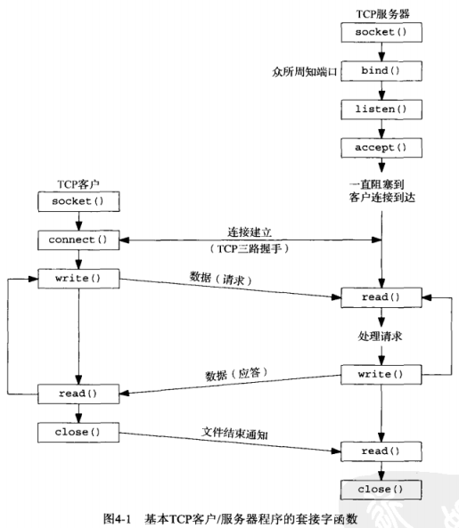

## 4.2 socket函数

```c
#include <sys/socket.h>
/*
** 用处：创建套接字
** @family:协议族、协议域
** @type:套接字类型
** @protocol:协议类型
** @返回值：成功时返回文件描述符（套接字描述符），错误时返回-1
*/
int socket (int family, int type, int protocol);
```

**family:**

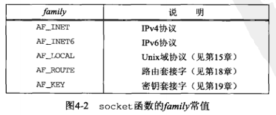

**type:**

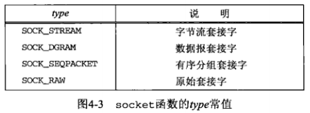

**protocol:**

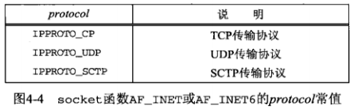

**family与type组合是否有效**

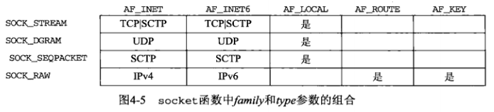

**对比AF_XX和PF_XX**

`AF_`前缀便是地址族，`PF_`前缀表示协议族

曾经的想法：单个协议族可以支持多个多个地址族，`PF_`用于创建套接字，`AF_`用于套接字地址结构

实际上：支持多个地址族的协议族未实现过

头文件`<sys/socket.h>`中，给定协议定义的`PF_`和`AF_`值总是相等的

更多使用`AF_`，本书亦是如此

## 4.3 connect函数

```c
#include <sys/socket.h>
/*
** 用处：建立与TCP服务器的连接
** @sockfd:由socket函数返回的套接字描述符
** @servaddr:指向套接字地址结构的指针
** @addrlen:servaddr结构的长度
** @返回值：成功返回0，失败返回-1
*/
int connect(int sockfd, const struct sockaddr *servaddr, socklen_t addrlen);
```

TCP套接字调用connect函数将触发三次握手过程，在连接成功或失败时返回。

**出错的返回的情况有：**

- 1.超时错误：若TCP客户没有收到SYN包的响应，则返回**ETIMEDOUT**错误
- 2.RST错误：若对客户端的SYN的响应是RST（表示复位），则表明该服务器主机在我们制定的端口没有进程在等待与之连接（例如服务器进程也许没有在允许），返回**ECONNREFUSED**错误，这是一种**硬错误**
- 3.目的地不可达：若客户发出的SYN在中间的某个路由器上引发一个“destination unreachable”（目的地不可达）ICMP错误，多次重传超时后仍然不可达，则保存的ICMP消息作为**EHOSTUNREACH**或**ENETUNREACH**错误返回给进程，这是一种**软错误**

若connect失败则该套接字不再可用，必须关闭，不能对该套接字再次调用connect函数。每次调用connect失败后，必须close当前的套接字描述符并重新调用socket

**RST产生的条件**

- 1.端口未监听：目的地为某个端口的YSN到达，然而该端口没有正在监听的服务器
- 2.取消连接：TCP想取消一个已有连接
- 3.收到无法解释的分节：TCP接收到一个根本不存在的连接上的分节

## 4.4 bind函数

```c
#include <sys/socket.h>
/*
** 作用：把一个本地协议地址赋予一个套接字
** @sockfd：由socket函数返回的套接字描述符
** @myaddr：一个指向特定于协议的地址结构的指针
** @addrlen：myaddr地址结构的长度
** @返回值：成功返回0，失败返回-1
*/
int bind (int sockfd, const struct sockaddr *myaddr, socklen_t addrlen);
```

本地协议地址：由32位的IPv4地址或128位的IPv6地址与16位的TCP或UDP端口号的结合

**常见的bind出错情况：**返回**EADDRINUSE**（“Address already in use”，地址已经使用）

**关于端口绑定：**

如果一个TCP客户或服务器未曾调用bind绑定一个端口，在调用connect或listen时，内核就为相应的套接字选择一个临时端口。

通常，服务器是绑定“众所周知端口”，例外是，远程过程调用服务器，使用内核为其选择的临时端口

如果让内核为套接字选择一个临时端口，为了得到内核所选的这个临时端口值，调用`getsockname`函数来返回协议地址

**关于地址绑定：**

TCP客户端通常不把IP地址绑定到它的套接字上，当连接套接字时，内核将根据所用外出网络接口来选择IP地址

TCP服务器没有把IP地址绑定到它的套接字上，内核就把客户端发送的SYN的目的IP地址作为服务器的源IP地址

**绑定与不绑定**：

bind可以指定IP地址或端口，也可以两者都指定，也可以两者都不指定

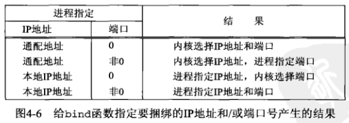

**关于通配地址**

对于IPv4，通配地址由常值INADDR_ANY指定，其值一般为0

```c
struct sockaddr_in servaddr;
servaddr.sin_addr.s_addr = htonl( INADDR_ANY );
```

对于IPv6，因为地址是存放在一个结构中的，因此不能直接用INADDR_ANY常量，而应该使用如下方式：

```c
struct sockaddr_in6 serv;
serv.sin6_addr = in6addr_any;
//in6addr_any变量由系统预分配，并初始化为常值IN6ADDR_ANY_INIT
```

## 4.5 listen函数

```c
#include <sys/socket.h>
/*
** 作用：把未连接的套接字变为被动套接字（监听套接字），指示内核应该接受指向该套接字的连接请求。相对的，TCP客户端用于主动发起连接的套接字称为主动套接字
** @sockfd：由socket函数返回的套接字描述符,未连接的套接字
** @backlog:队列长度（未完成队列+已完成队列），但这个值的确切含有对于不同系统有不同的解释
*/
int listen (int sockfd, int backlog);
```

内核为任何一个给定的监听套接字维护**两个队列**：

- 1.未完成队列：已经完成第二次握手（服务器发出SYN&ACK），处于SYN_RCVD的套接字
  - 直到三次握手的三个个分节到达或该套接字超时，则该套接字被移除未完成队列
  - 套接字超时为RTT，因此该队列中的任何一项保留时间为RTT，该值取决于特定的客户端和服务器
- 2.已完成队列：已经完成三次握手，处于ESTABLISHED的套接字，等待服务器进程accept取走这些套接字
  - 当进程调用accept函数时，已完成队列中的队头项将返回给进程，或如果队列为空，那么进程将被投入睡眠，直到TCP在该队列中放入一项才唤醒

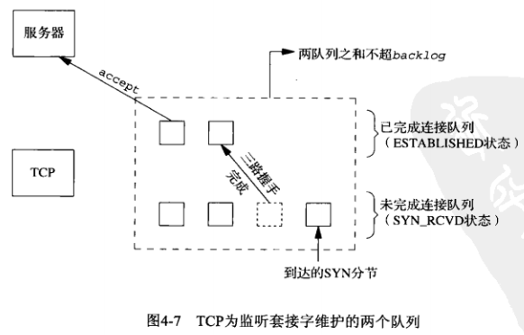

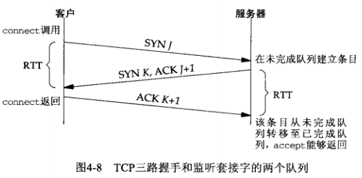


**队列满时的处理**

当一个客户SYN到达时，若未完成队列是满的，TCP忽略该分节，且不会发送RST

不发送的原因：

- 1.这种情况是暂时的，客户端TCP将重发SYN，期待不久就能在这些队列中找到可用空间
- 2.若发送RST，客户端connect会返回错误，客户端就需要处理错误，而不是让TCP重传机制来处理
- 3.客户无法区影响SYN的RST意味着“该端口没有服务器在监听”还是“端口有服务器在监听，但它队列满了”

**三次握手完成之后，accept之前**

在此阶段，服务器收到客户端的数据由服务器TCP排队，最大数量为相应套接字的缓冲区大小

**关于安全性**

- 1.SYN洪泛：给受害者主机发送SYN，用以装填一个或多个TCP端口的未完成连接队列
- 2.IP欺骗：在SYN洪泛中，每个SYN的源IP地址都是随机数，这样服务器的SYN/ACK就不知道发往什么地方

## 4.6 accept函数

```c
#include <sys/socket.h>
/*
** 作用：用于从已完成连接队列列头返回下一个已完成连接，如果已完成连接队列为空，进程将被投入睡眠（假设套接字为默认的阻塞方式）
** @sockfd：调用listen由未连接套接字变为的监听套接字
** @cliaddr:指向客户端的协议地址结构的指针
** @addrlen:是一个指针，是值-结果参数。调用前，cliaddr所指向套接字地址结构的长度；返回时，为由内核放在该套接字地址结构内的确切字节数
** @返回值：若成功返回套接字描述符（与客户端的已连接套接字），出错返回-1
*/
int accept (int sockfd, struct sockaddr *cliaddr, socklen_t *addrlen);
```

**监听套接字与已连接套接字的区别**

- 监听套接字：一个服务器通常仅仅创建一个监听套接字，它在服务器的生命周期内一直存在
- 已连接套接字：内核为每个由服务器进程接受的客户连接创建一个已连接套接字，当服务器完成对某个给定客户的服务时，相应的已连接套接字就被关闭

**该函数的返回值**

有三个返回值：

- 1.新套接字描述符或出错指示的整数
- 2.客户的协议地址（cliaddr），如不关心，可置为空指针
- 3.协议地址的长度（addrlen），如不关心，可置为空指针

## 4.7 fork和exec函数

**关于fork函数**

```c
#include <unistd.h>
/*
** 作用：Unix中派生新进程的唯一方法
** 返回值：成功时，返回两次，在子进程中返回0，在父进程中返回子进程ID。若出错，返回一次，为-1
*/
pid_t fork(void);
```

**关于父子进程：**

父进程中调用fork之前打开的所有描述符在fork返回之后由子进程分享（实际上是COW机制，如果子进程需要修改，则会新拷贝一份）

fork之后，子进程会拷贝父进程的数据空间、堆和栈空间（实际上是采用写时复制技术），二者共享代码段。所以在子进程中修改全局变量（局部变量，分配在堆上的内存同样也是）后，父进程的相同的全局变量不会改变

父进程调用accept之后调用fork，所接受的已连接套接字随后就在父进程与子进程之间共享。通常情况下，子进程接着读写这个已连接套接字，父进程则关闭这个已连接套接字

**fork的两个典型用法：**

- 1.一个进程创建一个自身的副本，每个副本执行各自的操作（网络服务器的典型用法）
- 2.一个进程想要执行另外一个程序，那么它先调用fork函数创建一个自身的副本，然后调用exec函数把自身替换成新的程序（Shell之类程序的典型用法）


**关于exec函数**

可执行程序文件能够被Unix执行的唯一方法：由一个现有进程调用6个exec函数中的某一个

exec的特点：exec把当前进程映像换成新的程序文件，而且该新程序通常从main函数开始执行，进程ID并不改变。调用exec的进程称为“调用进程”，新执行的程序称为“新程序”

```c
#include <unistd.h>

//若成功则不返回，将控制权交给新程序的main函数；出错返回-1
//其他5个函数（库函数），最终都是调用execve（系统调用）
int execl (const char *pathname, const char *arg0, ... /* (char *) 0 */ );
int execv (const char *pathname, char *const argv[]);
int execle (const char *pathname, const char *arg0, .../* (char *) 0, char *const envp[] */ );
int execve (const char *pathname, char *const argv[], char *const envp[]);
int execlp (const char *filename, const char *arg0, ... /* (char *) 0 */ );
int execvp (const char *filename, char *const argv[]);
```

以上6个exec函数的区别是：

- 1.待执行的程序是由文件名还是由路径名指定 
- 2.新程序的参数是一一列出还是由一个指针数组来引用 
- 3.把调用进程的环境传递给新程序还是给新程序指定新的环境

进程在调用exec之前打开着的描述符通常跨exec继续保持打开。可以使用fcntl设置FD_CKIEXEC描述符标志禁止掉

## 4.8 并发服务器

**迭代服务器：**由主进程直接处理已连接套接字，没有使用fork

**并发服务器：**由主进程fork出子进程，由子进程处理已连接套接字

```c
pid_t pid;
int listenfd, connfd;
listenfd = Socket(AF_INET, SOCK_STREAM, 0);
Bind(listenfd,...);
Listen(listenfd, LISTENQ);
for ( ; ; ) {
    connfd = Accept(listenfd,...);
    if ( (childpid = Fork()) == 0) { //子进程
			Close(listenfd); //关闭子进程监听套接字（引用计数-1）
        	doit(connfd); //处理已连接套接字的请求
        	Close(connfd); //关闭已连接套接字，该句并非必须，因为exit时会自动处理
			exit(0); //终止子进程
    }
    Close(connfd); //父进程不等待子进程，关闭已连接套接字（引用计数-1），并继续循处理新的另一个连接
}

```

**关于Close**

父进程对connfd调用close没有终止它与客户端连接的原因：

每个文件或套接字都有一个引用计数，在文件表项中维护，是当前打开着的引用该文件或套接字的描述符的个数。如上代码所示，Socket函数返回时，listenfd关联的文件表项的引用计数为1，Accept函数返回后connfd的引用计数也为1，fork后，子进程复制父进程数据，它们的引用计数都为2。套接字真正清理和资源释放要等引用计数为0时才发生

**创建连接和子进程的过程：**

**第一步**

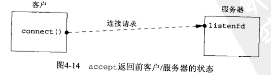

**第二步：**

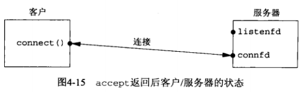


**第三步：**

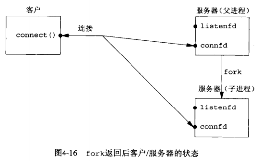

**第四步：**

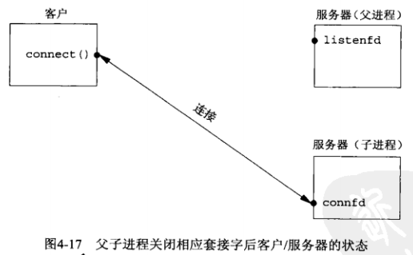

## 4.9 close函数

```c
#include <unistd.h>
/**
** 作用：用来关闭套接字（实际上是套接字引用计数-1），并终止TCP连接
** @sockfd：想要进行close操作的套接字描述符
** @返回值：若成功为0，出错为-1
**/
int close (int sockfd);         
```

**关闭后的套接字描述符**

关闭后的套接字描述符不能再由调用进程使用，也就是说它不能再作为read或write的第一个参数。但在这之前，会尝试发送已经排队等待发送到对端的数据，发送完这些数据后再进行正常的TCP终止序列（四次挥手）

**描述符引用计数**

**知识点1**：close只是减少引用计数，如果调用close后，引用计数仍大于0，则不引发四次挥手。如果想要某个TCP连接立马发送FIN，可以使用shutdown函数

**知识点2：**如果父进程对accept返回的已连接套接字都不调用close，会发生什么？

- 1.父进程最终将耗尽可用描述符
- 2.没有一个客户连接会被终止。子进程退出后，已连接套接字的引用计数由2变为1，父进程永远不会关闭任何已连接套接字。这妨碍TCP连接终止序列的发生，导致连接一直打开着


## 4.10 getsockname和getpeername函数

```c
#include <sys/socket.h>
/*
** 作用：返回与某个套接字关联的本地协议地址（IP地址和端口号的组合）
** @sockfd：本地套接字，该函数就是获取该套接字的本地协议地址
** @localaddr:本地协议地址指针
** @addrlen:值-结果参数
** @返回值：成功为0，失败为-1
*/
int getsockname(int sockfd, struct sockaddr *localaddr, socklen_t *addrlen);

/*
** 作用：返回与某个套接字关联的外地协议地址，应该就是与该socket连接的套接字的地址（IP地址和端口号的组合）
** @sockfd：本地套接字，该函数就是获取与该套接字相连的套接字的地址
** @localaddr:外地协议地址指针
** @addrlen:值-结果参数
** @返回值：成功为0，失败为-1
*/
int getpeername(int sockfd, struct sockaddr *peeraddr, socklen_t *addrlen);
```

# 第5章 TCP客户/服务器程序示例

[UNPv1第五章：TCP客户服务器程序实例](https://blog.csdn.net/lxj1137800599/article/details/51247971)

## 5.1 概述

回射服务器的执行步骤：

- 1.客户从标准输入读一行文本，写到服务器上
- 2.服务器读入此行，并回射给客户
- 3.客户读此回射行写到标准输出 

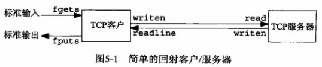

## 5.2 TCP回射服务器程序：main函数

```c++
// tcpcliserv/tcpserv01.c
#include	"unp.h"

int
main(int argc, char **argv)
{
	int					listenfd, connfd;
	pid_t				childpid;
	socklen_t			clilen;
	struct sockaddr_in	cliaddr, servaddr;

	//1.创建套接字，目前为未连接套接字，Listen之后变为监听套接字
	listenfd = Socket(AF_INET, SOCK_STREAM, 0);

	//2.设置地址结构
    //2.1.将地址结构清空
	bzero(&servaddr, sizeof(servaddr));
    //2.2.设置协议族
	servaddr.sin_family      = AF_INET;
    //2.3.绑定通配地址：告知系统：要是系统是多宿主机，我们将接受目的地址为任何本地接口的连接
	servaddr.sin_addr.s_addr = htonl(INADDR_ANY);//通配地址INADDR_ANY
    //2.3.绑定端口，#define SERV_PORT 9877
	servaddr.sin_port        = htons(SERV_PORT);//端口号SERV_PORT(9877)

	//3.将套接字绑定到地址
    //#define	SA	struct sockaddr，IPv4通用套接字地址结构
	Bind(listenfd, (SA *) &servaddr, sizeof(servaddr));

	//4.将未连接套接字转换为监听套接字
	Listen(listenfd, LISTENQ);

	for ( ; ; ) {
		clilen = sizeof(cliaddr);
		//5.阻塞在Accept，等待来自客户端的连接
		connfd = Accept(listenfd, (SA *) &cliaddr, &clilen);
        
		//6.为每个客户派生一个处理它们的子进程，子进程会关闭监听套接字（引用计数-1），父进程关闭已连接套接字（引用计数-1），继续在监听套接字监听
		if ( (childpid = Fork()) == 0) {	/* child process */
			Close(listenfd);	//关闭监听套接字（引用计数-1）
			//7.子进程调用str_echo接收并回显客户端发来的消息
			str_echo(connfd);	/* process the request */
			exit(0);
		}
		Close(connfd);		//关闭已连接套接字（引用计数-1）
	}
}
```

## 5.3 TCP回射服务器程序：str_echo函数

```c
// lib/str_echo.c
#include	"unp.h"

//作用：处理每个客户的服务：从客户读入数据，并把它们回射给客户
void
str_echo(int sockfd)
{
	ssize_t		n;
	char		buf[MAXLINE];

again:
    //read从套接字读入数据,如果客户关闭连接，那么接收到客户的FIN将导致服务器子进程的read返回0，否则返回读取到的字节数
	while ( (n = read(sockfd, buf, MAXLINE)) > 0)
        //Writen把buf中的内容回射给客户
		Writen(sockfd, buf, n);

	if (n < 0 && errno == EINTR)
		goto again;
	else if (n < 0)
		err_sys("str_echo: read error");
}
```

## 5.4 TCP回射客户程序：main函数

```c
// tcpcliserv/tcpcli01.c
#include	"unp.h"

int
main(int argc, char **argv)
{
	int					sockfd;
	struct sockaddr_in	servaddr;

	if (argc != 2)
		err_quit("usage: tcpcli <IPaddress>");
	
    //1.创建套接字
	sockfd = Socket(AF_INET, SOCK_STREAM, 0);
	
    //2.创建服务器地址结构
    //2.1将地址结构清空
	bzero(&servaddr, sizeof(servaddr));
    //2.2.设置协议族
	servaddr.sin_family = AF_INET;
    //2.3.绑定端口，#define SERV_PORT 9877
	servaddr.sin_port = htons(SERV_PORT); //端口号SERV_PORT(9877)
    //2.4.根据main函数参数argv[1]获取服务器ip地址
    //Inet_pton的作用：ASCII字符串--->套接字地址结构中的二进制值
	Inet_pton(AF_INET, argv[1], &servaddr.sin_addr);
	
    //3.发起TCP 3次握手建立连接
	Connect(sockfd, (SA *) &servaddr, sizeof(servaddr));
	
    //4.从输入按行读取文本，发送至服务器，接收并显示回显
	str_cli(stdin, sockfd);		/* do it all */

	exit(0);
}
```

## 5.5 TCP回射客户程序：str_cli函数

```c
// lib/str_cli.c
#include	"unp.h"

void
str_cli(FILE *fp, int sockfd)
{
	char	sendline[MAXLINE], recvline[MAXLINE];
	//Fgets从客户端读入一行数据
	//当遇到文件结束符或错误，fgets（库函数）将返回一个空指针，于是客户端循环终止
	//Fgets包裹fgets，检查是否发送错误，出错则终止程序，因此Fgets只有遇到文件结束符时才返回一个空指针
	while (Fgets(sendline, MAXLINE, fp) != NULL) {
		//Writen把从客户端读到的数据发送到服务端
		Writen(sockfd, sendline, strlen(sendline));
		//Readline读取从服务器回射的数据
		if (Readline(sockfd, recvline, MAXLINE) == 0)
			err_quit("str_cli: server terminated prematurely");
		//Fputs把它写到标准输出
		Fputs(recvline, stdout);
	}
}
```

## 5.6 正常启动

**启动服务器**

```shell
# 启动服务器
$ ./tcpserv01 

# 查看服务器套接字的状态
# Local Address *:9877 表示本地地址为 通配地址+9877端口
# State LISTEN 表示套接字处于监听状态
# 
$ netstat -a | grep 9877
Active Internet connections (servers and established)
Proto Recv-Q Send-Q Local Address           Foreign Address         State
tcp        0      0 *:9877                  *:*                     LISTEN
```

**启动客户端**

```shell
# 启动客户端
# 由于Fgets，进入阻塞状态
# 此时还存在另两个阻塞状态：服务器主进程阻塞与Accept，服务器子进程阻塞于readline
$ ./tcpcli01 127.0.0.1

# 查看套接字状态
# 由于服务器和客户端都在同一台主机，因此我们可以看到服务器的：监听套接字、服务器已连接套接字（第一个ESTABLISHED）和客户端的已连接套接字（第二个ESTABLISHED）
$ netstat -a | grep 9877
Active Internet connections (servers and established)
Proto Recv-Q Send-Q Local Address           Foreign Address         State
tcp        0      0 *:9877                  *:*                     LISTEN     
tcp        0      0 localhost:9877          localhost:51030         ESTABLISHED
tcp        0      0 localhost:51030         localhost:9877          ESTABLISHED

# 查看进程状态和关系
# 处于inet_csk_accept（阻塞于accept）为服务器的父进程，其PPID为1700，应该就是shell(bash)的PID
# 处于sk_wait_data（阻塞于read）为服务器的子进程，其PPID为1813，即服务器的父进程ID
# 处于wait_woken（阻塞与fgets）的为客户端进程
# STATE S+表示进程在等待某些资源而睡眠
$ ps -a -o pid,ppid,tty,stat,args,wchan
   PID   PPID TT       STAT COMMAND                     WCHAN
  1813   1700 pts/8    S+   ./tcpserv01                 inet_csk_accept
  1818   1742 pts/9    S+   ./tcpcli01 127.0.0.1        wait_woken
  1819   1813 pts/8    S+   ./tcpserv01                 sk_wait_data
```

## 5.7 正常终止

**客户端与服务器数据交换**

```shell
$ ./tcpcli01 127.0.0.1
hello,world
hello,world
```

**正常终止**

```shell
# 客户端
# 输入EOF
$ Control-D

# 查看连接状态
$ netstat -a | grep 9877
Active Internet connections (servers and established)
Proto Recv-Q Send-Q Local Address           Foreign Address         State
tcp        0      0 *:9877                  *:*                     LISTEN     
tcp        0      0 localhost:51030         localhost:9877          TIME_WAIT

# 查看进程状态
# 注意处于STAT Z+状态的进程，这是服务器子进程退出后，变为僵死状态，因为没被父进程回收
$ ps -a -o pid,ppid,tty,stat,args,wchan
   PID   PPID TT       STAT COMMAND                     WCHAN
  1813   1700 pts/8    S+   ./tcpserv01                 inet_csk_accept
  1819   1813 pts/8    Z+   [tcpserv01] <defunct>       exit
```

**正常终止客户和服务器的步骤**

- 1.键入EOF（Control-D），客户端的fgets返回一个空指针，于是从str_cli函数返回
- 2.str_cli返回到客户端的main函数，main通过调用exit(0)终止
- 3.客户端进程终止处理的部分工作是关闭所有打开的描述符，因此客户端打开的套接字由内核关闭：
  - 客户端TCP发送一个FIN给服务器（第一次挥手），客户端进入FIN_WAIT_1
  - 服务器以ACK响应（第二次挥手），服务器进入CLOSE_WAIT，客户端进入FIN_WAIT_2
- 4.服务器收到TCP的FIN时，服务器子进程阻塞与str_echo函数的readline调用，于是readline返回0，str_echo返回服务器子进程的main函数
- 5.服务器子进程通过调用exit(0)来终止
- 6.服务器子进程中打开的所有描述符随之关闭。由子进程来关闭已连接套接字，引发TCP连接终止的最后两个分节：
  - 服务器子进程发送FIN（第三次挥手），服务器进入LAST_ACK
  - 客户端发送最后的ACK（第四次挥手），客户端进入TIME_WAIT，服务器CLOSED

**除了以上步骤，需要注意的是：**

在服务器子进程终止时，给父进程发送了一个SIGCHLD信号（这里点在本例中发生了，但没有在代码中捕获该信号，而该信号的默认行为是被忽略），父进程未加处理，子进程进入僵死状态。看到下面的Z+表示子进程进入僵死状态

```shell
# 查看进程状态
# 注意处于STAT Z+状态的进程，这是服务器子进程退出后，变为僵死状态，因为没被父进程回收
$ ps -a -o pid,ppid,tty,stat,args,wchan
   PID   PPID TT       STAT COMMAND                     WCHAN
  1813   1700 pts/8    S+   ./tcpserv01                 inet_csk_accept
  1819   1813 pts/8    Z+   [tcpserv01] <defunct>       exit
```

## 5.8 POSIX信号处理

### 信号基本知识

信号（signal）：告知某个进程发生了某个事件的通知，也称为软件中断

信号通常是异步的：即进程预先不知道信号的发生时刻

信号可以：

- 1.由一个进程发送给另一个进程（或自身）
- 2.由内核发给某个进程


信号的行为：每个信号都有一个与之关联的处置，称为信号的行为。可以通过调用sigaction函数设定一个信号的行为

设置信号的行为有三种方式：

- 1.捕获信号：提供一个信号处理函数，只要有特定信号发生它就被调用
  - `void handler(int signo);`
  - 不能被捕获的信号：SIGKILL、SIGSTOP
- 2.忽略信号：把某个信号的处置设为SIG_IGN来忽略它
  - 不能被忽略的信号：SIGKILL、SIGSTOP
- 3.默认处置：把某个信号的处置设定为SIG_DEF来启用它的默认处置
  - 默认处置的行为有两种：
    - 通常是收到信号后终止进程，其中某些信号还在工作目录下生产一个进程的核心映像（core image，也称为内存影像）
    - 忽略信号，例如SIGCHLD和SIGURC的默认处置就是忽略该信号

### signal函数

建立信号处置的POSIX方法是调用sigaction函数

```c
 #include<signal.h>
/*
** @signum:要操作的信号
** @act:要设置的对信号的新处理方式，指向sigaction结构的指针
** @sigaction:原来对信号的处理方式
** @返回值：0 表示成功，-1 表示有错误发生
*/
 int sigaction(int signum,const struct sigaction *act ,struct sigaction *oldact);
```

由于该函数的act必须分配和添加，因此使用下面的signal（注意与标准C库函数中signal的区别，在一些系统中，C库函数中signal不会使得内核自动重启被中断的系统调用）对sigaction进行封装

```c
/* include signal */
#include	"unp.h"

//typedef	void	Sigfunc(int);
/*
** @signo:信号名
** @func:指向处置函数的指针、或为常值SIG_IGN、SIG_DEF
** 返回值：signal的返回值为一个Sigfunc类型的函数指针
** 这个指针指向的函数仅有一个整型参数，且没有返回值
*/
Sigfunc *
signal(int signo, Sigfunc *func)
{
	//处置结构
	struct sigaction	act, oact;

	//设置处理函数
	act.sa_handler = func;
	/*
	** 作用：设置处理函数的信号掩码
	** POSIX允许指定一组信号，它们在信号处理函数被调用时阻塞。任何阻塞的信号都不能递交给进程
	** 这里是把act.sa_mask设为空集，意味着在该信号处理函数运行期间，不阻塞额外的信号
	** 注意：这里的阻塞与之前说的阻塞于Accept函数的意义不一样
	** 这里的阻塞指：阻塞某个信号或信号集，防止它们在阻塞期间递交。反操作为：解阻塞
	** 之前的阻塞指：阻塞在某个系统调用上，这个系统调用因没有必要资源而必须等待，直到这些资源可用才返回。等待期间进程进入睡眠状态。相对的概念为：非阻塞
	*/
	sigemptyset(&act.sa_mask);
	//设置SA_RESTART标志，可选的。如果设置，由相应信号中断的系统调用将由内核自动重启
	act.sa_flags = 0;
	if (signo == SIGALRM) {
#ifdef	SA_INTERRUPT
		act.sa_flags |= SA_INTERRUPT;	/* SunOS 4.x */
#endif
	} else {
#ifdef	SA_RESTART
		act.sa_flags |= SA_RESTART;		/* SVR4, 44BSD */
#endif
	}
	//调用sigaction函数
	if (sigaction(signo, &act, &oact) < 0)
		return(SIG_ERR);
    //将相应信号的旧行为（上一次设置的行为）作为signal函数的返回值
	return(oact.sa_handler);
}
/* end signal */

//对signal再封装，多了一步错误处理
Sigfunc *
Signal(int signo, Sigfunc *func)	/* for our signal() function */
{
	Sigfunc	*sigfunc;

	if ( (sigfunc = signal(signo, func)) == SIG_ERR)
		err_sys("signal error");
	return(sigfunc);
}
```

### POSIX信号语义

信号处理的总结：

- 1.一旦安装了信号处理函数，它便一直安装着
- 2.在一个信号处理函数运行期间，正在递交的信号时阻塞的。且可以通过安装处理函数时传递给sigaction函数的sa_mask信号集中指定的额外信号也被阻塞（上面的代码中，sa_mask为空集，意味除了被捕获的信号外，没有额外信号被阻塞）
- 3.如果一个信号在阻塞期间产生了一次或多次，那么该信号被解阻塞后通常只递交一次，即Unix信号时默认不排队的
- 4.利用sigprocmask函数选择性地阻塞或解阻塞一组信号是可能的。这样可以做到一段临界区代码执行期间，防止捕获某些信号，以保护这段代码

## 5.9 处理SIGCHLD信号

僵死（zombie）状态的**目的**：维护子进程的信息，以便父进程在以后某个时候获取，这些信息包括：

- 1.子进程的进程ID
- 2.终止状态
- 3.资源利用情况（CPU时间、内存使用量）

如果一个进程终止，而该进程有子进程处于僵死状态，那么它的所有僵死进程的父进程ID将被重置为1（由init进程管理），继承这些子进程的init进程将清理它们（init进程将wait这些僵死进程，从而去除它们的僵死状态）

僵死进程的**危害**：占用内核中的空间，最终可能导致耗尽进程资源。因此fork出来的子进程一定要wait它们，以防止它们变成僵死进程

处理僵死进程的**可移植方法**：捕获SIGCHLD，并调用wait或waitpid

### 处理僵死进程

**SIGCHLD信号处理函数**

```c
#include	"unp.h"

void
sig_chld(int signo)
{
	pid_t	pid;
	int		stat;

	pid = wait(&stat);
	printf("child %d terminated\n", pid);
    //return的作用：当某个系统调用被我们编写的某个信号处理函数中断时，可以得知该系统调用具体是被哪个信号处理函数的哪个return语句中断的
	return;
}
```

**Signal函数的实现**

```c
Sigfunc *
Signal(int signo, Sigfunc *func)	/* for our signal() function */
{
	Sigfunc	*sigfunc;
	//这里使用的是标准C库函数的signal，而不是第5.8节中实现的版本
	if ( (sigfunc = signal(signo, func)) == SIG_ERR)
		err_sys("signal error");
	return(sigfunc);
}
```

**可处理僵死进程的服务器main函数**

```c
//源码 tcpcliserv/tcpserv02.c
#include	"unp.h"

int
main(int argc, char **argv)
{
	int					listenfd, connfd;
	pid_t				childpid;
	socklen_t			clilen;
	struct sockaddr_in	cliaddr, servaddr;
	void				sig_chld(int);

	listenfd = Socket(AF_INET, SOCK_STREAM, 0);

	bzero(&servaddr, sizeof(servaddr));
	servaddr.sin_family      = AF_INET;
	servaddr.sin_addr.s_addr = htonl(INADDR_ANY);
	servaddr.sin_port        = htons(SERV_PORT);

	Bind(listenfd, (SA *) &servaddr, sizeof(servaddr));

	Listen(listenfd, LISTENQ);
	//实际上调用的是标准C库函数的signal，而不是第5.8节中实现的版本
    //注册信号处理函数
	Signal(SIGCHLD, sig_chld);

	for ( ; ; ) {
		clilen = sizeof(cliaddr);
		connfd = Accept(listenfd, (SA *) &cliaddr, &clilen);

		if ( (childpid = Fork()) == 0) {	/* child process */
			Close(listenfd);	/* close listening socket */
			str_echo(connfd);	/* process the request */
			exit(0);
		}
		Close(connfd);			/* parent closes connected socket */
	}
}

```

**运行效果**

服务器

```shell
$ ./tcpserv02 # 启动服务器
# 客户端键入EOF之后
child 2114 terminated                 # 信号处理函数sig_chld中的输出
accpet error: Interrupted system call # main函数中止执行
```

客户端

```shell
$ ./tcpcli01 127.0.0.1 # 启动客户端
hi there               # 键入一行数据  
hi there               # 在标准输出上回射一行数据
Control-D              # 键入EOF字符
```

**键入EOF后的具体步骤**

- 1.键入EOF字符终止客户端。客户TCP发送一个FIN（第一次挥手）给服务器，服务器响应一个ACK（第二次挥手）
- 2.收到客户的FIN导致服务器TCP传递一个EOF给子进程中str_echo函数中的readline，从而子进程终止
- 3.当SIGCHLD信号递交时，父进程阻塞于accept调用。sig_chld函数（信号处理函数）执行，其wait调用取到子进程的PID和终止状态，随后是printf调用，最后返回
- 4.信号在父进程阻塞于**慢系统调用**accpet函数时由父进程捕获的，内核会使accpet返回一个EINTER错误（被中断的系统调用），而如下代码显示，父进程不处理该错误

```c
#include	"unp.h"
//父进程使用的包裹Accept函数的实现
int
Accept(int fd, struct sockaddr *sa, socklen_t *salenptr)
{
	int		n;

again:
	if ( (n = accept(fd, sa, salenptr)) < 0) {
#ifdef	EPROTO
		if (errno == EPROTO || errno == ECONNABORTED)
#else
		if (errno == ECONNABORTED)
#endif
			goto again;
		else
			err_sys("accept error");
	}
	return(n);
}
```

**运行效果中的软中断**

运行效果中最后的`accpet error: Interrupted system call`是由与被中断的系统调用（accpet）没有被处理。

以上的运行效果使用的是标准C库函数中提供的signal函数，在一些系统中，它不会使得内核自动重启被中断的系统调用（在一些系统中会）。

而5.8节中实现的signal函数，设置了SA_RESTART标志，可以应对不同的操作系统，使得所有的操作系统都会自动重启被中断的系统调用

### 处理被中断的系统调用

**慢系统调用**：可能永远阻塞的系统调用，即可能永远无法返回，多数网络支持函数都属于这一类，例如accept函数

**适用于慢系统调用的基本规则**：当阻塞于某个慢系统调用的一个进程捕获某个信号且相应处理函数返回时，该系统调用可能返回一个EINTR错误。有些内核自动重启某些软中断的系统调用，而有的却不会

为了移植性，我们编写捕获信号的程序时，必须对慢系统调用返回EINTR有所准备。下面是能正确处理EINTER错误的服务器main函数

```c
// tcpcliserv/tcpserv03.c

#include	"unp.h"

int
main(int argc, char **argv)
{
	int					listenfd, connfd;
	pid_t				childpid;
	socklen_t			clilen;
	struct sockaddr_in	cliaddr, servaddr;
	void				sig_chld(int);

	listenfd = Socket(AF_INET, SOCK_STREAM, 0);

	bzero(&servaddr, sizeof(servaddr));
	servaddr.sin_family      = AF_INET;
	servaddr.sin_addr.s_addr = htonl(INADDR_ANY);
	servaddr.sin_port        = htons(SERV_PORT);

	Bind(listenfd, (SA *) &servaddr, sizeof(servaddr));

	Listen(listenfd, LISTENQ);

	Signal(SIGCHLD, sig_chld);

	for ( ; ; ) {
		clilen = sizeof(cliaddr);
		if ( (connfd = accept(listenfd, (SA *) &cliaddr, &clilen)) < 0) 		{
			//用户实现重启被中断的系统调用
			if (errno == EINTR)
				continue;		/* back to for() */
			else
				err_sys("accept error");
		}

		if ( (childpid = Fork()) == 0) {	/* child process */
			Close(listenfd);	/* close listening socket */
			str_echo(connfd);	/* process the request */
			exit(0);
		}
		Close(connfd);			/* parent closes connected socket */
	}
}
```

可以用户实现重启被中断的系统调用：accept、read、write、select、open

不可以用户实现重启被中断的系统调用：connect

connect的处理方法：如果系统不自动重启，则调用select等待连接完成

## 5.10 wait和waipid函数

```c
#include <sys/wait.h>

/*
** 作用：处理已终止的子进程，如果调用wait时没有已终止的子进程，但有仍然在允许的子进程，则wait会阻塞到现有子进程第一个终止为止
** @statloc：子进程终止状态，可以调用三个宏来检查终止状态，并分辨子进程是正常终止、由某个信号杀死还是作业控制停止
** @返回值：已终止子进程的进程ID号
*/
pid_t wait (int *statloc);

/*
** 相比wait，waipid可以选择等待哪个进程，以及是否阻塞等
** @pid：指定想等待的进程ID，-1表示等待第一个终止的子进程
** @statloc：子进程终止状态
** @options：指定附加选项，如WNOHANG表示告知内核再没有已终止子进程时不要阻塞
** @返回值：已终止子进程的进程ID号
*/
pid_t waitpid (pid_t pid, int *statloc, int options);
```

### 函数wait和waipid的区别

**发现问题**

可以与服务器建立5个连接的客户端程序，目的是从并发服务器上派生多个子进程

```c
// tcpcliserv/tcpcli04.c
#include	"unp.h"

int
main(int argc, char **argv)
{
	int					i, sockfd[5];
	struct sockaddr_in	servaddr;

	if (argc != 2)
		err_quit("usage: tcpcli <IPaddress>");

	for (i = 0; i < 5; i++) {
		sockfd[i] = Socket(AF_INET, SOCK_STREAM, 0);

		bzero(&servaddr, sizeof(servaddr));
		servaddr.sin_family = AF_INET;
		servaddr.sin_port = htons(SERV_PORT);
		Inet_pton(AF_INET, argv[1], &servaddr.sin_addr);

		Connect(sockfd[i], (SA *) &servaddr, sizeof(servaddr));
	}

	str_cli(stdin, sockfd[0]);		/* do it all */

	exit(0);
}
```

建立连接后如图所示：

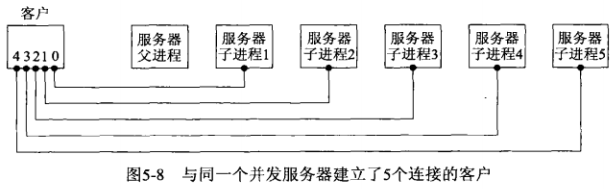

客户端终止，调用exit函数，5个连接基本在同一时刻终止，引发5个FIN。从而导致服务器的5个子进程基本在同一时刻终止，从而差不多同一时刻有5个SIGCHLD信号传递给父进程

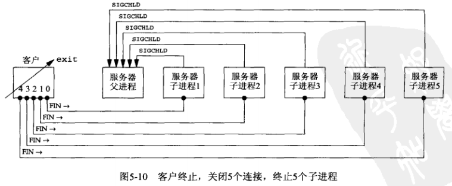

运行效果如下：

服务器

```shell
$ ./tcpserv03 #启动服务器

# 客户端键入EOF后
child 2411 terminated
child 2410 terminated
child 2412 terminated
child 2413 terminated
```

客户端

```shell
$ ./tcpcli04 127.0.0.1
hello
hello
Control-D

# 查看进程状态，可以看到仍然有僵死进程
$ ps -a -o pid,ppid,tty,stat,args,wchan
   PID   PPID TT       STAT COMMAND                     WCHAN
  2307   1668 pts/0    S+   ./tcpserv03                 inet_csk_accept
  2414   2307 pts/0    Z+   [tcpserv03] <defunct>       exit
```

书本中的效果是只有一个子进程被wait，还有4个僵死进程。但我的运行效果是4个子进程被wait，还有1个僵死进程。根据书中的说法，这有可能是FIN的时机没有同时到达导致的。

问题：所有5个信号都在信号处理函数执行之前产生，而信号处理函数只执行一次，因为Unix信号一般是不排队的

为了解决**遗留的僵死进程**问题，应该使用**waitpid**：在信号处理函数中循环调用waitpid（因为其在无已终止子进程时可以不阻塞，所以可以循环调用。而wait不能循环调用是因为它会阻塞）

```c
#include	"unp.h"

void
sig_chld(int signo)
{
	pid_t	pid;
	int		stat;
	//循环调用waipid，当有已终止子进程时，能马上处理
	while ( (pid = waitpid(-1, &stat, WNOHANG)) > 0)
		printf("child %d terminated\n", pid);
	return;
}
```

**最终版本的服务器main函数**

该版本的做到的：

- 1.当fork子进程时，必须捕获SIGCHLD信号
- 2.当信号捕获时，必须处理中断的系统调用
- 3.SIGCHLD的信号处理函数使用循环waitpid处理，避免留下僵死进程

```c
// 源码:tcpcliserv/tcpserv04.c
#include	"unp.h"

int
main(int argc, char **argv)
{
	int					listenfd, connfd;
	pid_t				childpid;
	socklen_t			clilen;
	struct sockaddr_in	cliaddr, servaddr;
	void				sig_chld(int);

	listenfd = Socket(AF_INET, SOCK_STREAM, 0);

	bzero(&servaddr, sizeof(servaddr));
	servaddr.sin_family      = AF_INET;
	servaddr.sin_addr.s_addr = htonl(INADDR_ANY);
	servaddr.sin_port        = htons(SERV_PORT);

	Bind(listenfd, (SA *) &servaddr, sizeof(servaddr));

	Listen(listenfd, LISTENQ);

	//1.、3.捕获SIGCHLD信号,并使用循环waitpid处理
	Signal(SIGCHLD, sig_chld);	/* must call waitpid() */

	for ( ; ; ) {
		clilen = sizeof(cliaddr);
		if ( (connfd = accept(listenfd, (SA *) &cliaddr, &clilen)) < 0) {
			//2.处理SIGCHLD信号发生导致的系统调用中断
			if (errno == EINTR)
				continue;		/* back to for() */
			else
				err_sys("accept error");
		}

		if ( (childpid = Fork()) == 0) {	/* child process */
			Close(listenfd);	/* close listening socket */
			str_echo(connfd);	/* process the request */
			exit(0);
		}
		Close(connfd);			/* parent closes connected socket */
	}
}
```

## 5.11 accept返回前连接中断

**accept返回错误的情况：**

- 1.捕获某个信号且相应处理函数返回时，该系统调用可能返回一个EINTR错误（如SIGCHLD信号）
- 2.ESTABLISHED状态的连接在调用accpet之前收到来自客户的RST，如图所示：


如何处理这种情况依赖于不同的实现：

- 1.Berkely版本：在内核中处理终止的连接，服务器进程看不到
- 2.SVR4版本：accpet返回一个EPROTO错误（“protocol error”，协议错误）
  - 解决方法：再次调用accept
- 3.POSIX：accpet返回一个ECONNABORTED错误（“software caused connection abort”）
  - 解决方法：再次调用accept

## 5.12 服务器进程终止

**客户端的str_cli函数**

```c
// lib/str_cli.c
#include	"unp.h"

void
str_cli(FILE *fp, int sockfd)
{
	char	sendline[MAXLINE], recvline[MAXLINE];
	//Fgets从客户端读入一行数据
	//当遇到文件结束符或错误，fgets（库函数）将返回一个空指针，于是客户端循环终止
	//Fgets包裹fgets，检查是否发送错误，发生则终止程序，因此Fgets只有遇到文件结束符时才返回一个空指针
	while (Fgets(sendline, MAXLINE, fp) != NULL) {
		//Writen把从客户端读到的数据发送到服务端
		Writen(sockfd, sendline, strlen(sendline));
		//Readline读取从服务器回射的数据
		if (Readline(sockfd, recvline, MAXLINE) == 0)
			err_quit("str_cli: server terminated prematurely");
		//Fputs把它写到标准输出
		Fputs(recvline, stdout);
	}
}
```

**问题描述**：处于ESTABLISHED的连接，服务器子进程崩溃（或被主动关闭），服务器子进程终止，并关闭所有打开着的描述符，导致向客户端发送FIN，而客户端则回应服务器ACK。此时由于客户端阻塞与Fgets而无法得知服务器已经发送了FIN，此时如果客户端再键入数据（向一个已经收到FIN的套接字发送数据，将收到一个RST），发送给服务器，服务器由于该连接的套接字已经终止，因此回应RST，之后，将会发生以下两种情况：

- 1.Readline函数发生在RST到达之前：那么Readline函数因为服务器的FIN（子进程终止时发送的）而返回0，即收到一个未预期的EOF，因此err_quit退出，并打印"str_cli: server terminated prematurely"（服务器过早终止）
- 2.Readline函数发生在RST到达之后：Readline中的readline返回一个ECONNRESET（"connection reset by peer"，对方复位连接错误），此时不会退出（Readline出错返回到str_cli，继续循环Fgets）。如果再向收到RST的套接字写数据，才会发生内核向进程发送SIGPIPE信号，并导致默认退出

**问题本质**：当FIN到达套接字时，客户正阻塞与Fgets调用上。客户实际上应该对两个描述符（套接字和用户输入）进行监听，而不能阻塞于其中一个

**解决方法**：可以通过select和poll来解决，使用这两个函数后，一旦杀死服务器子进程，客户就理解被告知收到FIN

## 5.13 SIGPIPE信号

当一个进程向某个已经收到RST的套接字执行写操作时，内核向该进程发送一个SIGPIPE信号。该信号的默认行为是终止进程，如果进程不希望被终止，需要捕获该信号

**可能出错的情景：**在readline之前，执行两次或更多的write操作。因为第一次write之前，服务器已经半关闭，第一次write（向一个已经收到FIN的套接字写）将收到RST，而继续write（向一个已经收到RST的套接字写），则会引发SIGPIPE错误

**注意：**写一个已经收到FIN的套接字是没有问题的，此时服务器会回应RST，再次写一个收到RST的套接字，将引发SIGPIPE信号

**处理SIGPIPE的方法：**

- 1.如果没有特殊的事情要做，则将信号处理处理办法设为SIG_IGN，并假设后续的输出操作将捕获EPIPE错误并终止
- 2.如果信号出现时需要采取措施（如记录日志），就需要捕获信号，并编写信号处理函数

## 5.14 服务器主机崩溃

**服务器主机崩溃（或网络不可达）：**区别于“服务器进程终止（会发送FIN）”和“服务器因操作员执行命令关机（会发送FIN）”。崩溃应该是指死机、拔网线、拔电线一类的（不发送FIN）

**过程描述：**

- 1.客户与服务器建立连接，处于ESTABLISHED状态


- 2.服务器主机崩溃，不发送FIN
- 3.客户键入文本，调用Writen写入内核，并由客户TCP发送分节
- 4.客户阻塞于readline，等待回射的应答
- 5.客户TCP持续重传数据分组，试图从服务器上收到ACK
- 6.客户TCP放弃，给客户进程返回一个错误，此时客户仍然阻塞于readline，readline将返回该错误

**错误的类别：**

根据情况不同，有可能发生不同的错误

- 1.如果某个中间路由器判定服务器主机已经不可达，则路由向客户主机发送"destination unreachable"（目的地不可达）ICMP消息，那么客户TCP向客户进程返回的错误是EHOSTUNREACH或ENETUNREACH
- 2.服务器主机崩溃，客户的数据分节没有响应，返回错误ETIMEDOUT（超时）

**解决方法：**

在本例中，只有我们向服务器发送数据时才能检测出它已经崩溃，如果不主动发送也想检测到服务器主机崩溃，可以使用SO_KEEPLIVE（心跳机制，7.5节介绍）

## 5.15 服务器主机崩溃后重启

**前提：**不使用SO_KEEPLIVE，即客户不主动给服务器发送数据，客户将不会知道服务器主机已经崩溃

**过程描述：**

- 1.客户与服务器建立连接，处于ESTABLISHED状态
- 2.服务器主机崩溃并重启
- 3.客户键入文本，调用Writen写入内核，并由客户TCP发送分节
- 4.客户阻塞于readline，等待回射的应答
- 5.当服务器重启好后，服务器TCP丢失了崩溃前所有的连接信息，因此服务器TCP收到客户的数据分节响应以RST
- 6.当客户TCP收到服务器的RST，此时客户阻塞于readline，导致该调用返回ECONNRESET错误（"connection reset by peer"，对方复位连接错误），此时不会退出（Readline出错返回到str_cli，继续循环Fgets）。如果再向收到RST的套接字写数据，才会发生内核向进程发送SIGPIPE信号，并导致默认退出

## 5.16 服务器主机关机

**过程描述**

- 1.Unix系统关机
- 2.init进程向所有进程发送SIGTERM信号（该信号可被捕获）
  - 若不忽略该信号，该信号默认行为是终止进程，进程终止后，跳到第5步
  - 若忽略该信号，继续第3步
- 3.等待一段固定的时间（5到20秒）
- 4.给所有仍然在运行的进程发送SIGKILL信号（该信号不能被捕获），所有进程被终止
- 5.服务器进程终止时，它将关闭所有打开着的描述符，发送FIN

## 5.18 数据格式

### 5.18.1 例子：在客户与服务器之间传递文本串

**要求：**

- 1.客户端：键入包含空格分开的两个整数
- 2.服务器：返回客户端输入的两个整数的和

需要修改的只是服务器的str_echo函数

```c
// 源码：tcpcliserv/str_echo08.c
#include	"unp.h"

void
str_echo(int sockfd)
{
	long		arg1, arg2;
	ssize_t		n;
	char		line[MAXLINE];

	for ( ; ; ) {
		if ( (n = Readline(sockfd, line, MAXLINE)) == 0)
			return;		/* connection closed by other end */
		//sscanf把文本串中的两个参数转换为长整数
		if (sscanf(line, "%ld%ld", &arg1, &arg2) == 2)
			//snprintf把结果转换为文本串
			snprintf(line, sizeof(line), "%ld\n", arg1 + arg2);
		else
			snprintf(line, sizeof(line), "input error\n");

		n = strlen(line);
		Writen(sockfd, line, n);
	}
}
```

### 5.18.2 例子：在客户与服务器之间传递二进制结构

**要求**：客户和服务器穿越套接字传递二进制值

**三个潜在问题：**

- 1.不同的实现以不同的格式存储二进制数
  - 如使用大端字节序或小端字节序
- 2.不同的实现在存储相同的C数据类型上可能存在异常
  - 大多数32位Unix系统使用32位表示长整数，而64位系统却使用64位来表示长整数
  - short、int或long等整数类型，各自的大小也都没有明确的保证
- 3.不同的实现给结构打包的方式存在差异
  - 打包方式取决于各种数据类型所使用的位数以及机器的对齐限制

**解决方法**

- 1.把所有的数值数据作为文本串来传递（前提是客户与服务器主机具有相同的字符集）
- 2.显示定义所支持数据类型的二进制格式（位数、大端或小端字节序），并以这样的格式在客户与服务器之间传递所有数据
  - 远程过程调用软件包通常使用这种技术

**问题描述**

客户和服务器的main函数不需要修改，只需修改客户的`str_cli`函数和服务器的`str_echo`函数，同时，为参数和结果定义结构

```c
// 源码: tcpcliserv/sum.h
//为参数和结果定义结构
struct args {
  long	arg1;
  long	arg2;
};

struct result {
  long	sum;
};
```

**客户端str_cli**

```c
// 源码：tcpcliserv/str_cli09.c

#include	"unp.h"
#include	"sum.h"

void
str_cli(FILE *fp, int sockfd)
{
	char			sendline[MAXLINE];
	struct args		args;
	struct result	result;

	while (Fgets(sendline, MAXLINE, fp) != NULL) {
		//sscanf把两个参数从文本串转换为二进制数
		if (sscanf(sendline, "%ld%ld", &args.arg1, &args.arg2) != 2) {
			printf("invalid input: %s", sendline);
			continue;
		}
		//将参数数据结构发送给服务器
		Writen(sockfd, &args, sizeof(args));
		//读取服务器回应
		if (Readn(sockfd, &result, sizeof(result)) == 0)
			err_quit("str_cli: server terminated prematurely");
		//输出结果
		printf("%ld\n", result.sum);
	}
}
```

**服务器str_echo**

```c
// 源码：tcpcliserv/str_echo09.c

#include	"unp.h"
#include	"sum.h"

void
str_echo(int sockfd)
{
	ssize_t			n;
	struct args		args;
	struct result	result;

	for ( ; ; ) {
		//读入参数
		if ( (n = Readn(sockfd, &args, sizeof(args))) == 0)
			return;		/* connection closed by other end */
		//计算和
		result.sum = args.arg1 + args.arg2;
		//把结果结果发回客户
		Writen(sockfd, &result, sizeof(result));
	}
}
```

**结果展示**

情况一：如果客户和服务器具有相同的体系结构，不会存在什么问题

```shell
$ tcpcli09 12.106.32.254
11 22                  #客户键入两个数
33                     #服务器应答
-11 -44                #客户再次键入两个数
-55                    #服务器应答
```

情况二：如果客户和服务器具有不同的体系结构，则无法正常工作

```shell
$ tcpcli09 12.106.32.254
1 2                    #客户键入两个数
3                      #服务器应答，结果正确
-22 -77                #客户再次键入两个数
-16777314              #服务器应答，结果错误
```

# 第6章 I/0复用：select和poll函数

内核一旦发现进程指定的一个或多个I/O条件就绪（也就是说输入已准备好被读取，或描述符已能承接更多的输出），它就通知进程，这个能力称为I/O复用，是由select、poll、pselect、epoll函数支持的

I/O复用适合的网络应用场景：

- 1.当客户处理多个描述符（交互式输入和网络套接字）时
- 2.一个客户同时处理多个套接字
- 3.TCP服务器既要处理监听套接字，又要处理已连接套接字
- 4.服务器既要处理TCP，又要处理UDP
- 5.服务器要处理多个服务或者多个协议

I/O复用并非只限于网络编程，许多重要的应用程序也需要使用这项技术

## 6.2 I/O模型

**五种I/O模型**：阻塞式I/O、非阻塞I/O，I/O复用，信号驱动式I/O，异步I/O

对于一次IO访问（以read举例），数据会先被拷贝到操作系统内核的缓冲区中，然后才会从操作系统内核的缓冲区拷贝到应用程序的地址空间。所以说，当一个read操作发生时，它会经历两个阶段：

- 等待数据准备 (Waiting for the data to be ready)：数据拷贝到操作系统内核的缓冲区中
  - 涉及等待数据从网络中到达，当所等待分组到达时，它被复制到内核中的某个缓冲区
- 将数据从内核拷贝到进程中 (Copying the data from the kernel to the process)
  - 把数据从内核缓冲区复制到应用进程缓冲区

**下面的例子环境说明：**

基于udp进行说明，因为概念较简单

### 6.2.1 阻塞式I/O模型

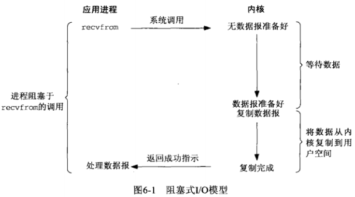

默认情况下，所有套接字都是阻塞的

把recvfrom视为系统调用

进程调用recvfrom，其系统调用直到

- 1.数据报到达且被复制到应用进程的缓冲区中
- 2.发生错误

才返回

### 6.2.2 非阻塞式I/O模型

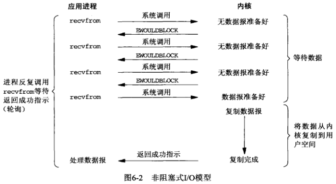

把一个套接字设为非阻塞是在通知内核：当所请求的I/O操作非得把本进程投入睡眠才能完成时，不把本进程投入睡眠，而是返回一个错误（EWOULDBLOCK）

如果调用recvfrom已有一个数据报准备好，它将被复制到应用进程缓冲区，然后recvfrom成功返回

这种方式也称为**轮询**：应用进程持续轮询内核，以查看某个进程是否就绪。这样做往往消耗大量CPU时间

### 6.2.3 I/O复用模型

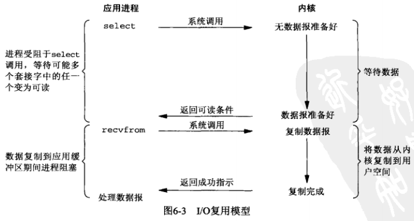

有了I/O复用模型，就可以调用select或poll并阻塞在这两个系统调用中，而不是阻塞在真正的I/O系统调用上

执行步骤：

- 1.阻塞于select调用，等待数据报套接字变为可读
- 2.select返回套接字可读
- 3.调用recvfrom把所读数据报复制到应用进程缓冲区

### 6.2.4 信号驱动式I/O模型

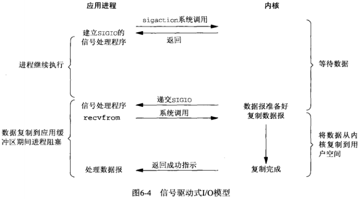

**步骤：**

- 1.开启套接字的信号驱动式I/O功能（在25.2节讲解）
- 2.通过sigaction系统调用安装一个信号处理函数，该系统调用立即返回
- 3.进程继续工作，不阻塞
- 4.当数据准备好读取时（在内核缓冲区中），内核为该进程产生一个SIGIO信号
- 5.接着，可以有两种方式：
  - 5.1.信号处理函数中调用recvfrom读取数据报，并通知主循环数据已经准备好待处理
  - 5.2.立即通知主循环，让它读取数据报

### 6.2.5 异步I/O模型

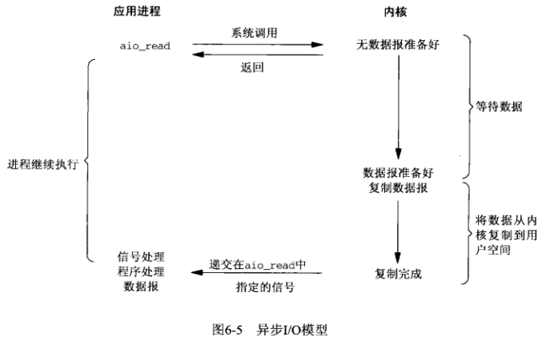

**工作机制**：进程告知内核启动某个操作，并让内核在整个操作（包括将数据从内核复制到进程缓冲区）完成后再通知进程

**信号驱动式I/O模型与异步I/O模型的主要区别**：信号驱动式I/O由内核通知进程**何时启动**一个I/O操作（recvfrom），而异步I/O模型由内核通知进程I/O操作**合适完成**

**步骤：**

- 1.调用aio_read函数，给内核传递描述符、缓冲区指针、缓冲区大小、文件偏移，并告知内核当整个操作完成时通知进程。该系统调用立即返回
- 2.在等待I/O期间，进程不阻塞
- 3.数据复制到应用程序缓冲区后，内核向进程发送某个信号

**注意**：本书编写的时候，支持POSIX异步I/O模型的系统仍较罕见

### 6.2.6 各种I/O模型的比较

**各种模型的区别**

- 前4种之间的区别：第一阶段是否阻塞；他们的第二阶段都是一样的（阻塞）
- 同步（前4种）与异步（第5种）的区别：第二阶段是否阻塞（真正的I/O操作：recvfrom阶段是否阻塞）

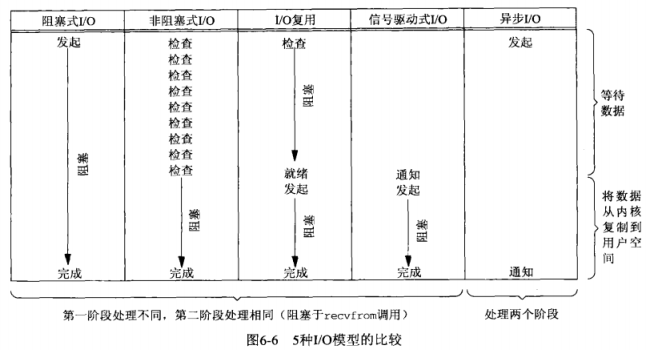

## 6.3 select函数

```c
#include <sys/select.h>
#include <sys/time.h>

int select(int maxfpd1, fd_set *readset, fd_set *writeset, fd_set *exceptset, const struct timeval *timeout);
```

**参数解释**

- **timeout:**

作用：告知内核等待所指定描述符中的任何一个就绪可花多长时间

```c
struct timeval {
    long tv_sec; //秒数
    long tv_usec; //微秒
};
```

timeout参数有**三种可能**

- 1.空指针：永远等待，仅在一个描述符准备好I/O时才返回
- 2.timeval指定秒数和微秒数：等待设定的时间，在有一个描述符准备好I/O才返回
- 3.timeval的两个变量值为0：不等待，检查描述符后立即返回，也称为轮询

select**返回的情况**

- 1.一个或多个描述符就绪
- 2.等待期间，从信号处理函数返回时，得到EINTR错误（永远等待、等待设定时间情况下可能发生）

timeout中**const表示**：timeout中的变量值不会被select修改为剩余时间


- **readset、writeset、expectset：**

表示让内核测试读就绪、写就绪和异常条件的描述符集

异常条件有：

- 1.某个套接字的带外数据的到达（第24章）
- 2.某个已置为分组模式的伪终端存在可从其主端读取的控制状态信息

三个中，如果对某一个条件不感兴趣，可以设为空指针。如果三个都设为空指针，select就成为一个比Unix的sleep函数更精确的定时器

三个都是**值-结果参数**：

- 1.调用函数时：指定所关心的描述符的值
- 2.函数返回时：描述符就绪，则设为1；未就绪，则设为0
- 3.函数返回后：使用`FD_ISSET`宏来测试`fd_set`数据类型中的描述符
- 4.每次重新调用select时，需要再次把描述符集内所关心的位设为1

描述符集的实质是：整数数组，每一位对应一个描述符

**相关操作**

```c
void FD_ZERO(fd_set *fdset); //清除描述符集中的所有位
void FD_SET(int fd, fd_set *fdset); //将fd描述符的位设为1，表示对此感兴趣
void FD_CLR(int fd, fd_set *fdset); //将fd描述符的位设为0，表示对此不感兴趣
void FD_ISSET(int fd, fd_set *fdset); //测试fd描述符是否为1
```

**例子**

```c
fd_set rset;
FD_ZERO(&rset); //初始化，一定要做，否则后果不可预期
FD_SET(1,&rset); //对1描述符设为感兴趣
FD_SET(4,&rset); //对4描述符设为感兴趣
FD_SET(5,&rset); //对5描述符设为感兴趣
```


- **maxfdp1**

指定待测试的描述符个数，它的值是最大描述符加1（并不只是值为1的个数），例如打开描述符1、4、5，则maxfdp1的值是6（即[0,5]范围有几个描述符）。这样做的目的是为了效率，maxfdp1之后的描述符可以不轮训

### 6.3.1 描述符就绪条件

**套接字准备好读**

- 1.套接字接收缓冲区中的数据字节大于等于套接字接收缓冲区低水位标记的当前大小
  - 返回情况：不阻塞，返回一个大于0的值（返回准备好读入的数据大小）
  - 低水平标记：使用SO_RCVLOWAT套接字选项设置，TCP、UDP默认为1
- 2.套接字连接读半部关闭（接收了对端的FIN的TCP连接）
  - 返回情况：不阻塞，返回0（即EOF）
- 3.套接字是一个监听套接字，已完成连接数不为0
  - 返回情况：accept函数不阻塞，返回一个已连接套接字的sockfd
- 4.有套接字错误待处理
  - 返回情况：不阻塞，返回-1，把errno设为错误条件
  - 获取错误方式：
    - errno
    - 指定SO_ERROR套接字选项调用getsockopt获取并清除

**套接字准备好写**

- 1.套接字发送缓冲区中的可用空间字节数大于等于套接字发送缓冲区低水位标记的当前大小
  - 套接字条件：已连接（TCP），不需要连接（UDP）
  - 返回情况：如果套接字设为非阻塞，不阻塞，返回一个正值（由传输层可接受的字节数）
  - 低水平标记：使用SO_SNDLOWAT套接字选项设置，TCP、UDP默认为1024
- 2.套接字连接写半部关闭（本端已经发送FIN）
  - 对写半关闭的套接字写，将产生SIGPIPE信号（对于收到RST的套接字写也会产生该信号）
- 3.使用非阻塞式connect的套接字已建立连接，或connect已经以失败告终
- 4.有套接字错误待处理
  - 返回情况：不阻塞，返回-1，把errno设为错误条件
  - 获取错误的方式：
    - errno
    - 指定SO_ERROR套接字选项调用getsockopt获取并清除
- 5.如果一个套接字存在带外数据或仍处于带外标记，那么它有异常条件待处理

**注意**：当某个套接字发生错误时，它将由select标记为既可读又可写

**低水位标记**

- 接收低水位标记和发送低水位标记的**目的**：允许应用进程控制在select返回可读或可写条件之前有多少数据可读或有多大空间可用于写
- 任何UDP套接字只要其发送低水位标记小于等于发送缓冲区大小，则总是可以写，因为UDP不需要连接

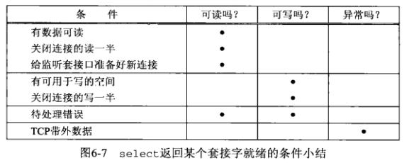

**select的优缺点**

优点：

- **跨平台支持好**，目前几乎在所有平台上支持

缺点：

- **最大的缺点是，进程打开的fd有限**（由FD_SETSIZE和内核决定，一般为1024），这对于连接数量比较大的服务器来说根本不能满足（可以选择多进程的解决方案，虽然Linux上创建进程的代价比较小，但也不可忽视，加上进程间数据同步远比不上线程间同步的效率，所以也不是一直完美的方案）
- **函数返回后需要轮询描述符集，寻找就绪描述符，效率不高**
- **用户态和内核态传递描述符结构时copy开销大**

### 6.3.2 select的最大描述符数

**每个进程使用描述符的限制**：数目无上限，只受限于内存总量和管理性限制

select最大限制：1024个（32位系统）

相关文件与宏

```c
#include <sys/types.h> //或#include <sys/select.h>
#ifndef FD_SETSIZE
#define FD_SETSIZE 256 //但但修改这个值是无法扩展select描述符数的最大限制的
#endif
```

## 6.4 str_cli函数（select修订版1）

调用select所处理的各种条件

- 1.fgets调用
- 2.客户套接字

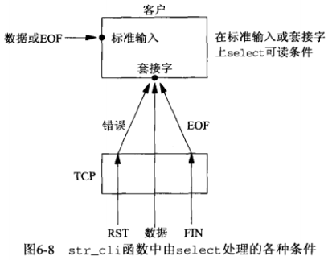

如图的客户**套接字**的三个条件处理如下：

- 1.对端TCP发送数据，该套接字变为可读，read返回一个大于0的值（读入数据的字节数）
- 2.对端TCP发送FIN（对端进程终止），该套接字变为可读，read返回0（EOF）
- 3.对端TCP发送RST（对端主机崩溃并重启），该套接字变为可读，read返回-1，errno设为错误码

```c
// select/strcliselect01.c
#include	"unp.h"

void
str_cli(FILE *fp, int sockfd)
{
	int			maxfdp1;
	fd_set		rset;
	char		sendline[MAXLINE], recvline[MAXLINE];
	//初始化描述符集
	FD_ZERO(&rset);
	for ( ; ; ) {
		//fileno(fp)把标准I/O文件指针fp转换为对应的描述符
		FD_SET(fileno(fp), &rset);
		//将套接字描述符设为关心
		FD_SET(sockfd, &rset);
		//获取两个描述符中的较大值，并+1计算出maxfdp1值
		maxfdp1 = max(fileno(fp), sockfd) + 1;
		//包裹函数Select，增加了返回值小于0的错误处理
		//将readset和writeset设为NULL，表示不感兴趣
		//将timeout设为NULL，表示永远等待，直到有描述符准备好
		Select(maxfdp1, &rset, NULL, NULL, NULL);
		//如果套接字可读
		if (FD_ISSET(sockfd, &rset)) {	/* socket is readable */
			//读取套接字
			if (Readline(sockfd, recvline, MAXLINE) == 0)
				//如果套接字返回0，表示对端进程终止，输出错误并退出客户进程
				err_quit("str_cli: server terminated prematurely");
			//输出套接字读入的结果
			Fputs(recvline, stdout);
		}
		//如果标准输入可读
		if (FD_ISSET(fileno(fp), &rset)) {  /* input is readable */
			//读取标准输入
			if (Fgets(sendline, MAXLINE, fp) == NULL)
                //如果为NULL表示读到EOF,退出客户进程
				return;		/* all done */
			//将标准输入读到的内容写入套接字
			Writen(sockfd, sendline, strlen(sendline));
		}
	}
}
```

## 6.5 批量输入

批量输入时，6.4节版本的str_cli函数存在的问题：

- 1.批量方式下，标准输入中的EOF并不意味着同时也完成了从套接字的读入。可能仍有请求在去往服务器的路上，或有应答在返回客户的路上
  - 解决方法：写半关闭，当标准输入读到EOF时，给服务器发送FIN，告诉它我们完成了数据发送，但仍然保持套接字描述符打开以便读取
  - 解决函数：shutdown
- 2.客户进程使用文本作为输入（标准输入）时，fgets函数读取输入时，文本输入行被读入到stdio所用的缓冲区中，而fgets只返回其中一行，其余输入仍在stdio缓冲区中。write只将其中一行写给服务器，随后select再次被调用而等待新的工作，而不管stdio缓冲区中还有额外的输入待消费
  - 原因：select不知道stdio使用了缓冲区，它只从read系统调用的角度考虑是否有数据可读，而不是在fgets的角度考虑（//TODO：read和fgets的区别是什么）
- 3.客户进程从套接字读取时，在readline调用时，套接字缓冲区也存在2.中提到的问题

这里提到的三个问题将在6.7节中的str_cli函数（select修订版2）中解决

## 6.6 shutdown函数

close函数有两个限制，可以使用shutdown来避免

close的限制：

- 1.close把描述符的引用计数-1，仅在计数变为0时才关闭套接字。shutdown可以不管引用计数，直接激发TCP的正常连接终止序列
- 2.close终止读和写两个方向的数据传送。shutdown可以告知对端已经完成了数据发送，但仍然可以接收对方发送的数据

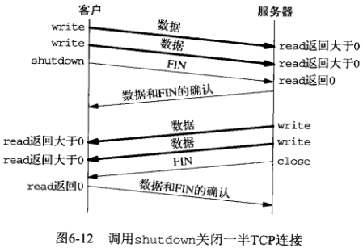

```c
#include <sys/socket.h>
//返回：成功返回0，出错返回-1
int shutdown(int sockfd, int howto);
```

**howto参数的解释**

- 1.**SHUT_RD**：关闭连接的读，套接字不再有数据可接收
  - 套接字接收缓冲区中的现有数据被丢弃
  - 进程不能再对这样的套接字调用任何读函数
  - 由该套接字接收的来自对端的任何数据都被确认，然后丢弃
- 2.**SHUT_WR**：关闭连接的写，对于TCP套接字，也称为**半关闭**
  - 套接字发送缓冲区中的数据被发送，接着发送TCP的终止序列FIN
  - 该方式不管套接字引用计数是否为0
  - 进程不能对该套接字调用任何写函数
- 3.**SHUT_RDWR**:先关闭连接的读，再关闭连接的写
  - 等效于连接先后调用1.2.

（//TODO:这张图中关于close的部分还需要去了解）

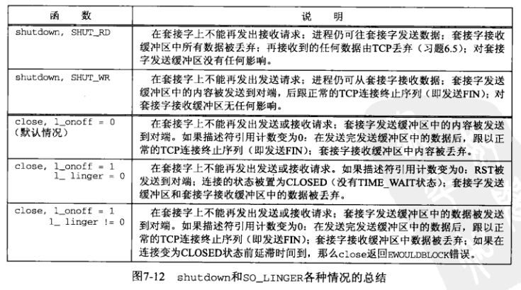

## 6.7 str_cli函数（select修订版2）

解决6.5节中在批量数据下提出的三个问题：输入的EOF不代表进程结束问题、标准输入（文件输入）缓冲区问题、套接字接收缓冲区问题

```c
// 源码：select/strcliselect02.c
#include	"unp.h"

void
str_cli(FILE *fp, int sockfd)
{
	//当标准输入键入EOF时，表示不会再有新的内容发往服务器
	//此时客户只需要等待所有“回射”的数据都被接收到后，就能
	//返回，stdineof就是记录是否已经键入EOF
	int			maxfdp1, stdineof;
	fd_set		rset;
	char		buf[MAXLINE];
	int		n;

	stdineof = 0;
	FD_ZERO(&rset);
	for ( ; ; ) {
		//如果标准输入EOF标记不为0，则对标准输入描述符设为关心
		if (stdineof == 0)
			FD_SET(fileno(fp), &rset);
		FD_SET(sockfd, &rset);
		maxfdp1 = max(fileno(fp), sockfd) + 1;
		Select(maxfdp1, &rset, NULL, NULL, NULL);

		if (FD_ISSET(sockfd, &rset)) {	/* socket is readable */
			//如果套接字遇到EOF
			//使用Read直接对套接字缓存进行操作，上一版本使用Readline
			if ( (n = Read(sockfd, buf, MAXLINE)) == 0) {
				//如果标准输入也已经EOF，则表示正常的终止
				if (stdineof == 1)
					return;		/* normal termination */
				else //否则，标准输入没有遇到EOF，说明服务器进程提前终止
					err_quit("str_cli: server terminated prematurely");
			}

			Write(fileno(stdout), buf, n);
		}

		if (FD_ISSET(fileno(fp), &rset)) {  /* input is readable */
			//如果标准输入遇到EOF
			//使用Read直接对缓冲区进行操作，上一版本使用Fgets
			if ( (n = Read(fileno(fp), buf, MAXLINE)) == 0) {
				//将标准输入EOF标记设为1
				stdineof = 1;
				//写端关闭
				Shutdown(sockfd, SHUT_WR);	/* send FIN */
				//取消对标准输入描述符的关心
				FD_CLR(fileno(fp), &rset);
				continue;
			}

			Writen(sockfd, buf, n);
		}
	}
}
```

**比较Read、Realine、Fgets**

Read的实现

```c
// lib/wrapunix.c
ssize_t
Read(int fd, void *ptr, size_t nbytes)
{
	ssize_t		n;

	if ( (n = read(fd, ptr, nbytes)) == -1)
		err_sys("read error");
	return(n);
}
```

Realine的实现

```c
// lib/readline.c
ssize_t
Readline(int fd, void *ptr, size_t maxlen)
{
	ssize_t		n;

	if ( (n = readline(fd, ptr, maxlen)) < 0)
		err_sys("readline error");
	return(n);
}
```

Fgets的实现

```c
// lib/wrapstdio.c
char *
Fgets(char *ptr, int n, FILE *stream)
{
	char	*rptr;

	if ( (rptr = fgets(ptr, n, stream)) == NULL && ferror(stream))
		err_sys("fgets error");

	return (rptr);
}
```

归根结底是read、readline和fgets的区别

[gets、fgets、puts、fputs、scanf、read、readline、getline等](https://blog.csdn.net/taozhi20084525/article/details/26606149)

- fgets:
  - 当遇到换行符或者缓冲区已满，fgets就会停止，返回读到的数据。注意换行符会被保存在缓冲区中，只是后面再加个'\0'
  - 对于fgets来说，'\n'是一个特别的字符，而'\0'并无任何特别之处，如果读到'\0'就当作普通字符读入。如果文件中存在'\0'字符（或者0x00字节），调用fgets之后就无法判断缓冲区中的'\0'究竟是从文件读上来的字符还是由fgets自动添加的结束符，所以fgets只适合读文本文件而不适合读二进制文件，并且文本文件中的所有字符都应该是可见字符，不能有'\0'。
- readline库:
  - readline 是一个强大的库，只要使用了它的程序，都可以用同一个配置文件配置，而且用同样的方法操作命令行，让你可以方便的编辑命令行
- read
  - 是一个系统调用，其他函数会调用该函数
  - read 函数从 filedes 指定的已打开文件中读取 nbytes 字节到 buf 中


## 6.8 TCP回射服务器程序（select修订版）

使用select重写TCP回射服务器程序，可以不使用多进程的方式处理任意个客户连接

```c
// 源码：tcpcliserv/tcpservselect01.c

/* include fig01 */
#include	"unp.h"

int
main(int argc, char **argv)
{
	/*
	* @maxi:client数组当前使用项的最大下标
	* @maxfd：目前select监听的最大描述符
	*/
	int					i, maxi, maxfd, listenfd, connfd, sockfd;
	/*
	* @nready:本次调用select返回了几个就绪描述符
	* @client[FD_SETSIZE]：存储客户套接字的数组
	*/
	int					nready, client[FD_SETSIZE];
	ssize_t				n;
	fd_set				rset, allset;
	char				buf[MAXLINE];
	socklen_t			clilen;
	struct sockaddr_in	cliaddr, servaddr;

	listenfd = Socket(AF_INET, SOCK_STREAM, 0);

	bzero(&servaddr, sizeof(servaddr));
	servaddr.sin_family      = AF_INET;
	servaddr.sin_addr.s_addr = htonl(INADDR_ANY);
	servaddr.sin_port        = htons(SERV_PORT);

	Bind(listenfd, (SA *) &servaddr, sizeof(servaddr));

	Listen(listenfd, LISTENQ);

	maxfd = listenfd;			/* initialize */
	maxi = -1;					/* index into client[] array */
	for (i = 0; i < FD_SETSIZE; i++)
		client[i] = -1;			/* -1 indicates available entry */
	FD_ZERO(&allset);
	FD_SET(listenfd, &allset);
/* end fig01 */

/* include fig02 */
	for ( ; ; ) {
		rset = allset;		/* structure assignment */
		nready = Select(maxfd+1, &rset, NULL, NULL, NULL);

		//如果监听套接字就绪
		if (FD_ISSET(listenfd, &rset)) {	/* new client connection */
			clilen = sizeof(cliaddr);
			connfd = Accept(listenfd, (SA *) &cliaddr, &clilen);
#ifdef	NOTDEF
			printf("new client: %s, port %d\n",
					Inet_ntop(AF_INET, &cliaddr.sin_addr, 4, NULL),
					ntohs(cliaddr.sin_port));
#endif

			//将新的客户套接字存入客户套接字数组
			for (i = 0; i < FD_SETSIZE; i++)
				if (client[i] < 0) {
					client[i] = connfd;	/* save descriptor */
					break;
				}
			//套接字数组已满
			if (i == FD_SETSIZE)
				err_quit("too many clients");

			FD_SET(connfd, &allset);	/* add new descriptor to set */
			if (connfd > maxfd)
				maxfd = connfd;			/* for select */
			if (i > maxi)
				maxi = i;				/* max index in client[] array */

			//如果本次select只有监听套接字就绪，直接重新调用select		
			if (--nready <= 0)
				continue;				/* no more readable descriptors */
		}

		//处理已连接套接字
		for (i = 0; i <= maxi; i++) {	/* check all clients for data */
			if ( (sockfd = client[i]) < 0)
				continue;
			if (FD_ISSET(sockfd, &rset)) {
				//已连接套接字读到EOF
				if ( (n = Read(sockfd, buf, MAXLINE)) == 0) {
						/*4connection closed by client */
					Close(sockfd);
					FD_CLR(sockfd, &allset);
					client[i] = -1;
				} else
					Writen(sockfd, buf, n);

				if (--nready <= 0)
					break;				/* no more readable descriptors */
			}
		}
	}
}
/* end fig02 */
```

**本方案优缺点：**

**优点**：避免为每个客户创建一个新进程的所有开销

**缺点**：拒绝服务型攻击


**拒绝服务型攻击：**

情景描述：如果一个恶意客户连接到服务器，发送一个字节的数据（不是换行符）后进入睡眠。服务器将调用read，从客户读入这个字节的数据，然后阻塞于下一个read调用，以等待来自该客户的其余数据。服务器于是因该客户而被阻塞（或挂起），不能再为其他任何客户提供服务（接受新客户连接或读取现有客户的数据），直到那个恶意客户发送一个换行符或终止为止

当一个服务器处理多个客户时，绝不能阻塞于只与单个客户相关的某个函数调用，否则可能导致服务器被挂起，拒绝为所有其他客户提供服务，这就是**拒绝服务型攻击**

解决方法：

- 1.使用非阻塞I/O
- 2.让每个客户单独的控制线程提供服务（例如为每个客户创建一个子进程或一个线程）
- 3.对I/O操作设置一个超时

## 6.9 pselect函数

pselect函数由POSIX发明

```c
#include <sys/select.h>
#include <signal.h>
#include <time.h>

int pselect(int maxfd1,fd_set *readset,fd_set *writeset,fd_set *exceptset, const struct timespec *timeout,const sigset_t *sigmask);
```

**与select的区别**：

- 1.**使用timespec结构，而不是timeval结构**。timespec的第二个成员是纳秒级，2而timeval的第二个成员是微妙级

```c
struct timespec {
    time_t tv_sec; //秒，这里也有区别，timeval中tv_sec为long类型
    long tv_nsec; //纳秒
}
```

- 2.**增加了第6个参数：一个指向信号掩码的指针**。该参数运行程序先禁止递交某些信号，再测试由这些当前被禁止信号的信号处理函数设置的全局变量，然后调用pselect，告诉它重新设置信号掩码（调用pselect时，根据sigmask代替进程的信号掩码，当pselect返回时，进程的信号 掩码又被重置为调用pselect之前的值）

## 6.10 poll函数

```c
#include <poll.h>

/*
** @fdarray:指向pollfd结构数组第一个元素的指针，pollfd用于指定测试某个给定描述符fd的条件
** @nfds：fdarray数组中元素的个数
** @timeout：设置poll函数返回前等待多长时间
**                    1. INFTIM（一个负值）：永远等待下去
**                    2. 0：立即返回，不阻塞进程
**                    3. >0：等待指定数目的毫秒数
** @返回值：
**       1. 正整数：所有就绪描述符的数目
**       2. 0：超时
**       3. -1：出错
*/
int poll(struct pollfd *fdarray, unsigned int nfds, int timeout);

/*
** events、revents不使用值-结果参数，可以避免每次调用poll函数前都要重新初始化
** 如果不再关心某个特定描述符，可以把与之对应的pollfd结构的fd成员设置成一个负值
** poll函数将忽略这样的pollfd结构的events成员，返回时将其revents成员的值置为0
*/
struct pollfd{
    int fd;         //需要测试的描述符
    short events;   //该描述符上测试的事件
    short revents;  //该描述符上发生的事件
};
```

**events与revents的值**


- 第一部分是处理输入的4个常值
- 第二部分是处理输出的3个常值
- 第三部分是处理错误的3个常值

对于**普通数据**、**优先级带数据**、**高优先级数据**、**错误**的解释

- 所有正规TCP数据和所有UDP数据都被认为是**普通数据**
- TCP连接读半部关闭时（如收到一个来自对端的FIN），被认为是**普通数据**，随后读操作返回0
- TCP连接存在错误既可认为是**普通数据**，也可认为是**错误**。随后的读操作返回-1，并设置error（可用于处理诸如接收到RST或发生超时等条件）
- TCP的带外数据被认为是**优先级带数据**
- 在监听套接字上有新连接可用，既可认为是**普通数据**也可认为是**优先级带数据**
- 非阻塞式connect的完成被认为是使用套接字可写

**poll的优缺点**

优点：

- **没有最大监视描述符数量的限制**：分配一个pollfd结构的数组并把该数组中元素的数目通知内核成了调用者的责任。内核不再需要知道类似fd_set的固定大小的数据类型

缺点：

- 和select一样，调用返回后需要**轮询所有描述符来获取已经就绪的描述符**
- **用户态和内核态传递描述符结构时copy开销大**

## 6.11 TCP回射服务器程序（poll修订版）

使用poll代替select重写6.8节中的TCP回射服务器程序

在6.8的select版本中，必须分配一个client数组和一个rset描述符集

在本版本中只需要分配一个pollfd结构的数组来维护客户信息

```c
// 源码：tcpcliserv/tcpservpoll01.c
/* include fig01 */
#include	"unp.h"
#include	<limits.h>		/* for OPEN_MAX */

int
main(int argc, char **argv)
{
	//含有client数组当前正在使用的最大下标
	int					i, maxi, listenfd, connfd, sockfd;
	int					nready;
	ssize_t				n;
	char				buf[MAXLINE];
	socklen_t			clilen;
	struct pollfd		client[OPEN_MAX];
	struct sockaddr_in	cliaddr, servaddr;

	listenfd = Socket(AF_INET, SOCK_STREAM, 0);

	bzero(&servaddr, sizeof(servaddr));
	servaddr.sin_family      = AF_INET;
	servaddr.sin_addr.s_addr = htonl(INADDR_ANY);
	servaddr.sin_port        = htons(SERV_PORT);

	Bind(listenfd, (SA *) &servaddr, sizeof(servaddr));

	Listen(listenfd, LISTENQ);
	//client数组的一个项用于监听套接字
	client[0].fd = listenfd;
	//给监听套接字设为POLLRDNORM事件
	client[0].events = POLLRDNORM;
	//其余各项的描述符成员设为-1，表示当前不关心，poll函数将忽略这样的pollfd结构
	for (i = 1; i < OPEN_MAX; i++)
		client[i].fd = -1;		/* -1 indicates available entry */
	maxi = 0;					/* max index into client[] array */
/* end fig01 */

/* include fig02 */
	for ( ; ; ) {
		nready = Poll(client, maxi+1, INFTIM);

		if (client[0].revents & POLLRDNORM) {	/* new client connection */
			clilen = sizeof(cliaddr);
			connfd = Accept(listenfd, (SA *) &cliaddr, &clilen);
#ifdef	NOTDEF
			printf("new client: %s\n", Sock_ntop((SA *) &cliaddr, clilen));
#endif

			for (i = 1; i < OPEN_MAX; i++)
				if (client[i].fd < 0) {
					client[i].fd = connfd;	/* save descriptor */
					break;
				}
			if (i == OPEN_MAX)
				err_quit("too many clients");

			client[i].events = POLLRDNORM;
			if (i > maxi)
				maxi = i;				/* max index in client[] array */

			if (--nready <= 0)
				continue;				/* no more readable descriptors */
		}

		for (i = 1; i <= maxi; i++) {	/* check all clients for data */
			if ( (sockfd = client[i].fd) < 0)
				continue;
			//检查POLLERR的原因：
			//有些实现在一个连接上接收到RST时返回的是POLLERR事件
			//有些实现返回的却是POLLRDNORM事件
			if (client[i].revents & (POLLRDNORM | POLLERR)) {
				if ( (n = read(sockfd, buf, MAXLINE)) < 0) {
					if (errno == ECONNRESET) {
							/*4connection reset by client */
#ifdef	NOTDEF
						printf("client[%d] aborted connection\n", i);
#endif
						Close(sockfd);
						client[i].fd = -1;
					} else
						err_sys("read error");
				} else if (n == 0) {
						/*4connection closed by client */
#ifdef	NOTDEF
					printf("client[%d] closed connection\n", i);
#endif
					Close(sockfd);
					client[i].fd = -1;
				} else
					Writen(sockfd, buf, n);

				if (--nready <= 0)
					break;				/* no more readable descriptors */
			}
		}
	}
}
/* end fig02 */
```

## 6.12 epoll

[UNIX网络编程卷1---arking](https://github.com/arkingc/note/blob/master/计算机网络/UNIX网络编程卷1.md#4epoll)

# 第8章 基本UDP套接字编程

## 8.1 概述

使用UDP编写的一些常见的应用程序有：DNS（域名系统）、NFS（网络文件系统）、SNMP（简单网络管理协议）


## 8.2 recvfrom和sendto函数

```c++
#include <sys/socket.h>

/*
** 共同参数
** @sockfd:描述符
** @buff:指向读入或写出缓冲区的指针
** @nbytes:读写字节数
** @flags：将在14章讨论，目前都设为0
*/

/*
** 作用：
** @from:指向一个将由该函数在返回时填写数据报发送者的协议地址的套接字地址结构
** @addrlen:from所指向的套接字地址结构的大小，注意：值-结果参数
** @返回值：成功：所读数据的长度；出错：-1
*/
sszie_t recvfrom(int sockfd, void *buff, size_t nbytes, int flags, struct sockaddr *from, socklen_t *addrlen);

/*
** 作用：
** @to:指向一个含有数据报接收者的协议地址（IP地址和端口号）的套接字地址结构
** @addrlen:to所指向的套接字地址结构的大小，注意：整数值
** @返回值：成功：所写数据的长度；出错：-1
*/
ssize_t sentto(int sockfd, const void *buff, size_t nbytes, int flags, const struct sockaddr *to, socklen_t addrlen);
```

- recvfrom的最后两个参数（from、addrlen）类似与accept（cliaddr、addrlen）的最后两个参数
  - UDP情况下：返回时其中套接字地址结构的内容告诉我们是谁发送了数据报
  - TCP情况下：谁发起了连接
- sendto的最后两个参数（to、addren）类似与connect（servaddr、addrlen）的最后两个参数
  - UDP情况下：调用时其中套接字地址结构被我们填入数据报将发往的协议地址
  - TCP情况下：与之建立连接的协议地址

**写0长度的数据报**

写一个长度为0的数据报是可行的，UDP情况下，会形成一个只包含一个IP首部（IPv4为20字节，IPv6为40字节）和一个8字节UDP首部而没有数据的IP数据报

**读0长度的数据报**

recvfrom返回值是0，它并不像TCP套接字read返回0表示对端已经关闭连接，因为UDP无连接，因此没有关闭连接之说。返回值为0说明读到的对端发送的“写0长度的数据报”

**from参数为空**

recvfrom的from参数可以是空指针，此时addrlen也必须为空，表示我们不关心数据报发送者的协议地址

**TCP使用这两个函数**

recvfrom和sendto可以用于TCP，但通常不会这么做

## 8.3 UDP回射服务器程序：main函数


```c++
// 源码： udpcliserv/udpserv01.c

#include	"unp.h"

int
main(int argc, char **argv)
{
	int					sockfd;
	struct sockaddr_in	servaddr, cliaddr;

	//SOCK_DGRAM表示创建一个UDP套接字
	sockfd = Socket(AF_INET, SOCK_DGRAM, 0);

	bzero(&servaddr, sizeof(servaddr));
	servaddr.sin_family      = AF_INET;
	servaddr.sin_addr.s_addr = htonl(INADDR_ANY);

	//#define SERV_PORT 9877
	servaddr.sin_port        = htons(SERV_PORT);

	Bind(sockfd, (SA *) &servaddr, sizeof(servaddr));

	//调用dg_echo函数来执行服务器的处理工作
	dg_echo(sockfd, (SA *) &cliaddr, sizeof(cliaddr));
}
```

## 8.4 UDP回射服务器程序：dg_echo函数

```c++
// 源码：lib/dg_echo.c

#include	"unp.h"

void
dg_echo(int sockfd, SA *pcliaddr, socklen_t clilen)
{
	int			n;
	socklen_t	len;
	char		mesg[MAXLINE];

	//简单的循环
	for ( ; ; ) {
		len = clilen;
		//使用recvfrom读入下一个到达服务器端口的数据报
		n = Recvfrom(sockfd, mesg, MAXLINE, 0, pcliaddr, &len);

		//把读到的数据报再发送回去
		Sendto(sockfd, mesg, n, 0, pcliaddr, len);
	}
}
```

**该函数的特点**

- 1.该函数永不终止，因为UDP是一个无连接的协议，它没有像TCP中EOF之类的东西
- 2.该函数提供的是一个迭代服务器。一般来说，TCP服务器是并发的，UDP服务器是迭代的

**接收缓冲**

对于本套接字，UDP层中隐含有排队发生。事实上每个UDP套接字都有一个接收缓冲区，到达该套接字的每个数据报都进入该套接字接收缓冲区。

- 每当调用recvfrom时，缓冲区中的下一个数据报以FIFO顺序返回给进程
- 如果有多个数据报到达该套接字，那么相继到达的数据报仅仅加到该套接字的接收缓冲区中（接收缓冲区大小是有限的，通过SO_RCVBUF套接字选项修改）

**TCP与UDP套接字对比**

- TCP套接字

服务器上有两个已连接套接字，每一个都有各自的套接字接收缓冲区


- UDP套接字

只有一个服务器进程，仅有的单个套接字用于接收所有到达的数据报并发回所有的响应。该套接字只有一个接收缓冲区用来存放所有到达的数据报


## 8.5 UDP回射客户程序：main函数

```c++
// 源码： udpcliserv/udpcli01.c

#include	"unp.h"

int
main(int argc, char **argv)
{
	int					sockfd;
	struct sockaddr_in	servaddr;

	if (argc != 2)
		err_quit("usage: udpcli <IPaddress>");

	//把服务器的IP地址和端口号填入一个IPv4的套接字地址结构
	//该结构将传递给dg_cli函数，以指明数据报发往何处
	bzero(&servaddr, sizeof(servaddr));
	servaddr.sin_family = AF_INET;
	servaddr.sin_port = htons(SERV_PORT);
	Inet_pton(AF_INET, argv[1], &servaddr.sin_addr);

	//创建一个UDP套接字
	sockfd = Socket(AF_INET, SOCK_DGRAM, 0);

	dg_cli(stdin, sockfd, (SA *) &servaddr, sizeof(servaddr));

	exit(0);
}
```

## 8.6 UDP回射客户程序：dg_cli函数

```c++
// 源码： lib/dg_cli.c

#include	"unp.h"

void
dg_cli(FILE *fp, int sockfd, const SA *pservaddr, socklen_t servlen)
{
	int	n;
	char	sendline[MAXLINE], recvline[MAXLINE + 1];

	//使用fgets从标准输入读入一行文本行
	while (Fgets(sendline, MAXLINE, fp) != NULL) {

		//使用sendto将该文本行发送给服务器
		Sendto(sockfd, sendline, strlen(sendline), 0, pservaddr, servlen);

		//使用recvfrom读回服务器的回射
		n = Recvfrom(sockfd, recvline, MAXLINE, 0, NULL, NULL);

		recvline[n] = 0;	/* null terminate */
		//使用fputs把回射的文本行显示到标准输出
		Fputs(recvline, stdout);
	}
}
```

**端口号**

该函数未请求内核给它的套接字指派一个临时端口。

对于临时端口的指派：

- 1.TCP：connect调用时指派
- 2.UDP：进程首次调用sendto时如果没有绑定一个本地端口，内核在此时为它选择一个临时端口

显示指定端口：UDP客户也可以显示调用bind指定端口，但很少这么做

**风险（待解决的问题）**

recvfrom指定的第五个和第六个参数（from、addrlen）是空指针，这告知内核我们不关心应答数据报由谁发送

这样做存在一个风险：任何进程不论是在与本客户进程相同的主机还是在不同的主机上，都可以向本客户的IP地址和端口号发送数据报，这些数据报被客户读入并认为是服务器的应答。该问题将在8.8节中解决

## 8.7 数据报的丢失

UDP客户/服务器例子是不可靠的

- 1.如果一个**客户数据报丢失**（例如，被客户主机与服务器主机之间的某个路由丢弃），客户将永远阻塞与dg_cli函数中的recvfrom调用，等待一个永远不会到达的服务器应答
- 2.如果客户数据报到达服务器，但**服务器应答丢失**，客户也将永远阻塞与recvfrom调用

解决方法：给客户的recvfrom设置一个超时（14.2节）。但该方法不是完整的解决方案，因为如果确实超时了，我们无法判定超时原因是数据报没到达服务器，还是服务器的应答没有回到客户（22.5节增加UDP客户/服务器可靠性）

## 8.8 验证收到的响应（dg_cli服务器IP验证版）

需要修改的地方：

- 1.把客户端的main函数改为使用标准回射服务器

```c++
//将客户main函数的
servaddr.sin_port = htons(SERV_PORT);
//改为
servaddr.sin_port = htnos(7);
```

- 2.修改dg_cli函数

```c++
// 源码： udpcliserv/dgcliaddr.c

#include	"unp.h"

void
dg_cli(FILE *fp, int sockfd, const SA *pservaddr, socklen_t servlen)
{
	int				n;
	char			sendline[MAXLINE], recvline[MAXLINE + 1];
	socklen_t		len;
	struct sockaddr	*preply_addr;

	//调用malloc分配另一个套接字地址结构
	preply_addr = Malloc(servlen);

	while (Fgets(sendline, MAXLINE, fp) != NULL) {

		Sendto(sockfd, sendline, strlen(sendline), 0, pservaddr, servlen);

		len = servlen;
		n = Recvfrom(sockfd, recvline, MAXLINE, 0, preply_addr, &len);
		//首先比较由recvfrom在值-结果参数中返回的长度
		//再用memcpy比较套接字地址结构本身
		if (len != servlen || memcmp(pservaddr, preply_addr, len) != 0) 		{
			printf("reply from %s (ignored)\n",
					Sock_ntop(preply_addr, len));
			continue;
		}

		recvline[n] = 0;	/* null terminate */
		Fputs(recvline, stdout);
	}
}
```

**问题**

如果服务器运行在一个只有单个IP地址的主机上，该版本的客户工作正常

如果服务器主机是所宿的，该客户有可能失败

```shell
# 获取freebsd4服务器的ip地址
# macosx为客服主机名
macosx % host freebsd4
freebsd4.unpbook.com has address 172.24.37.94 # freebsd4有两个IP地址
freebsd4.unpbook.com has address 135.197.17.100

# 客户向freebsd4的135.197.17.100IP发送数据报
macosx % udpcli02 135.197.17.100
hello # 客户输入
reply from 172.24.37.94:7 (ignored) #由于数据报的源IP为服务器的另一个IP，因此被忽略
goodbye # 客户输入
reply from 172.24.37.94:7 (ignored) # 同上
```

**解决办法**

- 1.**客户端解决**：得到由recvfrom返回的ip地址后，客户通过DNS中查找服务器主机的名字来验证该主机的域名
- 2.**服务器解决**UDP服务器给服务器主机上配置的每个IP地址创建一个套接字，用bind捆绑每个IP地址到各自的套接字，然后再所有套接字上使用select（等待其中任何一个变得可读），再从可读的套接字给出应答，这样可以保证应答的源地址与请求的目的地址相同

## 8.9 服务器进程未运行

**情景**：不启动服务器的前提下启动客户，客户键入一行文本。那么什么也不会发生，客户永远阻塞于它的recvfrom调用，等待一个永远不出现的服务器应答

首先，在主机macosx上启动tcpdump，然后在同一主机上启动客户，指定主机freebsd4为服务器主机

```shell
#客户
macosx % udpcli01 172.24.37.94
hello world
```

tcpdump的输出


从第4行看到，服务器主机响应的是一个“port unreachable”（端口不可达）ICMP消息，不过这个ICMP消息不返回给客户进程

该ICMP错误称为**异步错误**。该错误由sendto引起，但是sendto本身却成功返回

UDP中，sendto成功返回仅仅表示在接口输出队列中具有存放所形成IP数据报的空间。该ICMP错误直到后来才返回，这就是称其为**异步的原因**

**为什么不返回**：如果在同一UDP套接字上连续向不同IP发生3个数据报，并阻塞与recvfrom，其中只有1个IP无法到达，发送这3个数据报的客户需要知道引发错误的数据报的目的地址以区分究竟是哪一个数据报引发了错误。但是内核如何把信息返回给客户进程呢？recvfrom可以返回的信息仅有errno，它没有办法返回出错数据报的目的IP地址和目的UDP端口号，因此作出决定：仅在进程已经被其UDP套接字连接到恰恰一个对端后，这些异步错误才返回给进程

**基本规则**：对于一个UDP套接字，由它引发的异步错误却并不返回给它，除非它已连接（8.11节讨论如何给UDP套接字调用connect从而完成“连接”）。仅在进程已经被其UDP套接字连接到恰恰一个对端后，这些异步错误才返回给进程

## 8.10 UDP程序例子小结

> 客户角度

图中圆点表示发送UDP数据报时必须指定或选择的四个值


**必须指定的**：服务器的IP地址和端口号

**可选择的**：客户的IP地址和端口号（可由内核自动选择，也可以调用bind指定）

- 内核自动选择**端口号**：第一次调用sendto时一次性选择，**不能改变**
- 内核自动选择**IP地址**：可以随客户发送的每个UDP数据报而变动（假设客户没有捆绑一个具体的IP地址到其套接字上）。**原因**：如图，如果客户主机是所宿的，客户有可能在两个目的地址之间交替选择，其中一个由左边的数据链路外出，另一个由右边的数据链路外出，由内核基于外出数据链路选择的客户IP地址将随每个数据报而改变

**问题**：如果客户绑定到一个IP地址到其套接字上，但内核决定外出数据报必须从另一个链路发出，会发生什么？

- 答：IP数据报将包含一个不同于外出链路IP地址的源IP地址（习题8.6）

> 服务器角度


服务器可能想从到达的IP数据报上获取至少四条信息：源IP地址、目的IP地址、源端口号、目的端口号，下图显示了TCP服务器和UDP服务器返回这些信息的函数调用


UDP套接字的**目的IP地址**只能通过IPv4设置`IP_RECVDSTADDR`套接字选项（或IPv6设置`IPV6_PKTINFO`套接字选项）然后调用**recvmsg**。由于UDP是无连接的，因此目的IP地址可随发送到服务器的每个数据报而改变

## 8.11 UDP的connect函数

**给UDP套接字调用connect**：不给对端主机发送任何信息，没有三次握手过程，它完全是一个本地操作，内核只是检查是否存在立即可知的错误（如一个显然不可达的目的地），记录对端的IP地址和端口号（取自传递给connect的套接字地址结构），然后connect立即返回到调用进程。如果在一个未绑定到端口号的UDP套接字上调用connect同时也给该套接字指派一个临时端口

**未连接UDP套接字**：新创建UDP套接字默认状态

**已连接UDP套接字**：对UDP套接字调用connect的结果

已连接套接字与未连接套接字相比，有**三个变化**：

- 1.不再给输出操作指定目的IP地址和端口号，不使用sendto（也可以使用，但不能指定目的地址，即to、addrlen参数必须为空和0），而**改用write或send**。写到已连接UDP套接字上的任何内容都自动发送到由connect指定的协议地址
- 2.不使用recvfrom获取数据报的发送者，而**改用read、recv或recvmsg**。在一个已连接UDP套接字上，由内核为输入操作返回的数据报只有那些来自connect所指定协议地址的数据报。目的地位这个已连接套接字的本地协议地址，发源地不是该套接字早先conncect到的协议地址的数据报，不会投递到给套接字。已连接套接字仅能与一个对端交换数据报
- 3.由已连接UDP套接字引发的异步错误会返回给它们所在的进程，而未连接UDP套接字不接收任何异步错误


**不对应的数据报如何处理**：来自任何其他IP地址或端口的数据报，不投递给不与其对应的已连接UDP套接字，可能投递给同一个主机上的其他某个UDP套接字，如果没有匹配的其他套接字，UDP将丢弃它们，并生成相应的ICMP端口不可达错误

### 8.11.1 给一个UDP套接字多次调用connect

一个拥有**已连接UDP套接字**的进程，可出于下列2个目的再次调用connect： 

- 1.**指定新的IP地址和端口号** 
  - 对于TCP，要再次调用connect必须先close套接字再重新调用socket创建套接字描述符 
- 2.**断开套接字**： 调用connect时，把套接字地址结构的地址族成员设置为AF_UNSPEC 
  - 对于IPv4为sin_family，对于IPv6为sin6_family
  - 可能回返回一个EAFNOSUPPORT错误，不过没关系，使套接字断开连接的是在已连接UDP套接字上调用connect的进程

### 8.11.2 性能

当应用进程要给同一目的地址发送多个数据报时，使用连接套接字可以获得更高的效率 ，因为：

- 1.当应用进程在一个未连接的UDP套接字上调用sendto时，源自Berkeley的内核暂时连接该套接字，发送数据报，然后断开该连接
- 2.减少搜索路由表的次数
  - 第一次临时连接需为目的IP地址搜索路由表并高速缓存这条信息
  - 第二次临时连接注意到目的地址等于已告诉缓存的路由表信息的目的地，于是就不必再次查找路由表
- 3.已连接UDP套接字只复制一次含有目的IP地址和端口号的套接字地址结构，未连接UDP套接字调用sendto时，每次都要复制

## 8.12 dg_cli函数（UDP已连接套接字修订版）

将前一个版本的dg_cli函数把它重写成调用connect

```c++
// 源码： udpcliserv/dgcliconnect.c

#include	"unp.h"

void
dg_cli(FILE *fp, int sockfd, const SA *pservaddr, socklen_t servlen)
{
	int		n;
	char	sendline[MAXLINE], recvline[MAXLINE + 1];

	//调用connect，将未连接UDP套接字变为已连接UDP套接字
	Connect(sockfd, (SA *) pservaddr, servlen);

	while (Fgets(sendline, MAXLINE, fp) != NULL) {

		//以write代替sendto
		Write(sockfd, sendline, strlen(sendline));

		//以read代替recvfrom
		n = Read(sockfd, recvline, MAXLINE);

		recvline[n] = 0;	/* null terminate */
		Fputs(recvline, stdout);
	}
}
```

**服务器进程未运行情景**：

在主机macosx上运行该程序，并制定主机freebsd4的IP地址（它没有在端口号9877上运行相应的服务器程序）

```shell
macosx & udpcli04 172.24.37.94
hello,world #客户键入一行内容
read error : Connection refused #发送上一条数据报引来了服务器主机的ICMP错误
```

发送数据报引来了服务器主机的ICMP错误，该ICMP错误由内核映射成ECONNREFUSED错误，对应于由err_sys函数输出的消息串：“Connection refused”（连接被拒绝）

## 8.13 UDP缺乏流量控制（dg_echo套接字缓冲区修订版）

由于UDP缺乏流量控制，在服务器中，如果到达的数据报大于UDP套接字缓冲区，会被丢弃，而该“丢弃”行为不会给服务器进程或客户进程任何指示以说明数据报已丢失

**UDP套接字接收缓冲区**

由UDP给某个特定套接字排队的UDP数据报数目受限于该套接字接收缓冲区的大小

可以使用`SO_RCVBUF`套接字修改缓冲区大小。在FreeBSD下UDP套接字接收缓冲区的默认大小为42080字节（30个*1400字节数据报的空间）

增大套接字缓冲区的大小，服务器有望接收更多的数据报

下例中，把缓冲区大小设为240KB（220*1024）

```c++
// 源码： udpcliserv/dgecholoop2.c

#include	"unp.h"

static void	recvfrom_int(int);
static int	count;

void
dg_echo(int sockfd, SA *pcliaddr, socklen_t clilen)
{
	int			n;
	socklen_t	len;
	char		mesg[MAXLINE];

	//注册SIGINT信号的行为
	Signal(SIGINT, recvfrom_int);

	n = 220 * 1024;
	//设置缓冲区大小为240KB
	Setsockopt(sockfd, SOL_SOCKET, SO_RCVBUF, &n, sizeof(n));

	for ( ; ; ) {
		len = clilen;
		Recvfrom(sockfd, mesg, MAXLINE, 0, pcliaddr, &len);

		count++;
	}
}

//当服务器进程收到SIGINT信号时，输出count值
static void
recvfrom_int(int signo)
{
	printf("\nreceived %d datagrams\n", count);
	exit(0);
}
```

## 8.14 UDP中的外出接口的确定

已连接UDP套接字还可用来确定（获取）用于某个特定目的地的外出接口

**做法**：UDP被connect到一个指定IP地址后，调用getsockname得到本地IP地址和端口号

```c++
// 源码： udpcliserv/udpcli09.c

#include	"unp.h"

int
main(int argc, char **argv)
{
	int					sockfd;
	socklen_t			len;
	struct sockaddr_in	cliaddr, servaddr;

	if (argc != 2)
		err_quit("usage: udpcli <IPaddress>");

	sockfd = Socket(AF_INET, SOCK_DGRAM, 0);

	bzero(&servaddr, sizeof(servaddr));
	servaddr.sin_family = AF_INET;
	servaddr.sin_port = htons(SERV_PORT);
	Inet_pton(AF_INET, argv[1], &servaddr.sin_addr);
	//connect到一个指定IP地址
	Connect(sockfd, (SA *) &servaddr, sizeof(servaddr));

	len = sizeof(cliaddr);
	//调用getsockname得到本地IP地址和端口号
	Getsockname(sockfd, (SA *) &cliaddr, &len);
	printf("local address %s\n", Sock_ntop((SA *) &cliaddr, len));

	exit(0);
}
```

**执行效果**：


## 8.15 使用select函数的TCP和UDP回射服务器程序

使用select来复用TCP和UDP套接字的服务器程序

```c++
// 源码： udpcliserv/udpservselect01.c

/* include udpservselect01 */
#include	"unp.h"

int
main(int argc, char **argv)
{
	int					listenfd, connfd, udpfd, nready, maxfdp1;
	char				mesg[MAXLINE];
	pid_t				childpid;
	fd_set				rset;
	ssize_t				n;
	socklen_t			len;
	const int			on = 1;
	struct sockaddr_in	cliaddr, servaddr;
	void				sig_chld(int);

		/* 4create listening TCP socket */
	listenfd = Socket(AF_INET, SOCK_STREAM, 0);

	bzero(&servaddr, sizeof(servaddr));
	servaddr.sin_family      = AF_INET;
	servaddr.sin_addr.s_addr = htonl(INADDR_ANY);
	servaddr.sin_port        = htons(SERV_PORT);

	//设置SO_REUSEADDR套接字选项以防该端口上已有连接存在
	Setsockopt(listenfd, SOL_SOCKET, SO_REUSEADDR, &on, sizeof(on));
	Bind(listenfd, (SA *) &servaddr, sizeof(servaddr));

	Listen(listenfd, LISTENQ);

		/* 4create UDP socket */
	//创建一个UDP套接字
	udpfd = Socket(AF_INET, SOCK_DGRAM, 0);

	bzero(&servaddr, sizeof(servaddr));
	servaddr.sin_family      = AF_INET;
	servaddr.sin_addr.s_addr = htonl(INADDR_ANY);
	servaddr.sin_port        = htons(SERV_PORT);

	//绑定与TCP套接字相同的套接字，无需在调用Bind之前设置SO_REUSEADDR
	//因为TCP端口是独立于UDP端口的
	Bind(udpfd, (SA *) &servaddr, sizeof(servaddr));
/* end udpservselect01 */

/* include udpservselect02 */
	//给SIGCHLD建立信号处理程序，因为TCP连接将由某个子进程处理
	Signal(SIGCHLD, sig_chld);	/* must call waitpid() */

	//初始化描述符
	FD_ZERO(&rset);
	maxfdp1 = max(listenfd, udpfd) + 1;
	for ( ; ; ) {
		FD_SET(listenfd, &rset);
		FD_SET(udpfd, &rset);
		if ( (nready = select(maxfdp1, &rset, NULL, NULL, NULL)) < 0) {
			//子进程退出时，select返回-1，并且errno为EINTR,这里处理该错误
			if (errno == EINTR)
				continue;		/* back to for() */
			else
				err_sys("select error");
		}

		if (FD_ISSET(listenfd, &rset)) {
			len = sizeof(cliaddr);
			connfd = Accept(listenfd, (SA *) &cliaddr, &len);
	
			if ( (childpid = Fork()) == 0) {	/* child process */
				Close(listenfd);	/* close listening socket */
				str_echo(connfd);	/* process the request */
				exit(0);
			}
			Close(connfd);			/* parent closes connected socket */
		}

		if (FD_ISSET(udpfd, &rset)) {
			len = sizeof(cliaddr);
			n = Recvfrom(udpfd, mesg, MAXLINE, 0, (SA *) &cliaddr, &len);

			Sendto(udpfd, mesg, n, 0, (SA *) &cliaddr, len);
		}
	}
}
/* end udpservselect02 */
```

# 第30章 服务/服务器程序设计范式

## 30.1 概述

开发一个Unix服务器程序时，有如下类型的进程控制可供选择：

- 1.迭代服务器（第1章）
  - 缺点：这样的服务器在完成对当前客户的服务之前无法处理已等待服务的新客户
- 2.多进程并发服务器（第5章）：为每个客户调用fork派生一个子进程
- 3.TCP select单进程服务器（第6章）：TCP服务器程序由使用select处理任意多个客户的单个进程构成
- 4.多线程并发服务器（第26章）：服务器程序被改为服务器为每个客户创建一个线程，以取代派生一个进程
- 5.预先派生子进程服务器（第30章）：让服务器在启动阶段调用fork创建一个子进程池。每个客户请求由当前可用子进程池中的某个（闲置）子进程处理
- 6.预先创建线程服务器（第30章）：让服务器在启动阶段创建一个线程池，每个客户由当前可用线程池中的某个（闲置）线程处理

## 30.2 TCP客户程序设计范式

对本书中实现的TCP客户程序的优缺点总结：

- 1.基本的TCP客户程序（第5章），存在两个问题：
  - a).进程在被阻塞以等待用户输入期间，看不到诸如对端关闭连接等网络事件
  - b).以“停-等”模式运作，批处理效率极低
- 2.select版TCP客户程序（第6章）：通过调用select使得进程能够在等待用户输入期间得到网络事件通知，问题：
  - 不能正确地处理批量输入问题
- 3.select shutdown版TCP客户程序（第6章）：使用shutdown函数解决了2.中“不能正确地处理批量输入问题”
- 4.非阻塞I/O客户程序（第16章）
- 5.多进程客户程序（第16章）：使用fork派生一个子进程，并由父进程（或子进程）处理从客户到服务器的数据，由子进程（或父进程）处理从服务器到客户的数据
- 6.多线程客户程序（第26章）：使用两个线程取代5.中的两个进程

**总结**：

- 1.非阻塞式I/O版本是最快的，但其代码复制度高
- 2.两个进程或两个线程的版本相比之下代码简化得多，而运行速度只是稍逊“非阻塞式I/O版本”

## 30.3 TCP测试用客户程序

给出的客户程序用于测试我们的服务器程序的各个变体

```c
// 源码： server/client.c

#include	"unp.h"

#define	MAXN	16384		/* max # bytes to request from server */

int
main(int argc, char **argv)
{
	int		i, j, fd, nchildren, nloops, nbytes;
	pid_t	pid;
	ssize_t	n;
	char	request[MAXLINE], reply[MAXN];

	//要求输入 0.程序名 1.服务器的主机名或IP地址 2.服务器的端口 3.由客户fork的子进程数
	//4.每个子进程发送给服务器的请求数 5.每个请求要求服务器返送的数据字节数
	if (argc != 6)
		err_quit("usage: client <hostname or IPaddr> <port> <#children> "
				 "<#loops/child> <#bytes/request>");

	nchildren = atoi(argv[3]); //3.由客户fork的子进程数
	nloops = atoi(argv[4]); //4.每个子进程发送给服务器的请求数
	nbytes = atoi(argv[5]); //5.每个请求要求服务器返送的数据字节数
	snprintf(request, sizeof(request), "%d\n", nbytes); /* newline at end */

	for (i = 0; i < nchildren; i++) {
		if ( (pid = Fork()) == 0) {		/* child */
			for (j = 0; j < nloops; j++) {
				fd = Tcp_connect(argv[1], argv[2]);

				Write(fd, request, strlen(request));

				if ( (n = Readn(fd, reply, nbytes)) != nbytes)
					err_quit("server returned %d bytes", n);

				Close(fd);		/* TIME_WAIT on client, not server */
			}
			printf("child %d done\n", i);
			exit(0);
		}
		/* parent loops around to fork() again */
	}

	while (wait(NULL) > 0)	/* now parent waits for all children */
		;
	if (errno != ECHILD)
		err_sys("wait error");

	exit(0);
}
```

执行本客户程序的命令如下：

```shell
# client:程序名
# 206.62.226.36：服务器IP
# 8888：服务器端口号
# 5：由客户fork的子进程数
# 500：每个子进程发送给服务器的请求数
# 4000：每个请求要求服务器返送的数据字节数
% client 206.62.226.36 8888 5 500 4000
```

这将建立2500个服务器的TCP连接（5个子进程*每个子进程500个请求），在每个连接上，客户向服务器发送5个字节数（“4000\n”），服务器向客户返回4000字节数据。我们在**两个**不同的主机上针对同一个服务器执行本客户程序，于是总共提供5000个TCP连接，而且任意时刻服务器端最多同时存在10个连接

以此客户程序分别测试后面9个不同的服务器程序设计范式

- 1.TCP迭代服务器程序
- 2.TCP并发服务器程序，每个客户一个子进程
- 3.TCP预先派生子进程服务器程序，accept无上锁保护
- 4.TCP预先派生子进程服务器程序，accpet使用文件上锁保护
- 5.TCP预先派生子进程服务器程序，accpet使用线程上锁保护
- 6.TCP预先派生子进程服务器程序，传递描述符
- 7.TCP并发服务器程序，每个客户一个线程
- 8.TCP预先创建线程服务器程序，每个线程各自accpet
- 9.TCP预先创建线程服务器程序，主线程统一accpet

## 30.4 TCP迭代服务器程序

从进程控制角度看，迭代服务器是最快的，因为它不执行进程控制

## 30.5 TCP并发服务器程序，每个客户一个子进程

**限制**：在此程序中，客户数目的唯一限制是操作系统对以其名义运行服务器的用户ID能够同时拥有多少个子进程的限制

**问题**：每个客户现场fork一个进程比较耗费CPU时间

**main函数**:

```c
// 源码： server/serv01.c

/* include serv01 */
#include	"unp.h"

int
main(int argc, char **argv)
{
	int					listenfd, connfd;
	pid_t				childpid;
	void				sig_chld(int), sig_int(int), web_child(int);
	socklen_t			clilen, addrlen;
	struct sockaddr		*cliaddr;

	if (argc == 2)
		listenfd = Tcp_listen(NULL, argv[1], &addrlen);
	else if (argc == 3)
		listenfd = Tcp_listen(argv[1], argv[2], &addrlen);
	else
		err_quit("usage: serv01 [ <host> ] <port#>");
	cliaddr = Malloc(addrlen);

	//处理子进程终止时发出的SIGCHLD信号
	Signal(SIGCHLD, sig_chld);
	//捕获由键入终端中断产生的SIGINT信号
	//在客户运行完毕之后键入该键以显示服务器程序运行所需的CPU时间
	//sig_int函数的工作就是输出CPU时间
	Signal(SIGINT, sig_int);

	for ( ; ; ) {
		clilen = addrlen;
		if ( (connfd = accept(listenfd, cliaddr, &clilen)) < 0) {
			if (errno == EINTR)
				continue;		/* back to for() */
			else
				err_sys("accept error");
		}

		if ( (childpid = Fork()) == 0) {	/* child process */
			Close(listenfd);	/* close listening socket */
            //调用web_child函数处理用户请求
            //回复客户以客户要求的字节数
			web_child(connfd);	/* process request */
			exit(0);
		}
		Close(connfd);			/* parent closes connected socket */
	}
}
/* end serv01 */
```

**web_child函数**

```c
// 源码： server/web_child.c

#include	"unp.h"

#define	MAXN	16384		/* max # bytes client can request */

void
web_child(int sockfd)
{
	int			ntowrite;
	ssize_t		nread;
	char		line[MAXLINE], result[MAXN];

	for ( ; ; ) {
		if ( (nread = Readline(sockfd, line, MAXLINE)) == 0)
			return;		/* connection closed by other end */

			/* 4line from client specifies #bytes to write back */
		ntowrite = atol(line);
		if ((ntowrite <= 0) || (ntowrite > MAXN))
			err_quit("client request for %d bytes", ntowrite);

		Writen(sockfd, result, ntowrite);
	}
}
```

**sig_int函数**

```c
// 源码： server/serv01.c


/* include sigint */
void
sig_int(int signo)
{
	void	pr_cpu_time(void);
	
    //输出CPU时间
	pr_cpu_time();
	exit(0);
}
/* end sigint */
```

## 30.6 TCP预先派生子进程服务器程序，accept无上锁保护

在服务器启动阶段预先派生一定数量的子进程，当各个客户程序连接到达时，这些子进程立即就能为它们服务


**优点**：无须引入父进程执行fork的开销就能处理新到的客户

**缺点**：

- 服务器端：父进程必须在服务器启动阶段猜测需要预先派生多少个子进程。如果某个时刻客户数恰好等于进程总数，那么新到的客户将被忽略，直到至少有一个子进程重新可用。进一步分析，这些客户并未被完全忽略。内核将为每个新到的客户完成三路握手，直到达到相应套接字上listen调用的backlog数为止，然后再服务器调用accpet时把这些已经完成的连接传递给它
- 客户端：客户能觉察到服务器在响应时间上的恶化，因为尽管它的connect调用立即返回，但是它的第一个请求可能是在一段时间之后才被服务器处理

**解决方法**：通过增加代码，服务器应对客户负载的变动，父进程持续监视可用（即闲置）子进程数：

- 一旦该值降到低于某个阈值就派生额外的子进程
- 一旦该值超过另一个阈值就终止一些过剩的子进程

**main函数（无服务器负载变动）**：

```c
// 源码： server/serv02.c

/* include serv02 */
#include	"unp.h"

static int		nchildren;
static pid_t	*pids;

int
main(int argc, char **argv)
{
	int			listenfd, i;
	socklen_t	addrlen;
	void		sig_int(int);
	pid_t		child_make(int, int, int);

	if (argc == 3)
		listenfd = Tcp_listen(NULL, argv[1], &addrlen);
	else if (argc == 4)
		listenfd = Tcp_listen(argv[1], argv[2], &addrlen);
	else
		err_quit("usage: serv02 [ <host> ] <port#> <#children>");
	//需要fork的子进程数
	nchildren = atoi(argv[argc-1]);
	//分配一个存放各个子进程ID的数组，
	//用于父进程即将终止时由main函数终止所有子进程（在sig_int函数中完成）
	pids = Calloc(nchildren, sizeof(pid_t));

	for (i = 0; i < nchildren; i++)
		//生成子进程，并将子进程ID存入数组中
		pids[i] = child_make(i, listenfd, addrlen);	/* parent returns */

	//服务器父进程终止时的信号处理函数
	//该函数完成的事情：
	//1.终止并wait所有子进程
	//2.打印CPU时间
	Signal(SIGINT, sig_int);
	
	//父进程暂停，由子进程进行处理客户的连接和请求
	for ( ; ; )
		pause();	/* everything done by children */
}
/* end serv02 */
```

**child_make函数**：

```c
// 源码： server/child02.c

/* include child_make */
#include	"unp.h"

pid_t
child_make(int i, int listenfd, int addrlen)
{
	pid_t	pid;
	void	child_main(int, int, int);

	if ( (pid = Fork()) > 0)
		//父进程返回到服务器main函数
		return(pid);		/* parent */

	//子进程，不返回，进入child_main函数
	//该函数是个无限循环，进行客户连接和请求的处理
	child_main(i, listenfd, addrlen);	/* never returns */
}
/* end child_make */
```

**child_main函数**：

```c
// 源码： server/child02.c

/* include child_main */
void
child_main(int i, int listenfd, int addrlen)
{
	int				connfd;
	void			web_child(int);
	socklen_t		clilen;
	struct sockaddr	*cliaddr;

	cliaddr = Malloc(addrlen);

	printf("child %ld starting\n", (long) getpid());
	//子进程在这个循环中反复，直到父进程被终止
	//父进程发送SIGTERM信号终止所有子进程
	for ( ; ; ) {
		clilen = addrlen;
		//每个子进程调用accept返回一个已连接套接字
		connfd = Accept(listenfd, cliaddr, &clilen);
		
		//处理客户请求
		web_child(connfd);		/* process the request */
		//关闭“已连接套接字”
		Close(connfd);
	}
}
/* end child_main */
```

**sig_int函数**：

```c++
// 源码： server/serv02.c

/* include sigint */
void
sig_int(int signo)
{
	int		i;
	void	pr_cpu_time(void);

		/* 4terminate all children */
	//给每个子进程发送SIGTERM信号终止它们
	for (i = 0; i < nchildren; i++)
		kill(pids[i], SIGTERM);
	//调用wait汇集所有子进程的资源利用统计
	while (wait(NULL) > 0)		/* wait for all children */
		;
	if (errno != ECHILD)
		err_sys("wait error");
	//打印CPU时间
	pr_cpu_time();
	exit(0);
}
/* end sigint */
```

### 30.6.1 4.4BSD上实现多进程accept同一监听描述符

本章将描述4.4BSD上如何实现多个进程在同一个监听描述符上调用accept

父进程在派生任何子进程之前创建监听套接字，而每次调用fork时，所有描述符也被复制。下图展示了proc结果（每个进程一个）、监听描述符的单个file结构以及单个socket结构之间的关系


**描述符**是本进程引用file结构的proc结构中一个数组中某个元素的下标。子进程中一个给定描述符引用的file结构正是父进程中同一个描述符引用的file结构

**file的引用计数**：每个file结构都有一个引用计数。当打开一个文件或套接字时，内核将为之构造一个file结构，并由作为打开操作返回的**描述符**引用，它的引用计数初值为1；以后每当调用fork以派生子进程或对打开操作返回的**描述符**（或其复制品）调用dup以复制描述符时，该file结构的引用计数就递增（每次增1）

**惊群（thundering herd）问题**：服务器进程在程序启动阶段派生N个子进程，它们各自调用accept并因而均被内核投入睡眠。当第一个客户连接到达时，所有N个子进程均被唤醒。这是因为所有N个子进程所用的监听描述符（它们有相同的值）指向同一个socket结构，致使它们在同一个等待通道，即这个socket结构的so_timeo成员上进入睡眠。尽管所有N个子进程均被唤醒，其中只有最先运行的子进程获得那个客户连接，其余N-1个子进程继续回复睡眠，因为它们将发现队列长度为0（因为最先运行的连接早已取走了本来只有一个的连接）。

- **危害**：尽管只有一个子进程将获得连接，所有N个子进程却都被唤醒了。每当仅有一个连接准备好被接受时却唤醒太多进程的做法会导致**性能损失**。为了避免惊群问题，我们不希望有太多的额外子进程一直闲置着
- **例外**：某些Unix内核有一个往往命名为wakeup_one的函数，它只唤醒等待某个事件的多个进程中的一个，而不是所有。但BSD/OS内核没有这样的函数

### 30.6.3 连接在子进程中的分布

在“TCP预先派生子进程服务器程序，accept无上锁保护”中，内核调度算法把各个连接均匀散步到各个子进程

### 30.6.4 select冲突

**select函数的冲突现象**：当多个进程在引用同一个套接字的描述符上调用select时就会发生冲突

- **原因**：在socket结构中为存放本套接字就绪时应该唤醒哪些进程而分配的仅仅是一个进程ID的空间。如果有多个进程在等待同一个套接字，那么内核必须唤醒的是阻塞在select调用中的所有进程，因为它不知道哪些进程受刚变得就绪的这个套接字影响

**经验**：如果有多个进程阻塞在引用同一个实体（如套接字或普通文件，由file结构直接或间接描述）的描述符上，那么最好直接阻塞在如accept之类的函数而不是select之中

## 3.7 TCP预先派生子进程服务器程序，accept使用文件上锁保护

4.4BSD实现允许多个进程在引用同一个监听套接字的描述符上调用accept，然而这种做法也仅仅适用于在内核中实现accept的源自Berkeley的内核

在基于SVR4的Solaris 2.5内核上运行30.6节的服务器程序，客户开始连接到该服务器后不久，某个子进程的accept就会返回EPROTO错误（表示协议有错）

**原因**：SVR4的流实现机制和库函数版本的accept并**非一个原子操作**。Solaris 2.6修复了这个问题，但大多数SVR4实现仍然存在这个问题

**解决方法**：让应用进程在调用accept前后安置某种形式的锁，任意时刻只有一个子进程阻塞在accept调用中，其他子进程则阻塞在试图获取用于保护accept的锁上

本节使用**fcntl函数呈现的POSIX文件上锁功能**

在30.6版本之上的**修改**：

- 1.服务器main函数：添加了`my_lock_init`来初始化锁
- 2.服务器child_main函数：在调用accept之前获取文件锁，在accept返回后释放文件锁

**main函数**：

```c
// 源码： server/serv03.c

#include	"unp.h"

static int		nchildren;
static pid_t	*pids;

int
main(int argc, char **argv)
{
	int			listenfd, i;
	socklen_t	addrlen;
	void		sig_int(int);
	pid_t		child_make(int, int, int);

	if (argc == 3)
		listenfd = Tcp_listen(NULL, argv[1], &addrlen);
	else if (argc == 4)
		listenfd = Tcp_listen(argv[1], argv[2], &addrlen);
	else
		err_quit("usage: serv03 [ <host> ] <port#> <#children>");
	nchildren = atoi(argv[argc-1]);
	pids = Calloc(nchildren, sizeof(pid_t));
	//初始化锁
	my_lock_init("/tmp/lock.XXXXXX"); /* one lock file for all children */
	for (i = 0; i < nchildren; i++)
		pids[i] = child_make(i, listenfd, addrlen);	/* parent returns */

	Signal(SIGINT, sig_int);

	for ( ; ; )
		pause();	/* everything done by children */
}
```

**child_main函数**

```c
// 源码： server/child03.c

void
child_main(int i, int listenfd, int addrlen)
{
	int				connfd;
	void			web_child(int);
	socklen_t		clilen;
	struct sockaddr	*cliaddr;

	cliaddr = Malloc(addrlen);

	printf("child %ld starting\n", (long) getpid());
	for ( ; ; ) {
		clilen = addrlen;
		//获取文件锁
		my_lock_wait();
		connfd = Accept(listenfd, cliaddr, &clilen);
		//释放文件锁
		my_lock_release();

		web_child(connfd);		/* process the request */
		Close(connfd);
	}
}
```

下面对三个与锁相关的函数进行分析：

- 1.`my_lock_init(char*)`:初始化文件锁
- 2.`my_lock_wait()`：获取文件锁
- 3.`my_lock_release()`：释放文件锁

**my_lock_init函数**：

```c
// 源码： server/lock_fcntl.c

/* include my_lock_init */
#include	"unp.h"

static struct flock	lock_it, unlock_it;
static int			lock_fd = -1;
					/* fcntl() will fail if my_lock_init() not called */

//调用者将一个路径名模板指定为my_lock_init的函数参数
void
my_lock_init(char *pathname)
{
    char	lock_file[1024];

		/* 4must copy caller's string, in case it's a constant */
    strncpy(lock_file, pathname, sizeof(lock_file));
    //mktemp函数根据该模板创建一个唯一的路径名
    lock_fd = Mkstemp(lock_file);
    //创建一个具备路径名的文件并立即unlink掉
    Unlink(lock_file);			/* but lock_fd remains open */

    //初始化lock_it，用于上锁文件
	lock_it.l_type = F_WRLCK;
	lock_it.l_whence = SEEK_SET;
	lock_it.l_start = 0;
	lock_it.l_len = 0;

	//初始化unlock_it，用于解锁文件
	unlock_it.l_type = F_UNLCK;
	unlock_it.l_whence = SEEK_SET;
	unlock_it.l_start = 0;
	unlock_it.l_len = 0;
}
/* end my_lock_init */
```

本函数创建一个具备路径名的文件并立即unlink掉。通过从文件系统目录中删除该路径名，以后即使程序崩溃，这个临时文件也完全消失

然而只有有一个或多个进程打开着这个文件（即引用计数大于0），该文件本身就不会被删除。（这也是从某个目录中删除一个路径名（引用计数为0时文件消失）与关闭一个打开着的文件（引用计数减1）的本质差别）

**my_lock_wait函数**：

```c
// 源码： server/lock_fcntl.c

void
my_lock_wait()
{
    int		rc;
    
    while ( (rc = fcntl(lock_fd, F_SETLKW, &lock_it)) < 0) {
		if (errno == EINTR)
			continue;
    	else
			err_sys("fcntl error for my_lock_wait");
	}
}
```

**my_lock_release函数**:

```c
// 源码： server/lock_fcntl.c

void
my_lock_release()
{
    if (fcntl(lock_fd, F_SETLKW, &unlock_it) < 0)
		err_sys("fcntl error for my_lock_release");
}
```

该版本的**优缺点**：

- 优点：可移植到所有POSIX兼容系统

- 缺点：
  - 围绕accept的上锁增加了服务器的进程控制CPU时间
  - 涉及文件系统操作，比较耗时

**连接在子进程中的分布**：操作系统均匀地把文件锁散布到等待进程中

## 30.8 TCP预先派生子进程服务器程序，accept使用线程上锁保护

使用线程上锁保护的方法的**优点**：

- 1.速度比文件上锁快
- 2.不仅适用于同一进城内各个线程之间的上锁，也适用于不同进程之间的上锁

基于30.7版本，需要改变的是3个**上锁函数**：

- 1.`my_lock_init(char*)`:初始化文件锁
- 2.`my_lock_wait()`：获取文件锁
- 3.`my_lock_release()`：释放文件锁

**my_lock_init函数**：

```c
// 源码： server/lock_pthread.c

/* include my_lock_init */
#include	"unpthread.h"
#include	<sys/mman.h>

static pthread_mutex_t	*mptr;	/* actual mutex will be in shared memory */

void
my_lock_init(char *pathname)
{
	int		fd;
	pthread_mutexattr_t	mattr;

	fd = Open("/dev/zero", O_RDWR, 0);

	mptr = Mmap(0, sizeof(pthread_mutex_t), PROT_READ | PROT_WRITE,
				MAP_SHARED, fd, 0);
	Close(fd);

	//以下三步的作用：
	//调用一些Pthread库函数，告诉函数库：
	//这是一个位于共享内存区中的互斥锁
	//将用于不同进程之间的上锁
	//1.为互斥锁以默认属性初始化一个phtread_mutexattr_t结构
	Pthread_mutexattr_init(&mattr);
	//2.赋予该结构PTHREAD_PROCESS_SHARED属性
	//该属性的默认值为PTHREAD_PROCESS_PRIVATE，即只允许单个进程内使用
	Pthread_mutexattr_setpshared(&mattr, PTHREAD_PROCESS_SHARED);
	//3.以mattr中的属性初始化mptr（共享内存区中的互斥锁）
	Pthread_mutex_init(mptr, &mattr);
}
/* end my_lock_init */
```

在不同进程之间共享内存空间，本例中使用mmap函数和/dev/zero设备

**my_lock_wait函数**：

```c
// 源码： server/lock_pthread.c

void
my_lock_wait()
{
	Pthread_mutex_lock(mptr);
}
```

**my_lock_release函数**:

```c
void
my_lock_release()
{
	Pthread_mutex_unlock(mptr);
}
```

## 30.9 TCP预先派生子进程服务器程序，传递描述符

只让父进程调用accept，然后父进程把所接受的已连接套接字“传递”给某个子进程

**优点**：绕过了为所有子进程的accept调用提供上锁保护的可能需求

**缺点**：需要从父进程到子进程的某种形式的描述符传递。会使代码更复杂，因为父进程必须跟踪子进程的忙闲状态，以便给空闲子进程传递新的套接字

前后版本**对比**：

- **之前**：进程无需关心由哪个子进程接收一个客户连接，操作系统处理这个细节：给某个子进程以首先调用accept的机会，或给与某个子进程以所需要的文件锁或互斥锁
- **现在**：必须为每个字进程维护一个信息结构以方便管理。因此需要一个Child结构

**效率**：父进程通过字节流管道把描述符传递给各个子进程，并且各个子进程通过字节流管道写回单个字节，无论比使用**共享内存区中的互斥锁**，还是使用**文件锁**的上锁和解锁相比，都要**更费时**

**连接在子进程中的分布**：越早派生从而在Child结构数组中排位越靠前的子进程处理的客户数越多

**Child结构**：

```c
// 源码： server/child.h

typedef struct {
  pid_t		child_pid;		/* 子进程ID */
  int		child_pipefd;	/* 父进程连接到该子进程的字节流管道描述符 */
  int		child_status;	/* 子进程状态，0 = ready */
  long		child_count;	/* # 子进程已处理客户的计数 */
} Child;

Child	*cptr;		/* array of Child structures; calloc'ed */
```

**child_make函数：**


```c
// 源码： server/child05.c

/* include child_make */
#include	"unp.h"
#include	"child.h"

pid_t
child_make(int i, int listenfd, int addrlen)
{
	//sockfd[0] 父进程使用
	//sockfd[1] 子进程使用
	int		sockfd[2];
	pid_t	pid;
	void	child_main(int, int, int);

	//创建一个字节流管道，是一对Unix域字节流套接字
	Socketpair(AF_LOCAL, SOCK_STREAM, 0, sockfd);

	//父进程
	if ( (pid = Fork()) > 0) {
		//父进程关闭子进程使用的域套接字
		Close(sockfd[1]);
		cptr[i].child_pid = pid;
		cptr[i].child_pipefd = sockfd[0];
		cptr[i].child_status = 0;
		//父进程返回服务器main函数
		return(pid);		/* parent */
	}

	//子进程
	//将流管道的自身的一端复制到标准错误输出
	//这样每个子进程可以通过读写标准错误输出和父进程通信
	Dup2(sockfd[1], STDERR_FILENO);		/* child's stream pipe to parent */
	//子进程关闭父进程使用的域套接字
	Close(sockfd[0]);
	//由于已经将流管道子进程的一端复制到了标准错误输出
	//因此可以关闭sockfd[1]
	Close(sockfd[1]);
	//关闭监听套接字，由父进程进行监听
	Close(listenfd);
	//子进程不返回，进入child_main函数	/* child does not need this open */
	child_main(i, listenfd, addrlen);	/* never returns */
}
/* end child_make */
```

**服务器main函数**：

```c
// 源码： server/serv05.c

/* include serv05a */
#include	"unp.h"
#include	"child.h"

static int		nchildren;

int
main(int argc, char **argv)
{
	int			listenfd, i, navail, maxfd, nsel, connfd, rc;
	void		sig_int(int);
	pid_t		child_make(int, int, int);
	ssize_t		n;
	fd_set		rset, masterset;
	socklen_t	addrlen, clilen;
	struct sockaddr	*cliaddr;

	if (argc == 3)
		listenfd = Tcp_listen(NULL, argv[1], &addrlen);
	else if (argc == 4)
		listenfd = Tcp_listen(argv[1], argv[2], &addrlen);
	else
		err_quit("usage: serv05 [ <host> ] <port#> <#children>");

	FD_ZERO(&masterset);
	//打开监听套接字对应的位
	FD_SET(listenfd, &masterset);
	maxfd = listenfd;
	cliaddr = Malloc(addrlen);

	nchildren = atoi(argv[argc-1]);
	//navail用于跟踪当前可用的子进程数
	navail = nchildren;
	//分配Child结构数组的内存空间
	cptr = Calloc(nchildren, sizeof(Child));

		/* 4prefork all the children */
	for (i = 0; i < nchildren; i++) {
		child_make(i, listenfd, addrlen);	/* parent returns */
		//打开各个子进程的字节流管道对应的位
		FD_SET(cptr[i].child_pipefd, &masterset);
		maxfd = max(maxfd, cptr[i].child_pipefd);
	}

	Signal(SIGINT, sig_int);

	for ( ; ; ) {
		rset = masterset;
		//如果navail为0，表示无子进程“闲置”
		//从select的描述符集中关掉与监听套接字对应的位
		//防止父进程再无可用子进程的情况下accept连接
		//内核仍然将这些连接入队，直到达到listen的backlog数为止
		if (navail <= 0)
			FD_CLR(listenfd, &rset);	/* turn off if no available children */
		//父进程使用select监听“监听套接字”和各个子进程的字节流管道
		nsel = Select(maxfd + 1, &rset, NULL, NULL, NULL);

			/* 4check for new connections */
		//监听套接字可读，至少有一个连接准备好accept
		if (FD_ISSET(listenfd, &rset)) {
			clilen = addrlen;
			connfd = Accept(listenfd, cliaddr, &clilen);

			//找出第一个可用的子进程
			for (i = 0; i < nchildren; i++)
				if (cptr[i].child_status == 0)
					break;				/* available */

			//如果遍历完cptr数组也没有可用的子进程，说明子进程不够用
			if (i == nchildren)
				err_quit("no available children");
			//改变被选中的子进程的状态
			cptr[i].child_status = 1;	/* mark child as busy */
			//更新选中子进程处理客户的统计值
			cptr[i].child_count++;
			//可用子进程数减少1
			navail--;

			//把就绪的已连接套接字传递给选中子进程
			n = Write_fd(cptr[i].child_pipefd, "", 1, connfd);
			//父进程关闭已经传送给子进程的这个已连接套接字
			Close(connfd);
			if (--nsel == 0)
				continue;	/* all done with select() results */
		}

			/* 4find any newly-available children */
		for (i = 0; i < nchildren; i++) {
			//child_main函数调用子进程处理完一个客户后，
			//通过子进程的字节流管道向父进程写回单个字节
			//使得该字节流的父进程拥有端变为可读
			if (FD_ISSET(cptr[i].child_pipefd, &rset)) {
				if ( (n = Read(cptr[i].child_pipefd, &rc, 1)) == 0)
					err_quit("child %d terminated unexpectedly", i);
				//将处理完客户的子进程状态更改为可用
				cptr[i].child_status = 0;
				//递增可用子进程计数
				navail++;
				//select中就绪套接字都处理完，则可以提前终止循环
				if (--nsel == 0)
					break;	/* all done with select() results */
			}
		}
	}
}
/* end serv05a */
```

**child_main函数**：

```c
// 源码： server/child05.c

/* include child_main */
void
child_main(int i, int listenfd, int addrlen)
{
	char			c;
	int				connfd;
	ssize_t			n;
	void			web_child(int);

	printf("child %ld starting\n", (long) getpid());
	for ( ; ; ) {
		//阻塞于read_fd调用，等待父进程传递过来一个已连接套接字描述符
		if ( (n = Read_fd(STDERR_FILENO, &c, 1, &connfd)) == 0)
			err_quit("read_fd returned 0");
		if (connfd < 0)
			err_quit("no descriptor from read_fd");

		web_child(connfd);				/* process request */
		Close(connfd);
		//子进程处理完一个客户后，
		//通过子进程的字节流管道向父进程写回单个字节
		//告知父进程本子进程已可用（闲置）
		//使得该字节流的父进程拥有端变为可读
		//父进程可以更新该子进程的状态变为“可用”
		Write(STDERR_FILENO, "", 1);	/* tell parent we're ready again */
	}
}
/* end child_main */
```

## 30.10 TCP并发服务器程序，每个客户一个线程

如果服务器主机支持线程，我们可以改用线程以取代子进程

为每个客户创建一个线程，以取代为每个客户派生一个子进程

**优点**：简单的创建线程版本快于所有预先派生子进程的版本

**main函数**：

```c
// 源码： server/serv06.c

#include	"unpthread.h"

int
main(int argc, char **argv)
{
	int				listenfd, connfd;
	void			sig_int(int);
	void			*doit(void *);
	pthread_t		tid;
	socklen_t		clilen, addrlen;
	struct sockaddr	*cliaddr;

	if (argc == 2)
		listenfd = Tcp_listen(NULL, argv[1], &addrlen);
	else if (argc == 3)
		listenfd = Tcp_listen(argv[1], argv[2], &addrlen);
	else
		err_quit("usage: serv06 [ <host> ] <port#>");
	cliaddr = Malloc(addrlen);

	Signal(SIGINT, sig_int);

	for ( ; ; ) {
		clilen = addrlen;
		//主线程阻塞于accept
		connfd = Accept(listenfd, cliaddr, &clilen);

		//当主线程返回一个客户连接时，调用Pthread_create创建一个新线程
		//新线程执行的函数是doit，其参数是“已连接套接字”
		Pthread_create(&tid, NULL, &doit, (void *) connfd);
	}
}
```

**doit函数**：

```c
// 源码： server/serv06.c

void *
doit(void *arg)
{
	void	web_child(int);

	//让自己脱离，使得主线程不必等待它
	Pthread_detach(pthread_self());
	//调用客户处理函数
	web_child((int) arg);
	//处理完毕后，该线程关闭“已连接套接字”
	Close((int) arg);
	return(NULL);
}
```

## 30.11 TCP预先创建线程服务器程序，每个线程各自accept

创建一个线程池，并让每个线程各自调用accept，使用互斥锁以保证任何时刻只有一个线程在调用accept

**连接在线程中的分布**：均匀分布

**效率**：所有版本中最快的

**Thread结构**：

用于维护线程若干信息的Thread结构

```c
// 源码： server/pthread07.h

typedef struct {
  pthread_t		thread_tid;		/* 线程ID */
  long			thread_count;	/* # 处理的客户数统计 */
} Thread;
Thread	*tptr;		/* array of Thread structures; calloc'ed */

int				listenfd, nthreads;
socklen_t		addrlen; 
pthread_mutex_t	mlock; //线程锁
```

**服务器main函数**：

```c
// 源码： server/serv07.c

/* include serv07 */
#include	"unpthread.h"
#include	"pthread07.h"

pthread_mutex_t	mlock = PTHREAD_MUTEX_INITIALIZER;

int
main(int argc, char **argv)
{
	int		i;
	void	sig_int(int), thread_make(int);

	if (argc == 3)
		listenfd = Tcp_listen(NULL, argv[1], &addrlen);
	else if (argc == 4)
		listenfd = Tcp_listen(argv[1], argv[2], &addrlen);
	else
		err_quit("usage: serv07 [ <host> ] <port#> <#threads>");
	nthreads = atoi(argv[argc-1]);
	//为存储线程信息的数组分配空间
	tptr = Calloc(nthreads, sizeof(Thread));

	//创建池中的线程
	for (i = 0; i < nthreads; i++)
		thread_make(i);			/* only main thread returns */

	Signal(SIGINT, sig_int);

	for ( ; ; )
		pause();	/* everything done by threads */
}
/* end serv07 */
```

**thread_make函数**：

```c
// 源码： server/pthread07.c

#include	"unpthread.h"
#include	"pthread07.h"

void
thread_make(int i)
{
	void	*thread_main(void *);
	//创建线程，线程ID存于数组中
    //线程执行函数为thread_main，thread_main的参数为该线程的在数组中的下标
	Pthread_create(&tptr[i].thread_tid, NULL, &thread_main, (void *) i);
	return;		/* main thread returns */
}
```

**thread_main函数**：

```c
// 源码： server/pthread07.c

void *
thread_main(void *arg)
{
	int				connfd;
	void			web_child(int);
	socklen_t		clilen;
	struct sockaddr	*cliaddr;

	cliaddr = Malloc(addrlen);

	printf("thread %d starting\n", (int) arg);
	for ( ; ; ) {
		clilen = addrlen;
		//上锁
    	Pthread_mutex_lock(&mlock);
		connfd = Accept(listenfd, cliaddr, &clilen);
		//解锁
		Pthread_mutex_unlock(&mlock);
		tptr[(int) arg].thread_count++;

		web_child(connfd);		/* process request */
		Close(connfd);
	}
}
```

## 30.12 TCP预先创建线程服务器程序，主线程统一accept

只让主线程调用accept并把每个客户连接传递给池中某个可用线程

**问题**：主线程如何把一个已连接套接字传递给线程池中某个可用线程

- 1.使用描述符传递，但所有线程和描述符都在一个进程内，没必要这样做
- 2.将描述符存在一个数组中

**效率**：慢于“TCP预先创建线程服务器程序，每个线程各自accept”版本，原因在于：本例中同时需要互斥量和条件变量，而“每个线程各自accept”版本只需要互斥量

**pthread结构**：

- 相比“各自accept”版本，多出了一个存储已连接描述符的数组，以及相应的互斥量和条件变量

```c
typedef struct {
  pthread_t		thread_tid;		/* thread ID */
  long			thread_count;	/* # connections handled */
} Thread;
Thread	*tptr;		/* array of Thread structures; calloc'ed */

#define	MAXNCLI	32
//由主线程往其中存入已接受的已连接套接字描述符
//由线程池中的线程从中取出一个以服务相应的客户
//iput是主线程将往该数组中存入的下一个元素的下标
//iget是线程池中某个线程从该数组中取出的下一个元素的下标
int					clifd[MAXNCLI], iget, iput;
//互斥量，用户clifd的互斥访问
pthread_mutex_t		clifd_mutex;
//条件变量，用以决定是否还有需要处理的连接
pthread_cond_t		clifd_cond;
```

**服务器main函数**：

```c
/* include serv08 */
#include	"unpthread.h"
#include	"pthread08.h"

static int			nthreads;
pthread_mutex_t		clifd_mutex = PTHREAD_MUTEX_INITIALIZER;
pthread_cond_t		clifd_cond = PTHREAD_COND_INITIALIZER;

int
main(int argc, char **argv)
{
	int			i, listenfd, connfd;
	void		sig_int(int), thread_make(int);
	socklen_t	addrlen, clilen;
	struct sockaddr	*cliaddr;

	if (argc == 3)
		listenfd = Tcp_listen(NULL, argv[1], &addrlen);
	else if (argc == 4)
		listenfd = Tcp_listen(argv[1], argv[2], &addrlen);
	else
		err_quit("usage: serv08 [ <host> ] <port#> <#threads>");
	cliaddr = Malloc(addrlen);

	nthreads = atoi(argv[argc-1]);
	tptr = Calloc(nthreads, sizeof(Thread));
	iget = iput = 0;

		/* 4create all the threads */
	for (i = 0; i < nthreads; i++)
		thread_make(i);		/* only main thread returns */

	Signal(SIGINT, sig_int);

	for ( ; ; ) {
		clilen = addrlen;
		connfd = Accept(listenfd, cliaddr, &clilen);

		//获取对clifd的互斥访问
		Pthread_mutex_lock(&clifd_mutex);
		//将主线程accept的已连接套接字描述符存入clifd数组中
		clifd[iput] = connfd;
		//如果iput达到最大值，循环使用
		if (++iput == MAXNCLI)
			iput = 0;
		//检查iput下标是否赶上iget下标
		//如果赶上，说明数组不够大
		if (iput == iget)
			err_quit("iput = iget = %d", iput);
		//释放信号量，如果有子进程睡眠于条件变量，则唤醒线程
		Pthread_cond_signal(&clifd_cond);
		//释放对clifd的互斥访问
		Pthread_mutex_unlock(&clifd_mutex);
	}
}
/* end serv08 */
```

**thread_make函数**：

```c
// 源码： server/pthread08.c

#include	"unpthread.h"
#include	"pthread08.h"

void
thread_make(int i)
{
	void	*thread_main(void *);
	//创建线程，将线程ID存于tptr数组中
    //线程的执行函数为thread_main，该函数的参数为线程在tptr数组中的下标
	Pthread_create(&tptr[i].thread_tid, NULL, &thread_main, (void *) i);
	return;		/* main thread returns */
}
```

**thread_main函数**：

```c
// 源码： server/pthread08.c

void *
thread_main(void *arg)
{
	int		connfd;
	void	web_child(int);

	printf("thread %d starting\n", (int) arg);
	for ( ; ; ) {
		//获取clifd的互斥访问
    	Pthread_mutex_lock(&clifd_mutex);
    	//如果已经没有需要处理的已连接套接字
		while (iget == iput)
			//将该进程睡眠于条件变量
			//如果主线程接受一个连接，则会释放条件变量
			//从而唤醒睡眠在该条件变量上的线程（一次只唤醒一个）
			Pthread_cond_wait(&clifd_cond, &clifd_mutex);
		//取出一个已连接套接字
		connfd = clifd[iget];	/* connected socket to service */
		if (++iget == MAXNCLI)
			iget = 0;
		Pthread_mutex_unlock(&clifd_mutex);
		tptr[(int) arg].thread_count++;
		//线程处理已连接套接字
		web_child(connfd);		/* process request */
		Close(connfd);
	}
}
```

## 30.13 小结

- 1.当系统负载较轻时，每来一个客户请求，现场派生一个子进程为之服务的传统并发服务器程序模式就足够了
- 2.预先创建一个子进程池或一个线程池的设计范式能把进程控制CPU时间降低10倍或以上。但本书中例子没实现的是：监视闲置子进程个数，随着服务客户数的动态变化而增加或减少这个数目
- 3.某些内核实现允许多个子进程或线程阻塞于同一个accept调用，有一些不能。因此需要包绕accept调用安置某些类型的锁加以保护，如文件锁或Pthread互斥锁
- 4.让所有子进程或线程自动调用accept比让父进程或主线程独自调用accept并把描述符传递给子进程或线程来得简单而快速
- 5.由于潜在select冲突的原因，让所有子进程或线程阻塞于同一个accept调用比让它们阻塞在同一个select调用更可取
- 6.使用线程通常比使用进程更快，但需要考虑两个问题：
  - 操作系统是否支持多线程
  - 服务每个客户是否需要激活其他程序。如果accept客户连接的服务器调用fork和exec（譬如inetd超级守护进程），那么fork一个单线程的进程可能快于fork一个多线程的进程


