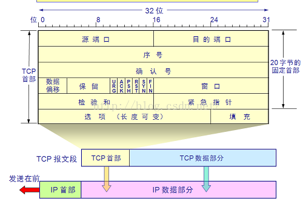
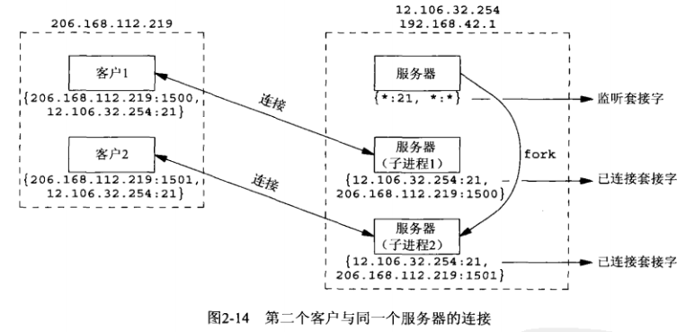
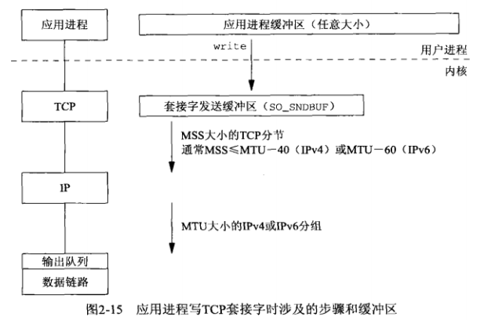
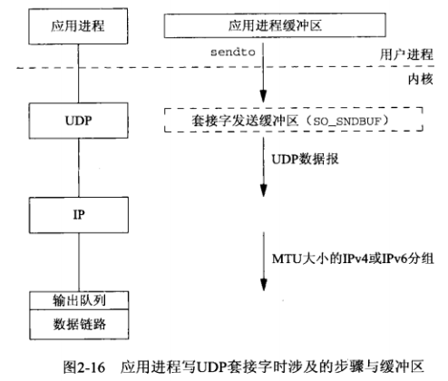
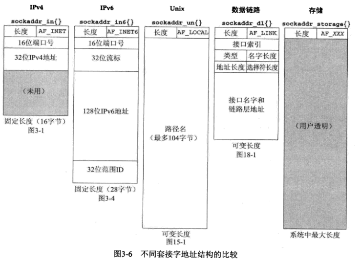
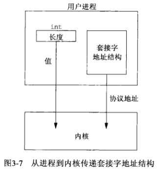
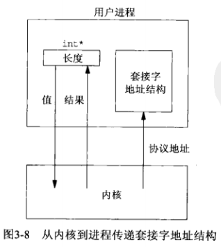
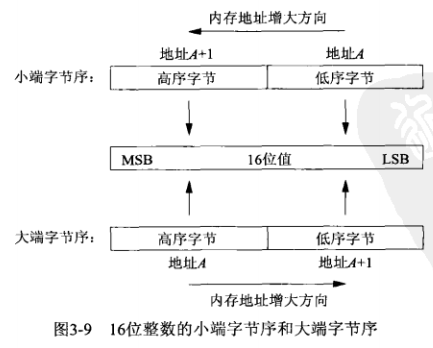
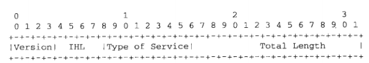
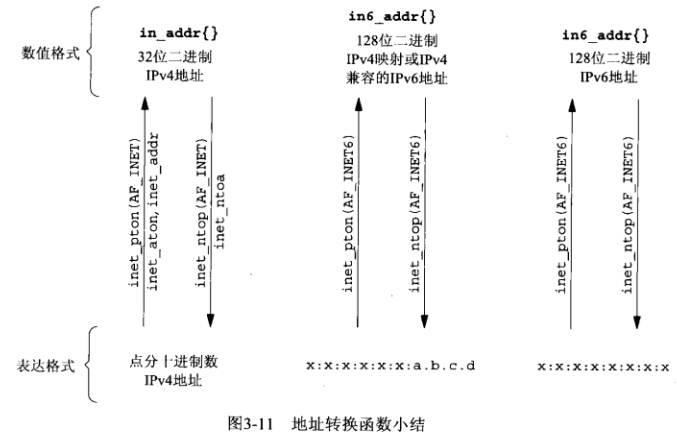

unp笔记

[TOC]

# 第2章 传输层：TCP、UDP和SCTP

## 2.6 TCP连接的建立和终止

### 2.6.1 三路握手

- 1.主动打开（通常为客户端）：发送第一个SYN的一端
- 2.被动打开（通常为服务器）：接收第一个SYN的一端
- 3.每一个SYN的ACK的确认号都是该SYN的初始序列号+1，因为SYN占据一个字节的序列号空间。FIN同理

### 2.6.2 TCP选项



这里的内容都是选项字段中的。

- 1.MSS选项：每一端都有
  - 表示：该端在本次连接的每个TCP分节中愿意接受的最大数据量
  - TCP_MAXSEG设置和提取
- 2.窗口规模选项：每一端都有
  - 表示：接收窗口
  - 旧时：因为窗口字段只有16位，因此窗口大小最大为2^16，即65535
  - 新时：在选项字段中，添加14位偏移，因此最大为65535*（2^14），需要两端都支持
  - SO_RCVBUF将影响这个选项
- 3.时间戳选择：
  - 表示：防止由失而复现的分组可能造成的数据损坏
  - 失而复得的分组：不是超时重传的分组。是暂时的路由原因造成的迷途分组，路由稳定后又正常到达目的地

### 2.6.3 TCP连接终止

- 1.主动关闭，首先发送FIN的一端
- 2.被动关闭，首先受到FIN的一端
- 3.被动关闭收到FIN后，将FIN作为文件结束符（EOF）传递给应用程序，放在所有数据之后。表示本端应用程序不会再收到对端的数据
- 4.不一定是4次个分组进行4次挥手：
  - 第一个FIN可能与最后的数据一起发送
  - 第一个FIN的ACK可能与第二个FIN一起发送
- 5.FIN的每个ACK确认号是这个FIN的序列号+1
- 6.半关闭：
  - 表示：被动关闭的一端还可以向主动关闭的一端发送数据
  - 实现：shutdown函数，参数为SHUT_WR（关闭写）
- 7.发送FIN的原因：
  - 1).调用close，并且该套接字的引用计数为0
  - 2).调用shutdown，参数为SHUT_RDWR或SHUT_WR（半关闭）
  - 3).自愿：进程调用exit或main函数退出
  - 4).非自愿：收到一个终止本进程的信号
- 8.任何一端都可以执行主动关闭
  - 通常：客户端
  - 例外：HTTP/1.0，服务器执行主动关闭

### 2.6.5 观察分组

- 1.第二次握手中的ACK和SYN也是有可能分开发送的
  - 如果服务器产生应答（SYN）的时间少于200ms，则SYN&ACK一起发送
  - 如果服务器产生应答的时间大于1s，则先发送ACK，再发送SYN

## 2.7 TIME_WAIT状态

- 1.MSL可能的时间为30秒~2分钟
- 2.TIME_WAIT可能的时间为1分钟~4分钟
- 3.存在TIME_WAIT的原因
  - 1).可靠地实现TCP全双工连接的终止
    - 如果没有WAIT_TIME。如果最后一个ACK丢失，被动关闭端回重新发送FIN，此时主动关闭端没有WAIT_TIME状态，将这个FIN以RST回应，被动关闭端会将RST解释成一个错误
  - 2).允许老的重复分节在网络中小时
    - 不允许在TIME_WAIT状态，在以同样的IP和端口创建连接
    - 否则，1).中提到的丢失的ACK其实没有丢失，有可能只是迷途了，那么TIME_WAIT的对端就回收到这个ACK而发生错误
- 4.TIME_WAIT是2MSL的原因
  - 每个方向上的分组都需要一个MSL来确保消逝

## 2.9 端口号

- 1.众所周知的端口：0~1023
  - 也是“保留端口”，需要超级用户特权启动
- 2.已经登记的端口：1024~49151
- 3.动态或私用端口：49152~65535
  - 也叫“临时端口”
  - 49152为65535的四分之三
- 4.套接字对：一个定义该连接的两个端点的四元组
  - 本地IP地址、本地TCP端口号
  - 外地IP地址、外地TCP端口号

## 2.10 TCP端口号与并发服务器



- 1.多宿主机：多个网卡、多个IP
- 2.服务器可选择一个IP或任意IP作为接受连接的IP地址（不能是指定的多个）
  - 任意IP：使用通配地址，在设置套接字地址结构时，将IP地址字段设为INADDR_ANY
- 3.已连接套接字和监听套接字都使用服务器的21端口
- 4.TCP无法通过查看目的端口号来区分外来节点到不同的端点（进程），因为本地端口21有3个套接字，必须查看4元素才能确定到达哪个端点接收某个到达的分节。例如：
  - 如果分节来自206.168.112.219:1500，则到达子进程1（连接套接字）
  - 如果分节来自206.168.112.219:1501，则到达子进程2（连接套接字）
  - 所有的目的端口为21的其他TCP分节到达父进程（监听套接字）

## 2.11 缓冲区大小及限制

**IPv4**

- 1.IPv4最大大小是2^16（65535，包括IPv4首部，实际载荷为65535-20）,但可扩展为2^14*65535


- 2.IPV4最小链路MTU为68，因为IPv4首部=20字节+40多字节的选项部分
- 3.路径MTU：两个主机之间的路径中最小的MTU
- 4.分片：这些分片在到达最终目的之前通常不重组
  - IPv4与IPv6的区别：
    - IPv4：主机对其产生和路由对其转发的数据报进行分片
    - IPv6：主机对其产生的数据报分片，路由不对其转发的数据报进行分片（路由对其产生的还是会分片的）
  - DF位：置位表示，不允许分片
    - IPv4：当路由器收到一个超出其外出链路MTU大小且设置了DF位的IPv4数据报时，将产生一个ICMPv4（目的不可达，需分片但DF已置位）
    - IPv6：隐含一个DF位（IPv6本来就不允许路由转发时分片），将产生一个ICMPv6（分组太大）
- 5.DF位的作用：发现路径MTU
- 7.最小重组缓冲区大小，表示IP的任何实现版本都必须保证的最小数据报大小（即双方还没开始交换MSS大小）
  - IPv4：576字节
  - IPv6：1500字节
- 8.MSS：用于向对端TCP通告对端在每个分节中能发送的最大TCP数据量，目的是告诉对端其重组缓冲区大小的实际值，从而避免分片
  - 通常值：MTU-IP首部固定长度-TCP首部固定长度（以太网为：1500-20-20=1460）
  - 实现：通过SYN分节（第一次和第二次握手）上的MSS选项设置
  - 最大值：2^16（65535）字节

### 2.11.1 TCP输出



这里描述的是应用进程写数据到一个TCP套接字中时发生的步骤。

这里涉及以下知识点：

- 1.每一个TCP套接字都有一个发送缓冲区，由SO_SNDBUF更改大小
- 2.write调用发生的事情：
  - 内核从应用进程的缓冲区中复制所有数据写到套接字的发送缓冲区
  - 如果套接字缓冲区无法容下，可能原因：
    - 应用进程的缓冲区大于套接字的发送缓冲区
    - 套接字的发送缓冲区已有其他数据
  - 如果无法容下，进程被睡眠
  - 内核不从write返回（假设是阻塞的套接字） ，知道应用进程的缓冲区所有的数据都复制到套接字缓冲区中
  - 如果write返回，表示当前进程数据已经复制到套接字缓冲区，进程缓冲区可继续使用。但不表示对端已经收到
- 3.TCP套接字缓冲区需要保留已经发送的数据，直到收到该数据的ACK

### 2.11.2 UDP输出



这里描述的是应用进程写数据到一个UDP套接字中时发生的步骤。

这里涉及以下知识点：

- 1.UDP有发送缓冲区（通过SO_SNDBUF设置）,实际上不存在（因此上图用虚线），它表示的只是该UDP套接字的数据报上限。
- 2.应用程序写一个大于套接字发送缓冲区大小的数据报，内核返回进程EMSGSIZE错误
- 3.因UDP不可靠，不必保留应用进程的数据副本，因此无需一个真正的发送缓冲区
- 4.数据保存的过程：应用进程的数据在沿协议向下传递时，通常被复制到某种格式的一个内核缓冲区中，当数据发送后，副本被链路层丢弃
- 5.UDP的write成功返回表示所写的数据报或其所有分段已经被加入数据链路层的输出队列
- 6.如果链路层输出队列没有足够的空间存放数据报或分段，返回ENOBUFS错误到进程


# 第3章 套接字编程简介

[UNPv1第三章：套接字编程简介](https://blog.csdn.net/lxj1137800599/article/details/51244629)

### 3.2.1 IPv4套接字地址结构

IPv4套接字地址结构通常也称为“网际套接字地址结构”

```c
//<netinet/in.h>
struct in_addr {
    in_addr_t s_addr; //32位IPv4地址网络字节序
    				
};

struct sockaddr_in{
 　　uint8_t             sin_len;          //带符号8位整数地址结构长度，用于简化套接字地址结构的处理
 　　sa_family_t         sin_family;       //协议族，IPv4为AF_INET
 　　in_port_t           sin_port;         //TCP或UDP端口号，16字节，网络字节序
 　　struct in_addr       sin_addr;         //32位IPv4，网络字节序地址
 　　char                sin_zero[8];      //填充对齐位，未使用，通常为0
};
//必须的字段：sin_family、sin_port、sin_addr
//sockaddr_in至少16字节
//总是在填写该结构前将整个结构置为0
//该结构仅在给定主机上使用，不在主机之间传递
```

从进程到内核传递套接字地址结构的函数有4个，它们都要调用sockargs函数

- 1.bind
- 2.connect
- 3.sendto
- 4.sendmsg

从内核到进程传递套接字地址结构的函数有5个

- 1.accept
- 2.recvfrom
- 3.recvmsg
- 4.getpeername
- 5.getsockname

### 3.2.2 通用套接字地址结构

用处：兼容所有协议的套接字地址结构，对指向特定于协议的套接字地址结构的指针执行类型强制转换

ANSI C后，可以使用void*解决

```c
//<sys/socket.h>
struct sockaddr {
  uint8_t            sa_len;
  sa_family_t        sa_family;       /* address family: AF_xxx value */
  char               sa_data[14];     /* protocol-specific address */
};

//例子：
struct sockaddr_in  serv;      /* IPv4 socket address structure */
bind(sockfd, (struct sockaddr *) &serv, sizeof(serv));
```

### 3.2.3 IPv6套接字地址结构

```c
//<netinet/in.h>
struct in6_addr{
 　　uint8_t            s6_addr[16];            //128位IPv6网络字节序地址
};

#define SIN6_LEN                                //编译时测试所需
struct sockaddr_in6{
 　 uint8_t             sin6_len;               //这个结构的长度
 　 sa_family_t         sin6_family;            //协议族，AF_INET6
 　 in_port_t           sin6_port;              //端口号，网络字节序

　　uint32_t            sin6_flowinfo;          //流信息，未定义
 　 struct in6_addr     sin6_addr;              //IPv6地址，网络字节序

　　uint32_t            sin6_scope_id;          //一定范围的接口
 };
```

### 3.2.4 新的通用套接字地址结构

```c
//<netinet/in.h>
struct sockaddr_storage {
  uint8_t      ss_len;       /* length of this struct (implementation dependent) */
  sa_family_t  ss_family;    /* address family: AF_xxx value */
  /*其他字段对用户来说的透明的 故没有列出*/  
};
//优势：足以容纳系统所支持的任何套接字地址结构
```

与sockaddr的对比：

- 1.sockaddr_storage通用套接字地址结构满足对齐要求
- 2.sockaddr_storage通用套接字地址结构足够大，能够容纳系统支持的任何套接字地址结构

### 3.2.5 套接字地址结构的比较



## 3.3 值-结果参数

**1.从进程到内核传递套接字结构函数**



- bind
- connect
- sendto

这些函数的一个参数是指向某个套接字地址结构的指针，另一个参数是该结构体的整数大小 

```c
struct sockaddr_in serv;
connect (sockfd, (SA *) &serv, sizeof(serv));
```

**2.从内核到进程传递套接字地址结构的函数**



- accept
- recvfrom
- getsockname
- getpeername

两个参数指向某个套接字结构体的指针和指向表示该结构体大小的整数变量的指针

```c
struct sockaddr_un cli; /* Unix domain */
socklen_t len;
len = sizeof(cli); /* len is a value */
getpeername(unixfd, (SA *) &cli, &len);
/* len may have changed */
```

长度为指针的原因（什么是值-结果参数 Value-result）：

- 函数调用时：结构大小len是一个值（value）, 它告诉内核cli结构的大小，使内核在写cli结构时不至于越界
- 函数返回时：结构大小len是一个结果（result），它告诉进程内核在cli结构中确切存储了多少信息

## 3.4 字节排序函数

**小端字节序**：将低序字节存储在起始地址

**大端字节序**：将高序字节存储在起始地址

”大端“、”小端“表示多个字节值的哪一端（小端或大端）存储在该值的起始地址

**MSB**：most significant bit，最高有效位

**LSB**：least significant bit，最低有效位

**主机字节序**：某个给定系统所用的字节序称为主机字节序（不同系统有不同）



```c
union {
	  short  s;
      char   c[sizeof(short)];
    } un;
un.s = 0x0102;
if(un.c[0] == 1 && un.c[1] == 2); //大端
if (un.c[0] == 2 && un.c[1] == 1); //小端
```

**网络字节序**：网络协议使用大端字节序来传递这些字节整数

主机字节序与网络字节序之间的转换函数：

```c
#include <netinet/in.h>
//h表示host, n表示network，s代表short，l代表long
//均返回：网络字节序的值
uint16_t htons(uint16_t host16bitvalue);    //主机to网络 short
uint32_t htonl(uint32_t host32bitvalue);    //主机to网络 long

//均返回：主机字节序的值
uint16_t ntohs(uint16_t net16bitvalue);     //网络to主机 short
uint32_t ntohl(uint32_t net32bitvalue);     //网络to主机 long

```

**字节==八位组==8位的量**

**位序**：按照在线缆上出现的顺序排列的4个字节（32个位）



## 3.5 字节操作函数

**Berkely**

```c
#include <strings.h>
void bzero(void *dest,size_t nbytes);               //将目标字符串制定数目的字节置0
void bcopy(const void *src,void *dest,size_t nbytes);         //拷贝指定字节
int bcmp(const void*ptrl,const void *ptr2,size_t nbytes);     //若相等返回0
```

**ANSI C**

```c
#include<string.h>
void *memset(void *dest,const void *c,size_t len);
void *memcpy(void *dest,const void *src,size_t nbytes);
int memcmp(const void *ptrl,const void *ptr2,size_t nbytes);
//返回：若相等则为0，否则为<0或者>0
```

**注意：**

- 1.memcpy类似bcopy
- 2.bcopy能正确处理源字符串与目的字符串重叠情况
- 3.memcpy不能正确处理源字符串与目的字符串重叠情况，可以使用memmove替代
- 4.memcmp需要将比较的字节转换为无符号字符（unsigned char）

## 3.6 inet_aton、inet_addr、和inet_ntoa函数

地址转换函数

inet_aton、inet_addr和inet_ntoa在点分十进制数串（eg：“206.168.112.96”）与它的32位网络字节序二进制值间转换IPv4地址。

```c
#include<arpa/inet.h>

//返回：1--字符串有效， 0--字符串有错
//将strptr所指的C字符串转换成32位的网络字节序二进制值，并通过指针addrptr来存储
//如果strptr为空，仍然对输入函数进行有效性检查，但addrptr不存储任何结果
int inet_aton(const char *strptr, struct in_addr *addrptr);　

//返回：若成功，返回32位二进制的网络字节序地址；若有错，返回INADDR_NONE
//作用与inet_aton一样，但是返回的是二进制值
//不能处理255.255.255.255,因为它的错误返回值INADDR_NONE也是这个值
//该函数已被废弃，使用inet_aton代替
in_addr_t inet_addr(const char *strptr);

//作用：将一个32位的网络字节序二进制IPv4地址转换成相应的点分十进制数串
//返回：指向点分十进制数串的指针
//该函数不可重入,即不能被中断，因为函数返回值所指的串驻留在静态内存中
//注意：以结构为参数，而不是指向结构的指针
char *inet ntoa(struct in_addr inaddr);
　　　　　　　　　　　             
```

## 3.7 inet_pton和inet_ntop函数

IPv4地址和IPv6地址都可用

函数名中p和n分别代表表达(presentation)和数值(numeric)地址的表达式通常是ASCII字符串

表达式即ASCII字符串

数值即存放在套接字地址结构中的二进制值

```c
#include <arpa/inet.h>

//family可以是AF_INET和AF_INET6

//作用：ASCII字符串--->套接字地址结构中的二进制值
//返回：若成功为1，若输入不是有效的表达式为0，若出错为-1
int inet_pton(int family, const char *strptr, void *addrptr);

//作用：套接字地址结构中的二进制值--->ASCII字符串
//注意：strptr不能为空，调用者必须为目标存储单元分配内存并制定其大小
//返回：若成功则为指向结果的指针，若出错则为null
const char *inet_ntop(int family, const void *addrptr, char *strptr, size_t len);

//len的定义
//<netinet/in.h>
#define INET_ADDRSTRLEN 16
#define INET6_ADDRSTRLEN 46
```



## 3.8 sock_ntop和相关函数

