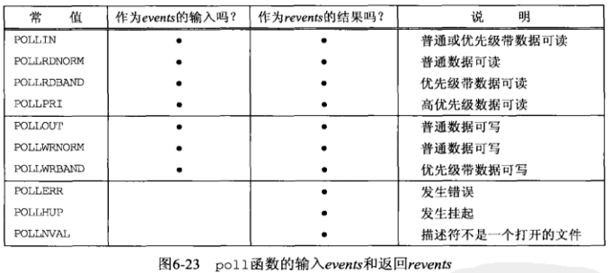

[TOC]

## 6.8 TCP回射服务器程序（select修订版）

使用select重写TCP回射服务器程序，可以不使用多进程的方式处理任意个客户连接

```c
// 源码：tcpcliserv/tcpservselect01.c

/* include fig01 */
#include	"unp.h"

int
main(int argc, char **argv)
{
	/*
	* @maxi:client数组当前使用项的最大下标
	* @maxfd：目前select监听的最大描述符
	*/
	int					i, maxi, maxfd, listenfd, connfd, sockfd;
	/*
	* @nready:本次调用select返回了几个就绪描述符
	* @client[FD_SETSIZE]：存储客户套接字的数组
	*/
	int					nready, client[FD_SETSIZE];
	ssize_t				n;
	fd_set				rset, allset;
	char				buf[MAXLINE];
	socklen_t			clilen;
	struct sockaddr_in	cliaddr, servaddr;

	listenfd = Socket(AF_INET, SOCK_STREAM, 0);

	bzero(&servaddr, sizeof(servaddr));
	servaddr.sin_family      = AF_INET;
	servaddr.sin_addr.s_addr = htonl(INADDR_ANY);
	servaddr.sin_port        = htons(SERV_PORT);

	Bind(listenfd, (SA *) &servaddr, sizeof(servaddr));

	Listen(listenfd, LISTENQ);

	maxfd = listenfd;			/* initialize */
	maxi = -1;					/* index into client[] array */
	for (i = 0; i < FD_SETSIZE; i++)
		client[i] = -1;			/* -1 indicates available entry */
	FD_ZERO(&allset);
	FD_SET(listenfd, &allset);
/* end fig01 */

/* include fig02 */
	for ( ; ; ) {
		rset = allset;		/* structure assignment */
		nready = Select(maxfd+1, &rset, NULL, NULL, NULL);

		//如果监听套接字就绪
		if (FD_ISSET(listenfd, &rset)) {	/* new client connection */
			clilen = sizeof(cliaddr);
			connfd = Accept(listenfd, (SA *) &cliaddr, &clilen);
#ifdef	NOTDEF
			printf("new client: %s, port %d\n",
					Inet_ntop(AF_INET, &cliaddr.sin_addr, 4, NULL),
					ntohs(cliaddr.sin_port));
#endif

			//将新的客户套接字存入客户套接字数组
			for (i = 0; i < FD_SETSIZE; i++)
				if (client[i] < 0) {
					client[i] = connfd;	/* save descriptor */
					break;
				}
			//套接字数组已满
			if (i == FD_SETSIZE)
				err_quit("too many clients");

			FD_SET(connfd, &allset);	/* add new descriptor to set */
			if (connfd > maxfd)
				maxfd = connfd;			/* for select */
			if (i > maxi)
				maxi = i;				/* max index in client[] array */

			//如果本次select只有监听套接字就绪，直接重新调用select		
			if (--nready <= 0)
				continue;				/* no more readable descriptors */
		}

		//处理已连接套接字
		for (i = 0; i <= maxi; i++) {	/* check all clients for data */
			if ( (sockfd = client[i]) < 0)
				continue;
			if (FD_ISSET(sockfd, &rset)) {
				//已连接套接字读到EOF
				if ( (n = Read(sockfd, buf, MAXLINE)) == 0) {
						/*4connection closed by client */
					Close(sockfd);
					FD_CLR(sockfd, &allset);
					client[i] = -1;
				} else
					Writen(sockfd, buf, n);

				if (--nready <= 0)
					break;				/* no more readable descriptors */
			}
		}
	}
}
/* end fig02 */
```

**本方案优缺点：**

**优点**：避免为每个客户创建一个新进程的所有开销

**缺点**：拒绝服务型攻击


**拒绝服务型攻击：**

情景描述：如果一个恶意客户连接到服务器，发送一个字节的数据（不是换行符）后进入睡眠。服务器将调用read，从客户读入这个字节的数据，然后阻塞于下一个read调用，以等待来自该客户的其余数据。服务器于是因该客户而被阻塞（或挂起），不能再为其他任何客户提供服务（接受新客户连接或读取现有客户的数据），直到那个恶意客户发送一个换行符或终止为止

当一个服务器处理多个客户时，绝不能阻塞于只与单个客户相关的某个函数调用，否则可能导致服务器被挂起，拒绝为所有其他客户提供服务，这就是**拒绝服务型攻击**

解决方法：

- 1.使用非阻塞I/O
- 2.让每个客户单独的控制线程提供服务（例如为每个客户创建一个子进程或一个线程）
- 3.对I/O操作设置一个超时

## 6.9 pselect函数

pselect函数由POSIX发明

```c
#include <sys/select.h>
#include <signal.h>
#include <time.h>

int pselect(int maxfd1,fd_set *readset,fd_set *writeset,fd_set *exceptset, const struct timespec *timeout,const sigset_t *sigmask);
```

**与select的区别**：

- 1.**使用timespec结构，而不是timeval结构**。timespec的第二个成员是纳秒级，2而timeval的第二个成员是微妙级

```c
struct timespec {
    time_t tv_sec; //秒，这里也有区别，timeval中tv_sec为long类型
    long tv_nsec; //纳秒
}
```

- 2.**增加了第6个参数：一个指向信号掩码的指针**。该参数运行程序先禁止递交某些信号，再测试由这些当前被禁止信号的信号处理函数设置的全局变量，然后调用pselect，告诉它重新设置信号掩码（调用pselect时，根据sigmask代替进程的信号掩码，当pselect返回时，进程的信号 掩码又被重置为调用pselect之前的值）

## 6.10 poll函数

```c
#include <poll.h>

/*
** @fdarray:指向pollfd结构数组第一个元素的指针，pollfd用于指定测试某个给定描述符fd的条件
** @nfds：fdarray数组中元素的个数
** @timeout：设置poll函数返回前等待多长时间
**                    1. INFTIM（一个负值）：永远等待下去
**                    2. 0：立即返回，不阻塞进程
**                    3. >0：等待指定数目的毫秒数
** @返回值：
**       1. 正整数：所有就绪描述符的数目
**       2. 0：超时
**       3. -1：出错
*/
int poll(struct pollfd *fdarray, unsigned int nfds, int timeout);

/*
** events、revents不使用值-结果参数，可以避免每次调用poll函数前都要重新初始化
** 如果不再关心某个特定描述符，可以把与之对应的pollfd结构的fd成员设置成一个负值
** poll函数将忽略这样的pollfd结构的events成员，返回时将其revents成员的值置为0
*/
struct pollfd{
    int fd;         //需要测试的描述符
    short events;   //该描述符上测试的事件
    short revents;  //该描述符上发生的事件
};
```

**events与revents的值**



- 第一部分是处理输入的4个常值
- 第二部分是处理输出的3个常值
- 第三部分是处理错误的3个常值

对于**普通数据**、**优先级带数据**、**高优先级数据**、**错误**的解释

- 所有正规TCP数据和所有UDP数据都被认为是**普通数据**
- TCP连接读半部关闭时（如收到一个来自对端的FIN），被认为是**普通数据**，随后读操作返回0
- TCP连接存在错误既可认为是**普通数据**，也可认为是**错误**。随后的读操作返回-1，并设置error（可用于处理诸如接收到RST或发生超时等条件）
- TCP的带外数据被认为是**优先级带数据**
- 在监听套接字上有新连接可用，既可认为是**普通数据**也可认为是**优先级带数据**
- 非阻塞式connect的完成被认为是使用套接字可写

**poll的优缺点**

优点：

- **没有最大监视描述符数量的限制**：分配一个pollfd结构的数组并把该数组中元素的数目通知内核成了调用者的责任。内核不再需要知道类似fd_set的固定大小的数据类型

缺点：

- 和select一样，调用返回后需要**轮询所有描述符来获取已经就绪的描述符**
- **用户态和内核态传递描述符结构时copy开销大**

## 6.11 TCP回射服务器程序（poll修订版）

使用poll代替select重写6.8节中的TCP回射服务器程序

在6.8的select版本中，必须分配一个client数组和一个rset描述符集

在本版本中只需要分配一个pollfd结构的数组来维护客户信息

```c
// 源码：tcpcliserv/tcpservpoll01.c
/* include fig01 */
#include	"unp.h"
#include	<limits.h>		/* for OPEN_MAX */

int
main(int argc, char **argv)
{
	//含有client数组当前正在使用的最大下标
	int					i, maxi, listenfd, connfd, sockfd;
	int					nready;
	ssize_t				n;
	char				buf[MAXLINE];
	socklen_t			clilen;
	struct pollfd		client[OPEN_MAX];
	struct sockaddr_in	cliaddr, servaddr;

	listenfd = Socket(AF_INET, SOCK_STREAM, 0);

	bzero(&servaddr, sizeof(servaddr));
	servaddr.sin_family      = AF_INET;
	servaddr.sin_addr.s_addr = htonl(INADDR_ANY);
	servaddr.sin_port        = htons(SERV_PORT);

	Bind(listenfd, (SA *) &servaddr, sizeof(servaddr));

	Listen(listenfd, LISTENQ);
	//client数组的一个项用于监听套接字
	client[0].fd = listenfd;
	//给监听套接字设为POLLRDNORM事件
	client[0].events = POLLRDNORM;
	//其余各项的描述符成员设为-1，表示当前不关心，poll函数将忽略这样的pollfd结构
	for (i = 1; i < OPEN_MAX; i++)
		client[i].fd = -1;		/* -1 indicates available entry */
	maxi = 0;					/* max index into client[] array */
/* end fig01 */

/* include fig02 */
	for ( ; ; ) {
		nready = Poll(client, maxi+1, INFTIM);

		if (client[0].revents & POLLRDNORM) {	/* new client connection */
			clilen = sizeof(cliaddr);
			connfd = Accept(listenfd, (SA *) &cliaddr, &clilen);
#ifdef	NOTDEF
			printf("new client: %s\n", Sock_ntop((SA *) &cliaddr, clilen));
#endif

			for (i = 1; i < OPEN_MAX; i++)
				if (client[i].fd < 0) {
					client[i].fd = connfd;	/* save descriptor */
					break;
				}
			if (i == OPEN_MAX)
				err_quit("too many clients");

			client[i].events = POLLRDNORM;
			if (i > maxi)
				maxi = i;				/* max index in client[] array */

			if (--nready <= 0)
				continue;				/* no more readable descriptors */
		}

		for (i = 1; i <= maxi; i++) {	/* check all clients for data */
			if ( (sockfd = client[i].fd) < 0)
				continue;
			//检查POLLERR的原因：
			//有些实现在一个连接上接收到RST时返回的是POLLERR事件
			//有些实现返回的却是POLLRDNORM事件
			if (client[i].revents & (POLLRDNORM | POLLERR)) {
				if ( (n = read(sockfd, buf, MAXLINE)) < 0) {
					if (errno == ECONNRESET) {
							/*4connection reset by client */
#ifdef	NOTDEF
						printf("client[%d] aborted connection\n", i);
#endif
						Close(sockfd);
						client[i].fd = -1;
					} else
						err_sys("read error");
				} else if (n == 0) {
						/*4connection closed by client */
#ifdef	NOTDEF
					printf("client[%d] closed connection\n", i);
#endif
					Close(sockfd);
					client[i].fd = -1;
				} else
					Writen(sockfd, buf, n);

				if (--nready <= 0)
					break;				/* no more readable descriptors */
			}
		}
	}
}
/* end fig02 */
```

## 6.12 epoll

[UNIX网络编程卷1---arking](https://github.com/arkingc/note/blob/master/计算机网络/UNIX网络编程卷1.md#4epoll)

