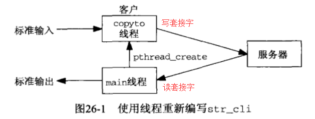
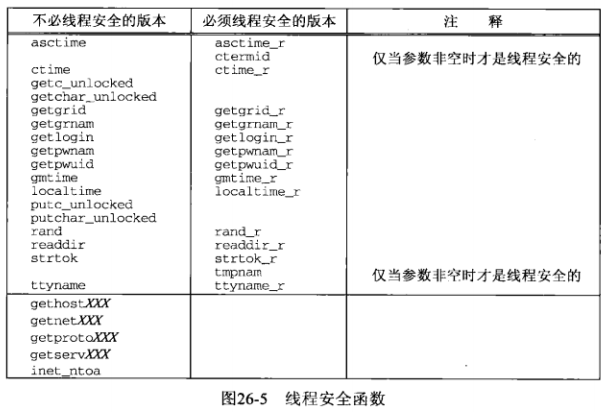
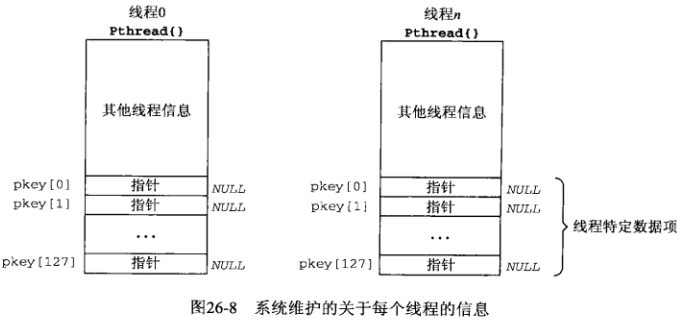
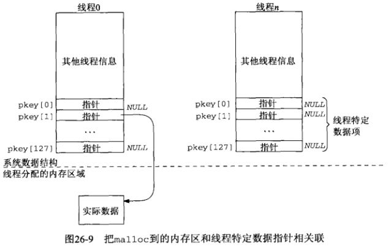
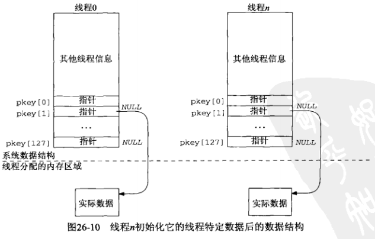

# 第26章 线程

## 26.1 概述

**进程的缺点**：

- 1.fork是昂贵的。fork要把父进程的内存映像复制到子进程，并在子进程中复制所有描述符。现在的fork使用**写时复制**，但仍然昂贵
- 2.fork返回父子进程之间信息的传递需要进程间通信（IPC）机制

线程有助于解决以上问题

**线程的优点**：

- 1.线程的创建可能比进程的创建快10~100倍
- 2.同一进程内的所有线程共享相同的全局内存，这使得线程之间易于共享信息

**线程的问题**：同步问题

**同一进程内所有线程共享的**：

- 1.全局变量
- 2.进程指令
- 3.大多数数据
- 4.打开的文件（即描述符）
- 5.信号处理函数和信号处置
- 6.当前工作目录
- 7.用户ID和组ID

**线程独占的**：

- 1.线程ID
- 2.寄存器集合，包括**程序计数器**和**栈指针**
- 3.栈（用于存放局部变量和返回地址）
- 4.errno
- 5.信号掩码
- 6.优先级

本章讲解的是POSIX线程，也称为Pthread。所有Pthread函数都以`pthread_`打头

## 26.2 基本线程函数：创建和终止

**5个基本线程函数**：

- 1.pthread_create函数：创建主线程以外的其余线程
- 2.pthread_join函数：等待一个给定线程终止
- 3.pthread_self函数：返回线程ID
- 4.pthread_detach函数：把指定线程转变为脱离状态
- 5.pthread_exit函数：终止线程

### 26.2.1 pthread_create函数

当一个程序由exec启动执行时，称为**初始线程**或**主线程**的单个线程就创建了

**pthread_create函数作用**：创建主线程以外的其余线程，类似于进程的fork

```c
#include <pthread.h>

int pthread_create(pthread_t *tid, const pthread_attr_t *attr, void* (*fun)(void*), void* arg);
```

- tid：线程ID，其数据类型为pthread_t（往往是unsigned int），如果新的线程成功创建，其ID就通过tid指针返回
- attr：线程属性，如优先级、初始栈大小、是否应该成为一个守护线程等。创建线程时可以通过初始化一个取代默认设置的pthread_attr_t变量指定这些属性。如果使用默认设置，则attr设为空指针
- fun和arg：线程执行的函数及其参数。该线程通过调用这个函数开始，然后显示终止（调用pthread_exit）或隐式终止（函数返回）。该函数的唯一调用参数是指针arg，需要给该函数传递多个参数，则需要将它们打包成一个结构，然后把这个结构的地址作为单个参数传递给这个起始函数。该函数的返回值是相应线程的终止状态
- 返回值：成功时返回0，若出错则为正的Exxx值。例如：pthread_create因线程数目上超过某个系统限制而不能创建新线程，函数返回值是EAGAIN，Pthread函数不设置errno

### 26.6.2 pthread_join函数

**pthread_join函数作用**：通过调用pthread_join等待一个给定线程终止，类似于进程的waitpid

```c
#include <pthread.h>

int pthread_join(pthread_t *tid, void** status);
```

- tid：等待线程的tid，必须指定，而不能像进程一样等待任意一个线程（类似指定进程ID参数为-1调用waitpid）
- status：如果该指针非空，来自所等待线程的返回值（一个指向某个对象的指针）将存入由status指向的位置
- 返回值：若成功为0，出错为正的Exxx值

### 26.2.3 pthread_self函数

**pthread_self函数作用**：返回线程ID，类似于进程的getpid

```c
#include <pthread.h>

pthread_t pthread_selft(void);
//返回值：调用线程的线程ID
```

### 26.2.4 pthread_detach函数

**背景知识**：一个线程可以是**可汇合的**（joinable，默认值），也可以是**脱离的**（detached）。当一个可汇合的线程终止时，它的线程ID和退出状态将留存到另一个线程对它调用pthread_join。脱离的线程却像守护进程，当它终止时，所有相关资源都被释放，我们不能等待它们终止。

如果一个线程需要知道另一个线程什么时候终止，就最好保持第二个线程的可汇合状态

**pthread_detach函数作用**：把指定的线程转变为脱离状态

```c
#include <pthread.h>

int pthread_detach(pthread_t tid);
//返回值：若成功则为0，若出错则为正的Exxx值
```

本函数通常由想让自己脱离的线程调用：

```c
pthread_detach(pthread_self());
```

### 26.2.5 pthread_exit函数

**pthread_exit函数作用**：让一个线程终止的方法之一

```c
#include <pthread.h>

void pthread_exit(void *status);
//不返回到调用者
```

- status：指针status不能指向局部于调用线程的对象，因为线程终止时这样的对象也小时

如果本线程未曾脱离，它的线程ID和退出状态将一直留存到调用进程内的某个其他线程对它调用pthread_join

**让一个线程终止的其他两个方法**：

- 1.启动线程的函数（即pthread_create的第三个参数fun）可以返回。既然该函数（fun）必须声明成返回一个void指针，它的返回值就是相应线程的终止状态
- 2.如果进程的main函数返回或者任何线程调用了exit，整个进程就终止，其中包括它的任何线程

## 26.3 使用线程的str_cli函数（客户）



```c
// 源码： threads/strclithread.c

#include	"unpthread.h"
//该头文件包含unp.h和pthread.h，然后定义了包裹pthread_打头的一系列函数

void	*copyto(void *);

//创建的线程需要的两个参数
//连接到服务器的TCP套接字描述符
static int	sockfd;		/* global for both threads to access */
//输入文件的标准I/O库FILE指针
static FILE	*fp;

void
str_cli(FILE *fp_arg, int sockfd_arg)
{
	char		recvline[MAXLINE];
	pthread_t	tid;

	sockfd = sockfd_arg;	/* copy arguments to externals */
	fp = fp_arg;

	//创建线程，新线程ID返回到tid，
	//由新线程执行的函数是copyto，没有参数传递给该线程
	Pthread_create(&tid, NULL, copyto, NULL);

	//主线程调用readline读入套接字数据
	while (Readline(sockfd, recvline, MAXLINE) > 0)
		//主线程将套接字读入数据写入标准输出
		Fputs(recvline, stdout);

	//str_cli函数返回时，回到客户main函数，
	//main函数通过调用exit终止进程
	//进程内的所有线程也就随之终止
}

void *
copyto(void *arg)
{
	char	sendline[MAXLINE];

	//如果该线程从标准输入读到EOF，Fgets返回NULL
	while (Fgets(sendline, MAXLINE, fp) != NULL)
		//将从标准输入读到的输入，写入套接字
		Writen(sockfd, sendline, strlen(sendline));

	//如果该线程从标准输入读到EOF，则向服务器发送FIN
	Shutdown(sockfd, SHUT_WR);	/* EOF on stdin, send FIN */

	//如果该线程从标准输入读到EOF，该线程在main函数的exit调用终止之前结束
	//如果服务器过早终止，则尚未读入EOF的该线程将由main函数调用exit终止
	return(NULL);
		/* 4return (i.e., thread terminates) when EOF on stdin */
}
```

**新线程需要的参数传递方法**：

- 1.如代码中所示，使用外部变量
- 2.把这两个值放到一个结构中，然后把指针指向这个结构的一个指针作为参数传递给我们要创建的线程

**性能分析**：该版本略快于使用fork的版本，不过慢于非阻塞式I/O的版本。但非阻塞式I/O版本的复杂度和线程版本的简单性，我们依然推荐使用线程而不是非阻塞式I/O

## 26.4 使用线程的TCP回射服务器程序（main）

该版本的TCP回射服务器程序为每个客户使用一个线程，而不是为每个客户使用一个劲

```c
// 源码： threads/tcpserv01.c

#include	"unpthread.h"

static void	*doit(void *);		/* each thread executes this function */

int
main(int argc, char **argv)
{
	int				listenfd, connfd;
	pthread_t		tid;
	socklen_t		addrlen, len;
	struct sockaddr	*cliaddr;

	if (argc == 2)
		listenfd = Tcp_listen(NULL, argv[1], &addrlen);
	else if (argc == 3)
		listenfd = Tcp_listen(argv[1], argv[2], &addrlen);
	else
		err_quit("usage: tcpserv01 [ <host> ] <service or port>");

	cliaddr = Malloc(addrlen);

	for ( ; ; ) {
		len = addrlen;
		connfd = Accept(listenfd, cliaddr, &len);
		//传递给doit函数的唯一参数是已连接套接字描述符
		Pthread_create(&tid, NULL, &doit, (void *) connfd);
		//主线程不关闭已连接套接字，而在fork情形下，服务器程序中是要关闭的。
		//因为同一进程内所有线程共享全部描述符，要是主线程调用close，
		//它就会终止相应的连接。创建新线程并不影响已打开描述符的引用计数
	}
}

static void *
doit(void *arg)
{
	//让自身脱离，因为主线程没有理由等待它创建的每个线程
	Pthread_detach(pthread_self());

	str_echo((int) arg);	/* same function as before */
	//线程必须关闭已连接套接字，因为本线程和主线程共享所有的描述符
	//对于fork的情形，子进程就不必close已连接套接字，
	//因为子进程终止时，会把所有打开的描述符在进程终止时都将被关闭
	Close((int) arg);		/* done with connected socket */
	return(NULL);
}
```

**注意**：把connfd传递给doit时，把connfd类型做强制转换成void指针并不保证所有系统上都起作用

### 26.4.1 给新线程传递参数

把connfd传递给doit时，把connfd类型做强制转换成void指针并不保证所有系统上都起作用。要正确处理这一点需要做额外的工作：不能简单地把connfd的地址传递给新线程

从ANSI C角度看这个是可接受的：ANSI C保证我们能够把一个整数指针类型强制转换成`void*`，然后把这个`void*`指针类型强制转换回原来的整数指针。**问题**出现在这个整数指针指向什么上

主线程中只有一个整数变量connfd，每次调用accept该变量都会被覆写一个新值（已连接描述符）。问题出现在多个线程不是同步地访问一个共享变量（以取得存放在connfd中的整数值）。**解决方法**：

- 1.把该值的一个副本推入被调用函数的栈中
- 2.使用动态内存（如下代码所示）

```c
// 源码： threads/tcpserv02.c

#include	"unpthread.h"

static void	*doit(void *);		/* each thread executes this function */

int
main(int argc, char **argv)
{
	int				listenfd, *iptr;
	thread_t		tid;
	socklen_t		addrlen, len;
	struct sockaddr	*cliaddr;

	if (argc == 2)
		listenfd = Tcp_listen(NULL, argv[1], &addrlen);
	else if (argc == 3)
		listenfd = Tcp_listen(argv[1], argv[2], &addrlen);
	else
		err_quit("usage: tcpserv01 [ <host> ] <service or port>");

	cliaddr = Malloc(addrlen);

	for ( ; ; ) {
		len = addrlen;
		//每次调用accpet时，首先调用malloc分配一个整数变量的内存空间，
		//用于存放有待accept返回的已连接描述符，
		//这使得每个线程都有各自的已连接描述符副本
		iptr = Malloc(sizeof(int));
		*iptr = Accept(listenfd, cliaddr, &len);
		Pthread_create(&tid, NULL, &doit, iptr);
	}
}

static void *
doit(void *arg)
{
	int		connfd;

	connfd = *((int *) arg);
	//线程获取已连接描述符的值后调用free释放空间
	free(arg);

	Pthread_detach(pthread_self());
	str_echo(connfd);		/* same function as before */
	Close(connfd);			/* done with connected socket */
	return(NULL);
}
```

**背景知识**：

- 1.**重入**一般可以理解为一个函数在同时多次调用
- 2.在多任务系统当中，在任务执行期间捕捉到信号并对其进行处理时，进程正在执行的指令序列就被信号处理程序临时中断。如果从信号处理程序返回，则继续执行进程断点处的正常指令序列，从重新恢复到断点重新执行的过程中，函数所依赖的环境没有发生改变，就说这个函数是**可重入**的，反之就是**不可重入**的

**问题**：malloc和free两个函数是**不可重入**的，即主线程正处于这两个函数之一的内部处理期间，从某个信号处理函数中调用者两个函数之一有可能导致灾难性的后果，这是因为两个函数操纵相同的静态数据结构

**解决**：POSIX要求这两个函数以及许多其他函数都是**线程安全**的，通常通过在对我们透明的库函数内部执行某种形式的同步达到

### 26.4.2 线程安全函数

除了下图中列出的函数外，POSIX1要求由POSIX.1和ANSC C标准定义的所有函数都是线程安全的（最后5行来源于Unix98）



让一个函数线程安全的共通技巧是定义一个名字以_r结尾的新函数。其中两个函数（ctermid和tmpnam）的线程安全条件是：调用者为返回这预先分配空间，并把指向该空间的指针作为参数传递给函数

## 26.5 线程特定数据

**问题**：把一个未线程化的程序转换成使用线程的版本时，有时会碰到因其中有函数使用静态变量而引起的一个常见编程错误。这个错误造成的故障也是非确定的。当一个进程内的不同线程（信号处理函数也视为线程）几乎同时调用这样的函数时就可能会有问题发生，因为这些函数使用的静态变量无法为不同的线程保存各自的值

**解决方法**：

- 1.使用**线程特定数据**
  - 优点：调用顺序无需改变，所有变动都体现在库函数中而非调用这些函数的应用程序中
  - 缺点：这个办法并不简单，而且转换成了**只能**在支持线程上的系统上工作的函数
- 2.改变调用顺序
  - 做法：由调用者把这类函数的所有调用**参数**都封装在一个结构中，并在该结构中存入用到的静态变量
  - 优点：支持线程和不支持线程的系统都可以使用
  - 缺点：调用该函数的应用程序必须修改
- 3.改变接口的结构，避免使用静态变量，这样函数就可以是线程安全的

使用**线程特定数据**是使得现有函数变为线程安全的一个常用技巧，下面对这一知识点进行讲解

需要注意区分**两种结构**：

- 系统为每个进程维护的**key结构**
- 系统为进程内每个线程维护的**Pthread结构**，其部分内容为**pkey数组**

> **key结构**

每个系统支持优先数量的线程特定数据元素，POSIX要求这个限制不小于128（每个进程）。系统（可能是线程函数库）为每个进程维护一个我们称之为**key结构**的结构数组


- **标志**：指示这个数组元素是否正在使用，初始化为“不在使用”。当一个线程调用`pthread_key_create(pthread_key_t *keyptr,void (*destructor)(void *value))`创建一个新的线程特定数据元素时，系统搜索其key结构数组找出第一个不在使用的元素。该元素的索引（0~127）称为键，返回给调用线程的正是这个引用(通过第一个参数keyptr返回)。
- **析构函数指针**：调用`pthread_key_create`函数时，不仅返回了**键**，还在**key结构**中插入了析构线程特定数组的**析构函数的指针**

> **Pthread结构和pkey数组**

系统还在进程内维护关于每个线程的多条信息，称之为**Pthread结构**，其部分内容是我们称之为**pkey数组**的一个128元素的指针数组。**pkey数组**的所有元素被初始化为空指针。**pkey数组**中的128个指针是和**key结构**中的128个可能的“键”逐一关联的值



当我们调用pthread_key_create创建一个键时，系统告诉我们这个**键**（根据**key结构**中第一个“不在使用”元素获得，并在该元素中插入了**析构函数**指针）。每个线程根据系统告知的**键**在自己的**pkey数组**中获得相应的指针，并通过调用malloc为该指针初始化。初始化后**pkey数组**中的指针指向的内存，就是真正的**线程特定数据**

**使用线程特定数组的例子**（以调用readline函数为例）：

- 1.一个进程被启动，多个线程被创建
- 2.其中一个线程（如线程0）是首个调用readline函数的线程，该函数转而调用pthread_key_create。系统在**key结构**中找到第一个未使用的元素，并把它的键（0~127）返回给调用者，本例中假设键为1。同时插入析构函数指针
  - 这其中涉及一个名为pthread_once的函数，该函数确保pthread_key_create只被调用一次（第一个调用readline的线程调用）
- 3.readline调用pthread_getspecific获取本线程的**pkey[1]**值，若之前本线程没有调用过readline函数，则**pkey[1]**的值为空指针（否则，返回一个指向由malloc分配的内容的指针）。于是readline调用malloc分配内存，用于为本线程跨相继的readline调用保存特定于线程的信息（即旧版本中的静态数据）。readline函数初始化该内存区，并调用pthread_setspecific把对应所创建键的线程特定数据指针（**pkey[1]**）设置为指向它刚刚分配的内存区（Pthread结构由系统维护，malloc的内存区域由readline函数维护）



- 4.另一个线程（如线程n）调用readline，当时也许线程0仍然在readline内执行。readline调用pthread_once试图由其调用pthread_key_create初始化它的线程关于readline函数的线程特定数据元素所用的键，但在线程1时已经将readline函数的键初始化为1了，因此就不再被调用
- 5.readline调用pthread_getspecific获取本线程的pkey[1]值，返回值是一个空指针。线程n于是就像线程0那样先调用malloc，再调用pthread_setspecific，以初始化pkey[1]所指向的内容



- 6.当一个线程终止时会发生什么？这就是**key结构**中的**析构函数指针**的用武之地。一个线程调用pthread_key_create创建某个线程特定数据元素时，所指定的函数参数之一就是指向某个析构函数的指针。当一个线程终止时，系统将扫描该线程的**pkey数组**，为每个非空的pkey指针调用相应的析构函数（在**key结构**中获得）

下面介绍**相关函数**

```c
#include <pthread.h>

/*
** 作用：根据onceptr所指向的值判断，是否还需要再次调用init所指向的函数，用以确保pthread_key_create函数在一个线程特定数据中只调用一次
** @onceptr：用于判断是否需要再次调用init所指向函数的值
** @init：函数指针
** @返回值：若成功则为0，若出错则为正的Exxx值
*/
int pthread_once(pthread_once_t *onceptr, void (*init)(void));

/*
** 作用：获取key结构中的一个键，存入keyptr中，并将destructor函数指针插入key结构。对于每个线程特定数据，应该只调用一次该函数
** @keyptr：key结构中的一个键
** @destructor：析构函数指针
** @返回值：若成功则为0，若出错则为正的Exxx值
*/
int pthread_key_create(pthead_key_t *keyptr, void (*destructor)(void *value));

/**
** 作用：返回线程Pthread结构中pkey数组key索引中的元素，一个指针
** @key：一个键，或索引
** @返回值：pkey数组中的元素，一个指向线程特定数据的指针（或空指针）
*/
void* pthread_getspecific(pthread_key_t key);

/**
** 作用：根据key找到线程Pthread结构中pkey数组Key索引的元素，将该元素设为value
** @key：一个键，或索引
** @value：一块由malloc分配的内存块，即线程特定数据
** @返回值：若成功则为0，若出错则为正的Exxx值
*/
int pthread_setspecific(phread_key_t key, const void* value);
```

**例子：使用线程特定数据的readline函数**

通过把3.9节中的readline函数的优化版本转换为无需改变调用顺序的线程安全版本

```c
// 源码： threads/readline.c

/* include readline1 */
#include	"unpthread.h"

//存储readline函数使用的键
static pthread_key_t	rl_key;
//用以判断Pthread_key_create是否第一次调用
static pthread_once_t	rl_once = PTHREAD_ONCE_INIT;

static void
readline_destructor(void *ptr)
{
	free(ptr);
}

//由ptherad_once调用，创建readline使用的键
static void
readline_once(void)
{
	Pthread_key_create(&rl_key, readline_destructor);
}

//存储线程特定数据，旧版本中声明为static
//调用readline的每个线程都由readline动态分配一个Rline结构，
//然后由readline_destructor函数析构
typedef struct {
  int	 rl_cnt;			/* initialize to 0 */
  char	*rl_bufptr;			/* initialize to rl_buf */
  char	 rl_buf[MAXLINE];
} Rline;
/* end readline1 */

/* include readline2 */
/**
** @tsd：指向预先为本线程分配的Rline结构（线程特定数据）的一个指针
*/
static ssize_t
my_read(Rline *tsd, int fd, char *ptr)
{
	if (tsd->rl_cnt <= 0) {
again:
		if ( (tsd->rl_cnt = read(fd, tsd->rl_buf, MAXLINE)) < 0) {
			if (errno == EINTR)
				goto again;
			return(-1);
		} else if (tsd->rl_cnt == 0)
			return(0);
		tsd->rl_bufptr = tsd->rl_buf;
	}

	tsd->rl_cnt--;
	*ptr = *tsd->rl_bufptr++;
	return(1);
}

ssize_t
readline(int fd, void *vptr, size_t maxlen)
{
	size_t		n, rc;
	char	c, *ptr;
	Rline	*tsd;
	//调用pthread_once使得本进程内第一个调用readline的线程通过调用
	//Pthread_key_create创建线程特定数据使用的键
	Pthread_once(&rl_once, readline_once);
	//pthread_getspecific返回指向特定于本线程的Rline结构的指针
	//如果是本线程首次调用，返回值为NULL
	//首次调用则分配一个Rline结构的空间，并由calloc将其rl_cnt成员初始化为0
	//再调用Pthread_setspecific为本线程存储这个指针
	//一下次本线程调用readline时，pthread_getspecific可以返回一个非空指针（指向本线程的线程特定数据）
	if ( (tsd = pthread_getspecific(rl_key)) == NULL) {
		tsd = Calloc(1, sizeof(Rline));		/* init to 0 */
		Pthread_setspecific(rl_key, tsd);
	}

	ptr = vptr;
	for (n = 1; n < maxlen; n++) {
		if ( (rc = my_read(tsd, fd, &c)) == 1) {
			*ptr++ = c;
			if (c == '\n')
				break;
		} else if (rc == 0) {
			*ptr = 0;
			return(n - 1);		/* EOF, n - 1 bytes read */
		} else
			return(-1);		/* error, errno set by read() */
	}

	*ptr = 0;
	return(n);
}
/* end readline2 */

ssize_t
Readline(int fd, void *ptr, size_t maxlen)
{
	ssize_t		n;

	if ( (n = readline(fd, ptr, maxlen)) < 0)
		err_sys("readline error");
	return(n);
}
```

## 26.6 Web客户与同时连接

//TODO：后面部分需要看完16章之后再继续