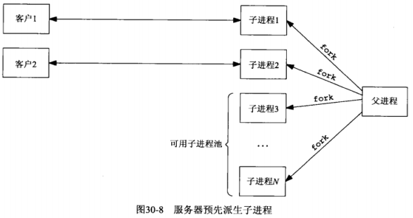
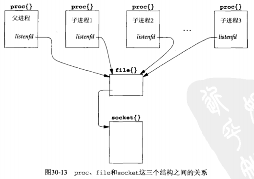

# 第30章 服务/服务器程序设计范式

## 30.1 概述

开发一个Unix服务器程序时，有如下类型的进程控制可供选择：

- 1.迭代服务器（第1章）
  - 缺点：这样的服务器在完成对当前客户的服务之前无法处理已等待服务的新客户
- 2.多进程并发服务器（第5章）：为每个客户调用fork派生一个子进程
- 3.TCP select单进程服务器（第6章）：TCP服务器程序由使用select处理任意多个客户的单个进程构成
- 4.多线程并发服务器（第26章）：服务器程序被改为服务器为每个客户创建一个线程，以取代派生一个进程
- 5.预先派生子进程服务器（第30章）：让服务器在启动阶段调用fork创建一个子进程池。每个客户请求由当前可用子进程池中的某个（闲置）子进程处理
- 6.预先创建线程服务器（第30章）：让服务器在启动阶段创建一个线程池，每个客户由当前可用线程池中的某个（闲置）线程处理

## 30.2 TCP客户程序设计范式

对本书中实现的TCP客户程序的优缺点总结：

- 1.基本的TCP客户程序（第5章），存在两个问题：
  - a).进程在被阻塞以等待用户输入期间，看不到诸如对端关闭连接等网络事件
  - b).以“停-等”模式运作，批处理效率极低
- 2.select版TCP客户程序（第6章）：通过调用select使得进程能够在等待用户输入期间得到网络事件通知，问题：
  - 不能正确地处理批量输入问题
- 3.select shutdown版TCP客户程序（第6章）：使用shutdown函数解决了2.中“不能正确地处理批量输入问题”
- 4.非阻塞I/O客户程序（第16章）
- 5.多进程客户程序（第16章）：使用fork派生一个子进程，并由父进程（或子进程）处理从客户到服务器的数据，由子进程（或父进程）处理从服务器到客户的数据
- 6.多线程客户程序（第26章）：使用两个线程取代5.中的两个进程

**总结**：

- 1.非阻塞式I/O版本是最快的，但其代码复制度高
- 2.两个进程或两个线程的版本相比之下代码简化得多，而运行速度只是稍逊“非阻塞式I/O版本”

## 30.3 TCP测试用客户程序

给出的客户程序用于测试我们的服务器程序的各个变体

```c
// 源码： server/client.c

#include	"unp.h"

#define	MAXN	16384		/* max # bytes to request from server */

int
main(int argc, char **argv)
{
	int		i, j, fd, nchildren, nloops, nbytes;
	pid_t	pid;
	ssize_t	n;
	char	request[MAXLINE], reply[MAXN];

	//要求输入 0.程序名 1.服务器的主机名或IP地址 2.服务器的端口 3.由客户fork的子进程数
	//4.每个子进程发送给服务器的请求数 5.每个请求要求服务器返送的数据字节数
	if (argc != 6)
		err_quit("usage: client <hostname or IPaddr> <port> <#children> "
				 "<#loops/child> <#bytes/request>");

	nchildren = atoi(argv[3]); //3.由客户fork的子进程数
	nloops = atoi(argv[4]); //4.每个子进程发送给服务器的请求数
	nbytes = atoi(argv[5]); //5.每个请求要求服务器返送的数据字节数
	snprintf(request, sizeof(request), "%d\n", nbytes); /* newline at end */

	for (i = 0; i < nchildren; i++) {
		if ( (pid = Fork()) == 0) {		/* child */
			for (j = 0; j < nloops; j++) {
				fd = Tcp_connect(argv[1], argv[2]);

				Write(fd, request, strlen(request));

				if ( (n = Readn(fd, reply, nbytes)) != nbytes)
					err_quit("server returned %d bytes", n);

				Close(fd);		/* TIME_WAIT on client, not server */
			}
			printf("child %d done\n", i);
			exit(0);
		}
		/* parent loops around to fork() again */
	}

	while (wait(NULL) > 0)	/* now parent waits for all children */
		;
	if (errno != ECHILD)
		err_sys("wait error");

	exit(0);
}
```

执行本客户程序的命令如下：

```shell
# client:程序名
# 206.62.226.36：服务器IP
# 8888：服务器端口号
# 5：由客户fork的子进程数
# 500：每个子进程发送给服务器的请求数
# 4000：每个请求要求服务器返送的数据字节数
% client 206.62.226.36 8888 5 500 4000
```

这将建立2500个服务器的TCP连接（5个子进程*每个子进程500个请求），在每个连接上，客户向服务器发送5个字节数（“4000\n”），服务器向客户返回4000字节数据。我们在**两个**不同的主机上针对同一个服务器执行本客户程序，于是总共提供5000个TCP连接，而且任意时刻服务器端最多同时存在10个连接

以此客户程序分别测试后面9个不同的服务器程序设计范式

- 1.TCP迭代服务器程序
- 2.TCP并发服务器程序，每个客户一个子进程
- 3.TCP预先派生子进程服务器程序，accept无上锁保护
- 4.TCP预先派生子进程服务器程序，accpet使用文件上锁保护
- 5.TCP预先派生子进程服务器程序，accpet使用线程上锁保护
- 6.TCP预先派生子进程服务器程序，传递描述符
- 7.TCP并发服务器程序，每个客户一个线程
- 8.TCP预先创建线程服务器程序，每个线程各自accpet
- 9.TCP预先创建线程服务器程序，主线程统一accpet

## 30.4 TCP迭代服务器程序

从进程控制角度看，迭代服务器是最快的，因为它不执行进程控制

## 30.5 TCP并发服务器程序，每个客户一个子进程

**限制**：在此程序中，客户数目的唯一限制是操作系统对以其名义运行服务器的用户ID能够同时拥有多少个子进程的限制

**问题**：每个客户现场fork一个进程比较耗费CPU时间

**main函数**:

```c
// 源码： server/serv01.c

/* include serv01 */
#include	"unp.h"

int
main(int argc, char **argv)
{
	int					listenfd, connfd;
	pid_t				childpid;
	void				sig_chld(int), sig_int(int), web_child(int);
	socklen_t			clilen, addrlen;
	struct sockaddr		*cliaddr;

	if (argc == 2)
		listenfd = Tcp_listen(NULL, argv[1], &addrlen);
	else if (argc == 3)
		listenfd = Tcp_listen(argv[1], argv[2], &addrlen);
	else
		err_quit("usage: serv01 [ <host> ] <port#>");
	cliaddr = Malloc(addrlen);

	//处理子进程终止时发出的SIGCHLD信号
	Signal(SIGCHLD, sig_chld);
	//捕获由键入终端中断产生的SIGINT信号
	//在客户运行完毕之后键入该键以显示服务器程序运行所需的CPU时间
	//sig_int函数的工作就是输出CPU时间
	Signal(SIGINT, sig_int);

	for ( ; ; ) {
		clilen = addrlen;
		if ( (connfd = accept(listenfd, cliaddr, &clilen)) < 0) {
			if (errno == EINTR)
				continue;		/* back to for() */
			else
				err_sys("accept error");
		}

		if ( (childpid = Fork()) == 0) {	/* child process */
			Close(listenfd);	/* close listening socket */
            //调用web_child函数处理用户请求
            //回复客户以客户要求的字节数
			web_child(connfd);	/* process request */
			exit(0);
		}
		Close(connfd);			/* parent closes connected socket */
	}
}
/* end serv01 */
```

**web_child函数**

```c
// 源码： server/web_child.c

#include	"unp.h"

#define	MAXN	16384		/* max # bytes client can request */

void
web_child(int sockfd)
{
	int			ntowrite;
	ssize_t		nread;
	char		line[MAXLINE], result[MAXN];

	for ( ; ; ) {
		if ( (nread = Readline(sockfd, line, MAXLINE)) == 0)
			return;		/* connection closed by other end */

			/* 4line from client specifies #bytes to write back */
		ntowrite = atol(line);
		if ((ntowrite <= 0) || (ntowrite > MAXN))
			err_quit("client request for %d bytes", ntowrite);

		Writen(sockfd, result, ntowrite);
	}
}
```

**sig_int函数**

```c
// 源码： server/serv01.c


/* include sigint */
void
sig_int(int signo)
{
	void	pr_cpu_time(void);
	
    //输出CPU时间
	pr_cpu_time();
	exit(0);
}
/* end sigint */
```

## 30.6 TCP预先派生子进程服务器程序，accept无上锁保护

在服务器启动阶段预先派生一定数量的子进程，当各个客户程序连接到达时，这些子进程立即就能为它们服务



**优点**：无须引入父进程执行fork的开销就能处理新到的客户

**缺点**：

- 服务器端：父进程必须在服务器启动阶段猜测需要预先派生多少个子进程。如果某个时刻客户数恰好等于进程总数，那么新到的客户将被忽略，直到至少有一个子进程重新可用。进一步分析，这些客户并未被完全忽略。内核将为每个新到的客户完成三路握手，直到达到相应套接字上listen调用的backlog数为止，然后再服务器调用accpet时把这些已经完成的连接传递给它
- 客户端：客户能觉察到服务器在响应时间上的恶化，因为尽管它的connect调用立即返回，但是它的第一个请求可能是在一段时间之后才被服务器处理

**解决方法**：通过增加代码，服务器应对客户负载的变动，父进程持续监视可用（即闲置）子进程数：

- 一旦该值降到低于某个阈值就派生额外的子进程
- 一旦该值超过另一个阈值就终止一些过剩的子进程

**main函数（无服务器负载变动）**：

```c
// 源码： server/serv02.c

/* include serv02 */
#include	"unp.h"

static int		nchildren;
static pid_t	*pids;

int
main(int argc, char **argv)
{
	int			listenfd, i;
	socklen_t	addrlen;
	void		sig_int(int);
	pid_t		child_make(int, int, int);

	if (argc == 3)
		listenfd = Tcp_listen(NULL, argv[1], &addrlen);
	else if (argc == 4)
		listenfd = Tcp_listen(argv[1], argv[2], &addrlen);
	else
		err_quit("usage: serv02 [ <host> ] <port#> <#children>");
	//需要fork的子进程数
	nchildren = atoi(argv[argc-1]);
	//分配一个存放各个子进程ID的数组，
	//用于父进程即将终止时由main函数终止所有子进程（在sig_int函数中完成）
	pids = Calloc(nchildren, sizeof(pid_t));

	for (i = 0; i < nchildren; i++)
		//生成子进程，并将子进程ID存入数组中
		pids[i] = child_make(i, listenfd, addrlen);	/* parent returns */

	//服务器父进程终止时的信号处理函数
	//该函数完成的事情：
	//1.终止并wait所有子进程
	//2.打印CPU时间
	Signal(SIGINT, sig_int);
	
	//父进程暂停，由子进程进行处理客户的连接和请求
	for ( ; ; )
		pause();	/* everything done by children */
}
/* end serv02 */
```

**child_make函数**：

```c
// 源码： server/child02.c

/* include child_make */
#include	"unp.h"

pid_t
child_make(int i, int listenfd, int addrlen)
{
	pid_t	pid;
	void	child_main(int, int, int);

	if ( (pid = Fork()) > 0)
		//父进程返回到服务器main函数
		return(pid);		/* parent */

	//子进程，不返回，进入child_main函数
	//该函数是个无限循环，进行客户连接和请求的处理
	child_main(i, listenfd, addrlen);	/* never returns */
}
/* end child_make */
```

**child_main函数**：

```c
// 源码： server/child02.c

/* include child_main */
void
child_main(int i, int listenfd, int addrlen)
{
	int				connfd;
	void			web_child(int);
	socklen_t		clilen;
	struct sockaddr	*cliaddr;

	cliaddr = Malloc(addrlen);

	printf("child %ld starting\n", (long) getpid());
	//子进程在这个循环中反复，直到父进程被终止
	//父进程发送SIGTERM信号终止所有子进程
	for ( ; ; ) {
		clilen = addrlen;
		//每个子进程调用accept返回一个已连接套接字
		connfd = Accept(listenfd, cliaddr, &clilen);
		
		//处理客户请求
		web_child(connfd);		/* process the request */
		//关闭“已连接套接字”
		Close(connfd);
	}
}
/* end child_main */
```

**sig_int函数**：

```c++
// 源码： server/serv02.c

/* include sigint */
void
sig_int(int signo)
{
	int		i;
	void	pr_cpu_time(void);

		/* 4terminate all children */
	//给每个子进程发送SIGTERM信号终止它们
	for (i = 0; i < nchildren; i++)
		kill(pids[i], SIGTERM);
	//调用wait汇集所有子进程的资源利用统计
	while (wait(NULL) > 0)		/* wait for all children */
		;
	if (errno != ECHILD)
		err_sys("wait error");
	//打印CPU时间
	pr_cpu_time();
	exit(0);
}
/* end sigint */
```

### 30.6.1 4.4BSD上实现多进程accept同一监听描述符

本章将描述4.4BSD上如何实现多个进程在同一个监听描述符上调用accept

父进程在派生任何子进程之前创建监听套接字，而每次调用fork时，所有描述符也被复制。下图展示了proc结果（每个进程一个）、监听描述符的单个file结构以及单个socket结构之间的关系



**描述符**是本进程引用file结构的proc结构中一个数组中某个元素的下标。子进程中一个给定描述符引用的file结构正是父进程中同一个描述符引用的file结构

**file的引用计数**：每个file结构都有一个引用计数。当打开一个文件或套接字时，内核将为之构造一个file结构，并由作为打开操作返回的**描述符**引用，它的引用计数初值为1；以后每当调用fork以派生子进程或对打开操作返回的**描述符**（或其复制品）调用dup以复制描述符时，该file结构的引用计数就递增（每次增1）

**惊群（thundering herd）问题**：服务器进程在程序启动阶段派生N个子进程，它们各自调用accept并因而均被内核投入睡眠。当第一个客户连接到达时，所有N个子进程均被唤醒。这是因为所有N个子进程所用的监听描述符（它们有相同的值）指向同一个socket结构，致使它们在同一个等待通道，即这个socket结构的so_timeo成员上进入睡眠。尽管所有N个子进程均被唤醒，其中只有最先运行的子进程获得那个客户连接，其余N-1个子进程继续回复睡眠，因为它们将发现队列长度为0（因为最先运行的连接早已取走了本来只有一个的连接）。

- **危害**：尽管只有一个子进程将获得连接，所有N个子进程却都被唤醒了。每当仅有一个连接准备好被接受时却唤醒太多进程的做法会导致**性能损失**。为了避免惊群问题，我们不希望有太多的额外子进程一直闲置着
- **例外**：某些Unix内核有一个往往命名为wakeup_one的函数，它只唤醒等待某个事件的多个进程中的一个，而不是所有。但BSD/OS内核没有这样的函数

### 30.6.3 连接在子进程中的分布

在“TCP预先派生子进程服务器程序，accept无上锁保护”中，内核调度算法把各个连接均匀散步到各个子进程

### 30.6.4 select冲突

**select函数的冲突现象**：当多个进程在引用同一个套接字的描述符上调用select时就会发生冲突

- **原因**：在socket结构中为存放本套接字就绪时应该唤醒哪些进程而分配的仅仅是一个进程ID的空间。如果有多个进程在等待同一个套接字，那么内核必须唤醒的是阻塞在select调用中的所有进程，因为它不知道哪些进程受刚变得就绪的这个套接字影响

**经验**：如果有多个进程阻塞在引用同一个实体（如套接字或普通文件，由file结构直接或间接描述）的描述符上，那么最好直接阻塞在如accept之类的函数而不是select之中

## 3.7 TCP预先派生子进程服务器程序，accept使用文件上锁保护

4.4BSD实现允许多个进程在引用同一个监听套接字的描述符上调用accept，然而这种做法也仅仅适用于在内核中实现accept的源自Berkeley的内核

在基于SVR4的Solaris 2.5内核上运行30.6节的服务器程序，客户开始连接到该服务器后不久，某个子进程的accept就会返回EPROTO错误（表示协议有错）

**原因**：SVR4的流实现机制和库函数版本的accept并**非一个原子操作**。Solaris 2.6修复了这个问题，但大多数SVR4实现仍然存在这个问题

**解决方法**：让应用进程在调用accept前后安置某种形式的锁，任意时刻只有一个子进程阻塞在accept调用中，其他子进程则阻塞在试图获取用于保护accept的锁上

本节使用**fcntl函数呈现的POSIX文件上锁功能**

在30.6版本之上的**修改**：

- 1.服务器main函数：添加了`my_lock_init`来初始化锁
- 2.服务器child_main函数：在调用accept之前获取文件锁，在accept返回后释放文件锁

**main函数**：

```c
// 源码： server/serv03.c

#include	"unp.h"

static int		nchildren;
static pid_t	*pids;

int
main(int argc, char **argv)
{
	int			listenfd, i;
	socklen_t	addrlen;
	void		sig_int(int);
	pid_t		child_make(int, int, int);

	if (argc == 3)
		listenfd = Tcp_listen(NULL, argv[1], &addrlen);
	else if (argc == 4)
		listenfd = Tcp_listen(argv[1], argv[2], &addrlen);
	else
		err_quit("usage: serv03 [ <host> ] <port#> <#children>");
	nchildren = atoi(argv[argc-1]);
	pids = Calloc(nchildren, sizeof(pid_t));
	//初始化锁
	my_lock_init("/tmp/lock.XXXXXX"); /* one lock file for all children */
	for (i = 0; i < nchildren; i++)
		pids[i] = child_make(i, listenfd, addrlen);	/* parent returns */

	Signal(SIGINT, sig_int);

	for ( ; ; )
		pause();	/* everything done by children */
}
```

**child_main函数**

```c
// 源码： server/child03.c

void
child_main(int i, int listenfd, int addrlen)
{
	int				connfd;
	void			web_child(int);
	socklen_t		clilen;
	struct sockaddr	*cliaddr;

	cliaddr = Malloc(addrlen);

	printf("child %ld starting\n", (long) getpid());
	for ( ; ; ) {
		clilen = addrlen;
		//获取文件锁
		my_lock_wait();
		connfd = Accept(listenfd, cliaddr, &clilen);
		//释放文件锁
		my_lock_release();

		web_child(connfd);		/* process the request */
		Close(connfd);
	}
}
```

下面对三个与锁相关的函数进行分析：

- 1.`my_lock_init(char*)`:初始化文件锁
- 2.`my_lock_wait()`：获取文件锁
- 3.`my_lock_release()`：释放文件锁

**my_lock_init函数**：

```c
// 源码： server/lock_fcntl.c

/* include my_lock_init */
#include	"unp.h"

static struct flock	lock_it, unlock_it;
static int			lock_fd = -1;
					/* fcntl() will fail if my_lock_init() not called */

//调用者将一个路径名模板指定为my_lock_init的函数参数
void
my_lock_init(char *pathname)
{
    char	lock_file[1024];

		/* 4must copy caller's string, in case it's a constant */
    strncpy(lock_file, pathname, sizeof(lock_file));
    //mktemp函数根据该模板创建一个唯一的路径名
    lock_fd = Mkstemp(lock_file);
    //创建一个具备路径名的文件并立即unlink掉
    Unlink(lock_file);			/* but lock_fd remains open */

    //初始化lock_it，用于上锁文件
	lock_it.l_type = F_WRLCK;
	lock_it.l_whence = SEEK_SET;
	lock_it.l_start = 0;
	lock_it.l_len = 0;

	//初始化unlock_it，用于解锁文件
	unlock_it.l_type = F_UNLCK;
	unlock_it.l_whence = SEEK_SET;
	unlock_it.l_start = 0;
	unlock_it.l_len = 0;
}
/* end my_lock_init */
```

本函数创建一个具备路径名的文件并立即unlink掉。通过从文件系统目录中删除该路径名，以后即使程序崩溃，这个临时文件也完全消失

然而只有有一个或多个进程打开着这个文件（即引用计数大于0），该文件本身就不会被删除。（这也是从某个目录中删除一个路径名（引用计数为0时文件消失）与关闭一个打开着的文件（引用计数减1）的本质差别）

**my_lock_wait函数**：

```c
// 源码： server/lock_fcntl.c

void
my_lock_wait()
{
    int		rc;
    
    while ( (rc = fcntl(lock_fd, F_SETLKW, &lock_it)) < 0) {
		if (errno == EINTR)
			continue;
    	else
			err_sys("fcntl error for my_lock_wait");
	}
}
```

**my_lock_release函数**:

```c
// 源码： server/lock_fcntl.c

void
my_lock_release()
{
    if (fcntl(lock_fd, F_SETLKW, &unlock_it) < 0)
		err_sys("fcntl error for my_lock_release");
}
```

该版本的**优缺点**：

- 优点：可移植到所有POSIX兼容系统


- 缺点：
  - 围绕accept的上锁增加了服务器的进程控制CPU时间
  - 涉及文件系统操作，比较耗时

**连接在子进程中的分布**：操作系统均匀地把文件锁散布到等待进程中

## 30.8 TCP预先派生子进程服务器程序，accept使用线程上锁保护 

使用线程上锁保护的方法的**优点**：

- 1.速度比文件上锁快
- 2.不仅适用于同一进城内各个线程之间的上锁，也适用于不同进程之间的上锁

基于30.7版本，需要改变的是3个**上锁函数**：

- 1.`my_lock_init(char*)`:初始化文件锁
- 2.`my_lock_wait()`：获取文件锁
- 3.`my_lock_release()`：释放文件锁

**my_lock_init函数**：

```c
// 源码： server/lock_pthread.c

/* include my_lock_init */
#include	"unpthread.h"
#include	<sys/mman.h>

static pthread_mutex_t	*mptr;	/* actual mutex will be in shared memory */

void
my_lock_init(char *pathname)
{
	int		fd;
	pthread_mutexattr_t	mattr;

	fd = Open("/dev/zero", O_RDWR, 0);

	mptr = Mmap(0, sizeof(pthread_mutex_t), PROT_READ | PROT_WRITE,
				MAP_SHARED, fd, 0);
	Close(fd);

	//以下三步的作用：
	//调用一些Pthread库函数，告诉函数库：
	//这是一个位于共享内存区中的互斥锁
	//将用于不同进程之间的上锁
	//1.为互斥锁以默认属性初始化一个phtread_mutexattr_t结构
	Pthread_mutexattr_init(&mattr);
	//2.赋予该结构PTHREAD_PROCESS_SHARED属性
	//该属性的默认值为PTHREAD_PROCESS_PRIVATE，即只允许单个进程内使用
	Pthread_mutexattr_setpshared(&mattr, PTHREAD_PROCESS_SHARED);
	//3.以mattr中的属性初始化mptr（共享内存区中的互斥锁）
	Pthread_mutex_init(mptr, &mattr);
}
/* end my_lock_init */
```

在不同进程之间共享内存空间，本例中使用mmap函数和/dev/zero设备

**my_lock_wait函数**：

```c
// 源码： server/lock_pthread.c

void
my_lock_wait()
{
	Pthread_mutex_lock(mptr);
}
```

**my_lock_release函数**:

```c
void
my_lock_release()
{
	Pthread_mutex_unlock(mptr);
}
```

## 30.9 TCP预先派生子进程服务器程序，传递描述符

只让父进程调用accept，然后父进程把所接受的已连接套接字“传递”给某个子进程

**优点**：绕过了为所有子进程的accept调用提供上锁保护的可能需求

**缺点**：需要从父进程到子进程的某种形式的描述符传递。会使代码更复杂，因为父进程必须跟踪子进程的忙闲状态，以便给空闲子进程传递新的套接字

前后版本**对比**：

- **之前**：进程无需关心由哪个子进程接收一个客户连接，操作系统处理这个细节：给某个子进程以首先调用accept的机会，或给与某个子进程以所需要的文件锁或互斥锁
- **现在**：必须为每个字进程维护一个信息结构以方便管理。因此需要一个Child结构

**效率**：父进程通过字节流管道把描述符传递给各个子进程，并且各个子进程通过字节流管道写回单个字节，无论比使用**共享内存区中的互斥锁**，还是使用**文件锁**的上锁和解锁相比，都要**更费时**

**连接在子进程中的分布**：越早派生从而在Child结构数组中排位越靠前的子进程处理的客户数越多

**Child结构**：

```c
// 源码： server/child.h

typedef struct {
  pid_t		child_pid;		/* 子进程ID */
  int		child_pipefd;	/* 父进程连接到该子进程的字节流管道描述符 */
  int		child_status;	/* 子进程状态，0 = ready */
  long		child_count;	/* # 子进程已处理客户的计数 */
} Child;

Child	*cptr;		/* array of Child structures; calloc'ed */
```

**child_make函数：**


```c
// 源码： server/child05.c

/* include child_make */
#include	"unp.h"
#include	"child.h"

pid_t
child_make(int i, int listenfd, int addrlen)
{
	//sockfd[0] 父进程使用
	//sockfd[1] 子进程使用
	int		sockfd[2];
	pid_t	pid;
	void	child_main(int, int, int);

	//创建一个字节流管道，是一对Unix域字节流套接字
	Socketpair(AF_LOCAL, SOCK_STREAM, 0, sockfd);

	//父进程
	if ( (pid = Fork()) > 0) {
		//父进程关闭子进程使用的域套接字
		Close(sockfd[1]);
		cptr[i].child_pid = pid;
		cptr[i].child_pipefd = sockfd[0];
		cptr[i].child_status = 0;
		//父进程返回服务器main函数
		return(pid);		/* parent */
	}

	//子进程
	//将流管道的自身的一端复制到标准错误输出
	//这样每个子进程可以通过读写标准错误输出和父进程通信
	Dup2(sockfd[1], STDERR_FILENO);		/* child's stream pipe to parent */
	//子进程关闭父进程使用的域套接字
	Close(sockfd[0]);
	//由于已经将流管道子进程的一端复制到了标准错误输出
	//因此可以关闭sockfd[1]
	Close(sockfd[1]);
	//关闭监听套接字，由父进程进行监听
	Close(listenfd);
	//子进程不返回，进入child_main函数	/* child does not need this open */
	child_main(i, listenfd, addrlen);	/* never returns */
}
/* end child_make */
```

**服务器main函数**：

```c
// 源码： server/serv05.c

/* include serv05a */
#include	"unp.h"
#include	"child.h"

static int		nchildren;

int
main(int argc, char **argv)
{
	int			listenfd, i, navail, maxfd, nsel, connfd, rc;
	void		sig_int(int);
	pid_t		child_make(int, int, int);
	ssize_t		n;
	fd_set		rset, masterset;
	socklen_t	addrlen, clilen;
	struct sockaddr	*cliaddr;

	if (argc == 3)
		listenfd = Tcp_listen(NULL, argv[1], &addrlen);
	else if (argc == 4)
		listenfd = Tcp_listen(argv[1], argv[2], &addrlen);
	else
		err_quit("usage: serv05 [ <host> ] <port#> <#children>");

	FD_ZERO(&masterset);
	//打开监听套接字对应的位
	FD_SET(listenfd, &masterset);
	maxfd = listenfd;
	cliaddr = Malloc(addrlen);

	nchildren = atoi(argv[argc-1]);
	//navail用于跟踪当前可用的子进程数
	navail = nchildren;
	//分配Child结构数组的内存空间
	cptr = Calloc(nchildren, sizeof(Child));

		/* 4prefork all the children */
	for (i = 0; i < nchildren; i++) {
		child_make(i, listenfd, addrlen);	/* parent returns */
		//打开各个子进程的字节流管道对应的位
		FD_SET(cptr[i].child_pipefd, &masterset);
		maxfd = max(maxfd, cptr[i].child_pipefd);
	}

	Signal(SIGINT, sig_int);

	for ( ; ; ) {
		rset = masterset;
		//如果navail为0，表示无子进程“闲置”
		//从select的描述符集中关掉与监听套接字对应的位
		//防止父进程再无可用子进程的情况下accept连接
		//内核仍然将这些连接入队，直到达到listen的backlog数为止
		if (navail <= 0)
			FD_CLR(listenfd, &rset);	/* turn off if no available children */
		//父进程使用select监听“监听套接字”和各个子进程的字节流管道
		nsel = Select(maxfd + 1, &rset, NULL, NULL, NULL);

			/* 4check for new connections */
		//监听套接字可读，至少有一个连接准备好accept
		if (FD_ISSET(listenfd, &rset)) {
			clilen = addrlen;
			connfd = Accept(listenfd, cliaddr, &clilen);

			//找出第一个可用的子进程
			for (i = 0; i < nchildren; i++)
				if (cptr[i].child_status == 0)
					break;				/* available */

			//如果遍历完cptr数组也没有可用的子进程，说明子进程不够用
			if (i == nchildren)
				err_quit("no available children");
			//改变被选中的子进程的状态
			cptr[i].child_status = 1;	/* mark child as busy */
			//更新选中子进程处理客户的统计值
			cptr[i].child_count++;
			//可用子进程数减少1
			navail--;

			//把就绪的已连接套接字传递给选中子进程
			n = Write_fd(cptr[i].child_pipefd, "", 1, connfd);
			//父进程关闭已经传送给子进程的这个已连接套接字
			Close(connfd);
			if (--nsel == 0)
				continue;	/* all done with select() results */
		}

			/* 4find any newly-available children */
		for (i = 0; i < nchildren; i++) {
			//child_main函数调用子进程处理完一个客户后，
			//通过子进程的字节流管道向父进程写回单个字节
			//使得该字节流的父进程拥有端变为可读
			if (FD_ISSET(cptr[i].child_pipefd, &rset)) {
				if ( (n = Read(cptr[i].child_pipefd, &rc, 1)) == 0)
					err_quit("child %d terminated unexpectedly", i);
				//将处理完客户的子进程状态更改为可用
				cptr[i].child_status = 0;
				//递增可用子进程计数
				navail++;
				//select中就绪套接字都处理完，则可以提前终止循环
				if (--nsel == 0)
					break;	/* all done with select() results */
			}
		}
	}
}
/* end serv05a */
```

**child_main函数**：

```c
// 源码： server/child05.c

/* include child_main */
void
child_main(int i, int listenfd, int addrlen)
{
	char			c;
	int				connfd;
	ssize_t			n;
	void			web_child(int);

	printf("child %ld starting\n", (long) getpid());
	for ( ; ; ) {
		//阻塞于read_fd调用，等待父进程传递过来一个已连接套接字描述符
		if ( (n = Read_fd(STDERR_FILENO, &c, 1, &connfd)) == 0)
			err_quit("read_fd returned 0");
		if (connfd < 0)
			err_quit("no descriptor from read_fd");

		web_child(connfd);				/* process request */
		Close(connfd);
		//子进程处理完一个客户后，
		//通过子进程的字节流管道向父进程写回单个字节
		//告知父进程本子进程已可用（闲置）
		//使得该字节流的父进程拥有端变为可读
		//父进程可以更新该子进程的状态变为“可用”
		Write(STDERR_FILENO, "", 1);	/* tell parent we're ready again */
	}
}
/* end child_main */
```

## 30.10 TCP并发服务器程序，每个客户一个线程

如果服务器主机支持线程，我们可以改用线程以取代子进程

为每个客户创建一个线程，以取代为每个客户派生一个子进程

**优点**：简单的创建线程版本快于所有预先派生子进程的版本

**main函数**：

```c
// 源码： server/serv06.c

#include	"unpthread.h"

int
main(int argc, char **argv)
{
	int				listenfd, connfd;
	void			sig_int(int);
	void			*doit(void *);
	pthread_t		tid;
	socklen_t		clilen, addrlen;
	struct sockaddr	*cliaddr;

	if (argc == 2)
		listenfd = Tcp_listen(NULL, argv[1], &addrlen);
	else if (argc == 3)
		listenfd = Tcp_listen(argv[1], argv[2], &addrlen);
	else
		err_quit("usage: serv06 [ <host> ] <port#>");
	cliaddr = Malloc(addrlen);

	Signal(SIGINT, sig_int);

	for ( ; ; ) {
		clilen = addrlen;
		//主线程阻塞于accept
		connfd = Accept(listenfd, cliaddr, &clilen);

		//当主线程返回一个客户连接时，调用Pthread_create创建一个新线程
		//新线程执行的函数是doit，其参数是“已连接套接字”
		Pthread_create(&tid, NULL, &doit, (void *) connfd);
	}
}
```

**doit函数**：

```c
// 源码： server/serv06.c

void *
doit(void *arg)
{
	void	web_child(int);

	//让自己脱离，使得主线程不必等待它
	Pthread_detach(pthread_self());
	//调用客户处理函数
	web_child((int) arg);
	//处理完毕后，该线程关闭“已连接套接字”
	Close((int) arg);
	return(NULL);
}
```

## 30.11 TCP预先创建线程服务器程序，每个线程各自accept

创建一个线程池，并让每个线程各自调用accept，使用互斥锁以保证任何时刻只有一个线程在调用accept

**连接在线程中的分布**：均匀分布

**效率**：所有版本中最快的

**Thread结构**：

用于维护线程若干信息的Thread结构

```c
// 源码： server/pthread07.h

typedef struct {
  pthread_t		thread_tid;		/* 线程ID */
  long			thread_count;	/* # 处理的客户数统计 */
} Thread;
Thread	*tptr;		/* array of Thread structures; calloc'ed */

int				listenfd, nthreads;
socklen_t		addrlen; 
pthread_mutex_t	mlock; //线程锁
```

**服务器main函数**：

```c
// 源码： server/serv07.c

/* include serv07 */
#include	"unpthread.h"
#include	"pthread07.h"

pthread_mutex_t	mlock = PTHREAD_MUTEX_INITIALIZER;

int
main(int argc, char **argv)
{
	int		i;
	void	sig_int(int), thread_make(int);

	if (argc == 3)
		listenfd = Tcp_listen(NULL, argv[1], &addrlen);
	else if (argc == 4)
		listenfd = Tcp_listen(argv[1], argv[2], &addrlen);
	else
		err_quit("usage: serv07 [ <host> ] <port#> <#threads>");
	nthreads = atoi(argv[argc-1]);
	//为存储线程信息的数组分配空间
	tptr = Calloc(nthreads, sizeof(Thread));

	//创建池中的线程
	for (i = 0; i < nthreads; i++)
		thread_make(i);			/* only main thread returns */

	Signal(SIGINT, sig_int);

	for ( ; ; )
		pause();	/* everything done by threads */
}
/* end serv07 */
```

**thread_make函数**：

```c
// 源码： server/pthread07.c

#include	"unpthread.h"
#include	"pthread07.h"

void
thread_make(int i)
{
	void	*thread_main(void *);
	//创建线程，线程ID存于数组中
    //线程执行函数为thread_main，thread_main的参数为该线程的在数组中的下标
	Pthread_create(&tptr[i].thread_tid, NULL, &thread_main, (void *) i);
	return;		/* main thread returns */
}
```

**thread_main函数**：

```c
// 源码： server/pthread07.c

void *
thread_main(void *arg)
{
	int				connfd;
	void			web_child(int);
	socklen_t		clilen;
	struct sockaddr	*cliaddr;

	cliaddr = Malloc(addrlen);

	printf("thread %d starting\n", (int) arg);
	for ( ; ; ) {
		clilen = addrlen;
		//上锁
    	Pthread_mutex_lock(&mlock);
		connfd = Accept(listenfd, cliaddr, &clilen);
		//解锁
		Pthread_mutex_unlock(&mlock);
		tptr[(int) arg].thread_count++;

		web_child(connfd);		/* process request */
		Close(connfd);
	}
}
```

## 30.12 TCP预先创建线程服务器程序，主线程统一accept

只让主线程调用accept并把每个客户连接传递给池中某个可用线程

**问题**：主线程如何把一个已连接套接字传递给线程池中某个可用线程

- 1.使用描述符传递，但所有线程和描述符都在一个进程内，没必要这样做
- 2.将描述符存在一个数组中

**效率**：慢于“TCP预先创建线程服务器程序，每个线程各自accept”版本，原因在于：本例中同时需要互斥量和条件变量，而“每个线程各自accept”版本只需要互斥量

**pthread结构**：

- 相比“各自accept”版本，多出了一个存储已连接描述符的数组，以及相应的互斥量和条件变量

```c
typedef struct {
  pthread_t		thread_tid;		/* thread ID */
  long			thread_count;	/* # connections handled */
} Thread;
Thread	*tptr;		/* array of Thread structures; calloc'ed */

#define	MAXNCLI	32
//由主线程往其中存入已接受的已连接套接字描述符
//由线程池中的线程从中取出一个以服务相应的客户
//iput是主线程将往该数组中存入的下一个元素的下标
//iget是线程池中某个线程从该数组中取出的下一个元素的下标
int					clifd[MAXNCLI], iget, iput;
//互斥量，用户clifd的互斥访问
pthread_mutex_t		clifd_mutex;
//条件变量，用以决定是否还有需要处理的连接
pthread_cond_t		clifd_cond;
```

**服务器main函数**：

```c
/* include serv08 */
#include	"unpthread.h"
#include	"pthread08.h"

static int			nthreads;
pthread_mutex_t		clifd_mutex = PTHREAD_MUTEX_INITIALIZER;
pthread_cond_t		clifd_cond = PTHREAD_COND_INITIALIZER;

int
main(int argc, char **argv)
{
	int			i, listenfd, connfd;
	void		sig_int(int), thread_make(int);
	socklen_t	addrlen, clilen;
	struct sockaddr	*cliaddr;

	if (argc == 3)
		listenfd = Tcp_listen(NULL, argv[1], &addrlen);
	else if (argc == 4)
		listenfd = Tcp_listen(argv[1], argv[2], &addrlen);
	else
		err_quit("usage: serv08 [ <host> ] <port#> <#threads>");
	cliaddr = Malloc(addrlen);

	nthreads = atoi(argv[argc-1]);
	tptr = Calloc(nthreads, sizeof(Thread));
	iget = iput = 0;

		/* 4create all the threads */
	for (i = 0; i < nthreads; i++)
		thread_make(i);		/* only main thread returns */

	Signal(SIGINT, sig_int);

	for ( ; ; ) {
		clilen = addrlen;
		connfd = Accept(listenfd, cliaddr, &clilen);

		//获取对clifd的互斥访问
		Pthread_mutex_lock(&clifd_mutex);
		//将主线程accept的已连接套接字描述符存入clifd数组中
		clifd[iput] = connfd;
		//如果iput达到最大值，循环使用
		if (++iput == MAXNCLI)
			iput = 0;
		//检查iput下标是否赶上iget下标
		//如果赶上，说明数组不够大
		if (iput == iget)
			err_quit("iput = iget = %d", iput);
		//释放信号量，如果有子进程睡眠于条件变量，则唤醒线程
		Pthread_cond_signal(&clifd_cond);
		//释放对clifd的互斥访问
		Pthread_mutex_unlock(&clifd_mutex);
	}
}
/* end serv08 */
```

**thread_make函数**：

```c
// 源码： server/pthread08.c

#include	"unpthread.h"
#include	"pthread08.h"

void
thread_make(int i)
{
	void	*thread_main(void *);
	//创建线程，将线程ID存于tptr数组中
    //线程的执行函数为thread_main，该函数的参数为线程在tptr数组中的下标
	Pthread_create(&tptr[i].thread_tid, NULL, &thread_main, (void *) i);
	return;		/* main thread returns */
}
```

**thread_main函数**：

```c
// 源码： server/pthread08.c

void *
thread_main(void *arg)
{
	int		connfd;
	void	web_child(int);

	printf("thread %d starting\n", (int) arg);
	for ( ; ; ) {
		//获取clifd的互斥访问
    	Pthread_mutex_lock(&clifd_mutex);
    	//如果已经没有需要处理的已连接套接字
		while (iget == iput)
			//将该进程睡眠于条件变量
			//如果主线程接受一个连接，则会释放条件变量
			//从而唤醒睡眠在该条件变量上的线程（一次只唤醒一个）
			Pthread_cond_wait(&clifd_cond, &clifd_mutex);
		//取出一个已连接套接字
		connfd = clifd[iget];	/* connected socket to service */
		if (++iget == MAXNCLI)
			iget = 0;
		Pthread_mutex_unlock(&clifd_mutex);
		tptr[(int) arg].thread_count++;
		//线程处理已连接套接字
		web_child(connfd);		/* process request */
		Close(connfd);
	}
}
```

## 30.13 小结

- 1.当系统负载较轻时，每来一个客户请求，现场派生一个子进程为之服务的传统并发服务器程序模式就足够了
- 2.预先创建一个子进程池或一个线程池的设计范式能把进程控制CPU时间降低10倍或以上。但本书中例子没实现的是：监视闲置子进程个数，随着服务客户数的动态变化而增加或减少这个数目
- 3.某些内核实现允许多个子进程或线程阻塞于同一个accept调用，有一些不能。因此需要包绕accept调用安置某些类型的锁加以保护，如文件锁或Pthread互斥锁
- 4.让所有子进程或线程自动调用accept比让父进程或主线程独自调用accept并把描述符传递给子进程或线程来得简单而快速
- 5.由于潜在select冲突的原因，让所有子进程或线程阻塞于同一个accept调用比让它们阻塞在同一个select调用更可取
- 6.使用线程通常比使用进程更快，但需要考虑两个问题：
  - 操作系统是否支持多线程
  - 服务每个客户是否需要激活其他程序。如果accept客户连接的服务器调用fork和exec（譬如inetd超级守护进程），那么fork一个单线程的进程可能快于fork一个多线程的进程