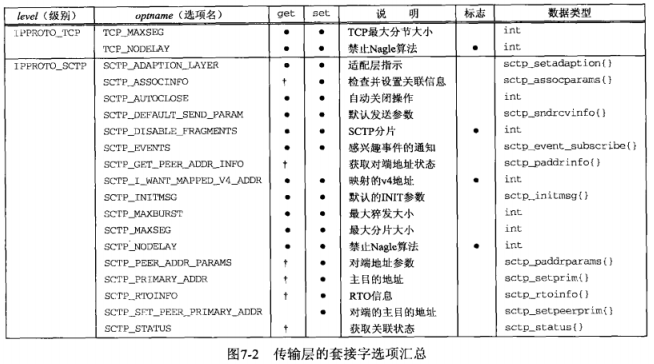

# 第7章 套接字选项

## 7.1 概述

获取和设置影响套接字的选项的方法

- 1.getsockopt和setsockopt
- 2.fcntl函数：把套接字设置为阻塞式I/O、信号驱动式I/O以及设置套接字属主的POSIX的方法
- 3.ioctl函数

## 7.2 getsockopt和setsockopt

这两个函数仅用于套接字

```c
#include <sys/socket.h>

int getsockopt(int sockfd, int level, int optname, void *optval, socklen_t *optlen);

int setsockopt(int sockfd, int level, int optname, const void *optval, socklen_t optlen);
```

- sockfd：必须指向一个打开的套接字描述符
- level：指定系统中解释选项的代码
  - 通用套接字代码（`SOL_SOCKET`）
  - 某个特定协议的代码（如IPv4（`IPPROTO_IP`），IPv6、TCP（`IPPROTO_TCP`）或SCTP）
- optval：指向某个变量的指针
  - setsockopt从*optval中取得选项待设置的新值
  - getsockopt把已获取的选项当前值放到*optval中
- optlen：指定*optval的大小
  - setsockopt：值参数
  - getsockopt：值-结果参数
- 返回值： 成功返回0，错误返回-1

对下图的**解释**：

- 1.表中“数据类型”列出了指针optval必须指向的数据类型，后跟花括号的表示一个结构，如`linger{}`表示`struct linger`

- 2.套接字选项粗分为两大基本类型：

  - **标志选项**：启用或禁止某个特性的二元选项，图中“标志”有黑圆点的，此时
    - *optval：一个整数，0表示被禁止，非0表示被启用
  - **值选项**：取回并返回我们可以设置或检查的特定值的选项，图中“标志”没有黑圆点的，此时
    - *optval：用于在用户进程与系统之间传递所指定数据类型的值

  

  

  ## 7.4 套接字状态

  以下的套接字选项由TCP已连接套接字从监听套接字继承而来

  - `SO_DEBUG`（开启调试跟踪）、`SO_DONTROUTE`（绕过外出路由表查询）、`SO_KEEPLIVE`（周期性测试连接是否存活）、`SO_LINGER`（若有数据待发送则延迟关闭）、`SO_OOBINLINE`（让接收到的带外数据继续再线留存）、`SO_RCVBUF`（接收缓冲区大小）、`SO_RCVLOWAT`（接收缓冲区低水位标记）、`SO_SNDBUF`（发送缓冲区大小）、`SO_SNDLOWAT`（发送缓冲区低水位标记）、`TCP_MAXSEG`（TCP最大分节大小）、`TCP_NODELAY`（禁止Nagle算法）

  ## 7.5 通用套接字选项

  这些选项是协议无关的，不过其中有些选项只能应用到某些特定类型的套接字中。如称`SO_BROADCAST`套接字选项是“通用”的，但它只能用于数据报套接字

  ### 7.5.1 SO_BROADCAST套接字选项

  **限制**：只有**数据报**套接字支持广播，并且必须是支持广播消息的网络上（如以太网）

  **作用**：开启或禁止进程发送广播消息的能力

  由于应用进程在发送广播数据报之前必须设置本套接字选项，因此它能够有效地防止一个进程在其应用程序根本没有设计成可广播时就发送广播数据报

  如果发送数据报的目的地址为广播地址且本套接字选项没有设置，则返回EACCES错误

  ### 7.5.2 SO_DEBUG套接字选项

  **限制**：仅由TCP支持

  **作用**：当给一个TCP套接字开启本选项时，内核将为TCP在该套接字发送和接收的所有分组保留详细跟踪信息。这些信息保留在内核的某个唤醒缓冲区中，并可使用trpt程序进程检查

  ### 7.5.3 SO_DONTROUTE套接字选项

  **作用**：规定外出的分组将绕过底层协议的正常路由机制

  **举例**：如果开启本选项，IPv4情况下外出分组将被定向到适当的本地接口（由目的地址的网络和子网部门确定）。如果这样的本地接口无法由目的地址确定（如目的主机不在一个点对点链路的另一端，也不在一个共享的网络上），则返回ENETUNREACH错误

  **相同效果的做法**：给函数send、sendto、sendmsg使用MSG_DONTROUTE标志，也能在个别的数据报上取得相同效果

  **应用**：路由守护进程（routed和gated）使用本选项绕过路由表（路由表不正确的情况下），以强制将分组从特定接口送出

  ### 7.5.4 SO_ERROR套接字选项

  **背景**:当一个套接字上发生错误时，源自Berkeley的内核中的协议模块将该套接字的名为so_error的变量设为标准的Unix Exxx值中的一个，称为该套接字的待处理错误

  **内核通知进程该错误的方法**：

  - 1.如果进程阻塞在该套接字的select调用上，那么无论是检查该套接字的可读条件还是可写条件，select均返回并设置其中一个或两个条件为“就绪”
  - 2.如果进程使用信号驱动I/O模型，内核给进程或进程组产生一个SIGIO信号

  **进程获取该错误的方法**：使用`getsockopt + SO_ERROR`获取，其中*valopt就是该套接字的待处理错误。获取之后，so_error由内核复位为0

  **read和write发现该错误的过程**：

  

  