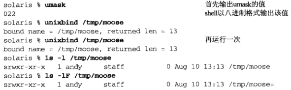

# 第15章 Unix域套接字

Unix域协议并不是一个实际的协议族，而是在**单个主机上**执行客户/服务器通信的一种方法

所用API就是在不同主机上执行客户/服务器通信所有的API（套接字API）

Unix域协议是进程间通信（IPC）的方法之一

Unix域提供**两类套接字**：字节流套接字(类似TCP)、数据报套接字(类似UDP) 

使用Unix域套接字有以下**3个理由**： 

- 1.Unix域套接字往往比通信两端位于同一主机的TCP套接字快出一倍 
- 2.Unix域套接字可用于在同一主机上的不同进程之间传递描述符
- 3.Unix域套接字较新的实现把客户的凭证(用户IP和组ID)提供给服务器，从而能够提供额外的安全检查措施 

## 15.2 Unix域套接字地址结构

```c
// 定义在头文件<sys/un.h>

struct sockaddr_un{
    sa_family_t sun_family;     /*AF_LOCAL*/
    char sun_path[104];         /*null-terminated pathname*/
};
```

**Unix域协议地址**：用于标识客户和服务器的协议地址是普通文件系统中的路径名。这些路径名不是普通Unix文件：除非把它们和Unix域套接字关联起来，否则无法读写这些文件

- **sun_path**：Unix域协议地址，存放在其中的路径名必须以空字符结尾。未指定地址以空字符串作为路径名指示（即sun_path[0]值为0的地址结构），它等价于IPv4的INADDR_ANY常值和IPv6的IN6ADDR_ANY_INIT常值 

**SUN_LEN宏**：以一个指向sockaddr_un结构的指针为参数并返回该结构的长度，其中包括路径名中非空字节数 

**例子：Unix域套接字的bind调用**

```c
// 源码： unixdomain/unixbind.c

#include	"unp.h"

int
main(int argc, char **argv)
{
	int					sockfd;
	socklen_t			len;
	struct sockaddr_un	addr1, addr2;

	if (argc != 2)
		err_quit("usage: unixbind <pathname>");

	sockfd = Socket(AF_LOCAL, SOCK_STREAM, 0);

	//如果文件系统中已存在该路径名，bind将会失败
	//调用unlink删除这个路径名，以防止它已经存在，
	//如果它不存在，unlink将返回一个我们要将其忽略的错误
	unlink(argv[1]);		/* OK if this fails */

	bzero(&addr1, sizeof(addr1));
	addr1.sun_family = AF_LOCAL;
	strncpy(addr1.sun_path, argv[1], sizeof(addr1.sun_path)-1);
	Bind(sockfd, (SA *) &addr1, SUN_LEN(&addr1));

	len = sizeof(addr2);
	Getsockname(sockfd, (SA *) &addr2, &len);
	printf("bound name = %s, returned len = %d\n", addr2.sun_path, len);
	
	exit(0);
}
```

**运行结果**



- POSIX规定路径名的文件访问权限应该根据umask修正
- `ls -l`中可以看到，该路径名的文件类型显示为s（srwxr-xr-x中的第一个字母）
- `ls -lF`中可以看到，路径名之后添加了一个等号`=`
  - `-F`的作用：在每一个文件的末尾加上一个字符说明该文件的类型。`@`表示符号链接、`|`表示FIFOS、`/`表示目录、`=`表示套接字 

# Unix域相关函数

## 15.3 socketpair函数

socketpair函数创建2个随后连接起来的套接字，本函数仅适用于Unix域套接字

```c
#include <sys/socket.h>

int socketpair(int family, int type, int protocol, int sockfd[2]);

//返回值：若成功则为非0，若出错则为-1
```

- **family**：必须为AF_LOCAL 
- **protocol**：必须为0 
- **type**：既可以是SOCK_STREAM，也可以是SOCK_DGRAM
  - 使用SOCK_STREAM得到的结果称为流管道，它是全双工的
- **sockfd**：新创建的两个套接字描述符作为sockfd[0]和sockfd[1]返回
  - 这样创建的2个套接字不曾命名，也就是说其中没有涉及隐式的bind调用

## 15.4 套接字函数

用于Unix域套接字时，套接字函数中存在一些差异和限制。尽量列出POSIX的要求，并指出并非所有实现目前都已达到这个级别： 

- 1.由bind创建的路径名默认访问权限应为0777（属主用户、组用户和其他用户都可读、可写、可执行），并按当前umask值进行修正
- 2.与Unix域套接字关联的路径名应该是一个绝对路径，而不是一个相对路径
  - 不用相对路径的原因：解析依赖于调用者的当前工作目录。即要是服务器捆绑一个相对路径，客户就得在与服务器相同的目录中（或必须知道这个目录）才能成功调用connect或sendto
- 3.在connect调用中指定的路径名必须是一个当前绑定在某个打开的Unix域套接字上的路径名，而且它们的套接字类型也必须一致。出错条件包括：
  - 该路径名已存在却不是一个套接字
  - 该路径名已存在且是一个套接字，不过没有与之关联的打开的描述符
  - 该路径名已存在且是一个打开的套接字，不过类型不符（Unix域字节流套接字、Unix域数据报套接字）
- 4.调用connect连接一个Unix域套接字涉及的权限测试等同于调用open以只写方式访问相应的路径名
- 5.Unix域**字节流套接字**类似TCP套接字：它们都为进程提供一个无记录边界的字节流接口
- 6.Unix域**数据报套接字**类似于UDP套接字：都提供一个保留记录边界的不可靠的数据报服务
- 7.如果对于某个Unix域字节流套接字的connect调用发现这个监听套接字的队列已满，调用就立即返回一个ECONNREFUSED错误（对于TCP，监听套接字会忽略新到达的SYN，而TCP连接发起端将数次发送SYN进行重试）
- 8.在一个**未绑定**的Unix域套接字上**发送数据报**不会自动给这个套接字捆绑一个路径名（在一个未绑定的UDP套接字上发送UDP数据报导致给这个套接字捆绑一个临时端口）
- 9.类似8，对于某个Unix域数据报套接字的connect调用不会给本套接字捆绑一个路径名

## 15.5 Unix域字节流客户/服务器程序

**服务器**：

```c
// 源码： unixdomain/unixstrserv01.c

#include	"unp.h"

int
main(int argc, char **argv)
{
	int					listenfd, connfd;
	pid_t				childpid;
	socklen_t			clilen;
	struct sockaddr_un	cliaddr, servaddr;
	void				sig_chld(int);

	listenfd = Socket(AF_LOCAL, SOCK_STREAM, 0);

	//#define UNIXSTR_PATH "/tmp/unix.str"
	unlink(UNIXSTR_PATH);
	bzero(&servaddr, sizeof(servaddr));
	servaddr.sun_family = AF_LOCAL;
	strcpy(servaddr.sun_path, UNIXSTR_PATH);
	
	Bind(listenfd, (SA *) &servaddr, sizeof(servaddr));

	Listen(listenfd, LISTENQ);

	Signal(SIGCHLD, sig_chld);

	for ( ; ; ) {
		clilen = sizeof(cliaddr);
		if ( (connfd = accept(listenfd, (SA *) &cliaddr, &clilen)) < 0) {
			if (errno == EINTR)
				continue;		/* back to for() */
			else
				err_sys("accept error");
		}

		if ( (childpid = Fork()) == 0) {	/* child process */
			Close(listenfd);	/* close listening socket */
			str_echo(connfd);	/* process request */
			exit(0);
		}
		Close(connfd);			/* parent closes connected socket */
	}
}
```

**客户**：

```c
// 源码： unixdomain/unixstrcli01.c

#include	"unp.h"

int
main(int argc, char **argv)
{
	int					sockfd;
	struct sockaddr_un	servaddr;

	sockfd = Socket(AF_LOCAL, SOCK_STREAM, 0);

	bzero(&servaddr, sizeof(servaddr));
	servaddr.sun_family = AF_LOCAL;
	//#define UNIXSTR_PATH "/tmp/unix.str"
	strcpy(servaddr.sun_path, UNIXSTR_PATH);
	//注意，Unix域字节流套接字connect之前可以不绑定
	Connect(sockfd, (SA *) &servaddr, sizeof(servaddr));

	str_cli(stdin, sockfd);		/* do it all */

	exit(0);
}
```

## 15.6 Unix域数据报客户/服务器程序

**服务器**：

```c
// 源码： unixdomain/unixdgserv01.c

#include	"unp.h"

int
main(int argc, char **argv)
{
	int					sockfd;
	struct sockaddr_un	servaddr, cliaddr;

	sockfd = Socket(AF_LOCAL, SOCK_DGRAM, 0);

	unlink(UNIXDG_PATH);
	bzero(&servaddr, sizeof(servaddr));
	servaddr.sun_family = AF_LOCAL;
	strcpy(servaddr.sun_path, UNIXDG_PATH);

	Bind(sockfd, (SA *) &servaddr, sizeof(servaddr));

	dg_echo(sockfd, (SA *) &cliaddr, sizeof(cliaddr));
}
```

**客户**:

```c
// 源码： unixdomain/unixdgcli01.c

#include	"unp.h"

int
main(int argc, char **argv)
{
	int					sockfd;
	struct sockaddr_un	cliaddr, servaddr;

	sockfd = Socket(AF_LOCAL, SOCK_DGRAM, 0);

	bzero(&cliaddr, sizeof(cliaddr));		/* bind an address for us */
	cliaddr.sun_family = AF_LOCAL;
	//函数原型：char * tmpnam(char * ptr)
	//作用：系统自己创建一个文件，文件名系统自己给定。并且返回这个文件的路径名指针
	//参数ptr要求是一个指向一个长度至少是L_tmpnam个字符的数组，或者ptr为NULL
	//为NULL时，系统在一个静态区中存放新建文件的路径名。该静态区是公用的，
	//下一次ptr为NULL，调用该函数时，新的文件路径名仍存在这个静态区中
	strcpy(cliaddr.sun_path, tmpnam(NULL));

	//与UDP客户不同的是，Unix域数据报必须显示bind一个路径到套接字，
	//这样服务器才会有能回射应答的路径名
	Bind(sockfd, (SA *) &cliaddr, sizeof(cliaddr));

	bzero(&servaddr, sizeof(servaddr));	/* fill in server's address */
	servaddr.sun_family = AF_LOCAL;
	strcpy(servaddr.sun_path, UNIXDG_PATH);

	dg_cli(stdin, sockfd, (SA *) &servaddr, sizeof(servaddr));

	exit(0);
}
```

## 15.7 描述符传递

从一个进程到另一个进程传递打开的描述符时，通常有以下情形：

- 1.fork调用返回后，子进程分享父进程的所有打开的描述符
  - 过程：父进程先打开一个描述符，再调用fork，然后父进程关闭这个描述符，子进程则处理这个描述符
  - 无法做到：子进程打开一个描述符并把它传递给父进程
- 2.exec调用执行后，所有描述符通常保持打开状态不变

**前的Unix系统提供了用于从一个进程向任一其他进程传递任一打开的描述符的方法**：两个进程之间无需存在亲缘关系（如父子进程关系）。 这种技术要求：

- 1.首先在这两个进程之间创建一个Unix域套接字 
- 2.然后使用sendmsg跨这个套接字发送一个特殊消息 

这个消息由内核来专门处理，会把打开的描述符从发送进程传递到接收进程 


在两个进程之间传递描述符涉及的步骤如下：

- 1.创建一个字节流的或数据报的Unix域套接字 

  - **父子关系**：如果目标是fork一个子进程，让子进程打开待传递的描述符，再把它传递会父进程，那么父进程可以预先调用socketpair创建一个用于在父子进程之间交换描述符的流管道 
  - **无亲缘关系**：
    - 使用Unix域流字节套接字：服务器进程必须创建一个Unix域字节流套接字，bind一个路径名到该套接字，以允许客户进程connect到该套接字。然后客户可以向服务器发送一个打开某个描述符的请求，服务器再把该描述符通过Unix域套接字传递回客户 
    - 使用Unix域数据报套接字：没什么好处，而且数据报还存在被丢弃的可能，不推荐

- 2.发送进程调用返回描述符的任一Unix函数打开一个描述符

  - 函数可以是：open、pipe、mkfifo、socket、accept
  - 在进程之间传递的描述符**不限类型**

- 3.发送进程创建一个msghdr结构，其中含有待传递的描述符。POSIX规定描述符作为辅助数据（msghdr结构的msg_control成员）发送。发送进程**调用sendmsg**跨来自步骤1的Unix域套接字发送该描述符，然后改描述符进入“在飞行中”状态。即使发送进程在调用sendmsg之后但在接收进程调用recvmsg之前关闭了该描述符，对于接收进程它仍保持打开状态。发送一个描述符会使该描述符的引用计数加1

- 4.接收进程进程调用recvmsg接收来自步骤1的Unix域套接字上接收这个描述符。这个描述符在接收进程中的描述符号不同于它再发送进程中的描述符号是正常的。传递一个描述符不是传递一个描述符号，而是涉及在接收进程中创建一个新的描述符，这个新描述符和发送进程中的描述符指向内核中相同的文件表项

**注意**：

- 1.客户和服务器之间必须存在某种应用协议，以便描述符的接收进程预先知道何时期待接收。如果接收进程调用recvfrom时没有分配用于接收描述符的空间，而且之前已有一个描述符被传递并正等着被读取，这个早先传递的描述符就会被关闭
- 2.在期待接收描述符的recvmsg调用中应该避免使用MSG_PEEK标志

> 描述符传递的例子

给出一个描述符传递的例子：名为mycat的程序，通过命令行参数得到一个路径名，打开这个文件，再把文件的内容复制到标准输出。mycat程序调用my_open函数，my_open创建一个流管道，并调用fork和exec启动执行另一个openfile程序，期待输出的文件由openfile程序打开。openfile程序随后必须把打开的描述符通过流管道传递回给父进程

**步骤**：

- 1.

**mycat程序**：

```c
//源码： unixdomain/mycat.c

#include	"unp.h"

int		my_open(const char *, int);

int
main(int argc, char **argv)
{
	int		fd, n;
	char	buff[BUFFSIZE];

	if (argc != 2)
		err_quit("usage: mycat <pathname>");

	if ( (fd = my_open(argv[1], O_RDONLY)) < 0)
		err_sys("cannot open %s", argv[1]);

	while ( (n = Read(fd, buff, BUFFSIZE)) > 0)
		Write(STDOUT_FILENO, buff, n);

	exit(0);
}
```

**my_open函数**：

```c
// 源码： unixdomain/myopen.c

#include	"unp.h"

int
my_open(const char *pathname, int mode)
{
	int			fd, sockfd[2], status;
	pid_t		childpid;
	char		c, argsockfd[10], argmode[10];

	//创建一个流管道sockfd[0]和sockfd[1]
	Socketpair(AF_LOCAL, SOCK_STREAM, 0, sockfd);

	if ( (childpid = Fork()) == 0) {		/* child process */
		Close(sockfd[0]);
		//sockfd[1]的描述符号格式化输出到argsockfd
		//打开方式mode格式化输出到argmode
		//调用snprintf进行格式化输出时因为exec的参数必须是字符串
		snprintf(argsockfd, sizeof(argsockfd), "%d", sockfd[1]);
		snprintf(argmode, sizeof(argmode), "%d", mode);
		//调用execl执行openfile程序
		//该函数不会返回，除非它发生错误
		//一旦成功，openfile程序的main函数就开始执行
		execl("./openfile", "openfile", argsockfd, pathname, argmode,
			  (char *) NULL);
		err_sys("execl error");
	}

	/* parent process - wait for the child to terminate */
	Close(sockfd[1]);			/* close the end we don't use */

	//调用waitpid等待子进程终止
	//子进程的终止状态在status中返回
	Waitpid(childpid, &status, 0);
	//检查该程序是否正常终止（也就是说未被某个信号终止）
	if (WIFEXITED(status) == 0)
		err_quit("child did not terminate");
	//若正常终止，调用WEXITSTATUS宏把终止状态换成“退出状态”
	//“退出状态”的取值在0~255之间
	if ( (status = WEXITSTATUS(status)) == 0)
		//调用read_fd函数通过流管道接收描述符
		//除了描述符外，还读取1个字节的数据，但不对数据进行任何处理
		//“还读取1个字节的数据”的原因：通过流管道发送和接收描述符时，总是发送
		//至少1个字节的数据。要是不这么做，接收进程将难以辨别read_fd的返回值为0
		//意味着“没有数据（但可能伴有一个描述符）”还是“文件已结束”
		//Read_fd函数的前3个参数和read函数一样，第4个参数是指向某个整数的指针
		//用以返回收取的描述符
		Read_fd(sockfd[0], &c, 1, &fd);
	else {
		//如果openfile程序在打开所请求文件时碰到一个错误，
		//它将以相应的errno值作为退出状态终止自身
		errno = status;		/* set errno value from child's status */
		fd = -1;
	}

	Close(sockfd[0]);
	return(fd);
}
```

**read_fd函数**:

本函数必须处理两个版本的recvmsg：

- 使用msg_control成员
- 使用msg_accrights成员（较老版本）

如果所支持的是msg_control版本，config.h头文件就会定义常量`HAVE_MSGHDR_MSG_CONTROL`

```c
// 源码： lib/read_fd.c

/* include read_fd */
#include	"unp.h"

//该函数的前3个参数和read函数一样，第4个参数指向某个整数的指针，用以返回收到的描述符
ssize_t
read_fd(int fd, void *ptr, size_t nbytes, int *recvfd)
{
	struct msghdr	msg;
	struct iovec	iov[1];
	ssize_t			n;

#ifdef	HAVE_MSGHDR_MSG_CONTROL
	//msg_control缓冲区必须为cmsghdr结构适当地对齐
	//声明了由一个cmsghdr结构和一个字符组构成的一个联合，
	//这个联合确保字符组正确对齐
	//保证对齐的另一个方法是调用malloc，但需要在返回时释放空间
	union {
	  struct cmsghdr	cm;
	  char				control[CMSG_SPACE(sizeof(int))];
	} control_un;
	struct cmsghdr	*cmptr;

	msg.msg_control = control_un.control;
	msg.msg_controllen = sizeof(control_un.control);
#else
	int				newfd;

	msg.msg_accrights = (caddr_t) &newfd;
	msg.msg_accrightslen = sizeof(int);
#endif

	msg.msg_name = NULL;
	msg.msg_namelen = 0;

	iov[0].iov_base = ptr;
	iov[0].iov_len = nbytes;
	msg.msg_iov = iov;
	msg.msg_iovlen = 1;

	if ( (n = recvmsg(fd, &msg, 0)) <= 0)
		return(n);

#ifdef	HAVE_MSGHDR_MSG_CONTROL
	//如果返回了辅助数据，需要验证辅助数据的长度、级别和类型
	if ( (cmptr = CMSG_FIRSTHDR(&msg)) != NULL &&
	    cmptr->cmsg_len == CMSG_LEN(sizeof(int))) {
		if (cmptr->cmsg_level != SOL_SOCKET)
			err_quit("control level != SOL_SOCKET");
		if (cmptr->cmsg_type != SCM_RIGHTS)
			err_quit("control type != SCM_RIGHTS");
		//从中取出新建的描述符，并通过调用者给出的recvfd指针返回该描述符
		//CMSG_DATA返回一个unsigned char指针，指向辅助数据对象的cmsg_data成员
		//我们把它类型强制转换成一个int指针，并取出它指向的整数描述符
		*recvfd = *((int *) CMSG_DATA(cmptr));
	} else
		*recvfd = -1;		/* descriptor was not passed */
#else
/* *INDENT-OFF* */
	if (msg.msg_accrightslen == sizeof(int))
		*recvfd = newfd;
	else
		*recvfd = -1;		/* descriptor was not passed */
/* *INDENT-ON* */
#endif

	return(n);
}
/* end read_fd */

ssize_t
Read_fd(int fd, void *ptr, size_t nbytes, int *recvfd)
{
	ssize_t		n;

	if ( (n = read_fd(fd, ptr, nbytes, recvfd)) < 0)
		err_sys("read_fd error");

	return(n);
}
```

**openfile程序**：

它取出三个必须传入的命令行参数（a.待打开文件的路径名；b.打开方式；c.流管道本的一端对应的描述符号），并调用通常的open函数

- argv[0]:openfile
- argv[1]:argsockfd（流管道本的一端对应的描述符号）
- argv[2]:pathname（待打开文件的路径名）
- argv[3]:argmode（打开方式）

```c
// 源码： unixdomain/openfile.c

#include	"unp.h"

int
main(int argc, char **argv)
{
	int		fd;

	if (argc != 4)
		err_quit("openfile <sockfd#> <filename> <mode>");

	//命令行参数中的打开方式两个由my_open格式化为字符串，
	//需要使用atoi把它们转回整数
	//argv[2]为待打开文件的路径名；argv[3]为打开方式
	if ( (fd = open(argv[2], atoi(argv[3]))) < 0)
		//如果出错，与open对应的errno值就作为进程退出状态的返回
		exit( (errno > 0) ? errno : 255 );

	//argv[1]为流管道的一端对应的描述符
	//将描述符传递回父进程
	if (write_fd(atoi(argv[1]), "", 1, fd) < 0)
		exit( (errno > 0) ? errno : 255 );

	//write_fd把描述符传递回父进程之后，本进程立即终止
	//本章之前说过：发送进程可以不等落地就关闭已传递的描述符（调用exit时发生）
	//因为内核知道该描述符在飞行中，从而为接收进程保持其打开状态
	exit(0);
}
```

**write_fd函数**：

调用sendmsg跨一个Unix域套接字发送一个描述符

```c
// 源码： lib/write_fd.c

/* include write_fd */
#include	"unp.h"

ssize_t
write_fd(int fd, void *ptr, size_t nbytes, int sendfd)
{
	struct msghdr	msg;
	struct iovec	iov[1];

#ifdef	HAVE_MSGHDR_MSG_CONTROL
	union {
	  struct cmsghdr	cm;
	  char				control[CMSG_SPACE(sizeof(int))];
	} control_un;
	struct cmsghdr	*cmptr;

	msg.msg_control = control_un.control;
	msg.msg_controllen = sizeof(control_un.control);

	cmptr = CMSG_FIRSTHDR(&msg);
	cmptr->cmsg_len = CMSG_LEN(sizeof(int));
	cmptr->cmsg_level = SOL_SOCKET;
	cmptr->cmsg_type = SCM_RIGHTS;
	*((int *) CMSG_DATA(cmptr)) = sendfd;
#else
	msg.msg_accrights = (caddr_t) &sendfd;
	msg.msg_accrightslen = sizeof(int);
#endif

	msg.msg_name = NULL;
	msg.msg_namelen = 0;

	iov[0].iov_base = ptr;
	iov[0].iov_len = nbytes;
	msg.msg_iov = iov;
	msg.msg_iovlen = 1;

	return(sendmsg(fd, &msg, 0));
}
/* end write_fd */

ssize_t
Write_fd(int fd, void *ptr, size_t nbytes, int sendfd)
{
	ssize_t		n;

	if ( (n = write_fd(fd, ptr, nbytes, sendfd)) < 0)
		err_sys("write_fd error");

	return(n);
}
```


