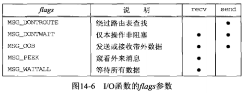

# 第14章 高级I/O函数

## 14.2 套接字超时

涉及套接字的I/O操作上设置超时的方法有以下3种

- 1.使用**alarm**，它在指定超时期满时产生SIGALRM信号（**适用于任何描述符**） 
  - 缺点：涉及信号处理，信号处理在不同实现上存在差异，而且可能干扰进程中现有的alarm信号
- 2.在**select**中阻塞等待I/O（select有内置的时间限制），以此替代直接阻塞在read或write调用上（**适用于任何描述符**） 
- 3.使用**SO_RCVTIMEO**和**SO_SNDTIMEO**套接字选项 （**仅使用于套接字描述符**） 
  - 缺点：并非所有实现都支持

上述3个技术都适用于输入和输出操作（read、write、recvfrom、sendto等）。但是对于connect（connect的**内置超时相当长，典型值为75s**）

- 1.使用SIGALRM设置（14.2.1详细介绍）
- 2.select用来在connect上设置超时的先决条件是相应套接字处于非阻塞模式 
- 3.`SO_RCVTIMEO`和`SO_SNDTIMEO`套接字选项对connect不适用 

### 14.2.1 使用SIGALRM为connect设置超时

```c
// 源码： lib/connect_timeo.c

/* include connect_timeo */
#include	"unp.h"

static void	connect_alarm(int);

int
connect_timeo(int sockfd, const SA *saptr, socklen_t salen, int nsec)
{
	Sigfunc	*sigfunc;
	int		n;

	//为SIGALRM建立一个新的信号处理函数
	//旧的信号处理函数保存在sigfunc中，以便在本函数结束时恢复它
	sigfunc = Signal(SIGALRM, connect_alarm);
	//报警时钟设置成由调用者指定的秒数
	//如果此前已经给本进程设置过报警时钟，那么alarm的返回值是这个报警时钟的当
	//剩余秒数，否则alarm返回值为0
	//如果是已经设置过的情况，需要显示一个警告信息，因为我们推翻了先前设置的报警时钟
	if (alarm(nsec) != 0)
		err_msg("connect_timeo: alarm was already set");

	//如果本调用被中断（即返回EINTR错误），
	//就把errno值设为ETIMEOUT，同时关闭套接字，以防三路握手继续进行
	if ( (n = connect(sockfd, saptr, salen)) < 0) {
		close(sockfd);
		if (errno == EINTR)
			errno = ETIMEDOUT;
	}
	//通过以0位参数调用alarm关闭本进程的报警时钟
	alarm(0);					/* turn off the alarm */
	//恢复原来的信号处理函数
	Signal(SIGALRM, sigfunc);	/* restore previous signal handler */

	return(n);
}

static void
connect_alarm(int signo)
{
	//信号处理函数只是简单的返回，
	//本return语句将中断进程主控制流中那个未决的connect调用，
	//使得它返回一个EINTR错误，当捕获的信号为SIGALARM时，不设置SA_RESTART标志
	return;		/* just interrupt the connect() */
}
/* end connect_timeo */

void
Connect_timeo(int fd, const SA *sa, socklen_t salen, int sec)
{
	if (connect_timeo(fd, sa, salen, sec) < 0)
		err_sys("connect_timeo error");
}
```

**缺点**：

- 1.总能减少connect的超时期限，但是无法延长内核现有的超时期限（比如能比75小，但是不能更大） 
- 2.使用了系统调用的可中断能力，使得它们能够在内核超时发生之前返回，前提是：执行的是系统调用，并且能够直接处理由它们返回的EINTR错误 
- 3.在多线程中正确使用信号非常困难 

**建议**：只是在未线程化或简单线程化的程序使用本技术

### 14.2.2 使用SIGALRM位recvfrom设置超时

改写8.6节中的dg_cli函数，新的dg_cli函数通过调用alarm使得一旦在5秒内收不到任何应答就中断recvfrom

```c
// 源码： advio/dgclitimeo3.c

#include	"unp.h"

static void	sig_alrm(int);

void
dg_cli(FILE *fp, int sockfd, const SA *pservaddr, socklen_t servlen)
{
	int	n;
	char	sendline[MAXLINE], recvline[MAXLINE + 1];

	//建立信号处理函数
	Signal(SIGALRM, sig_alrm);

	while (Fgets(sendline, MAXLINE, fp) != NULL) {

		Sendto(sockfd, sendline, strlen(sendline), 0, pservaddr, servlen);

		//调用recvfrom前设置5秒的超时
		alarm(5);
		if ( (n = recvfrom(sockfd, recvline, MAXLINE, 0, NULL, NULL)) < 0) {
			//如果fecvfrom被信号处理函数中断，
			//输出一个信息并跳过本次循环执行下一次循环
			if (errno == EINTR)
				fprintf(stderr, "socket timeout\n");
			else
				err_sys("recvfrom error");
		} else {
			//如果读到一行来自服务器的文本，则关掉报警时钟并输出服务器应答
			alarm(0);
			recvline[n] = 0;	/* null terminate */
			Fputs(recvline, stdout);
		}
	}
}

static void
sig_alrm(int signo)
{
	//简单的返回，以发送让recvfrom返回小于0，从而中断被阻塞的recvfrom
	return;			/* just interrupt the recvfrom() */
}
```

### 14.2.3 使用select为recvfrom设置超时

这个名为readable_timeo的函数等待一个描述符最多在指定的描述内变为可读。本函数不执行度操作，它只是等待给定描述符变为可读，因此本函数适合于任何类型的套接字（TCP、UDP）

**readable_timeo函数**：

```c
// 源码： lib/readable_timeo.c

/* include readable_timeo */
#include	"unp.h"

int
readable_timeo(int fd, int sec)
{
	fd_set			rset;
	struct timeval	tv;

	FD_ZERO(&rset);
	//在读描述符集中打开与调用者给定描述符对应的位
	FD_SET(fd, &rset);

	//把调用者给定的等待秒数设置在一个timeval结构中
	tv.tv_sec = sec;
	tv.tv_usec = 0;

	//select等待该描述符变为可读，或发生超时
	//出错时为-1
	//超时发生时为0
	//正常则返回正值，为已就绪描述符的数目
	return(select(fd+1, &rset, NULL, NULL, &tv));
		/* 4> 0 if descriptor is readable */
}
/* end readable_timeo */

int
Readable_timeo(int fd, int sec)
{
	int		n;

	if ( (n = readable_timeo(fd, sec)) < 0)
		err_sys("readable_timeo error");
	return(n);
}
```

**readable_timeo使用例子**：

```c
// 源码： advio/dgclitimeo1.c

#include	"unp.h"

void
dg_cli(FILE *fp, int sockfd, const SA *pservaddr, socklen_t servlen)
{
	int	n;
	char	sendline[MAXLINE], recvline[MAXLINE + 1];

	while (Fgets(sendline, MAXLINE, fp) != NULL) {

		Sendto(sockfd, sendline, strlen(sendline), 0, pservaddr, servlen);
		
		if (Readable_timeo(sockfd, 5) == 0) {
			fprintf(stderr, "socket timeout\n");
		} else {
			n = Recvfrom(sockfd, recvline, MAXLINE, 0, NULL, NULL);
			recvline[n] = 0;	/* null terminate */
			Fputs(recvline, stdout);
		}
	}
}
```

### 14.2.4 使用SO_RCVTIMEO套接字选项为recvfrom设置超时

本例展示SO_RCVTIMEO套接字选项如何设置超时

本选项一旦设置到某个描述符（包括指定超时值），其超时设置将应用与该描述符上的素有读操作

**优势**：一次性设置选项。SIGALARM和select方法在每个操作发生之前必须做一些工作

SO_RCVTIMEO仅仅应用与读操作；SO_SNDTIMEO仅仅应用于写操作。都无法用于connect设置超时

```c
// 源码： advio/dgclitimeo2.c

#include	"unp.h"

void
dg_cli(FILE *fp, int sockfd, const SA *pservaddr, socklen_t servlen)
{
	int				n;
	char			sendline[MAXLINE], recvline[MAXLINE + 1];
	struct timeval	tv;

	tv.tv_sec = 5;
	tv.tv_usec = 0;
	//设置超时
	Setsockopt(sockfd, SOL_SOCKET, SO_RCVTIMEO, &tv, sizeof(tv));

	while (Fgets(sendline, MAXLINE, fp) != NULL) {

		Sendto(sockfd, sendline, strlen(sendline), 0, pservaddr, servlen);

		n = recvfrom(sockfd, recvline, MAXLINE, 0, NULL, NULL);
		if (n < 0) {
			//如果超时，recvfrom返回-1，且errno设为EWOULDBLOCK
			if (errno == EWOULDBLOCK) {
				fprintf(stderr, "socket timeout\n");
				continue;
			} else
				err_sys("recvfrom error");
		}

		recvline[n] = 0;	/* null terminate */
		Fputs(recvline, stdout);
	}
}
```

# Unix I/O函数

这部分介绍的函数称为Unix I/O。它们围绕描述符工作，**通常作为Unix内核中的系统调用实现** 

包括

- 14.3 recv和send函数
- 14.4 readv和writev函数
- 14.5 recvmsg和sendmsg函数

## 14.3 recv和send函数

这两个函数与标准的read和write的不同在于第4个参数： 

```c
#include <sys/socket.h>

ssize_t recv(int sockfd, void* buff, size_t nbytes, int flags);

ssize_t send(int sockfd, const void* buff, size_t nbytes, int flags);

//返回值：若成功则为读入或写出的字节数，若出错则为-1
```

- **flag**：参数的值或为0，或为下图中一个或兑个常值的**逻辑或**



**解释**：

- **MSG_DONTROUTE**： 告知内核目的主机在某个直接连接的本地网络上，因而无需执行路由表查找 
  - 既可以使用`MSG_DONTROUTE`标志针对单个输出操作开启
  - 也可以使用`SO_DONTROUTE`套接字选项针对某个给定套接字上的所有输出操作开启
- **MSG_DONTWAIT**： 在无需打开相应套接字的非阻塞标准下，把单个I/O操作临时指定为非阻塞，接着执行I/O操作，然后关闭非阻塞标志
-  **MSG_OOB**：对于send，本标志指明即将发送带外数据；对于recv，指明即将读入的是带外数据而不是普通数据
- **MSG_PEEK**：本标志适用于**recv**和**recvfrom**。允许我们查看已经可读取的数据，而且系统不在recv或recvfrom返回后丢弃这些数据 
- **MSG_WAITALL**：告知内核不要在尚未读入请求数目的字节之前让一个读操作返回，但如果发生以下情况之一，相应的读函数仍然有可能返回比所请求字节数要少的数据
  - 捕获一个信号
  - 连接被终止
  - 套接字发生一个错误

**flags参数在设计上存在一个基本问题：它是值传递的，而不是一个值-结构参数。因此它只能用于从进程向内核传递标志。内核无法向进程传递标志**。对于TCP/IP协议这一点不成问题，因为TCP/IP几乎从不需要从内核向进程传回标志。然而随着OSI协议被加到4.3BSD Reno中，却提出了随输入操作向进程返送MSG_EOR标志的需求。4.3BSD  Reno做出的决定是保持常用输入函数(recv和recvfrom)的参数不变，而改变recvmsg和sendmsg的msghdr结构。这个决定同时意味着如果一个进程需要由内核更新标志，它就必须调用recvmsg，而不是recv或recvfrom 