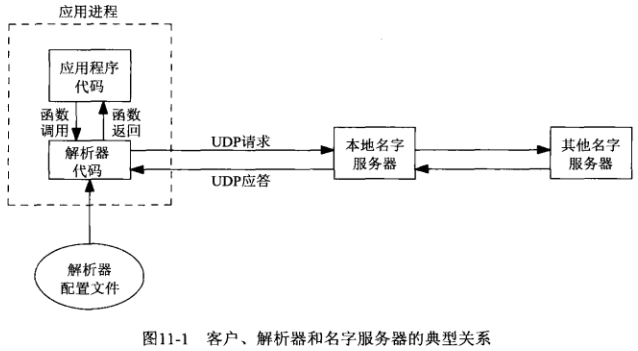

# 第11章 名字与地址转换

## 11.1 概述

**名字与数值间进行转换**： 

- **主机名字与IP地址之间进行转换**（**协议相关**，只支持**IPv4**）：
  - **主机名字转IP地址**：gethostbyname
  - **IP地址转主机名字**：gethostbyaddr
- **服务名字与端口号之间进行转换**： 
  - **服务名字转端口号**：getservbyname
  - **端口号转服务名字**：getservbyport
- **主机与服务名字转IP地址与端口号**： 
  - getaddrinfo（**协议无关**）
  - getaddrinfo的封装函数: 
    - host_serv
    - tcp_connect
    - tcp_listen
    - udp_client
    - udp_connect
    - udp_server
- **IP地址与端口号转主机与服务名字**：
  - getnameinfo

## 11.2 域名系统

域名系统（Domain Name System，DNS）主要用于主机名字与IP地址之间的映射

### 11.2.1 资源记录

DNS中的条目称为**资源记录**（Resource record，**RR**）

- **A**：A记录把一个**主机名映射成**一个32位的**IPv4地址**
  - 例子：unpbook.com域中关于主机freebsd的4条DNS记录，第一个是A记录


- **AAAA**：称为“四A”记录的AAAA记录把一个**主机名映射为**一个128位的**IPv6地址**
- **PTR**：称为“指针记录”（Point record）的PTR记录把**IP地址映射成主机名**
  - 方法：32位地址的4个字节先反转顺序，每个字节转换成各自的十进制ASCII值（0~255）后，再添加in-addr.arpa，结果字符串用PTR查询
  - 例子：上例子主机freebsd的IPv4的PTR记录为：`254.32.106.12.in-addr.arpa`
- **MX**：MX记录把一个主机指定作为给定主机的“邮件交换器”
  - 例子：如A例子中的两个MX，其中5、10表示优先级，值越小优先级越高
- **CNAME**：CNAME代表"canonical name"（规范名字），它的常见用法是为常用的服务（ftp、www）指派CNAME记录
  - 例子：名为linux的主机有以下2个CNAME记录
    - `www.unpbook.com`的规范主机名是`linux.unpbook.com`
    - `ftp.unpbook.com`的规范主机名是`linux.unpbook.com`


### 12.2.2 解析器和名字服务器



- **应用程序**代码使用通常的函数调用来执行**解析器**中的代码（调用的典型函数是gethostbyname和gethostbyaddr）
- **解析器**代码通过读取其系统相关配置文件(通常是/etc/resolv.conf，包含本地名字服务器主机的IP地址)确定本组织机构的名字服务器**们**的所在位置
-  解析器使用UDP向**本地名字服务器**发出查询，如果本地名字服务器不知道答案，通常会使用UDP在整个因特网上查询其它名字服务器（如果答案太长，超出了UDP消息的承载能力，本地名字服务器和解析器会自动切换到TCP） 

### 11.2.3 DNS替代方法

不使用DNS也可以获取名字和地址信息。通常的替代方法有：

- 1.静态主机文件（通常是/etc/hosts文件）
- 2.网络信息系统（NIS）
- 3.轻权目录访问协议（LDAP）

系统管理员如何配置一个主机以使用不同类型的名字服务是实现相关的，但这些差异对开发人员来说，通常是透明的，只需调用诸如gethostbyname和gethostbyaddr这样的解析器函数

## 11.3 gethostbyname函数


gethostbyname执行的是对A记录的查询，它只能返回IPv4地址

返回的指针指向hostent结构，该结构含有所查找主机的所有IPv4地址： 

```c
struct hostent{
    char *h_name;           //规范主机名
    char **h_aliases;       //主机别名
    int h_addrtype;         //主机地址类型：AF_INET
    int h_length;           //地址长度：4
    char **h_addr_list;     //IPv4地址
};
```


当发生错误时，函数会设置全局变量h_errno为定义在<netdb.h>中的下列常值： 

- **HOST_NOT_FOUND**：
- **TRY_AGAIN**：
- **NO_RECOVERY**：
- **NO_DATA**(等同于**NO_ADDRESS**)：表示指定的名字有效，但没有A记录（只有MX记录的主机名就是这样的一个例子）

如今多数解析器提供hstrerror函数，该函数以某个h_errno值作为唯一参数，返回一个指向相应错误说明的const char *指针 

**例子**：


