# 第11章 名字与地址转换

## 11.1 概述

**名字与数值间进行转换**： 

- **主机名字与IP地址之间进行转换**（**协议相关**，只支持**IPv4**）：
  - **主机名字转IP地址**：gethostbyname
  - **IP地址转主机名字**：gethostbyaddr
- **服务名字与端口号之间进行转换**： 
  - **服务名字转端口号**：getservbyname
  - **端口号转服务名字**：getservbyport
- **主机与服务名字转IP地址与端口号**： 
  - getaddrinfo（**协议无关**）
  - getaddrinfo的封装函数: 
    - host_serv
    - tcp_connect
    - tcp_listen
    - udp_client
    - udp_connect
    - udp_server
- **IP地址与端口号转主机与服务名字**：
  - getnameinfo

## 11.2 域名系统

域名系统（Domain Name System，DNS）主要用于主机名字与IP地址之间的映射

### 11.2.1 资源记录

DNS中的条目称为**资源记录**（Resource record，**RR**）

- **A**：A记录把一个**主机名映射成**一个32位的**IPv4地址**
  - 例子：unpbook.com域中关于主机freebsd的4条DNS记录，第一个是A记录


- **AAAA**：称为“四A”记录的AAAA记录把一个**主机名映射为**一个128位的**IPv6地址**
- **PTR**：称为“指针记录”（Point record）的PTR记录把**IP地址映射成主机名**
  - 方法：32位地址的4个字节先反转顺序，每个字节转换成各自的十进制ASCII值（0~255）后，再添加in-addr.arpa，结果字符串用PTR查询
  - 例子：上例子主机freebsd的IPv4的PTR记录为：`254.32.106.12.in-addr.arpa`
- **MX**：MX记录把一个主机指定作为给定主机的“邮件交换器”
  - 例子：如A例子中的两个MX，其中5、10表示优先级，值越小优先级越高
- **CNAME**：CNAME代表"canonical name"（规范名字），它的常见用法是为常用的服务（ftp、www）指派CNAME记录
  - 例子：名为linux的主机有以下2个CNAME记录
    - `www.unpbook.com`的规范主机名是`linux.unpbook.com`
    - `ftp.unpbook.com`的规范主机名是`linux.unpbook.com`


### 12.2.2 解析器和名字服务器


- **应用程序**代码使用通常的函数调用来执行**解析器**中的代码（调用的典型函数是gethostbyname和gethostbyaddr）
- **解析器**代码通过读取其系统相关配置文件(通常是/etc/resolv.conf，包含本地名字服务器主机的IP地址)确定本组织机构的名字服务器**们**的所在位置
-  解析器使用UDP向**本地名字服务器**发出查询，如果本地名字服务器不知道答案，通常会使用UDP在整个因特网上查询其它名字服务器（如果答案太长，超出了UDP消息的承载能力，本地名字服务器和解析器会自动切换到TCP） 

### 11.2.3 DNS替代方法

不使用DNS也可以获取名字和地址信息。通常的替代方法有：

- 1.静态主机文件（通常是/etc/hosts文件）
- 2.网络信息系统（NIS）
- 3.轻权目录访问协议（LDAP）

系统管理员如何配置一个主机以使用不同类型的名字服务是实现相关的，但这些差异对开发人员来说，通常是透明的，只需调用诸如gethostbyname和gethostbyaddr这样的解析器函数

# 主机名字与IP地址之间的转换

## 11.3 gethostbyname函数


gethostbyname执行的是对A记录的查询，它只能返回IPv4地址

返回的指针指向hostent结构，该结构含有所查找主机的所有IPv4地址： 

```c
struct hostent{
    char *h_name;           //规范主机名
    char **h_aliases;       //主机别名
    int h_addrtype;         //主机地址类型：AF_INET
    int h_length;           //地址长度：4
    char **h_addr_list;     //IPv4地址
};
```


当发生错误时，函数会设置全局变量h_errno为定义在<netdb.h>中的下列常值： 

- **HOST_NOT_FOUND**：
- **TRY_AGAIN**：
- **NO_RECOVERY**：
- **NO_DATA**(等同于**NO_ADDRESS**)：表示指定的名字有效，但没有A记录（只有MX记录的主机名就是这样的一个例子）

如今多数解析器提供hstrerror函数，该函数以某个h_errno值作为唯一参数，返回一个指向相应错误说明的const char *指针 

## 11.4 gethostbyaddr函数

该函数试图由一个**二进制**的IP地址找到相应的主机名，与gethostbyname的行为相反 

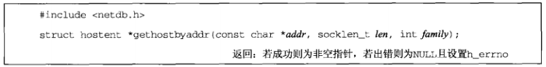

- **addr**：实际上是一个指向存放IPv4地址的某个in_addr结构的指针 
- **len**：addr指向的in_addr结构的大小（对于IPv4地址为4） 
- **family**：AF_INET 
- **返回值**：返回一个指向hostent结构的指针，但是不同于gethostbyname，这里我们感兴趣的通常是存放规范主机名的h_name字段 

按照DNS的说法，gethostbyaddr在in_addr.arpa域中向一个名字服务器查询PTR记录

# 服务名字与端口号之间的转换

## 11.5 getservbyname和getservbyport函数

在程序代码中通常通过其名字而不是端口号来指代一个服务（如ftp、shell之类），而且从名字到端口号的映射关系保存在一个文件中（通常是/etc/services）。当端口号发生变动，我们只需要修改/etc/services文件中的某一行，而不必重新编译应用程序

/etc/services文件通常包含IANA维护的规范赋值列表的某个子集

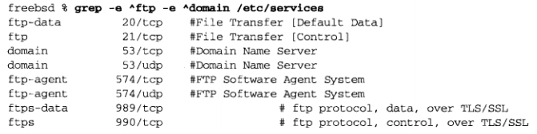

> getservbyname函数

getservbyname函数根据给定名字查找相应服务


- **servname**：服务名参数，必须指定
- **protoname**：协议，如果指定了，那么指定的服务必须有匹配的协议（如果protoname未指定而servname服务支持多个协议，那么返回哪个端口号取决于实现）

函数成功时返回指向servent结构的指针： 

```c
struct servent{
    char *s_name;       //规范服务名
    char **s_aliases;   //服务别名
    int s_port;         //服务对应的端口号（网络字节序）
    char *s_proto;      //使用的协议
};
```

> getservbyport函数

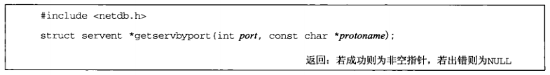

- **port**：端口号，必须为网络字节序
- **protoname**：指定协议（有些端口号在TCP上用于一种服务，在UDP上却用于完全不同的另一种服务）

## 使用gethogetservbyport函数stbyname和getservbyname

```c
// 源码： names/daytimetcpcli1.c

#include	"unp.h"

int
main(int argc, char **argv)
{
	int					sockfd, n;
	char				recvline[MAXLINE + 1];
	struct sockaddr_in	servaddr;
	struct in_addr		**pptr;
	struct in_addr		*inetaddrp[2];
	struct in_addr		inetaddr;
	struct hostent		*hp;
	struct servent		*sp;

	if (argc != 3)
		err_quit("usage: daytimetcpcli1 <hostname> <service>");

	//第一个命令行参数是主机名
	if ( (hp = gethostbyname(argv[1])) == NULL) {
		//如果gethostbyname查找失败
		//使用inet_aton判断argv[1]是否已经是ASCII格式的地址
		//inet_aton:将第一个参数所指的C字符串转换成32位的网络字节序二进制值，并通过第二个参数来存储
		if (inet_aton(argv[1], &inetaddr) == 0) {
			err_quit("hostname error for %s: %s", argv[1], hstrerror(h_errno));
		} else {
			//如果已经是ASCII格式的地址
			//构造一个由相应的地址构成的单元素列表
			inetaddrp[0] = &inetaddr;
			//表示达到尾元素，与h_addr_list做法一样
			inetaddrp[1] = NULL;
			pptr = inetaddrp;
		}
	} else {
		//gethostbyname查找成功
		pptr = (struct in_addr **) hp->h_addr_list;
	}

	//第二个参数是服务名
	if ( (sp = getservbyname(argv[2], "tcp")) == NULL)
		err_quit("getservbyname error for %s", argv[2]);

	//该循环为服务器主机的每个地址执行一次，直到connect成功或IP地址列表试完为止
	for ( ; *pptr != NULL; pptr++) {
		sockfd = Socket(AF_INET, SOCK_STREAM, 0);

		bzero(&servaddr, sizeof(servaddr));
		servaddr.sin_family = AF_INET;
		servaddr.sin_port = sp->s_port;
		memcpy(&servaddr.sin_addr, *pptr, sizeof(struct in_addr));
		printf("trying %s\n",
			   Sock_ntop((SA *) &servaddr, sizeof(servaddr)));

		if (connect(sockfd, (SA *) &servaddr, sizeof(servaddr)) == 0)
			break;		/* success */
		err_ret("connect error");
		//如果connect失败，必须关闭套接字，并重新创建一个新的套接字使用
		close(sockfd);
	}
	if (*pptr == NULL)
		err_quit("unable to connect");

	while ( (n = Read(sockfd, recvline, MAXLINE)) > 0) {
		recvline[n] = 0;	/* null terminate */
		Fputs(recvline, stdout);
	}
	exit(0);
}
#include	"unp.h"

int
main(int argc, char **argv)
{
	int					sockfd, n;
	char				recvline[MAXLINE + 1];
	struct sockaddr_in	servaddr;
	struct in_addr		**pptr;
	struct in_addr		*inetaddrp[2];
	struct in_addr		inetaddr;
	struct hostent		*hp;
	struct servent		*sp;

	if (argc != 3)
		err_quit("usage: daytimetcpcli1 <hostname> <service>");

	//第一个命令行参数是主机名
	if ( (hp = gethostbyname(argv[1])) == NULL) {
		//如果gethostbyname查找失败
		//使用inet_aton判断argv[1]是否已经是ASCII格式的地址
		//inet_aton:将第一个参数所指的C字符串转换成32位的网络字节序二进制值，并通过第二个参数来存储
		if (inet_aton(argv[1], &inetaddr) == 0) {
			err_quit("hostname error for %s: %s", argv[1], hstrerror(h_errno));
		} else {
			//如果已经是ASCII格式的地址
			//构造一个由相应的地址构成的单元素列表
			inetaddrp[0] = &inetaddr;
			//表示达到尾元素，与h_addr_list做法一样
			inetaddrp[1] = NULL;
			pptr = inetaddrp;
		}
	} else {
		//gethostbyname查找成功
		pptr = (struct in_addr **) hp->h_addr_list;
	}

	//第二个参数是服务名
	if ( (sp = getservbyname(argv[2], "tcp")) == NULL)
		err_quit("getservbyname error for %s", argv[2]);

	//该循环为服务器主机的每个地址执行一次，直到connect成功或IP地址列表试完为止
	for ( ; *pptr != NULL; pptr++) {
		sockfd = Socket(AF_INET, SOCK_STREAM, 0);

		bzero(&servaddr, sizeof(servaddr));
		servaddr.sin_family = AF_INET;
		servaddr.sin_port = sp->s_port;
		memcpy(&servaddr.sin_addr, *pptr, sizeof(struct in_addr));
		printf("trying %s\n",
			   Sock_ntop((SA *) &servaddr, sizeof(servaddr)));

		if (connect(sockfd, (SA *) &servaddr, sizeof(servaddr)) == 0)
			break;		/* success */
		err_ret("connect error");
		//如果connect失败，必须关闭套接字，并重新创建一个新的套接字使用
		close(sockfd);
	}
	if (*pptr == NULL)
		err_quit("unable to connect");

	while ( (n = Read(sockfd, recvline, MAXLINE)) > 0) {
		recvline[n] = 0;	/* null terminate */
		Fputs(recvline, stdout);
	}
	exit(0);
}
```

# 主机与服务名字转IP地址与端口号

## 11.6 getaddrinfo函数

gethostbyname和gethostbyaddr仅仅支持IPv4

getaddrinfo与协议无关，并且能处理**名字到地址**、**服务到端口**这两种转换。返回的不再是地址列表，返回的addrinfo结构中包含了一个指向sockaddr结构的指针，这些sockaddr结构随后可由套接字函数**直接使用**，因此将协议相关性完全隐藏在函数的内部 

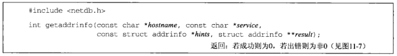

- **hostname**：主机名或地址串
- **service**：服务名或十进制端口号数串
- **hints**：空指针或指向某个addrinfo结构的指针，调用者在这个结构中填入期望返回的信息类型的暗示
  - 如果hints参数是一个空指针，函数就假设ai_flags、ai_family、ai_socktype为0，ai_protocol为AF_UNSPEC
  - 调用者可以通过hints设置的字段有：ai_flags、ai_family、ai_socktype、ai_protocol
- **result**：指向addrinfo结构的指针，**返回值** 
  - 如果与hostname参数关联的地址有多个，那么适用于所请求地址族的每个地址都返回一个对应的结构 
  - 如果service参数指定的服务支持多个套接字类型，那么每个套接字类型都可能返回一个对应的结构 

```c
struct addrinfo{
    int ai_flags;               //0个或多个或在一起的AI_xxx值
    int ai_family;              //某个AF_xxx值
    int ai_socktype;            //某个SOCK_xxx值
    int ai_protocol;            //0或IPPROTO_xxx
    socklen_t ai_addrlen;       //ai_addr的长度
    char *ai_canonname;         //指向规范主机名的指针
    struct sockaddr *ai_addr;   //指向套接字地址结构的指针
    struct addrinfo *ai_next;   //指向链表中下一个addrinfo结构的指针
};
```

**ai_flags**成员可用的标志值及含义如下：

- **AI_PASSIVE**：套接字将用于被动打开
- **AI_CANONNAME**：告知getaddrinfo函数返回主机的规范名字（在链表中的第一个addrinfo结构的ai_canonname成员中）
- **AI_NUMERICHOST**：防止任何类型的名字到地址映射，hostname参数必须是一个地址串
- **AI_NUMERICSERV**：防止任何类型的名字到服务映射，service参数必须是一个十进制端口号数串
- **AI_V4MAPPED**：如果同时指定ai_family的值为AF_INET6，那么如果没有可用的AAAA记录，就返回与A记录对应的IPv4映射的IPv6地址
- **AI_ALL**：如果同时指定了AI_V4MAPPED，那么返回与AAAA记录对应的IPv6地址、与A记录对于的IPv4映射的IPv6地址
- **AI_ADDRCONFIG**：按照所在主机的配置选择返回地址类型

**例子**：假设主机freebsd4的规范名字是freebsd4.unpbook.com，并且它在DNS中有两个IPv4地址

调用getaddrinfo函数，如果函数成功，result指向的变量已被填入一个指针，指向的是由ai_next成员串起来的addrinfo结构链表（这些结构的先后顺序没有保证）： 

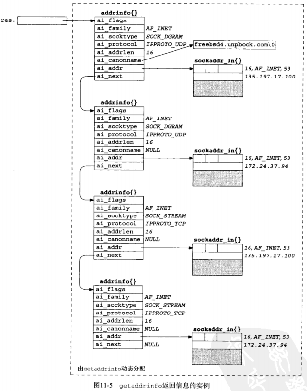

getaddrinfo的**常见用法**：

- **TCP或UDP客户同时制定hostname和service** 
  - **TCP客户**：在一个循环中针对每个返回的IP地址，逐一调用socket和connect，直到有一个连接成功，或者所有地址尝试完毕 
  - **UDP客户**：由getaddrinfo填入的套接字地址结构用于调用sendto或connect。如果客户能够判断第一个地址看来不工作（或者在已连接的UDP套接字上收到出错消息，或者在未连接的套接字上经历消息接收超时），那么可以尝试其余地址 
- **典型的服务器只指定service而不指定hostname，同时在hints结构中指定AI_PASSIVE标志**。返回的套接字地址结构中应含有一个值为INADDR_ANY(对于IPv4)或IN6ADDR_ANY_INIT(对于IPv6)的IP地址 
  - 函数返回后，**TCP服务器**调用socket、bind和listen。如果服务器想要malloc另一个套接字地址结构以从accept获取客户的地址，那么返回的ai_addrlen值给出了这个套接字地址结构的大小 
  - **UDP服务器**将调用socket、bind和recvfrom。如果想要malloc另一个套接字地址结构以从recvfrom获取客户的地址，那么返回的ai_addrlen值给出了这个套接字地址结构的大小 
- **服务器程序使用select或poll函数让服务器进程处理多个套接字**：服务器将遍历由getaddrinfo返回的整个addrinfo结构链表，并为每个结构创建一个套接字，再使用select或poll 

如果**客户或服务器**清楚自己只处理一种类型的套接字，那么应该把hints结构的ai_socktype成员设置成SOCK_STREAM或SOCK_DGRAM 

getaddrinfo函数的**优点**：

- 协议无关
- 单个函数能够同时处理主机名和服务
- 所有返回信息都是**动态分配**的

getaddrinfo函数的**缺点**：必须先分配一个hints结构，把它清零后填写需要的字段，再调用getaddrinfo，然后遍历一个链表逐一尝试每个返回地址 

## 11.7 gai_strerror函数

如果getaddrinfo函数发生**错误**，该函数返回错误值，该值可以作为函数**gai_strerror()**的参数。调用gai_strerror函数可以得到一个描述错误信息的C字符串指针： 

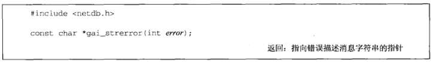

**error的值**如下表：

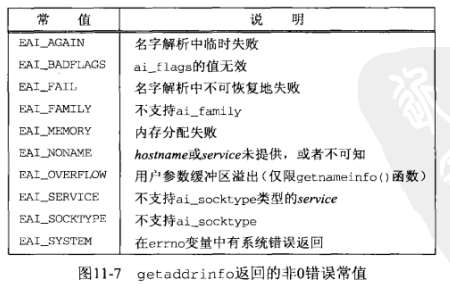

## 11.8 freeaddrinfo函数

getaddrinfo函数返回的所有**存储空间都是动态获取**（譬如来自malloc调用）的，包括addrinfo结构、ai_addr结构和ai_canonname字符串，可以通过调用**freeaddrinfo**返**还给系统**： 

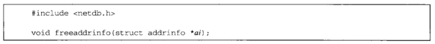

- **ai**：指向由getaddrinfo返回的第一个addrinfo结构（这个链表中所有的结构以及由它们指向的任何动态存储空间都被释放掉） 

## 11.11 host_serv函数

host_serv封装了函数getaddrinfo，不要求调用者分配并填写一个hints结构，该结构中的**地址族**和**套接字类型**字段作为参数： 

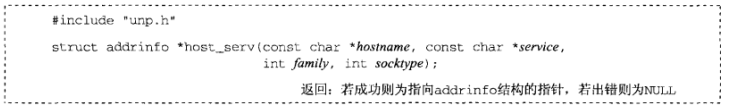

**host_serv函数**：

```c
// 源码： lib/host_serv.c

#include	"unp.h"

struct addrinfo *
host_serv(const char *host, const char *serv, int family, int socktype)
{
	int				n;
	struct addrinfo	hints, *res;

	//初始化一个hints结构
	bzero(&hints, sizeof(struct addrinfo));
	hints.ai_flags = AI_CANONNAME;	/* always return canonical name */
	hints.ai_family = family;		/* AF_UNSPEC, AF_INET, AF_INET6, etc. */
	hints.ai_socktype = socktype;	/* 0, SOCK_STREAM, SOCK_DGRAM, etc. */

	if ( (n = getaddrinfo(host, serv, &hints, &res)) != 0)
		return(NULL);

	return(res);	/* return pointer to first on linked list */
}
```

## 11.12 tcp_connect函数

tcp_connect执行TCP客户的通常步骤：创建一个TCP套接字并连接到一个服务器 

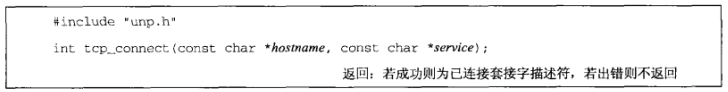

**tcp_connect函数**：

```c
// 源码： lib/tcp_connect.c

#include	"unp.h"

int
tcp_connect(const char *host, const char *serv)
{
	int				sockfd, n;
	struct addrinfo	hints, *res, *ressave;

	bzero(&hints, sizeof(struct addrinfo));
	//指定地址族为AF_UNSPEC
	hints.ai_family = AF_UNSPEC;
	//指定套接字类型为SOCK_STREAM
	hints.ai_socktype = SOCK_STREAM;

	if ( (n = getaddrinfo(host, serv, &hints, &res)) != 0)
		err_quit("tcp_connect error for %s, %s: %s",
				 host, serv, gai_strerror(n));
	ressave = res;

	//尝试getinfo返回的每一个IP地址
	do {
		sockfd = socket(res->ai_family, res->ai_socktype, res->ai_protocol);
		if (sockfd < 0)
			continue;	/* ignore this one */

		if (connect(sockfd, res->ai_addr, res->ai_addrlen) == 0)
			break;		/* success */

		Close(sockfd);	/* ignore this one */
	} while ( (res = res->ai_next) != NULL);

	if (res == NULL)	/* errno set from final connect() */
		err_sys("tcp_connect error for %s, %s", host, serv);

	//把所有动态分配的内存空间返回系统
	freeaddrinfo(ressave);

	return(sockfd);
}
```

**例子：时间获取TCP客户程序**

```c
// 源码： names/daytimetcpcli.c

#include	"unp.h"

int
main(int argc, char **argv)
{
	int				sockfd, n;
	char			recvline[MAXLINE + 1];
	socklen_t		len;
	struct sockaddr_storage	ss;

	if (argc != 3)
		err_quit("usage: daytimetcpcli <hostname/IPaddress> <service/port#>");

	//argv[1]：主机名或IP地址
	//argv[2]：服务名或端口号
	sockfd = Tcp_connect(argv[1], argv[2]);

	len = sizeof(ss);
	//取得服务器的协议地址并显示出来，为了在后面的例子中验证所用的协议
	Getpeername(sockfd, (SA *)&ss, &len);
	printf("connected to %s\n", Sock_ntop_host((SA *)&ss, len));

	while ( (n = Read(sockfd, recvline, MAXLINE)) > 0) {
		recvline[n] = 0;	/* null terminate */
		Fputs(recvline, stdout);
	}
	exit(0);
}
```

## 11.13 tcp_listen函数

tcp_listen执行TCP服务器的通常步骤：创建一个TCP套接字，给它捆绑服务器的众所周知的端口，并允许接受外来的连接请求： 

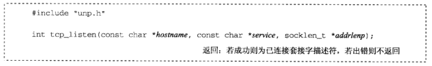

**tcp_listen函数**：

```c
// 源码： lib/tcp_listen.c

#include	"unp.h"

int
tcp_listen(const char *host, const char *serv, socklen_t *addrlenp)
{
	int				listenfd, n;
	const int		on = 1;
	struct addrinfo	hints, *res, *ressave;

	bzero(&hints, sizeof(struct addrinfo));
	//套接字将用于被动打开，因为本函数供服务器使用
	hints.ai_flags = AI_PASSIVE;
	//指定地址族为AF_UNSPEC
	hints.ai_family = AF_UNSPEC;
	hints.ai_socktype = SOCK_STREAM;

	//如果不指定主机名host（对于想绑定通配地址的服务器通常如此）
	//AI_PASSIVE和AF_UNSPEC这两个暗示信息将会返回两个套接字地址结构
	//第一个是IPv6的，第二个是IPv4的（假定运行在一个双栈主机上）
	if ( (n = getaddrinfo(host, serv, &hints, &res)) != 0)
		err_quit("tcp_listen error for %s, %s: %s",
				 host, serv, gai_strerror(n));
	ressave = res;

	//调用socket和bind函数，如果任何一个调用失败，那就忽略当前addrinfo结构而改用下一个
	do {
		listenfd = socket(res->ai_family, res->ai_socktype, res->ai_protocol);
		if (listenfd < 0)
			continue;		/* error, try next one */

		//对TCP服务器总是设置SO_REUSEADDR套接字选项
		Setsockopt(listenfd, SOL_SOCKET, SO_REUSEADDR, &on, sizeof(on));
		if (bind(listenfd, res->ai_addr, res->ai_addrlen) == 0)
			break;			/* success */

		Close(listenfd);	/* bind error, close and try next one */
	} while ( (res = res->ai_next) != NULL);

	//检查是否失败（遍历完整个链表），如果失败则显示一个出错消息并终止
	if (res == NULL)	/* errno from final socket() or bind() */
		err_sys("tcp_listen error for %s, %s", host, serv);

	Listen(listenfd, LISTENQ);

	//通过addrlenp指针返回协议地址的大小
	if (addrlenp)
		*addrlenp = res->ai_addrlen;	/* return size of protocol address */

	freeaddrinfo(ressave);

	return(listenfd);
}
```

**例子：时间获取TCP服务器程序（不可指定协议）**

```c
// 源码： names/daytimesrv1.c

#include	"unp.h"
#include	<time.h>

int
main(int argc, char **argv)
{
	int				listenfd, connfd;
	socklen_t		len;
	char			buff[MAXLINE];
	time_t			ticks;
	struct sockaddr_storage	cliaddr;

	if (argc != 2)
		err_quit("usage: daytimetcpsrv1 <service or port#>");

    //第一个参数是空指针，由tcp_listen内部指定的协议族为AF_UNSPEC
    //在双栈主机上返回IPv6个IPv4套接字地址结构
	listenfd = Tcp_listen(NULL, argv[1], NULL);

	for ( ; ; ) {
		len = sizeof(cliaddr);
		connfd = Accept(listenfd, (SA *)&cliaddr, &len);
		printf("connection from %s\n", Sock_ntop((SA *)&cliaddr, len));

		ticks = time(NULL);
		snprintf(buff, sizeof(buff), "%.24s\r\n", ctime(&ticks));
		Write(connfd, buff, strlen(buff));

		Close(connfd);
	}
}

```

**例子：时间获取TCP服务器程序（可指定协议）**

该版本允许我们强制服务器使用某个给定的协议（IPv4或IPv6）：允许用户作为程序的命令行参数输入一个IP地址或主机名，根据输入值判断协议类型（getaddrinfo会自行判断）

```c
// 源码： names/daytimesrv2.c

#include	"unp.h"
#include	<time.h>

int
main(int argc, char **argv)
{
	int				listenfd, connfd;
	socklen_t		len, addrlen;
	char			buff[MAXLINE];
	time_t			ticks;
	struct sockaddr_storage	cliaddr;

    //主要修改在这里
	if (argc == 2)
		listenfd = Tcp_listen(NULL, argv[1], &addrlen);
	else if (argc == 3)
		listenfd = Tcp_listen(argv[1], argv[2], &addrlen);
	else
		err_quit("usage: daytimetcpsrv2 [ <host> ] <service or port>");

	for ( ; ; ) {
		len = sizeof(cliaddr);
		connfd = Accept(listenfd, (SA *)&cliaddr, &len);
		printf("connection from %s\n", Sock_ntop((SA *)&cliaddr, len));

		ticks = time(NULL);
		snprintf(buff, sizeof(buff), "%.24s\r\n", ctime(&ticks));
		Write(connfd, buff, strlen(buff));

		Close(connfd);
	}
}
```

## 11.14 udp_client函数

创建未连接UDP套接字 ：

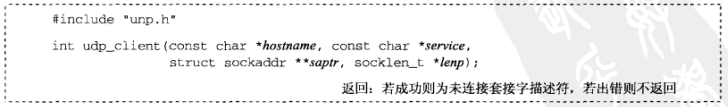

- **saptr**：指向的套接字地址结构保存有服务器的IP地址和端口号，用于稍后调用sendto 
- **lenp**：saptr所指的套接字地址结构的大小。不能为空指针，因为任何sendto和recvfrom调用都需要知道套接字地址结构的长度 

**udp_client函数**：

```c
// 源码： lib/udp_client.c

#include	"unp.h"

int
udp_client(const char *host, const char *serv, SA **saptr, socklen_t *lenp)
{
	int				sockfd, n;
	struct addrinfo	hints, *res, *ressave;

	bzero(&hints, sizeof(struct addrinfo));
	hints.ai_family = AF_UNSPEC;
	hints.ai_socktype = SOCK_DGRAM;

	if ( (n = getaddrinfo(host, serv, &hints, &res)) != 0)
		err_quit("udp_client error for %s, %s: %s",
				 host, serv, gai_strerror(n));
	ressave = res;

	do {
		sockfd = socket(res->ai_family, res->ai_socktype, res->ai_protocol);
		if (sockfd >= 0)
			break;		/* success */
	} while ( (res = res->ai_next) != NULL);

	if (res == NULL)	/* errno set from final socket() */
		err_sys("udp_client error for %s, %s", host, serv);

	//用于分配一个套接字地址结构的内存空间
	*saptr = Malloc(res->ai_addrlen);
	memcpy(*saptr, res->ai_addr, res->ai_addrlen);
	*lenp = res->ai_addrlen;

	freeaddrinfo(ressave);

	return(sockfd);
}
```

**例子：时间获取UDP客户程序（可指定协议）**

```c
// 源码： names/daytimeudpcli1.c

#include	"unp.h"

int
main(int argc, char **argv)
{
	int				sockfd, n;
	char			recvline[MAXLINE + 1];
	socklen_t		salen;
	struct sockaddr	*sa;

	if (argc != 3)
		err_quit("usage: daytimeudpcli1 <hostname/IPaddress> <service/port#>");

	//获得一个UDP套接字，注意这里的salen
	sockfd = Udp_client(argv[1], argv[2], (void **) &sa, &salen);

	printf("sending to %s\n", Sock_ntop_host(sa, salen));

	Sendto(sockfd, "", 1, 0, sa, salen);	/* send 1-byte datagram */

	n = Recvfrom(sockfd, recvline, MAXLINE, 0, NULL, NULL);
	recvline[n] = '\0';	/* null terminate */
	Fputs(recvline, stdout);

	exit(0);
}
```

## 11.15 udp_connect函数

创建一个已连接UDP套接字： 

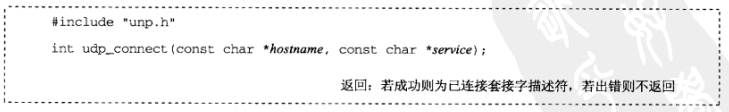

因为已连接套接字改用write代替sendto，所以相比于udp_client，省略了套接字地址结构及长度参数 

**udp_connect函数**：

与tcp_connect的区别：

- UDP套接字上的connect调用不会发送任何东西到对端。如果存在错误（如对端不可达或指定端口上没有服务器），调用者就得等到向对端发送一个数据报后才能发现

```c
// 源码： lib/udp_server.c

#include	"unp.h"

int
udp_server(const char *host, const char *serv, socklen_t *addrlenp)
{
	int				sockfd, n;
	struct addrinfo	hints, *res, *ressave;

	bzero(&hints, sizeof(struct addrinfo));
	hints.ai_flags = AI_PASSIVE;
	hints.ai_family = AF_UNSPEC;
	hints.ai_socktype = SOCK_DGRAM;

	if ( (n = getaddrinfo(host, serv, &hints, &res)) != 0)
		err_quit("udp_server error for %s, %s: %s",
				 host, serv, gai_strerror(n));
	ressave = res;

	do {
		sockfd = socket(res->ai_family, res->ai_socktype, res->ai_protocol);
		if (sockfd < 0)
			continue;		/* error - try next one */

		if (bind(sockfd, res->ai_addr, res->ai_addrlen) == 0)
			break;			/* success */

		Close(sockfd);		/* bind error - close and try next one */
	} while ( (res = res->ai_next) != NULL);

	if (res == NULL)	/* errno from final socket() or bind() */
		err_sys("udp_server error for %s, %s", host, serv);

	if (addrlenp)
		*addrlenp = res->ai_addrlen;	/* return size of protocol address */

	freeaddrinfo(ressave);

	return(sockfd);
}
```

## 11.16 udp_server函数

创建一个用于UDP服务器的UDP套接字：

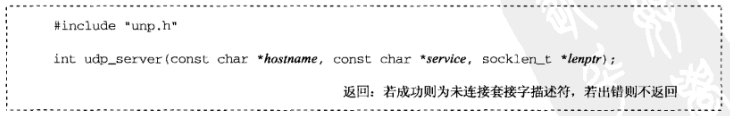

**udp_server函数**：

与tcp_listen的区别：

- 没有调用listen
- 不设置SO_REUSEADDR，因为该套接字选项允许在支持多播的主机上把同一个UDP端口绑定到多个套接字上。既然UDP套接字没有TCP的TIME_WAIT状态的类似物，启动服务器时就没有设置这个套接字选项的必要

```c
// 源码： lib/udp_server.c

#include	"unp.h"

int
udp_server(const char *host, const char *serv, socklen_t *addrlenp)
{
	int				sockfd, n;
	struct addrinfo	hints, *res, *ressave;

	bzero(&hints, sizeof(struct addrinfo));
	hints.ai_flags = AI_PASSIVE;
	hints.ai_family = AF_UNSPEC;
	hints.ai_socktype = SOCK_DGRAM;

	if ( (n = getaddrinfo(host, serv, &hints, &res)) != 0)
		err_quit("udp_server error for %s, %s: %s",
				 host, serv, gai_strerror(n));
	ressave = res;

	do {
		sockfd = socket(res->ai_family, res->ai_socktype, res->ai_protocol);
		if (sockfd < 0)
			continue;		/* error - try next one */

		if (bind(sockfd, res->ai_addr, res->ai_addrlen) == 0)
			break;			/* success */

		Close(sockfd);		/* bind error - close and try next one */
	} while ( (res = res->ai_next) != NULL);

	if (res == NULL)	/* errno from final socket() or bind() */
		err_sys("udp_server error for %s, %s", host, serv);

	if (addrlenp)
		*addrlenp = res->ai_addrlen;	/* return size of protocol address */

	freeaddrinfo(ressave);

	return(sockfd);
}
```

**例子：时间获取UDP服务器程序（可指定协议）**

```c
// 源码： names/daytimeudpsrv2.c

#include	"unp.h"
#include	<time.h>

int
main(int argc, char **argv)
{
	int				sockfd;
	ssize_t			n;
	char			buff[MAXLINE];
	time_t			ticks;
	socklen_t		len;
	struct sockaddr_storage	cliaddr;

	if (argc == 2)
		sockfd = Udp_server(NULL, argv[1], NULL);
	else if (argc == 3)
		sockfd = Udp_server(argv[1], argv[2], NULL);
	else
		err_quit("usage: daytimeudpsrv [ <host> ] <service or port>");

	for ( ; ; ) {
		len = sizeof(cliaddr);
		n = Recvfrom(sockfd, buff, MAXLINE, 0, (SA *)&cliaddr, &len);
		printf("datagram from %s\n", Sock_ntop((SA *)&cliaddr, len));

		ticks = time(NULL);
		snprintf(buff, sizeof(buff), "%.24s\r\n", ctime(&ticks));
		Sendto(sockfd, buff, strlen(buff), 0, (SA *)&cliaddr, len);
	}
}
```

# IP地址与端口号转主机与服务名字

## 11.17 getnameinfo

getaddrinfo的互补函数，以一个套接字地址为参数，返回描述其中的主机的一个字符串和描述其中的服务的另一个字符串

**sock_ntop和getnameinfo的差别**：前者不涉及DNS，只返回IP地址和端口号的一个可显示版本；后者通常尝试获取主机和服务的名字（PTR记录）

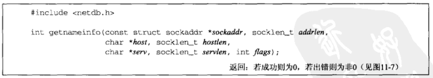

- **sockaddr**：指向套接字地址结构，包含了待转换为可读字符串的协议地址
- **addrlen**：sockaddr指向的套接字地址结构的大小
- **host**：指向存储转换得到的”主机名“信息的buf（调用者预先分配）
- **hostlen**：host指向的buf的大小（不想获得”主机名“信息则设为0）
- **serv**：指向存储转换得到的”服务名“信息的buf（调用者预先分配）
- **servlen**：serv指向的buf的大小（不想获得”服务名“信息则设为0）
- **flags**：标志，见下表

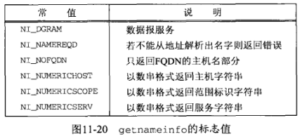

**对flag的解释**：

- **NI_DGRAM**：当知道处理的是数据报套接字时，调用者应设置NI_DGRAM标志，因为在套接字地址结构中给出的仅仅是IP地址和端口号，getnameinfo无法就此确定所用协议（TCP或UDP）
- **NI_NAMEREQD**：如果无法使用DNS反向解析出主机名，该标志将导致返回一个错误
- **NI_NOFQDN**：FQDN：全限定额主机名。例如：主机名是bigserver,域名是mycompany.com,那么FQDN就是bigserver.mycompany.com 。
  - 假设套接字地址结构中的IP地址为192.168.42.2。那么不设置本标志的返回的主机名为`aix.unpbook.com`，设置本标志的返回的主机名为`aix`
- **NI_NUMERICHOST**：告知getnameinfo不要调用DNS，而是以数值表达格式以字符串的形式返回IP地址（可能调用inet_ntop）实现
- **NI_NUMERICSERV**：指定以十进制数格式作为字符串返回端口号，以替代查找服务名
- **NI_NUMERICSSCOPE**：指定以数值格式作为字符串返回范围标识，以替代其名字
- 可以把其中各个标志逻辑或在一起

## 12.21 其他网络相关信息