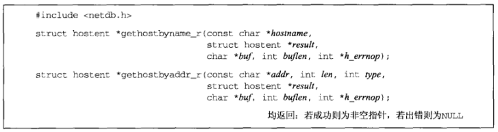

# 11.18 可重入函数

gethostbyname和gethostbyaddr是不可重入的函数，因为它们公用一个静态的hostent类型的名为host的变量（每个进程有一个副本）

可重入问题发生在**同一进程的线程之间**，信号处理函数可以看成是一个新的线程

在一个普通的UNIX进程中发生重入问题的**条件**是：从它的**主控制流**中和某个**信号处理函数**中同时调用gethostbyname或gethostbyaddr。当这个调用**信号处理函数**被调用时，该进程的**主控制流**被暂停以执行信号处理函数。如果**主控制流**被暂停时正处于执行gethostbyname期间（如该函数已经填写好host变量并即将返回），而且**信号处理函数**随后调用gethostbyname，那么该host变量将被重用，因为该进程中值存在该变量的单个副本。这么一来，原先由**主控制流**计算出的值被重写成了由**信号处理函数**调用计算出来的值

**注意一下几点**：

- 1.gethostbyname、gethostbyaddr、getservbyname、getservbyport这4个函数是**不可重入的**，因为它们都返回指向同一个静态结构的指针。**解决方法**：
  - 提供这4个函数的可重入版本，以_r结尾
  - 使用线程特定数据（26.5节）提供这些函数的可重入版本
- 2.inet_pton、inet_ntop是**可重入的**
- 3.inet_ntoa是**不可重入的**（支持线程的一些实现提供了使用线程特定数据的可重入版本）
- 4.getaddrinfo可重入的前提是由它调用的函数都可重入。即它应该调用可重入版本的gethostbynamee和getservbyname。本函数返回的结果全部存放在动态分配内存空间的原因之一就是允许它可重入
- 5.getnameinfo可重入的前提是由它调用的函数都可重入。即它应该调用可重入版本的gethostbyaddr和getservbyport。它的2个结果字符串（主机名、服务名）由调用者分配存储空间，从而允许它可重入
- 6.errno变量存在类似的问题（每个进程有一个副本）。例如：从close调用返回时把错误码存入errno到稍后由程序显示errno的值之间存在一个小的时间窗口，期间同一个进程内的另一个执行线程（如一个信号处理函数的某次调用）可能改变了errno的值。**解决方法**：
  - 在信号处理函数中不调用任何不可重入的函数
  - 可以把信号处理函数编写成预先保存并事后恢复errno的值加以避免修改
- 7.许多版本的I/O函数库是**不可重入的**，我们不应该在信号处理函数中调用标准I/O函数

## 11.19 gethostbyname_r和gethostbyaddr_r函数

有两种方法可以把**不可重入的函数改为可重入函数**：

- 1.把由不可重入函数填写并返回静态结构的做法改为**由调用者分配**再由可重入函数填写结构
  - 例子：把不可重入的gethostbyname改为可重入的gethostbyname_r
  - 缺点：比较复杂
- 2.**由可重入函数调用malloc**以动态分配内存空间
  - 例子：getaddrinfo使用该方法
  - 缺点：必须调用freeaddrinfo释放动态分配的内存空间

**gethostbyname_r和gethostbyaddr_r函数**

- **result**：指向由调用者分配并由被调用函数填写的hostent结构。成功返回时本指针作为函数的返回值
- **buf**：指向由调用者分配并且大小为**buflen**的缓冲区。该缓冲区用于存放规范主机名、别名指针数组、各个名字字符串、地址指针数组、各个实际地址。由**result**指向的hostent结构中的所有指针都指向该缓冲区内部
- **h_errnop**：如果出错，错误码通过**h_errnop**指针而不是全局变量h_errno返回